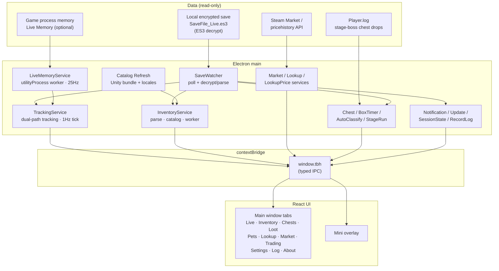

# TBH Companion

> **Language:** [简体中文](README.md) · **English**

A desktop companion app for the idle game **TBH: Task Bar Hero**. It **reads only**
your local, encrypted save file (ES3 decryption) and shows live statistics —
XP/hour, gold/hour, per-hero rates, session history — plus inventory valuation
based on Steam Market prices. You can also opt into **Live Memory**, reading the
game's process memory for more granular, sub-second data (hero levels, drop
records, etc.).

Built with **Electron + React + TypeScript**. It only **reads** your own local
save and game memory to display data; it **never modifies** the save, **never
injects input** into the game process, and **never talks to the game or its
servers**.

> A fan-made, read-only tool. Not affiliated with or endorsed by the developers
> of TBH: Task Bar Hero.

## Architecture

A four-layer layout: shared types (`shared`), framework-free domain logic
(`core`), the Electron main process (`main`), and the renderer UI (`renderer`),
bridged via `window.tbh` in `preload`. Data comes from the local encrypted save
(save polling) and optional in-game process memory (Live Memory); Steam Market
provides valuations and price history.



> The app is **read-only** end to end: it never writes to the save, never injects
> into the game, and never talks to game servers. The `core` layer has no
> Electron/Node dependency, keeping it unit-testable.

## Features

Two windows share one renderer bundle: the full tabbed companion UI (`#main`)
and a frameless always-on-top mini overlay (`#overlay`).

### Tabs

- **Live** — real-time XP/hour (held steady even between the game's periodic
  saves), gold/hour, session totals, current map and stage, per-hero level +
  XP/hour rate, XP change history, hero stats; chest drop stats broken out by
  common / stage-boss / act-boss plus the three plague categories, each with
  session, per-hour and recent windows; one-click **auto-open** toggle. Idle
  warning after 2 minutes.
- **Inventory** — owned items resolved against bundled catalogs, grouped by type
  with composition stats; search / filter / sort, Steam price and value columns,
  source breakdown; near-full detection with fill prediction; graceful handling
  of unknown items after game updates.
- **Chests** — unopened slots and capacity for six chest types (common / stage
  boss / act boss + plague common / plague stage / plague act), from base slots
  plus rune nodes and settings bonuses, with per-category progress bars; each
  card shows **auto-open time** (accounting for rune reductions); a chest codex
  section filters by category and level, showing held counts, source stages and
  drop ranges, plus **synthesis-point** valuations. Per-level stage-boss
  cooldowns and farm stages, ready/cooling timers, **Dropped** marking (manual or
  auto-detected from **Player.log**).
- **Loot** — a drop record and **auto-classify** queue (per-category serial
  processing; unclassified loot enters a FIFO queue). Open records are protected
  by high-frequency re-reads and cross-tick settle confirmation to avoid missing
  transient entries. A "time since last open" ring per category.
- **Pets** — unlock progress from your save, passive bonuses, kill targets, best
  farm stages, and where each monster appears.
- **Lookup** — box / item / offering lookup with a bundled CI-built price
  snapshot; pin favorite items to include them in local polling.
- **Market** — pick a currency and refresh Steam prices (background job can back
  off on rate limits); recent trade-volume stats and price history trends;
  optional Steam community cookies (`sessionid` / `steamLoginSecure`) to fetch
  real `pricehistory` data, falling back to locally polled samples when rate
  limited. Configurable batch size and inter-batch delay to dodge Steam limits.
- **Trading** — per-item trading cards with price line + volume bars; the main
  chart supports horizontal mouse-drag panning of the time window; cards are
  sorted by trade volume in the current window; eight filters (level, quality,
  slot, kind, name, price, volume, value), where the numeric filters share the
  main chart's time window; cards link to the codex showing quality and
  **synthesis points**.
- **Settings** — edit `config.json` (save path, poll interval, rolling window,
  currency, language, notifications, auto-open, inventory threshold, etc.);
  changes save automatically. **Item Catalog** supports an install-directory
  override so the catalog can be refreshed without code changes.
- **Log** — a unified record log of drops and events (persisted, de-duplicated).
- **About** — installed version, GitHub and release-notes links, and in-app
  updates (background check ~30s after startup; download/install only when you
  confirm).
- **Live Memory Diagnostics** (dev builds only) — offset resolution, attach
  status, and other diagnostics for the live-memory reader.

### Values & behavior

- **Synthesis points** — a chest-value scoring system computed as "drop rate ×
  per-item points"; per-item points follow a recursive quality ladder
  (common 1 → uncommon 9 → rare 81 → …) with accessories counted ×3. Shown in the
  chest codex, chest detail lists and trading cards.
- **i18n** — the full UI supports the game's 16 locale files, selectable as
  **follow system** (Auto) or **follow game**; item/map/hero names synced per
  language from the game's localization bundles on each catalog refresh.
- **Live Memory (optional)** — resolves hero/chest/stage field offsets
  dynamically via signature matching (no hard-coded tables), 25Hz polling plus
  cross-tick settle confirmation and high-frequency re-reads, backed by save
  compensation, so hero levels, waves and chest drops are neither lost nor
  regressed.
- **Notifications** — master switch in Settings; optional Windows toast when an
  update is available; chest-ready alerts are sound-only with selectable sound
  variants and preview.
- **Session restore** — live stats and rolling history resume after restart when
  your save and tracking settings are unchanged; the Mini overlay and stage-chest
  tracker reopen if they were open when you quit.
- **CSV history** — every XP change appended to `logs/xp_history.csv` when
  `logHistoryCsv` is enabled.

## Quick start

```
cd app
pnpm install
pnpm dev      # run in development (hot reload)
```

If `pnpm install` does not fetch Electron's binary, run
`node node_modules/electron/install.js` (see `AGENTS.md` for the fallback).

Build and package:

```
pnpm build       # production bundle into out/
pnpm pack        # unpacked app into release/win-unpacked
pnpm dist        # Windows NSIS installer into release/
pnpm typecheck
pnpm test
pnpm qa          # typecheck + lint + format + test + build + bundle guard
pnpm qa:dev      # dev-server smoke when the UI is not visible
```

## Configuration — `config.json`

Editable from the **Settings** tab or by hand. Stored in the app user-data folder.

| Key | Meaning | Default |
| --- | --- | --- |
| `savePath` | Path to `SaveFile_Live.es3` (env vars allowed) | LocalLow path |
| `es3Password` | ES3 decryption password | the game's built-in password |
| `pollIntervalSeconds` | How often to re-read the save | `5` |
| `rollingWindowMinutes` | Window for the "XP/hour" figure | `5` |
| `topmost` | Per-window on-top preference (main / overlay / box tracker) | — |
| `logHistoryCsv` | Append every XP change to `logs/xp_history.csv` | `true` |
| `currency` | ISO currency code for Steam prices (`USD` / `EUR` / `BRL`…) | `USD` |
| `language` | UI language (`auto` follows system, or one of 16 game locales) | `auto` |
| `notificationsEnabled` | Master switch for update toasts and app sounds | `true` |
| `notifyOnUpdateAvailable` | Windows toast when a newer release exists | `true` |
| `notificationPrefs` | Per-kind sound alerts (`chestDrop` / `chestReady`… each `{ enabled, sound }`) | see `shared/notificationCatalog.ts` |
| `notificationVolume` | Notification sound volume | — |
| `chestAutoOpenEnabled` | Per-category auto-open toggle and targets | — |
| `lootAutoClassifyEnabled` | Auto-classify unclassified loot via FIFO queue | `false` |
| `lootRingSeconds` | Per-category lap duration for the Loot drop ring | common 300 / stage 420 |
| `liveMemory` | Live-memory toggle and preferences | — |
| `lookupPricePolling` | Local polling prefs for high-value/pinned items | off by default |
| `marketAutoScanEnabled` | Auto-refresh stale prices on inventory update | `true` |
| `marketLowValueThresholdUsd` | Skip auto-scan items below this USD threshold | `0.05` |
| `marketHistoryBatchSize` | Price-history items per batch (1–100) | `10` |
| `marketHistoryBatchDelaySec` | Seconds between batches (avoid 429) | `120` |
| `marketHistoryCoverageThreshold` | History auto-refresh coverage threshold | `0.95` |
| `inventoryAlmostFullThresholdPercent` | Near-full inventory threshold percent | — |
| `steamCookieSessionid` / `steamCookieLoginSecure` | Steam community login cookies (for price history; local only) | empty |
| `gameInstallDir` | Game install-directory override (non-default Steam library) | empty |

Legacy installs may still have `chestSoundVariant`; it is migrated to
`notificationPrefs.chestReady` on first load and removed on save.

If decryption stops working after a game update, the developer may have rotated
the ES3 password; update `es3Password` and restart. See `docs/SAVE_FORMAT.md`.

## Project layout

```
app/                     # the companion app (Electron + React + TS)
  src/main/              # Electron main: save watcher, tracking, IPC, network, windows
  src/preload/           # contextBridge -> window.tbh
  src/core/              # framework-free domain logic (es3, save/snapshot, tracker, liveMemory/...)
  src/renderer/          # React UI (tabs + mini overlay; TbhProvider for IPC state)
  shared/types.ts        # shared types
  shared/ipc.ts          # IPC channel names
  shared/notificationCatalog.ts   # notification sound catalog
  shared/locales/        # i18n language resources
  test/                  # Vitest (core / main / ipc / renderer / integration)
config.json              # default settings (overridden by userData copy)
data/                    # bundled catalogs (gamedata.json, stage_boxes.json, locale_strings_*.json...)
docs/                    # architecture, save format, business flows, decisions, findings
website/                 # single-page landing (download link, stats, feature overview)
```

## Website

Single-page landing with download link, GitHub stats, and a feature overview:
**https://zioon.github.io/tbh-companion/**

Preview locally without deploying (serves `website/` over HTTP — required for the
stats API and `data/release.json`):

```
npx --yes serve website -p 4173
```

Then open **http://localhost:4173** and hard-refresh. Do not open `index.html`
directly (`file://`) — the browser blocks fetches to GitHub and local JSON.

The download button uses [`website/data/release.json`](website/data/release.json)
first (direct `.exe` link), then refreshes from the GitHub API when available;
stars and total downloads come from the GitHub API. The page auto-deploys to
GitHub Pages on `main` pushes via `pages.yml`.

## Further reading

- [`AGENTS.md`](AGENTS.md) — onboarding brief for contributors/agents.
- [`docs/BUSINESS-FLOWS.md`](docs/BUSINESS-FLOWS.md) — single source of truth for
  every business flow (save parsing, dual-path tracking, live memory, chests/drops,
  market, notifications, updates; 23 chapters).
- [`docs/ARCHITECTURE.md`](docs/ARCHITECTURE.md) — processes, IPC boundary, windows, data flow.
- [`docs/SAVE_FORMAT.md`](docs/SAVE_FORMAT.md) — ES3 decryption and save JSON structure.
- [`docs/DATA-UPDATE.md`](docs/DATA-UPDATE.md) — how to regenerate gamedata/lookup/icons/locales after a game update.

## Disclaimer

Fan-made, read-only tool. Not affiliated with or endorsed by the developers of
TBH: Task Bar Hero.