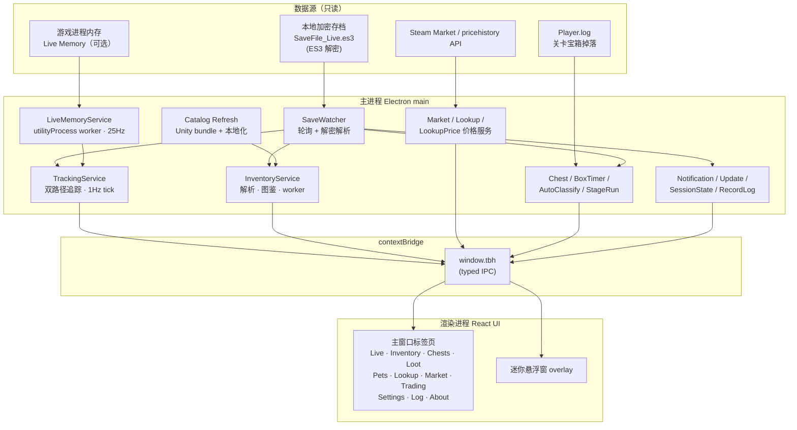

# TBH Companion

> **语言 / Language：** **简体中文** · [English](README.en.md)

放置类游戏 **TBH: Task Bar Hero** 的桌面伴侣应用。它以**只读**方式读取你本地的加密存档（ES3 解密），并实时展示统计信息——XP/小时、金币/小时、每位英雄的速率、会话历史，以及基于 Steam 市场价格的库存估值。你还可以选择启用**实时内存读取**，获得比存档轮询更精细的毫秒级数据（英雄等级、掉落记录等）。

基于 **Electron + React + TypeScript**。它只**读取**你本地的存档与游戏内存来展示数据，**从不修改**存档、**从不向游戏进程注入输入**、也**从不与游戏或游戏服务器通信**。

> 粉丝自制、只读工具。与 TBH: Task Bar Hero 的开发者没有任何关联，也未获其背书。

## 架构

采用四层分层：共享类型（`shared`）、纯领域逻辑（`core`）、Electron 主进程（`main`）、渲染进程 UI（`renderer`），经 `preload` 的 `window.tbh` 桥接。数据来自本地加密存档（存档轮询）与可选的游戏内实时内存（Live Memory），Steam Market 用于估值与历史走势。



> 从头到尾应用**只读**：不写入存档、不向游戏注入输入、不与游戏服务器通信。核心层（`core`）不依赖 Electron / Node，保持可单元测试。

## 特性

两个窗口共享同一份渲染产物：完整的标签页伴侣界面（`#main`）与无边框置顶的迷你悬浮窗（`#overlay`）。

### 标签页

- **Live 实时** — 实时 XP/小时（在游戏两次周期存档之间也能稳定测算）、金币/小时、会话累计、当前地图与关卡、每位英雄的等级 + XP/小时速率、XP 变化历史、英雄统计；宝箱掉率统计细分到普通 / 关卡首领 / 章节首领以及瘟疫三类，其中各类含会话、每小时、近期三个口径；一键切换**自动开箱**。空闲 2 分钟后给出挂机提示。
- **Inventory 背包** — 将拥有物对照内置图鉴解析，按类型分组并给出构成统计；搜索 / 筛选 / 排序、Steam 价格与估值列、来源分布；背包接近满时给出填充预测提示；对游戏更新后的未知物品做优雅降级。
- **Chests 宝箱** — 六类宝箱（普通 / 关卡首领 / 章节首领 + 瘟疫普通 / 瘟疫关卡 / 瘟疫章节）的未开槽位与容量（基础槽位 + 符文节点 + 设置加成），每类带进度条；每张卡片显示**自动开箱所需时间**（含符文减时后的实际耗时）；宝箱图鉴区支持按分类与等级筛选，展示持有数量、来源关卡与掉落区间，并给出**合成点数**估值。关卡首领追踪器提供关卡级冷却与农场关卡、待命/冷却计时、**掉落提示**（可手动标记 **Dropped** 或从 **Player.log** 自动检测）。
- **Loot 掉落记录** — 掉落记录与**自动分类**队列（按类别串行处理，未分类掉落进入 FIFO 队列）；开箱记录经高频抢读与跨 tick 稳态确认，避免瞬时条目漏记。掉落计时圈展示当前地图刷了一圈后距上次开箱的时间。
- **Pets 宠物** — 从存档解析的宠物解锁进度、被动加成、击杀目标、最佳农场关卡，以及每种怪物的出现位置。
- **Lookup 图鉴** — box / item / offering 查询，附带 CI 构建的本地价格快照；可收藏重点物品以纳入本地轮询。
- **Market 市场** — 选择货币后刷新 Steam 价格（存档加载时后台刷新，遇限流自动退避）；近期交易额统计、价格历史走势；可通过 Steam 社区 Cookie（`sessionid` / `steamLoginSecure`）拉取 `pricehistory` 历史价格，限流时自动回退到本地轮询采样走势。可配置批量拉取与批间间隔来规避 Steam 限流。
- **Trading 交易** — 物品交易卡片，包含价格走势折线 + 成交量柱状图，主图表支持鼠标水平拖拽平移时间窗口；卡片按当前时间窗口内的成交额降序排序；支持等级 / 品质 / 部位 / 种类 / 名称 / 价格 / 成交量 / 成交额八维筛选，其中数值筛选口径与主图表时间窗口联动；卡片关联图鉴展示品质与**合成点数**。
- **Settings 设置** — 编辑 `config.json`：存档路径、轮询间隔、滚动窗口、货币、语言、通知、自动开箱、背包阈值等；改动自动保存。**Item Catalog** 支持新装目录覆盖以便在图鉴刷新时免改代码。
- **Log 记录日志** — 统一记录所有掉落与事件的日志页（持久化 + 去重）。
- **About 关于** — 已安装版本、GitHub 与发布说明链接、应用内更新（启动后约 30 秒后台检查，仅在你确认后下载 / 安装）。
- **Live Memory 诊断**（仅开发构建） — 实时内存读取的偏移解析、附加状态等诊断信息。

### 数值与交互

- **合成点数** — 以「掉率 × 单件点」为口径的宝箱价值评价体系；单件点按品质经成功率递归阶梯确定（普通 1 → 少见 9 → 稀有 81 → …），饰品类按 3 倍计数。展示于宝箱图鉴 / 宝箱详情内容列表与交易卡片。
- **多语言（i18n）** — 完整 UI 支持 16 种游戏语言配置文件，设置中可选 **跟随系统**（Auto）或 **跟随游戏**；物品名 / 地图名 / 英雄名等游戏数据在每次图鉴刷新时按所选语言从游戏的本地化 bundle 同步。
- **实时内存（Live Memory，可选）** — 通过签名匹配动态解析英雄 / 宝箱 / 关卡等字段偏移（不依赖硬编码表），25Hz 轮询 + 跨 tick 稳态确认 + 高频抢读，配合存档补偿机制，保证英雄级数、波次、开箱掉落等数据既不丢又不回退。
- **通知** — 设置中的总开关；可选更新可用时的 Windows 通知；宝箱就绪等用纯声音提示（多种音效变体可选并支持试听）。
- **会话恢复** — 存档与追踪设置未变时，重启后实时统计与滚动历史自动恢复；退出时若迷你悬浮窗与关卡宝箱追踪器处于开启状态，则重新打开时恢复。
- **CSV 历史** — 开启 `logHistoryCsv` 后，每次 XP 变化追加到 `logs/xp_history.csv`。

## 快速开始

```
cd app
pnpm install
pnpm dev      # 开发模式运行（热更新）
```

若 `pnpm install` 未拉取 Electron 二进制，执行 `node node_modules/electron/install.js`（手动回退细节见 `AGENTS.md`）。

构建与打包：

```
pnpm build       # 生产 bundle 输出到 out/
pnpm pack        # 未打包应用到 release/win-unpacked
pnpm dist        # Windows NSIS 安装包到 release/
pnpm typecheck
pnpm test
pnpm qa          # typecheck + lint + format + test + build + bundle 守卫
pnpm qa:dev      # UI 不可见时的自动化开发冒烟测试
```

## 配置 — `config.json`

可在 **Settings** 标签页编辑，也可手改。存放于应用 user-data 目录。

| 键 | 含义 | 默认 |
| --- | --- | --- |
| `savePath` | `SaveFile_Live.es3` 路径（支持环境变量） | LocalLow 路径 |
| `es3Password` | ES3 解密密码 | 游戏内置密码 |
| `pollIntervalSeconds` | 隔多久重新读取一次存档 | `5` |
| `rollingWindowMinutes` | “XP/小时”的滚动窗口 | `5` |
| `topmost` | 各窗口（主 / 悬浮窗 / 宝箱追踪）的“置顶”偏好 | — |
| `logHistoryCsv` | 每次 XP 变化追加到 `logs/xp_history.csv` | `true` |
| `currency` | Steam 市场价格的 ISO 货币代码（`USD` / `EUR` / `BRL`…） | `USD` |
| `language` | UI 语言（`auto` 跟随系统，或 16 种游戏语言之一） | `auto` |
| `notificationsEnabled` | 更新 toast 与应用内提示音的开关 | `true` |
| `notifyOnUpdateAvailable` | 有新版可用时的 Windows 通知 | `true` |
| `notificationPrefs` | 按类型的声音提示（`chestDrop` / `chestReady`… 各含 `{ enabled, sound }`） | 见 `shared/notificationCatalog.ts` |
| `notificationVolume` | 提示音量 | — |
| `chestAutoOpenEnabled` | 各类别自动开箱开关与目标 | — |
| `lootAutoClassifyEnabled` | 通过 FIFO 掉落队列自动分类未分类战利品 | `false` |
| `lootRingSeconds` | Loot 页掉落计时圈各类别满圈时长 | common 300 / stage 420 |
| `liveMemory` | 实时内存读取的开关与偏好 | — |
| `lookupPricePolling` | 本地高价值 / 重点物品价格轮询偏好 | 默认关闭 |
| `marketAutoScanEnabled` | 库存更新时是否对过期物自动刷新价格 | `true` |
| `marketLowValueThresholdUsd` | 自动扫描跳过低于该 USD 阈值的物品 | `0.05` |
| `marketHistoryBatchSize` | 价格历史每批拉取数量（1–100） | `10` |
| `marketHistoryBatchDelaySec` | 批间等待秒数（规避 429） | `120` |
| `marketHistoryCoverageThreshold` | 历史自动刷新覆盖阈值 | `0.95` |
| `inventoryAlmostFullThresholdPercent` | 背包接近满的阈值百分比 | — |
| `steamCookieSessionid` / `steamCookieLoginSecure` | Steam 社区登录 Cookie（用于拉取价格历史；仅存本地） | 空 |
| `gameInstallDir` | 游戏安装目录覆盖（非默认 Steam 库安装时） | 空 |

旧安装可能仍有 `chestSoundVariant`，会在首次加载时迁移到 `notificationPrefs.chestReady` 并在保存时移除。

若游戏更新后解密失效，开发者可能轮换了 ES3 密码；更新 `es3Password` 并重启即可。更多见 `docs/SAVE_FORMAT.md`。

## 目录结构

```
app/                     # 伴侣应用（Electron + React + TS）
  src/main/              # Electron 主进程：存档监听、解密、追踪、IPC、网络
  src/preload/           # contextBridge -> window.tbh
  src/core/              # 无框架依赖的领域逻辑（es3、save/snapshot、tracker、liveMemory/...）
  src/renderer/          # React UI（标签页 + 迷你悬浮窗；TbhProvider 共享 IPC 状态）
  shared/types.ts        # 跨进程共享类型
  shared/ipc.ts          # IPC 通道名
  shared/notificationCatalog.ts   # 通知声音目录
  shared/locales/        # i18n 语言资源
  test/                  # Vitest（core / main / ipc / renderer / integration）
config.json              # 默认设置（被 userData 副本覆盖）
data/                    # 内置数据（gamedata.json、stage_boxes.json、locale_strings_*.json 等）
docs/                    # 架构、存档格式、业务流程、决策、研究成果
website/                 # 单页落地页（下载链接、统计、特性概览）
```

## 网站

单页落地页，含下载链接、GitHub 统计与特性概览：**https://zioon.github.io/tbh-companion/**

本地预览而不部署（需经 HTTP 提供 `website/`——统计 API 与 `data/release.json` 需要）：

```
npx --yes serve website -p 4173
```

然后打开 **http://localhost:4173** 并硬刷新。不要直接用 `file://` 打开 `index.html`——浏览器会阻止对 GitHub 与本地 JSON 的请求。

下载按钮优先使用 [`website/data/release.json`](website/data/release.json) 中的直链 `.exe`，随后再从 GitHub API 刷新；星标与下载数仍来自 GitHub API。页面经 `pages.yml` 在 `main` 分支推送时自动部署到 GitHub Pages。

## 更多文档

- [`AGENTS.md`](AGENTS.md) — 供接手此项目的 agent / 贡献者的上手说明。
- [`docs/BUSINESS-FLOWS.md`](docs/BUSINESS-FLOWS.md) — 全部业务流程的单一真理源（存档解析、双路径追踪、实时内存、宝箱 / 掉落、市场、通知、更新等 23 章）。
- [`docs/ARCHITECTURE.md`](docs/ARCHITECTURE.md) — 进程、IPC 边界、窗口、数据流。
- [`docs/SAVE_FORMAT.md`](docs/SAVE_FORMAT.md) — ES3 解密与存档 JSON 结构。
- [`docs/DATA-UPDATE.md`](docs/DATA-UPDATE.md) — 游戏版本更新后重新生成 gamedata / lookup / 图标 / 本地化的操作手册。

## 免责声明

粉丝自制、只读工具。与 TBH: Task Bar Hero 的开发者无关联，也未获其背书。