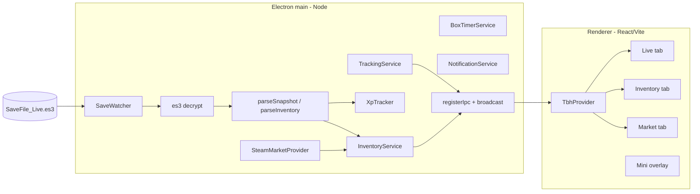

# Architecture

Single-language TypeScript app: an Electron desktop shell hosting a React/Vite
UI. All save-decryption and tracking logic lives in a framework-free `core/`
that is unit-tested independently.

## Processes

Entry bootstrap: `app/src/main/index.ts` (~25 lines) → `app/appState.ts` wires
`TrackingService`, `InventoryService`, and IPC handlers. Window paths live in
`main/paths.ts` only.

## Boundaries

- **main** owns all file system access, decryption, network (Steam), and the
  tracker state. It is the only place secrets/paths are touched.
- **preload** exposes a narrow, typed `window.tbh` API via `contextBridge`
  (channel names from `shared/ipc.ts`). No direct Node access leaks into the
  renderer.
- **renderer** is pure React UI. `TbhProvider` registers one IPC listener per
  channel; tabs consume `useStats` / `useInventory` / `usePrices`.
- **core** (`es3`, `save/snapshot`, `tracker`, `stages`, `heroes`, `gamedata`,
  `inventory/*`) has no Electron/React imports so it can be unit-tested with Vitest.

No local HTTP server: main ↔ renderer communicate over Electron IPC.

## Diagnostic logging

Main process writes support logs to `userData/logs/app.log` via `app/src/main/log.ts`
(`electron-log`, 1 MB rotation). Renderer errors are forwarded through IPC
(`LOG_RENDERER_ERROR`) so users send a single file. **core/** never imports the
logger. See `docs/DIAGNOSTIC_LOGGING.md` for how agents should add logs to new features.

## Windows

Two `BrowserWindow`s load the same Vite bundle on different routes:

- **Full companion window** — resizable, tabbed (Live / Inventory / Market / Chests / Pets /
  Settings / About).
- **Mini overlay** (`/overlay`) — frameless, always-on-top, draggable, compact;
  toggled from the tab bar **Mini** button.
- **Stage chest tracker** (`/box-tracker`) — frameless overlay for tracked cooldown timers;
  opened from the Chests tab or toolbar.

## Notifications

`NotificationService` (main) reads `AppConfig` notification fields:

- **`notificationsEnabled`** — master gate for all notification behavior.
- **`notificationVolume`** — global sound volume **0–100** (default 100). At 0, WAV alerts are silent.
- **`notifyOnUpdateAvailable`** — when enabled, `UpdateService` triggers a Windows OS
  notification (Electron `Notification`) for a new GitHub release; click focuses the main window.
- **`notificationPrefs`** — per-kind sound settings (see `shared/notificationCatalog.ts`):
  - **`chestDrop`** — when a **tracked** stage boss box drops (manual **Dropped** button or live-memory
    GetBox log for an enabled route). Common chests do not trigger this sound.
  - **`chestReady`** — when a tracked route's cooldown finishes and **Notify when ready** is on
    for that box (`BoxTimerService` → `showChestReady`).
  - **`heroLevelUp`** — when a hero's level increases between save reads (`TrackingService` →
    `showHeroLevelUp`).

Each kind has `enabled` and `sound` (catalog id or `none`). Sounds play in the renderer via
[Howler.js](https://howlerjs.com/) (bundled WAV assets, volume 0–1). Main sends
`play-notification-sound` IPC when an alert fires. Legacy `chestSoundVariant` in
old configs migrates to `notificationPrefs.chestReady` on load.

Per-box **Notify when ready** toggles live in `box_timers.json` (Chests tab), not in `config.json`.
Settings exposes per-kind **Preview sound** in the renderer (Howler, same path as live alerts).

## Settings persistence

The Settings tab patches `config.json` through IPC on each change (`savePartial` →
`saveConfig` in main). There is no Save/Reset bar. Changing **rolling window (minutes)** still
prompts for confirmation in the renderer because it resets live session stats via `configPatch`.

## Data flow (live stats)

1. `SaveWatcher` notices `SaveFile_Live.es3` mtime changed (poll interval from config).
2. Reads bytes (with a short retry for mid-write sharing violations).
3. `es3.decrypt` → `parseSnapshot` → `SaveSnapshot`.
4. `XpTracker.update(snap)` computes XP/gold/per-hero rates (positive deltas
   only, rates keyed on mtime, held constant between changes) and appends to
   history on change.
5. `TrackingService` pushes `Stats` over IPC; the renderer updates via `TbhProvider`.

When **live memory** is enabled (`config.liveMemory.enabled` + consent), a parallel path runs:

1. `LiveMemoryService` forks a `utilityProcess` worker that attaches read-only to `TaskBarHero.exe`.
2. The worker resolves offsets (bundled table → disk cache → runtime extractor → degraded) and polls
   ~25 Hz, posting `LiveMemorySnapshot` frames to main. The extractor carries a revision counter
   (`EXTRACTOR_REVISION`); bumps invalidate stale per-version attempt markers and reopen completeness
   checks when new offset fields ship (e.g. stage-clear log fields at rev 4).
3. `TrackingService.ingestLiveFrame` feeds `XpTracker.updateLive` (XP/gold rates from wall-time
   samples; per-hero exp deltas with plausibility guards) and `ChestDropTracker.recordLiveChestDrop`
   (GetBox log categories). Stage-boss drops call `BoxTimerService.tryMarkDroppedFromLiveStage` when
   the drop stage maps to an **enabled** tracker route. `StageClearLog` events feed
   `StageRunService.recordClear` with the run's duration and XP/gold gained (delta of
   `XpTracker.currentTotalXp`/`currentGold` since the previous clear; multiple clears in one tick split
   the frame delta evenly) — persisted independently of session state in `stage_run_history.json`
   (restore validates entries, caps at 200 rows; UI shows last 20), shown as the Live tab's
   "Stage clear history" while the reader is on.
4. `buildStats` blends live-preferred / save-fallback per stat; session snapshots persist every 15s with
   implausible totals discarded on restore.

## Data flow (inventory)

1. Same save read also runs `parseInventory` (with catalog-aware aggregate merge).
2. `InventoryService.resolveAndPushInventory` resolves rows against `GameDataProvider`
   + Steam price cache, then broadcasts `ResolvedInventory`.
3. Price refresh uses gear market hash suffix **A** only (`core/marketName.ts`).

## Internationalization

The renderer, main process, and shared layer all share one i18next instance per
process via `react-i18next` (renderer) and `i18next` directly (main/preload).
Locales live under `app/shared/locales/{en,zh-CN,ja,ko}/` as one JSON file per
namespace (16 namespaces mirror the renderer's tab/feature split, e.g. `live`,
`market`, `settings`, `common`). The English JSON is the source of truth; the
other three languages mirror its key shape and fall back to English on missing
keys via i18next's default fallback chain.

**16 语言支持：** `APP_LANGUAGES` 覆盖游戏支持的全部 16 种语言（en、zh-CN、
zh-Hant、fr-FR、de-DE、es-ES、id-ID、ja、ko、pl-PL、pt-BR、ru-RU、th-TH、tr-TR、
uk-UA、vi-VN）。其中 4 种（en、zh-CN、ja、ko）有完整的 UI 翻译 JSON；其余 12 种
的 UI 字符串暂时引用 en bundle 作为占位（`LOCALE_RESOURCES` 中直接复用 `en`
对象），后续可逐语言补齐。**游戏内 labels**（grades / types / stats / classes /
gearGroups）通过 catalog refresh 时从游戏 locale bundle 动态提取，每种语言都有
独立的翻译，因此 12 种新语言在游戏内容部分仍然是原生语言显示（详见下文
「游戏 locale 自动同步」段）。

`AppLanguage` (`app/shared/language.ts`) is the persisted config value: one of
the 16 concrete locales in `APP_LANGUAGES`, or `"auto"` / `"game"`. The runtime
`ResolvedLanguage` is one of the 16 concrete locales and is derived by
`resolveLanguage(language, systemLocale, gameLanguage?)`:

- `"auto"` — follows the OS locale, falling back to English.
- `"game"` — follows the game's in-app language preference, read from the
  Windows registry key `HKCU\Software\TesseractStudio\TaskBarHero\tbh_lang_idx_h1851722218`
  (REG_DWORD, mapped via `GAME_LANG_IDX_TO_RESOLVED`). The registry read is
  cached for 5 s in main (`readGameLanguage` in `src/main/i18n.ts`) using
  `node:child_process.execSync` with `reg query` — zero new native deps. When
  the registry value is missing or maps to an unsupported locale, `"game"`
  falls back to `"auto"` behavior.

The resolved language is **never persisted to `config.json`**. Instead, the
main process injects it into the existing `getConfig` IPC return value as the
runtime-only `AppConfig.resolvedLanguage` field, so the renderer can boot
i18next with the right locale on first paint without re-reading the registry
or adding a new IPC channel. The Settings tab's language selector calls
`savePartial({ language: "game" })` first (so main re-reads the registry and
updates its i18n instance), then re-fetches `getConfig` to obtain the freshly
resolved locale before calling `changeRendererLanguage`.

Both processes initialize i18next at startup (`initMainI18n` in main,
`initRendererI18n` in renderer) and re-run `changeLanguage` on language
switch. Renderer components read strings via `useTranslation(namespace)` and
the `t(key)` hook. Module-level catalogs that used to hold English labels
(e.g. What's New entries, settings option lists) now store `labelKey` /
`descriptionKey` / `titleKey` / `bulletsKey` strings and resolve them at
render time so a language switch takes effect without a reload.

### 游戏数据的本地化（Locale Catalog）

i18next 命名空间只覆盖 UI 字符串；游戏中动态产生的数据——地图名、英雄名、
物品名——来自游戏的 Unity Localization bundle，不是 UI 字符串，因此另走一套
独立的本地化链路。实现分为四层：

- **离线提取**：`scripts/extract_locale_catalog.py` 从游戏的 4 个 locale
  bundle（en-us / zh-hans / ja-jp / ko-kr）+ `SharedTableData` 中提取翻译，
  输出 4 份 JSON 到 `data/locale_strings_{en,zh-CN,ja,ko}.json`。每份文件
  包含四个映射表：`items`（511 件物品，按 `ItemName_` key）、`stages`
  （30 张地图，按 4 位 `<act><stage>` 编号）、`heroes`（6 位英雄）、
  `difficulties`（NORMAL / NIGHTMARE / HELL / TORMENT）。12 种新语言没有
  离线 JSON —— `core/localeCatalog.ts` 的 `LANG_TO_FILENAME` 把它们映射到
  `locale_strings_en.json`（英文兜底），直到补齐专属翻译。

### 游戏 locale 自动同步（runtime label sync）

除了离线 catalog（item/stage/hero/difficulty 名），companion 还在每次
catalog refresh 时从游戏 bundle 动态提取所有 16 种语言的 labels（grades /
types / stats / classes / gearGroups 等），合并到 i18next 资源中。这条链路
保证 12 种新语言虽然没有 UI 翻译 JSON，但游戏内内容（如装备品质名「Rare」
→「稀有」、英雄职业名等）仍以玩家选择的语言显示。

- **动态扫描**：`main/catalogRefreshService.ts` 的 `resolveAssetPaths` 用
  `readdirSync` 扫描 `StreamingAssets/aa/StandaloneWindows64/` 下所有
  `localization-string-tables-*_assets_all*.bundle` 文件，通过
  `parseLocaleBundleFilename` 从文件名中解析 BCP-47 代码（如
  `(zh-hans)` → `zh-CN`、`(vi-vn)` → `vi-VN`），自动发现全部 16 种语言
  bundle（包括 vi-VN 的 `_assets_all_<hash>.bundle` 变体）。无需硬编码
  语言数量，游戏未来新增语言也自动支持。
- **提取**：`core/unityAssets/localeExtractor.ts` 的 `extractLocales` 接收
  `Record<lang, Buffer>` 动态输入，输出 `Record<lang, Record<key, value>>`。
  每种语言独立提取，缺失的 bundle 返回空 map（不报错）。
- **存储**：提取结果作为 `GameLocaleData.locales` 写入 `userData/locale.json`，
  通过现有 `getLocaleData` IPC 通道（零新增 channel）传给渲染层。
- **合并**：`renderer/i18n.ts` 的 `tryMergeGameLocale` 遍历
  `localeData.locales` 的所有 key，对每种语言调用
  `flatGameKeysToLabels` 转换为 i18next labels namespace 格式，然后
  `i18next.addResourceBundle(lang, "common", { labels })` 合并。游戏值
  优先于 bundled 值，保证翻译与游戏保持同步。
- **运行时加载**：`app/src/core/localeCatalog.ts` 的 `loadLocaleCatalog(lang)`
  通过 `core/bundledData.readBundledJson` 同步读取对应语言的 JSON，按
  `ResolvedLanguage` 缓存到进程生命周期（catalog 内容运行期不变，切换语言
  时新建一个缓存条目而非原地修改）。`LocaleCatalog` 是纯数据结构，通过
  service 构造函数注入到 main 端服务，core 层不依赖 Electron / fetch。
- **服务端注入**：`app/src/main/app/appState.ts` 的 `reloadLocaleCatalog()`
  在启动期间和语言切换时各调用一次，将 catalog 注入到 5 个 main 服务：
  `TrackingService` / `BoxTimerService` / `StageRunService` / `InventoryService` /
  `LiveMemoryService`。每个服务通过 `setLocaleCatalog(catalog)` 更新内部
  状态。`setLocaleCatalog` 自身不主动 re-broadcast；语言切换后由调用方显式
  触发 re-emit，渲染层立即收到新本地化名称。
- **IPC 字段扩展**：本地化名称通过现有 IPC 通道的 payload 字段传递，**不新增
  IPC 通道**：
  - `Stats.stageName`（`onStats`）
  - `StageRunHistoryEntry.stageName?`（`onStageRuns`）
  - `HistoryEntry.stageName?`（`onStats.history`，由 main 端 `buildStats`
    填充）
  - `BoxTimerState.currentStageLabel`（`onBoxTimers`）
  - `LiveHeroData.name?`（`onLiveMemory`）
  - `ResolvedInventory.rows[].name`（`onInventory`，post-process 阶段填充）
  - `AppConfig.stageMetadata?`（`getConfig`，120 条 stageKey → 名称映射，
    供渲染层做文本匹配）

**渲染层只读**：renderer 不再 import `core/stages` 或 `core/heroes`，所有
本地化名从 IPC payload 字段读取。`boxLootFilters` 通过 `AppConfig.stageMetadata`
进行文本匹配，而非直接查 core 的 stage 表。

注意事项：

- 5,224 件硬编码英文名的装备物品（无 `ItemName_` key）不本地化，原样返回
  英文。
- `marketHashName` 始终保留英文（Steam 市场依赖英文名做查价与链接）。
- 切换语言时，5 个服务会重新广播当前状态，渲染层无需重新加载窗口即可看到
  新本地化名。

## Tests

Vitest layout mirrors source:

- `test/core/` — pure domain logic
- `test/main/` — config, paths, IPC helpers
- `test/ipc/` — channel parity
- `test/renderer/` — UI helpers
- `test/integration/` — optional local save (`realSave.test.ts`, skipped in CI)

Run `npm run qa` before merge (typecheck + tests + build + bundle guards).
