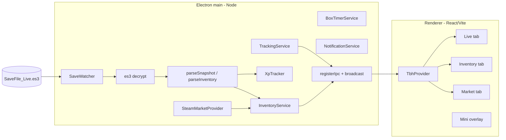

# Architecture

Single-language TypeScript app: an Electron desktop shell hosting a React/Vite
UI. All save-decryption and tracking logic lives in a framework-free `core/`
that is unit-tested independently.

## Processes

Entry bootstrap: `app/src/main/index.ts` (~25 lines) → `app/appState.ts` wires
`TrackingService`, `InventoryService`, and IPC handlers. Window paths live in
`main/paths.ts` only.

## Boundaries

- **main** owns all file system access, decryption, network (Steam), and the
  tracker state. It is the only place secrets/paths are touched.
- **preload** exposes a narrow, typed `window.tbh` API via `contextBridge`
  (channel names from `shared/ipc.ts`). No direct Node access leaks into the
  renderer.
- **renderer** is pure React UI. `TbhProvider` registers one IPC listener per
  channel; tabs consume `useStats` / `useInventory` / `usePrices`.
- **core** (`es3`, `save/snapshot`, `tracker`, `stages`, `heroes`, `gamedata`,
  `inventory/*`) has no Electron/React imports so it can be unit-tested with Vitest.

No local HTTP server: main ↔ renderer communicate over Electron IPC.

## Diagnostic logging

Main process writes support logs to `userData/logs/app.log` via `app/src/main/log.ts`
(`electron-log`, 1 MB rotation). Renderer errors are forwarded through IPC
(`LOG_RENDERER_ERROR`) so users send a single file. **core/** never imports the
logger. See `docs/DIAGNOSTIC_LOGGING.md` for how agents should add logs to new features.

## Windows

Two `BrowserWindow`s load the same Vite bundle on different routes:

- **Full companion window** — resizable, tabbed (Live / Inventory / Market / Chests / Pets /
  Settings / About).
- **Mini overlay** (`/overlay`) — frameless, always-on-top, draggable, compact;
  toggled from the tab bar **Mini** button.
- **Stage chest tracker** (`/box-tracker`) — frameless overlay for tracked cooldown timers;
  opened from the Chests tab or toolbar.

## Notifications

`NotificationService` (main) reads `AppConfig` notification fields:

- **`notificationsEnabled`** — master gate for all notification behavior.
- **`notificationVolume`** — global sound volume **0–100** (default 100). At 0, WAV alerts are silent.
- **`notifyOnUpdateAvailable`** — when enabled, `UpdateService` triggers a Windows OS
  notification (Electron `Notification`) for a new GitHub release; click focuses the main window.
- **`notificationPrefs`** — per-kind sound settings (see `shared/notificationCatalog.ts`):
  - **`chestDrop`** — when a **tracked** stage boss box drops (manual **Dropped** button or live-memory
    GetBox log for an enabled route). Common chests do not trigger this sound.
  - **`chestReady`** — when a tracked route's cooldown finishes and **Notify when ready** is on
    for that box (`BoxTimerService` → `showChestReady`).
  - **`heroLevelUp`** — when a hero's level increases between save reads (`TrackingService` →
    `showHeroLevelUp`).

Each kind has `enabled` and `sound` (catalog id or `none`). Sounds play in the renderer via
[Howler.js](https://howlerjs.com/) (bundled WAV assets, volume 0–1). Main sends
`play-notification-sound` IPC when an alert fires. Legacy `chestSoundVariant` in
old configs migrates to `notificationPrefs.chestReady` on load.

Per-box **Notify when ready** toggles live in `box_timers.json` (Chests tab), not in `config.json`.
Settings exposes per-kind **Preview sound** in the renderer (Howler, same path as live alerts).

## Settings persistence

The Settings tab patches `config.json` through IPC on each change (`savePartial` →
`saveConfig` in main). There is no Save/Reset bar. Changing **rolling window (minutes)** still
prompts for confirmation in the renderer because it resets live session stats via `configPatch`.

## Data flow (live stats)

1. `SaveWatcher` notices `SaveFile_Live.es3` mtime changed (poll interval from config).
2. Reads bytes (with a short retry for mid-write sharing violations).
3. `es3.decrypt` → `parseSnapshot` → `SaveSnapshot`.
4. `XpTracker.update(snap)` computes XP/gold/per-hero rates (positive deltas
   only, rates keyed on mtime, held constant between changes) and appends to
   history on change.
5. `TrackingService` pushes `Stats` over IPC; the renderer updates via `TbhProvider`.

When **live memory** is enabled (`config.liveMemory.enabled` + consent), a parallel path runs:

1. `LiveMemoryService` forks a `utilityProcess` worker that attaches read-only to `TaskBarHero.exe`.
2. The worker resolves offsets (bundled table → disk cache → runtime extractor → degraded) and polls
   ~25 Hz, posting `LiveMemorySnapshot` frames to main. The extractor carries a revision counter
   (`EXTRACTOR_REVISION`); bumps invalidate stale per-version attempt markers and reopen completeness
   checks when new offset fields ship (e.g. stage-clear log fields at rev 4).
3. `TrackingService.ingestLiveFrame` feeds `XpTracker.updateLive` (XP/gold rates from wall-time
   samples; per-hero exp deltas with plausibility guards) and `ChestDropTracker.recordLiveChestDrop`
   (GetBox log categories). Stage-boss drops call `BoxTimerService.tryMarkDroppedFromLiveStage` when
   the drop stage maps to an **enabled** tracker route. `StageClearLog` events feed
   `StageRunService.recordClear` with the run's duration and XP/gold gained (delta of
   `XpTracker.currentTotalXp`/`currentGold` since the previous clear; multiple clears in one tick split
   the frame delta evenly) — persisted independently of session state in `stage_run_history.json`
   (restore validates entries, caps at 200 rows; UI shows last 20), shown as the Live tab's
   "Stage clear history" while the reader is on.
4. `buildStats` blends live-preferred / save-fallback per stat; session snapshots persist every 15s with
   implausible totals discarded on restore.

## Data flow (inventory)

1. Same save read also runs `parseInventory` (with catalog-aware aggregate merge).
2. `InventoryService.resolveAndPushInventory` resolves rows against `GameDataProvider`
   + Steam price cache, then broadcasts `ResolvedInventory`.
3. Price refresh uses gear market hash suffix **A** only (`core/marketName.ts`).

## Internationalization

The renderer, main process, and shared layer all share one i18next instance per
process via `react-i18next` (renderer) and `i18next` directly (main/preload).
Locales live under `app/shared/locales/{en,zh-CN,ja,ko}/` as one JSON file per
namespace (16 namespaces mirror the renderer's tab/feature split, e.g. `live`,
`market`, `settings`, `common`). The English JSON is the source of truth; the
other three languages mirror its key shape and fall back to English on missing
keys via i18next's default fallback chain.

`AppLanguage` (`app/shared/language.ts`) is the persisted config value:
`"en" | "zh-CN" | "ja" | "ko" | "auto" | "game"`. The runtime
`ResolvedLanguage` is one of the four concrete locales and is derived by
`resolveLanguage(language, systemLocale, gameLanguage?)`:

- `"auto"` — follows the OS locale, falling back to English.
- `"game"` — follows the game's in-app language preference, read from the
  Windows registry key `HKCU\Software\TesseractStudio\TaskBarHero\tbh_lang_idx_h1851722218`
  (REG_DWORD, mapped via `GAME_LANG_IDX_TO_RESOLVED`). The registry read is
  cached for 5 s in main (`readGameLanguage` in `src/main/i18n.ts`) using
  `node:child_process.execSync` with `reg query` — zero new native deps. When
  the registry value is missing or maps to an unsupported locale, `"game"`
  falls back to `"auto"` behavior.

The resolved language is **never persisted to `config.json`**. Instead, the
main process injects it into the existing `getConfig` IPC return value as the
runtime-only `AppConfig.resolvedLanguage` field, so the renderer can boot
i18next with the right locale on first paint without re-reading the registry
or adding a new IPC channel. The Settings tab's language selector calls
`savePartial({ language: "game" })` first (so main re-reads the registry and
updates its i18n instance), then re-fetches `getConfig` to obtain the freshly
resolved locale before calling `changeRendererLanguage`.

Both processes initialize i18next at startup (`initMainI18n` in main,
`initRendererI18n` in renderer) and re-run `changeLanguage` on language
switch. Renderer components read strings via `useTranslation(namespace)` and
the `t(key)` hook. Module-level catalogs that used to hold English labels
(e.g. What's New entries, settings option lists) now store `labelKey` /
`descriptionKey` / `titleKey` / `bulletsKey` strings and resolve them at
render time so a language switch takes effect without a reload.

## Tests

Vitest layout mirrors source:

- `test/core/` — pure domain logic
- `test/main/` — config, paths, IPC helpers
- `test/ipc/` — channel parity
- `test/renderer/` — UI helpers
- `test/integration/` — optional local save (`realSave.test.ts`, skipped in CI)

Run `npm run qa` before merge (typecheck + tests + build + bundle guards).
