# TBH Companion 业务流程总览

> 本文档是 TBH Companion 的项目级业务流程单一真理源。任何针对项目逻辑（save 解析、tracker 速率计算、live memory 读取、inventory/lookup/market、boxTimer、autoClassify、notification、session 持久化等）的代码改动，**必须先查阅本文档对应章节**，理解现有流程后再动手；改动落地后**必须同步更新本文档**（详见 `AGENTS.md` 的 Conventions 节）。
>
> 本文档关注"业务流程"（数据如何流动、服务如何协作），架构分层与 IPC 边界见 [`ARCHITECTURE.md`](./ARCHITECTURE.md)，save 解密细节见 [`SAVE_FORMAT.md`](./SAVE_FORMAT.md)，agent 行为规范见 [`docs/agent/`](./agent/README.md)。
>
> 所有文件路径以仓库根为基准（`app/src/...`）。

---

## 0. 项目目标与四层架构

TBH Companion 是 idle game **TBH: Task Bar Hero** 的桌面伴侣应用。它**只读**地观察游戏状态：

- 读取本地加密 save 文件 `SaveFile_Live.es3`（ES3 + AES-128-CBC），展示 XP/hour、gold/hour、per-hero 速率、session 历史、库存估值。
- 可选附加到游戏进程内存（`TaskBarHero.exe`），以 ~25 Hz 读取实时数据：当前关卡、波次、英雄状态、怪物 HP、宝箱掉落、开箱结果、关卡完成。
- 通过 Steam Market 拉取物品价格，估算库存 buyout 价值与开箱 loot 估值。
- **绝不修改 save**、**绝不向游戏注入输入**、**绝不与游戏服务器通讯**。

### 四层架构

| 层           | 路径                | 规则                                                                                             |
| ------------ | ------------------- | ------------------------------------------------------------------------------------------------ |
| **shared**   | `app/shared/`       | `types.ts` + `ipc.ts`（IPC 通道名）+ `notificationCatalog.ts`。无运行时逻辑。                    |
| **core**     | `app/src/core/`     | 纯领域逻辑。**无** `electron`、**无** `node:fs`、**无** `fetch`、**无** React。Vitest 单测覆盖。 |
| **main**     | `app/src/main/`     | 文件 I/O、网络、窗口、IPC。通过 `app/appState.ts` 和 `ipc/` 编排 core。                          |
| **preload**  | `app/src/preload/`  | 仅 `contextBridge`；通道名从 `shared/ipc.ts` 引入。                                              |
| **renderer** | `app/src/renderer/` | React UI 通过 `window.tbh` 访问 IPC。过滤/排序在 `renderer/lib/` 或 `core/` 纯函数。             |

### 三个窗口（共享同一 bundle）

- **主窗口** `#main` — 可调整大小的 tabbed 界面（Live / Inventory / Market / Chests / Pets / Lookup / Loot / Settings / About）。
- **Mini overlay** `/overlay` — 无边框、置顶、可拖动、紧凑；tab bar 的 "Mini" 按钮切换。
- **Box tracker** `/box-tracker` — 无边框置顶的宝箱冷却倒计时专用窗口。

### 数据流总览

#### 流程图

图例：圆柱 = 外部实体，方框 = 处理步骤/动作，括号圆 = 数据对象；彩色节点为共享服务（label 以服务名开头，跨图同名即同一服务）。

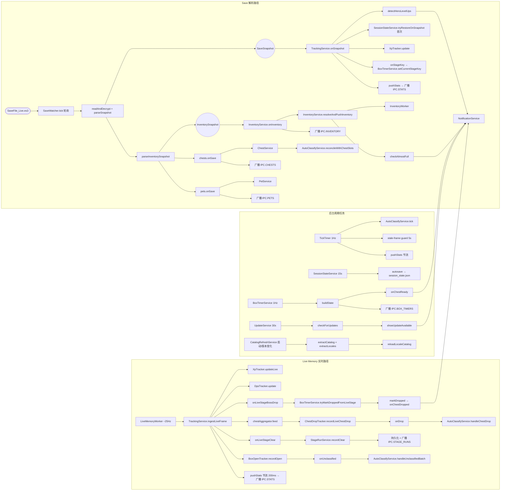

---

## 1. 启动流程

入口：`app/src/main/index.ts`。

### 流程图

主流程：模块加载副作用 → 单实例锁 → `whenReady` 主流程 → 窗口恢复；`startTracking` 装配细节见下方 subgraph。

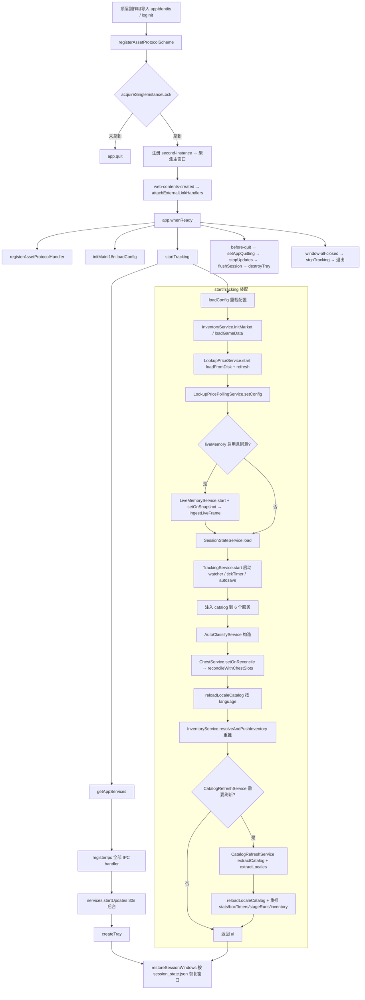

### 1.1 时序

1. **顶层副作用导入**：`./appIdentity`（注册 app 名称）、`./logInit`（日志 transport）。
2. **Asset 协议注册**：`registerAssetProtocolScheme()` 在模块加载时调用。
3. **单实例锁**：`acquireSingleInstanceLock()`（`app/app/singleInstance.ts`）。未拿到锁则 `app.quit()`；拿到锁后注册 `second-instance` 事件 → 聚焦主窗口。
4. **外部链接拦截**：`app.on("web-contents-created")` → `attachExternalLinkHandlers`（`app/app/lifecycle.ts`），把 http/https 链接转给系统浏览器。
5. **`app.whenReady()` 触发主流程**：
   - `registerAssetProtocolHandler()` 注册协议实际 handler。
   - `initMainI18n(loadConfig())` 初始化主进程 i18n。
   - `startTracking()` 装配所有服务并启动 watcher（详见 1.3）。
   - `getAppServices()` 取得对外 API 聚合对象。
   - `registerIpc(services)` 注册全部 IPC handler。
   - `services.startUpdates()` 启动更新检查（30s 延迟后台检查）。
   - `createTray(services)` 创建托盘。
   - `restoreSessionWindows(sessionUi)` 根据 `session_state.json` 的 UI 标记决定打开主窗口还是 mini overlay + box tracker 窗口。
6. **`before-quit`**：`setAppQuitting(true)` → `services.stopUpdates()` → `services.flushSession()` → `destroyTray()`。
7. **`window-all-closed`**：若 `isAppQuitting()`，调 `stopTracking()` 后退出（非 macOS）。

### 1.2 appState 装配（`app/src/main/app/appState.ts`）

模块级单例按顺序构造（构造时即执行）：

| 顺序 | 服务                                   | 关键依赖                                                                                                             |
| ---- | -------------------------------------- | -------------------------------------------------------------------------------------------------------------------- |
| 1    | `SessionStateService`                  | 无                                                                                                                   |
| 2    | `InventoryService`                     | 无                                                                                                                   |
| 3    | `ChestService`                         | 构造时加载 `boxType`/`runeCap`/`runeAutoOpen` 三份 catalog                                                           |
| 4    | `PetService`                           | 构造时加载 `petCatalog`                                                                                              |
| 5    | `BoxTimerService`                      | 构造时加载 `stageBox` catalog + tracker routes，调 `load()` 读 `box_timers.json`，调 `seedWasOnCooldown()`           |
| 6    | `StageRunService`                      | 构造时 `load()` 读 `stage_run_history.json`                                                                          |
| 7    | `LookupService` / `LookupPriceService` | 无                                                                                                                   |
| 8    | `LookupPricePollingService`            | 依赖 `lookupPrices`、`config.lookupPricePolling.watchedHashes`、`config.currency`、共享 `nameIdService`、`broadcast` |
| 9    | `LiveMemoryService`                    | 构造后 `setOnGameVersionChanged` 钩子接 `catalogRefresh.onGameVersionChanged`                                        |
| 10   | `CatalogRefreshService`                | 依赖 `inventory.getGameData()`、`liveMemory`、`resolveUserDataDir()`、`broadcast`、`config.gameInstallDir`           |
| 11   | `NotificationService`                  | `getConfig`、`focusMainWindow`、`t`（i18n）                                                                          |
| 12   | `UpdateService`                        | `getConfig`、`onUpdateAvailable: (v) => notifications.showUpdateAvailable(v)`                                        |

构造后立即装配跨服务回调：

- `boxTimers.setOnChestReady(payload => notifications.showChestReady(payload))`
- `boxTimers.setOnChestDropped(payload => notifications.showChestDrop(payload))`
- `inventory.setOnAlmostFull(payload => notifications.showInventoryAlmostFull(payload), () => threshold)`
- `liveMemory.setOnGameVersionChanged(() => catalogRefresh.onGameVersionChanged())`

### 1.3 TrackingService 构造与 startTracking()

`TrackingService` 构造参数是 8 个回调（按顺序）：

1. `onInventory: (snap) => inventory.onInventory(snap)` — SaveWatcher 的 onInventory 入口
2. `parseInventorySnapshot: (text, mtime) => { const inv = inventory.parseFromSave(text, mtime); chests.onSave(text, mtime, inv.chests); pets.onSave(text, mtime); return inv; }` — 解析 inventory 同时驱动 ChestService 和 PetService
3. `onStageKey: (stageKey) => boxTimers.setCurrentStageKey(stageKey)` — save 解析到新 stageKey 时同步给 BoxTimerService
4. `sessionState` — 用于 restore/autosave/flush
5. `onHeroLevelUp: (events) => notifications.showHeroLevelUp(events)`
6. `onLiveStageBossDrop: (stageKey) => boxTimers.tryMarkDroppedFromLiveStage(stageKey)` — **BoxTimer 倒计时的唯一自动触发来源**（2026-09-10 起 save-reconcile 路径不再触发，见 14.4 Step 5）
7. `onLiveStageClear: (stageKey, clearTimeSec, xpGained, goldGained) => stageRuns.recordClear(...)`
8. `onLiveChestSlots` — 当前已不路由到 AutoClassify（保留接口签名）

`startTracking()` 流程：

1. `config = loadConfig()` 重新加载配置。
2. 初始化 `InventoryService` 市场参数：`initMarket(config.currency)`、`setAutoScanEnabled`、`setLowValueThresholdUsd`、`loadGameData(resolveUserDataDir())`。
3. `lookupPrices.start()` 启动 lookup 价格快照（先 `loadFromDisk()`，再 `refresh()`，然后 30 分钟轮询）。
4. `lookupPricePolling.setConfig(config.lookupPricePolling)` 应用轮询配置。
5. 若 `config.liveMemory.enabled && config.liveMemory.consentAccepted`，调 `liveMemory.start()`，并 `setOnSnapshot(snap => tracking.ingestLiveFrame(snap))` 把 ~25 Hz live 帧注入 TrackingService。
6. `sessionState.load(config)` 读 `session_state.json`，返回 UI 快照（mini overlay / box tracker 是否打开）。pending tracker 数据保留等待首次 save 解析时 restore。
7. `tracking.start(config)` 装配 `XpTracker` / `ChestDropTracker` / `LiveChestDropAggregator` / `BoxOpenTracker` / `DpsTracker`，启动 SaveWatcher 和 1Hz tickTimer，启动 `sessionState.startAutosave`。
8. 注入 catalog：`setGameDataLookup`、`setLookupCatalog`（同时注入 inventory）、`setInventorySnapshot`、`setLookupPriceSnapshot`、`lookupPrices.setOnSnapshotUpdated` 双订阅。
9. `autoClassify = new AutoClassifyService({...})`：依赖 `tracking.getChestDropTracker/getBoxOpenTracker`、`chests`、`boxTimers.getState().catalog`、act/common routes、`tracking.getCurrentStageKey()`、`getInventoryStatus`。
10. `chests.setOnReconcile(slots => autoClassifyRef.reconcileWithChestSlots(slots))` — 每次 save 解析都触发 AutoClassify reconcile。
11. `autoClassify.setEnabled(config.lootAutoClassifyEnabled)`、`tracking.setAutoClassifyService(autoClassify)`。
12. `reloadLocaleCatalog()`：基于 `config.language` 解析语言 → 加载 `LocaleCatalog`（bundled JSON + 游戏提取的 locale_strings 合并）→ 注入到 `tracking / inventory / boxTimers / stageRuns / liveMemory / lookup` 六个服务。
13. `inventory.resolveAndPushInventory()` — 用新 catalog 重推一次库存。
14. 异步触发 catalogRefresh（若 stale）：成功后再次 `reloadLocaleCatalog()` + 重推 stats/boxTimers/stageRuns/inventory。
15. 返回 `ui` 给 `index.ts`，由 `restoreSessionWindows(ui)` 决定窗口打开方式。

### 1.4 stopTracking()

`before-quit` 触发 `services.flushSession()` 后；`window-all-closed` 内调 `stopTracking()`：

- `tracking.flushSession()` 落盘一次。
- `tracking.stop()` 停 watcher / tickTimer / autosave。
- `autoClassify?.setEnabled(false)` + 置 null。
- `boxTimers.stopTick()`、`lookupPrices.stop()`、`lookupPricePolling.stop()`、`liveMemory.stop()`。

---

## 2. 配置加载与 configPatch

### 流程图

`applyConfigPatch` 依次检测各配置项变化并触发对应服务回调；菱形为决策节点，"否"直接进入下一个判断。

```mermaid
%% TBH flow diagram
flowchart TD
  LoadCfg[loadConfig 搜索 userData / cwd / cwd.. config.json] --> Normalize[sanitize* 清洗字段]
  Normalize --> Persist[saveConfig 合并 + normalize 写回 userData/config.json]
  Patch[applyConfigPatch 收到 partial patch] --> DetectNeeds{needsWatcher / needsTracker / csvToggled}
  DetectNeeds --> Next[normalizeConfigFromRaw 合并 + setConfig + saveConfig]
  Next --> QSavePath{savePath 变化?}
  QSavePath -- 是 --> A1[TrackingService.onSavePathChanged 清 lastSnap + 重置 tracker]
  QSavePath -- 否 --> QCurr{currency 变化?}
  A1 --> QCurr
  QCurr -- 是 --> A2[onCurrencyChanged 清市场历史 + clearLookupLocalFields]
  QCurr -- 否 --> QTrack{needsTracker?}
  A2 --> A3[InventoryService 换币 + resolveAndPushInventory + ensureOwnedPrices]
  A3 --> QTrack
  QTrack -- 是 --> A4[重建 XpTracker 保留 logHistoryCsv hook]
  QTrack -- 否 --> QWatch{needsWatcher?}
  A4 --> QWatch
  QWatch -- 是 --> A5[SaveWatcher.restartWatcher]
  QWatch -- 否 --> QLive{liveMemory 启用状态变化?}
  A5 --> QLive
  QLive -- 是 --> A6[setLiveMemoryEnabled + onLiveMemoryToggled 重置 tracker]
  QLive -- 否 --> QMarket{market 参数变化?}
  A6 --> QMarket
  QMarket -- 是 --> A7[同步 marketAutoScan / threshold 给 InventoryService]
  QMarket -- 否 --> QLang{language 变化?}
  A7 --> QLang
  QLang -- 是 --> A8[onLanguageChanged → reloadLocaleCatalog + push + rebuildTrayMenu]
  QLang -- 否 --> QPoll{lookupPricePolling 变化?}
  A8 --> QPoll
  QPoll -- 是 --> A9[onLookupPricePollingChanged]
  QPoll -- 否 --> QTop{topmost 变化?}
  A9 --> QTop
  QTop -- 是 --> A10[setAlwaysOnTop 应用到三窗口]
  QTop -- 否 --> Final[pushStats + InventoryService.resolveAndPushInventory 重推]
  A10 --> Final
  Final --> Return[返回 next config]
  class LoadCfg,Normalize,Persist,Patch,Next,A1,A2,A3,A4,A5,A6,A7,A8,A9,A10,Final,Return data
  class DetectNeeds,QSavePath,QCurr,QTrack,QWatch,QLive,QMarket,QLang,QPoll,QTop dec
```

### 2.1 config.json 加载（`app/src/main/config.ts`）

- **搜索路径**：`app.getPath("userData")/config.json` → `process.cwd()/config.json` → `process.cwd()/../config.json`。
- **默认值**（`DEFAULTS`）：savePath 默认 `%USERPROFILE%/AppData/LocalLow/TesseractStudio/TaskbarHero/SaveFile_Live.es3`；es3Password 默认 `DEFAULT_PASSWORD = "emuMqG3bLYJ938ZDCfieWJ"`（`app/src/core/es3.ts`）；pollIntervalSeconds=5；rollingWindowMinutes=5；topmost 三窗口默认 true；notificationsEnabled/notifyOnUpdateAvailable 默认 true；marketAutoScanEnabled 默认 true；marketLowValueThresholdUsd=0.05；lootAutoClassifyEnabled 默认 false；language="auto"。
- **normalizeConfig**：用一组 `sanitize*` 函数清洗每个字段。关键清洗：
  - `sanitizeTopmost` 兼容旧 `startTopmost`（单布尔）迁移到 `topmost: { main, overlay, boxTracker }`。
  - `migrateNotificationPrefs`（`app/shared/notificationCatalog.ts`）兼容旧 `chestSoundVariant` → `notificationPrefs`。
  - `sanitizeLookupPricePollingPrefs`：intervalMinutes 限 [5,60]、thresholdUsd ≥0、watchedHashes 去重 ≤100 项。
  - `sanitizeLanguage`：接受 "auto" / "game" / `APP_LANGUAGES` 任意项。
- **saveConfig**：合并 existing + 新 config，再 normalize 后写 `userData/config.json`。

### 2.2 configPatch（`app/src/main/ipc/configPatch.ts`）

`applyConfigPatch(deps, patch: Partial<AppConfig>)` 流程：

1. 检测三类 needs：`needsWatcher`（savePath/pollIntervalSeconds/es3Password 变了）、`needsTracker`（rollingWindowMinutes 变了）、`csvToggled`（logHistoryCsv 变了）。
2. `next = normalizeConfigFromRaw({...prev, ...patch})` → `setConfig(next)` → `saveConfig(next)`。
3. 若 savePath 变了 → `onSavePathChange()`（实为 `tracking.onSavePathChanged()`：清 lastSnap、重置所有 tracker、`sessionState.notifyNewSession()`）。
4. currency 变了 → `market.setCurrency` + `resolveAndPushInventory` + `ensureOwnedPrices(true)`；**且当币种确实变化（大小写不敏感比较 prev ≠ next）时**，先回调 `onCurrencyChanged()`（清空 MarketVolumeService 以旧币计价的交易额历史/采样并立即以新币落盘、广播空数据）与 `clearLookupLocalFields()`（清空图鉴快照的本地 polling 价格字段，回退 CI USD × fx），再执行 inventory 重推。提交相同币种不触发清账（避免误清历史），见 8.7.3 多货币同步。
5. `needsTracker` → 重建 `XpTracker`（保留 logHistoryCsv hook）；否则仅 csvToggled 时切换 hook。
6. `needsWatcher` → `restartWatcher()`。
7. liveMemory 变了 → `setLiveMemoryEnabled(nextActive)`；若 prevActive ≠ nextActive → `onLiveMemoryToggled()`（重置所有 tracker，避免 live/save 基线混合污染）。
8. marketAutoScanEnabled / marketLowValueThresholdUsd 变了 → 同步给 InventoryService。
9. language 变了 → `onLanguageChanged(newLanguage)` → `changeLanguage` + `reloadLocaleCatalog` + `boxTimers.push()` + `stageRuns.push()` + `rebuildTrayMenu`。
10. lookupPricePolling 变了 → `onLookupPricePollingChanged(next.lookupPricePolling)`。
11. `setAlwaysOnTop(next.topmost)` 应用到三个窗口。
12. `pushStats()` + `resolveAndPushInventory()` 强制重推一次。

返回 `{...next}`。

---

## 3. Save 解密与解析

### 流程图

轮询主流程 + 读取/解密细节（subgraph）；失败时不前进 mtime，下次 poll 重试，是处理 mid-write 的关键。

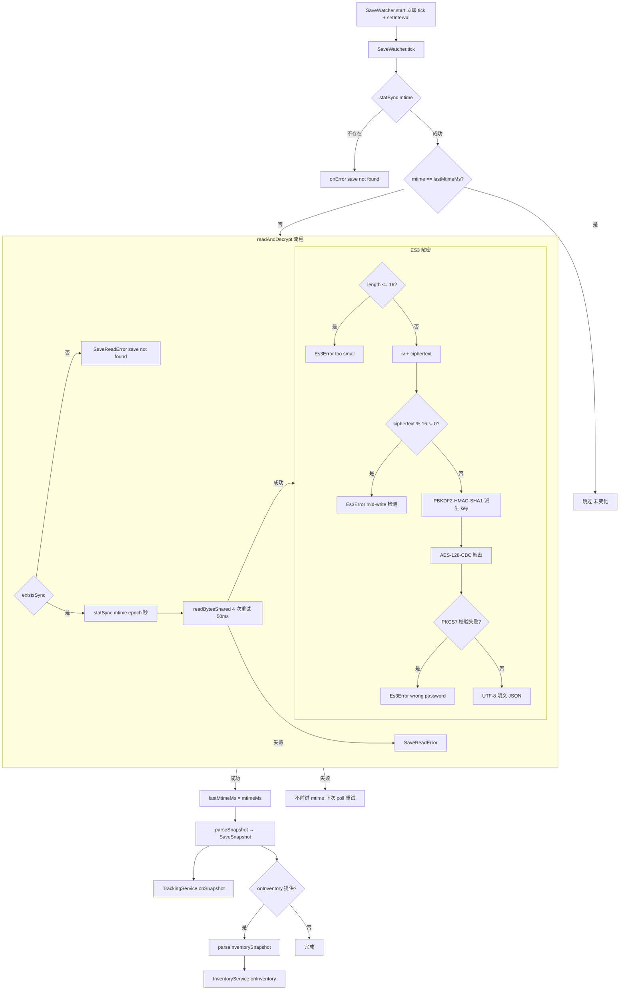

### 3.1 SaveWatcher 轮询（`app/src/main/saveWatcher.ts`）

**构造参数** `SaveWatcherOptions`：`path`、`password`、`pollMs`、`onSnapshot`、`onError`、`onInventory?`、`parseInventorySnapshot?`。

**`start()`**：立即 `tick()` 一次，然后 `setInterval(tick, pollMs)`。

**`tick()`** 流程：

1. `statSync(path).mtimeMs` 取 mtime；失败（文件不存在）→ `onError("Save file not found: ...")` 返回。
2. mtime 等于 `lastMtimeMs` → 直接返回（未变化）。
3. `readAndDecrypt(path, password)` → `{ text, mtime }`。失败抛 `SaveReadError`。
4. 成功：`lastMtimeMs = mtimeMs`，`parseSnapshot(text, mtime)` → `SaveSnapshot` → `onSnapshot(snap)`。
5. 若 `onInventory` 提供：调用 `parseInventorySnapshot ?? parseInventory` 解析 inventory → `onInventory(inv)`；解析失败仅 `log.error`，不影响主流程。
6. **错误处理**：捕获到 `SaveReadError` 或其它异常时**不更新 `lastMtimeMs`** → 下次 tick 会重试。这是处理 mid-write sharing violation 的关键设计：游戏写文件时部分块未刷盘 → AES 块大小校验失败 → 抛错 → 不前进 mtime → 下次 poll 重试。

首次成功读取时 `log.info("First save read OK (stage ${snap.stageKey})")`。

### 3.2 readAndDecrypt（`app/src/main/io/saveFile.ts`）

`readAndDecrypt(path, password=DEFAULT_PASSWORD) → { text, mtime }`：

1. `existsSync(path)` 检查；不存在 → `SaveReadError("Save file not found")`。
2. `mtime = statSync(path).mtimeMs / 1000`（秒级 epoch）。
3. `readBytesShared(path)`：4 次重试，每次失败 `sleepSync(50ms)`（用 `Atomics.wait` 阻塞）。处理 Windows 文件被占用场景。4 次都失败 → `SaveReadError("Could not read save file: ...")`。
4. `es3.decryptToText(raw, password)` → UTF-8 文本；失败包装成 `SaveReadError`。
5. 返回 `{ text, mtime }`。

### 3.3 ES3 解密（`app/src/core/es3.ts`）

文件布局：`[16-byte IV/salt][AES-CBC ciphertext]`。Key 派生：`PBKDF2-HMAC-SHA1(password, salt=IV, iterations=100, dklen=16)`。Cipher：AES-128-CBC + PKCS7 padding。明文：UTF-8 JSON。

`decrypt(data: Buffer, password=DEFAULT_PASSWORD) → Buffer`：

1. `data.length <= 16` → `Es3Error("File is too small")`。
2. `iv = data[0:16]`，`ciphertext = data[16:]`。
3. `ciphertext.length % 16 !== 0` → `Es3Error("Ciphertext length is not a multiple of AES block size (save may be mid-write)")` — mid-write 检测关键。
4. `key = pbkdf2Sync(password, iv, 100, 16, "sha1")`。
5. `createDecipheriv("aes-128-cbc", key, iv)` + `setAutoPadding(false)`（手动剥 PKCS7）。
6. 检查最后一个字节 `pad`，必须 1..16 且 ≤ padded.length，且末尾 pad 字节全等于 pad → 否则 `Es3Error(WRONG_PASSWORD)`。
7. 返回 `padded.subarray(0, padded.length - pad)`。

### 3.4 parseSnapshot（`app/src/core/save/snapshot.ts`）

`parseSnapshot(decryptedText, saveMtime=0) → SaveSnapshot`：

1. `root = JSON.parse(decryptedText)`。
2. `player = unwrapEs3Entry(root.PlayerSaveData)` — ES3 顶层每个 key 是 `{__type, value}` 包装，`value` 经常是 JSON 字符串需二次 parse。`unwrapEs3Entry` 自动处理：若 value 是 string 且 trim 后以 `{` 或 `[` 开头则 try `JSON.parse`，失败保留原值。
3. `PlayerSaveData` 缺失 → `SaveReadError("PlayerSaveData missing or malformed")`。
4. **heroes**：遍历 `player.heroSaveDatas[]`，提取 `heroKey`（转 string）、`HeroLevel`（truncate）、`HeroExp`、`IsUnLock`；累加 `totalHeroExp`。
5. **gold**：遍历 `player.currenySaveDatas[]`，找 `Key === 100001`（GOLD_KEY）的 `Quantity`。
6. **commonSaveData**：提取 `playTime`、`currentStageKey`（truncate）、`currentStageWave`、`maxCompletedStage`。
7. 返回 `SaveSnapshot`：`{ heroes, totalHeroExp, playTime, saveMtime, stageKey, stageWave, maxStage, gold }`。

**注意**：`SaveSnapshot` 不直接包含 chest slots / items / pets。这些在 `InventoryService.parseFromSave` 与 `PetService.onSave` 中独立解析（基于同一 `decryptedText`）。

### 3.5 SaveSnapshot 字段含义（`app/shared/types.ts`）

| 字段           | 类型             | 含义                                                    |
| -------------- | ---------------- | ------------------------------------------------------- |
| `heroes`       | `HeroSnapshot[]` | 每个英雄的 key/level/exp/unlocked                       |
| `totalHeroExp` | number           | 所有英雄 exp 之和（用于会话级 XP 增量）                 |
| `playTime`     | number           | 游戏内 playTime                                         |
| `saveMtime`    | number           | save 文件 mtime（epoch 秒）— 用作所有速率计算的时间基准 |
| `stageKey`     | number           | 当前关卡 4 位编码（难度×1000+act×100+stage）            |
| `stageWave`    | number           | 当前 wave                                               |
| `maxStage`     | number           | 历史最高已完成关卡                                      |
| `gold`         | number           | 当前金币                                                |

---

## 4. Tracker 双路径业务流程

### 流程图

双路径所有权模型：save 路径与 live 路径（~25Hz）各管其指标；`LIVE_TAKEOVER_SEC=5`，live 5s 无帧则 save 接管并 handover 重置基线。

```mermaid
%% TBH flow diagram
flowchart TD
  Tracking[TrackingService 持有 XpTracker / ChestDropTracker / BoxOpenTracker / DpsTracker / SaveWatcher / tickTimer]
  Tracking --> UpdateSnap[XpTracker.update save 路径]
  Tracking --> UpdateLive[XpTracker.updateLive live 路径 ~25Hz]
  subgraph savePath [save 路径 update]
    First{首次初始化?}
    First -- 是 --> Init[写入 prevHero + RateMeter init 返回 0]
    First -- 否 --> Driving{live 5s 内有帧?}
    Driving -- 是 --> SkipSave[跳过 save 处理 由 live 接管]
    Driving -- 否 --> Handover{之前 live owning?}
    Handover -- 是 --> ResetBase[handover 重置基线不计 gain]
    Handover -- 否 --> Delta[heroDeltaGain 跨级桥接 + updateGold 仅计正向 delta]
    ResetBase --> Next1[继续速率计算]
    Delta --> Next1
    Next1 --> Gain1{gain > 0?}
    Gain1 -- 是 --> Acc1[累加 + prune + recomputeRates + push HistoryEntry cap 500]
    Gain1 -- 否 --> End1[结束]
  end
  subgraph livePath [live 路径 updateLive]
    NotInit{已初始化?}
    NotInit -- 否 --> Return2[直接 return 须先有 save]
    NotInit -- 是 --> TakeOver{首次接管?}
    TakeOver -- 是 --> Restore[liveGold / liveXp.restore 基线重置 + reanchor]
    TakeOver -- 否 --> Guards[逐 hero 校验 exp ≤1e12 / level-drop / same-level dip]
    Guards --> Gain2{gain 通过 plausibleLiveHeroGain ≤1e7?}
    Gain2 -- 否 --> RefreshOnly[meter.refreshRolling]
    Gain2 -- 是 --> Sync[applyGain + syncXpFromLiveMeter]
    Sync --> Heal[healInflatedXpTotals 自愈]
    Heal --> Push2[push HistoryEntry]
  end
  class Tracking,Init,ResetBase,Delta,Next1,Acc1,Restore,Guards,Sync,Heal,Push2,RefreshOnly data
  class First,Driving,Handover,Gain1,NotInit,TakeOver,Gain2 dec
```

`TrackingService`（`app/src/main/services/TrackingService.ts`）持有：

- `XpTracker`（XP/金币会话与速率）
- `ChestDropTracker` + `LiveChestDropAggregator`（宝箱掉落计数）
- `BoxOpenTracker`（宝箱开启结果）
- `DpsTracker`（伤害/击杀）
- `SaveWatcher`
- 1Hz `tickTimer` + ~5Hz live broadcast 节流

### 4.1 XpTracker 双路径所有权模型（`app/src/core/tracker.ts`）

`LIVE_TAKEOVER_SEC = 5`：live 路径在 5 秒内有过帧 → "live owning"，save 路径不再处理该指标（XP 和 gold 各自独立判断）。live 帧停 5 秒 → save 路径接管，并执行 "handover"：重置基线到 save 值，不计增益（避免基线混合导致 totals 爆炸）。

#### 4.1.1 update(snap: SaveSnapshot) — save 路径

1. `now = Date.now()/1000`，`mtime = snap.saveMtime || now`，`heroes = snap.heroes`。
2. **首次初始化**：每个 hero 写入 `prevHero`（level+exp），创建 `RateMeter(rollingWindow)` 并 `init(mtime)`；`prevGold = snap.gold`；初始化 `samples`、`goldSamples`、`firstMtime`、`lastChangeMtime` 等；返回 0。
3. **判定 live 是否 driving**：`goldLiveDriving = lastLiveGoldSec !== null && now - lastLiveGoldSec < 5`；`xpLiveDriving` 同理。
4. **Gold save 路径**（`!goldLiveDriving`）：
   - 若 `goldLiveOwning` 为 true（之前是 live 接管）→ handover：`goldLiveOwning = false`，`prevGold = snap.gold`（不计 gain）。
   - 否则 `updateGold(snap.gold, mtime)`：仅计正向 delta（金币会被消耗，所以负 delta 忽略），累加到 `goldGained`，更新 `goldSamples`，重算 `goldRollingRateValue` 与 `goldSessionRateValue`。
5. **XP save 路径**（`!xpLiveDriving`）：
   - 若 `xpLiveOwning` → handover：`xpLiveOwning = false`，`currentTotalXp = snap.totalHeroExp`，每个 hero 重置 `prevHero`（不计 gain）。
   - 否则遍历 heroes，对每个 hero 调用 `heroDeltaGain(prev, level, exp)`（见 4.4），累加 gain；更新 `prevHero`；`meter.add(heroGain, mtime)`。
   - 若 `gain > 0`：累加 `cumulativeGained`，更新 `samples`、`lastGainMtime`、`lastChangeMtime`，`prune(mtime)`，`recomputeRates()`；push HistoryEntry（cap 500）；触发 `onHistory` 回调。
6. 返回 gain。

#### 4.1.2 updateLive(data, wallTimeSec, stage?) — live 路径

`data: { gold, heroes }`，~25 Hz 调用。`!initialized` 时直接 return（必须先有 save 解析）。

- **Gold live**：
  - takingOver = `!goldLiveOwning`；`goldLiveOwning = true`；`lastLiveGoldSec = wallTimeSec`。
  - gain = takingOver ? 0 : `max(0, gold - prevGold)`；`prevGold = gold`。
  - takingOver 时 `liveGold.restore(goldGained, [[wallTime, goldGained]], wallTime, 0, 0)`（基线重置）；否则 `liveGold.applyGain(wallTime, gain)`。
  - 同步 `goldGained = liveGold.sessionTotal`，刷新 `liveGold.refresh(wallTime, rollingWindow)` → 同步 `goldRollingRateValue`、`goldSessionRateValue`、`goldSamples`、`goldFirstMtime`。
- **XP live**：
  - takingOver 时：`seedTotal = isPlausibleCumulativeXp(cumulativeGained, elapsed) ? cumulativeGained : 0`；`liveXp.restore(...)`；`cumulativeGained = seedTotal`；`prevHero.clear()`；每个 hero 写入 `prevHero`；现有 `heroMeters` 调 `meter.reanchor(wallTimeSec)` 重置时间基准（避免 save mtime 与 live wallTime 混用导致 session 速率看起来比 hero 速率高）。
  - 持续路径：对每个 hero：
    - `plausibleHeroRuntimeExp(h.exp)` 校验（≤1e12）。
    - **level-drop guard**：`prev.level > h.level` → 跳过（dirty read，不计数不前进基线）。
    - **same-level dip guard**：`prev.level === h.level && h.exp < prev.exp` → 跳过计数但 `meter.refreshRolling`。
    - `heroDeltaGain(prev, level, exp)` 计算 gain。
    - `plausibleLiveHeroGain(heroGain)` 校验（≤1e7/tick）。
    - 通过则 `gainSum += heroGain`，`meter.add(heroGain, wallTime)`；否则只 `meter.refreshRolling`。
  - `gain = plausibleLiveHeroGain(gainSum) ? gainSum : 0`。
  - `gain > 0` → `liveXp.applyGain`，更新 `lastGainMtime`/`lastChangeMtime`。
  - `currentTotalXp = sum(hero.exp)`，`syncXpFromLiveMeter(wallTime)`：同步 `cumulativeGained`、`rollingRateValue`、`sessionRateValue`、`samples`、`firstMtime`，刷新所有 heroMeters，`healInflatedXpTotals(wallTime)`（自愈）。
  - `gain > 0` → push HistoryEntry。

### 4.2 滚动窗口与速率计算

- **RateMeter**（save 路径，per-hero）：`samples: [mtime, gained][]`。`add` 时 push 样本并 `refreshRolling(mtime)`：弹出窗口外的样本（窗口 = `rollingWindow` 秒），`rolling = (gained - g0) / (mtime - t0) * 3600`。
- **LiveSessionMeter**（live 路径，session 级）：`sessionTotal` + `samples` + `firstAnchor` + `rolling` + `sessionRate`。`refresh` 类似 RateMeter 但用 wallTime。
- **sessionRate**（getter）：用真实会话总时长 `(now - sessionStart)`，而非"首次到末次 XP 增益时长"，避免挂机后 sessionRate 卡在高位不衰减。
- **rollingRate**：滚动窗口内的速率。
- **goldRate** / **goldSessionRate**：gold 的对应版本。

### 4.3 trackerLimits（`app/src/core/trackerLimits.ts`）

- `MAX_PLAUSIBLE_XP_RATE = 5e10`（XP/hour 上限）。
- `MAX_PLAUSIBLE_CUMULATIVE_XP = 1e10`（session XP 总量上限）。
- `isPlausibleXpRate(rate)`：finite、≥0、< MAX_PLAUSIBLE_XP_RATE。
- `isPlausibleCumulativeXp(total, elapsedSec)`：finite、≥0、< MAX_PLAUSIBLE_CUMULATIVE_XP；若 elapsed>0 则隐含速率也必须 < MAX_PLAUSIBLE_XP_RATE。

### 4.4 跨级 XP 桥接（`heroDeltaGain`，`app/src/core/tracker.ts:118`）

```
heroDeltaGain(prev, curLevel, curExp) → number
```

- `prev === undefined` → 0。
- **Level-up reset**：`curExp < prev.exp` → 直接返回 `curExp`（英雄升级时把上一级 XP 银行化并重置 within-level 计数器，新 curExp 就是 reset 后的 gain）。
- **Level curve 路径**（`prev.level > 0 && curLevel > 0`）：调用 `perHeroGain(prev.level, prev.exp, curLevel, curExp)`（`app/src/core/levelCurve.ts`）。
  - 同级：`exp1 - exp0`（cap 状态返回 0，避免 phantom XP）。
  - 升级：`xpThroughLevelUp(lv0, exp0, lv1, exp1)` = `(curve[lv0] - exp0) + Σ curve[intermediate] + exp1`（最终级若超 cap 则不加 exp1）。
  - curve 是 hardcoded level→total XP 表（levels 1-100）。
- **Fallback**（level 未知）：`max(0, curExp - prev.exp)`。

### 4.5 healInflatedXpTotals（自愈）

`syncXpFromLiveMeter` 末尾调用。检查 `cumulativeGained`、`sessionRateValue`、`rollingRateValue`、所有 `heroMeters.gained` 是否通过 `isPlausibleCumulativeXp` / `isPlausibleXpRate`。未通过则用 rollingRate 推算 healedTotal，重置 liveXp 与越界的 heroMeters。

### 4.6 buildStats（`app/src/main/stats.ts`）

`buildStats(tracker, chestDropTracker, boxOpenTracker, dpsTracker, lastSnap, lastError, statusOverride, liveFrame, boxOpenPriceResolver, lootStatus, catalog) → Stats`

**live-preferred / save-fallback blend 策略**：

- `liveXp = liveFrame?.connected === true && tracker.xpLiveActive()` — live 帧已连接且 5 秒内有数据。
- **heroes**：liveHeroes 为 true → 用 `liveFrame.heroes` 构造 `HeroRate[]`（含 `heroLevelEstimate` 计算 `xpToNextLevel` 和 `timeToLevelSec`）；否则用 `lastSnap?.heroes ?? tracker.heroes`，过滤 `unlocked || exp > 0`。
- **heroes live/save 交叉单调性闸门（v1.2.4，2026-09-17）**：live 英雄等级不再被无条件信任。`buildStats` 先由 `lastSnap.heroes`（存档英雄，权威下界）建 `saveHeroLevelByKey: Map<heroKey, level>`，再调用 `liveHeroFrameTrustworthy(liveFrame.heroes, saveHeroLevelByKey)`（`core/tracker.ts`）：对 live 帧中每个 heroKey，若存档已知该英雄等级且 live 等级 **低于** 存档 → 该帧不可信（返回 false）。v1.2.4 偏移表 fallback 到 1.2.2 使 `runtime.ts:1311` 的 `heroRuntime` 解码产生垃圾 → 等级被 `level > 0 && level <= 200 ? level : 1` 地板到 1，若直接采信会把已 L100+ 的英雄"回退"成 L1。闸门命中（`liveHeroesTrusted=false`）→ live 分支整体回退到 `saveHeroes ?? []`，保留真实存档等级；闸门通过则照常采信 live 等级。**关键正确性**：存档中本就 L1 的英雄（如 `501:L1/e0`、`601:L1/e0`）其 `saveLevel===1` 且 live 报 1 不"低于"下界 → 仍判可信，不被误杀（回归测试 `test/main/stats.test.ts` 覆盖：v1.2.4 帧回退到 save 取 L101、匹配/超 save 仍取 live L102）。`goldLiveSuspect` 同样经 Stats 透出（`stats.goldLiveSuspect = tracker.goldLiveSuspect`，`shared/types.ts` `Stats` 接口新增可选字段），供 `SaveStatusBar` 渲染陈旧金币警示。
- **stageKey**：live 优先（`liveFrame.stageKey`），否则 `lastSnap.stageKey ?? 0`。
- **stageWave**：live `stageWave`（**必须 > 0**）→ `dpsTracker.currentWave`（怪物数量波次判断，**无论 live 是否连接**都参与）→ `lastSnap.stageWave`（兜底），并**以 `stageWaveTotal` 封顶**（wave 超过关卡总波次时显示总数，防止漏检 stage clear 导致的跨局累计显示成 "30/16"）。
- **stageWaveTotal 符文减波修正**：live 读到的总波次（`StageInfoData.waveAmount`）在 `TrackingService.ingestLiveFrame` **单点**用存档符文减波数修正为 `max(1, raw − runeWaveReduction)`。`runeWaveReduction` 由 `appState` 存档回调用 `runeWaveCountReduction(chests.getRunePurchases(), loadRuneWaveCatalog())` 计算并 `setRuneWaveReduction` 下推——数据源为 `data/rune_wave.json`（Rune of Brevity 的 `WaveCountReduction` 节点，含 1171/1242/1301，各 −1 波）。修正只作用于 `stageWaveTotal`，不影响 `stageWave`/`stageKey`/`stageAlive`/heroes/DPS；`runeWaveReduction === 0` 时逐字节等同旧行为（不创建副本）。该单点修正使下方 run-end 重置判据（`currentWave >= stageWaveTotal`）与显示（`buildStats`）基于同一有效总波次。若 `raw <= reduction`（钳制到 1），`warnClampedWaveTotal` 打节流 warn——这通常是"游戏运行时 `waveAmount` 已内建减波导致重复扣"的信号。`> 0` 校验防止**已漂移的 StageManager runtimeWave 偏移**（如 v1.01.05 的 +0x138 恒读 0）把 0 当作权威值、屏蔽后续 fallback —— 否则 mini 悬浮窗波次会永久卡在 `0/N`。`dpsTracker.currentWave` 由怪物数量（HP 数组或 StageManager alive 计数）驱动，因此即使 live 波次字段缺失/无效、甚至 live 帧断开，只要 DpsTracker 有怪物数量波次判断就用它，最后才落到 save 的静态值。**stale 波次清洗（2026-09-02）**：实测 v1.01.05 的 runtimeWave +0x138 还可能读到**恒定的非零值**（实测恒 2，怪物清波循环 25+ 波不变）——过 `> 0` 校验后被当作权威，UI 波次永久卡在 "2/31"。修复：`liveReader` 层 `StaleWaveGuard`（`core/liveMemory/staleWaveGuard.ts`）跟踪「同一非零值持续 ≥ 8s 且期间怪物存活数发生过 0↔N 波切换」→ 判定 stale → `stageWave` 报 null，stats 自动回落到怪物计数推断；数值一旦变化立即恢复信任。日志 `stale live wave N — constant across wave transitions; falling back to monster-count wave estimate`（一次性）。
- **status**：`statusOverride` > `lastError` > `secondsSinceGain > 120 ? "No XP gained for Xs..."` > `"Tracking"`。
- **saveStale（2026-09-17）**：TrackingService 连续 ≥3 次（`SAVE_STALE_ERROR_THRESHOLD`）save 读取/解析失败 → `stats.saveStale=true`，成功即复位。含义：`lastSnap` 派生的全部数值（金币余额、关卡、英雄、进度）均为**失败前旧值**——典型场景是游戏更新改了 ES3 密码/布局导致解密持续失败，UI 却继续显示更新前数据（"金币回退"的另一根源）。SaveStatusBar 显示 `saveStatusStale` 警示；另在首个"heroes 与 gold 全空"的解析结果上打一次格式漂移 warn。
- **secondsSinceRead**：`nowSeconds() - lastSnap.saveMtime`（save 内容年龄，非 poll 间隔）。
- 其它字段：rollingRate、sessionRate、goldRate、cumulativeGained、goldGained、elapsed、secondsSinceGain、stageName（用 catalog 本地化）、history（visible 50 条，每条带 stageName）、chestDrops、boxOpens、dps、mapDamage、mapMobsKilled、sessionDamage、sessionMobsKilled、aliveMonsters、hpSum、hpMaxSum。
- **chestDrops 速率计时锚定**：`commonPerHour` / `rarePerHour` / `actPerHour`（及 `*RecentPerHour` 滚动 1h）由 `ChestDropTracker` 计算。会话速率窗口锚定到 `min(开始追踪时刻, 首个掉落的墙钟)`，因此等待首个箱子掉落的时间会计入分母——启动 6 分钟后落下的第 1 个普通箱子显示约 10/hr，而不是旧行为（锚定首个掉落 + 60s 下限截断）产生的 60/hr 虚高；而早于启动的历史/恢复掉落仍锚定其真实掉落时间。`applySnapshot`（restore）会把窗口覆写为**最早恢复的掉落**，使跨空闲时段的恢复历史仍计入速率，避免被削减为 0。窗口下限截断 `MIN_RATE_WINDOW_SEC=60` 保留，仅用于防止刚起步的秒级除以零/荒谬峰值。**恢复锚点持久化（2026-09-11 修复）**：`captureSnapshot` 现将 `sessionDropStart` 一并写入快照，`applySnapshot` 优先采用该持久化锚点（与最早恢复条目取 `min`，旧快照缺失时回退最早恢复条目）。修复前恢复只锚定 `history[0]`，而 `history` 被 `HISTORY_LIMIT=500` 截断、`countsByKey` 不截断——单次运行掉落超过 500 后，重开应用的 perHour 分子覆盖整个会话、分母却从截断后的时间窗算起，导致速率虚高（实测 600 掉落/6h 会话恢复后显示 ~119/hr，真实 ~99/hr）。
- **chestDrops 地图感知分母（2026-09-11）**：普通图与瘟疫图是互斥的地图类型（见 `isPlagueStage`），common/rare/act 只会在普通图掉落，plagueCommon/plagueRare/plagueAct 只会在瘟疫图掉落。若所有宝箱类别共用「总墙钟时间」作分母，混合两种地图的会话会把「刷另一类地图的时间」也算进本类速率的分母，导致速率被稀释（例如 1h 普通图爆 30 箱 + 1h 瘟疫图爆 15 箱：普通 30/(2h)=15/hr 而被低估为真实 30/hr）。修复：`ChestDropTracker` 新增 `noteMapTime(stageKey, at)`，由 `TrackingService.ingestLiveFrame` 每一实时帧喂入；依据当前 `stageKey`（`isPlagueStage` 判定，区分 4 位普通 key 与 6 位瘟疫 key；null/未知关不归属任何桶）把相邻帧墙钟差累积为 `normalMapSec` / `plagueMapSec`（会话级）及 1h 滚动 `rollingNormalSec` / `rollingPlagueSec`（segment 双端队列增量维护，超出 `ROLLING_HOUR_SEC=3600` 的段被剪枝）。`getStats` 中：普通三类速率分母 = `max(MIN_RATE_WINDOW_SEC, normalMapSec)/3600`，瘟疫三类 = `max(…, plagueMapSec)/3600`；`*RecentPerHour` 同理用滚动值。调用侧（`TrackingService.ingestLiveFrame`）以 `snap.stageKey ?? lastLiveStage?.stageKey` 喂入，与掉落分类同源兜底——某帧 `stageKey` 为空时不归 null 桶而是沿用上一已知关卡，避免地图时间静默停滞。当某桶无累积地图时间（未附加实时内存 / 恢复后尚无新帧）时，**回退原总时间口径**（会话用 `hours`、滚动用 `recentHours`），保持纯存档模式行为不变、避免分母为 0 导致速率虚高。`captureSnapshot` 持久化 `normalMapSec`/`plagueMapSec`（滚动值属短期指标不入快照），`applySnapshot` 在恢复后重置采样锚点与滚动队列，避免首帧跨离线空档误计；`reset` 清空全部地图时间。测试：`test/core/chestDropTracker.test.ts` 的 `map-type-aware rate denominator` 块覆盖会话/滚动/回退/剪枝/重置/恢复六种情形。
- **chestDrops 滚动小时速率窗口与突刺保护（2026-09-12）**：`*RecentPerHour`（滚动 1h 速率）的分母 = `min(ROLLING_HOUR_SEC=3600, now − 首个 recent 掉落)`——即**从窗口内第一个掉落开始计时**（`earliestRecentWallTime`），会话刚起步时不被整 1h 分母稀释、也不受等待首个掉落的空闲时间影响（该语义只属于会话速率）。在此基础上新增 `RECENT_MIN_WINDOW_SEC=300` 下限（会话速率的 `MIN_RATE_WINDOW_SEC=60` 不变）：仅有 60s 下限时，一次 4 连 burst 落在首分钟内会读出 4/(60/3600)=240/hr 的荒谬峰值；300s 下限把同一 burst 压到 48/hr，而稳态速率不受影响（连续刷取会话的分母要么是整 1h 窗口、要么是 ≥300s 的真实累计）。地图感知滚动分母（`rollingNormalSec`/`rollingPlagueSec`）同样使用 300s 下限，防止新累积的地图时间内 burst 突刺。测试：`test/core/chestDropTracker.test.ts` 的 `rolling recent-rate window` 块。
- **boxOpens 买断价币种（2026-09-11 修复）**：`TrackingService.buildBoxOpenPriceResolver` 解析掉落物品买断价——主路径用库存求购订单簿（`itemordershistogram`，**用户本币**，深度感知即时出售）；兜底用 CI lookup 快照 `prices[hash]`（**USD** `lowest_price`）。旧实现兜底直接返回 USD 数值未换算，非 USD 用户（如 CNY）会把 $0.03 显示成 ¥0.03（人民币地板价是 ¥0.10，明显偏低）。修复：兜底优先用快照本币字段（`buyOrderLocal` → `pricesLocal`，本地 polling 直抓目标币，无 FX 圆整误差）；否则 `usd × fx[currency]`（快照 `fx` 缺失该币时回落 USD 原值）。`TrackingService.setCurrency` 由 appState 在启动（`config.currency`）与货币切换（`setCurrency` IPC）时注入。

### 4.7 blend.ts 纯函数（`app/src/core/liveMemory/blend.ts`）

```ts
export function pickPreferLive<T>(live: T | null | undefined, save: T): T {
  return live ?? save;
}
export function blendStage(live, save) {
  return {
    stageKey: pickPreferLive(live?.stageKey, save.stageKey),
    stageWave: pickPreferLive(live?.stageWave, save.stageWave),
  };
}
```

`stats.ts` 没有直接调 `blendStage` —— 它把 blend 逻辑内联了，因为 stageWave 有第三级 fallback（dpsTracker.currentWave），无法用纯 `pickPreferLive` 表达。`blend.ts` 是给其他消费者（如 `TrackingService.rebuildStatsAfterSave`）使用的单一真理源。

### 4.8 detectHeroLevelUps（`app/src/core/heroes/detectLevelUps.ts`）

```
detectHeroLevelUps(prev: HeroSnapshot[], next: HeroSnapshot[]) → HeroLevelUpEvent[]
```

`prev.length === 0` → `[]`（首次解析不触发）。否则用 `prevByKey = Map(prev.map(h => [h.key, h.level]))`，遍历 next 找 `hero.level > previousLevel` 的英雄，返回 `{ key, previousLevel, newLevel }[]`。

### 4.9 TrackingService 1Hz tickTimer

- `autoClassify?.tick()`（无论是否 broadcast 都跑，保证 prompt 超时与队列 prune 准确）。
- **stale-frame guard**：若 `lastLiveFrame` 超过 5000ms 未更新 → 清空 `lastLiveFrame` 和 `lastLiveStage`，避免 worker 崩溃后 stage/DPS 卡死。
- **节流**：若距上次 live broadcast < 200ms（`LIVE_BROADCAST_INTERVAL_MS`）→ 跳过 pushStats；否则 `pushStats()`。

### 4.10 gold 突变防护与恢复对账（2026-09-17）

XP 早有 per-tick 上限（`MAX_LIVE_XP_GAIN_PER_TICK`，4.1/4.5）与自愈，gold 此前**没有**——游戏更新使 LiveMemory 偏移失效或迁移余额时，错误读数/跳变会以"当前值"进入会话统计，表现为金币回退或虚高。三层防护 + 一个 stale 上限：

- **live per-tick 上限**：`applyLiveGold` 单 tick（40ms）增益 > `MAX_LIVE_GOLD_GAIN_PER_TICK=1e7` → 增益记 0，但基线照常推进（`prevGold=gold`，持续跳变不会被永久拒绝）；显示值 `currentGold` 仍跟随真实读数。
- **save 路径速率护栏**：`updateGold` 用 `lastGoldParseMtime`（私有、不持久化；init 分支与 live→save handover 分支同样写入）计算两次解析间隔，增益隐含速率 ≥ `MAX_PLAUSIBLE_GOLD_RATE`（=5e10/h，复用 XP 速率上限）→ 不计入会话、基线已推进，下一次正常解析不受影响。
- **恢复对账 `reconcileGoldBaseline(saveGold, saveMtime, persistedLastMtime)`**：`SessionStateService.tryRestoreOnSnapshot` 在 `applySnapshot` 后、首次 `update()` 前调用（见 §10.4 第 5 步）。diff≤0 → noop；diff>0 且按离线 gap 的隐含速率 < 上限 → 计为一次性 bridging 收益（保持旧行为）；≥ 上限（典型：游戏更新迁移余额）→ 仅重锚基线（`prevGold=currentGold=saveGold`），日志 `Session gold baseline re-anchored to save (implausible jump …)`。
- **恢复快照金币校验**：`isPlausibleTrackerSnapshot` 新增 `currentGold`/`prevGold`/`goldGained` 的 `isPlausibleGoldBalance`/`isPlausibleCumulativeGold` 校验（`core/trackerLimits.ts`，上限 `MAX_PLAUSIBLE_CUMULATIVE_GOLD=1e15`），脏快照在恢复前即被丢弃（见 §10.4 第 3 步）。
- **live gold stale 上限**：`readRuntimeGold`（`core/liveMemory/runtime.ts`）所有读取路径失败时仅返回 `GOLD_STALE_MAX_MS=5000` 内的 `pin.lastKnown`（防 UI 闪烁），超龄返回 null——防止游戏更新后 25Hz 轮询把更新前余额当当前值无限回放（"金币回退"现象的直接根源之一）。`GoldPinState` 新增 `lastKnownAt`（成功读取时打点）。
- **ObscuredLong u64 掩码（2026-09-17，v1.2.4 修复）**：ACTk ObscuredLong 的解码公式 `(hidden - crypto) ^ crypto` 在 C# 是 ulong（mod-2^64）运算，但 JS BigInt 无回绕——当 hidden 的最高位为 1（int64 视角为负，v1.2.4 实测的 wallet 加密对即如此）时，未掩码的 BigInt 解码结果为负，`Number()` 后被 `plausibleGold` 拒绝 → `readGoldFromEntry` 恒 null → live 金币永久失效。修复：与 `readObscuredInt`（英雄等级，本就有 `& 0xffffffff`）对齐，`readObscuredLong` 改为 `((hidden - crypto) & U64) ^ crypto) & U64`。此 bug 与版本无关（1.2.2 只是数据巧合未触发），修复对旧版本行为不变。
- **live/save 发散守卫 + 陈旧标记（v1.2.4，2026-09-17）**：`TrackingService.ingestLiveFrame` 在 `lastLiveFrame = snap` 之前，先用 `evaluateGoldDivergence(snap.gold, saveGold, goldDivergeSinceSec, snap.at/1000, GOLD_DIVERGE_SUSTAIN_SEC=8)`（`core/tracker.ts`）比对 live 读数与上一存档余额 `saveGold = lastSnap?.gold`。当 `liveGold < saveGold`（live 读数低于存档"权威下界"，典型为偏移失效导致的回退/倒退）→ `substitute=true`，用 `saveGold` 覆盖 `snap.gold`，并首次触发时记 `goldDivergeSinceSec = snap.at/1000`；该"低于下界"状态**持续 ≥8s**（`nowSec - goldDivergeSinceSec >= sustainSec`）→ `suspect=true` 且 `tracker.goldLiveSuspect=true`，UI 经 `SaveStatusBar` 显示 `goldStatusStale` 警示（见 `shared/locales/*/live.json`）。读数与存档持平或更高（含 null 缺失）→ 复位 `goldDivergeSinceSec=null`、`goldLiveSuspect=false`。注意：`saveGold` 取自**会话内最近一次 save 解析**而非实时读数，因此它代表"游戏已落盘的已知最低余额"；live 永远不应低于它，低于即判为 stale。这是 §4.6 `saveStale` 之外的**第二道金币回退防线**，专门覆盖"save 解析仍成功、但 live 偏移失效读错"的情形（v1.2.4 偏移表 fallback 到 1.2.2 导致 `wallet gold` 读数错位）。
- **save 英雄经验合理性钳制（v1.2.4，2026-09-17）**：实测 v1.2.4 存档英雄 `exp` 高达 1.4e12，超过运行时解码上限 `MAX_HERO_RUNTIME_EXP=1e12` 的口径，会污染 `heroDeltaGain`/`healInflatedXpTotals` 的合理性判据。`tracker.update()` 在写入 `this.heroes` 时统一用 `clampHeroSaveExp(exp)`（`MAX_HERO_SAVE_EXP=1e15`）：非有限或负值归 0，超 1e15 钳到 1e15。init 与 live→save handover 两个分支同样钳制，保证 save 与 live 路径一致。该上限独立于运行时 1e12 上限——save 是累计总经验、量级本就更大，1e15 是为防脏存档（内存损坏/错误偏移写入）反噬统计而设的硬性天花板。

---

## 5. LiveMemory 业务流程

### 流程图

启动条件 → fork worker → 附加游戏进程 → 解析 offsets → 25Hz 轮询 → 三类消息回传主进程。

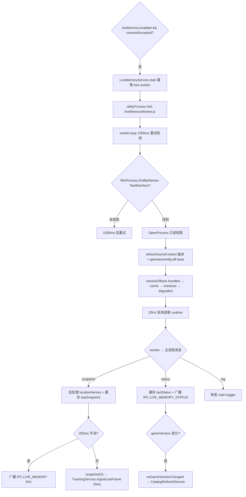

### 5.1 启动条件

`appState.ts`：

```ts
if (config.liveMemory.enabled && config.liveMemory.consentAccepted)
  liveMemory.start();
liveMemory.setOnSnapshot((snap) => tracking.ingestLiveFrame(snap));
```

三个前置条件：

1. `config.liveMemory.enabled` — 用户在 Settings 勾选开启 Live Memory。
2. `config.liveMemory.consentAccepted` — 用户确认"我知道这会读取游戏进程内存"同意弹窗。
3. **进程检测延后到 worker 内部** — `LiveMemoryService.start()` 不主动检测游戏进程；它只 fork worker，由 worker 的 `loop()` 在 `reader.attach()` 内通过 `WinProcess.findByNames(["TaskBarHero.exe", "TaskbarHero.exe"])` 寻找游戏。游戏未启动时 worker 进入 1500ms 重试轮询（`POLL_DETACHED_MS`）。

`LiveMemoryService.start()` 是幂等的（`if (this.child) return`），重复调用不会 fork 多个 worker。

### 5.2 utilityProcess worker 启动与消息协议

#### 5.2.1 fork 流程（`app/src/main/services/LiveMemoryService.ts:69-92`）

```ts
const workerPath = join(__dirname, "liveMemoryWorker.js");
this.child = utilityProcess.fork(workerPath, [], {
  serviceName: "tbh-live-memory",
  stdio: "pipe",
  env: { ...process.env, [LIVE_MEMORY_USER_DATA_ENV]: resolveUserDataDir() },
});
```

- electron-vite 把 `worker.ts` 编译到 `out/main/liveMemoryWorker.js`，与 main bundle 同目录。
- `stdio: "pipe"` — 主进程接管 worker 的 stdout/stderr；stderr 被截到 64KB 滑动窗口（`STDERR_MAX_BYTES`），便于崩溃诊断而不是无限增长。
- `LIVE_MEMORY_USER_DATA_ENV`（"TBH_USER_DATA"）— worker 通过它定位 offset cache 目录。

#### 5.2.2 消息协议

主→worker：纯字符串 `"stop"`。

worker→主：3 种 typed object：

```ts
type WorkerMessage =
  | { type: "snapshot"; snapshot: LiveMemorySnapshot }
  | { type: "status"; status: LiveMemoryStatus }
  | { type: "log"; message: string };
```

主进程接收端：

- **`snapshot`** — 后处理（注入本地化英雄名 `localizeHeroes`）→ 缓存为 `lastSnapshot` → 节流 200ms 广播给 renderer（`IPC.LIVE_MEMORY`）→ **不节流**地调用 `snapshotCb`（即 `tracking.ingestLiveFrame`）。tracker 拿到全 25Hz 数据用于精确采样，UI 只刷 5Hz。
- **`status`** — 缓存为 `lastStatus` → 立即广播给 renderer（`IPC.LIVE_MEMORY_STATUS`）→ 若 `gameVersion` 变化，触发 `onGameVersionChanged` 回调（被 `CatalogRefreshService` 接住）。
- **`log`** — 转发到 main logger。

`worker.ts` 的 `postStatusIfChanged`：序列化 `LiveMemoryStatus` 为 JSON 字符串作为 fingerprint，仅当 fingerprint 与上次不同才发 `status` 消息。把 25Hz 的状态噪声降到事件驱动。

### 5.3 worker 初始化流程

入口 `worker.ts:42-53`（顶层执行）→ `loop()`（`worker.ts:202-250`）。

#### 5.3.1 进程附加（`LiveMemoryReader.attach()`，`app/src/main/liveMemory/liveReader.ts:442-465`）

1. 若已 attached，直接调 `healOffsets()` 并返回。
2. 否则 `detach()` 清理上一次状态。
3. `WinProcess.findByNames(["TaskBarHero.exe", "TaskbarHero.exe"])`：
   - 先用 `CreateToolhelp32Snapshot(TH32CS_SNAPPROCESS)` 列所有进程，按名字匹配。
   - 若匹配为空，fallback `findViaPowerShell`。
   - 多实例（多个匹配）时按"沙箱状态一致"挑选（见 5.10）。
4. `OpenProcess(PROCESS_QUERY_INFORMATION | PROCESS_VM_READ)` — 只读权限，不要求管理员。
5. `refreshGameContext()`：
   - `detectGameVersion(proc)` — 找 `taskbarhero.exe` 模块的 path，读同目录 `Version.txt`，正则 `^\d+\.\d+\.\d+$` 校验。失败时保留之前的 gameVersion。
   - `gameAssembly(proc)` — 在模块列表里找 `gameassembly.dll`，取其 `baseAddress` 和 `size`。
6. 进入 `setScanning(true)`（触发 `onScanningChange` → worker 发 status）→ `resolveOffsets` → `applyResolvedOffsets` → `setScanning(false)`。

#### 5.3.2 ga base 解析

`ga = { base: bigint; size: number }`，来自 `WinProcess.listModules()` 找到的 `gameassembly.dll`。整个 IL2CPP 元数据扫描都限制在 `[ga.base, ga.base+ga.size)` 范围内，避免扫描整个地址空间（30-60s vs 几秒）。

如果 `listModules()` 返回空（沙箱拦截），三级 fallback（见 5.10）。三级都失败时 `ga=null` → `resolveOffsets` 在 `if (ga && version && cacheDir)` 处短路 → reader 处于 `attached=true, supported=false` 的"降级"状态。

#### 5.3.3 offsets 解析优先级与回退链路

`LiveMemoryReader.resolveOffsets()`（`liveReader.ts:566-807`）：

**Step 1 — Bundled 表**（`liveReader.ts:590-599`）：

- `offsetsForVersionMeta(version)` 返回 `{ table, fallback }`。
- 精确命中：`fallback=false`，`source="bundled"`。
- 同 major.minor 邻近版本命中：`fallback=true`，table 上贴 `_fallbackFromVersion: <bestVersion>`，`source="bundled"`。
- 都不命中：`base=null`，准备走纯 extractor 路径。
- **版本表现状（2026-09-17）**：内置 `offsets.ts` 覆盖 1.00.21 / 1.00.23 / 1.00.27 / 1.00.28 / 1.01.01 / 1.01.05 / 1.2.2 / **1.2.4**。**v1.2.4 表（2026-09-17 补录）**：游戏 12:28 更新 v1.2.4 后，缺表期间按同 major.minor 规则 fallback 到 1.2.2 RVA 基线——但 v1.2.4 重编译使**全部 5 个静态 TypeInfo RVA 漂移**（currencyManager 0x5f4b8c8→0x5f4a068、stageCacheManager→0x5f4adf8、stageManager→0x5f75838、logManager→0x5f43a78、monsterSpawnManager→0x5f23148），错误的 currencyManager 使 `readRuntimeGold` 每 tick 失败 → live 金币静默降级为 5s save 轮询（用户感知为"实时数据回退成 save 数据"；结构布局本身未变，`unit.cache`/`heroRuntime` 等沿用 1.2.2 值）。表由 `scripts/capture-live-offsets.ts` 从运行中的 v1.2.4 游戏（critical path，gold probe 通过）捕获补录。**fallback 日志措辞修正（2026-09-17）**：旧日志把 `meta.table.gameVersion`（=1.2.4）当来源显示 "fallback from v1.2.4" 自相矛盾；已改为 `meta.table._fallbackFromVersion ?? meta.table.gameVersion`。跨 major.minor 版本（如 1.3.x）不会 fallback 到旧表，只能走纯 extractor / 磁盘 cache 路径。**v1.2.4 已知差距（英雄运行时经验）**：`heroRuntime.expHidden/expKey`（0x658/0x660，继承自 1.2.2）在 v1.2.4 上读数**冻结不更新**（实测探针三次读数 bit 级一致，且与骑士的存档本级经验逐位相同），0x1000 范围差分扫描未找到任何像实时经验的字段（唯一变化的 qword 是跨英雄共享的指针缓存）。即 v1.2.4 的 live 英雄经验/每英雄速率暂不可用——等级显示不受影响（信任闸门整帧回退 save 真值），满级（101）下速率 0 本就是设计行为；诊断页"英雄（实时经验）"显示的是**原始 live 读数**（设计如此，不做闸门修正），其中占位壳槽位显示 L1/0、经验列可能是过期值。恢复实时英雄经验需要专门的偏移再派生（extractor 无法按形状派生 heroRuntime 字段，需配合游戏内可对照的等级/经验变化做实测捕获）。

**Step 2 — Disk cache**（`liveReader.ts:612-635`）：

- `loadCachedOffsets(cacheDir, version, EXTRACTOR_REVISION)`：
  - 文件不存在/JSON 解析失败/version 不匹配 → 返回 null。
  - envelope 的 `extractorRevision < EXTRACTOR_REVISION` → 返回 null（强制重跑，避免旧 bug 的缓存留存）。
  - 兼容两种磁盘格式：envelope `{ gameVersion, extractorRevision, offsets }` 与 legacy 裸 `LiveOffsets`。
- 当 cache 比 bundled 更完整（或等完整但 cache 是 extractor-validated 的）→ 用 cache，`source="cache"`。保留 `_fallbackFromVersion` 标记。

**Step 3 — Complete short-circuit**（`liveReader.ts:637-657`）：

- `isOffsetTableComplete(base)` 为 true 且无强制重跑信号 → 直接返回 base，跳过 extractor。
- 两个强制重跑信号：`forceExtractForCatalogDump`（`TBH_DUMP_CATALOG_CANDIDATES=1`，仅诊断）和 `forceReextract`（cache pollution 检测到，见 5.9）。

**Step 4 — Extractor 决策**（`liveReader.ts:670-801`）：

- 计算两个布尔：
  - `forceCriticalPath = isFallbackTable && isCriticalStaleOnBaseline(base)` — 同版本 fallback 且 critical RVAs 还在 baseline 状态。
  - `useCriticalBudget = !isSupported || forceCriticalPath` — 决定消耗哪个预算。
- `mayExtract = forceReextract || forceExtractForCatalogDump || (useCriticalBudget ? mayAttemptExtraction : mayAttemptEnrichment)`。
- 预算耗尽 → 不跑 extractor，记录日志，返回 base。
- 允许跑 → 记录一次尝试 → `extractOffsets(proc, ga, version, log, !useCriticalBudget, base)`：
  - `enrichmentOnly=!useCriticalBudget` — critical 模式跑全部锚点；enrichment 模式只跑 LogManager / BoxOpenLog / MonsterSpawnManager / PlayerSaveData。
  - 任意 critical 锚点失败（StageManager / StageCacheManager）→ 返回 null。
  - CurrencyManager 失败不再致命（v1.00.28 重构后无法推导）。
  - **英雄结构字段从 base 继承（2026-09-09）**：extractor 无法按形状派生 `unit.cache` / `heroRuntime.{info,levelHidden,levelKey,expHidden,expKey}` / `heroInfoData.heroKey`，输出表直接取 `base` 的同名字段（bundled/cache 提供），仅在 base 缺失时回退到 v1.00.27+ 硬编码常量。否则 v1.2.2 这类布局迁移版本会被旧常量（0x3b0 等）覆盖导致英雄实时数据整体失效。
- derived 非 null → `mergeOffsets(baseForMerge, derived.offsets)`：
  - 同版本 base：base 非零字段被信任，derived 填空。
  - fallback base（`_fallbackFromVersion` 存在）：**derived-wins** — derived 非零字段覆盖 base。保证 fallback 表的 stale RVAs 能被 extractor 重新推导覆盖。
  - cache-pollution 强制模式下，先手动把 base 的 `getItemWithBoxOpenTypeKey` 和 `boxOpenLog.{itemStringKey, itemGradeType, gradeSO, gradeSOGrade, boxType, level}` 清零再 merge，让 derived 填空。
- 合并结果写 `_extractorRev = EXTRACTOR_REVISION`，`saveCachedOffsets` 原子写入磁盘。
- **Rev 13 新增 / Rev 16 修正（2026-09-17）**：若 `useCriticalBudget=true` 且 derived 的 `stageManager` + `stageCacheManager` RVA 都非零 **且本次运行实际派生出 `currencyManager`（`derived.offsets.typeInfoRva.currencyManager !== 0n`）**，才写 `_criticalRvasValidated = true`。Rev 15 及以前只检查 stage 两个 RVA——v1.2.4 更新后数分钟的 critical 运行中 gold probe 失败（游戏初始化未完成），merge 保留了 stale 的 1.2.2 currencyManager 基线却仍打上 validated 标记，`isCriticalStaleOnBaseline` 从此恒 false，关键路径永不重试，错误 RVA 被永久锁定（live 金币失效的直接根因）。失败 / null 返回 / enrichment-only 模式都不写此字段 → `isCriticalStaleOnBaseline` 仍返回 true，等 Path 1.6 触发重试。
- `source = base ? "merged" : "extracted"`。

**Step 5 — Degraded fallback**（`liveReader.ts:802-806`）：

- 全部失败 → 返回 `{ table: base, source, classIndex: null }`，base 可能仍为 null（完全降级到 save-only）。

### 5.4 防死循环机制

#### 5.4.1 四种"标记字段"

| 字段                     | 位置                                                 | 作用                                                                                                                                                                                                                                                                                                                                                                                                                                                                    |
| ------------------------ | ---------------------------------------------------- | ----------------------------------------------------------------------------------------------------------------------------------------------------------------------------------------------------------------------------------------------------------------------------------------------------------------------------------------------------------------------------------------------------------------------------------------------------------------------- |
| `EXTRACTOR_REVISION`     | `offsetExtractor.ts` 常量 = **16**                   | 提取器策略版本；bump 后所有旧 cache 自动失效。Rev 13 引入 `_criticalRvasValidated`、LogManager name-scan fallback、cache-pollution 检测器扩展、`findBoxDataFields` 结构化派生、StageManager-availability transition（Path 1.6）；Rev 15 引入 `findBoxDataStructurally`；**Rev 16（2026-09-17）**：`_criticalRvasValidated` 增加"本次运行成功派生 currencyManager"前置条件（见 Step 4），bump 使被毒化的 v1.2.4 rev-15 缓存（currencyManager 锁定在 1.2.2 基线）自动失效 |
| `_extractorRev`          | `LiveOffsets._extractorRev?`                         | 单表上的标记：本次表的产出 revision。envelope 里也存一份 `extractorRevision`。**Rev 13 起 `isCriticalStaleOnBaseline` 不再读它**（旧的 `_extractorRev`-based 检查有死锁：extractor 跑过一次即使是失败也会设此标记 → 永远不重试）。仍用于 `enrichmentAlreadyAttempted` 判断（决定 Path 2 是否重置 enrichment 预算）                                                                                                                                                      |
| `_fallbackFromVersion`   | `LiveOffsets._fallbackFromVersion?`                  | provenance 标记：当前表是同 major.minor 邻居 fallback 而来；`mergeOffsets` 保留它跨 cache                                                                                                                                                                                                                                                                                                                                                                               |
| `_criticalRvasValidated` | `LiveOffsets._criticalRvasValidated?`（Rev 13 新增） | **liveness 标记**：extractor 在 critical 模式下成功派生（或确认）了 `stageManager` + `stageCacheManager` RVAs。仅当 `useCriticalBudget=true` 且两个 RVA 都非零时设为 true。`isCriticalStaleOnBaseline` 用此字段替代 `_extractorRev` 判断 baseline 是否可信。失败/未跑过 critical 路径都不设 → reader 会重试，但重试由 `consumeSmTransition`（Path 1.6）触发，不是 30s 定时器，避免无限循环                                                                              |

#### 5.4.2 两个独立预算（`offsetHealing.ts`）

- **critical budget** (`MAX_EXTRACTION_ATTEMPTS=3`) — gating `extractOffsets(enrichmentOnly=false)`。
- **enrichment budget** (`MAX_ENRICHMENT_ATTEMPTS=1`) — gating `extractOffsets(enrichmentOnly=true)`。
- 每个预算按 `(gameVersion, appBuild, extractorRevision)` 三元组键控。任一维度变化（新版本/新构建/新 extractor revision）→ 预算自动重置为 0。

#### 5.4.3 `isCriticalStaleOnBaseline`（`liveReader.ts:163-173`）

判断当前 offset 表是不是"还在 baseline 状态的 fallback 表"（即 extractor 尚未成功派生 fresh critical RVAs）：

1. `_fallbackFromVersion` 必须存在（同 major.minor 邻居 fallback 而来）。
2. `_criticalRvasValidated` 必须为 falsy（Rev 13 用此字段替代旧的 `_extractorRev` 检查）。
3. 当前表的 `stageManager` / `stageCacheManager` RVA 必须与 bundled fallback 表的 RVA 完全相等。

三个条件同时满足 → extractor 还没机会（或上次失败）重新推导 critical RVAs，baseline RVA 仍是 fallback 来的 stale 值。一旦 extractor 在 critical 模式下成功派生（`useCriticalBudget=true` 且两个 RVA 都非零），`_criticalRvasValidated` 写入 cache，此函数返回 false。

**关键修复**：旧的 `_extractorRev`-based 检查有死锁——extractor 跑一次（即使是 StageManager 未实例化导致的失败 / null 返回）也会写 `_extractorRev` → 此函数返回 false 永远不重试 → critical budget 永不重置 → RVAs 永久卡在 stale baseline。`_criticalRvasValidated` 仅在**成功**派生时才设，失败不设 → reader 会重试；但重试由 `consumeSmTransition`（Path 1.6，事件驱动）触发，不是 30s 定时器，避免无限循环。

#### 5.4.4 `enrichmentAlreadyAttempted`（`liveReader.ts:345-347`）

`return this.offsets?._extractorRev != null;` — 当前表上是否有 extractor 跑过的痕迹。

#### 5.4.5 worker maybeHealEnrichment 5 条路径

| 路径                                                | 触发条件                                                                     | 是否重置预算                                                  | 是否受预算 cap | 防死循环依据                                                                                                                                                                                                      |
| --------------------------------------------------- | ---------------------------------------------------------------------------- | ------------------------------------------------------------- | -------------- | ----------------------------------------------------------------------------------------------------------------------------------------------------------------------------------------------------------------- |
| **Path 1** box-open event                           | `consumeBoxOpenEvent()` 返回 true（0→>0 转换）                               | 是（`resetEnrichmentBudget`）                                 | 否             | 一次性 flag，被 consume 后清零，不会重复触发                                                                                                                                                                      |
| **Path 1.5** cache pollution                        | `needsForcedReextract === true`                                              | 是（同时重置 critical + enrichment，见 5.8.3）                | 否（绕过 cap） | `forceExtractorNextHeal` 是 one-shot，extractor 跑完即清零                                                                                                                                                        |
| **Path 1.6** StageManager transition（Rev 13 新增） | `consumeSmTransition()` 返回 true（玩家进入关卡，StageManager 单例从无到有） | **是（仅重置 critical 预算，不动 enrichment）**               | 否             | `smTransitionPending` 是一次性 flag，consume 后清零；玩家进关卡的 transition 是离散事件不会重复触发                                                                                                               |
| **Path 2** enrichment fallback timer                | `!enrichmentComplete` && 30s 到期                                            | **仅当 `!enrichmentAlreadyAttempted` 时重置 enrichment**      | 是             | 一旦 extractor 跑过（`_extractorRev` 存在），不再重置预算；预算耗尽 → `resolveOffsets` 短路 → `healOffsets` 几毫秒返回                                                                                            |
| **Path 3** critical-stale-on-fallback timer         | `isCriticalStaleOnFallback` && 30s 到期                                      | **否（Rev 13 起 critical 预算不在此重置，仅 Path 1.6 重置）** | 是             | Rev 13 前 `healOffsets` 内会无条件 `resetCriticalExtractionBudget()` → 每 30s 跑一次 ~9s extractor 的无限循环；Rev 13 改为 Path 3 只让 extractor 跑完初始 3 次尝试，真正的恢复信号由 Path 1.6（玩家进入关卡）提供 |

**关键死循环场景与防御**：

- **场景 A**：v1.01.02 玩家在主菜单 attach → StageManager 单例未实例化 → extractor 3 次 critical 失败 → 预算耗尽 → 永远 stuck 在 stale baseline。
  - **Rev 13 防御**：critical 预算耗尽后 Path 3 变成廉价 no-op（`resolveOffsets` 短路几毫秒返回），不会无限重试。当玩家进入关卡 → StageManager 单例从无到有 → `read()` 内 `smWasAvailable` 翻转 → 设置 `smTransitionPending` → 下一 tick `maybeHealEnrichment` Path 1.6 调 `consumeSmTransition()` → 重置 critical 预算 → 立即 `healOffsets()` → extractor 在 critical 模式下成功派生 fresh stageManager/stageCacheManager RVAs → `_criticalRvasValidated=true` → `isCriticalStaleOnBaseline` 返回 false → Path 3 停止。这是 Rev 13 的核心修复。
- **场景 B**：v1.01.02 BoxOpenLog 字段名混淆（bfpc/bfpd/bfpe）→ `identifyBoxOpenLogFieldsByValue` value-based scanner 需要识别字段。
  - **已修复**：v1.01.02 的 `itemStringKey` 是 `System.String` 指针（非裸 int32），其低 32 位可能为正值（如 `0x57509000`），旧代码仅在 `v < 0` 时尝试 pointer→String 路径，导致正值指针被误判为 plain i32 → `isPlausibleItemKey` 返回 false → `bestItemKeyOffset` 永远为 0 → 识别失败。修复后条件扩展为 `v == null || v < 0 || (!isPlausibleItemKey(v) && !isPlausibleGrade(v))`，正值非 plausible 的 i32 也尝试 pointer→String→number 路径。
  - **防御**：若 extractor 仍验证失败（如玩家未开过箱、LogManager dict 无 BoxOpen 桶），Path 2 检查 `enrichmentAlreadyAttempted`，若为 true 不重置预算。`mayAttemptEnrichment` 返回 false → `resolveOffsets` 短路 → `healOffsets` 几毫秒返回。用户看不到"scanning"闪烁。
- **场景 C**：cache pollution（baseline `getItemWithBoxOpenTypeKey` 值被错误信任）。
  - **防御**：Path 1.5 一次性 flag → extractor 跑一次 → flag 清零。即使 extractor 没修好，也不会重复触发，直到下一次 60s 失败 streak 重新检测。
- **场景 D**（Rev 13 新增）：游戏小版本更新后，fallback 表的 LogManager TypeInfo RVA 失效（指向错误 class），25Hz 读取持续返回 "LogManager singleton unresolved"。
  - **防御**：cache-pollution 检测器（5.8.3）正则扩展为 `/LogManager singleton unresolved|dict lookup failed|list not walkable/i`，60s 持续失败 → Path 1.5 触发。同时 `read()` 内首次检测到此 status → 设置 `logManagerNameScanPending` → worker 调 `runLogManagerNameScan()`（5.8.4）按类名直接定位 LogManager 单例，绕过 stale RVA。两条 fallback 互补：name-scan 立即恢复日志读取，cache-pollution 异步让 extractor 重新派生 RVA 写入 cache。

### 5.5 worker 25Hz 轮询

`worker.ts:202-250` 的 `loop()`：

```
schedule(POLL_ATTACHED_MS=40ms 或 POLL_DETACHED_MS=1500ms)
↓
loop():
  if (!reader.attached) reader.attach(); postStatusIfChanged()
  else:
    maybeHealUnsupported()      // 10s 周期，仅当 !supported
    maybeHealEnrichment()       // 30s 周期或事件驱动，仅当 supported
    if (attached && supported):
      if (runPendingNameScans()): skip read this tick  // 30-60s name scan 不阻塞 25Hz
      else: snap = reader.read(); post({type:"snapshot", snapshot: snap})
  schedule(next)
```

#### 5.5.1 每 tick 读取的字段（`LiveMemoryReader.read()`，`liveReader.ts:866-1033`）

| 字段                | 函数                                         | 频率                                                                | Pin 状态                                                                                                                                                                                                                                                                                                                                                                                                                                                                                                                                                                                                                                                                                                                                                                                                                                                                                                                                                                                                                                                                                                                                                                                                                                                                                                                                                                                                                                                                                                                                                                                                                                                                                                                                                                                                                                                                                                                                                                                                                                                                                                                                                                                                                                                                                                                                                                                                                                                                                                                                                                                                                                      |
| ------------------- | -------------------------------------------- | ------------------------------------------------------------------- | --------------------------------------------------------------------------------------------------------------------------------------------------------------------------------------------------------------------------------------------------------------------------------------------------------------------------------------------------------------------------------------------------------------------------------------------------------------------------------------------------------------------------------------------------------------------------------------------------------------------------------------------------------------------------------------------------------------------------------------------------------------------------------------------------------------------------------------------------------------------------------------------------------------------------------------------------------------------------------------------------------------------------------------------------------------------------------------------------------------------------------------------------------------------------------------------------------------------------------------------------------------------------------------------------------------------------------------------------------------------------------------------------------------------------------------------------------------------------------------------------------------------------------------------------------------------------------------------------------------------------------------------------------------------------------------------------------------------------------------------------------------------------------------------------------------------------------------------------------------------------------------------------------------------------------------------------------------------------------------------------------------------------------------------------------------------------------------------------------------------------------------------------------------------------------------------------------------------------------------------------------------------------------------------------------------------------------------------------------------------------------------------------------------------------------------------------------------------------------------------------------------------------------------------------------------------------------------------------------------------------------------------- |
| StageManager 单例   | `resolveStageManager` (`runtime.ts:515`)     | 25Hz                                                                | `smPin` — 缓存指针 + 每次重新 `isLiveStageManager` 验证                                                                                                                                                                                                                                                                                                                                                                                                                                                                                                                                                                                                                                                                                                                                                                                                                                                                                                                                                                                                                                                                                                                                                                                                                                                                                                                                                                                                                                                                                                                                                                                                                                                                                                                                                                                                                                                                                                                                                                                                                                                                                                                                                                                                                                                                                                                                                                                                                                                                                                                                                                                       |
| Stage               | `readRuntimeStage` (`runtime.ts:40`)         | 25Hz                                                                | 复用 smPin；读 `StageCacheManager → StageCache → StageInfoData`                                                                                                                                                                                                                                                                                                                                                                                                                                                                                                                                                                                                                                                                                                                                                                                                                                                                                                                                                                                                                                                                                                                                                                                                                                                                                                                                                                                                                                                                                                                                                                                                                                                                                                                                                                                                                                                                                                                                                                                                                                                                                                                                                                                                                                                                                                                                                                                                                                                                                                                                                                               |
| Monster HP          | `readRuntimeMonsterHp` (`runtime.ts:1718`)   | 25Hz                                                                | `monsterPin` — 缓存 MonsterSpawnManager 指针 + cachedHpOffsets                                                                                                                                                                                                                                                                                                                                                                                                                                                                                                                                                                                                                                                                                                                                                                                                                                                                                                                                                                                                                                                                                                                                                                                                                                                                                                                                                                                                                                                                                                                                                                                                                                                                                                                                                                                                                                                                                                                                                                                                                                                                                                                                                                                                                                                                                                                                                                                                                                                                                                                                                                                |
| Heroes              | `readRuntimeHeroes` (`runtime.ts:473`)       | 25Hz                                                                | 复用 smPin；读 `StageManager.HeroList → Unit.cache → HeroRuntime`，回传后经 `liveReader.heroStable` 单调去抖（见 5.5.2）                                                                                                                                                                                                                                                                                                                                                                                                                                                                                                                                                                                                                                                                                                                                                                                                                                                                                                                                                                                                                                                                                                                                                                                                                                                                                                                                                                                                                                                                                                                                                                                                                                                                                                                                                                                                                                                                                                                                                                                                                                                                                                                                                                                                                                                                                                                                                                                                                                                                                                                      |
| Chest drops         | `readRuntimeChestLog` (`runtime.ts:721`)     | 25Hz                                                                | `chestPin` — 缓存 LogManager 指针 + tail 位置 + primed 标志 + 失败重试状态 + 跨 tick settle 状态；entry 读取带 `CHEST_LOG_SAMPLES=3` 单次 tick 内采样重试，**且当某 entry 3 次采样仍解码失败时（BOSS 死亡/stage transition 的 mid-write race），tail 不再像旧版那样直接推进到 `count` 而永久丢弃该掉落；而是把 `retryFrom` 停在失败 index，下个 tick 重读该 entry**（`MAX_CHEST_LOG_RETRIES=3` 连续失败则强制跳过，防永久损坏槽位卡死 tail）。**此外 2026-08-27 起新增「跨 tick settle」：BOSS 掉落 entry 的 `monsterType` 是分段写入的（先写 0=common 再提交 1=rare），同一 tick 内的采样全都在提交前 → 会误把 rare/act 判成 common；因此每次读取的**最新一条被 hold 一 tick**（`pendingIdx/pendingCat`），下一 tick 按绝对 index 重读，以提交后的 `monsterType` 为准（common→rare 收敛），彻底解决「关卡/Lv80 BOSS 宝箱偶发被记成普通宝箱」的漏识别（实现见 `app/src/core/liveMemory/runtime.ts:readRuntimeChestLog`；回归测试见 `app/test/core/liveMemoryRuntime.test.ts:corrects a provisional common → settled rare cross-tick`）。**再补「连续高频 tail 抢读」**：诊断证实 BOSS 掉落的 GetBoxLog 条目也可能是「先写入、随即被日志伸缩/清场立即吞掉」的亚 tick 瞬时条目——单帧 25Hz 扫描会整条错过（日志零痕迹、完全没记录，用户反馈「关卡宝箱完全没有任何新条目」）；且**这种瞬时大概率不留下任何可观测的 count 变化/shrink**，所以「检测到活动才 burst」仍漏（16:30 实例）。因此改为 `liveReader.pollChestTailFast()` + worker `FAST_CHEST_POLL_MS=5` 的**非阻塞 setInterval 高频 tail 监测**（attached+supported 时每 ~5ms 扫一次 GetBox tail，读到的新掉落存入 `pendingChestDrops`，由下一次 `read()` 折叠进 `snap.chestDrops`），把瞬时 rare/act 记录进下一帧；`consumePendingChestDrops` 负责合并 + 清空，`readRuntimeChestLog` 按 index 追尾保证 fast 轮询与主 read 永不重复。**2026-09-04 起 fastpoll 加 count 短路\*\*：为避免平静期每 5ms 都做一次完整 tail 解码（数组/对象分配 + 可能的条目采样），fastpoll 先用 `runtime.ts:peekGetBoxLogCount` 轻量探测——只读取 GetBox 当前 `count`（少量内存读、零分配）；仅当 `count ≠ chestPin.lastCount`（有新掉落或 shrink）或 `pendingIdx != null`（有待跨 tick settle）时，才调用全量 `readRuntimeChestLog` 合并进 `pendingChestDrops`，否则直接 return。5ms 高频语义不变（瞬时条目覆盖不缩水），平静 tick 的 worker CPU 从「每 5ms 完整扫描」降到「每 5ms 一次 count 读」。quiet/未 attached 时定时器不启动，零开销。LogManager liveness 校验为 dict 结构校验（`logByType` 指针非 null + count > 0 且 < 1000 + entries array 非空）——比"dict 指针非 null"严格（防止非 LogManager 对象误通过），比"GetBox bucket 可 walk"宽松（避免战斗中 bucket 暂时不可读时 LogManager 被误判失效） |
| Box opens           | `readRuntimeBoxOpenLog` (`runtime.ts:1006`)  | 25Hz                                                                | `boxOpenPin` — 同 chest pin 结构；entry 读取带 `BOX_OPEN_LOG_SAMPLES=3` 单 tick 内采样重试，**且 2026-09-02 起新增跨 tick retry**：当某 entry 3 次采样仍解码失败（连开多个宝箱时第一个物品 entry 先 bump list size、itemKey 后提交的 mid-write race 会命中），tail 不再推进到 `count` 而永久丢弃；而是把 `retryFrom` 停在失败 index，下 tick 重读（`MAX_BOX_OPEN_LOG_RETRIES=3` 连续失败则强制跳过，防损坏槽位卡死 tail）。shrink 时重置 retry 状态（旧 index 失效）                                                                                                                                                                                                                                                                                                                                                                                                                                                                                                                                                                                                                                                                                                                                                                                                                                                                                                                                                                                                                                                                                                                                                                                                                                                                                                                                                                                                                                                                                                                                                                                                                                                                                                                                                                                                                                                                                                                                                                                                                                                                                                                                                                          |
| Box-open event 探测 | `peekBoxOpenLogCount` (`runtime.ts:973`)     | 25Hz（仅当 enrichment 未完成）                                      | 复用 boxOpenPin 但不动 tail                                                                                                                                                                                                                                                                                                                                                                                                                                                                                                                                                                                                                                                                                                                                                                                                                                                                                                                                                                                                                                                                                                                                                                                                                                                                                                                                                                                                                                                                                                                                                                                                                                                                                                                                                                                                                                                                                                                                                                                                                                                                                                                                                                                                                                                                                                                                                                                                                                                                                                                                                                                                                   |
| Inventory           | `readRuntimeInventory` (`runtime.ts:1229`)   | 0.5Hz（每 50 tick 重读；**仅该帧携带到快照**，其余 49 帧置 `null`） | `cachedInventory` — tick 间复用                                                                                                                                                                                                                                                                                                                                                                                                                                                                                                                                                                                                                                                                                                                                                                                                                                                                                                                                                                                                                                                                                                                                                                                                                                                                                                                                                                                                                                                                                                                                                                                                                                                                                                                                                                                                                                                                                                                                                                                                                                                                                                                                                                                                                                                                                                                                                                                                                                                                                                                                                                                                               |
| Pets                | `readRuntimePets` (`runtime.ts:1360`)        | 0.5Hz（每 50 tick 重读；**仅该帧携带到快照**，其余 49 帧置 `null`） | `cachedPets`                                                                                                                                                                                                                                                                                                                                                                                                                                                                                                                                                                                                                                                                                                                                                                                                                                                                                                                                                                                                                                                                                                                                                                                                                                                                                                                                                                                                                                                                                                                                                                                                                                                                                                                                                                                                                                                                                                                                                                                                                                                                                                                                                                                                                                                                                                                                                                                                                                                                                                                                                                                                                                  |
| Chest slots         | `readRuntimeChestSlots` (`chestSlots.ts:91`) | 25Hz                                                                | 无 pin（廉价）                                                                                                                                                                                                                                                                                                                                                                                                                                                                                                                                                                                                                                                                                                                                                                                                                                                                                                                                                                                                                                                                                                                                                                                                                                                                                                                                                                                                                                                                                                                                                                                                                                                                                                                                                                                                                                                                                                                                                                                                                                                                                                                                                                                                                                                                                                                                                                                                                                                                                                                                                                                                                                |
| Combat gold         | `readRuntimeCombatGold` (`runtime.ts:210`)   | 25Hz                                                                | `combatGoldPin` — 缓存 list/arr/entryIndex                                                                                                                                                                                                                                                                                                                                                                                                                                                                                                                                                                                                                                                                                                                                                                                                                                                                                                                                                                                                                                                                                                                                                                                                                                                                                                                                                                                                                                                                                                                                                                                                                                                                                                                                                                                                                                                                                                                                                                                                                                                                                                                                                                                                                                                                                                                                                                                                                                                                                                                                                                                                    |
| Wallet gold         | `readRuntimeGold` (`runtime.ts:144`)         | 25Hz（仅当 combat gold 返回 null）                                  | `goldPin` — 缓存 entry pointer                                                                                                                                                                                                                                                                                                                                                                                                                                                                                                                                                                                                                                                                                                                                                                                                                                                                                                                                                                                                                                                                                                                                                                                                                                                                                                                                                                                                                                                                                                                                                                                                                                                                                                                                                                                                                                                                                                                                                                                                                                                                                                                                                                                                                                                                                                                                                                                                                                                                                                                                                                                                                |
| Stage clears        | `readRuntimeStageClears` (`runtime.ts:856`)  | 25Hz                                                                | `stageClearPin`；entry 读取带 `STAGE_CLEAR_LOG_SAMPLES=3` 重试（防 stage clear 时的 mid-write race 静默丢条目，保留 `valid=false` 语义处理持续损坏的条目）                                                                                                                                                                                                                                                                                                                                                                                                                                                                                                                                                                                                                                                                                                                                                                                                                                                                                                                                                                                                                                                                                                                                                                                                                                                                                                                                                                                                                                                                                                                                                                                                                                                                                                                                                                                                                                                                                                                                                                                                                                                                                                                                                                                                                                                                                                                                                                                                                                                                                    |

低频字段（inventory/pets）的原因：库存最多 100k 条目、宠物最多 500 条，25Hz 全读会爆 V8 GC。50 tick 缓存（~2s）够用因为这些字段只在 save 事件变化。**2026-09-04 起新增「仅低频帧携带 + 主进程回填」**：worker 只在每 50 tick 的重读帧把 `inventoryItems`/`petData` 放进 snapshot，其余 49 帧置 `null`（=「未变化」，见上表）；`LiveMemoryService.backfillLowFrequencyFields`（`app/src/main/services/LiveMemoryService.ts`）收到 snapshot 后，若字段为 `null` 则用其上次缓存（`lastInventoryItems`/`lastPetData`）回填，再赋给 `lastSnapshot` 并广播。这样对 TrackingService / renderer 完全透明，但 `inventoryItems`/`petData` 的跨进程结构化克隆从「每 40ms 一次（25Hz）」降到「每 ~2s 一次」——消除了高档位库存下每秒数十 MB 的重复 IPC 克隆与随之而来的 V8 GC 压力（内存上涨与 CPU 高的重要来源之一）。

#### 5.5.2 英雄 live 读取稳健化（`app/src/core/liveMemory/heroStable.ts`）

**英雄实时经验「回退」的治理（v1.2.2 实测校准，2026-09-10）：**

v1.2.2 是布局迁移版本（`stage.currentCache` 0x88→0xa8、`unit.cache` 0x3b0→0x3d0）。英雄实时数据「持续回退/数值全错」的**最终根因**（经 `probe-meta` 实机校验，详见 `docs/findings/v1.2.2-hero-live-memory-regression.md`）：

- 运行时实际应用的 `unit.cache=0x3b0`，而正确值是 **0x3d0**（bundled/磁盘缓存都是 0x3d0）。`mergeOffsets` 对 `unit` 结构字段做 `...base` 整体展开，错误 base 的 0x3b0 会原样进入 merged 并被写回缓存，运行时即稳定采用错误偏移。
- 用错误的 0x3b0 解 `Hero[] → heroPtr + unit.cache → HeroRuntime → heroInfoData.heroKey`，整条链全错 → UI 显示回退/错误等级经验。

因此有两层治理：

1. **`applyResolvedOffsets` bundled backfill**（治本）：解析结果与 bundled 表不一致时，`unit.cache` 以 bundled（0x3d0）为准——与既有 `runtime.stage.alive` backfill 同一模式，防止错误缓存/base 覆盖正确值。
2. **读取稳健化**（防抖/防倒退）：
   - **`heroStable` 防读数倒退**（`app/src/core/liveMemory/heroStable.ts`）：`read()` 塞进 snapshot 前经 `stabilizeHeroes`，对每个 `heroKey` 只进不退：
     - level 回退 → 保持上一帧，不推进；level 升级 → 以重置后 exp 为新基线；同 level 的 exp 回退 → 保持且不推进基线；其余前向 → 接受并推进；`null`/空透传（撤场边界由 failDetector 治理），回归测试 `app/test/core/heroStable.test.ts`。
   - **`StageRunFailDetector` 撤场防抖**（见 12.3）：瞬时 `heroes` 离场（smPtr 抖动致 `snap.heroes=null`）不被当作真实撤场，避免误归零波次、误记虚假失败。

   - **v1.2.4 偏移 fallback 地板到 1 的消费者侧兜底（2026-09-17）**：v1.2.4 无内置偏移表，fallback 到 v1.2.2 的 `heroRuntime` RVAs（`runtime.ts` 中 `levelHidden/levelKey` 0x610/0x614 等）与 1.2.4 内存布局错位，ACTk `ObscuredInt` 解码出垃圾 → `readParty` 的 `level > 0 && level <= 200 ? level : 1` 把已 L100+ 英雄地板到 L1（`runtime.ts:1311`）。`heroStable.stabilizeHeroes`（上文"只进不退"）只能挡住"本帧相对上帧倒退"，挡不住"首帧即解码为 1"——因为 1 与上帧（同为垃圾 1）不构成回退、会被接受。`buildStats` 的 `liveHeroFrameTrustworthy` 闸门（见 §4.6）作为**第二道、跨 save 的权威下界**补位：任何 live 等级低于存档已知等级即判该帧不可信、整体回退 save。这层是消费者侧（main/renderer）防御，不依赖 extractor 能否推导 1.2.4 偏移——在缺表期间持久生效。

   > 曾经的方案「`probeHeroListOffset` 运行期探测并改写 `o.runtime.heroList`」被**移除**：实测 `runtime.heroList=0x30` 正确，探测既无必要，且偶发命中错误偏移会反过来污染 heroList。

### 5.6 snapshot 帧从 worker 传回主进程 + bufferPool

```
worker.read() → LiveMemorySnapshot 对象（Inventory/Pets 仅在低频重读帧携带，其余帧为 null）
  ↓ parentPort.postMessage({type:"snapshot", snapshot: snap})
  ↓ structured clone 序列化跨进程（低频字段 ~2s 一次，非 25Hz 一次）
  ↓ LiveMemoryService.on("message") 反序列化为新对象
  ↓ localizeHeroes(snap) — 就地修改（safe，因为是新反序列化的对象）
  ↓ backfillLowFrequencyFields(snap) — null 字段回填 lastInventoryItems/lastPetData
  ↓ lastSnapshot = snap
  ↓ broadcast(IPC.LIVE_MEMORY, snap) — 200ms 节流，发送给 renderer
  ↓ snapshotCb(snap) — 不节流，调用 tracking.ingestLiveFrame
```

`BufferPool`（`winProcess.ts:8`）是 `WinProcess.readBytes` 内的 per-process buffer 池：

- 25Hz tick × 多次 readBytes × 每次 `Buffer.alloc` 会产生百万级零填充分配/秒，淹没 V8 GC。
- `bufPool.acquire(size)` 优先复用之前 `release` 的同尺寸 buffer；用 `allocUnsafe`（不零填充）。
- 失败的 read（`ReadProcessMemory` 返回 false 或 0 字节）→ `release(buf)` 归还。
- 短读（部分字节）→ 也 `release` 并返回 null，避免 subarray 越界。
- 成功返回的 buffer 不归还（caller 可能持有），池主要帮助扫描器（4MiB chunk 反复读同尺寸）而非 25Hz 小读取。

### 5.7 TrackingService.ingestLiveFrame 处理流程

#### 流程图

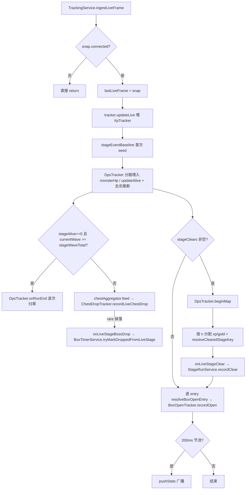

`TrackingService.ts:688-845`。按调用顺序：

1. `!snap.connected` 直接 return。
2. **gold live/save 发散守卫（v1.2.4，2026-09-17）**：在 `lastLiveFrame = snap` 之前，先用 `evaluateGoldDivergence(snap.gold, saveGold=lastSnap?.gold, goldDivergeSinceSec, snap.at/1000, GOLD_DIVERGE_SUSTAIN_SEC=8)`（`core/tracker.ts`）比对 live 读数与上一存档余额。若 `snap.gold < saveGold` → `substitute=true`，用 `saveGold` 覆盖 `snap.gold`、首次触发记 `goldDivergeSinceSec`，持续 ≥8s 置 `tracker.goldLiveSuspect=true`；持平/更高/null → 复位 `goldDivergeSinceSec=null`、`goldLiveSuspect=false`。详见 §4.10 第二道防线。随后 `lastLiveFrame = snap`。
3. `tracker.updateLive({ gold: snap.gold, heroes: snap.heroes }, snap.at / 1000, stage)` — 喂 XpTracker。
4. **stageEventBaseline 初始化**：若 null，用 `tracker.cumulativeGained` 和 `tracker.currentGold` seed。
5. **DPS / monster tracking**：检测 **stage 切换**（`stageKey` 变化，含首次 live frame）→ `dpsTracker.beginMap()`（该检测移出 `monsterHp` 分支，对所有 live 帧生效）；随后分两路喂 DpsTracker：
   - `snap.monsterHp != null` → `dpsTracker.update(monsterHp, deadMonsterCount, timestamp)`（完整 HP 数据，可算 DPS/伤害/存活/最大生命；**空数组也走 update()**——波间怪物清空时正确把 alive 归 0，wave-clear 由 DpsTracker 的 0→N 转换推进）。
   - 否则 `snap.stageAlive != null` → `dpsTracker.updateAlive(stageAlive, timestamp)` —— 仅在 monsterHp 数据源完全缺失（null，偏移无法解析）时兜底，用 StageManager 的存活怪数（v1.01.05 的 `runtime.stage.alive=0x78`）驱动 wave-clear 检测，让波次仍实时推进；DPS/伤害在该情况下保持 0。
   - **monsterHp 数据源回退读取**（2026-08-28 修正）：`readRuntimeMonsterHp` 在 `runtime.monster.monsterList/summonedList` 均为 0（未派生，v1.00.28/v1.01.01/v1.01.05 的 MonsterSpawnManager RVA 有但列表偏移不可派生）时**回退到 v1.00.21 base 偏移（0x28/0x38/0x30）读取**，仅在 MonsterSpawnManager 实例本身解析失败时才返回 null。8/27 曾改为"偏移为 0 直接返回 null"以修复波次冻结，但一刀切切断了 DPS/存活/最大生命的显示（实测 v1.01.05 上 base 偏移仍有效：monsterList 就在 +0x28，HP 真实波动 0..21，旧程序能正常显示这三项）。**波次保护**：空数组走 update() 时 DpsTracker 自身 wave-clear 检测（`_wasAlive && alive===0` → wavesCleared++）正常推进，无需 updateAlive 兜底；只有 monsterHp 为 null（数据源缺失）才回退 updateAlive。
   - **击杀数推断兜底**（2026-08-28）：v1.01.05 的 `deadMonsterList` 偏移 0x30 不可派生（实测该偏移处 List 恒 0），`deadMonsterCount` 恒 0 → 击杀数恒 0。`DpsTracker.update()` 现用**存活列表消失的怪物数**推断击杀：当 dead 计数不可用（null，或卡在 0 而怪物明显消失）时，把本帧从存活列表消失的怪物数计入击杀。波次切换整波消失即整波被击杀，计数准确。正常版本（dead 计数可用）仍优先用 dead delta。
   - **关卡重开兜底**（`dpsTracker.trackStageEndFromAlive`）：`update`/`updateAlive` 每次都会检测 **alive 连续为 0 超过 2s** 即判定关卡结束（结算画面通常 ~1-2s，而波间隙多为亚秒级；阈值由 0.5s 放宽到 2s 于 2026-08-25，避免每波怪物少时波间隙被误判为关卡结束、UI 波次 0/1 跳动），新一局怪物刷新（alive>0）时重置 `_wavesCleared` 到 0、波次从 1 重新计数。这是 **stage-clear 事件被日志尾部漏检**（`readRuntimeStageClears` 25Hz 采样偶发错过 entry 写入→清空窗口，实测约 40% 漏检率）时的兜底，防止 `_wavesCleared` 跨局累计成 "30/16"。
   - **波次达到关卡总波数时的强制重置**（2026-08-27，wave-total catch）：快速自动刷关（如 v1.01.05 刷 4309）时，结算间隙可能 < 2s（躲过 `STAGE_END_ALIVE_ZERO_SEC` 检测）且 heroes 跨关卡不消失（躲过 `onRunEnd` 的队伍撤离检测）——两个关卡结束重置信号都失效，`_wavesCleared` 跨关卡无限累计，UI 波次卡在 "31/31"（被 stats.ts 按 waveTotal cap）。修复：`TrackingService.ingestLiveFrame` 在 failDetector 之后加判断——当 `snap.stageAlive === 0` 且 `dpsTracker.currentWave >= snap.stageWaveTotal` 时调用 `dpsTracker.onRunEnd()` 重置波次。放在 failDetector 之后，保证最后一波团灭（无 clear）仍先按旧波次判定失败，再重置下一局从 1 开始。与 stage-clear 的 beginMap 不冲突（clear 正常到达时波次已重置，`currentWave < waveTotal`，catch 不触发）。日志 `wave: alive=0 at stage total N — run-end reset`。
   - **波次种子化（2026-09-02）**：live 跟踪**在关卡进行中**建立时（应用重启、重新 attach），DpsTracker 从零开始数波会把 UI 波次显示成错误的 "1/N"（v1.01.05 的 live `stageWave` 偏移 +0x138 恒读 0 无法提供权威修正），直到切换地图（`beginMap`）才重新对齐。修复：用存档静态波次 `lastSnap.stageWave`（`save.common.currentStageWave`）调用 `dpsTracker.seedStageWave(wave)`（置 `_wavesCleared = wave-1`、`_wasAlive=false`）——下一帧怪在场即得 `currentWave = wave`，此后正常推进；更晚的 stage 切换**不**重新种子（计数器已从 run 起点开始跟踪，必须从 1 数起）。**种子有两个触发点**（`waveSeeded` 仅在成功时置位，防止锁死）：(a) `ingestLiveFrame` 首个 live 帧的 `beginMap()` 之后——仅当 `lastSnap` 已就绪；(b) **save watcher 的 `onSnapshot`**——实测启动时序是**首个 live 帧（attach 后 ~40ms）先于首次 save 读取（5s poll）**，首帧时 `lastSnap` 通常仍为 null，种子被推迟到首次 save 读到达（`lastLiveStage != null` 保证 beginMap 已跑过）；后续 5s 轮询因 `waveSeeded` 已 true 而跳过，不会覆盖运行中的波次计数。`waveSeeded` 在 `start()`/`onLiveMemoryToggled()` 时复位。存档无波次（≤0）时跳过种子、保持从 1 计数。日志 `wave: seeded from save stage wave N (mid-run attach on first live frame)` / `(first save read after attach)` / `wave: no save stage wave yet — deferring seed to first save read`。
   - **注意**：stage 内 wave 推进（1→2→3...）**不**触发 `beginMap()` —— 早期实现把 `stageWave` 变化也视为地图切换，导致 `_wavesCleared` 每波重置为 0、`currentWave` 永远卡在 1（"波次识别卡住" bug）。per-map 计数（`mapDamage`/`mapMobsKilled`）在 stage 内跨波累计，符合"当前地图总量"语义。
6. **live chest drops**：检测 `snap.chestLogDebug.count < lastCountBefore` → warn（log 缩小是重复记录的特征）。`chestAggregator.feed(snap.chestDrops ?? [], chestAt)` 返回 collapsed categories，对每个 category 调用 `chestDropTracker.recordLiveChestDrop(category, chestAt)` → 成功且 category="rare" → `onLiveStageBossDrop?.(stageKey)` → `boxTimers.tryMarkDroppedFromLiveStage`。**burst 聚合**（`collapseLiveChestDrops`）保留 burst 中出现的**每个 category（含 lone singleton）**——stage-boss（rare）/act-boss（act）宝箱可能只产生 1 条 GetBoxLog，若与其他类别 burst 混合时被当作噪声抑制，会漏掉真实 boss 掉落（"有时漏识别"）。分类（monsterType 0/1/2）上游已有 `CHEST_LOG_SAMPLES` 竞态防御，误判噪声概率低，代价远小于漏掉真实掉落。
7. `onLiveChestSlots?.(snap.chestSlots)` — 路由到 `ChestService.setLiveSlots` 作为 AutoClassify reconcile 的实时槽位覆盖（仅旧版本有效；v1.2.2 下 `snap.chestSlots` 恒为 null，回落 save 派生值，见 13.5）。**null→null 为 no-op（2026-09-10 修复）**：无 live 数据即无新信息，`setLiveSlots(null)` 在 override 已为 null 时直接 return，不再每帧触发 reconcile —— 避免用滞后的上一次 save 去对账把 live 刚入队的箱子剪掉（见 14.4 Step 1）。
8. **stage clears**：若 `snap.stageClears.length > 0`：
   - `dpsTracker.beginMap()`（关卡完成也重置 per-map 计数）。
   - `fallbackStageKey = snap.stageKey ?? lastSnap?.stageKey ?? 0`。
   - 过滤 `clears = snap.stageClears.filter(c => c.valid)`（plague 的 `act=21-23` 视为有效，见下方 readRuntimeStageClears）。
   - 若 `stageEventBaseline` 非 null：`totalXpGained = xp - baseline.xp`，`totalGoldGained = gold - baseline.gold`；按 n 分配，最后一个用余数；`resolveClearedStageKey(clears[i].act, clears[i].stage, fallbackStageKey)` 恢复难度（stageKey 已前进到下一关，所以用 clear 自己的 act/stage 而非当前 stageKey） → `onLiveStageClear?.(clearedStageKey, clearTimeSec, xpGained, goldGained)`。
   - 更新 `stageEventBaseline = { xp, gold }`。
   - **瘟疫（Contaminated）关卡（2026-09-11）**：瘟疫关使用**6 位 stageKey**（`2012xx`=Nightmare 21、`2013xx`=Hell 22、`2014xx`=Torment 23），与普通 4 位 key 完全不相交，且瘟疫关清除日志的 `act`=21/22/23（非 1-9）。此前 `readRuntimeStageClears` 只用 `act 1-9` 校验 → 瘟疫 clear 全部标 `valid=false` → 被 `filter(c => c.valid)` 丢弃，关卡通关记录里**没有瘟疫通关记录**。修复链路：
     - `readRuntimeStageClears` 的 `isPlausibleClearAct`（`core/liveMemory/runtime.ts`）放行 `act 1-9 或 21-23`，瘟疫 clear 正常标记 `valid=true`。
     - `resolveClearedStageKey`（`core/stages.ts`）识别 `fallbackStageKey` 为瘟疫关时，用日志 `act`（21/22/23，跨区推进时更正所属区）+ 日志 `stage` 重建 6 位 key（`plagueBaseFromAct`→2012/2013/2014 × 100 + stage），解决清除后 stageKey 已前进的 off-by-one；`act` 非瘟疫值时回落当前 live 区的 base。
     - `stageName` 对 6 位瘟疫 key 先按完整 key 查 `catalog.stages`（瘟疫关名如 `201201`→"Nightmare Plaguelands" 以此 key 存储），miss 则回退 `<难度> <act>-<stage>`（act 21/22/23 映射 Nightmare/Hell/Torment）。
9. **box opens**：对每个 `snap.boxOpens` 调用 `resolveBoxOpenEntry(entry)` 解析 boxKey/itemKey/name/grade → `boxOpenTracker.recordOpen(...)`。
   - **BoxOpenLog burst 抢读（2026-09-11）**：`snap.boxOpens` 来自 `readRuntimeBoxOpenLog` 对 `BoxOpenLog` 的 tail 读取。玩家短时间内连开多箱会一次性在末尾追加多条 `BoxOpenLog` 条目（每箱一条，itemKey/boxType/level 视为包裹写入）；每条字段在 mid-write 窗口内才提交完整，单次 tail 扫描会把尚未提交的末尾条目 park 到 `boxOpenPin.retryFrom`，只返回已提交的条目。若不补读，park 条目要等下一 25Hz tick（~40ms）才重读，期间日志若被清理（shrink）即永久丢失——表现为"连开 3 箱只记 1 item"。修复（`liveReader.ts read()`）：当此 tick 检出 box-open 活动（`opens.length>0` 或 `retryFrom` 挂起）时，在同一突发窗口内按 `BOX_BURST_ROUNDS`（4 次）× `BOX_BURST_GAP_MS`（2ms）连续重读 `readRuntimeBoxOpenLog`，把各次增量累积进 `opens`；一旦无新提交条目、且无挂起的 mid-write（`retryFrom` 为空）即停；若有挂起条目则在同一突发窗口内持续重读直至其提交（条目提交仅需几 ms，不会耗尽 `retryConsecutive` 预算误触发 force-skip）。
   - **三路 burst 统一（2026-09-11 实测：开启多个，第一个没被记录）**：chest（掉落）、box（打开物品）、stageClear（通关）三条 tail 读取都在 `liveReader.read()` 有对应 burst 抢读。**进入条件统一包含“mid-write 挂起（`retryFrom` 非空）”**，否则当一次开/掉落多个宝箱、**第一个条目恰好 mid-write 时**，单次扫描会把它 park 进 `retryFrom`，但返回的 drops/opens 为空——旧条件（仅看 `length>0` / settle / shrink）不触发 burst，该条要等下一 25Hz tick（~40ms），期间日志 shrink 即永久丢失。修复：`CHEST_BURST` / `BOX_BURST` 进入条件补 `retryFrom != null`，停牌条件改为“无新提交条目且 `retryFrom` 为空才停”，使第一个 mid-write 条目在同一突发窗口内被持续追击到提交。
10. **节流 broadcast**：若 `Date.now() - lastLiveBroadcastMs >= 200` → `pushStats()`。

### 5.8 offset healing 机制

#### 5.8.1 三个周期

| 周期 | 常量                          | 路径                                                 | 调用条件                                                                        |
| ---- | ----------------------------- | ---------------------------------------------------- | ------------------------------------------------------------------------------- |
| 10s  | `HEAL_UNSUPPORTED_MS`         | `maybeHealUnsupported` (`worker.ts:89-101`)          | `attached && !supported`                                                        |
| 30s  | `HEAL_ENRICHMENT_FALLBACK_MS` | `maybeHealEnrichment` Path 2/3 (`worker.ts:136-200`) | `attached && supported && (!enrichmentComplete \|\| isCriticalStaleOnFallback)` |
| 即时 | event-driven                  | `maybeHealEnrichment` Path 1 / 1.5 / 1.6             | box-open event / cache pollution / StageManager transition                      |

#### 5.8.2 critical path vs enrichment path

`healOffsets()`（`liveReader.ts:555-586`，**Rev 13 起不再在内部重置 critical 预算**）：

1. `refreshGameContext()` — 重新读 Version.txt 和 GA base。
2. `resolveOffsets(proc, appBuild)`：
   - 决定 `useCriticalBudget = !isSupported || forceCriticalPath`。
   - critical 模式：`extractOffsets(enrichmentOnly=false)`，跑全部锚点；任一 critical 失败返回 null。
   - enrichment 模式：`extractOffsets(enrichmentOnly=true)`，只跑 LogManager/BoxOpenLog/MonsterSpawnManager/PlayerSaveData；critical 字段保留 base 值。
3. `applyResolvedOffsets` — 更新 `supported` / `offsetSource` / `offsets`。
4. 日志：从 unsupported 翻到 supported 时记 "offsets now supported"；仍 unsupported 时列 critical missing；仍 stale-on-baseline 时记 "still on stale baseline RVAs"（提示恢复需等 Path 1.6）。

**critical 预算重置点已迁移**：旧版（Rev ≤12）`healOffsets()` 内 `if (isCriticalStaleOnFallback) resetCriticalExtractionBudget()` 会每 30s 重置一次，导致 extractor 在 StageManager 未实例化时无限重跑（每次 ~9s）。Rev 13 起此 reset 仅在 `consumeSmTransition()`（Path 1.6 触发）和 `detectCachePollution()`（Path 1.5 触发）内执行，二者都是事件驱动而非定时驱动。

#### 5.8.3 cache pollution 检测与自愈（`liveReader.ts:1224-1295`）

**检测条件**（任一满足即可，用同一个 60s 计时器 `dictFailSince`；正则 `isDictLookupFail` 在 Rev 13 扩展）：

```typescript
const isDictLookupFail = (s: string) =>
  /LogManager singleton unresolved|dict lookup failed|list not walkable/i.test(
    s,
  );
```

- **boxOpen dict-fail**：`readRuntimeBoxOpenLog.opens == null` 且 `boxOpenResult.status` 匹配 `isDictLookupFail`。表示 `getItemWithBoxOpenTypeKey` / `boxOpenLog.itemStringKey` 是未验证的 baseline 副本。
- **chest drops dict-fail**：`readRuntimeChestDrops.drops == null` 且 `chestResult.status` 匹配 `isDictLookupFail`。表示 `logManager` TypeInfo RVA 本身对当前 build 无效，或 `runtime.log.logByType` 是污染值。
- **LogManager singleton unresolved**（Rev 13 新增）：fallback 表的 `logManager` RVA 指向错误 class → 静态块扫描找不到 LogManager 实例。这是 v1.01.02 fallback from v1.01.01 的典型签名（同 major.minor 邻居版本 LogManager RVA 偶尔会偏移到无关 class）。
- 当 boxOpen 和 chest drops **同时** dict-fail 时，LogManager 本身就是问题所在 —— `_criticalRvasValidated` 因上次 extractor 跑过（即使失败）而不被信任校验，cache-pollution 路径是唯一剩余的触发器。

**触发流程**：

1. 首次检测到任一 dict-fail → 记录 `dictFailSince = Date.now()`，本 tick 不动作。
2. 持续 60s（`BOX_OPEN_FAIL_HEAL_MS`）→ 设置 `forceExtractorNextHeal = true` + **同时 `resetCriticalExtractionBudget()` + `resetEnrichmentBudget()`**（Rev 13 新增 critical 重置，因为污染的 cache 也可能让 critical 路径的尝试次数耗尽）。
3. worker 下一 tick 的 `maybeHealEnrichment` Path 1.5 检测到 `needsForcedReextract` → 立即 `healOffsets()`。
4. `resolveOffsets` 内 `forceReextract` 为 true → 绕过 `isOffsetTableComplete` 短路 + 绕过预算 cap。
5. extractor 跑前手动清零 base 的 `getItemWithBoxOpenTypeKey` 和 `boxOpenLog.*` 字段，让 derived 重新填充。`logManager` TypeInfo RVA **不清零**：fallback 场景下 `mergeOffsets` 的 `derivedWins` 规则会让 extractor 派生的新值覆盖 baseline；若 extractor 派生不出（如 StageManager 未实例化），保留 baseline 不降级。
6. extractor 跑完（成功或失败）→ `forceExtractorNextHeal = false` + `dictFailSince = null`。
7. 成功：merged 表覆盖磁盘 cache，下次启动加载干净 cache。失败：用户看到 status-failure 日志，可手动删 cache 目录（`%APPDATA%\tbh-companion\live-memory-offsets\`）。

#### 5.8.4 LogManager name-scan fallback（Rev 13 新增，`liveReader.ts:1444-1490`）

当 `readRuntimeChestLog` / `readRuntimeStageClears` / `readRuntimeBoxOpenLog` 返回 `status` 含 "LogManager singleton unresolved" 时，说明 fallback 表的 `logManager` TypeInfo RVA 对当前 build 无效（静态块扫描走到了错误 class，找不到 LogManager 实例）。`read()` 在首次检测到此 status 时设置 `logManagerNameScanPending` flag（仅触发一次，避免重复扫描）。

worker 下一 tick 在 `runPendingNameScans()` 中检测到 flag，调用 `runLogManagerNameScan(p, ga, o)`：

```
resolveClassByName(p, ga, "LogManager")  // 类名不被混淆
  ↓ 找到 TypeInfo → 静态块扫描第一个 plausible 实例
  ↓ singletonFromClass(p, typeInfo, ga)  // 读 s_Instance 字段
  ↓ isLiveLogManager(p, inst, o)         // 校验 logByType Dictionary 可读 + GetBox bucket 存在
  ↓ 校验通过 → pin 到 chestPin / stageClearPin / boxOpenPin 三个 pin 的 .ptr
```

**与 cache-pollution 的关系**：name-scan 是**即时**恢复路径（一发现就 pin 实例，绕过 stale RVA），cache-pollution 是**异步**根因修复（60s 后让 extractor 重新派生 RVA 写入 cache）。两者互补：name-scan 让日志读取在 25Hz 内立即恢复，cache-pollution 保证下次启动加载到正确的 cache。name-scan 失败不重试（class 找不到或 singleton 字段无法解析属于真正的"LogManager 类未实例化"场景，等 extractor 通过 Path 1.6 派生新 RVA）。

**关键文件路径**：

- `app/src/main/liveMemory/liveReader.ts` — `runLogManagerNameScan()` 实现
- `app/src/main/liveMemory/winProcess.ts` — `resolveClassByName` / `singletonFromClass`
- `app/src/core/liveMemory/runtime.ts` — `isLiveLogManager` 校验函数（Rev 13 新导出）

#### 5.8.5 BoxData 字段结构化派生（Rev 13 新增，`il2cppScanner.ts:findBoxDataFields`）

旧版依赖 BoxData 类的字段名（`BoxTypes` / `BoxQuantity`）匹配偏移，但游戏偶尔混淆这两个字段名（如 v1.00.28），导致 `player.boxTypes` / `player.boxQuantity` 始终为 0，宝箱实时功能在新版本上失效。

Rev 13 引入 `findBoxDataFields(ctx, obj)`，**不依赖字段名**，纯结构特征派生：

```
BoxData 实例 +0x10..INSTANCE_SCAN_MAX，每 8 字节扫一次
  ↓ 找出所有指向 List<int> 的字段（List 指针 plausible + _items 数组 plausible + _size ∈ [1, MAX_BOX_DATA_LIST_COUNT=256]）
  ↓ 在候选 List<int> 字段中找两个 count 相等的
  ↓ 返回 { boxTypes: <第一个 offset>, boxQuantity: <第二个 offset> }
```

**调用时机**：在 `findPlayerSaveData` 内，当 `BoxData` 字段命名匹配成功（`boxData` offset 已知）且 BoxData 实例可达时调用。派生结果写入 `PlayerAnchor.boxTypes` / `PlayerAnchor.boxQuantity`，再由 extractor 落到 `LiveOffsets.boxData.boxTypes` / `LiveOffsets.boxData.boxQuantity`，最后由 `offsetCompleteness.ENRICHMENT_FIELDS` 标记为 enrichment 字段。

**与 save 数据的交叉校准**：`readRuntimeChestSlots` 读取宝箱槽位时，会与 save 解析的 `InventorySnapshot.chests.slots` 数量交叉验证。当 BoxData 派生偏移错误时，chestSlots 读出的 boxTypes 数组长度 ≠ save 的 chests 数量 → 触发 cache-pollution 检测器的间接路径（dict lookup 失败签名），让 extractor 重新派生。

##### 5.8.5.1 BoxData 结构化捕获（Rev 15 新增，`il2cppScanner.ts:findBoxDataStructurally`）

**背景**：`findPlayerSaveData` 依赖 CommonSaveData 静态字段路径找 player 对象，但 **v1.01.02+ 的 CommonSaveData 已被重构为纯元数据类**（live 验证 v1.01.05：字段表仅 version / lastSavedTime / playTime / currentStageKey 等 16 个字段，无 BoxData / PetSaveData / itemSaveDatas 列表）——save 层以 **ES3 字节流**序列化，BoxData 实例不在可指针遍历的托管对象图里，命名匹配必然失败 → `player.boxData` 恒为 0，live chest slots 退化为 save 快照（5s 延迟）。

**Rev 15 的尝试**（`findBoxDataStructurally`）：当 `findPlayerSaveData` 返回 null 或 `boxData=0` 时，extractor 追加一次纯结构捕获：

```
按类名匹配 CommonSaveData / PlayerSaveData（serialization-stable）
  ↓ 实例解析：静态块 staticSlots 优先；+0xb0=0 时走 header-block 扫描
  ↓ 扫描实例指针字段（0x10..INSTANCE_SCAN_MAX）找 BoxData 签名
  ↓ 签名 = findBoxDataFields：两个 List<int> 等长（count ∈ [1, MAX]）
  ↓ 命中 → { boxData: 实例内字段偏移, boxTypes, boxQuantity } → 填入 LiveOffsets
```

**重要约束（v1.01.05 live 验证后的修正）**：只信任 name-matched holder（CommonSaveData / PlayerSaveData 实例）上的 twin-`List<int>`。**不做整堆扫描**——`readRuntimeChestSlots` 用 `playerPtr`（name-scan 找到的 CommonSaveData 单例）`+ player.boxData` 解引用，因此 `boxData` 必须是该**确切实例**上的字段偏移；整堆扫描会命中无关对象（如 `IEnumerable\`1` 上恰好两个等长 int 列表）产生无意义偏移，固化后反而读到垃圾。整堆候选扫描仍保留为诊断（`dumpSaveListHolders` Pass H，`TBH_DUMP_SAVE_LIST_HOLDERS=1`）。

**v1.01.05 实测结论**：CommonSaveData 单例（header-scan 可达 `0x23e85c33670`）字段表无任何 save 列表 → `findBoxDataStructurally` 返回 null → `player.boxData` 保持 0，chest slots 走 save 快照路径（与 v1.01.02 相同，属**预期降级**而非 bug）。玩家开箱后（lists 非空）box-open 事件会重置 enrichment budget 重跑一次，若游戏未来恢复对象图布局则自动恢复。

**捕获工具**（`app/scripts/capture-live-offsets.ts`，dev 工具）：attach 到运行中的游戏 → 检测版本/GA → 跑完整 critical extractor（含 Rev 15 结构捕获）→ 输出 offsets.ts 风格的 TS 常量，用于把新版本固化为 bundled baseline。用法：`pnpm exec tsx scripts/capture-live-offsets.ts`（tsx 在受限 shell 下需先 `pnpm exec esbuild scripts/capture-live-offsets.ts --bundle --platform=node --format=cjs --outfile=.tmp.cjs --external:koffi && node .tmp.cjs`）。

**关键文件路径**：

- `app/src/core/liveMemory/il2cppScanner.ts` — `findBoxDataFields` / `findBoxDataStructurally` / `PlayerAnchor` 接口 / `findInstanceViaHeaderScan`
- `app/src/core/liveMemory/offsetCompleteness.ts` — `ENRICHMENT_FIELDS` 包含 `boxData.boxTypes` / `boxData.boxQuantity`
- `app/src/core/liveMemory/offsets.ts` — `LiveOffsets.boxData` 类型定义、`V1_01_05` bundled 表
- `app/src/core/liveMemory/chestSlots.ts` — `readRuntimeChestSlots` 使用派生偏移读取
- `app/src/main/liveMemory/offsetExtractor.ts` — `EXTRACTOR_REVISION`（Rev 15 bump）与 `findBoxDataStructurally` 接入
- `app/scripts/capture-live-offsets.ts` — bundled 表捕获工具

#### 5.8.6 StageManager-availability transition（Path 1.6，Rev 13 新增）

**死锁根因**：v1.01.02 fallback from v1.01.01 场景下，玩家在主菜单 attach → StageManager 单例未实例化 → extractor critical 模式必失败 → 3 次后 critical budget 耗尽。旧版（Rev ≤12）每 30s 重置 critical budget 导致无限 ~9s extractor 跑（占满 CPU）；Rev 12 引入预算 cap 后又出现"预算永不重置 → 永远 stuck"。

**Path 1.6 数据流**：

```
玩家在主菜单 → read() 内 resolveStageManager 返回 null → smWasAvailable=false
   ↓
玩家进入关卡 → resolveStageManager 返回非 null 实例 → smWasAvailable=true → smTransitionPending=true
   ↓
worker 下一 tick maybeHealEnrichment()
   ↓ consumeSmTransition() 检测 smTransitionPending
   ↓ true → resetCriticalExtractionBudget()（仅 critical，不动 enrichment）
   ↓ healOffsets() 立即触发
   ↓ resolveOffsets 走 critical path（!isSupported || forceCriticalPath）
   ↓ extractOffsets(enrichmentOnly=false) → StageManager 单例已实例化 → 成功派生 fresh RVAs
   ↓ mergeOffsets(derived-wins) → stale baseline RVAs 被覆盖
   ↓ _criticalRvasValidated=true → isCriticalStaleOnBaseline 返回 false
   ↓ Path 3 不再触发，恢复完成
```

**防死循环依据**：`smTransitionPending` 是一次性 flag，consume 后立即清零（`consumeSmTransition()` 第一行就 reset）；玩家进关卡的 transition 是离散事件不会重复触发（除非玩家反复进出关卡，但每次进入都是合法的恢复机会）。

**为什么不用 30s 定时器**：StageManager 单例是否实例化取决于玩家行为（在主菜单 vs 在关卡），与时间无关。30s 定时器要么过频（玩家一直在主菜单，每 30s 跑一次 9s 浪费 CPU），要么过慢（玩家进入关卡后还要等下次 30s tick 才恢复）。事件驱动的 Path 1.6 在玩家进入关卡的**下一 tick（40ms 内）**就触发恢复，延迟最低。

**关键文件路径**：

- `app/src/main/liveMemory/liveReader.ts:461-468` — `consumeSmTransition()` 实现
- `app/src/main/liveMemory/liveReader.ts:261-274` — `smWasAvailable` / `smTransitionPending` 字段
- `app/src/main/liveMemory/worker.ts:179-189` — Path 1.6 worker 端入口

### 5.9 沙箱（Sandboxie-Plus）下的三条模块枚举 fallback

`WinProcess.listModules()`（`winProcess.ts:479-508`）的三级链：

#### Path 1: ToolHelp（`listModulesViaToolhelp`，`winProcess.ts:510-532`）

- `CreateToolhelp32Snapshot(TH32CS_SNAPMODULE | TH32CS_SNAPMODULE32, pid)`。
- `Module32FirstW` / `Module32NextW` 遍历。
- **Sandboxie-Plus 拦截**：即使 companion 与 game 都在同一个沙箱内，CreateToolhelp32Snapshot 也可能返回空快照。

#### Path 2: PSAPI（`listModulesViaPsapi`，`winProcess.ts:544-577`）

- `EnumProcessModulesEx(handle, null, 0, &needed, LIST_MODULES_ALL)` 询问所需 buffer 大小。
- 分配 buffer → 第二次调用填充 HMODULE 数组。
- 对每个 HMODULE：`GetModuleFileNameExW` 拿路径 + `GetModuleInformation` 拿 base/size。
- **优点**：直接在已 opened 的 handle 上调用，不创建 snapshot，沙箱通常不拦截。
- **缺点**：返回的是 HMODULE 数组（8 字节指针），需要二次调用拿名字和尺寸 —— 比 ToolHelp 慢但可靠。

#### Path 3: PowerShell（`listModulesViaPowerShell`，`winprocess.ts:579-621`）

- `Get-Process -Id <pid>` → `$p.Modules | Select ModuleName, FileName, BaseAddress, ModuleMemorySize | ConvertTo-Json`。
- **最慢**：fork 子进程 + PowerShell 启动开销 ~100-300ms。
- 仅在前两条都返回空时触发，并通过 `winProcessLogger` 记录原因。

**多实例沙箱隔离**（`winProcess.ts:330-390`）：

当 ToolHelp 返回多个 TBH 进程时（host + sandboxed）：

1. `isCurrentProcessInSandbox()` — 自检：`process.env.sandbox` 或 `GetModuleHandleW("sbiedll.dll")`。
2. 对每个候选 TBH 进程：`isProcessInSandbox(pid)` — OpenProcess + EnumProcessModulesEx 找 `sbiedll.dll`。
3. `selectProcessBySandbox(candidates, companionInSandbox)`：优先选 sandbox 状态一致的候选；同状态多个时取最高 PID；全部不一致时退化为最高 PID（永不返回 null）。
4. 单候选 fast path 跳过沙箱探测（省 OpenProcess + EnumProcessModulesEx 开销）。

### 5.10 进程分离 / 重连 / 退出时的清理流程

#### 5.10.1 游戏退出（reader 仍 attached）

- `LiveMemoryReader.read()` 开头检查 `p.isAlive()`（`GetExitCodeProcess` 返回非 `STILL_ACTIVE=259`）。
- 失活 → `this.detach()` → 返回 null。
- worker 下一 tick `loop()` 看到 `!reader.attached` → `reader.attach()` → `WinProcess.findByNames` 找不到游戏 → `attach` 返回 false → worker 切到 `POLL_DETACHED_MS=1500ms` 重试。

#### 5.10.2 worker 崩溃

- `LiveMemoryService.ts:150-165` 的 `child.on("exit")` 触发：
  - stderr 拼接（最多 64KB）写入 log。
  - 构造 `running:false, attached:false, supported:false, note:"live reader stopped unexpectedly"` status 广播给 renderer。
  - 清空 `lastSnapshot`。
  - `this.child = null`。
- **不自动重启** —— `LiveMemoryService` 没有 restart 逻辑。用户需要重新 toggle Live Memory 开关或重启 companion。

#### 5.10.3 用户关闭 Live Memory（`LiveMemoryService.stop()`）

1. `child.removeAllListeners()` — 防止 exit/message 事件触发后续广播。
2. `child.postMessage("stop")` — 通知 worker 进入优雅关闭。
3. `child.kill()`。
4. `this.child = null`、`lastSnapshot = null`。
5. 构造 terminal status（`running:false`）广播给 renderer。

worker 端（`worker.ts:252-269`）：

- 收到 `"stop"` → `clearTimeout(timer)` 停止调度。
- `reader.detach()` 关闭 game handle。
- `process.exit(0)` — 显式退出 utilityProcess 释放 native FFI 资源。

#### 5.10.4 `LiveMemoryReader.detach()`

- `proc.close()` — `CloseHandle` 关闭游戏进程 handle。
- 所有指针/状态字段重置为初始值。
- 所有 pin state 重新构造（`makeGoldPinState()` 等）。
- 缓存字段清零：`cachedInventory/cachedPets/boxTypeCatalogMap/boxOpenCountPrev/boxOpenEventPending`。
- cache-pollution 检测器重置：`dictFailSince=null, forceExtractorNextHeal=false`。
- 名字扫描状态重置：`monsterNameScanAttempted/playerNameScanAttempted/...`。
- `offsets/offsetSource/gameVersion/gameInstallDir` 也清空，重新 attach 时从 bundled/cache 重新解析。

### 5.11 LiveMemoryDiagnostics tab

`app/src/renderer/tabs/LiveMemoryDiagnostics.tsx` 是 dev-only tab。`liveReaderState(status, status?.running)`（`status.ts:17-26`）的 5 态映射：

```
!enabled                          → "off"
!status || !running || !attached  → "connecting"
status.scanning                   → "scanning"
!status.supported                 → "degraded"
else                              → "attached"
```

`LiveMemoryStatus` 关键字段：`running / attached / pid / gameVersion / supported / note / scanning / offsetHealth`。`offsetHealth` 包含 `complete / missing / source / extractionAttempts / fallbackFromVersion`。

---

## 6. Inventory 业务流程

### 流程图

解析 → onInventory → resolveAndPushInventory（worker / sync fallback）→ locale 后处理 → 广播。

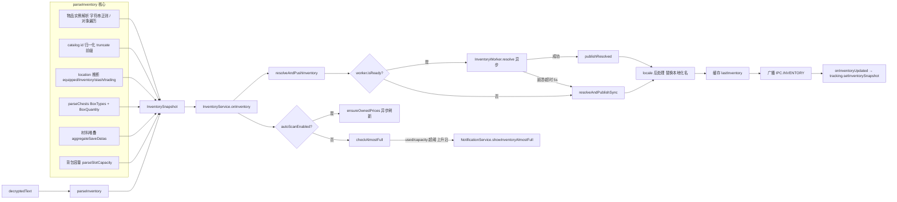

### 6.1 parseInventory（`app/src/core/inventory/parse.ts`）

`parseInventory(decryptedText, saveMtime = 0, isMaterialItemKey?) → InventorySnapshot`：

1. `JSON.parse(decryptedText)` 得到 root，从 `root.PlayerSaveData` 取出 `value`（字符串形式优先）。
2. **物品实例解析**（两条路径）：
   - `parseItemsFromPlayerString(playerStr)`：当 `PlayerSaveData.value` 是 JSON 字符串时，用正则切出 `equippedItemIds`、`inventorySaveDatas`、`stashSaveDatas`、`tradingStashSaveDatas`、`itemSaveDatas` 数组，再用 `splitTopLevelObjects(arr)` 按花括号深度切分出每个顶层 `{...}` 物品对象，最后在每个对象内独立提取 `ItemKey` / `UniqueId` / `IsChaotic` 字段。**字段顺序无关** —— 游戏 v1.00.28+ 在 `UniqueId` 与 `IsChaotic` 之间插入了 `PrevUniqueId` / `IsBlocked` / `IsServerPendingItem`，曾让旧的"三字段相邻"正则（`ITEM_TRIPLE_RE`）匹配 0 个物品导致背包页空白，已修复。`UniqueId` 保留为字符串（超过 `Number.MAX_SAFE_INTEGER`，数值化会丢精度）。
   - `parseItemsFromPlayerObject(player)`：当 value 已是对象时，直接遍历 `player.itemSaveDatas` 数组（按对象属性访问，本身字段顺序无关）。
3. **catalog id 归一化**：`trackSaveItemKey(rawItemKey, ...)` 调用 `catalogItemKeyFromSave(rawItemKey)`（`app/src/core/gamedata.ts`）：
   - 6 位数以下直接返回。
   - 7 位数以上按 `Math.trunc(itemKey / 1000)` 取前缀，落在 `[110001, 939999]` 区间则用前缀。
   - `isMarketPipelineSaveItemKey`（结尾 `900`）单独标记为 pipeline-only，不计入可分配物品。
4. **location 推断**：`resolveLocation(uniqueId, equipped, inventory, stash, trading)` 返回 `"equipped" | "inventory" | "stash" | "trading" | "unknown"`。
5. **chests 解析**：`parseChests(player)` 从 `player.BoxData.BoxTypes` + `BoxData.BoxQuantity` 配对生成 `ChestHolding[]`。
6. **材料堆叠**：若 `isMaterialItemKey` 注入，则 `parseAggregateEntries(player)` 从 `player.aggregateSaveDatas` 按 `aggregateSubKeyToItemKey` 映射回 catalog id，再通过 `materialStacksFromAggregates` 过滤出材料，得到 `Map<itemKey, stackQty>`。
7. **背包容量**：`parseSlotCapacity(arrText)` 遍历 `inventorySaveDatas` 的扁平对象数组，`IsUnlock=true` 计入 `capacity`，`ItemUniqueId !== 0` 计入 `used`。

返回 `InventorySnapshot`：`{ items, chests, saveMtime, materialStacks?, inventoryCapacity, inventoryUsed, marketPipelineOnlyCatalogKeys? }`。

### 6.2 inventory core 各子模块职责

均位于 `app/src/core/inventory/`：

- **aggregates.ts**：`parseAggregateEntries(player)` 提取 `{ type, subKey, value }` 三元组；`aggregateSubKeyToItemKey(type, subKey)` SubKey → ItemKey 映射；`materialStacksFromAggregates(entries, isMaterialItemKey)` 过滤出材料。
- **composition.ts**：`computeInventoryComposition(rows, feeRates)` 聚合 `InventoryComposition`（计数维度 + 价格维度 + 手续费）；每行的 `value` 字段在此设置。`buyOrderValuedTotal` 累加毛额，`buyOrderNetTotal` 通过 `instantSellNetValue` 逐级扣费精确累加（不再用整体 feeRatio 估算）。
- **location.ts**：`unassignedCount(row)`、`rowMatchesLocation(row, filter)`、`rowMatchesAnyLocation(rows, filter)` 用于 UI 位置过滤。
- **buyOrder.ts**：`instantSellValue(ownedCount, levels)` 把 `ownedCount` 件物品按 `BuyOrderLevel[]` 从高到低价吃单，返回毛额 `{ value, coveredCount }`；`instantSellNetValue(ownedCount, levels, rates)` 同逻辑但每档按 `sellerProceedsFromBuyerPrice(price, rates)` 计算净到手（逐级扣 Steam/厂商交易成本与收款保底）。
- **ownedPriceTargets.ts**：`ownedPriceTargetForItem(item)` 单个 GameItem → `OwnedPriceTarget | null`；`ownedPriceTargets(snapshot, lookup, excludeItemKey?)` 遍历派生目标去重；`flattenOwnedHashes(targets)` 摊平为 `string[]` 供价格缓存裁剪使用。
- **predictFillTime.ts**：`predictFillTime(input)` 根据 `inventoryCapacity / inventoryUsed` + 多个 `ChestFillSource` 预测多久后背包满。每个 chest type 是串行队列，开箱速率 = `3600 / autoOpenSecondsPerChest`。
- **columnPrefs.ts**：UI 表格列可见性配置归一化。

### 6.3 InventoryService.resolveAndPushInventory

文件：`app/src/main/services/InventoryService.ts`。

`onInventory(snap)`（被 appState 通过 TrackingService 回调注入）：

1. 缓存 `lastInventoryRaw = snap`。
2. 调用 `resolveAndPushInventory()`。
3. 若 `autoScanEnabled`，调用 `ensureOwnedPrices()`（异步刷新 Steam 价格）。
4. `checkAlmostFull(snap)`：当 `used / capacity >= threshold` 且为上升沿时，触发 `onAlmostFull` 回调（appState 注册为 `notifications.showInventoryAlmostFull`）。

`resolveAndPushInventory()` 流程：

1. 若 `lastInventoryRaw` 或 `market` 为空，直接返回。
2. `buildOwnedPriceLookupMap()`：从 `currentOwnedPriceTargets()` 派生 hash 列表，从 `market.get(hash)` 拿 `PriceEntry`，构造 `Map<hash, InventoryPriceInfo>`（只装 owned hashes，避免把整张 cache 推给 worker）。
3. `collectExcludedItemKeys()`：把所有 stage box itemKey 收集为 `number[]`。
4. 若 `worker.isReady()`：
   - `worker.resolve(snapshot, priceLookupMap, excludeItemKeys)` 异步返回 `ResolvedInventory`。
   - 成功 → `publishResolved(resolved)`；失败（crash / 5s 超时）→ 走 sync fallback `resolveAndPublishSync`。
5. 否则直接 `resolveAndPublishSync`（启动期/worker 崩溃后）。

`publishResolved(resolved)`：

1. 注入 currency 到 `resolved.currency` 和 `resolved.composition.currency`。
2. **locale 后处理**：遍历 `resolved.rows`，用 `getMergedGameItem(row.itemKey)` 重新解析 row.name（worker 不能在运行时切 catalog，所以英文/占位名在主进程替换成本地化名）。
3. 缓存 `lastInventory = resolved`。
4. `broadcast(IPC.INVENTORY, resolved)` 推送给所有 renderer。
5. `onInventoryUpdated?.(resolved)` 回调（appState 注册为 `tracking.setInventorySnapshot`）。

**关键不变量**：Steam Market 调用与 `lookupPriceSnapshot.prices[hash]` 查询都用英文 hash，不能用本地化名（`marketHashName` 在 `app/src/core/marketName.ts` 中通过 `sourceName` 字段保留英文来源）。

### 6.4 inventoryWorker（utility process）

文件：

- `app/src/main/services/inventoryWorker.ts`：host 端 wrapper（`InventoryWorker` 类）。
- `app/src/main/services/inventoryWorkerEntry.ts`：worker 进程入口（被 `utilityProcess.fork` 加载）。
- `app/src/main/services/inventoryWorkerProtocol.ts`：纯协议处理器（`handleInit` / `handleResolve`），无 Electron 依赖，可单测。

**为什么用 worker**：解析 10 万件 items 的 map/filter/price-lookup 会阻塞 main thread，影响 IPC + 窗口管理。

**生命周期**：

- `init(gameDataLookup, feeRates)`：首次调用 `utilityProcess.fork`；已有 child 时只 postMessage 一条 `init`（不重新 fork），用于 gameData reload 或 fee rates 变更。
- `resolve(snapshot, priceLookup, excludeItemKeys?)`：未 ready → 直接返回 `resolveSync(...)` 的 Promise；否则分配 `id = nextId++`，存入 `pending: Map<id, ...>`，5s 超时自动 reject；postMessage `{type:"resolve", id, snapshot, priceLookupEntries, excludeItemKeys}`。
- `stop()`：发送 `stop`、`child.kill()`、reject 所有 pending、清空状态。

**消息协议**：

- Inbound（host → worker）：`init`、`resolve`、`stop`。
- Outbound（worker → host）：`ready`、`resolve`、`log`。

**fallback 保证**：worker 崩溃/超时/启动期都不会让 UI 失去 inventory 更新——`resolveAndPushInventory` 在 catch 里调 `resolveAndPublishSync`，sync 路径调用 `worker.resolveSync`（直接调 `resolveInventory`，与异步路径同一函数）。

### 6.5 priceCache 更新策略

文件：`app/src/main/services/priceCache.ts` + `steamMarketProvider.ts`。

#### 持久化结构

- `PriceEntry`：`{ lowest, median, volume, rawLowest, rawMedian, fetchedUtc, buyOrder, rawBuyOrder, buyOrderQuantity?, buyOrderLevels?, buyOrderFetched?, buyOrderCheckUtc? }`。
- `PriceCache`：`{ currency, fetchedUtc, prices: Record<hash, PriceEntry> }`。
- 文件路径：`app.getPath("userData")/prices.<CUR>.json`。`priceCacheSeedPath` 在 app bundle 旁边找 seed 文件，作为冷启动 fallback。

#### TTL 与新鲜度

- `FRESH_TTL_MS = 24h`。
- `isFresh(name, now)`：要求 entry 有 sell price 或 buy order；sell 端 `now - fetchedUtc < 24h`；buy 端 `now - buyOrderCheckUtc < 24h`。
- `pendingTargets(targets, force, now)`：force=true 全返；否则只返非 fresh 的。

#### 持久化时机

- 每次 `market.refresh()` 完成后 `persistPriceCache(cache)`。
- 流式持久化：`fetchAllTargets` 中每 `PERSIST_EVERY_PRICED = 5` 个新价格落盘一次（防长任务中断丢失进度）。
- `pruneCache(ownedHashes)`：删除 cache 中不在 owned 集合的 hash，落盘。

#### Steam API 限流处理

- `DEFAULT_DELAY_MS = 3000`（20 req/min）。
- `MAX_DELAY_MS = 60000`；退避乘子 2。
- `MAX_RETRIES_PER_TARGET = 2`。
- `MAX_CONSECUTIVE_RATE_LIMITS = 3`：跨 target 连续 3 次 429 触发 circuit breaker。
- `Retry-After` header 优先于指数退避：`waitMs = Math.max(retryAfterMs, backoffMs)`。
- `cancel()`：设 `cancelled = true`，`sleepUntil` 每 100ms 检查取消标志。
- 网络错误 fallback：若 `response.reason === "network"` 且 cache 中已有该 hash 的 market data，则刷新时间戳让其变 fresh。

### 6.6 背包满检测与 fillPrediction

- **容量数据来源**：`parseInventory` 中的 `parseSlotCapacity(arrText)`。
- **几乎满通知**：`InventoryService.checkAlmostFull(snap)`：`thresholdRatio = getAlmostFullThresholdPercent() / 100`（来自 `config.inventoryAlmostFullThresholdPercent`，默认 90）；`isAbove = used / capacity >= thresholdRatio`；**上升沿触发**：仅在 `wasAboveAlmostFullThreshold === false → true` 时调 `onAlmostFull`。
- **fillPrediction**：`predictFillTime`（见 6.2）由调用方（ChestService / BoxTimerService）组装 `ChestFillSource[]` 后调用。

---

## 7. Lookup 业务流程

### 流程图

LookupService 加载 bundled 目录；LookupPriceService（CI 快照）与 LookupPricePollingService（本地轮询）双路径，polling 数据 merge 进内存快照。

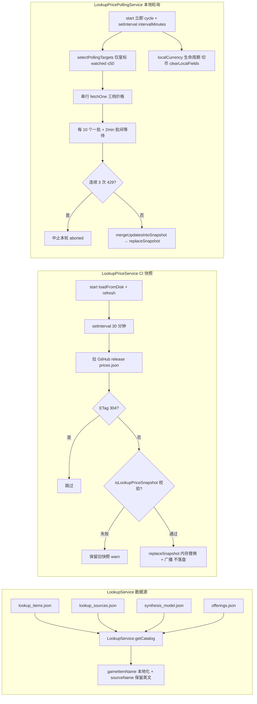

### 7.1 数据源（`app/src/main/services/LookupService.ts`）

构造时一次性加载四个 bundled JSON（通过 `app/src/core/lookup/catalog.ts` 的 loader）：

- `lookup_items.json` → `LookupItem[]`：每个可获取物品的 stats、来源图、合成路径等。
- `lookup_sources.json` → `LookupSources`：box/stage/drop source graph。
- `synthesis_model.json` → `SynthesisModel`：合成配方、grade 权重、bucket 池。
- `offerings.json` → `OfferingsModel`：硬币献祭掉落表。

`LookupService.getCatalog()` 返回 `LookupItem[]`，并在 `localeCatalog` 非空时通过 `gameItemName(item, localeCatalog)` 本地化 name，同时把原始英文名存到 `item.sourceName`（关键：保证 `marketHashName` 仍派生英文 hash）。

**渲染端共享**（2026-09 起）：renderer 不再在每个标签页挂载时各自 fetch 目录 —— `TbhProvider` 启动即预取一次并随语言切换重新拉取，经 `TbhContext.lookupCatalog` 供所有页面共享（`useLookupCatalog` 只是消费该字段）。目录未就绪（返回 null）时，物品栏表名单元格与掉落页名称单元格渲染骨架条而非灰点占位，首次可见渲染即「图标 + 品质色」，避免目录到达后出现明显的第二次更新。

### 7.2 box / item / offering 查询（`app/src/core/lookup/`）

- **offerings.ts**：`offeringForCoin(model, coinKey)`、`offeringSourcesForItem(model, itemKey)` 按 `poolPct` 降序。
- **synthesis.ts**：`pathsToItem(item, model)` 返回所有合成路径含 `pGrade / pLevel / itemPoolPct / chance`；`simulate(...)` 给定参数下所有可能产物的概率分布。
- **boxDisplay.ts**：UI 展示用纯函数（`boxCategoryLabel`、`boxDropViaLabel`、`summarizeSpawnPcts` 等）。
- **classRestriction.ts**：`classForGearType(gearType)` 武器 gearType → 英雄职业（Knight/Ranger/Sorcerer/Priest/Hunter/Slayer）；`LOOKUP_CLASS_ORDER` 6 个职业的固定展示顺序。
- **唯一效果渲染本地化**：图鉴装备「唯一效果」文本（`LookupItem.stats.unique`）渲染走 `app/src/renderer/lib/itemLabels.ts` 的 `uniqueModLabel(mod, text, t?, params?)`——按 `mod` 后缀查 i18next `common:labels.uniqueMods.<mod>`（由 `flatGameKeysToLabels` 从游戏 locale 的 `UniqueMod_*` 前缀摊平而来）。`scripts/build_tbh_data.py` 的 `gear_unique()` 现在从 `SkillInfoData` 构建技能键集合，把 `UniqueModInfoData.Param1..5 + ParamXExchangeType` 归类为 `params:[{value,exchange,kind}]` 写入 `lookup_items.json`（kind ∈ percent/number/scale100/element/skill/hero/unknown）。渲染端填充：技能名经 `common:labels.skillNames.<SkillKey>`（新增 `SkillName_` 前缀分支）、职业名经 `labels.classes`、`percent/scale100/number` 数值换算后填入模板；**任一占位符不可解析**（元素 `element`、`StatValueUp` 的 `unknown`）或缺少 `params` 时整行回退 `text`（英文后缀）。图鉴卡片 `ItemCard.tsx` / `ItemDetailCard.tsx` 两处接线。

### 7.3 LookupPriceService vs LookupPricePollingService

#### LookupPriceService（CI 快照客户端，`app/src/main/services/LookupPriceService.ts`）

- **数据来源**：GitHub release `https://github.com/lucasfevi/tbh-companion/releases/download/lookup-prices/prices.json`（CI 每 6 小时构建一次）。
- **职责**：拉取 CI 快照、缓存、广播；**从不调用 Steam**。
- **缓存路径**：`app.getPath("userData")/lookup_prices.json`。
- **启动**：`start()` 先 `loadFromDisk()`，再 `refresh()`，然后 `setInterval(refresh, 30 * 60 * 1000)`（30 分钟轮询）。
- **ETag**：缓存 `etag`，下次请求带 `If-None-Match`，304 时跳过。
- **校验**：`isLookupPriceSnapshot(value)` 检查 `schemaVersion === 1`、`generatedUtc`、`prices`、`fx` 字段。
- **持久化策略**：磁盘上 `lookup_prices.json` 只存 CI 纯净数据；内存中可保留 `pricesLocal/medianLocal/buyOrderLocal/localCurrency`（polling 写入），下次 CI 刷新时通过 `mergeLocalFields` 保留。
- **`replaceSnapshot(snapshot)`**：供 polling service 调用——只在内存替换 + 广播，**不落盘**（保持 CI 快照纯净）。

#### LookupPricePollingService（本地轮询，`app/src/main/services/LookupPricePollingService.ts`）

- **数据来源**：直接调 Steam `priceoverview` + `itemordershistogram`。
- **职责**：本地周期性刷新**用户收藏（星标）物品**的价格，merge 进内存 snapshot。
- **抓取三档价格**：`pricesLocal[hash]`（最低出售价）、`medianLocal[hash]`（最近成交价中位数）、`buyOrderLocal[hash]`（最高收购价）。
- **localCurrency 生命周期与货币切换**：polling 以「cycle 开始时的显示货币」抓取上述三档价格，并把 `localCurrency` 写成快照级字段的该货币。图鉴展示（`resolveLookupPrice`）仅在 `localCurrency` 与当前显示货币一致时才走 local 路径，否则回退 CI 快照 USD × fx。**切换货币时**（`SET_CURRENCY` handler / Settings 补丁）由 `appState` 调用 `LookupPriceService.clearLocalFields()` 清空 `pricesLocal/medianLocal/buyOrderLocal/localCurrency`（保留 CI 的 `prices`/`fx`/`fetchedUtc`）并广播——防止「未经新币覆盖的 hash 残留旧币数值、却随新 `localCurrency` 被当作新币展示」；下一次 polling cycle 会以新货币重新抓取回填。
- **配置**（`LookupPricePollingPrefs`）：`enabled`、`intervalMinutes`（5-60，默认 10）、`thresholdUsd`（默认 1.0）、`watchedHashes`（用户收藏）。
- **目标选择**（`app/src/core/lookupPrice/polling.ts` 的 `selectPollingTargets`）：**图鉴页仅轮询星标（watched）物品**，无条件入选，去重去空、保序；上限 `maxTargets = 50`。`thresholdUsd` 与快照/拥有集合不再参与图鉴轮询目标筛选（交易页「刷新历史价格」另有全量高价值集合，见 8.7 `selectHistoryRefreshTargets`）。
- **cycle 流程**：互斥锁 `cycleRunning`；串行遍历 targets（上限 `maxTargets = 50`），调 `fetchOne(hash, targetCurrency)`；每个 item 后 `sleep(FETCH_DELAY_MS = 3000)`；**每拉完 `MAX_TARGETS_PER_BATCH = 10` 个且还有剩余目标时，等待 `BATCH_GAP_MS = 2min` 再拉下一批**（与市场交易额 `refreshHistory` 的批间等待同理，避免 >10 个目标一次跑完触发 Steam 限流）；任一子调用 429 → `consecutiveRateLimits++`；达 `MAX_CONSECUTIVE_RATE_LIMITS = 3` 中止本轮（`aborted: true`）；priced > 0 时 `mergeUpdatesIntoSnapshot` 调 `lookupPrices.replaceSnapshot` 广播。
- **定时调度（Rev：移除 6h 固定冷却）**：`start()` 立即触发一次 cycle，然后 `setInterval(pollOnce, intervalMinutes)` **严格按配置间隔触发**。`pollOnce` 不再做固定时长（6h）冷却——旧版 `POLLING_MIN_REFRESH_MS = 6h` 冷却曾让自动周期在成功 cycle 后 6 小时内全部跳过，导致「轮询间隔（5–60 分钟）」设置形同虚设（市场/图鉴价格与交易页成交量长时间不更新），故随 `lookup_polling_cache.json` 持久化机制一并移除。**限流保护改由以下机制承担**：`cycleRunning` 互斥锁（上一轮未结束则跳过）、逐项 3s 间隔、每 10 个一批 + 2min 批间等待、429 退避与连续 3 次熔断；重启/开开关仍会立即跑一轮，Steam 端异常由本轮熔断兜底。
- **单 hash 手动刷新**（`pollSingleHash`）：UI 点"立即刷新此物品"按钮时调，不走 selectPollingTargets。

### 7.4 lookupPrice 的 sweep 流程（CI 端）

`app/src/core/lookupPrice/sweep.ts` 的 `sweepListedPrices` 是 CI 构建端的纯函数：

- **优先级**：`refreshOrder(hashes, prior, now, minAgeMs)` = missing hashes first + stale priced hashes oldest-first（`minRefreshAgeMs = 12h` 默认）。
- **限流**：`baseDelayMs = 1500`、`maxDelayMs = 30000`、`maxConsecutiveRateLimits = 6`（CI 比 client 宽松）。
- **熔断**：连续 6 次 429 中止 sweep，保留已抓数据，下次 CI run 从 `prior` 续抓。
- **assembleSnapshot**（`assemble.ts`）：调 `sweepListedPrices` → `fetchFxWithFallback` → `buildSnapshot` 产出最终 `LookupPriceSnapshot`。

### 7.5 snapshot 持久化路径与失效策略

- **CI 端**：`lookup-prices` GitHub Action 跑 `assembleSnapshot`，发布到 release tag `lookup-prices` 的 `prices.json` asset。
- **客户端缓存**：`userData/lookup_prices.json`。
- **失效策略**：ETag 304 → 跳过；`generatedUtc` 相同 → 跳过；校验失败 → 保留旧快照，log warn；30 分钟轮询保证及时性；用户在 Settings 清除 app data 时 → 删 `lookup_prices.json`。
- **本地 polling 数据**：只在内存，不落盘；CI 快照刷新时通过 `mergeLocalFields` 保留 `pricesLocal/medianLocal/buyOrderLocal/localCurrency`。**切换显示货币时**由 `LookupPriceService.clearLocalFields()` 清空这些本地字段并广播（回退 CI USD × fx，见 7.3），下一轮 polling 以新货币重新抓取。

### 7.6 Watched hashes（用户收藏）存储与轮询

- 存储：`config.lookupPricePolling.watchedHashes: string[]`（`config.json` 持久化）。
- `sanitizePollingConfig(cfg)`：去重、去空、trim。
- `setConfig(cfg)`：仅 `enabled` toggle 或 `intervalMinutes` 变化时重启定时器；`thresholdUsd` / `watchedHashes` 变化不重启。
- 轮询：`selectPollingTargets` 只把 `watchedHashes` 作为 targets（图鉴仅更新星标物品），去重去空、保序，无论是否拥有、是否有价格，优先抓取。

### 7.7 宝箱获取规律与内容物期望价值（含瘟疫宝箱）

Lookup 宝箱详情的「获取规律 + 价值」展示，纯 renderer + core，无新 IPC 通道。

- **获取规律五维**（`BoxCardParts.tsx BoxCardHeader`/`BoxCardDropSummary` 与 `BoxDetailCard.tsx`）：
  1. 掉落关卡范围 `dropStageRangeLabel`（`splitDropStageRangeLines` 拆行）；
  2. 击杀类型 `via`：`monster_box` / `boss_box` / `act_boss`（`boxDropViaSummaries` 汇总各 via 的 spawnPct 最小–最大区间）；
  3. 掉落率 `spawnPct%`（每行 `fmtDropPct`）；
  4. 首掉标记 `firstDropOnly` + `firstDropStages`（"仅首次通关"）；
  5. 难度/关卡名经 `stageName`（瘟疫 6 位 key 见 5.7）。
- **瘟疫类别识别**：tbh-data 把瘟疫宝箱（`915xxx`/`925xxx`/`935xxx`）分类标签归为普通 `common`/`stage_boss`/`act_boss`，无法据此识别瘟疫。新增纯函数 `boxPlagueTier(boxItemKey)`（`core/lookup/boxDisplay.ts`）：按 9xxx id 前缀判定 `plagueCommon`/`plagueRare`/`plagueAct`，UI 由此显示瘟疫类别徽标（`translateBoxPlagueTier` + `box.plague*` i18n key）。
- **获取分组规律**：瘟疫宝箱的「每图/共享/按章」对应关系由掉落来源数据推断而非硬编码。纯函数 `boxPlagueRule(boxItemKey, stages)` 依 `via` + 地图数判定 `shared-group`（`monster_box`、多个相邻地图共享一箱，如普通箱每 5 关共用一个）/ `unique-stage`（`boss_box`、每图独有）/ `unique-act`（`act_boss`、每章独有），返回 `{ kind, stageCount }`。`BoxDetailCard` 在标题下以「获取规律」StatGroup 展示（`translateBoxPlagueRule` + `box.rule*` i18n key），非瘟疫宝箱不显示。
- **内容物期望价值**：宝箱本身 `marketTradable=false` 无市场价，价值来自内容物。新增纯函数 `boxExpectedValue(drops, unitPrice)`（`core/lookup/boxDisplay.ts`），`value = Σ(dropPct × unitPrice(itemKey)) / 100`。`unitPrice` 由 renderer 注入 `useLookupPrices().resolve(item).amount`（当前货币买单价）。降级规则：无任何 content 定价（`pricedCount===0`）→ `value=null`，UI 显示「暂无内容物市场价数据」仅列内容物+掉率；有定价时显示期望值 + 「已按市场价覆盖 priced/total 项」。
- 展示位点：`BoxLoot.tsx` 顶部 StatGroup（期望价值）+ 每行内容物右端价格；`BoxCardParts.tsx` header 瘟疫类别徽标。

### 7.8 合成点数（宝箱价值评价体系）

需求：为宝箱**掉落物品**按品质给一个「合成点数」作为价值度量，评分即可合成该品质所付出的"普通点"总成本。纯函数在 `app/src/core/synthesisPoints.ts`，数据展示挂靠在 `BoxOpenTracker.getStats` 的 breakdown 行与箱级合计上（Loot 页）。

- **品质基础点数**（非饰品）：以 COMMON=1、UNCOMMON=9 为锚点，按 `data/synthesis_model.json` 每级合成升到下一级的上浮概率 `P_up(g) = (weights[+1]+weights[+2])/total(g)` 递归：`V[g] = V[g-1] × 9 ÷ P_up(g-1)`（9 = 合成单次消耗材料数 `materialAmount`）。COMMON..IMMORTAL 的 `P_up` 恒为 1（低品质几乎必然升级），故点数恰为 9 的幂（1/9/81/729/6561）；IMMORTAL 起 `P_up` 逐级下降，点数按成功率膨胀：ARCANA≈11.8 万(50.12%)、BEYOND≈317 万(33.44%)、CELESTIAL≈1.23 亿(23.14%)、DIVINE≈66.5 亿(16.68%)、COSMIC≈6.59 万亿(9.09%)。常量 `SYNTHESIS_POINTS`（`synthesisPointsForGrade` 读取），数值与产品确认一致。
- **饰品类倍率**：`gearGroup === "ACCESSORY"`（`isAccessoryItem`）→ `synthesisPointsForItem(grade, isAccessory)` 返回基础点数 ×3（`ACCESSORY_POINT_MULTIPLIER`）。未知/不受支持品质返回 `null`。
- **挂接路径**：`BoxOpenTracker.getStats(priceResolver, isAccessory?)`（2026-09-11 起签名改为仅 `priceResolver` + 可选 `isAccessory`，移除 `sessionSeconds`/`nowSecondsOverride`）。对每个 breakdown 行算 `synthesisPointsUnit = synthesisPointsForItem(grade, isAccessory(itemKey))`、`synthesisPointsTotal = unit × count`；箱级 `totalSynthesisPoints = Σ`。字段见 `shared/types.ts` 的 `BoxOpenBreakdownRow.synthesisPointsUnit/ Total` 与 `BoxOpenStats.totalSynthesisPoints`（均为 `number | null`）。
- **饰品判定来源**：`TrackingService.buildBoxOpenAccessoryResolver()` 用 `this.lookupItems`（lookup_items.json 的 `LookupItem.gearGroup`）判定；目录未加载时返回 `null`，tracker 按一般点数（不 ×3）计分。resolver 经 `buildStats(... boxOpenIsAccessory ...)` 透传。
- **特殊材料按「对应 ACT 章节宝箱 / offer 开出概率」估值（运行时数据驱动，不手写数值）**：不走自身品质。
  - 灵魂石（Soulstone）：对应以难度映射到的 **ACT 宝箱**（规则表 `SOULSTONE_ACT_BOX`：普通→930301、噩梦→930501、地狱→930851、折磨→930901，被污染→935001/103/202），覆盖值 = 该箱的期望合成点 `Σ(dropPct/100×单点)`（与宝箱「期望合成点数」同一公式）。
  - 纪念硬币（offering coin 160001~160010）：覆盖值 = 其 `data/offerings.json` 开出清单 `Σ(poolPct/100×单点)`。
  - 统一由纯函数 `buildMaterialSynthesisPoints(data)` 现算生成 `Record<itemKey,点数>`；`synthesisPointsForItemKey(itemKey, grade, isAccessory, overrideMap?)` 命中覆盖表则用之，否则品质×饰品。**main**（`TrackingService.getMaterialPointsOverride()`，用 lookup_sources+offerings+lookup_items，懒构建缓存）与 **renderer**（`useMaterialSynthesisPoints()`，用 window.tbh.getLookupCatalog/getLookupSources/getOfferings）各自喂数据现算同一张表；`BoxLoot` 与 `BoxOpenTracker.getStats(priceResolver, isAccessory?, pointsOverride?)` 均查该表。数据更新自动跟随。
  - 普通硬币/硬币堆（150001~150007）无 offer 清单也无宝箱关联，不做覆盖（按品质估值）。
- **展示**：`LootBoxSection.tsx` 已分类宝箱表格末尾新增「合成点数」列（`fmtPoints` 用 Intl compact 按当前语言进 万/亿/K/M/B），每箱头显示合成点合计徽标（`boxSection.pointsTotalLabel`）。未分类（unclassified）行不显示该列。宝箱图鉴/详情侧 `BoxLoot.tsx`（宝箱内容物列表，渲染于 `BoxDetailCard`/`BoxPeekCard`）：每条内容物右端显示该物品单件合成点数（`box.synthesisPointsShort`），宝箱「价值」区新增「期望合成点数」（`box.expectedSynthesisPoints`）＝ `Σ(dropPct/100 × 单件点数)`，作宝箱级标记。
- **三单件物品页展示**（物品页/图鉴页/交易页每件物品也显示单件合成点，数值一致）：
  - 统一入口：`synthesisPointsForItemKeyByGear({ itemKey, grade, gearGroup })`（`core/synthesisPoints.ts`），内部复用 `isAccessoryItem({gearGroup})` 判饰品再走 `synthesisPointsForItemKey`，避免各页重复判断。
  - 物品页（Inventory）：表格新增**独立可排序/可切换「合成点」列**（`InventoryColumnId="synthesisPoints"`，默认可见）。排序在 `renderer/lib/inventoryFilters.ts` 的 `filterAndSortRows(..., catalogIndex?)`（`SortKey="synthesisPoints"`，`null→-1`）；显示与排序均由 `rowSynthesisPoints(row, itemIndex)` 计算，`gearGroup` 来自 `useLookupCatalog` 构建的 `Map<id, LookupItem>`（渲染层用 `LookupItem.gearGroup`，core `GameItem` 无此字段）。
  - 图鉴页（Lookup）：`lookup/itemCardParts.tsx` 的 `ItemCardHeader` 第三行（`metaLine`）后追加 `合成点: <fmtCompact>`，用 `effectiveGrade`/`item.id`/`item.gearGroup`。
  - 三处页面（物品卡 `itemCardParts.tsx`、Inventory 表 `InventoryTable.tsx`+`inventoryFilters.ts`、交易卡 `ItemVolumeCard.tsx`）及宝箱详情 `BoxLoot.tsx` 均通过 `useMaterialSynthesisPoints()`（模块级共享缓存，一次拉取）取同一张覆盖表并传入 `overrideMap`，与 tracker/宝箱详情数值一致。
  - `MarketVolumeItem` 新增可选 `itemKey?`/`gearGroup?`（`shared/types.ts` 与 `core/marketVolume.ts`），由 `aggregateItemVolume`/`aggregateLiveItems`/`aggregateLiveActivityItems` 三处聚合与 `MarketVolumeService.buildItemForHash`/`buildPendingItems` 两处回退对象从 `LookupItem` 透传。
  - 标签文案统一 `common:labels.synthesisPoints`（四语种 `common.json`）。
- **宝箱「每次掉落」价值**（2026-09-11，替代原每小时价值）：Loot 页价值速率改为**时间无关的每次掉落价值**，而非每小时——宝箱价值展示不再受挂机时长影响。`BoxOpenTracker.getStats` 的 `perDropValue` 字段：行级 = `buyOrderValue / count`，箱级 = `totalBuyOrderValue / totalItems`（各行按 count 加权的平均），均为 `number | null`。`LootBoxSection.tsx` 箱头徽标（`fmtMoneyPerDrop`，后缀 `/次`）展示箱级每次掉落价值，合成点徽标（`pointsTotalLabel`）同理**只**展示每次均值（`totalSynthesisPoints / totalItems`，无"均值"字样、不显示总值，口径与钱一致）；**表格不再显示每行「每次」列**（与「买断价」列重复，已移除），原「追踪于」开始时间展示亦已移除。原 `hourlyValue` 及 `getStats` 的 `sessionSeconds`/`nowSecondsOverride` 参数已移除。`trackingSinceWallTime` 仍保留在数据模型与快照中（持久化），但不再用于价值计算与 UI 展示。
- **测试**：`test/core/synthesisPoints.test.ts`（锚点/幂次/成功率/饰品倍率/null + `synthesisPointsForItemKeyByGear`）+ `test/core/boxOpenTracker.test.ts` 新增「scores synthesis points by grade, tripling accessories」+ `test/core/marketVolume.test.ts` 聚合 `itemKey/gearGroup` 透传 + `test/renderer/inventoryFilters.test.ts` 合成点排序（含饰品倍率）。

---

## 8. Market 业务流程

### 流程图

价格请求链路：marketHashName → priceoverview → 缓存 + 买单价（item_nameid → histogram）。

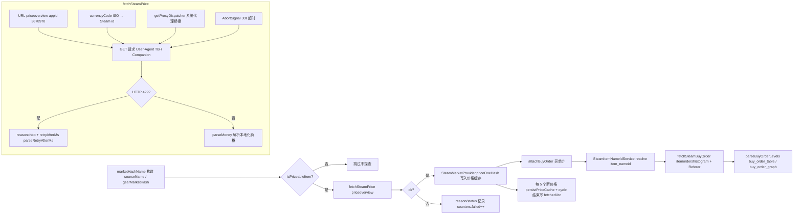

### 8.1 Steam Market price 请求链路

#### marketHashName 构造（`app/src/core/marketName.ts`）

- `marketHashName(item)`：材料直接用 `sourceName ?? name`；gear 用 `gearMarketHash(name, grade, "A")` = `"<name> (<Grade>) A"`（仅 A 变体，B-E 不探查）；占位符 `ItemName_<id>` → null。
- `isPriceableItem(type, grade, marketTradable)`：material 总是 priceable；gear 仅 Legendary+ priceable。

#### priceoverview 请求（`app/src/main/services/steamPriceApi.ts`）

`fetchSteamPrice(name, currency)`：

- URL：`https://steamcommunity.com/market/priceoverview/?appid=3678970&currency=<code>&market_hash_name=<encoded>`
- `currencyCode(iso)` 把 ISO 代码转 Steam 数字 id（`app/src/core/steamPrice.ts` 的 `STEAM_CURRENCIES` 表，覆盖 41 种货币）。
- headers: `User-Agent: Mozilla/5.0 (TBH Companion)`。
- `AbortSignal.timeout(30_000)` 30s 超时。
- `getProxyDispatcher()` 注入代理。
- 返回 `SteamPriceFetchResult`：`ok: true` → `{ entry: PriceEntry }`；`ok: false` → `{ reason, status, retryAfterMs? }`。
- `parseMoney(text)` 解析 Steam 本地化价格字符串（"$0.04"、"R$ 0,17"、"1.234,56 zl"）。
- 429 → `reason: "http"` + `retryAfterMs: parseRetryAfterMs(res)`。

#### price cache 写入

- `SteamMarketProvider.priceOneHash(name, counters, opts)` 调 `fetchSteamPrice`，成功时 `cache.prices[name] = entry`，再调 `attachBuyOrder`。
- 每 5 个新价格 `persistPriceCache`。
- cycle 结束 `cache.fetchedUtc = new Date().toISOString()` + `persistPriceCache`。

### 8.2 steamMarketFee 计算

文件：`app/src/core/steamMarketFee.ts`（纯函数）+ `app/src/core/steamMarketFeeBundled.ts`（main/core 专用，读 bundled `data/steam_market_fee.json`）。

- `SteamMarketFeeRates = { steamFeePercent, publisherFeePercent, minFeeMajor, minPayoutMajor }`。
- 费率（2026-09 更新）：`steamFeePercent = 0.05`（Steam 5%，最少 0.01）、`publisherFeePercent = 0.1`（厂商 10%，最少 0.01）、`minPayoutMajor = 0.01`（收款保底）。
- **最低手续费按货币（2026-09 新增）**：Steam 2025-12 起单笔最低费为 $0.01 等值，国区实测为 ¥0.07。`MIN_FEE_BY_ISO = { CNY: 0.07 }`，其余币种回退 $0.01。`minFeeForCurrency(iso, fallback)` 取值；`feeRatesForCurrency(rates, iso)` 返回按币种调整 `minFeeMajor`/`minPayoutMajor` 后的费率副本（未收录币种返回原对象）。调用方（renderer Inventory/InventoryTable、main InventoryService worker）用展示币种构造费率，使人民币下最低费为 ¥0.07。
- `sellerFees(price, rates)`：按**买家/售价**直接计算总手续费 = `steam(price) + publisher(price)`，每个费用分量 `max(floor(price * rate * 100)/100, minFeeMajor)`。
- `buyerPriceFromSellerAmount(amount, rates)` = `amount + sellerFees(amount, rates)`（上架时想要到手 `amount` 的标价辅助）。
- `sellerProceedsFromBuyerPrice(buyerPrice, rates)` = `max(buyerPrice - sellerFees(buyerPrice), minPayoutMajor)`——费用按售价直接扣除，收款保底 0.01；**不再使用二分搜索逆向**，因为费用直接基于售价计算。
- `aggregateSellerProceeds(lines, rates)`：多行累加 `{ grossTotal, netTotal, feeTotal }`，`netTotal = Σ sellerProceedsFromBuyerPrice(buyerUnitPrice) * count`，`feeTotal = grossTotal - netTotal`。

### 8.3 steamBuyOrderApi（买单价，`app/src/main/services/steamBuyOrderApi.ts`）

`fetchSteamBuyOrder(itemNameId, marketHashName, currency)`：

- URL：`https://steamcommunity.com/market/itemordershistogram?norender=1&country=US&language=english&currency=<code>&item_nameid=<id>&two_factor=0`
- headers: `User-Agent` + `Referer: https://steamcommunity.com/market/listings/<appId>/<hash>`（Steam 反爬要求 Referer）。
- 30s 超时 + 代理。
- `parseBuyOrderLevels(data)`：优先用 `buy_order_table`，回退到 `buy_order_graph`（cumulative 数组 diff 出每档 quantity）。
- `buyOrderQuantity` = 最高价的 quantity。

### 8.4 steamItemNameId（item_nameid 查询，`app/src/main/services/steamItemNameId.ts`）

`item_nameid` 是 Steam 内部 ID（不是 market_hash_name），histogram 接口必需。Steam 不提供直接 API，只能从 listing HTML 抓。

`SteamItemNameIdService`：

- **两层缓存**：`bundled: Record<hash, nameId>`（CI 预生成）+ `userCache`（`userData/steam_item_nameids.json`，运行时新解析的写入）。
- `getSync(hash)`：先查 userCache，再查 bundled。
- `resolve(hash)`：缓存命中直接返回；否则 fetch listing HTML，正则 `Market_LoadOrderSpread\(\s*(\d+)` 抓 nameId；429 → `{ ok: false, status: 429, retryAfterMs }`；其他失败不写缓存。
- **单例**：`getSteamItemNameIdService()` 全局共享，避免 `SteamMarketProvider` 和 `LookupPricePollingService` 重复抓 nameid。

### 8.5 proxyResolver（代理配置，`app/src/main/services/proxyResolver.ts`）

undici 的 `fetch` 不读 Windows 系统代理（只读 `HTTPS_PROXY`/`HTTP_PROXY` env），中国用户多用 Clash/V2Ray/SS 设系统代理。本模块桥接 registry → undici `ProxyAgent`。

- `resolveProxyUrl()`：优先级 `HTTPS_PROXY/HTTP_PROXY env` > `Windows registry system proxy`；结果缓存。
- `readWindowsSystemProxy()`：`reg query "HKCU\Software\Microsoft\Windows\CurrentVersion\Internet Settings"`，解析 `ProxyEnable` 和 `ProxyServer`。
- `parseWindowsProxyString(raw)`：处理三种格式（单代理、分协议、SOCKS only）。
- `getProxyDispatcher()`：返回 `{ dispatcher: ProxyAgent }` 或 `{}`（无代理时）；缓存 `cachedDispatcher`。
- `refreshProxyCache()`：清缓存 + 关闭旧 ProxyAgent 连接池。Settings 改代理后调用。

### 8.6 retryAfter（429 限流处理，`app/src/main/services/retryAfter.ts`）

`parseRetryAfterMs(res)`：解析 `Retry-After` header

- 整数秒：`seconds * 1000`，cap 5 分钟。
- HTTP-date（RFC 7231）：`dateMs - Date.now()`，cap 5 分钟；负值返回 undefined。
- 缺失/不可解析 → undefined。
- `MAX_RETRY_AFTER_MS = 5 * 60 * 1000`：防 Steam 异常值 stall 整个 refresh。

**消费方**：`steamPriceApi.fetchSteamPrice`、`steamBuyOrderApi.fetchSteamBuyOrder`、`steamItemNameId.resolve`。`SteamMarketProvider.priceOneHash` / `attachBuyOrder` 把 `retryAfterMs` 透传到 `fetchAllTargets`，与指数退避取较大值。

### 8.7 近期市场交易额统计（Market 页）

需求：Market 页展示「近期市场交易额」——总交易额、各类别交易额、按小时走势，支持 1d / 1w / 1m / 全部（all）切换。主数据源为 **Steam `pricehistory` 接口的真实小时成交额**（按需拉取 + 缓存 + 节流）；在历史数据尚未拉取时，回退到**应用内采样快照**（把本地 `priceoverview` 轮询抓到的当前 24h 成交量累积起来展示概览）。

#### 8.7.1 数据来源与采集链路

- **历史走势（主）**：`fetchSteamPriceHistory`（`app/src/main/services/steamPriceApi.ts`）请求 Steam `pricehistory` 接口，解析 `prices` 数组（`[timestamp, price, volume]`），剥离响应的防爬垃圾前缀（从第一个 `{` 开始解析）。第 0 列时间戳可能是数字 epoch 秒，也可能是格式化字符串（如 `"May 27 2026 01: +0"`，UTC），统一由 `parsePriceHistoryTimestamp` 解析为 epoch 秒（UTC），聚合/展示时再按本地时区换算；价格列是纯数字（如 `0.461`）直接透传（避免 `parseMoney` 误判 3 位千分组）。接口返回 `{ ok, status, points, currency }`，失败原因含 `network`/`http`/`unauthorized`/`parse`/`no_listing`，429 携带 `retryAfterMs`。**货币注意**：Steam `pricehistory` 会**忽略 `currency` 参数**，价格列返回的是**区域/会话锁定的货币**（货币由响应里的 `price_prefix`/`price_suffix` 标明，如巴西会话返回 `R$`，并非所请求的目标货币）。为此 `fetchSteamPriceHistory` 用 `priceHistoryCurrency`（`app/src/core/steamPrice.ts`，由 `price_prefix` 反查 ISO；无法唯一判定的歧义前缀如 `¥`=JPY/CNY、`kr `=NOK/DKK、空前缀的 PLN/VND/UAH 返回 null）解析出 `currency` 随结果返回，供调用方判断是否需要换算（见 8.7.3）。**未登录访问 pricehistory 会返回 400 空 `[]`**：HTTP 400 被归类为 `reason="unauthorized"`（登录态/Cookie 失效），`refreshHistory` 据此刻终止整次价格刷新（见 8.7.2）。函数新增可选 `cookie` 参数（Steam 社区登录 Cookie，来自 `config.steamCookie`，完整 Cookie 头字符串），有值时作为 `Cookie` 请求头带上，从而拿到登录后的真实历史成交额；为空时保持现状（不带 Cookie，回退到采样走势）。**Cookie 配置已拆分为两字段**：Settings → Steam Market 用一个 `sessionid` 输入框（`config.steamCookieSessionid`，会话 ID，**明文展示**便于核对/复制）与一个 `steamLoginSecure` 密码框（`config.steamCookieLoginSecure`，登录态令牌，打码隐藏），加载时由 `config.ts` 的 `composeSteamCookie` 合成完整 Cookie 头 `sessionid=<sessionid>; steamLoginSecure=<...>` 存入 `config.steamCookie`（`getCookie` 读取该合成值）。**注意** Steam 的 `pricehistory` 接口依赖 `sessionid` + `steamLoginSecure` 两个 Cookie 字段（缺一不可，否则即使有另一个字段也会返回 400）；另有部分会话 Cookie（如 `Steam_Language`）不要求填写。旧版单字段 `steamCookie`（完整字符串）在 `normalizeConfig` 中经 `parseSteamCookieParts` 迁移解析出 `sessionid` / `steamLoginSecure` 两份填入新字段（新字段非空时优先，旧串仅作迁移源；`id` 键名作为 `sessionid` 别名兼容旧版）。
- **当前快照（回退）**：成交量来自 `priceoverview` 响应的 `volume` 字段（`fetchSteamPrice` → `PriceEntry.volume`，见 8.1）。`LookupPricePollingService.fetchOne` 现在额外返回 `volume`（真实路径取 `localResponse.entry.volume`；`fetchLocal` 注入路径可选提供 `volume`）。
- 每次成功抓取，`pollOnce` / `pollSingleHash` 触发 `onVolumeSample({ hash, volume, median, currency })`；每轮结束（`priced > 0`）触发 `onCycleComplete(targets)`（携带本轮目标集）与 `onCycleEnd()`。
- `appState.ts` 把 `onVolumeSample` 接到 `MarketVolumeService.recordVolume`，把 `onCycleComplete` 接到 `marketVolume.pruneLive(new Set(targets))`（裁剪陈旧 live/liveHistory，见 8.7.2），把 `onCycleEnd` 接到 `marketVolume.sampleNow()`，采样成功后 `broadcast(IPC.MARKET_VOLUME, marketVolume.getStats())`；轮询结束与打开 Market 页（`getMarketVolume`）时顺带触发 `marketVolume.refreshHistory()`（带缓存去抖，不阻塞轮询）。历史数据刷新成功再次 `broadcast`。

#### 8.7.2 MarketVolumeService（`app/src/main/services/MarketVolumeService.ts`）

- **实时映射**：`live: Map<hash, { volume, median }>`，由 `recordVolume` 累积（只保留最近一次）。**陈旧条目清理**：`pruneLive(keepHashes)`（轮询 cycle 成功结束时经 `onCycleComplete` 调用）把 `live` 与 `liveHistory` 裁剪到本轮轮询目标集——用户取消星标后，旧 hash 不再被轮询，若不清理会持续被计入采样总交易额与兜底卡片，导致数值被高估；有裁剪变化时立即落盘，避免重启读回已清理的旧条目。
- **活跃度采样历史（快照卡片「不刷新也随时间范围变化」）**：`recordVolume` 在更新 `live` 的同时，把每个 hash 的采样累积到 `liveHistory: Record<hash, LiveVolumePoint[]>`（`app/src/core/marketVolume.ts` 的 `LiveVolumePoint = { ts, volume, median }`）。**同一轮询周期（< `MIN_SAMPLE_INTERVAL_MS`=60s）内去重**——只更新该点数值而非新增，避免同一时刻重复点；否则追加新点，并裁剪到 `MAX_LIVE_POINTS_PER_HASH=2000`（约 33 小时，每 1 分钟 1 条）。`liveHistory` 随 `sampleNow()` 落盘（`market_volume_history.json` 的 `liveHistory` 字段）、重启读回，因此**无需刷新 pricehistory，仅靠轮询持续采样即可让快照物品的卡片金额与迷你图随时间窗口变化**。
- **采样（回退）**：`sampleNow()` 用 `aggregateVolume`（`app/src/core/marketVolume.ts`）把 `live` 映射结合图鉴目录（`marketHashName` → 类别）聚合成 `MarketVolumeSample`，追加到 `history` 并持久化到 `userData/market_volume_history.json`。有 60s 最小间隔去抖，最多保留 `MAX_SAMPLES=1200` 条。
- **历史拉取**：`refreshHistory(now, opts?)` 带两档去抖——距上次拉取 < `HISTORY_REFRESH_MS`（1 小时）或已在刷新中则跳过（除非 `opts.force`）；`historyFetchedAtMs` 随 `market_volume_history.json` 持久化，重启后仍命中 1 小时缓存，避免每次都重跑。目标物品默认 = `owned ∪ watched`（`deps.getTargetHashes`），可传 `opts.targets` 覆盖（交易页「刷新历史价格」按钮用：星标 ∪ 快照价格达标物品，见 `selectHistoryRefreshTargets`）；按每批 `MAX_HISTORY_TARGETS=10` 个分组串行拉取（Steam 对 pricehistory 限流极严，每批超过约 10 个即触发）：批内请求间隔 `HISTORY_FETCH_DELAY_MS=1500ms`，批间等待 `HISTORY_BATCH_DELAY_MS=2min` 再拉下一批，直到覆盖全部目标；单个物品失败不影响其余。**Cookie 失效提前终止**：一旦某物品返回 400（`reason="unauthorized"`，见 8.7.1）即判定登录态整体失效，`refreshHistory` **立即中止整次刷新**（`outer` 标签跳出循环，不再拉取后续目标避免白白触发限流），并通过 `onHistoryProgress` 上报 `cookieExpired=true`（前端据此提示用户更新 Cookie，见 8.7.4）。**deps 新增 `getCookie`（返回 `config.steamCookie ?? ""`），每次 `fetchOne(hash, currency, cookie)` 把用户 Cookie 透传给 `fetchSteamPriceHistory`**。
- **历史聚合**：`aggregateHistoryToHourly`（`app/src/core/marketVolume.ts`）把各 hash 的 `pricehistory` 原始点按小时桶（`floor(timestamp/3600)`）聚合成 `HourlyHistoryBucket`（`hour`、`total`、`byCategory`），成交额 = Σ(volume × price)——`volume` 是**该时间段的成交量增量**（非累计值，时间点越新粒度越细，最旧为天、最近为小时），直接累加即真实成交额，无需差分。**一次刷新即拿到该物品全部历史**（仅粒度随新旧变化），故**保留全部小时桶、不截断**（全量走势），并额外把**原始 pricehistory 点**（`hash -> PriceHistoryPoint[]`，保留天/小时混合粒度）持久化到 `priceHistory` 字段，供后续按需再聚合；**刷新时逐 hash 合并（`mergePriceHistoryPoints`，按 UTC 天分组、点数多的一方视为更细粒度，保留小时粒度、避免被新的日粒度降级覆盖；不再全量覆盖，非本次目标的 hash 也保留）**；同时统计本次覆盖的物品种数（`itemCount`）与各分类物品种数（`itemCountsByCategory`）。
- **类别**：`volumeCategoryKey` 把物品归到 **5 大分类**——武器（GEAR 且 gearGroup=WEAPON）、防具（GEAR 且 gearGroup=ARMOR）、饰品（GEAR 且 gearGroup=ACCESSORY）、硬币（MATERIAL 且 materialType=OFFERING）、材料（其余 MATERIAL）；`aggregateVolume` / `aggregateHistoryToHourly` 汇总时未匹配到图鉴的 hash 归 `OTHER`。
- **持久化结构（含货币标记）**：`market_volume_history.json` 的 payload 为 `{ version, currency, samples, historyHourly, priceHistory, liveHistory, itemCount, itemCountsByCategory, historyFetchedAtMs, lastRefreshAt }`。`currency` 记录**入库时**价格线的显示货币；`saveHistory`/`exportHistory` 写入当前显示货币。载入（`loadHistory`）/导入（`importHistory`）时先**确认文件货币**（新格式取顶层 `currency`；旧格式无该字段时从 `samples[].currency` 推断）：确认与当前显示货币一致 → 无损保留细粒度历史（旧格式同时迁移落盘补写 `currency`）；不一致或无法确认则**丢弃金额类数据**或**拒绝导入**，绝不把旧币数值标成当前货币展示（详见 8.7.3 多货币同步政策）。载入丢弃时 `historyFetchedAtMs`/`lastRefreshAt` 也一并清空，避免 1 小时缓存阻碍新币下尽快重拉。
- **统计**：`getStats()` 返回 `{ latest, hourly, itemCount, itemCountsByCategory, currency }`，`hourly` 为历史小时桶（`MarketVolumeHourPoint[]`，含 `byCategory`），`itemCount` / `itemCountsByCategory` 供前端标注覆盖物品数量。**当 `historyHourly` 为空（pricehistory 尚未拉到或拉取失败）但存在采样快照时，`hourly` 回退为 `aggregateSamplesToTrend(this.samples)` 构建的走势点**（按小时桶平均、分类 key 归一化 `OFFERING→COIN`），保证 Market 页「走势图直接给出」；此时 `itemCount` 取最新采样的 `items`，`itemCountsByCategory` 置空（采样快照只含分类金额、不含分类物品种数，图例物品数显示 0）。
- **物品维度**：`getVolumeItems()` 返回 `MarketVolumeItemStats`（`{ items, currency }`，交易页用）。**合并三路数据**：`aggregateItemVolume`（把 `priceHistory` 原始点按物品聚合成 `MarketVolumeItem`：总交易额 = Σ(volume × price)、小时走势 points 按小时桶累加、附展示名与分类，`kind` 缺省）为主；`aggregateLiveActivityItems`（`app/src/core/marketVolume.ts`，把 `liveHistory` 各 hash 的采样点转成 `kind="live"` 卡片：`total` = 最近一次有效采样 volume × median、points 为各采样点）补充 pricehistory 尚未覆盖到的物品；`aggregateLiveItems`（用 `live` 快照，无走势）**兜底** liveHistory 尚未累积的 hash。**同一 hash 以 pricehistory 优先，其次活跃度采样历史**，最终统一按 `total` 降序。卡片带 `kind` 字段区分数据口径：`history`（真实小时增量，可按窗口求和）vs `live`（24h 滚动累计，**不可求和**，取窗口内最新值）。打开交易页（`getMarketVolumeItems`）时同样触发 `refreshHistory()`（与 Market 页一致），让卡片尽量带上逐小时走势。**交易页「刷新历史价格」按钮**（`refreshMarketVolumeItems`）用 `selectHistoryRefreshTargets` 计算目标集 = **星标 ∪ 快照价格 ≥ 阈值**（`app/src/core/lookupPrice/polling.ts`，星标优先、快照达标部分按价格降序），调 `refreshHistory(now, { targets, force: true })` 强制绕过 1 小时缓存全量重拉（**targets 顺序 = renderer 传入的「物品卡排序」**，即主列表按当前时间窗口成交额降序的 hash 顺序——`refresh()` 把 `cardOrder` 传给 `tbh.refreshMarketVolumeItems(cardOrder)`，使逐个更新的顺序严格等于交易页卡片当前排序；未传时回退到 `selectHistoryRefreshTargets` + `sortTargetsByVolume` 全量交易额顺序），刷新成功后同时 `broadcast` `MARKET_VOLUME` 与 `MARKET_VOLUME_ITEMS`。**刷新进度反馈**：`refreshHistory` 在刷新开始时先推送一次带 `pending`（本次待刷新的占位卡片，自动/手动刷新共用，驱动交易页亮环提示）的进度，此后每处理完一个 hash 调用一次 `deps.onHistoryProgress({ running, total, done, current, updatedItem })`（开始携带当前 hash、单个完成 current=null、全部结束 running=false），`appState` 把回调转为 `MarketVolumeRefreshProgress` 经新 push 通道 `MARKET_VOLUME_REFRESH_PROGRESS` 推给 renderer；**顶部走势实时联动**——每个成功返回的物品并入 `priceHistory` 后即调用 `recomputeHistoryTrend()` 重算 `historyHourly`，并通过进度回调的 `trendChanged=true` 触发 `appState` 额外 `broadcast(MARKET_VOLUME)`，使最上方的交易额走势（`hourly`）时间范围随每个成功物品**实时更新**（而非等整批刷新结束），交易页与 Market 页的走势图均生效；**单品实时更新**——单个 hash 拉到数据后即实时写入内存态 `priceHistory`（持久化在全部拉完之后统一做），并通过 `updatedItem`（该 hash 聚合的最新 `MarketVolumeItem`，含走势）随进度一起推送，renderer 收到后在刷新占位列表里就地替换对应占位卡片，实现「当前轮次已经刷新价格的物品实时更新结果」；同时 `refreshMarketVolumeItems` 返回 `MarketVolumeRefreshResult = { stats, pending }`，其中 `pending = buildPendingItems(targets)` 为待刷新目标的**占位卡片**（`MarketVolumeItem`，按目标顺序去重）。**若该 hash 已有交易额数据（合并口径：pricehistory 聚合 + 活跃度采样历史 + live 快照），则复用该数据生成带走势/金额的卡片**（与主列表口径一致，刷新过程中不因尚未拉到最新数据而丢失图表或金额）；否则回退为 `total=0`、`points=[]` 的空白占位（首次刷新 / 尚无任何数据，仅展示名与分类，未命中图鉴回退 hash/OTHER），供刷新期间提前展示。**刷新顺序**：目标集先经 `marketVolume.sortTargetsByVolume(targets)` 按已有交易额（`getVolumeItems` 合并口径：pricehistory 聚合为主、live 快照 volume×median 补充）从高到低排序，再传给 `buildPendingItems` 与 `refreshHistory`——二次及以后刷新「先刷新交易额高的物品」，占位卡片与拉取顺序一致；首次刷新（尚无任何交易额数据）保持目标集原顺序（星标优先、快照达标按价格降序）。

#### 8.7.3 边界与注意

- 只覆盖「被轮询到的高价值 / 收藏物品」子集，是相对市场活跃度指标，非全市场总盘子（代码注释与 UI 空态文案均有说明）。
- 轮询默认关闭（`config.lookupPricePolling.enabled`），未启用时无数据，UI 显示空态。
- **历史价格货币对齐（重要）**：`pricehistory` 忽略 `currency` 参数、返回区域锁定货币（见 8.7.1），故入库前在 `MarketVolumeService.maybeCalibrateHistory` 处理——当 `r.currency` 解析出的货币与显示货币（`getCurrency`）不一致时，取该物品 `priceoverview` 的中位价（显示货币，`deps.fetchAnchorMedian`，默认走 `fetchSteamPrice`）作锚，连同 pricehistory 里最近一个有成交量的价格（源点）经 `calibratePricesWithMedian`（`app/src/core/marketVolume.ts`）求出换算系数，把整条历史价格线等比校正到显示货币后再合并入库（`refreshItem` / `refreshHistory` 均接入）；货币解析不出、与显示货币一致或锚不可用时**不换算**（保守保留原值）。这保证历史价格曲线金额单位正确；采样回退仍用轮询返回的 `median`。
- **多货币同步政策（保存 / 再次展示正确货币价格）**：交易页历史数据（`market_volume_history.json`）中所有金额均以「入库时的显示货币」计价，全部边界按以下规则处理，保证**绝不把旧币数值标成新币展示**——
  - **落盘**：`saveHistory` / `exportHistory` 写入 `currency` 字段 = 当前显示货币（`deps.getCurrency()`）。
  - **重启载入（`loadHistory`，先确认货币再决定保留/丢弃）**：`confirmFileCurrency` 先确认文件货币——新格式取顶层 `currency`；旧格式（无该字段）用 `inferMarketVolumeCurrency`（`app/src/core/marketVolume.ts`）从 `samples[].currency` 推断（旧版每条采样都记录了当时显示货币）。确认与当前显示货币一致（大小写不敏感）→ **无损保留全部细粒度历史**（含 `priceHistory` 的混合粒度点、`liveHistory`、`samples`），若为旧格式推断所得则立即 `saveHistory()` **迁移落盘**（补写顶层 `currency` 字段，只需一次）；不一致或无法确认（无采样 / 采样货币混杂）→ 丢弃 `samples`/`historyHourly`/`priceHistory`/`liveHistory`/`itemCount(s)` 与 `historyFetchedAtMs`/`lastRefreshAt`（清空重积，不清空会导致 1 小时缓存阻碍新货币下尽快重拉），记 warn 日志。
  - **运行中切换货币**：两条入口——Market/Settings 页 `SET_CURRENCY` handler（`appState.setCurrency`）与 `applyConfigPatch` 的 currency 分支。二者都**先**把 `config.currency` 写成新值，**仅在币种确实变化（大小写不敏感）时**调用 `marketVolume.onCurrencyChanged()`（清空全部金额态与采样去抖元数据、立即以新币落盘）以及 `lookupPrices.clearLocalFields()`（清图鉴本地 polling 价格字段），随后 `broadcast(MARKET_VOLUME/MARKET_VOLUME_ITEMS)` 推送空数据，使 Market/交易页立即停止显示旧币数值；提交相同币种不触发清账（避免误清历史）。
  - **采样护栏**：`recordVolume(hash, volume, median, currency)` 丢弃 `currency` 与当前显示货币不符的采样——防止「cycle 在切换货币前开始、切换后结束」的竞态窗口把旧币采样混入 `live`/`liveHistory`；下一轮 polling 以新货币重新抓取。
  - **导入（`importHistory`，不一致时优先换算导入）**：先经 `confirmFileCurrency` 确认备份货币（旧格式从 `samples[].currency` 推断）。与当前显示货币不一致时**不再直接拒绝**——用 `computeConversionRate`（`app/src/core/marketVolume.ts`）确认换算比例：**优先图鉴汇率表 `fx`**（比例 = `fx(目标)/fx(来源)`），**回退用现有价格历史**（备份与当前内存 priceHistory 的共同 hash，取时间戳最接近的一对点求价格比、多 hash 中位数抗噪）；得到有效比例后由 `rescaleParsedHistory` 把备份全部金额（samples/hourly/priceHistory/liveHistory）等比换算到当前货币再导入，返回 `{ ok:true, itemCount, converted:true }`，交易页显示 `trading.importConverted` 提示已换算；**拿不到比例**（文件货币无法确认 / 无 fx 且无共同价格可推算）才拒绝，返回 `{ ok:false, reason:"currency_mismatch" }`（不改动现有数据），显示 `trading.importCurrencyMismatch`。非法 JSON/结构错误返回 `reason:"invalid_backup"`。`MarketVolumeDeps.getFxRates` 由 `appState` 注入 `lookupPrices.getSnapshot()?.fx`。
  - **图鉴本地价格（7.3）**：`pricesLocal/medianLocal/buyOrderLocal/localCurrency` 只在内存，切换货币经 `clearLocalFields()` 清空后回退 CI 快照 USD × fx（任意货币下都正确）；下一轮 polling 以新币重新抓取回填。
  - **inventory 市场缓存（6.5）**：`prices.<CUR>.json` 按货币分文件 + 载入时强制覆盖 `currency` 字段，天然隔离，不受切换影响。
- `refreshHistory` 按需拉取 + 1 小时缓存 + 每批封顶（`config.marketHistoryBatchSize`，默认 10，范围 1–100）+ 批间间隔（`config.marketHistoryBatchDelaySec`，默认 120 秒 = 2 分钟，范围 0–600 秒，均可于 Settings → Steam Market → 价格历史查询调整），批内每个物品间隔 1.5s，避免高频请求触发 Steam 限流；429 处理：单物品连续 429 达 3 次即中止整批刷新（保留已完成数据）；每次 429 后按 Steam `retryAfterMs`（缺失时 1500ms）等待再继续下一个物品，等待可被用户手动取消中断；成功响应会复位连续 429 计数。**仅当本次确拉到数据（`agg.points.length > 0`）才覆盖 `historyHourly`/`priceHistory`，失败不清空已有好数据**；`historyFetchedAtMs` 无论成败都更新，命中 1 小时缓存去抖，避免每次轮询/打开页面高频重试加剧限流。批次数量与批间间隔通过 `MarketVolumeDeps.getHistoryBatchSize()` / `getHistoryBatchDelaySec()`（秒，内部换算为 ms）读取，`appState.ts` 从 `config` 注入，改配置后下次刷新即时生效。
- **刷新目标排序优化（用最少刷新覆盖最多交易额）**：交易市场呈长尾分布——少量高交易额物品贡献了绝大部分成交额。因此刷新目标不再按「价格降序 / 全量历史累计」，而是按**最近 24h 时间窗成交额**降序（`core/marketVolume.ts` 的 `orderRefreshTargets` 纯函数 + `MarketVolumeService.recentVolumeByHash`）。排序规则：**星标（watched）无条件最前** → 有窗口交易额者按交易额降序 → 仅价格者（图鉴快照价格，`deps.getSnapshotPriceUsd`）按价格降序 → 无数据者保持原相对顺序。让「先刷新交易额高的物品」——用尽量少的刷新覆盖尽量多的交易额。
  - **统一口径**：`sortTargetsByVolume`（交易页手动「刷新历史价格」默认路径，`refreshMarketVolumeItems` 未传 `cardOrder` 时）与自动路径共用该 24h 排序；交易页手动路径本身由 renderer 传 `cardOrder`（当前窗口成交额降序），两者口径一致。
  - **覆盖率主区（长尾截断，`config.marketHistoryCoverageThreshold`，默认 0.95，0~1）**：自动路径按交易额排序后算「主区」= 覆盖率达到该比例所需的最少目标（含全部星标）。每次自动刷新**必拉主区**（高覆盖头部），实现「用最少刷新覆盖最多交易额」。
  - **每日全量兜底**：主区外的长尾物品不因截断而永久漏刷——`MarketVolumeService` 记录每个 hash 最近一次刷新时刻 `lastRefreshAt`（随 `market_volume_history.json` 持久化，`parseMarketVolumeHistory` 解析），自动路径把「当日尚未刷新过」的长尾目标一并纳入，保证**在一天的时间预算内把目标全集都刷一遍**；当天已刷的尾部则跳过，避免事事都刷长尾浪费预算。`refreshHistory` 自动路径（未显式传 `targets`）经 `planSessionTargets` 规划；手动 `force` 路径尊重调用方给定顺序（全量拉取）。
- **诊断日志（排查 Cookie 失效 / 限流）**：`MarketVolumeService` 用 `createLogger("marketVolume")` 输出以下日志，便于区分「无 Cookie」「Cookie 失效」「限流」等场景——
  - 刷新开始：`refreshHistory start: targets=<n>, cookieConfigured=<0|1>, cookieKeys=[<键名>], currency=<...>`（`cookieConfigured` 反映 `config.steamCookie` 是否非空；`cookieKeys` 列出合成 Cookie 头包含的**键名**（不打印值），便于确认「已配置但 400」时是否缺 Steam 期望的字段，如 `sessionid`）；
  - 每物品成功：`refreshHistory: <hash> ok (<点数> points)`；
  - 货币换算（pricehistory 返回货币与显示货币不一致、已按中位价锚换算时打出）：`calibrate history <hash>: <货币A> -> <货币B> scale=<系数>`；换算锚不可用时 `calibrate history <hash>: median fetch failed: <原因>`；
  - 每物品失败/空：`refreshHistory: <hash> no data (status=<HTTP状态码，0=网络错误>, reason=<network|http|unauthorized|parse|no_listing|no_data|failed>, retryAfter=<ms>)`——**未登录访问 pricehistory 通常返回 400（reason=unauthorized，触发整次刷新终止并提示用户更新 Cookie），但只带 `sessionid` 或只带 `steamLoginSecure` 其中一个字段也会返回 400（同样 reason=unauthorized，Steam 认为未登录），必须两个字段同时具备；限流返回 429（reason=http + retryAfter）**；
  - 单个物品抛错：`refreshHistory: <hash> threw: <message>`；
  - 刷新结束：`refreshHistory end: fetched=<成功数>/<总数>, hourlyBuckets=<小时桶数>`（`fetched=0` 即整体无数据，可据此判断是否 Cookie 失效而非单物品问题）。
    用户反馈「拉取完成仍无数据」时，导出发行版日志（见 `docs/DIAGNOSTIC_LOGGING.md`）找 `refreshHistory` 行即可定位是未配置 Cookie（`cookieConfigured=0`）、Cookie 失效（400/no_data）还是限流（429/retryAfter）。

#### 8.7.4 IPC 与渲染

- IPC：`GET_MARKET_VOLUME`（invoke）、`MARKET_VOLUME`（push）；preload 暴露 `tbh.getMarketVolume()` / `tbh.onMarketVolume()`。**交易页**新增 `GET_MARKET_VOLUME_ITEMS`（invoke）、`MARKET_VOLUME_ITEMS`（push）、`REFRESH_MARKET_VOLUME_ITEMS`（invoke，交易页「刷新历史价格」按钮）、`REFRESH_MARKET_VOLUME_ITEM`（invoke，单物品卡片「手动刷新」，参数 hash）、`CANCEL_MARKET_VOLUME_REFRESH`（send，手动终止整次历史刷新）、`MARKET_VOLUME_REFRESH_PROGRESS`（push，刷新进度）；preload 暴露 `tbh.getMarketVolumeItems()` / `tbh.onMarketVolumeItems()` / `tbh.refreshMarketVolumeItems()`（返回 `MarketVolumeRefreshResult`）/ `tbh.refreshMarketVolumeItem(hash)`（invoke）/ `tbh.cancelHistoryRefresh()`（send）/ `tbh.onMarketVolumeRefreshProgress()`。与 `MARKET_VOLUME` 打包推送：轮询采样成功与 pricehistory 刷新成功时，`appState` 同时 `broadcast` 两个通道。**手动终止**：`cancelHistoryRefresh` → `appState.cancelHistoryRefresh()` → `MarketVolumeService.abortHistoryRefresh()`（置 `historyAbortRequested`）；刷新循环用 `waitOrAbort()`（250ms 步进轮询）替代长 `setTimeout`，在每个物品完成 / 批间等待被唤醒时检查该标志并尽快安全退出，收尾正常广播 `running:false` 清空进度。**单物品手动刷新**：`refreshMarketVolumeItem(hash)` 调 `MarketVolumeService.refreshItem(hash)`——只拉取该 hash 的 pricehistory，成功后实时并入 `priceHistory` + 重算顶部走势 + 落盘，再 `broadcast` `MARKET_VOLUME` 与 `MARKET_VOLUME_ITEMS`（卡片与顶部走势即时更新）；不进入整批刷新的 `running/pending` 进度流（避免误触顶部「刷新中」）；遇 400（Cookie 失效）时通过 `MARKET_VOLUME_REFRESH_PROGRESS`（`running:false, cookieExpired:true`）触发交易页警示横幅。
- 渲染：`MarketVolumeSection`（`app/src/renderer/components/market/MarketVolumeSection.tsx`）挂在 Market 页底部，支持 **1d / 1w / 1m / 全部（all）** 切换（`RangeToggle`），「1m / 全部」显示按日期标注坐标轴，1d / 1w 显示本地化小时；1d/1w/1m 按时间（24h / 168h / 720h）过滤小时桶，「全部」显示自首次抓取至今的全量小时桶走势；主数据为历史小时走势（`VolumeTrendChart` SVG **5 类堆叠折线/面积图**，自底向上按武器→防具→饰品→材料→硬币堆叠，顶部为总交易额轮廓线），含总交易额、各类别列表，并在图例标注各分类覆盖物品数量、头部标注统计物品总数；`useMarketVolume` hook 订阅推送。走势数据优先用 pricehistory 聚合的小时桶；**pricehistory 未拉到数据时回退到采样快照走势（`aggregateSamplesToTrend`），保证走势图直接可见**；仅当既无历史也无采样时才回退到轮询 24h 快照概览。**用户可在 Settings → Steam Market 填写 Steam 社区 Cookie（`config.steamCookie`，`sessionid` 明文、`steamLoginSecure` 密码框，仅存本地），从而使 pricehistory 拉到登录后的真实历史成交额**；不填时走势回退到本地轮询采样。
- **交易页（Trading）**：`app/src/renderer/tabs/Trading.tsx`，顶部复用 `MarketVolumeSection` 展示市场总交易额走势，下方为单物品卡片网格（`app/src/renderer/components/market/ItemVolumeCard.tsx`，`useMarketVolumeItems` hook 订阅推送）。每张卡片含物品名、分类标识色、总交易额与**小时成交额迷你 SVG 走势图**；无逐小时走势的物品显示「24h 快照」标签（仅金额，来自轮询 live 快照）。`kind="live"` 的活跃度采样卡片显示「24h 活跃度 · 轮询采样」标签，其迷你图即采样点构成的走势（随轮询持续累积、重启仍保留），金额随时间窗口切换取窗口内最新采样；`history` 卡片沿用「走势」标签。数据来自 `MarketVolumeService.getVolumeItems()`（合并 pricehistory / 活跃度采样 / live，见 8.7.2）。工具栏含物品计数与**「刷新历史价格」按钮**（`useMarketVolumeItems` 的 `refresh()`，调 `tbh.refreshMarketVolumeItems()`），点击强制拉取星标 ∪ 快照价格达标物品的历史价格，刷新期间按钮呈加载态（旋转图标 + 禁用）。`useMarketVolumeItems` 订阅 `MARKET_VOLUME_REFRESH_PROGRESS` 维护 `progress`（`MarketVolumeRefreshProgress`），刷新期间按钮文案显示「刷新中 done/total」，卡片网格上方显示环形进度条；`refresh()` 返回的 `pending`（待刷新目标占位卡片）在刷新期间**合并进主卡片列表就地展示**（见下），让用户知晓即将刷新哪些物品。**Cookie 过期提示**：当 `MarketVolumeRefreshProgress.cookieExpired=true`（刷新因 400 被终止，见 8.7.2），交易页在物品列表上方以 `HintBanner`（`border-l-danger`）展示 `trading.cookieExpired` 文案，提示「Steam Cookie 已过期、历史价格刷新已停止」，引导用户前往 Settings → Steam Market 更新 `sessionid` / `steamLoginSecure` 后重试。
  - **手动停止与单卡片刷新**：`refreshing` 时工具栏「刷新历史价格」旁显示「停止」按钮（`trading.stopRefresh`，调 `tbh.cancelHistoryRefresh()`），整次刷新在下一个安全退出点尽快结束并清空进度；主列表每张 `ItemVolumeCard` 右上角提供一个迷你刷新图标（`onRefresh` prop；处于本次刷新批次的目标卡片——即 `refreshStatusByHash` 有值——不传 `onRefresh`，避免与整批刷新重复触发），点击调 `useMarketVolumeItems.refreshItem(hash)` → `tbh.refreshMarketVolumeItem(hash)`，该卡本地旋转图标直到完成，结果经广播即时更新该卡与顶部走势。
  - **卡片筛选（等级 / 品质 / 部位 / 种类 / 名称 / 价格 / 成交量 / 成交额）**：`Trading.tsx` 在标题行下方、Cookie 提示上方渲染 `TradingFilters`（`app/src/renderer/components/market/TradingFilters.tsx`），提供名称搜索、品质（grade）、部位（gearType）、种类（materialType）、等级（`RangeSlider`，覆盖全跨度时视为不限），以及**价格 / 成交量 / 成交额三个数值下限**（`NumberField` 输入框，空 = 不限，≥ 阈值）。卡片数据 `MarketVolumeItem`（`shared/types.ts` 与 `core/marketVolume.ts`）除成交额走势外新增 `level` / `gearType` / `materialType` 三个筛选字段，由三个聚合函数（`aggregateItemVolume` / `aggregateLiveItems` / `aggregateLiveActivityItems`）及 main 两处兜底卡片从图鉴 `LookupItem` 填充（未命中图鉴 → null）。筛选纯函数位于 `app/src/renderer/lib/tradingFilters.ts`（`filterVolumeItems` + 各维度选项推导 `gradeOptionsFromVolumeItems` / `gearTypeOptionsFromVolumeItems` / `materialKindOptionsFromVolumeItems`），规则与 Lookup 页一致：多选空数组 = 全部、等级区间仅作用于有等级（装备）的卡片、无等级材料始终通过、名称做大小写不敏感模糊匹配（**同时命中本地化显示名与英文市场名 hash**）。**三个数值维度口径与卡片展示一致**：成交额 = `windowTotalOf(item, windowRange)`、成交量 = `windowVolumeOf(item, windowRange)`、价格 = `windowLatestPriceOf(item, windowRange)`（均取**当前时段**即当前时间窗口内数值，随上方时间窗口/拖动联动，未指定窗口时成交额/成交量回退全量、价格取全量最新点；history 卡片窗口内求和、live 卡片取窗口内最新采样点、价格取窗口内最新一个走势点的 `price`——history 为该小时加权均价、live 为最近采样 median；无走势时设数值下限会被过滤）。**对全部卡片统一生效**：`Trading.tsx` 把主列表与刷新期间的待刷新目标合并成 `displayItems`（按 hash 去重，见 8.7.4 合并）后，先 `filterVolumeItems(displayItems, filter, windowRange)` 再 `sortItemsByWindowTotal` 排序——刷新期间的 `pending` 目标同样参与筛选，筛选条件对每张卡片（含待刷新目标）一致生效。**上方大图表跟随筛选联动**：筛选激活时（`hasActiveTradingFilter`），`Trading.tsx` 用 `aggregateFilteredToHourly(filteredItems)` 基于筛选子集重聚合小时走势（只聚合 `kind !== "live"` 的卡片，与主进程 `hourly` 仅来自 pricehistory 的口径一致），并把 `windowPts` / `itemCountsByCategory`（`itemCountsByCategoryFromItems`）切换为筛选后的数据；窗口位置（range/offset）仍由用户控制，基于全量 `hourly` 长度定位切片。未筛选时保持主进程聚合的原始 `hourly`，行为不变。匹配数量反映在标题计数与筛选栏计数，筛选后无命中时显示 `trading.emptyFiltered` 空态（与 `trading.empty` 无数据空态区分）。
  - **窗口成交额排序**：卡片排序键不是全量总交易额，而是**当前时间范围内的成交额**——`Trading.tsx` 用 `sortItemsByWindowTotal(items, windowRange)`（`app/src/renderer/lib/windowTotal.ts` 导出，内部按 `windowTotalOf` 预计算每个 hash 的窗口成交额后**降序**排列，无窗口/空窗口时回退到全量 `total`）计算主列表与**刷新期间的待刷新占位卡片**的顺序。`windowRange` 与主图表共享同一时间窗口（range 1d/1w/1m/all + 拖动偏移），保证卡片展示金额口径与排序一致。**口径随 `kind` 区分**：`history` 卡片对窗口内各小时 `total` **求和**（真实增量可累加）；`live` 卡片因点是 24h 滚动累计、不可求和，取**窗口内最新一个采样点的 `total`**（`pts[pts.length-1].total`）。**占位卡片同口径排序**：`pending`（`buildPendingItems` 按目标集顺序 = `sortTargetsByVolume` 全量交易额降序）渲染前同样经 `sortItemsByWindowTotal` 按窗口成交额降序展示，且 `updatedItem` 就地替换占位卡片后该排序随 `pending` 引用变化实时重算——保证「刷新历史价格」期间更新中的卡片金额与排列顺序一致（否则占位卡片停留在目标集顺序、与展示金额口径不符，表现为「更新后未按交易额排序」）。
  - **刷新期间目标合并进单一网格、不重复**：`useMarketVolumeItems` 中基础 `stats` 仅由 `MARKET_VOLUME_ITEMS` 广播回全量最新数据（`refresh()` 返回的 `result.stats` 仅用于批次开始兜底）。刷新进行中不再单开占位网格——`Trading.tsx` 将 `pending`（待刷新目标）与主列表合并成 `displayItems`（按 hash 去重：**已存在的目标卡片优先复用 `pending` 中的最新版本**——批量刷新时 main 通过进度通道逐物品推送 `updatedItem`（含拉取到的最近小时走势）就地替换占位卡片，若沿用 `stats.items` 里的旧版本则卡片时间轴在整次（可能很长，受批间 2min 间隔影响）刷新期间不会跟随实时更新，出现「今天」部分为空/为零；单卡片手动刷新因即时广播 `MARKET_VOLUME_ITEMS` 更新 `stats.items` 而正常。因此合并时以 `pendingByHash` 覆盖已存在 hash，未命中再回退 `stats.items`，首次刷新尚无数据的 `total=0` 占位卡片保留），同一物品只出现一次，从根本上避免两处展示造成视觉重复；合并后的卡片统一带 `refreshStatusByHash` 亮环（见下）。刷新结束（`progress.running=false`）`TbhProvider` 清空 `pending` 后 `displayItems` 自然收敛回全量单列表。
  - **刷新亮环状态**：刷新期间每张待刷新卡片由 `Trading.tsx` 的 `refreshStatusByHash`（据 `pending` 顺序与 `progress.done` 计算）标注 `RefreshStatus`——`pending`=灰（待刷新）、`refreshing`=黄（当前批次，`animate-ring-glow` 呼吸动画）、`refreshed`=绿（已刷新）。**该映射不依赖 `refreshing` 时序**：只要 `pending` 有值就构建，避免 `pending` 与 `progress` 状态更新先后导致 `refreshStatusByHash[hash]` 为 `undefined` 而卡片无环；刷新结束（`progress.running=false`）时 `useMarketVolumeItems` 会清空 `pending`，防止主列表卡片残留旧亮环。`ItemVolumeCard` 据 `refreshStatus` 在卡片外包裹发光描边（配色见 `RING_COLOR`，其中灰/黄已提亮以保证深色卡片上可见；动画关键帧 `ring-glow` 定义于 `styles.css`）；非刷新批次的卡片不显示亮环。**亮环可见性**：所有状态都先给静态 box-shadow（3px 描边 + 18px 发光、高不透明），保证即使呼吸动画类未生成，「当前批次」也有兜底亮环；外层容器加 `p-0.5` 为描边留空隙，避免与卡片内容重叠。
  - **刷新目标空兜底**：`refreshMarketVolumeItems`（`appState.ts`）计算目标集 = 星标 ∪ 快照价格 ≥ 阈值（`selectHistoryRefreshTargets`）。**当该目标集为空**（无星标物品、快照价格也无达标物品）时，**兜底为交易页主列表展示的全部物品**（`getVolumeItems().items` 的 hash 列表），保证点「刷新」必有实际目标——进而有进度条、占位卡片与刷新亮环反馈，避免目标为空时 `refreshHistory` 循环直接跳过、仅推送 `running:false` 导致页面毫无反应。

#### 8.7.5 历史数据导出 / 导入

交易页历史数据（`userData/market_volume_history.json`）支持 JSON 完整备份与恢复，入口为交易页工具栏「导出历史数据」「导入历史数据」按钮。

- **导出**：`window.tbh.exportMarketVolumeHistory()` → IPC `market:export-history` → `appState.exportMarketVolumeHistory` → `dialog.showSaveDialog`（默认文件名 `market_volume_history_<yyyyMMdd>.json`）→ `MarketVolumeService.exportHistory()` 返回完整快照（与落盘 payload 同构，含 `version: 1` / **`currency`（当前显示货币）** / `samples` / `historyHourly` / `priceHistory` / `liveHistory` / `itemCount` / `itemCountsByCategory` / `historyFetchedAtMs` / `lastRefreshAt`）→ 写文件。返回 `{ ok, path }` / `{ canceled }` / `{ ok:false, reason }`。
- **导入（整体替换）**：交易页先 `window.confirm` 确认 → `window.tbh.importMarketVolumeHistory()` → IPC `market:import-history` → `dialog.showOpenDialog`（JSON）→ 读文件 → `MarketVolumeService.importHistory(json)`：`parseMarketVolumeHistory`（`app/src/core/marketVolume.ts`，校验 + 逐字段过滤，顶层非法 / JSON 解析失败返回 null）→ **确认备份货币与当前显示货币**（新格式取顶层 `currency`；旧格式从 `samples[].currency` 推断）——一致则直接替换；**不一致则用 `computeConversionRate` 确认换算比例并 `rescaleParsedHistory` 换算后导入**（优先图鉴 `fx`，回退共同价格推算；拿不到比例才拒绝 `currency_mismatch`，见 8.7.3） → 成功则整体替换内存数据并 `saveHistory()` 落盘（旧格式备份同时完成迁移）→ appState 广播 `MARKET_VOLUME` + `MARKET_VOLUME_ITEMS` 让交易页实时刷新 → 返回 `{ ok, itemCount, converted? }`。失败 `{ ok:false, reason:"invalid_backup" }`（JSON/结构非法）且不改动现有数据；`converted=true` 时交易页显示 `trading.importConverted`，`currency_mismatch` 显示 `trading.importCurrencyMismatch` 专用文案。
- **错误处理**：导出 / 导入对话框取消静默返回 `canceled`；导出写入失败返回 `reason` 由交易页提示；导入文件非 JSON / 结构非法返回 `reason`，现有数据不受影响。
- **关键文件**：`app/src/main/services/MarketVolumeService.ts`（exportHistory / importHistory）、`app/src/core/marketVolume.ts`（parseMarketVolumeHistory）、`app/src/main/app/appState.ts`（对话框编排 + 广播）、`app/src/main/ipc/handlers/market.ts`（IPC 入口）、`app/src/preload/index.ts`、`app/src/renderer/tabs/Trading.tsx`（按钮）。

---

## 9. Catalog Refresh 业务流程

### 流程图

三种触发时机 → 扫描游戏目录 → 从 Unity bundle 提取 catalog/locale → 写入并推送给下游服务。

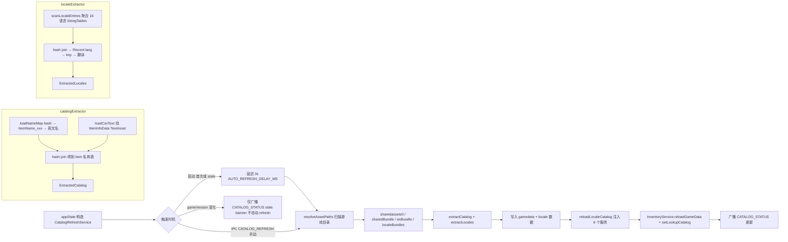

文件：`app/src/main/catalogRefreshService.ts`。

### 9.1 启动时机

`CatalogRefreshService` 在 `appState.ts` 顶部构造。**自动触发**：启动时若 `localeData` 为空（首次运行）或 `status.stale`，自动 refresh。**`stale` = catalog 版本 ≠ 游戏版本，或已加载 catalog 的 `schemaVersion` ≠ `CATALOG_SCHEMA_VERSION`（如 `IsDeletedInServer` 过滤加入前生成的旧 `userData/gamedata.json`，仍含 Lv85 装备）**——两者都会触发一次 refresh 用新逻辑重写缓存（旧缓存自愈）。自动 refresh 会**延迟 3s**（`AUTO_REFRESH_DELAY_MS`）：`extractCatalog`/`extractLocales` 在主进程同步解析大体积 Unity bundle 会阻塞全部 IPC handler，若与启动首帧重叠会拖住 renderer 的首批 `getLookupCatalog`/`getInventory` 请求，导致物品栏/掉落页先渲染灰点占位、目录到达后再整体刷新一次；延迟后首帧（图标 + 品质色）先完成，refresh 完成后的 re-emit 成为后台小更新。**手动触发**：IPC `CATALOG_REFRESH` → `catalogRefresh.refresh()` → 成功后 `reloadLocaleCatalog()` + `inventory.reloadGameData(...)` + `inventory.setLookupCatalog(...)`。**gameVersion 变化触发**：`liveMemory.setOnGameVersionChanged(() => catalogRefresh.onGameVersionChanged())` — 广播 `CATALOG_STATUS`（stale banner）+ **版本失配自动刷新（2026-09-17）**：`onGameVersionChanged` 现在会在确认失配（`catalogVersion` 与 `gameVersion` 均非 null 且不等）时调用 `maybeAutoRefresh()` 自动执行一次 `refresh()`——此前只出 banner 等用户手点，实测旧 `userData/gamedata.json` 会无限期继续生效（新物品无映射、新宝箱进 unclassified）。护栏：每个目标游戏版本每次应用运行只自动刷一次（`autoRefreshedVersion`），失败不自动重试（banner 保留，手动刷新可用），`autoRefreshInFlight` 防重入；仅版本失配触发，schema-only stale（游戏未运行、gameVersion=null）仍走手动/启动路径。

### 9.2 resolveAssetPaths 扫描游戏目录

`resolveGameInstallDir(configGameInstallDir)`：优先级

1. `config.gameInstallDir`（用户 Settings 设置）。
2. `TBH_GAME_INSTALL_DATA_DIR` env（dev/test override）。
3. `DEFAULT_GAME_INSTALL = "D:\SteamLibrary\steamapps\common\TaskbarHero\TaskBarHero_Data"`。
4. null。

`resolveAssetPaths(installDir)`：

- `sharedassets0` = `<installDir>/sharedassets0.assets`：物品 CSV（ItemInfoData TextAsset）。
- `sharedBundle` = `<installDir>/StreamingAssets/aa/StandaloneWindows64/localization-assets-shared_assets_all.bundle`：SharedTableData（hash → key 映射）。
- `enBundle` = `<installDir>/StreamingAssets/aa/StandaloneWindows64/localization-string-tables-english(unitedstates)(en-us)_assets_all.bundle`：英文字符串表。
- `localeBundles`：动态扫描 `localization-string-tables-*_assets_all*.bundle`，用 `parseLocaleBundleFilename(filename)` 解析 BCP-47 code，normalize 到 app 语言代码。

### 9.3 catalogExtractor 从 Unity bundle 提取的数据

文件：`app/src/core/unityAssets/catalogExtractor.ts`。

`extractCatalog({ sharedassets0, sharedBundle, enBundle }) → ExtractedCatalog`：

#### 步骤 1：构造 nameMap（`loadNameMap`）

1. `parseBundle(sharedBundle)` → `parseSerializedFile` → 找 classID=114 (MonoBehaviour) 对象 → 取 raw bytes → `scanMarkerEntries(raw)` 得到 `[{ keyId, hash, str }]`（shared 表的 hash → key 映射）。
2. 同样处理 `enBundle` → 英文 hash → string 映射。
3. 以 hash 为 linker，匹配 shared 的 key（仅 `ItemName_` 前缀）与 en 的 value，得到 `Map<ItemName_xxx, EnglishName>`。

#### 步骤 2：读 CSV（`loadCsvText`）

1. `sharedassets0` 可能是 raw SerializedFile 或 UnityFS bundle（按 magic bytes `UnityFS` 检测）。
2. `parseSerializedFile(sfData)` → 找 classID=49 (TextAsset) 对象 → `parseTextAssetRaw(raw)` 拿 name + script。
3. 找 name 为 `"ItemInfoData"` 的 TextAsset，返回其 script（CSV 文本）。

#### 步骤 3：解析 CSV

- 去除 BOM，按行 split，header 含 `ItemKey, NameKey, GRADE, ITEMTYPE, Level, IsCanExchangeMarketable, IsDeletedInServer` 等列。
- 每行：`ItemKey` 非数字 skip；`NameKey` 以 `ItemName_` 开头从 nameMap 查找；字面量直接用；空则 `#${itemKey}` 占位。
- **服务器已删除过滤**：`IsDeletedInServer=True` 的行（不可获取物品，如 v1.2.2 全部 Lv85 装备）**跳过**，其 id 记入 `deletedIds`。这些行仍在游戏 CSV 中（官方仅打标记未删除行记录），不过滤会导致图鉴列出游戏内不存在的物品。
- **NameKey-only entries**：nameMap 中存在但 CSV 没有的，追加为 `{ id, name, grade: "", type: "", level: null, marketTradable: false }`；**已出现在 `deletedIds` 的 id 不追加**（其 `ItemName_<id>` key 仍存在于本地化表，否则会以空 type 行被拉回）。
- 返回 `ExtractedCatalog` 带 **`schemaVersion`**（`CATALOG_SCHEMA_VERSION = 2`，`app/src/core/unityAssets/catalogExtractor.ts`）：提取输出形状/过滤语义变化时递增，用于驱动旧缓存自愈（见 9.1 / 9.5）。

#### 占位名回填（9.5 步骤 6）

`extractCatalog` 的 nameMap 来自 enBundle 的 `scanMarkerEntries`（二进制标记扫描），可能漏掉部分 `ItemName_<id>` key —— 典型是多品阶/多等级共享一个基础名称的物品（如物品 id `160103` 的 NameKey 其实是 `ItemName_160003`），这些 key 运行时二进制扫描抓不到。因此 `extractCatalog` 对这类物品返回的 `name` 是 `ItemName_xxx` 占位符。

`CatalogRefreshService.refresh()` 在写入 `userData/gamedata.json` 前调用 `backfillItemNames(items, getLocaleData())`（`app/src/main/catalogRefreshService.ts`），用「bundled 全表转储 `data/_game_locale_dump.json`（由 `scripts/dump_game_locale.py` 经 UnityPy typetree 全表解析生成，捕获每种本地化 key）+ 运行时 overlay」合并的 locale 表，**按占位符 name 内嵌的 key**（而非物品 id）解析真实名称；无法解析的占位符保持原样。游戏升级新增物品时，重跑 `scripts/dump_game_locale.py` 更新转储，下次目录刷新即自动识别。为让 Lookup 页可检索到、且 Inventory/Loot 显示中文名，`LookupService.setGameData()`（`app/src/main/services/LookupService.ts`）把 gamedata 里 `lookup_items.json` 缺失的可玩法物品（GEAR/MATERIAL）并入查找目录，name 经 `gameItemName+localeCatalog` 本地化；每次 `reloadLocaleCatalog()` 重新并入并重注入到 tracking/inventory。并入项按类型推导图标名（材料 `item-<id>`、装备 `<GEARTYPE小写>-<id>`，`GEARTYPE` 由 `catalogExtractor` 写入 gamedata），`data/icons` 存在对应文件才填 `iconPath`，否则渲染回退等级色点。

### 9.4 localeExtractor 提取 16 种语言 labels

文件：`app/src/core/unityAssets/localeExtractor.ts`。

`extractLocales({ sharedBundle, locales: Record<code, Buffer> }) → ExtractedLocales | null`：

- `scanLocaleEntries(bundleBuffer)`：扫描所有 MonoBehaviour（locale bundle 含多个 StringTables：items/stats/grades/gearTypes/UI 等），append-only 聚合所有 entries。
- sharedBundle 提供 `hash → key`，每个 locale bundle 提供 `hash → translated string`。
- 用 hash join 得到 `Record<lang, Record<key, translated>>`。
- 单个 locale 失败返回空 map（不抛错）。

### 9.5 提取结果写入 + IPC 推送

`CatalogRefreshService.refresh()` 完整流程：

1. `resolveGameInstallDir(getGameInstallDir())` → null 抛错。
2. `resolveAssetPaths(installDir)` → 检查三个核心文件存在。
3. `readFileSync` 三个核心 buffer。
4. `extractCatalog({ sharedassets0, sharedBundle, enBundle })` → `{ items, stats, gameVersion, schemaVersion }`。
5. `gameVersion = liveMemory.getStatus()?.gameVersion ?? extracted.gameVersion`（优先用运行中游戏的版本）。
6. **占位名回填**：`backfillItemNames(items, getLocaleData())`（见 9.3）把 `ItemName_<id>` 占位名解析为完整 locale 表的真实名；先 `clearBundledJsonCache()` 确保读到最新 `data/_game_locale_dump.json`。回填数量大于 0 时记一条 info 日志。
7. 写 `userData/gamedata.json` = `{ gameVersion, schemaVersion, items: extracted.items }`（`schemaVersion = CATALOG_SCHEMA_VERSION`，供下次启动判断 stale / 旧缓存自愈）。
8. `gameData.reload(userDataDir)`：GameDataProvider 重新加载。
9. **locale 提取**（best-effort）：
   - 读所有 localeBuffers。
   - `extractLocales({ sharedBundle, locales: localeBuffers })`。
   - 成功 → 写 `userData/locale.json` + 更新 `cachedLocale` + 日志 per-language entry count。
   - 失败 → per-locale 诊断日志。
10. `lastRefreshMs = Date.now()`、`lastError = null`。
11. `broadcastStatus()` → `broadcast(IPC.CATALOG_STATUS, getStatus())`。
12. 返回 `CatalogRefreshResult = { ok: true, gameVersion, itemCount, resolvedNames }`。

**`reloadLocaleCatalog()`**（`appState.ts`）在 refresh 成功后被调用：把 `catalogRefresh.getLocaleData()` 合并到 base LocaleCatalog，然后 fan-out 到所有服务：`tracking.setLocaleCatalog`、`inventory.setLocaleCatalog`、`boxTimers.setLocaleCatalog`、`stageRuns.setLocaleCatalog`、`liveMemory.setLocaleCatalog`、`lookup.setLocaleCatalog`。

**渲染侧消费**：renderer 通过 `tryMergeGameLocale`（`app/src/renderer/i18n.ts`）经 `window.tbh.getLocaleData()` 拿同一份 locale 数据，用 `flatGameKeysToLabels`（`app/src/renderer/lib/gameLocaleLabels.ts`）把 `Grade_/Stat_/BaseStatName_/UniqueMod_/SkillName_` 等前缀摊入 i18next `common:labels.*`。图鉴装备「唯一效果」经 `common:labels.uniqueMods.<mod>` → `itemLabels.uniqueModLabel` 渲染；其中含占位符的模板会结合 `lookup_items.json` 里 `stats.unique.params`（构建时由 `gear_unique()` 从 `UniqueModInfoData.Param*` 归类）填充：技能名走 `common:labels.skillNames.*`、职业名走 `labels.classes`、数值按 `Raw_Divide1000/Raw_Divide100/Divided` 换算，任一占位符不可解析（元素、StatValueUp `unknown`）或模板缺 `params` 时回退 `text`。

---

## 10. Session 持久化（`app/src/main/services/SessionStateService.ts`）

### 流程图

load 校验恢复 / 15s autosave / 首次 save 解析时的 tryRestoreOnSnapshot（含 mtime 连续性与数值合理性双校验）。

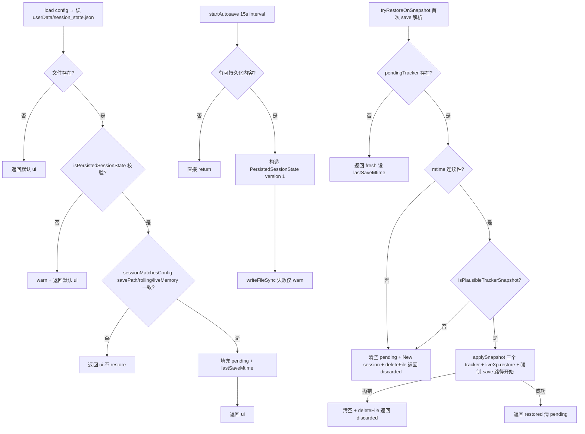

### 10.1 状态字段

- `pendingTracker / pendingChestDropTracker / pendingBoxOpenTracker / pendingLastSaveMtime`：从 `session_state.json` 读出但尚未应用到 tracker 实例的快照。
- `lastSaveMtime`：最近一次 save 的 mtime（秒）。
- `saveTimer`：15s autosave interval。
- `statusOverride`：临时状态文本（"New session" 等），60s 后自动清除。
- `ui: { miniOverlayOpen, boxTrackerOpen }`。

### 10.2 load(config) → SessionUiSnapshot

1. `savePath = expandPath(config.savePath)`。
2. 清空 pending。
3. `path = userData/session_state.json`。
4. 文件不存在 → 返回默认 ui。
5. `raw = JSON.parse(readFileSync)` → `isPersistedSessionState(raw)` 校验（version===1、字段类型正确）。无效 → warn + 返回默认。
6. 读出 `ui` 字段。
7. `sessionMatchesConfig(raw, savePath, config)` 校验：`savePath` 一致、`rollingWindowMinutes` 一致、`liveMemoryEnabled` 一致当前 `isLiveMemoryActive(config)`。不匹配 → info + 返回 ui（不 restore）。
8. pending 字段填充，`lastSaveMtime = raw.lastSaveMtime`。
9. 返回 ui。

### 10.3 startAutosave / 15s 流程

`saveTimer = setInterval(() => persist(ctx.tracker, ctx.chestDropTracker, ctx.boxOpenTracker, ctx.lastSnap, ctx.config), 15000)`

`persist` 流程：

1. `mtime = lastSnap?.saveMtime ?? lastSaveMtime`。
2. 若 `mtime === null && !tracker.isInitialized && pendingTracker === null` → 直接 return（无可持久化内容）。
3. `savePath = expandPath(config.savePath)`。
4. 构造 `PersistedSessionState` payload（含 `version: 1`、`savePath`、`lastSaveMtime`、`rollingWindowMinutes`、`liveMemoryEnabled`、`tracker: tracker.captureSnapshot()`、`chestDropTracker`、`boxOpenTracker`、`ui`）。
5. `mkdirSync(dirname, { recursive: true })` + `writeFileSync(path, JSON.stringify(payload, null, 2))`。
6. 失败仅 warn。

### 10.4 tryRestoreOnSnapshot（首次 save 解析时调用）

`tryRestoreOnSnapshot(tracker, chestDropTracker, boxOpenTracker, snap) → "restored" | "fresh" | "discarded"`：

1. `!pendingTracker || pendingLastSaveMtime === null` → `lastSaveMtime = snap.saveMtime`，返回 `"fresh"`。
2. **mtime 连续性校验**：`snapshotContinuesSession(pendingLastSaveMtime, snap)` = `snap.saveMtime >= pendingLastSaveMtime`。失败 → 清空 pending、`lastSaveMtime = snap.saveMtime`、`setStatusOverride("New session")`、`deleteFile()`、返回 `"discarded"`（save 被回滚或替换）。
3. **数值合理性校验**：`isPlausibleTrackerSnapshot(pendingTracker)`（`app/src/core/sessionState.ts:35`）— 校验 cumulativeGained、sessionRateValue、rollingRateValue、所有 heroMeters.gained 与 rolling 都通过 plausibility 检查；**金币字段校验（2026-09-17）**：`currentGold`/`prevGold`（非 null 时）须过 `isPlausibleGoldBalance`（有限、≥0、<1e15）、`goldGained` 须过 `isPlausibleCumulativeGold`（含按 elapsed 的隐含速率上限 `MAX_PLAUSIBLE_GOLD_RATE=5e10/h`）——此前只查 XP，脏 live 读数或游戏更新余额迁移会随快照恢复。失败 → 同上清理 + 返回 `"discarded"`（防止 live/save baseline 混合污染的快照被恢复）。
4. **应用 snapshot**：try 块中调用 `tracker.applySnapshot(pendingTracker)` + `chestDropTracker.applySnapshot(pendingChestDropTracker)` + `boxOpenTracker.applySnapshot(pendingBoxOpenTracker)`。任一抛错（schema drift / 腐败）→ warn + `deleteFile()` + 返回 `"discarded"`。
5. **金币基线对账（2026-09-17）**：`applySnapshot` 后、`finally` 清空前，调用 `tracker.reconcileGoldBaseline(snap.gold, snap.saveMtime, pendingLastSaveMtime)`（见 §4.10）——离线期间游戏更新迁移余额时不再把差值算成会话收益；离线期合理增益仍按旧语义计入一次。
6. finally 块清空 pending + 更新 `lastSaveMtime = snap.saveMtime`。
7. 成功返回 `"restored"`。

`applySnapshot` 内部还会调用 `liveXp.restore` / `liveGold.restore` / `healInflatedXpTotals`，并强制 `xpLiveOwning = goldLiveOwning = false`（恢复的 session 从 save 路径开始）。

### 10.5 clearSession

`clearSession(tracker, chestDropTracker, boxOpenTracker, config)`：

- 清空所有 pending。
- `tracker.reset()`、`chestDropTracker.reset()`、`boxOpenTracker.resetAll()`。
- `persist(tracker, chestDropTracker, boxOpenTracker, null, config)` — 立即落盘一份空 session（覆盖旧文件）。

### 10.6 PersistedSessionState 字段

```
{
  version: 1,
  savePath: string,
  lastSaveMtime: number,
  rollingWindowMinutes: number,
  liveMemoryEnabled?: boolean,
  tracker: TrackerSnapshot,    // 含 sessionStart/cumulativeGained/heroMeters/samples/...
  chestDropTracker?: ChestDropTrackerSnapshot,
  boxOpenTracker?: BoxOpenTrackerSnapshot,
  ui: { miniOverlayOpen: boolean, boxTrackerOpen: boolean }
}
```

---

## 11. BoxTimer 业务流程（`app/src/main/services/BoxTimerService.ts`）

### 流程图

1Hz tick 的 buildState 检测冷却→就绪转换并发通知；阶段 BOSS 掉落经 `tryMarkDroppedFromLiveStage` 进入冷却（含自动启用逻辑）。

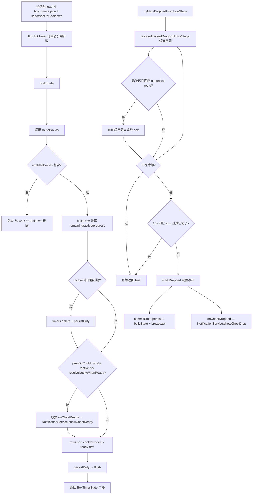

### 11.1 数据来源

- `catalogFile = loadStageBoxCatalogFile()`：读 `data/stage_boxes.json`，含 `defaultCooldownSeconds`。**gameVersion 告警（2026-09-17）**：`GameDataProvider.loadStageBoxes`（`app/src/main/gameDataProvider.ts`）现在会读取文件里的 `gameVersion` 字段（此前写入了但无人读），与已加载 gamedata 的版本不一致时打 warn——旧表在新游戏版本下会静默失配（新关卡箱不计时、不进 tracker），至少要可诊断。
- `routes = loadStageBoxTrackerRoutes()`：从 catalog 过滤 `grade === "RARE" && obtainable && tracker.canonical === true` 的条目，构造 `StageBoxTrackerRoute[]`。注意该过滤用的是**物品稀有度** `grade`，因此除标准 `920xxx` 关卡 Boss 箱外，还包含 `925xxx` 污染箱（Contaminated Stage Box，Nightmare/Hell/Torment 各 20 条，等级与标准箱重复：40/65/90）——目录共 71 条路线、仅 11 个不同等级。
- `routeById = trackerRoutesById(routes)`、`boxById = new Map(...)`、`routeBoxIds`（按 level 升序）。
- `buildCatalog()` 的每个 `BoxTimerCatalogEntry` 额外带 `category`（由箱名经 `categoryFromBoxItemName` 推导）：标准关卡 Boss 箱 → `"rare"`，污染箱 → `"plagueRare"`。渲染层据此区分：**等级 chip 仍按 level 合并**（71→11）；**「逐等级设置」按 (category, level) 聚合**，标准箱与污染箱各占一行，以便分别设置冷却/通知（两者自动开启用时不同）。污染多变体组不显示「刷怪位置」下拉（各变体关卡不同），改为列出掉落区间。

### 11.2 1Hz tickTimer 与 subscribers 引用计数

`startTick()`：`subscribers++`；若 `tickTimer` 已存在直接返回；否则 `setInterval(() => push(), 1000)`。

`stopTick()`：`subscribers = max(0, subscribers-1)`；若 `subscribers > 0 || !tickTimer` 返回；否则 `clearInterval`。

订阅者来自 `boxTrackerWindow`：窗口创建时 `boxTimers.startTick()`，关闭时 `stopTick()` + `setBoxTrackerOpen(false)` + `tracking.flushSession()`。无订阅者时停止 tick 节省 CPU。

### 11.3 关键方法

- **`setCurrentStageKey(key)`**：值变化时更新 `currentStageKey` 并 `push()`。
- **`markDropped(boxId)`**：`timers.set(boxId, Date.now())`；触发 `onChestDropped?.({ boxId, name, level })` → NotificationService.showChestDrop；`commitState()`（persist + buildState + broadcast）。
- **`tryMarkDroppedFromLiveStage(stageKey) → boolean`**：
  1. `boxId = resolveTrackedDropBoxIdForStage(stageKey, enabledBoxIds, routes, idealStageKeyByBoxId)`：
     - 过滤 `enabledBoxIds.has(boxId) && route.dropStageKeys.includes(stageKey)` 的候选。
     - 0 候选 → 走自动启用逻辑（见下）。
     - 1 候选 → 直接返回。
     - 多候选 → 优先匹配 farmStageKey；无匹配则用全部候选；按 level 降序选最高级。
  2. **自动启用**（2026-08-27 新增）：当无可启用候选时，若 `stageKey` 仍匹配某 canonical RARE tracker route，则自动把该 route 中等级最高的 box 加入 `enabledBoxIds`（清 `catalogCache`），再继续计时。原因：默认启用的四个中局等级（Lv15/20/30/40，覆盖关卡上限只到 2304）不覆盖后期关卡（如 Lv80 宝箱 id=920801），导致用户刷后期关卡时**任何**本次 BOSS 掉落都不会触发 BoxTimer 倒计时/通知（日志表现为反复 `matched route(s) [...] but none enabled; skipping`，`Stage boss drop detected` 出现 0 次）。自动启用是显式且廉价的：该等级确实在被刷，启动其冷却符合预期。日志记 `auto-enabled LvN box (id=...) — was disabled`。
  3. `boxId == null` → 返回 false（stage 无任何可掉 route）。
  4. `isBoxOnCooldown(boxId)` → log info + 返回 true（已冷却中，幂等跳过）。
  5. **同一次掉落去重**（2026-09-10 新增）：若 `lastStageDropBoxId !== 0 && lastStageDropBoxId !== boxId && now - lastStageDropArmAtMs < LIVE_STAGE_DROP_DEDUPE_MS(=15000)`，则 log info + 返回 true（不再 arm 第二个箱子）。
     - 背景：本入口曾有**两条上游**——live 路径（TrackingService 的 GetBox 日志）与 save-reconcile 路径（AutoClassifyService 的槽位增量补偿），二者各自用自己的 stage 快照反查 boxId。当两条快照跨越等级边界（如 Torment 2-8=Lv80 / 2-9=Lv90 相邻）时，同一次掉落会解析出**两个不同箱子**，同时启动两个倒计时。
     - 2026-09-10 起 save-reconcile 路径**不再调用**本方法（见 14.4 Step 5），倒计时由 live 路径独占触发，根因已消除。此护栏保留为兜底：若 live 路径自身把一次掉落的 GetBox burst 拆成两次 flush、且其间 stage 恰好跨级，仍只能 arm 一个箱子。
     - 判定依据：stage BOSS 宝箱来自关卡通关，通关间隔以分钟计；15s 窗口内的「跨箱子 arm」不可能是两次真实掉落。同一箱子的重复上报仍由第 4 步的 `isBoxOnCooldown` 兜底。
     - 只有本入口会更新 `lastStageDropArmAtMs/lastStageDropBoxId`；手动 `markDropped`（UI/IPC）不参与去重，避免抑制后续真实掉落。
  6. 否则 `markDropped(boxId)` + 记录 `lastStageDropArmAtMs/lastStageDropBoxId` + 返回 true。
- **`setBoxTrackerNotify(boxId, enabled)`**：enabled=true → 从 `notifyWhenReadyByBoxId` 删除（恢复默认 true）；enabled=false → set false；清 catalogCache + commitState。
- **`setCooldownSeconds / setFarmStageKey / setEnabledBoxIds / setSortOrder / clearCooldownOverride / clearFarmStageOverride`**：类似 markDropped 的"修改内部状态 → 清 catalogCache → commitState"模式。`setCooldownSeconds` 限制 [60, 86400]；`setFarmStageKey` 必须在 route.dropStageKeys 内。

### 11.4 buildState() — 1Hz tick 核心

1. `now = Date.now()`。
2. 遍历 `routeBoxIds`：
   - `!enabledBoxIds.has(boxId)` → 从 `wasOnCooldown` 删除 + continue。
   - `prevOnCooldown = wasOnCooldown.get(boxId) ?? false`。
   - `row = buildRow(boxId, now)`：计算 `remainingSeconds`、`active`、`progress`。
   - 若 `!active`（计时器刚过期）：从 `timers.delete(boxId)` + 标记 `persistDirty = true`（延迟到 buildState 末尾统一持久化）。
   - **通知检测**：`prevOnCooldown && !row.active && resolveNotifyWhenReady(boxId)` → push 到 `readyNotifications`。
   - `wasOnCooldown.set(boxId, row.active)`。
3. 触发 `onChestReady?.(payload)` for each readyNotification → NotificationService.showChestReady。
4. `rows.sort(compareBoxTimerRows(a, b, sortOrder))` — `cooldown-first`：冷却中优先（按 remainingSeconds 升序），就绪按 level/boxId；`ready-first`：相反。
5. 计算 `readyCount` / `cooldownCount`。
6. 若 `persistDirty` → flush 一次 persist。
7. 返回 `BoxTimerState`。

### 11.5 seedWasOnCooldown（load 时调用）

构造后立即调用：对每个 `enabledBoxIds`，根据 `timers.get(boxId)` 与 cooldown 计算 remaining，>0 则 `wasOnCooldown.set(boxId, true)`，否则 `false`。**防止首次 buildState tick 触发假 onChestReady**（通知只在 `prev=true → active=false` 转换时触发，`false → false` 不触发）。

### 11.6 box_timers.json 持久化

**load()**：构造时调用。文件不存在 → 用 `defaultEnabledIds()` 填充 `enabledBoxIds`（DEFAULT_ENABLED_BOX_IDS = `[920151, 920201, 920301, 920401]`，过滤掉 catalog 中不存在的；fallback 取 routeBoxIds 前 4 个）。文件存在 → 解析 `PersistedFile`：

- `timers`：过滤有效 boxId + droppedAtMs。
- `cooldownSecondsByBoxId`：过滤 Number.isFinite + >0 + routeById 中存在的。
- `idealStageKeyByBoxId`：过滤 route.dropStageKeys 包含 stageKey，且不等于 route.idealStageKey。
- `notifyWhenReadyByBoxId`：boolean 化。
- `sortOrder`：normalizeBoxTrackerSortOrder。
- `enabledBoxIds`：过滤 routeById 中存在的；空则用 defaultEnabledIds。

**persist()**：序列化为 `{ timers, enabledBoxIds, cooldownSecondsByBoxId, idealStageKeyByBoxId, notifyWhenReadyByBoxId, sortOrder }`。`notifyWhenReadyByBoxId` 只持久化 `false` 项（默认 true 不写盘）。失败仅 warn，不破坏 in-memory state。

### 11.7 notificationPrefs vs per-box notify 的区别

- **notificationPrefs**（config.json）：全局通知偏好，按 kind（chestDrop / chestReady / heroLevelUp / inventoryAlmostFull）配置 `enabled + sound`。`NotificationService.playKindSound` 检查 `notificationPrefs[kind].enabled` 决定是否播音。
- **per-box notifyWhenReady**（box_timers.json）：单宝箱级别的"就绪通知开关"。`BoxTimerService.resolveNotifyWhenReady(boxId)` 决定是否调用 `onChestReady`。两者是"双层开关"：per-box 关闭则完全不触发回调；per-box 开启但 notificationPrefs.chestReady.enabled=false 则回调到达 NotificationService 但不播音。

---

## 12. StageRun 业务流程（`app/src/main/services/StageRunService.ts` + `app/src/core/stageRunTracker.ts`）

### 流程图

仅 live 路径触发：clear 事件直接记录；失败由 StageRunFailDetector 用"英雄在场下降沿"推断。

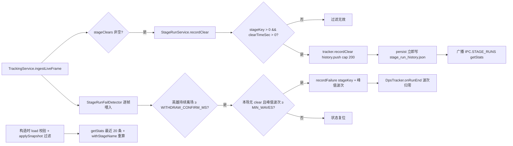

### 12.1 触发时机

`StageRunService.recordClear(stageKey, clearTimeSec, xpGained, goldGained)` 由 TrackingService 在 `ingestLiveFrame` 内检测到 `snap.stageClears.length > 0` 时通过 `onLiveStageClear` 回调调用。`StageRunService.recordFailure(stageKey, failedWave)` 由同一调用链内对"失败 run"的推断触发（见 12.3 检测规则）。两者**仅在 live memory 路径触发**，save 路径不触发（save 无 stageClears / alive 数据）。

### 12.2 recordClear 流程

1. `tracker.recordClear(stageKey, clearTimeSec, xpGained, goldGained)`：
   - `stageKey <= 0 || clearTimeSec <= 0` → return（过滤无效）。
   - `history.push({ wallTime, stageKey, clearTimeSec, xpGained: max(0, xpGained), goldGained: max(0, goldGained) })`。
   - 超 `HISTORY_LIMIT = 200` → `splice(0, length - 200)`（保留最近 200 条）。
2. `persist()`：`writeFileSync(stage_run_history.json, JSON.stringify(tracker.captureSnapshot(), null, 2))` — 每次 clear 都立即落盘。
3. `push()`：`broadcast(IPC.STAGE_RUNS, getStats())`。

### 12.3 失败记录（recordFailure）检测规则

游戏没有失败日志类，因此失败**无法直接读取**，只能由 live memory 推断，检测逻辑收敛在 `app/src/core/stageRunFailDetector.ts`（`StageRunFailDetector`），由 `TrackingService.ingestLiveFrame` 每帧喂入：

- **run 边界信号（英雄在场）**：失败判定以**部署队伍**（`StageManager.HeroList`，即 `snap.heroes` 是否非空）为 run 边界。英雄在一整场战斗中都留在场上，只在 run 结束时撤下——要么通关离开、要么失败撤走。因此"英雄从在场(`heroes.length>0`)变为不在场"的**下降沿**就是一次 run 结束。对比用场上怪数(`alive`)：英雄信号在**波间隙不会触发**（波隙时英雄始终在场上），所以**不需要"空场持多久"的时间阈值**，快速自动重开也能捕捉。
- **撤场防抖（2026-09-09）**：`readParty` 会在英雄 live 经验回退 / offsets 抖动 / 场景切换时让 `heroes` 短暂为空（`null` 或空数组）。若把每个这样的下降沿都当作真实撤场，会 (a) 中途清零 `DpsTracker` 波次、(b) 记录一条**虚假失败**关卡。因此下降沿**去抖**：英雄必须持续不在场 ≥ `WITHDRAW_CONFIRM_MS`（400ms，`snap.at` 时钟）才确认撤场；窗口内恢复在场（`heroes` 复现非空）则取消待确认判定。真实撤场是持续离场（列表恒为空），不会因窗口漏检。
- **判定失败**：当英雄**确认撤离**（run 结束）且本场**无 clear 事件**（`runHadClear === false`）且 run 峰值波次 **≥ `MIN_WAVES(2)`**（过滤"进图即退"）时，调用一次 `onLiveStageFail(stageKey, failedWave)`。`update` 现返回 `{ fail, runEnded }`（`StageRunFailJudgement`）：`fail` 仅在失败时非空、`runEnded` 在确认撤场（胜或败）时恒 true。**失败判定与撤场处理都排在该确认 tick 上、先 fail 后 `runEnded`**：`fail` 先读**峰值波次（`runMaxWaves`）**——团灭时「怪物清空 → 波次达到关卡总波数的强制重置（R4）」会在撤离前几个 tick 把 `DpsTracker` 波次清零，读瞬时值会因 `< MIN_WAVES` 静默丢弃真实关底失败（2026-09-02 修复）；随后用 `runEnded` 调 `DpsTracker.onRunEnd()` 把波次归零，使失败/通关后快速自动重开时 UI 波次回落到第 1 波。判后状态复位，下一场独立判定。从未部署过英雄（菜单/大厅）不触发。

  > 旧签名返回单一 `StageRunFailResult | null` 不再成立：`onRunEnd` 必须在**任意**确认撤场（含成功通关）时触发，而不仅是失败，故拆为 `{ fail, runEnded }`。

- **成功通关不误判**：有 clear 事件的 run 会置 `runHadClear=true`，确认撤场时不会判失败；且通关后结算同样会让英雄撤下，但因已记成功记录（首次 clear 因基线差分取 0 增益也照常记录）不会重复失败。额外防御：TrackingService 在任何有效 clear 的 tick 先 `failDetector.reset()`，且去抖窗口内若读到 clear 同样置 `runHadClear=true`，杜绝 clear/撤离时序抖动带来的误判。阈值 `MIN_WAVES` 与 `WITHDRAW_CONFIRM_MS` 为启发式可调常量，仍存在极有限误判风险（如无需 clear 就撤离的换图/退出场景）。

### 12.4 独立持久化

`stage_run_history.json` 与 `session_state.json` **完全独立**：session 重置不影响 stage run history。原因：stage run history 是"历史记录"而非"session 统计"，不应被 reset session stats 或 live-memory-toggle 重置清空。

### 12.5 load + restore 校验

- **load()**（构造时）：文件不存在 return；存在则 `JSON.parse` → `tracker.applySnapshot(raw)`。失败仅 warn。
- **applySnapshot**：`raw.history` 必须是 array，否则清空。每条用 `isValidHistoryEntry` 校验，过滤后 slice 到 HISTORY_LIMIT。校验按 `outcome` 判别式：`outcome === "fail"` 的条目只需 `wallTime`/`stageKey`/`failedWave >= 1`（清除时字段为 0 不被检查）；其余（clear 或旧版无 `outcome` 的遗留条目）仍需 `clearTimeSec > 0` 及有限 `xpGained`/`goldGained`。因此旧版 `stage_run_history.json` 可原样加载。

### 12.6 getStats()

返回 `StageRunStats`：`{ history: 最近 20 条倒序, readerRequired: true }`。每条调用 `withStageName(entry, localeCatalog)` 重新计算 stageName（不信任持久化的 stageName，支持语言切换）。失败条目在渲染层显示"失败"徽标、失败波次，XP/金币列置为 `—`。

---

## 13. ChestService 业务流程（`app/src/main/services/ChestService.ts`）

### 流程图

onSave 解析 → buildChestState 聚合/容量/开箱时间 → reconcile 校准 AutoClassify → 广播。

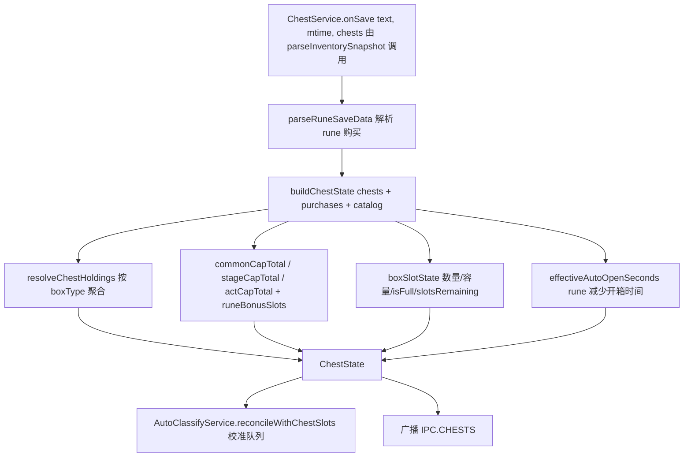

### 13.1 onSave 触发

`chests.onSave(text, mtime, chests: ChestHolding[])` 由 `TrackingService` 的 `parseInventorySnapshot` 回调调用。`chests: ChestHolding[]` 来自 `inventory.parseFromSave(text, mtime).chests`。

### 13.2 resolveAndPush 流程

1. `purchases = parseRuneSaveData(text)` — 解析玩家购买的 rune 列表。
2. `lastChests = buildChestState(chests, purchases, mtime, boxTypes, runeCap, runeAutoOpen)`（`app/src/core/boxes/resolve.ts`）：
   - `rows = resolveChestHoldings(chests, boxTypeCatalog)`：按 boxType 聚合数量，attach label/category，按 category 排序。
   - `commonCapTotal = commonBoxCapacity(purchases, runeCapCatalog)` = `baseCapacity + runeCapacityBonus`。
   - `stageCapTotal`、`actCapTotal` 同理（注意 stageBoss 对应 "rare" 分类）。v1.02.00 起另有 `plagueCommon/plagueRare/plagueAct` 三组独立容量（污染宝箱独立保管）。
   - `common = boxSlotState(quantityForCategory(rows, "common"), commonCapTotal)` — 计算数量、容量、isFull、slotsRemaining。
   - `stageBoss`、`actBoss` 同理；`plagueCommon/plagueRare/plagueAct` 同理（类别来自污染宝箱前缀分类）。
   - `capacity`：每类的 `{ base, runeBonus, purchasedCapRuneNodes, runeLabel }` 明细（含 plague 三组）。
   - `autoOpen`：`effectiveAutoOpenSeconds(purchases, runeAutoOpenCatalog.common/stageBoss/actBoss/plague*)` — rune 减少自动开启时间。
   - 返回 `ChestState`：`{ rows, common, stageBoss, actBoss, plagueCommon, plagueRare, plagueAct, capacity, autoOpen, totalHeld, saveMtime, runeBonusSlots }`。
3. `reconcile()`：触发 `onReconcile?.({ common, rare: stageBoss.quantity, act: actBoss.quantity, plagueCommon, plagueRare, plagueAct })` — AutoClassifyService 用此校准队列。
4. `broadcast(IPC.CHESTS, lastChests)`。

### 13.3 容量计算（`app/src/core/boxes/capacity.ts`）

- `boxCapacity(purchases, def) = def.baseCapacity + runeCapacityBonus(purchases, def)`。
- `boxSlotState(heldQty, capacity)`：clamp quantity ≥0、capacity ≥1，`isFull = quantity >= capacity`，`slotsRemaining = max(0, capacity - quantity)`。

### 13.4 与 AutoClassifyService 的协作

- **`setOnReconcile(cb)`**：appState 装配时注入 `(slots) => autoClassify.reconcileWithChestSlots(slots)`。
- **`getAutoOpenSeconds()`**：AutoClassifyService.handleChestDrop 时调用，返回 `{ common, stageBoss, actBoss, plagueCommon, plagueRare, plagueAct }` 或 null（首次 save 解析前）。null 时 AutoClassify 用 FALLBACK_AUTO_OPEN = `{ common: 300, stageBoss: 600, actBoss: 60, plagueCommon: 600, plagueRare: 1200, plagueAct: 120 }`。

### 13.5 v1.2.2 宝箱槽位：save 侧 BoxBucketGetBoxList 路径

v1.2.2 把 `PlayerSaveData.BoxData`（两列 int，静态可达）整体移除，但**未开箱子仍以 STAGEBOX 普通物品形式存在于 `itemSaveDatas`**。其中 `BoxBucketGetBoxList`（未开）/`BoxBucketUseBoxList`（已开）记录部分箱子的 `UniqueId`，但**并不覆盖全部**——详见下方第 3 步的判定规则。

**解析**（`app/src/core/inventory/parse.ts → parseChests`）：

1. `player.BoxData` 存在 → 走旧路径（BoxTypes × BoxQuantity）。
2. 否则从 `playerStr` 按原始文本遍历 `itemSaveDatas` 物品对象（`UniqueId` 超 `Number.MAX_SAFE_INTEGER`，**必须字符串比较**，禁止 JSON.parse 后转 number），`type` 携带 gamedata 物品 id。
3. **持有的判定（2026-09-13 修复）**：凡 `classifyBoxItemKey(itemKey)` 返回已知 STAGEBOX 分类（`Normal Monster Box*`→common、`Stage Boss Box*`→rare、`Act Boss Box*`→act，`categoryFromBoxItemName` 在 `core/liveMemory/chestSlots.ts`）且该 item 的 `UniqueId` **不在 `BoxBucketUseBoxList`（已开桶）** 即计入持有。
   - **关键**：不要求一定出现在 `BoxBucketGetBoxList`（未开桶）。v1.2.2 实测普通/关卡箱（910901/920901）的 `UniqueId` 在未开桶，而**章节 Boss 箱（930901）的 `UniqueId` 既不在未开桶也不在已开桶、仅以 STAGEBOX 物品存在于 `itemSaveDatas`**。旧实现用「未开桶」过滤 → 章节 Boss 箱被误判为已开而整体丢弃 → act 持有=0 → reconcile 把刚 +1 的实时计数覆盖回 0（"掉落章节宝箱后队列被误归零"）。
   - 未知 id 的箱子（`classifyBoxItemKey` 返回 null）仍以出现在未开桶作为识别依据，计入 unclassified 行（`Type <itemId>`），不静默丢弃，便于发现 gamedata 过期。
4. 分类由调用方注入 `classifyBoxItemKey`（`InventoryService.parseFromSave` 按 gamedata `type === "STAGEBOX"` + 物品名前缀）；分类结果写入 `ChestHolding.category/label`。
5. `resolveChestHoldings`（`core/boxes/resolve.ts`）优先采用 holding 自带的 `category/label`，缺省回退 boxTypeCatalog（旧版本行为不变）。

历史教训：曾尝试内存侧「逐箱 BoxData 清堆枚举」兜底（方案 B，已移除）——其前提是"save 无法提供逐类数量"，实为误判；且 v1.2.2 堆中箱子对象无稳定类名（`BoxData` 不在 GA 类索引），枚举不可靠。**v1.2.2 宝箱槽位以 save 为唯一数据源**，live 快照 `chestSlots` 在 v1.2.2 下为 null，`ChestService.setLiveSlots(null)` 回落 save 派生值。

**注意（2026-09-10 修复）**：`live` 帧（~25Hz）在 v1.2.2 下每帧都回调 `setLiveSlots(null)`。旧实现中 `unchanged` 判定要求 `slots != null`，故 `null→null` 永远被判为"变化"，导致**每帧都拿上一次 save（滞后）触发一次 reconcile**。这会在同一帧内（`TrackingService.ingestLiveFrame` 先记录 live 掉落、后调 `onLiveChestSlots`）把刚入队、save 尚未记录的箱子当作 excess 剪掉，等 save 追平后再以"对账时刻"为锚 backfill —— 宝箱开箱倒计时锚点被推后、**系统性偏慢**，且后续 save 重读无法回正。现 `setLiveSlots(null)`（override 已为 null 时）直接 return，v1.2.2 的对账改由 save 解析（`onSave → reconcile`）驱动。

另注：方案 B 曾长期静默失效的直接原因是 utilityProcess 消息未解包——`process.parentPort.on("message")` 回调收到的是事件对象 `{data: payload}`，真实载荷在 `.data` 上（`worker.ts` 已修复，"stop" 指令曾同样因此失效）。

#### 13.5.1 v1.2.4 act 幽灵条目与会话作用域过滤（2026-09-18）

**现象**：游戏升到 v1.2.4 后，Chests 页 act 槽位卡显示 4 个章节 Boss 箱、BoxTimer 队列出现 4 个永不倒计时的幽灵条目，而游戏内宝箱面板显示 0。

**根因**（用真实存档 + 每日备份时间序列实证）：

1. v1.2.2 起 act（930901）箱子**从不进入** `BoxBucketGetBoxList`/`BoxBucketUseBoxList`（v1.2.4 未变），仅以 STAGEBOX 物品存在于 `itemSaveDatas`——真实在持与已开的区分只能靠"条目消失"（开箱时游戏直接删除条目，且不写入 UseBoxList）。
2. 2026-09-17 06:26–12:30 之间（v1.2.4 升级加载点 12:28 前后），存档出现 4 条连续 UID 的 act 条目（与同窗口的 rare 箱 UID 交错 ⇒ 老版本会话内掉落）。
3. v1.2.4 加载存档时恢复了 common/rare（走 GetBoxList）但**没有恢复这些 act 条目**——游戏内从此显示 0，而这 4 条在 itemSaveDatas 中**永久残留**（后续同会话掉落的 10 个 act 箱正常掉落/开箱/消失，佐证开箱删除机制本身正常）。
4. 旧规则「已知 STAGEBOX 且不在 Use 桶即持有」把这 4 条幽灵全部计入 → act=4 多算；AutoClassify reconcile 又以此校准队列 → BoxTimer 出现永不开启的条目。
5. UID 全文检索确认：幽灵条目在全存档中仅 itemSaveDatas 一处引用；但真实在持 act 箱亦然——**桶与存档内部结构均无法区分幽灵与在持**。

**修复**：会话作用域过滤（`app/src/core/boxes/sessionScope.ts`，纯函数 + 单测）：

- 不变量（v1.2.4 实证）：**凡游戏会话开始时就已存在于存档的 act 条目，游戏内必然不可见**。因此 act 持有数 = 本游戏会话内首次出现的 act 条目。
- 会话边界判定（`deriveSession`）：游戏版本变化（升级重启）＞ 存档 mtime 回退（换档/回档）＞ 距上次存档超 30 分钟（游戏关闭）。
- 首次启用过滤时的存量 act 条目按 `LEGACY_SESSION_ID` 记录并**保守排除**（来源不可知）。
- 仅作用于 `act` 类别；无 `uniqueId` 的条目（旧 BoxData 路径）直接放行；`common/rare` 走 GetBoxList 恢复、不受影响；**`plagueAct` 行为未实证，暂不过滤（观察项）**。
- 状态持久化在 `userData/chest_session_scope.json`（load-once / persist-on-change；仅会话切换或 uid 表变化时写盘），companion 重启不丢会话上下文。
- `parseChests` 现在为每条 holding 传播原始 `uniqueId`（字符串，非数值化）；`ChestState.orphanExclusions.act` 向 UI 报告本轮排除数（Chests 页 act 卡下方提示）。

**已知权衡**：若某游戏版本恢复了「act 箱跨重启保留」，本过滤会在每次游戏重启后短暂少计 act（直到下一次 act 掉落重新入账）。这是「无法从存档区分幽灵」前提下的保守取舍。

#### 13.5.2 会话边界改用「游戏会话锚点」（2026-09-19，修 v1.24.1 漏判）

**问题**：v1.24.1 用「存档 mtime 间隔 > 30 分钟」判定游戏重启，实测漏判——游戏**启动后数秒即写档**，可观测间隔只剩停机时长。2026-09-19 现场：01:47:53 最后一次存档 → 02:09:22 游戏重启（Player.log 轮转、steam_autocloud.vdf/backend.dat 同步改写）→ 02:13 首档，间隔约 25 分钟 < 阈值 ⇒ 边界未判定，重启前掉落的 10 个 act 条目继续带着旧会话标签计入（游戏侧已丢失 ⇒ 显示 0）⇒ act 卡再次多算 10。

**修复**：新增**游戏会话锚点**（`ChestService.gameAnchorMtimeSec()`）——游戏只在**启动时**改写的兄弟文件，按优先级取 mtime：

1. `Player-prev.log`（Unity 每次启动把 Player.log 轮转为它，mtime = 本次会话启动时刻；结构性保证）
2. `backend.dat`（兜底，实测同样在启动时改写）

`ChestService.setSavePath()` 由 appState 在启动、配置变更（setConfig）与 `onSavePathChange` 三处注入存档路径；锚点变化 ⇒ 边界 `anchor`（`deriveSession`），与版本变化/存档回退/30 分钟间隔（降级为兜底）并列。

**升级兼容**：v1.24.1 及更早写出的状态文件没有 `lastGameAnchor` 字段，无法证明其跟踪的是当前游戏会话 ⇒ 首次解析强制一次 `anchor-unknown` 边界（保守排除存量 act 条目）。实测：当前存档 14 条 act（4 幽灵 + 10 重启前）在该边界后全部排除，act 显示 0，与游戏一致。

**不变量再确认**（2026-09-19 实证）：游戏重启后 act 条目**不恢复**——重启前掉落的 10 条至今仍留在 itemSaveDatas 却不在游戏内显示；common/rare 走 GetBoxList 正常恢复。因此「会话开始前既存的 act 条目 = 游戏侧不可见」成立。

### 13.6 v1.02.00 Plague（瘟疫）宝箱：独立保管槽位

游戏 v1.02.00（瘟疫之地/Plaguelands）新增**污染宝箱**（Contaminated Box，CONTENTTYPE=PLAGUE），与普通宝箱**分开保管**（wiki 确认「通常エリアの宝箱とは別に保管」，容量/自动开箱由专用符文节点控制）：

| 物品                              | 前缀                       | 类别           | 容量符文链                                          | 自动开箱                                                                                    |
| --------------------------------- | -------------------------- | -------------- | --------------------------------------------------- | ------------------------------------------------------------------------------------------- |
| `915xxx` Contaminated Normal Box  | `Contaminated Normal Box`  | `plagueCommon` | `MaxAmountPlagueNormalChest` (1162, 11621-11624)    | `UnlockAutoOpenPlagueNormalChest` 600s + `ReduceAutoOpenPlagueNormalChestTime` 4s/级        |
| `925xxx` Contaminated Stage Box   | `Contaminated Stage Box`   | `plagueRare`   | `MaxAmountPlagueStageBossChest` (1164, 11641-11644) | `UnlockAutoOpenPlagueStageBossChest` 1200s + `ReduceAutoOpenPlagueStageBossChestTime` 8s/级 |
| `935xxx` Contaminated ActBoss Box | `Contaminated ActBoss Box` | `plagueAct`    | `MaxAmountPlagueActBossChest` (1166, 11661-11664)   | `UnlockAutoOpenPlagueActBossChest` 120s + `ReduceAutoOpenPlagueActBossChestTime` 1s/级      |

**companion 适配（2026-09-10）**：

- **分类**：`categoryFromBoxItemName`（`core/liveMemory/chestSlots.ts`）新增三个前缀匹配 `Contaminated Normal/Stage/ActBoss Box` → `plagueCommon/plagueRare/plagueAct`；`BoxCategory` 类型（`shared/types.ts`）相应扩展。
- **容量/自动开箱**：`data/rune_box_cap.json` / `rune_auto_open.json` 新增 `plagueCommon/plagueRare/plagueAct` 三组（boxType 3/4/5）；`resolve.ts buildChestState` 与 `capacity.ts` 新增对应容量函数；`ChestState` 接口新增三个槽位。
- **box_types.json**：新增 3/4/5 三个 boxType（绿色），供 live 路径 `readRuntimeChestSlots` 与 `boxCategoryFromType`（`boxOpenLog.ts`）映射。
- **AutoClassify**：`reconcileWithChestSlots` / `getQueueSnapshot` 的类别遍历扩展为 6 类；`autoOpenForBoxKey` 支持 plague 类别；FALLBACK_AUTO_OPEN 增加 plague 值。
- **UI（2026-09-11 更新）**：Chests 页新增三张 Plague 槽位卡（`CapacityBar` 新增 green variant）；Loot 页类别标签同步；`LootQueueSlots` 槽位卡渲染 6 行（瘟疫行绿色进度条）；**手动分类弹窗 `ClassifyPromptDialog` 与未分类物品重分类下拉 `LootBoxSection.reclassifyCategoryOptions` 均提供 6 个类别选项**（瘟疫类别 resolve 后走 `category.plague*` boxKey）。**掉落计时圈（LootRing）瘟疫独立三档**：`LootRingSeconds` 扩展为 6 键，`ringKeyForCategory` 将 plague\* 映射到独立档位；默认圈时长 plagueCommon=5min / plagueRare=7min / plagueAct=1h（主进程 `config.ts` 默认值与 sanitize 同步扩展，老 config 缺键自动回落默认）。
- **行为边界**：污染宝箱 save 侧解析与普通宝箱一致（BoxBucketGetBoxList + itemSaveDatas 前缀分类）。
- **掉落追踪（2026-09-11 更新）**：`ChestDropTracker` 已支持 6 类（common/rare/act/plagueCommon/plagueRare/plagueAct）。live 掉落依据**当前地图判定瘟疫**——瘟疫箱子只在瘟疫之地掉落，`isPlagueStage(stageKey)` 聚合瘟疫箱（915/925/935）的 `tracker.dropStageKeys`/`idealStageKey` 成 Set，`resolveLiveDropCategory` 在瘟疫地图把 base category 升级为 `plague*`（详见 14.4 Step 5）。AutoClassify 的 reconcile 补偿类别已扩至 6 类；Live/Loot 掉落面板均渲染 6 类。

---

## 14. AutoClassify 业务流程（`app/src/main/services/AutoClassifyService.ts`）

### 流程图

两条入口（live 掉落 / 开箱结果）进入 per-category 串行队列；1Hz tick 推进队列与超时处理。

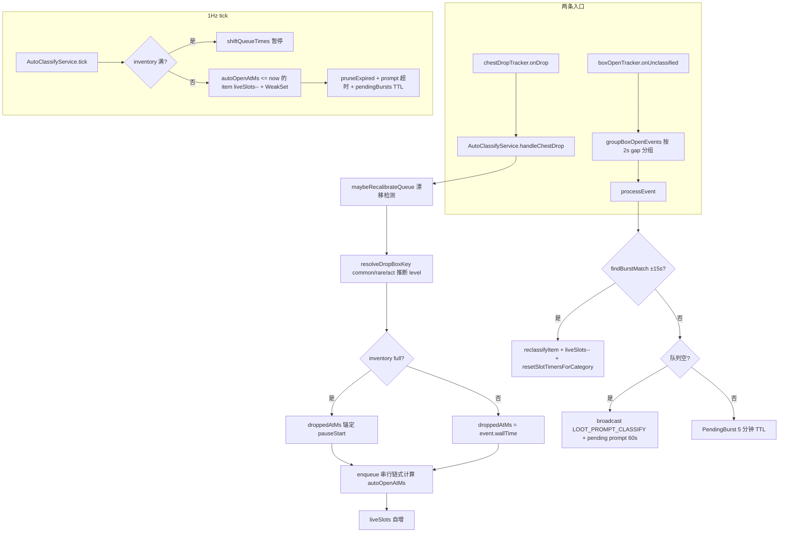

详细规约见 [`docs/findings/auto-classify-business-logic.md`](./findings/auto-classify-business-logic.md)，本节是摘要。

### 14.1 核心模型：串行队列（per-category shared timer）

每个 category（common/rare/act）有独立的 shared timer。新掉落进入队列时：

- 队列为空 → `autoOpenAtMs = droppedAtMs + autoOpenSec*1000`。
- 队列非空 → `autoOpenAtMs = prevTail.autoOpenAtMs + autoOpenSec*1000`（必须等前面所有同类 chest 开完）。

队列按 `autoOpenAtMs` 升序排序，全局 head = 下一个预计自动开启的 chest。

### 14.2 关键回调

- **`handleChestDrop(event)`**：`chestDropTracker.onDrop` 触发。
  1. `maybeRecalibrateQueue()` — 检测 autoOpenSeconds 漂移。
  2. `stageKey = getCurrentStageKey() ?? 0`。
  3. `autoOpen = chestService.getAutoOpenSeconds() ?? FALLBACK_AUTO_OPEN`。
  4. `boxKey = resolveDropBoxKey(event, stageKey)`：common → commonRoutes 推断 level；rare → BoxTimer catalog 推断 level；act → actBossRoutes 推断 level。**stageKey 未知（≤0）或匹配不到任何 route 时返回 category-only boxKey（`common`/`rare`/`act`，无 `:level` 后缀）**，绝不回退到最低等级 —— 避免在关卡信息缺失瞬间把后期掉落错误归类成 `common:1`/`act:1`（2026-08-28 修复）。
  5. **inventory full 处理**：`droppedAtMs = inventoryFullSinceMs != null ? getEffectiveNow() : event.wallTime*1000`（pause 期间掉落的 chest 锚定到 pauseStart，让倒计时显示完整 autoOpenSec）。
  6. `queue = enqueue(queue, {...})` — 串行链式计算 autoOpenAtMs。
  7. `liveSlots[cat]++`（实时槽位跟踪）。
- **`handleUnclassifiedBatch(entries)`**：`boxOpenTracker.onUnclassified` 触发（microtask 批处理）。
  1. `events = groupBoxOpenEvents(entries.map(e => ({itemKey, wallTime})))` — 按 2s gap 把 entries 分组成"开箱事件"。
  2. 对每个 event 调用 `processEvent(itemKeys, evt.startMs)`。

### 14.3 processEvent(itemKeys, burstWallTimeSec)

#### 流程图

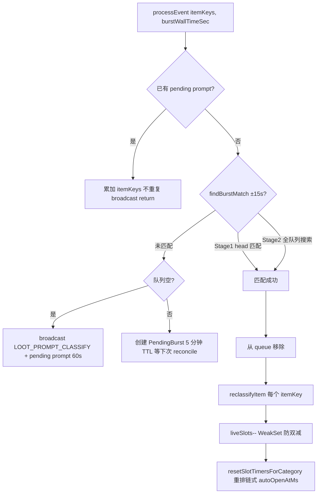

1. 若已有 pending prompt → 累加 itemKeys（不重复 broadcast），return。
2. `burstMs = burstWallTimeSec * 1000`。
3. `match = findBurstMatch(burstMs)`：
   - Stage 1：head-first match — 全局 head 的 `autoOpenAtMs` 在 ±15s（`BURST_MATCH_GRACE_MS`）内 → match。
   - Stage 2：全队列搜索最近的 ±15s 内 item。
4. **匹配成功**：
   - 从 queue 移除该 item。
   - 对每个 itemKey 调用 `boxOpenTracker.reclassifyItem(UNCLASSIFIED_BOX_KEY, itemKey, item.boxKey)`。
   - 实时槽位：`liveSlots[cat]--`（除非已在 WeakSet 中，避免 double-decrement）。
   - WeakSet.add(item)。
   - **校准同 category 剩余 items**：`resetSlotTimersForCategory(cat, burstMs + autoOpenSec*1000)` — 重排链式 autoOpenAtMs，避免累积误差。
5. **未匹配 + 队列空**：broadcast `LOOT_PROMPT_CLASSIFY`，创建 pending prompt（60s 超时）。
6. **未匹配 + 队列非空**：创建 PendingBurst（5 分钟 TTL），等下次 `reconcileWithChestSlots` 通过 save 槽位 delta 分类。

### 14.4 reconcileWithChestSlots(slots) — 每次 save 解析触发

#### 流程图

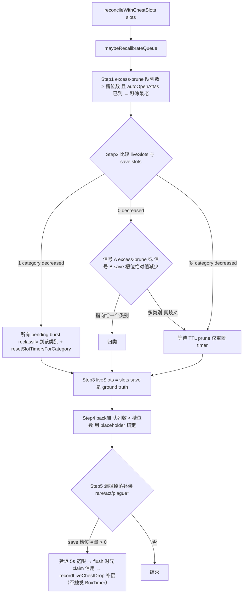

1. `maybeRecalibrateQueue()`。
2. **Step 1: excess-prune**：对每个 category，queue 数 > slot 数 → 从 **`autoOpenAtMs` 已到（<= `getEffectiveNow()`）** 的条目里移除最老的 `excess` 个（本应已开）。
   - **只剪"已到自动开启时刻"的箱子（2026-09-10 修复）**：`autoOpenAtMs` 仍在倒计时中的箱子**必定还在保管**，不可能已自动开启。此时 queue 数超过 save 槽位数只说明 **save 还没记录刚落下的 live 掉落**，而非有箱子被开。旧实现按 `autoOpenAtMs` 升序无条件剪掉最早的 `excess` 个——被剪的恰恰是**队首（真正的 head）**，于是「新增宝箱」时 head 被移除、其后的箱子被提升为新 head，**"下个开启"倒计时反而变大**（违反了串行队列"新箱入队尾、head 不动"的不变量）。手动提前开启由 `processEvent` 的未分类 burst 路径处理，不依赖本步。
   - **配套修复（同日）**：`ChestService.setLiveSlots(null)`（v1.2.2 live 槽位不可用时每帧回调）旧实现因 `unchanged` 判定要求 `slots != null` 而每帧（~25Hz）以**滞后的上一次 save** 触发本步，会把 fresh live 掉落立即剪掉；现 null→null 为 no-op，对账改由 save 解析驱动（见 5.7、13.5）。
3. **Step 2: classifyPendingBursts(slots, prevSlots, prunedByCategory)**：比较 `liveSlots`（pre-save 实时）与 save 的 slots：
   - **类别遍历为 6 类（2026-09-11 扩展）**：`common/rare/act` + `plagueCommon/plagueRare/plagueAct` 全部参与 decreased 检测、第二信号（excess-prune/save 绝对值减少）与 ambiguous 分支的 timer 重置——污染宝箱开箱产生的 pending burst 与普通宝箱走同一套分类规则。
   - 1 category decreased（无论 pending burst 数量）→ 把**所有** pending burst 的 items 都 reclassify 到该 category + `resetSlotTimersForCategory`（anchor = 最晚 burstMs + per-cat autoOpenSec）。**多 burst 不构成歧义**——开箱 reader 会把一次手动"开全部"按 live 帧/批次拆成多个 burst（每个帧 flush 一个），但既然只有单一类别槽位减少，这些 burst 必然全部属于该类别（2026-09-01 修复：原实现要求 pendingBursts 恰好为 1）。
   - 0 category decreased → 用两个**无竞态的第二信号**（save 派生）兜底，二者指向**恰一个**类别才归类（多类别点亮=真歧义→等待 TTL prune）：
     - **信号 A（excess-prune 计数）**：Step 1 中 `prunedByCategory[cat] > 0` 即"队列数 > 槽位数 **且存在已到自动开启时刻的条目**"，证明有宝箱被打开但未被 burst 消耗；
     - **信号 B（save 槽位绝对值减少）**：`prevSlots[cat] > slots[cat]`（上次 save vs 本次 save）。
       两者覆盖"堆积宝箱手动全开、autoOpenAtMs 早已过、1Hz tick 抢先把 liveSlots 减掉导致 delta 为 0"的场景（2026-09-02 修复：原来 delta=0 时无脑等待，burst 5 分钟 TTL prune 后物品滞留未分类）。
   - 多 category decreased（真正歧义）→ 不 reclassify，所有 category 用 earliestBurstMs + per-cat autoOpenSec 重置 timer。
4. **Step 3: liveSlots = {...slots}** — save 是 ground truth，覆盖实时调整。
5. **Step 4: backfill**：queue 数 < slot 数（live reader 漏掉或刚启动）→ 用 placeholder item 锚定到当前 `getEffectiveNow()`，每个获得完整 autoOpenSec 倒计时。
6. **Step 5: 漏掉掉落补偿（rare/act/plague\*，延迟宽限）**：backfill 期间，当 `prev = lastReconcileSlots != null` 且某 boss 类别（rare/act/plagueCommon/plagueRare/plagueAct）的 save 槽位 `increase = slots[cat] - prev[cat] > 0`，则该增量代表 live reader 从未 surfacing 的真实掉落（实时 `readRuntimeChestLog`/fastpoll/burst 均可能漏掉）。把 `count = min(increase, deficit)` 存为待定恢复、延迟 `RECOVERY_GRACE_MS=5s` 后由 `flushDueDropRecoveries` 先 claim 信用再对差额补偿（`recordLiveChestDrop` 补偿，不触发 BoxTimer）：
   - **打开反推获得（auto-open 兜底，2026-09-11）**：Step5 依赖"存档未开槽位净增"，对"掉落即被自动打开"（save 净变 0）失效。补一条不依赖槽位的来源——**打开事件**。`classifyAllPendingBursts` 把"被打开但未匹配到活获得记录"的 `pendingBursts` 归入某类别后，用守恒补记：若该类别最近 `OPEN_BACKFILL_WINDOW_SEC`(=120s) 内的获得记录数（`ChestDropTracker.dropCountWithin`）不足本次打开数，差额即被 live miss 且 save 补不到的"获得"，以 `"reconcile"` 来源补记（不污染 live 学分）。去重由近窗计数承担，避免把窗口内正常获得重复补记。
   - **去重护栏（live credit 模型，2026-09-10）**：`ChestDropTracker` 按来源区分 live/reconcile，每次 `recordLiveChestDrop(cat, wallTime, "live")` 压入一个**带时间戳的信用**（`liveCreditsByCategory[cat]`）。对账补偿用 `coveredLive = chestDropTracker.claimLiveDropCredits(cat, count)` —— 用 save 的槽位增量去**消耗**这些信用：被消耗的部分是 live 已记录过的掉落，不重复补偿。
     - **为何不能用"每周期 delta/mark"**：save 槽位增量相对 live 检测存在**滞后**（存档写入时机晚于内存中的掉落事件），一个真实的 live 掉落可能要跨若干次 save 对账才能在槽位增量里体现。"每周期标记"会在增量出现前被中间的对账清零 → 仍会重复补偿（即上一版修复失效的原因）。（注：2026-09-10 起 `setLiveSlots(null)` 不再每帧触发 reconcile，对账改由 save 解析驱动，但跨 save 周期的滞后依然存在，故时间上界信用仍必要。）
     - **延迟补偿宽限（2 倍会话速率修复，2026-09-12）**：live credit 模型只覆盖「live 先记、对账后到」的顺序，**反向顺序仍会双计**——对账可能在 live GetBox burst 尚未 flush/记录时就观察到槽位增量（旧版本：`onLiveChestSlots` 5Hz 实时槽位对账与 burst 缓冲发生在同一 live 帧，burst 需 ~0.5–1s 静默后才 flush；v1.2.2：掉落即存档的 save 解析可落在同样的 burst-flush 延迟窗内）。此刻信用尚未压入 → 旧代码立即补偿记一条，随后 live burst flush 再记一条，而其后压入的信用永远等不到增量来消耗 → **同一颗宝箱双计，会话速率读数 ≈ 真实的 2 倍**。修复：Step 5 不再同步补偿，而是把 `count = min(increase, deficit)` 作为**待定恢复（pendingDropRecoveries）**延迟 `RECOVERY_GRACE_MS=5s`，由 1Hz tick / 下次对账在宽限期满时 `flushDueDropRecoveries` 统一**先 claim 信用再决定补偿**：宽限内 live burst 记录了该掉落 → 其信用覆盖增量 → 不补偿；live 真漏检 → 无信用 → 照旧补偿（仅晚 5s，属历史回填、非时间敏感）。补偿仍以 `suppressingHandleChestDrop` 抑制 `onDrop → handleChestDrop` 重复入队，且不触发 BoxTimer。**会话纪元护栏**：待定恢复携带 stash 时的 `ChestDropTracker.getSessionEpoch()`（`reset`/`applySnapshot` 递增），flush 时纪元不一致即丢弃，防止用户在宽限期内重置会话后把旧掉落补进新会话。`setEnabled(false)` 同步清空待定恢复。
     - **信用为何能命中**：真实重复场景是——① live 检测到 rare 掉落（历史+1、信用+1）并经 `handleChestDrop` 入队（queue=1），此时存档尚未写入；② 一次对账读到仍为旧值 0 的 save，Step1 看到 `queue(1) > slots(0)` → **把排队的 rare 提前 excess-prune 掉**（queue=0）；③ 存档写入 rare=1 → 对账 `increase=1, deficit=1` → 旧代码补记一条、用**对账时刻**盖戳（比真实掉落晚数秒，即用户看到的「单次掉落出现两条、间隔 <1 分钟」）。信用跨这些对账存活，在 ③ 覆盖增量 → 不再补记。
     - 信用有时间上限 `LIVE_CREDIT_TTL_SEC = 180s`（`claimLiveDropCredits` 先丢弃过期信用），避免陈旧信用永久压制真正的漏检补偿。
   - 对 `toRecover` 个调 `chestDropTracker.recordLiveChestDrop(cat, nowSec(), "reconcile")` 写入掉落历史 → 修复「掉落统计缺 +1」（`"reconcile"` 不压信用）。用 `suppressingHandleChestDrop` 标志让 `recordLiveChestDrop` 的 `onDrop → handleChestDrop` 入队被抑制，避免与 backfill 本身重复入队。
   - **不再触发 BoxTimer 倒计时**（2026-09-10 变更）：对账只补记掉落历史，不再调用已移除的 `onLiveStageBossDrop`。原因：live 路径（GetBox 日志）与 reconcile 路径（save 槽位增量）各自用自己的 stage 快照反查 boxId，当两条快照跨越等级边界（如 Torment 2-8=Lv80 / 2-9=Lv90 相邻）时，同一次掉落会解析出两个箱子并启动两个倒计时。改为由 **live GetBox 路径独占**倒计时触发（另加 `BoxTimerService` 内的 15s 同次掉落去重护栏兜底），单次掉落只会 arm 一个箱子。
   - **门控**：`prev != null` 排除 app 首次对账（前代既有宝箱不算掉落）；`min(missedLive, deficit)` 确保不超过 save 实际增量（掉落+开启同窗口抵消的案例因 save 数据固有歧义而不记录，比 live 漏检少见得多）。补偿类别为 rare/act/plague*（2026-09-11 扩展）：`plague*`的 save 槽位增量同 rare/act 一样代表真实掉落（live GetBox 路径与 save 路径 stage 快照各自独立，尾部仍旧 same），且`plague\*` 也有 live credit 去重；不记录 common（common live 检测可靠且掉落频繁）。
   - **live 瘟疫地图判定（2026-09-11 新增）**：GetBox 日志只含 `monsterType`（0/1/2 → common/rare/act），无法直接区分瘟疫/普通箱子。但**瘟疫箱子只在瘟疫地图掉落**（`data/stage_boxes.json`：瘟疫箱 id 前缀 915/925/935 的 `tracker.dropStageKeys`/`idealStageKey` 全部落在 act 21+ 的瘟疫之地，普通箱最高到 act 20）。`ChestDropTracker.isPlagueStage(stageKey)` 惰性聚合瘟疫箱掉落关卡成 Set，`resolveLiveDropCategory(stageKey, base)` 据此把 live 掉落的 base category 升级为 `plague*`（TrackingService 调用）。live 升出的 `plague*` 掉落同样压 `plague*` credit，供 Step 5 对账去重。
   - 新日志：`reconcile: deferred N {cat} drop recovery(s) from save slot increase (prev→slots, deficit D) by 5000ms grace`（stash 时）；宽限期满 flush 时：`reconcile: recorded N missed {cat} drop(s) (deferred save slot increase, grace 5000ms, covered-live C)`；信用生效时：`reconcile: {cat} discount C already-live drop(s) (deferred recovery) to avoid duplicate history`。

### 14.5 tick()（1Hz，由 TrackingService.tickTimer 调用）

1. `updateInventoryPauseState()`：
   - `isFull = inv.used >= inv.capacity`。
   - full → not-full 转换：记录 `inventoryFullSinceMs`，不操作 queue。
   - not-full → full 转换：`shiftQueueTimes(pausedMs)` 把所有 non-slot-decremented item 的 `autoOpenAtMs` 和 `expiresAtMs` 向前推 pausedMs。
2. **inventory full 时**：跳过 slot decrement 和 prune（timer 暂停）。仅处理 pending prompt timeout（wall-clock）和 pendingBursts TTL prune。
3. **正常路径**：
   - 遍历 queue prefix，对每个 `autoOpenAtMs <= now` 且未在 WeakSet 中的 item：`liveSlots[cat]--` + WeakSet.add。
   - `queue = pruneExpired(queue, now)` — 移除 `expiresAtMs <= now`。
   - pending prompt 60s 超时 → 置 null。
   - `pruneExpiredPendingBursts(now)` — 5 分钟 TTL。

### 14.6 maybeRecalibrateQueue（漂移检测）

- `current = chestService.getAutoOpenSeconds()`；null → return。
- 与 `lastAutoOpenSeconds` 比较每类：abs delta < 1s 或相对 < 1% → 视为 below threshold。
- 全部 below threshold → return。
- 否则 `recomputeQueueAutoOpenAtMs(current)`：按 droppedAtMs 升序，per-category 链式重算 autoOpenAtMs；重置 WeakSet。

### 14.7 getQueueSnapshot()

返回 `AutoClassifyStatePayload`：`{ enabled, totalQueued, byCategory: [{category, count, nextAutoOpenInMs, lastAutoOpenInMs}], items, liveSlots, paused: inventoryFullSinceMs != null, pendingBurstsCount }`。renderer 在 auto-classify enabled 时 1Hz 调用。

---

## 15. Notification 业务流程（`app/src/main/services/NotificationService.ts`）

### 流程图

五类触发源按 kind 路由：声音类 / 系统通知类 / 仅系统通知类。

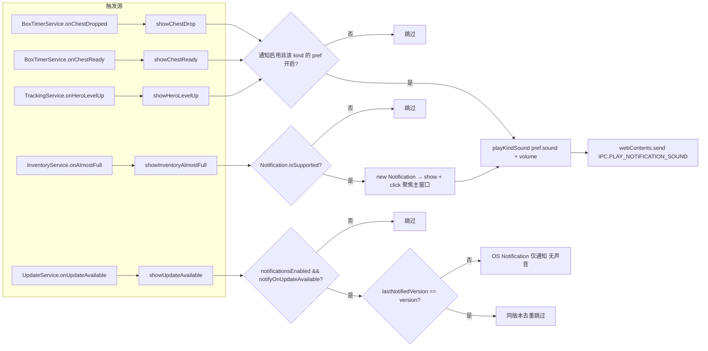

### 15.1 触发源

| 触发源                      | 方法                               | 触发条件                                   |
| --------------------------- | ---------------------------------- | ------------------------------------------ |
| `boxTimers.onChestDropped`  | `showChestDrop(payload)`           | live 检测 rare 掉落或 UI 手动 mark         |
| `boxTimers.onChestReady`    | `showChestReady(payload)`          | buildState 检测 `prev=true → active=false` |
| `tracking.onHeroLevelUp`    | `showHeroLevelUp(events)`          | save 解析时 detectHeroLevelUps 检测到升级  |
| `inventory.onAlmostFull`    | `showInventoryAlmostFull(payload)` | 库存 used/capacity 超过阈值                |
| `updates.onUpdateAvailable` | `showUpdateAvailable(version)`     | GitHub release 检测到新版本                |

### 15.2 路由到 renderer

- **chestDrop / chestReady / heroLevelUp**：仅播放声音。`playKindSound(kind)` → 检查 `notificationsEnabled && notificationPrefs[kind].enabled` → `playSound(pref.sound, volumePercent)` → `sendNotificationSound({ soundId, volumePercent })`。
- **inventoryAlmostFull**：OS Notification + 声音。先 `Notification.isSupported()` 检查，构造 `new Notification({ title, body })`，`notification.on("click", focusMainWindow)`，`notification.show()`；再 `playSound(pref.sound, volume)`。
- **updateAvailable**：仅 OS Notification（无声音）。`notificationsEnabled && notifyOnUpdateAvailable` 检查；`lastNotifiedVersion === version` 去重（同版本只通知一次）。

### 15.3 sendNotificationSound

`sendNotificationSound(payload)`（`app/src/main/services/broadcast.ts`）：从所有 live windows 中找第一个非辅助 renderer（非 #overlay / #box-tracker），通常是主窗口；若无主窗口则用第一个 live window。`webContents.send(IPC.PLAY_NOTIFICATION_SOUND, payload)`。

### 15.4 notificationCatalog（`app/shared/notificationCatalog.ts`）

- 16 种声音：`soft-chime / double-tap / wood-tick / whisper-ping / bright-pop / clear-bell / soft-ding / quick-rise / game-blip / arcade-tone / crystal-chime / happy-ping / magic-spark / level-triumph / treasure-fanfare / gentle-alert`。
- 4 种 kind：`chestDrop / chestReady / heroLevelUp / inventoryAlmostFull`。
- `DEFAULT_NOTIFICATION_PREFS`：chestDrop=treasure-fanfare、chestReady=soft-chime、heroLevelUp=level-triumph、inventoryAlmostFull=happy-ping（全部 enabled=true）。
- `migrateNotificationPrefs`：兼容旧 `chestSoundVariant` 字段迁移到 `notificationPrefs.chestReady`。

---

## 16. Update 业务流程（`app/src/main/services/UpdateService.ts`）

### 流程图

状态机：checking → available → downloading → ready → error；quitAndInstall 需 phase=ready。

```mermaid
%% TBH flow diagram
flowchart LR
  Start[UpdateService.start 幂等] --> Packaged{app.isPackaged?}
  Packaged -- 否 --> Disabled[phase=disabled]
  Packaged -- 是 --> Setup[autoDownload=false autoInstallOnAppQuit=false]
  Setup --> Events[注册 6 个 autoUpdater 事件]
  Events --> Timer[setTimeout 30s 后台检查]
  Timer --> Check[checkForUpdates]
  Check --> InFlight{in-flight 或 downloading 或 ready?}
  InFlight -- 是 --> RetStatus[返回当前 status]
  InFlight -- 否 --> UpCheck[autoUpdater.checkForUpdates]
  UpCheck -- checking-for-update --> PhaseCheck[phase=checking]
  UpCheck -- update-available --> PhaseAvail[phase=available + onUpdateAvailable 版本]
  UpCheck -- update-not-available --> PhaseNA[phase=not-available]
  UpCheck -- error --> Friendly[friendlyUpdateError 映射网络/GitHub/404 错误]
  Friendly --> PhaseErr[phase=error]
  PhaseAvail --> Download[downloadUpdate 需 phase=available]
  Download -- download-progress --> PhaseDown[phase=downloading + percent]
  PhaseDown -- update-downloaded --> PhaseReady[phase=ready]
  PhaseReady --> Quit[quitAndInstall 需 phase=ready → setAppQuitting + quitAndInstall]
  class Start,Setup,Events,Timer,Check,UpCheck,PhaseCheck,PhaseAvail,PhaseNA,PhaseErr,PhaseDown,PhaseReady,Quit,Friendly,RetStatus data
  class Packaged,InFlight dec
```

### 16.1 启动

`start()`：幂等。`!app.isPackaged` → 设 phase="disabled" + log + return。

packaged 模式：

- `autoUpdater.autoDownload = false`、`autoUpdater.autoInstallOnAppQuit = false`。
- 注册 6 个事件：`checking-for-update` → phase="checking"；`update-available` → phase="available" + `onUpdateAvailable?.(info.version)`；`update-not-available` → phase="not-available"；`download-progress` → phase="downloading" + percent；`update-downloaded` → phase="ready"；`error` → phase="error" + friendlyUpdateError。
- `backgroundTimer = setTimeout(() => checkForUpdates(), 30000)` — 30s 后台检查。

### 16.2 checkForUpdates / downloadUpdate / quitAndInstall

- `checkForUpdates()`：检查 in-flight / phase=="downloading" / phase=="ready" → 直接返回当前 status；否则 `checkInFlight=true` + `autoUpdater.checkForUpdates()`。catch → friendlyUpdateError + phase="error"。
- `downloadUpdate()`：必须 phase=="available"；`downloadInFlight=true` + `autoUpdater.downloadUpdate()`。
- `quitAndInstall()`：必须 phase=="ready"；`setAppQuitting(true)` + `autoUpdater.quitAndInstall()`。

### 16.3 friendlyUpdateError

把网络错误（net::/enotfound/econnrefused 等）映射为"Could not reach GitHub..."；403/429 → "GitHub rate limit"；404 → "No release found"；其它原样返回。

### 16.4 GitHub release 检查

`electron-updater` 默认从 GitHub releases 拉取 `latest.yml`。配置在 `package.json` 的 `build.publish`（GitHub repo）。本项目无自定义 provider，依赖 electron-updater 默认行为。

---

## 17. Pet 业务流程（`app/src/main/services/PetService.ts` + `app/src/core/pets/*`）

### 流程图

由 save 解析的 `parseInventorySnapshot` 回调触发，解析三路输入后构建 PetState 并广播。

```mermaid
%% TBH flow diagram
flowchart TD
  OnSave[PetService.onSave text, mtime 由 parseInventorySnapshot 调用] --> ParseRows[parsePetSaveData petKey + unlocked]
  OnSave --> ParseKills[parseMonsterKillCounts monster → killCount]
  OnSave --> ParseArranged[parseArrangedPetKey 当前装备宠物 key]
  ParseRows --> Build[buildPetState catalog + saveRows + killCounts + arrangedPetKey]
  ParseKills --> Build
  ParseArranged --> Build
  Build --> Resolve[resolvePetRow 区分 dlc / kills 解锁类型]
  Resolve --> Bonus[aggregatePassiveBonuses 聚合被动加成]
  Resolve --> Farm[expectedKillsPerClear / runsToUnlock / formatRunsMessage]
  Bonus --> Bcast[广播 IPC.PETS]
  Farm --> Bcast
  class OnSave,ParseRows,ParseKills,ParseArranged,Build,Resolve,Bonus,Farm,Bcast data
```

### 17.1 onSave 触发

`pets.onSave(text, mtime)` 由 TrackingService 的 `parseInventorySnapshot` 回调调用（与 chests.onSave 同时）。

### 17.2 解析流程

1. `saveRows = parsePetSaveData(text)` — 从 save 文本解析 `petSaveDatas` 列表，提取 `petKey + unlocked`。
2. `killCounts = parseMonsterKillCounts(text)` — 从 `monsterKillSaveDatas` 解析 monster key → kill count 映射。
3. `arrangedPetKey = parseArrangedPetKey(text)` — 当前装备的宠物 key。
4. `lastPets = buildPetState(catalog, saveRows, killCounts, arrangedPetKey, mtime)`：
   - 对每个 catalog entry：`monsterKey = entry.unlockMonsterKey ?? 0`；`killCount = monsterKey > 0 ? (killCounts.get(monsterKey) ?? 0) : 0`；`resolvePetRow(entry, saveByKey.get(petKey), killCount, killTarget, arrangedPetKey, dlcLabel)`。
   - 返回 `PetState: { pets: PetRow[], saveMtime, arrangedPetKey, unlockKillCount, dlcLabel }`。
5. `broadcast(IPC.PETS, lastPets)`。

### 17.3 PetRow 字段

- `dlc` 类：`{ petKey, name, unlocked, equipped, unlockKind: "dlc", bonuses, dlcLabel }`。
- `kills` 类：`{ petKey, name, unlocked, equipped, unlockKind: "kills", killCount, killTarget, killsRemaining, progressPct, bonuses, appearsOnStages, bestStages }`。
  - `bestStages`：每个 `bestFarmStage` 计算 `expectedKillsPerClear(monstersPerClear, spawnPercent)`、`runsToUnlock(remaining, expected)`、`formatRunsMessage(runs)`，未解锁时显示 runsMessage。

### 17.4 pet bonuses / farm 计算（`app/src/core/pets/bonuses.ts` / `farm.ts`）

- `aggregatePassiveBonuses`：聚合所有已解锁宠物的被动加成。
- `expectedKillsPerClear(monstersPerClear, spawnPercent)` = `monstersPerClear * spawnPercent / 100`。
- `runsToUnlock(remaining, expected)` = `ceil(remaining / expected)`。
- `formatRunsMessage(runs, false)`：格式化为 "X runs" 文本。

---

## 18. 跨服务数据流总览

下图聚焦**服务间关联**：方框为共享服务（label 即服务名），箭头为服务间数据流/事件流；动作级细节见第 0 章"数据流总览"及各章节流程图。本图也是交互式可视化页"全流程关联图"的数据基础。

```mermaid
%% TBH flow diagram
flowchart LR
  SaveFile([SaveFile_Live.es3]) --> SaveWatcher[SaveWatcher]
  LiveGame([TaskBarHero.exe]) --> LiveMemoryWorker[LiveMemoryWorker]
  SaveWatcher --> TrackingService[TrackingService]
  LiveMemoryWorker --> TrackingService
  TrackingService --> XpTracker[XpTracker]
  TrackingService --> DpsTracker[DpsTracker]
  TrackingService --> ChestDropTracker[ChestDropTracker]
  ChestDropTracker --> AutoClassifyService[AutoClassifyService]
  TrackingService --> BoxOpenTracker[BoxOpenTracker]
  BoxOpenTracker --> AutoClassifyService
  TrackingService --> BoxTimerService[BoxTimerService]
  BoxTimerService --> NotificationService[NotificationService]
  TrackingService --> StageRunService[StageRunService]
  TrackingService --> SessionStateService[SessionStateService]
  TrackingService --> InventoryService[InventoryService]
  InventoryService --> InventoryWorker[InventoryWorker]
  TrackingService --> ChestService[ChestService]
  ChestService --> AutoClassifyService
  TrackingService --> PetService[PetService]
  TrackingService --> NotificationService
  AutoClassifyService --> NotificationService
  SessionStateService --> Persist[写 session_state.json]
  UpdateService[UpdateService] --> NotificationService
  CatalogRefreshService[CatalogRefreshService] --> TrackingService
  CatalogRefreshService --> NotificationService
  class SaveWatcher,TrackingService,XpTracker,DpsTracker,ChestDropTracker,BoxOpenTracker,BoxTimerService,StageRunService,SessionStateService,InventoryService,InventoryWorker,ChestService,AutoClassifyService,PetService,NotificationService,UpdateService,CatalogRefreshService,LiveMemoryWorker svc
  class SaveFile,LiveGame ext
  class Persist data
```

---

## 19. 关键错误处理路径汇总

| 场景                                               | 行为                                                                                                                  |
| -------------------------------------------------- | --------------------------------------------------------------------------------------------------------------------- |
| Save 文件不存在                                    | `SaveReadError` → SaveWatcher `onError` → `lastError` 显示在 stats.status                                             |
| mid-write sharing violation                        | `readBytesShared` 4 次重试 50ms；AES 块大小不符 → `Es3Error` → 不前进 mtime → 下次 poll 重试                          |
| 错误密码                                           | `Es3Error(WRONG_PASSWORD)` → 持续失败需要用户更新 `es3Password` 配置                                                  |
| parseInventory 抛错                                | `log.error`，不影响 save snapshot 推送                                                                                |
| Session restore 文件 corrupt                       | `isPersistedSessionState` 失败 → 忽略，返回默认 ui                                                                    |
| Session restore mtime 不连续                       | discard + deleteFile                                                                                                  |
| Session restore 数值不合理                         | discard + deleteFile（防 live/save baseline 混合污染）                                                                |
| applySnapshot 抛错（schema drift）                 | discard + deleteFile                                                                                                  |
| Live memory worker 崩溃                            | `lastLiveFrame` 超过 5s 未更新 → TrackingService tickTimer 清空 `lastLiveFrame`/`lastLiveStage`，stats 回退到 save 值 |
| Live hero exp 异常（>1e12）                        | `plausibleHeroRuntimeExp` 拒绝                                                                                        |
| Live 单 tick gain 异常（>1e7）                     | `plausibleLiveHeroGain` 拒绝                                                                                          |
| Live level-drop（dirty read）                      | 跳过该 hero 不计数                                                                                                    |
| Live same-level dip                                | 跳过计数但 refreshRolling                                                                                             |
| LiveMemory worker exit (code 非 0)                 | 构造 `"live reader stopped unexpectedly"` status 广播；不自动重启                                                     |
| inventoryWorker fork 失败                          | log.error，`ready=false`，走 sync fallback                                                                            |
| inventoryWorker resolve 超时（5s）                 | reject pending promise，host 走 sync fallback                                                                         |
| inventoryWorker crash                              | `handleExit` reject 所有 pending，`ready=false`，host 后续走 sync fallback                                            |
| Steam 429                                          | `parseRetryAfterMs` 取 Retry-After，与指数退避取较大值；连续 3 次熔断                                                 |
| Steam 网络错误                                     | cache 有该 hash 的 market data → 刷新时间戳使其 fresh；否则 `counters.failed++`                                       |
| nameid 解析失败                                    | 跳过 buyOrder，不影响 sell price 写入                                                                                 |
| LookupPriceService fetch 失败                      | log warn，保留旧 snapshot                                                                                             |
| LookupPriceService 校验失败                        | log warn，保留旧 snapshot                                                                                             |
| LookupPricePolling cycle 中 429                    | `consecutiveRateLimits++`，达 3 中止本轮（`aborted: true`）                                                           |
| CatalogRefresh asset 文件缺失                      | 抛错，`lastError` 记录，broadcast stale 状态，返回 `{ ok: false }`                                                    |
| CatalogRefresh locale 提取失败                     | `extractLocales` 返回 null 时 per-locale 诊断，不阻塞 gamedata 写入                                                   |
| proxy 创建失败                                     | log warn，`cachedDispatcher = {}`（直连）                                                                             |
| priceCache 文件损坏                                | `tryLoadCache` catch，返回空 cache                                                                                    |
| AutoClassify queue item 过期                       | pruneExpired 移除                                                                                                     |
| AutoClassify pending burst 5 分钟无 save reconcile | TTL prune（items 留在 unclassified）                                                                                  |
| AutoClassify ambiguous classification              | 不 reclassify，全部 reset timer                                                                                       |
| BoxTimer persist 失败                              | `writeFileSync` 失败 → 仅 warn，不破坏 in-memory state + broadcast；下次 tick 重试                                    |
| Update 检查网络错误                                | friendlyUpdateError 显示友好提示                                                                                      |
| Update GitHub rate limit                           | 提示用户等待                                                                                                          |
| Update 404                                         | "No release found"                                                                                                    |
| Update 开发模式                                    | phase="disabled"，所有操作 noop                                                                                       |

---

## 20. 关键文件路径速查

| 模块                      | 文件                                                                                                                                                                                   |
| ------------------------- | -------------------------------------------------------------------------------------------------------------------------------------------------------------------------------------- |
| 入口                      | `app/src/main/index.ts`                                                                                                                                                                |
| appState                  | `app/src/main/app/appState.ts`                                                                                                                                                         |
| 单实例                    | `app/src/main/app/singleInstance.ts`                                                                                                                                                   |
| lifecycle                 | `app/src/main/app/lifecycle.ts`                                                                                                                                                        |
| config                    | `app/src/main/config.ts`                                                                                                                                                               |
| configPatch               | `app/src/main/ipc/configPatch.ts`                                                                                                                                                      |
| registerIpc               | `app/src/main/ipc/registerIpc.ts`                                                                                                                                                      |
| broadcast                 | `app/src/main/services/broadcast.ts`                                                                                                                                                   |
| SaveWatcher               | `app/src/main/saveWatcher.ts`                                                                                                                                                          |
| saveFile I/O              | `app/src/main/io/saveFile.ts`                                                                                                                                                          |
| ES3 解密                  | `app/src/core/es3.ts`                                                                                                                                                                  |
| save snapshot 解析        | `app/src/core/save/snapshot.ts`                                                                                                                                                        |
| TrackingService           | `app/src/main/services/TrackingService.ts`                                                                                                                                             |
| stats 构建                | `app/src/main/stats.ts`                                                                                                                                                                |
| blend 纯函数              | `app/src/core/liveMemory/blend.ts`                                                                                                                                                     |
| tracker 核心              | `app/src/core/tracker.ts`                                                                                                                                                              |
| trackerLimits             | `app/src/core/trackerLimits.ts`                                                                                                                                                        |
| levelCurve                | `app/src/core/levelCurve.ts`                                                                                                                                                           |
| detectLevelUps            | `app/src/core/heroes/detectLevelUps.ts`                                                                                                                                                |
| SaveWatcher               | `app/src/main/saveWatcher.ts`                                                                                                                                                          |
| LiveMemoryService         | `app/src/main/services/LiveMemoryService.ts`                                                                                                                                           |
| liveMemoryWorker          | `app/src/main/services/liveMemoryWorker.ts`                                                                                                                                            |
| LiveMemoryReader          | `app/src/main/liveMemory/liveReader.ts`                                                                                                                                                |
| offsetExtractor           | `app/src/main/liveMemory/offsetExtractor.ts`                                                                                                                                           |
| offsetHealing             | `app/src/main/liveMemory/offsetHealing.ts`                                                                                                                                             |
| offsetCache               | `app/src/main/liveMemory/offsetCache.ts`                                                                                                                                               |
| WinProcess + FFI          | `app/src/main/liveMemory/winProcess.ts`                                                                                                                                                |
| runtime 字段读取          | `app/src/core/liveMemory/runtime.ts`                                                                                                                                                   |
| chestSlots 读取           | `app/src/core/liveMemory/chestSlots.ts`                                                                                                                                                |
| il2cppScanner             | `app/src/core/liveMemory/il2cppScanner.ts` — Rev 13 `findBoxDataFields` 结构化派生 boxTypes/boxQuantity                                                                                |
| offsets 类型 + 内置表     | `app/src/core/liveMemory/offsets.ts` — `LiveOffsets` 接口、`offsetsForVersion` / `offsetsForVersionMeta`、`_criticalRvasValidated` / `_fallbackFromVersion` / `_extractorRev` 字段定义 |
| offsetCompleteness        | `app/src/core/liveMemory/offsetCompleteness.ts` — `isOffsetTableComplete` / `mergeOffsets` / `ENRICHMENT_FIELDS`（Rev 13 加入 `boxData.boxTypes` / `boxData.boxQuantity`）             |
| InventoryService          | `app/src/main/services/InventoryService.ts`                                                                                                                                            |
| inventory parse           | `app/src/core/inventory/parse.ts`                                                                                                                                                      |
| inventory composition     | `app/src/core/inventory/composition.ts`                                                                                                                                                |
| inventory buyOrder        | `app/src/core/inventory/buyOrder.ts`                                                                                                                                                   |
| inventory predictFill     | `app/src/core/inventory/predictFillTime.ts`                                                                                                                                            |
| inventoryWorker           | `app/src/main/services/inventoryWorker.ts` / `inventoryWorkerEntry.ts` / `inventoryWorkerProtocol.ts`                                                                                  |
| priceCache                | `app/src/main/services/priceCache.ts`                                                                                                                                                  |
| steamMarketProvider       | `app/src/main/services/steamMarketProvider.ts`                                                                                                                                         |
| steamPriceApi             | `app/src/main/services/steamPriceApi.ts`                                                                                                                                               |
| steamBuyOrderApi          | `app/src/main/services/steamBuyOrderApi.ts`                                                                                                                                            |
| steamItemNameId           | `app/src/main/services/steamItemNameId.ts`                                                                                                                                             |
| proxyResolver             | `app/src/main/services/proxyResolver.ts`                                                                                                                                               |
| retryAfter                | `app/src/main/services/retryAfter.ts`                                                                                                                                                  |
| marketName                | `app/src/core/marketName.ts`                                                                                                                                                           |
| steamMarketFee            | `app/src/core/steamMarketFee.ts` / `steamMarketFeeBundled.ts`                                                                                                                          |
| steamPrice 表             | `app/src/core/steamPrice.ts`                                                                                                                                                           |
| LookupService             | `app/src/main/services/LookupService.ts`                                                                                                                                               |
| LookupPriceService        | `app/src/main/services/LookupPriceService.ts`                                                                                                                                          |
| LookupPricePollingService | `app/src/main/services/LookupPricePollingService.ts`                                                                                                                                   |
| lookup core               | `app/src/core/lookup/*.ts`                                                                                                                                                             |
| lookupPrice core          | `app/src/core/lookupPrice/*.ts`                                                                                                                                                        |
| CatalogRefreshService     | `app/src/main/catalogRefreshService.ts`                                                                                                                                                |
| catalogExtractor          | `app/src/core/unityAssets/catalogExtractor.ts`                                                                                                                                         |
| localeExtractor           | `app/src/core/unityAssets/localeExtractor.ts`                                                                                                                                          |
| SessionStateService       | `app/src/main/services/SessionStateService.ts`                                                                                                                                         |
| sessionState core         | `app/src/core/sessionState.ts`                                                                                                                                                         |
| BoxTimerService           | `app/src/main/services/BoxTimerService.ts`                                                                                                                                             |
| stageBoxTracker           | `app/src/core/stageBoxTracker.ts`                                                                                                                                                      |
| boxTrackerSort            | `app/src/core/boxTrackerSort.ts`                                                                                                                                                       |
| boxTrackerWindow          | `app/src/main/windows/boxTrackerWindow.ts`                                                                                                                                             |
| StageRunService           | `app/src/main/services/StageRunService.ts`                                                                                                                                             |
| stageRunTracker           | `app/src/core/stageRunTracker.ts`                                                                                                                                                      |
| ChestService              | `app/src/main/services/ChestService.ts`                                                                                                                                                |
| boxes resolve             | `app/src/core/boxes/resolve.ts`                                                                                                                                                        |
| boxes capacity            | `app/src/core/boxes/capacity.ts`                                                                                                                                                       |
| AutoClassifyService       | `app/src/main/services/AutoClassifyService.ts`                                                                                                                                         |
| AutoClassify 规约         | `docs/findings/auto-classify-business-logic.md`                                                                                                                                        |
| chestDropTracker          | `app/src/core/chestDropTracker.ts`                                                                                                                                                     |
| boxOpenTracker            | `app/src/core/boxOpenTracker.ts`                                                                                                                                                       |
| boxOpenBackfill           | `app/src/core/boxOpenBackfill.ts`                                                                                                                                                      |
| acquireLog（含色值→品质） | `app/src/core/acquireLog.ts`                                                                                                                                                           |
| recordLogFit              | `app/src/core/recordLogFit.ts`                                                                                                                                                         |
| recordLogTracker          | `app/src/core/recordLogTracker.ts`                                                                                                                                                     |
| RecordLogService          | `app/src/main/services/RecordLogService.ts`                                                                                                                                            |
| dpsTracker                | `app/src/core/liveMemory/dpsTracker.ts`                                                                                                                                                |
| NotificationService       | `app/src/main/services/NotificationService.ts`                                                                                                                                         |
| notificationCatalog       | `app/shared/notificationCatalog.ts`                                                                                                                                                    |
| UpdateService             | `app/src/main/services/UpdateService.ts`                                                                                                                                               |
| PetService                | `app/src/main/services/PetService.ts`                                                                                                                                                  |
| pets core                 | `app/src/core/pets/*.ts`                                                                                                                                                               |
| shared types              | `app/shared/types.ts`                                                                                                                                                                  |
| IPC 通道名                | `app/shared/ipc.ts`                                                                                                                                                                    |
| preload bridge            | `app/src/preload/index.ts`                                                                                                                                                             |
| TbhProvider               | `app/src/renderer/context/TbhProvider.tsx`                                                                                                                                             |

---

## 21. 文档维护约定

本文档与代码同步演进，遵循以下不变量：

1. **代码改动→文档同步**：任何针对项目业务逻辑的代码改动（新增/修改/删除流程、调整数据流、变更服务边界、修改关键不变量），改动落地后**必须同步更新本文档对应章节**。详见 `AGENTS.md` 的 Conventions 节。
2. **章节编号稳定**：0-20 的章节编号已分配，新增章节追加到 21+，不重排已有编号便于外部引用。
3. **路径基准**：所有文件路径以仓库根为基准（`app/src/...`），与 `AGENTS.md` 的 "Where things are" 节一致。
4. **不重复架构细节**：本文档关注"业务流程"（数据如何流动、服务如何协作）；架构分层、IPC 边界、文件结构由 [`ARCHITECTURE.md`](./ARCHITECTURE.md) 维护；save 解密细节由 [`SAVE_FORMAT.md`](./SAVE_FORMAT.md) 维护；agent 行为规范由 [`docs/agent/`](./agent/README.md) 维护。本文档只在必要处给出摘要链接。
5. **跨文档链接**：引用其他文档时使用相对路径（如 `[auto-classify-business-logic](./findings/auto-classify-business-logic.md)`），便于离线阅读。
6. **审计/调研文档独立**：专项审计报告（如 `docs/findings/*.md`）作为本文档的细化补充，不在本文档内重复其细节，仅给出摘要 + 链接。
7. **`docs/agent/generated/`** 是 code-derived 自动生成清单，不手编辑；本文档是 hand-curated 业务流程单一真理源，不与 generated 重复。
8. **mermaid 图随正文同步**：各章节的 ` ```mermaid ` 流程图与正文是同一流程的两种呈现，业务改动落地时必须**同步更新对应章节的图**（含节点、流向、分支），不允许只改文字。
9. **共享服务命名契约**：跨图引用共享服务时，节点 label 必须**以 `docs/agent/scripts/build-flow-viz.mjs` 顶部 `SVC_NAMES` 注册表中的服务名开头**（如 `TrackingService.onSnapshot`），以便可视化工具据此聚合"服务参与的流程"与"跨服务关联"。**修改注册表需在同 PR 内同步所有相关图的 label，并重新生成 `docs/flow-viz/flow-viz-data.js`**（`node docs/agent/scripts/build-flow-viz.mjs`）。

---

## 22. 历史背景（简要）

- 项目最初是 Python 原型 `tbh_xp/`，仅做 ES3 解密 + XP/hour 显示。
- TS core 达到 parity 后 Python 原型已删除（见 [`docs/DECISIONS.md`](./DECISIONS.md) 的 ADR 记录）。
- Live Memory 功能于 v1.00.x 后期加入，引入 utilityProcess worker + FFI 进程附加架构。
- AutoClassify 串行队列模型于 2026-07 重构为 per-category shared timer + 漂移检测 + WeakSet slot 计数（见 `project_memory.md` 的 Auto-classify 条目）。
- CatalogRefresh 于 2026-07 加入，从游戏 Unity bundle 直接提取 catalog + locale，替代手动维护 `data/gamedata.json`。
- LookupPricePollingService 于 2026-07 加入，让用户本地刷新 watched/owned 物品价格，弥补 CI 6 小时快照的滞后。后于 2026-08 收敛为**图鉴页仅轮询星标（watched）物品**（阈值/拥有集合不再参与图鉴轮询），并在交易页新增「刷新历史价格」按钮（`selectHistoryRefreshTargets`）强制拉取星标 ∪ 快照价格达标物品的 pricehistory。2026-08 中旬移除自动周期的 6h 固定冷却（`POLLING_MIN_REFRESH_MS` + `lookup_polling_cache.json` 持久化），让 `intervalMinutes` 设置严格生效（见 7.3 定时调度）。

## 23. 统一记录日志（Record Log）业务流程

**动机（2026-09 更新）**：记录页从"三类桶事件的统一聚合"演进为**游戏内「获得记录」界面的完全复刻**——数据只来自 `LogManager@0x20` 会话级环形区（游戏自带"获得记录"时间线），不再掺入由掉落/开箱/通关事件桶合成的记录。桶读取（GetBox/BoxOpenLog/StageClearLog）仍各自服务既有聚合（chestDrops/boxOpens/stageRuns/Loot），但**不再进入 recordLog**。`record_log.json` 承担跨会话长期归档。

**数据源核查结论**：磁盘上无任何持久化的掉落/开箱/通关记录文件（存档 `PlayerSaveData` 无 record 字段、`Player.log` 仅异常栈回溯、游戏 Data 目录无日志文件），"游戏自带记录"本体即内存 `LogManager`。因此记录页 = 实时读取"获得记录"环形区并归档。

### 23.1 数据流

```
游戏进程 LogManager@0x20（获得记录环形区：会话级、容量 ~2000、单调 total 计数）
  → worker 独立"获得记录"通道（~10ms，不经过 snapshot / read() 帧）
      ├─ 初次全量：attach 后首次成功读取拉取环形区最新窗口（total-2000 → total，initial=true）
      ├─ 定期增量：从 acquirePin.total（读取端自己的位置）向前读，**不再以环形区计数器为锚**
      └─ 陈旧槽位守卫：命中「同槽指纹未变 / 游戏内时间戳回退」→ 停在真实写入位置、pin 不推进（下一轮重试）
      → post({type:"acquire", entries, initial}) → LiveMemoryService → TrackingService.ingestAcquireBatch(entries)
          └─ 唯一喂入口：feed("acquire", now, {acquireRaw, acquireName, acquireCount, acquireColor, acquireTime})
      ↘ RecordLogTracker（core，递增 seq + 容量裁剪）
          → RecordLogService.schedulePersist() 防抖 ~2s
          → 写 userData/record_log.json  {nextSeq, entries}
  → buildStats 输出 Stats.recordLog（最新窗口 200 条 + total + byKind）
  → onStats(IPC.STATS) → StatsContext → RecordLog tab（倒序、复刻游戏「获得记录」界面）
```

> 注：`获得记录` 由 worker 的**独立高频轮询**（`fastAcquirePollTimer` → `pollAcquireTailFast`，~10ms）直接 post 给 main，**不经过 snapshot / `read()` 帧**——不受 stage 为 null、name-scan 等 `read()` 提前返回影响，不堆积、不丢失。获取模型为**初次全量 + 定期增量**：attach 后首次成功读取把环形区最新窗口作为 `initial` 批下发，之后每轮从 `acquirePin.total`（读取端位置）向前续读。**读取位置只由读取端自身推进，绝不以环形区计数器 `ring+0x1C` 为锚**——该计数器实测会跑到槽位实际写入之前（2026-09-15 现场：attach 全量窗口尾部仍留着上一圈的条目，时间戳落后 6~7 小时），以它为锚会让后续每次增量读到「同槽 = 上一圈」的旧条目，真正最新行永不投递（记录页恒定滞后一整圈）。UI 侧只渲染 `kind === "acquire"` 条目（兼容旧版 record_log.json 里遗留的 drop/open/clear 历史数据），每条显示游戏内时间 + 原始消息（`<color=#RRGGBB>` 保持品质色渲染），完全复刻游戏内「获得记录」界面。

### 23.2 关键文件

| 职责                 | 路径                                                                                                                                                                                                                  |
| -------------------- | --------------------------------------------------------------------------------------------------------------------------------------------------------------------------------------------------------------------- |
| 统一记录器（纯逻辑） | `app/src/core/recordLogTracker.ts`（`RecordLogTracker`：`feed/getStats/snapshot/applySnapshot`）                                                                                                                      |
| 持久化载体           | `app/src/main/services/RecordLogService.ts`（load-once / 防抖 persist / stop flush）                                                                                                                                  |
| 事件接入             | `app/src/main/services/TrackingService.ts`（`ingestAcquireBatch`——记录日志**唯一喂入口**；`resetRecordLog()`）                                                                                                        |
| "获得记录"环形区读取 | `app/src/core/liveMemory/runtime.ts`(`readRuntimeAcquireLogs`) + `app/src/main/liveMemory/liveReader.ts`(`pollAcquireTailFast` 初次全量+增量) + `app/src/main/liveMemory/worker.ts`(`fastAcquirePollTimer` 直接 post) |
| 富文本→结构化解析    | `app/src/core/acquireLog.ts`（`parseAcquireMessage`：提取名称/数量/品质色/种类）                                                                                                                                      |
| 统计输出             | `app/src/main/stats.ts`（`buildStats` 增参 `recordLogTracker`，输出 `Stats.recordLog`）                                                                                                                               |
| 文件注册/清除        | `app/src/main/services/appData.ts`（`RECORD_LOG_FILE`＝`record_log.json`；入 paths 清单与 `all-except-config`）                                                                                                       |
| UI                   | `app/src/renderer/tabs/RecordLog.tsx`（新 tab id = `log`）                                                                                                                                                            |

### 23.3 持久化与去重

- **文件**：`record_log.json`＝`{nextSeq, entries: RecordLogEntry[]}`。
- **写入**：事件批量后防抖 ~2s；`TrackingService.stop()` 强制 `flush()`。`<2s` 尾部窗在崩溃时丢失（可接受，不产生重复）。
- **容量**：内存与文件均裁剪至 10000 条（`capacity`），展示窗口取最新 200 条（`recentWindow`）。
- **去重**：唯一消费点是 `ingestAcquireBatch`，靠 `acquirePin.total`（**读取端自己的位置**）单调向前增量；`readRuntimeAcquireLogs` 只在条目被确认「本圈已写入」时才推进 pin（槽位指针/消息 mid-write、同槽指纹未变三类情况一律**停机重试**，不投递、不推进），因此环形区条目不重读、不重复投递；崩溃重启后 `nextSeq` 从磁盘续增、`applySnapshot` 按 `seq` 合并（重复 seq 被覆盖）→ 无重复。
- **断点续读（2026-09-15 终版：持久化读取位置水印）**：`record_log.json` 额外持久化 `acquireWatermark`（读取端最后交付的环形区索引）。链路：worker 每批带 `watermark` → `ingestAcquireBatch` → `RecordLogService.setAcquireWatermark`（随归档防抖落盘）；下次启动 `appState` 从 `tracking.getAcquireWatermark()` 取回，经 `LiveMemoryService.setAcquireResume` → worker `{type:"acquireResume"}` → `pin.resumeTotal`。首次读取时 `readRuntimeAcquireLogs` 校验：计数器 ≥ 水印且差距 ≤ 一个环 → **从水印续读**（`resumed=true`，该批按普通增量处理、不走 initial 去重）→ 重启后只交付"上次关机之后"的新行，**存量重灌从机制上不再发生**；计数器 < 水印 → 环形区重启（新游戏会话）→ `restartDetected=true` 旁路去重并全量展示；计数器比水印多出一个环以上 → 离线太久、水印失效 → 回退到全窗锚点 + ringSeq 去重。`ringSeq` 去重保留作为无水印场景（首次运行/水印失效）的兜底——注意它对旧归档（无 ringSeq 字段的历史条目）是冷启动无效的，这正是水印不可省的原因。
- **重新 attach 存量去重（2026-09-15 终版：按环形区索引 `ringSeq`）**：`initial` 批（重新 attach 后的会话存量）**不再用 `(acquireTime, acquireRaw)`**——环形区的 `[HH:MM]` 时间串是游戏可复用/改写的对象（同一条未重写的条目 45 分钟后重读时间戳会变，实测 14:07 → 14:40），该键不稳定；也**不用"交付顺序重叠/按原文计数"**——文案高度重复且归档偶有漏行，16:40:53 的一次重启中精确前缀对齐在第 3 行就失配，整批 2000 条被重灌（`deduped=0`）。现改为：`RecordLogEntry` 新增 `ringSeq`（环形区索引，即 `AcquireLogEntry.seq`，随条目持久化），`RecordLogTracker.ringSeqSeen` 维护已归档索引集合，initial 批按 `hasRingSeq(a.seq)` 逐条判定——**与时间串、文本、顺序全部无关**；索引不在集合里 = 上个会话漏掉的行 → 现在补上（恢复而非吞掉）。**环形区重启（新游戏会话）的 initial 批绕过该去重**（索引从 1 重来会与旧会话冲突）：`pollAcquireTailFast` 返回 `ringRestarted=true` 全链路透传。每次 ingest 日志带 `deduped=N`。测试用例必须使用高位唯一索引（如 `900000+`），避免污染真实归档的去重集合。
- **生命周期**：**不随"重置会话"清空**（长期保留）；仅 Settings → Data 清除的 `record-log` / `all-except-config` 会删文件并同步 `TrackingService.resetRecordLog()` 清内存。

### 23.4 错误处理

- 读文件失败/损坏 → `RecordLogService.load()` 记 warn，从空态继续。
- 写盘失败（只读/满盘）→ `persist()` 记 warn，不回滚内存，下次调度再试。
- `record_log.json` 被 Settings 删除 → `clearAppData(record-log)` 删除文件后 `tracking.resetRecordLog()` 清内存态。
- 通关条目被跳过（漏记）有两道门，均会输出诊断日志，避免静默丢记录：
  1. **`fallbackStageKey === 0`**：当帧 `snap.stageKey`/`lastLiveStage.stageKey`/`lastSnap.stageKey` 都为空 → 整段跳过（`log.warn("clear skipped: ...")`）。回退链已含 `lastLiveStage.stageKey`（用最后存活关卡补难度，`resolveClearedStageKey` 仅取其 difficulty，不造成 off-by-one 归因）。
  2. **`valid === false`**：通关条目的 act/stage 在 mid-write 读成不可读 → 首次读到（新条）时以 `valid=false` 报给调用方丢弃，输出 `log.info("clear invalid: dropped ...")`。
- **overscan 回读 + 指纹去重（`readRuntimeStageClears`，`runtime.ts`）**：每次除新增 `[lastCount, count)` 外，还回读最近 `STAGE_CLEAR_OVERSCAN=4` 个已扫描槽位。半截条目一旦在下一 tick 提交完整，即可被回读补记（此前 `lastCount` 直接越过后即永久丢失）；已交付槽位用 (act, stage, clearTimeSec) 指纹去重（FIFO，`STAGE_CLEAR_FINGERPRINT_CAP=32`），避免重复记账。回读永不越过 `tailBase`（prime 时的日志起点 / shrink 后的新起点），故 attach 存量日志与重置后的旧槽位不会被误补。
- **开箱 overscan + 索引级去重（`readRuntimeBoxOpenLog`，`runtime.ts`）**：回读窗口（`BOX_OPEN_OVERSCAN=64`，**必须 ≥ 一次批量规模**）解决批量开箱漏记——游戏会**先把 BoxOpenLog 的 count 预留、再逐条落定 itemKey**；批量靠后的条目在我们扫到时仍在 mid-write → 被 park / force-skip，而 `MAX_BOX_OPEN_LOG_RETRIES=6` 给它提交等待。若回读窗口过小，force-skip 的条会在 itemKey 补齐前被推进的尾指针推出窗口→**按批量规模成比例漏**（开 20 漏 ~2）；宽窗口保证它在从 log 消失前持续可回读补记。去重按**槽位索引**（`deliveredIndices`），不按物品值（两个箱子可开同一物品）。回读受 `tailBase` 门控，不触碰 attach 存量与重置后数据。
- **掉落 overscan + 索引级去重（`readRuntimeChestLog`，`runtime.ts`）**：同样补上回读窗口（`CHEST_OVERSCAN=4`）——被 `MAX_CHEST_LOG_RETRIES=3` 强制跳过的掉落槽位，等其 monsterType 提交后由回读补记。掉落去重同样按**槽位索引**（`deliveredIndices`），因为连掉的两个宝箱可能是同类（按类别去重会误并）。实现上**与跨 tick settle 共存**：有新掉落要 settle 的那一拍不启用 overscan（避免重读被 hold 的条目）；且仅在"最新解码的是日志最后一格新掉落"时才 hold 它做 settle——若最后一格是强制跳过的或最新是 overscan 补回的，则不 hold，避免把已交付的记录重复结算。
- **统一入口 + 公共尾推进（`readRuntimeAllLogs` + `scanLogBucket`，`runtime.ts`）**：三条日志读取在中层合并为一个入口 `readRuntimeAllLogs(reader, ga, o, pins)`——一次 resolve LogManager 后，把三个 ELogType 桶（掉落/开箱/通关）各走一遍统一尾推进器 `scanLogBucket`，返回单一 `UnifiedLogsResult`（`{chestDrops, boxOpens, stageClears, statusByKind, debugByKind}`），三个下游（`liveReader.read()` 组帧 → `TrackingService.ingestLiveFrame`）从中各取所需。开箱与通关共用 `scanLogBucket` 的推进骨架（prime/shrink/overscan/park+force-skip/去重/lastCount）；掉落因**跨 tick settle** 语义特殊保留独立解码，但在统一入口内一并读取。`LiveMemorySnapshot` 的三字段结构与可空语义保持**不变**，故 `TrackingService` 零改动。
- **记录日志唯一喂入口（`TrackingService.ingestAcquireBatch`）**：记录页（"记录" tab）不再接收任何桶事件（`ingestRecordLogs` 及 backfill 已移除）。`ingestAcquireBatch(entries, initial)` 是 `recordLog` 的唯一喂入口：每条"获得记录"条目 feed 为 `acquire` 记录（`acquireRaw`＝剥标签原文、`acquireName/count/color`＝结构化解析、`acquireTime`＝游戏内 [HH:MM]）。`initial` 批（会话存量）先按签名跳过已归档条目（见 23.3「重新 attach 存量去重」），批内合法重复保留。**feed 后立即按 `LIVE_BROADCAST_INTERVAL_MS`（200ms）节流 `pushStats`**——获得记录通道独立于 snapshot/`read()` 帧，若只依赖 live 帧推送，主菜单/村庄（stage null）期间新记录不会刷新到 UI。UI 只渲染 `kind === "acquire"`（兼容旧版 record_log.json 遗留的 drop/open/clear 历史数据），每条显示游戏内时间 + 原始消息（`<color=#RRGGBB>` 保持品质色），完全复刻游戏「获得记录」界面。
- **"获得记录"解码（`readRuntimeAcquireLogs`，`runtime.ts`）**：游戏自带"获得记录"界面数据源为 `LogManager@0x20` 的**会话级环形区**（容量约 2000，单调 total 计数，重启即清空；内存中完整、不被分桶覆盖）。worker 的独立轮询（`fastAcquirePollTimer` → `pollAcquireTailFast`，~10ms）按 `acquirePin.total` 增量读取并**直接 post 给 main**（`{type:"acquire", entries, initial}`），**不经过 snapshot / `read()` 帧**（stage 为 null、name-scan 等 `read()` 提前返回不影响其下发，也不堆积、不丢失）。获取模型为**初次全量 + 定期增量**：attach 后首次成功读取以 `initial=true` 下发整个会话存量，之后每轮只读新增条目。**mid-write 防漏**：游戏追加条目时"先写 slot 指针、再提交字符串"，worker 读到未提交条目（`message` 解码为空或 slot 指针未写）时**停在失败条目、不推进 `pin.total`**（此前为 continue + 无条件推进，导致"打开箱子后新记录永久丢失"），下一轮 poll 重读该尾段；环形区按序追加，未提交条目必为最新一条。
- **detach/re-attach 续读（2026-09-15 新增）**：`detach()` **不再重置** `acquirePin`/`acquireInitialDone`/`lastAcquireTotal`——同一游戏会话内的 detach→re-attach（游戏卡顿/进程句柄抖动触发的 worker 重连）会**继续按 pin 增量读**，不再把整个环形区存量重新作为 `initial` 批下发（此前每次 re-attach 都重新全量，旧记录以新 seq 重新排到记录页顶部，表现为"打开箱子后新增的不是最新的"）。真正的**新游戏会话**由环形区计数器重启识别：`readRuntimeAcquireLogs` 检测 `total < pin.total` 时把 pin 回退到 0 并清空槽位指纹/末段时间戳重新全量，`pollAcquireTailFast` 检测 `res.total < lastAcquireTotal` 时重置 `acquireInitialDone` 使该批标记为 `initial`（companion 重启后仍会初次全量展示存量）。
- **陈旧槽位守卫（2026-09-15 修复：记录页恒定滞后一整圈）**：实测环形区计数器 `ring+0x1C` **跑在槽位实际写入之前**——attach 全量窗口 `[total-2000, total)` 的尾部仍持有**上一圈**条目（同一槽位 2000 次追加前的内容，游戏内时间戳落后 6~7 小时），此前的半写保护只挡 `entryPtr == null` / 消息解不出，**挡不住这种"完整可解码的旧条目"**：它被当作新记录投递且 pin 无条件推进，导致此后每次增量都命中「同槽 = 上一圈」内容、真正最新行永不投递（现场证据：`app.log` 的 attach 批尾部出现 02:32/03:54/…/07:15，紧随其后的增量批是 attach 批开头区域的顺序回放；`record_log.json` 最新条目时间戳落后真实最新约 2000 条 / 6~7 小时）。修复（`readRuntimeAcquireLogs` + `acquireHoldReason`）：
  1.  **读取锚点改为读取端位置**：稳态下 `from = acquirePin.total`，只在 pin 为 0（真正首次读取）时才锚定 `total - CAPACITY` 取最新窗口；单轮最多续读一整圈（`limit = from + CAPACITY`），落后多时用连续几轮（10ms/轮）追平，而不是把 pin 一步跳过未读条目。
  2.  **陈旧判定改用「指针 + 消息」指纹**（`acquireIdentity` = `entryPtr|msgPtr|message`）：同槽指纹与上一圈读到的完全相同 → 该槽未被本圈覆盖 → **break**（不投递、不推进 pin，下一轮重试）。被停住的槽位正是下一次写入的目标，因此游戏一追加就自然解除，无需额外自愈逻辑。**指纹里故意不含时间串**：实测（2026-09-15）游戏会复用/改写 `entry+0x28` 指向的时间字符串对象，同一条未重写的条目 45 分钟后重读时间戳会变（14:07 → 14:40），所以「时间戳回退」判据**已整体删除**（它既是漏检原因，也会在跨天回绕时误判）。
  3.  **释放阀（`ACQUIRE_HOLD_RELEASE_MS=5s`）**：若同一槽位在**计数器持续前进**（= 游戏确实在产出行）的情况下被停住超过 5 s，说明新鲜度模型不成立 → 直接交付并输出 `acquire hold (RELEASED)` 日志（响亮兜底，避免永久停顿）；计数器静止（游戏空闲）时 hold 永不过期——此时本来也没有新行可交付。
  4.  **容量探针（不再"假设 2000"）**：记录 0 号槽位内容最近一次变化的索引，两次变化之间正好一个环长 → `pin.capacityEstimate`；`liveReader` 在变化时输出 `acquire ring capacity MEASURED: N entries per slot cycle (assumed 2000 — matches|MISMATCH!)`。
  5.  **可观测**：`liveReader.logAcquireHold`（节流 5 s / 槽位变化立即记）输出 `acquire hold: seq=… reason=stale-slot|released total=… pin=…`；环形区 dump **由主进程按策略下发**（不再依赖环境变量是否传到 worker——实测 `TBH_ACQUIRE_DUMP=1` 重启后一条 dump 都没有）：`LiveMemoryService.start()` fork 后 postMessage `{type:"acquireDump", enabled, maxDumps, windowSize}`，未打包（dev）构建默认开启且限量（200 条 dump × 8 槽位，只在环形区"动过"或每 10 s 基线时落盘），`TBH_ACQUIRE_DUMP=1` 全量窗口（24 槽位、不限量）、`=0` 关闭；启动日志会打 `acquire dump policy: enabled=… (TBH_ACQUIRE_DUMP=…, packaged=…)` 便于核对。`dumpRuntimeAcquireRing` 输出计数器、ring/buf/elemBase、长度探针（`buf+0x18`/`buf+0x1C`/`ring+0x18`、内层数组指针与 `innerLen`）与尾部槽位的 entryPtr + 时间戳 + 消息，相邻两次 dump 即可确认计数器超前量、槽位指针是否随覆写变化、以及真实容量。
  6.  **写入头扫描 + 锚定仲裁（2026-09-19：让程序自己找到"最新日志"的真实位置）**：环形区计数器 `+0x1C` 实测会**领先槽位实际写入最多一整圈**（2026-09-18/19 现场：`total=4935 pin=4935 base=-`，即读取器已到计数器边缘，但该位置的槽位内容时间戳落后墙钟 8~15 h；缺口随积压消费而收窄，内容与标签同步前进、零 hold、零重复）。因此「计数器边缘」**不是**"最新内容"的可靠参照。新增两条机制：
      - **`scanAcquireHead(reader, elemBase, slots)`（全环写入头扫描）**：遍历槽位——扫描范围**取 backing array 的声明长度**（`buf + 0x18`，.NET 数组头；线上 2048）并下限到假定容量、上限 `ACQUIRE_SCAN_MAX=8192`——**不再假定 2000**（2026-09-20 用户报告环可能约 5000 槽：改为"测量而非假定"）。按游戏内 `[HH:MM]` 时间戳在**环形分钟钟面**上取最新者（同分钟取槽号较大者——顺序写入 PASS 内槽号递增）→ 返回 `{slot, stampMin, stamp, decoded}`。这是唯一不信任计数器的位置参照。dump 每次扫描并输出 `head: slot=… stamp=… lag=…min decoded=… swept=… capacity=… (pin maps to slot …)`，让"最新内容在哪、落后多少、扫了多大范围"一眼可见。
      - **容量自适应（2026-09-20）**：若扫出的写入头**位于假定容量（2000）之外**，即为"环模数比假定的大"的实证 → `pin.ringCapacity` 采纳实测跨度、`slotIdentity` 重建为新尺寸、slot 数学（映射 / `from` / `limit` / 探针 / 锚定）全部按新容量重映射，并输出 `acquire ring capacity MEASURED-BY-SWEEP: … slot math remapped to N slots`。旧行为永远按 2000 取模——模数若真错，读取会系统性错位且无从发现。
      - **挂载时纠偏（2026-09-20）**：初次全量批（`start === 0`）原本完全不设防（其存量合法地是数小时前的时间戳），现在额外做一次**偏差检查 + 仲裁**：批次最新时间戳偏离墙钟 > 180 min 立即扫描裁决——锚错则**丢弃整批并重锚定**（先把 pin 推到批次末尾再锚定，确保 `slot(pin) == head`，下一次写入即投递最新内容）、环滞后则仅报告。启动瞬间即给出判定，不必等稳态批次。
      - **`arbitrateAcquireAnchor`（锚定仲裁）**：stamp 护栏怀疑异常时不再盲目"判损坏 + 丢弃"，而是先做一次全环扫描裁决：
        - head **相对墙钟新鲜**（≤ `ACQUIRE_STAMP_WALL_TOL_MIN=180` min；游戏时间戳与墙钟 1:1）**且**与正在投递的内容相差 ≥ `ACQUIRE_HEAD_NEWER_MIN=30` min → **读取器锚错了**（映射漂移）→ `anchorPinToHead`：`sessionBase = (pin.total - headSlot) mod 2000`（**pin 的标签空间不动**，只移动映射；避免回退标签导致重复归档），`recoverAcquireMapping` 重建全部槽位指纹并**清空 head 槽的指纹**（让最新那条被投递而非被 hold 挡住），每会话最多 `ACQUIRE_RECOVERY_MAX=3` 次，超限后 `mappingSuspect`（放行 + 响亮告警，避免死锁数据流）。
        - head **自身就旧** → **读取器已在最新内容上、是环形区自己落后游戏**（游戏侧积压/欠写）→ **不恢复**，投递照旧（把忠实读取当损坏丢弃才是真错误），输出 `ringLagMin`/`headSlot` 并由 liveReader 打 `acquire ring lag: newest ring content is N min behind the wall clock … the GAME has not written newer records`（60 s 节流），同时设 `headRecheckAt = now + ACQUIRE_HEAD_RECHECK_MS(10 min)` 抑制重复全环扫描（一次扫描 = 2000 槽读，10 ms poll 下不可每批做）。
      - **配套修复（2026-09-19/20，测试实测暴露）**：①`acquireHoldReason` 的 `sameAsPreviousPass` 原要求 `k >= ACQUIRE_RING_CAPACITY` 才允许 hold——重锚定/容量自适应后 pin 标签空间与容量都可能变化，该绝对索引门控会在整趟读取中**静默禁用 hold**，让读取器直接走进未重写的旧槽（表现为反复重锚定）；门控与 `slotIdentity != null` 判定重复（指纹只在投递时写入，且单趟读取绝不重复访问同一槽：`limit ≤ from + capacity`），故整体删除。②`recoverAcquireMapping` 清空 head 指纹的边界曾硬写 `ACQUIRE_RING_CAPACITY`，容量 > 2000 时清空被跳过 → 最新条目被 hold 挡住永不下发；改为按 `slotIdentity.length` 判定。③重锚定路径**保留 pin 位置**（只移动映射），回退 pin 会重新进入已消费槽并被 hold 挡住。
      - 已知残余盲区（可接受，注释明示）：< 30 game-min 的小幅漂移会被偏移跟踪吸收而漏检（危害限于页面小幅滞后 + 短窗重复）；游戏时钟与墙钟合法漂移 > 3 h 且持续产记录的场景未观测到。
  7.  **base 采纳探针（2026-09-19）**：`counter - fill` 推导出的 base 候选此前**两 poll 确认后静默采纳**（`pin.total >= newBase` 时无任何日志——adoption 的观测盲区）。现在候选即使通过两 poll 确认，还必须赢下 **live-edge 新鲜度探针**才允许移动映射：`probeBaseCandidate` 比较 `slot(total-1-oldBase)` 与 `slot(total-1-newBase)` 两个槽位的内容——incumbent 槽位为空（= ring 被 wipe 清空，live-verified 2026-09-16）→ 采纳；候选槽位为空 / 双空 / 任一 stamp 不可解码 → 保守拒绝（清除 pending，等下一次两 poll 重新提议）；双方可读 → **stamp 离墙钟更近者胜**（游戏时间戳与墙钟 1:1），平局保 incumbent。**与 incumbent 等价的候选**（`(newBase - effectiveBase) mod capacity === 0`，典型是 base-0 会话的候选 0 对上 null 回退——同一映射）**不移动映射，直接落定、不探针、不报拒绝**（2026-09-19 线上实测：否则每 60 s 刷一条 `session base candidate REJECTED` 噪音）。映射移动型采纳/拒绝分别经 `baseAdopted` / `baseRejected`（liveReader 60 s 节流）落日志，消除盲区；附带收益：attach 到「已 wipe 且重新打满」ring 的 17 h 边界场景（原注释标记不可覆盖）也能经探针正确标定。
  8.  **写入头参照 + 上一圈保护（2026-09-20，修「重启后 2 条正确、之后全是旧记录」）**：`pin.headRefSlot` / `pin.headRefStampMin` 记录最后一次全环扫描找到的**最新内容**所在槽位与 stamp（`noteHeadRef`，稳态仲裁与 attach 时仲裁两处写入；`headRefStampMin` 距墙钟 ≤ `ACQUIRE_STAMP_WALL_TOL_MIN` 才视为可用）。`acquireParkedOnHead`（写入顺序上 head 本身或后一格）/ `acquireNearHead`（后 `ACQUIRE_HEAD_WINDOW=32` 格内）据此判定「读取器就在写入头旁边」。

      **线上诊断（09:53 重启后 dump 行）**：`head: slot=1999 stamp=09:53 lag=0min … (pin maps to slot 0)`、后续 `(pin maps to slot 6/8/14…)` —— **写入头在槽 1999 且 stamp 等于墙钟（新鲜），而 pin 在槽 0/4/6/8… 走，那里是上一圈的 `@15:xx` 旧行**。完整链条：① restart → attach 时仲裁重锚定（#1）→ 投出 1 条正确的 `@09:53`；② pin 移到下一写入格，该格仍是上一圈旧行 → stamp 护栏判「错锚定」→ 重锚定（#2）；③ 游戏 append 一条正确记录后被投出，紧接着又撞上旧行 → 重锚定（#3）；④ **40 秒内烧完 3 次 recovery 预算** → `SUSPECT` → 旧策略「deliver UNVERIFIED」开始每次 2 条把 `@15:12` 起的旧行当最新投出；⑤ **关键**：`limit = min(total, from + cap)` 把单次读取跨度**卡在计数器上**，每次只能前进 1-2 条，所以读取器**永远走不回写入头**——一整个旧圈（~2000 条）按每 poll 2 条要十几个小时。这就是用户看到的「重启后拿到 2 条正确日志，然后又错了」。

      **修复**：新增**独立的「上一圈」守卫**，位于 hold 检查之后、stamp 护栏之前：`acquireNearHead` 为真（写入顺序上在 head 之后 `ACQUIRE_HEAD_WINDOW=32` 格内、且 head 参照仍新鲜）**且**该行 stamp 距墙钟 > `ACQUIRE_STAMP_WALL_TOL_MIN` ⇒ `heldReason="stale-lap"` 停住，等游戏覆写该格（那一刻该行 stamp 就是新鲜的，等待自然解除）。

      **为什么必须独立于 stamp 护栏**：本修复第一版写进了「recovery 预算耗尽」分支，结果**只挡住了一次** —— 那次 poll 本身又通过 `pin.headRecheckAt` 把护栏重扫抑制了 10 分钟，于是**下一次 poll 整个仲裁 `if` 被跳过、直接投递了 28 条上一圈旧行**（2026-09-20 10:07:43 线上实测）。守卫不能依赖任何会被自己关闭的计时器。**释放阀**同步收紧：`acquireHoldReason` 在 `parkedOnHead`（head 本身/后一格）为真时把 `holdActiveMs` 归零、永不释放（释放阀的前提「计数器前进 ⟹ 新鲜度模型错」在停放位置不成立，释放只会吐出上一圈旧行）。**自愈**：停放/上一圈等待期间不投递 ⇒ stamp 护栏不会运行，故 `followHeadIfDue()`（由 `pin.headParkRecheckAt` 独立计时器驱动——**不能**复用 `headRecheckAt`，后者抑制护栏重扫，共用会静音护栏一整个周期）到期时做一次全环扫描，head 已在别处则重锚定并投出。远离写入头时保留原「deliver UNVERIFIED」逃生路径，避免未知映射把数据流永久卡死。

      **另一个必须记住的实现陷阱**：`followHeadIfDue` 里 `noteHeadRef` **会覆盖** `pin.headRefSlot`，所以「head 是否移动」的判断必须在调用它**之前**取出，否则永远比不出差异、自愈永不触发（第一版即如此，被既有用例当场抓住）。

      **为何所有判据都比较「与墙钟」而不是「与 head stamp」**：`[HH:MM]` 不含日期，昨天 15:12 在字符串上"大于"今天 09:53，`circDistMin` 无法区分「18 小时前」与「6 小时后」。曾据此写「stamp 落后 head 即跳过旧圈」的判据并**已废弃**（会把比 head 更新的正常条目一起跳过，当场打挂 5 个既有用例）。「这一行是不是当前时刻的」是这些 stamp 唯一能无歧义回答的问题。

      **未决**：`[HH:MM]` 与本地墙钟存在约 +6.5h 的稳定偏移（09:30 墙钟 ↔ `@16:00`），且随墙钟同步增长；08:57:13 曾出现恰好等于墙钟的 `@08:57`。**仍需对比游戏内「获得记录」面板最新一条的时间戳**才能判定是「companion 忠实但时间字段语义不同」还是「读错了时间字段」——本修复不依赖该结论。9. **【根因｜数组不是环形缓冲区，是「向下平移的定长列表」】**（2026-09-20，`scripts/dump-acquire-ring.ts` 两次整圈 dump 相隔 45 秒对比，**决定性证据**）：

      ```
      dump1 slot0=16:11 通关72秒   dump2 slot0=16:11 关卡宝箱   ← 正是 dump1 的 slot1
      dump1 slot1=16:11 关卡宝箱   dump2 slot1=16:13 普通宝箱
      dump1 slot2=16:13 普通宝箱   dump2 slot2=16:13 通关73秒
      dump1 slot3=16:13 通关73秒   dump2 slot3=16:14 通关72秒
      ```

      **`dump2[N] == dump1[N+1]`**：每次 append 后整个数组**整体向下平移一格**，新记录落在末尾（index 1999）。1680 个已提交槽中 **1515 个在 45 秒内改变了内容** —— 环形缓冲区只会变 3~4 个槽。旁证：写入头**永远**在槽 1999（`head: slot=1999 stamp=<墙钟>`）、`fill` 恒为 2000、counter 单增而 head 槽不变。

      **这解释了此前所有互相矛盾的现象**：
      - `slot = (k - sessionBase) % cap` 这个映射**在模型层面就是错的**（环形假设），所以读取器必然反复「错锚定」→ 重锚定 → 烧预算 → 灌旧数据或死等；`counter - fill` 推 base 也随之无意义（实测 `(4492-2000)%2000=492`，而 head 恒在 1999）。
      - 09-19 记的「环自身滞后 8h」不是滞后：那只是列表最旧的一端，head 一直是当前时刻（`lag=0`）。
      - 「拿到 2 条正确然后全错」：刚重锚定到 head 时读到的正是最新一条；随后 pin 前进一格就落到列表最旧的那端（数组另一端），于是要么灌旧数据、要么按「上一圈保护」死等 —— 而游戏**永远不会**如环形模型预期那样绕回来覆盖它。
      - `limit = min(total, from + cap)` 让每次只能前进 1~2 条，与游戏产出同步，所以卡住后**不可能自愈**。

      **已落地的读取模型（2026-09-20 重写 `readRuntimeAcquireLogs`）**：把数组当**按时间升序、最新在末尾**的定长列表。
      - **最新下标**：优先用列表长度 `fill`（`ring + 0x18`）⇒ `fill - 1`；该字段不可用时退回全数组 stamp 扫描（`scanAcquireHead`）。两种方法在线上互相印证（`fill=93` 时扫描同样给出 slot 92）。
      - **投递**：从最新下标**往回**逐格读取，收集「身份未投递」的条目，遇首个已投递身份即停（列表只在末尾增长，故首次重复即边界），再 `reverse()` 成时间升序投出。
      - **去重**：`pin.delivered: Map<identity, seq>`（容量 `ACQUIRE_DELIVERED_MAX=4096`，FIFO 淘汰）。**这是关键**：平移会改变条目下标但不改变身份，所以「按身份」去重天然跨平移成立，而「按下标」记账在平移下必然失效。
      - **`seq` 语义变更**：不再是「槽号」，而是**投递序号**（`pin.deliveredSeq` 单调递增）。因为下标每 append 都会平移，用它当 id 会让下游把同一条当成新条目。下游（record log / trackingService）用 seq 做 `initial` 批去重，语义仍然成立。
      - **边界/回绕**：pin 不再有「下一格」概念，也就没有回绕；末尾之后没有可读内容时当轮返回空批。
      - **`counter` 唯一剩余用途**：resume watermark 与「新游戏会话」判定（counter < resumeTotal ⇒ 重启 ⇒ 清空身份集合、按首次全量同步）。
      - **扫描预算**：首次/恢复同步为 `ACQUIRE_LIST_MAX=2000`（整表）；稳态为 `ACQUIRE_LIST_CATCHUP_MAX=256`（实际只需读 1~2 格就撞到边界）。
      - **已删除**：会话 base 标定、槽位取模映射、hold/释放阀、stamp 护栏、锚定仲裁、容量探针 —— 这些机制全部只为绕过错误的环形模型而存在。

      **线上端到端验证（2026-09-20 11:24，游戏恰为新会话）**：`scripts/dump-acquire-ring.ts --read` → `read#1: entries=93 newestIndex=92 fill=93 counter=93 seq=[1..93]`，首条 `11:07`、**末条 `11:24` = 当前墙钟**；紧接着 `read#2: entries=0`（身份边界守住、零重复）。同一时刻 `committed entries=735` 而 `fill=93`，印证「定长数组 + 长度计数，尾部残留上一会话内容」。

      **容量语义更正（2026-09-21，调试页现场反证）**：`ring+0x18` 是**定长数组的声明长度**（2048，.NET 按 2 的幂分配），**不是"游戏写入到哪里的填充计数"、也不会在新游戏会话归零**；`ACQUIRE_RING_CAPACITY=2000` 是列表满表后的**最大保留条数**。`runtime fill` 恒等于当前已提交条数（列表未满时 = counter；满表后 = 2000/2048）。早期注释里"fill 是会话内追加计数、新会话归零、base = counter - fill"的读法**已被现场推翻**（counter 36181 / fill 2048 只是"满表 + 会话级列表"）。调试页现有的两个 label（`列表长度 fill（+0x18）` = `snap.fill`、`数组声明长度` = `readI32(bufPtr + 0x18)`）**实际读的是同一字段的两次读取**，易被误读为不一致，后续应改为「已提交条数」与「底层数组容量（声明长度）」。

      **调试页（`LiveMemoryDiagnostics` → `AcquireRingViewer`）字段语义速查**：`计数器（+0x1C）` = 游戏侧单调投递计数（跨会话累计，**不是已提交条数**）；`列表长度 fill（+0x18）` = 当前已提交条数；`最新条目下标` = `fill - 1`；`已投递身份数` = worker 本次 attach 内已投递的**身份集合**大小（容量 `ACQUIRE_DELIVERED_MAX=4096`，FIFO 淘汰；**不落盘**，companion 重启或游戏开新会话（`pin.delivered.clear()`）后归零并重新全量投递）；`写入头` = 全表 stamp 扫描出的最接近墙钟的槽位（`滞后 N 分` = 它与墙钟的环形分钟距离）；`墙钟（比较基准）` = 扫描时刻的本地分钟数。

      已知未决：`+0x1C` 的 counter 与列表平移同步但槽位不自增的确切机制，以及列表满后的搬移策略（实测声明长度 2048、满时长度 2000）—— 需要更长时间序列确认。
      **测试已按列表模型重写**（`app/test/core/liveMemoryRuntime.test.ts` 的 `describe("readRuntimeAcquireLogs (shifting list)")`，12 例，替换掉原先 34 个环形模型用例）：首次全量按时间升序投出且 `seq` 从 1 起、**append 后只投递新增那一条（平移不得导致下方行被重投 —— 旧模型正是在这里重放历史）**、连续 6 次 append 每条恰好一次且不重复、满表 append 触发淘汰后仍正确、watermark 恢复只投新增尾部、watermark 高于 counter 判为新会话并做全量首同步、长度字段不可用时退回 stamp 扫描、**最新一条处于半写状态时跳过、提交后补投且只投一次**、全空数组返回空批不抛错、身份集合被清空后重新全量同步。测试夹具 `appendLine` 按真实语义实现平移（满表时整体下移一格、最旧一条被挤出）。

      `app/test/main/trackingService.test.ts` 覆盖「时间戳变化的重复行被跳过」与「ringRestarted 批不被吞」。

      **实现与游戏行为一致性核验（2026-09-21，对运行中的 v1.2.4 实测）**：用户报告「没问题了」后，对列表模型逐条做了线上复核，结论为**一致**，证据如下（`scripts/dump-acquire-ring.ts` + `%APPDATA%/tbh-companion/record_log.json`）。

      | 待核验的假设                                        | 实测证据                                                                                                                                                                                                                       | 结论                                  |
      | --------------------------------------------------- | ------------------------------------------------------------------------------------------------------------------------------------------------------------------------------------------------------------------------------ | ------------------------------------- |
      | 「最新条目在下标 `fill-1`」                         | 满表会话 `fill=2000` → `newestIndex=1999`；另一会话 `fill=93` → `newestIndex=92`（两者均由 `scanAcquireHead` 独立扫描互相印证）                                                                                                | ✅ 一致                               |
      | 「下标顺序 = 时间顺序（0 最旧 → 末尾最新）」        | dump 全表 2000 行：slot0 `11:09` 递增至 slot1999 `02:35`；`head` 扫描独立给出 `slot=1999 stamp=02:35`                                                                                                                          | ✅ 一致                               |
      | 「写入头恒在列表末尾、游戏不会绕回覆写它」          | 间隔 45 s 两次 dump：`counter=2046` 完全不变、`head slot=1999`，`lag` 由 0→1 min；而 `record_log.json` 同期仍在持续增长                                                                                                        | ✅ 一致（列表未满 → 无淘汰 → 无平移） |
      | 「`fill` 是已提交条数、`buf+0x18` 是数组声明长度」  | `fill=2000` / `arrayLen=2048`（同一时刻），符合「容量 2000、数组按 2 的幂分配 2048」                                                                                                                                           | ✅ 一致                               |
      | 「`+0x1C` counter 不是已提交条数」                  | `counter=2046` 而 `fill=2000`（仅多 46），远小于既往观测的跨会话累计值（记录归档中可见 `ringSeq` 曾达 4585）                                                                                                                   | ✅ 一致（跨会话累计，非提交水位）     |
      | 「stamp 与墙钟 1:1（护栏阈值 180 min 有充足余量）」 | 归档 2269 条 acquire 的 `acquireTime` 对 `wallTime` 分钟差：**median = 0**，除两处历史异常外**全部为 0**（`00:00`/`01:00`/`12:00`/`13:00`… 各小时 mean 恒为 0.0）；稳态尾部 20 条 lag 全为 0                                   | ✅ 一致（wall-offset 判据成立）       |
      | 「`ringSeq` 单调、重置即新游戏会话」                | 归档全程仅 2 次回退，且成对出现在 `seq=242→245`（`4585→1`、`3→1`，同一秒 `11:07:47`）——正是中途重新 attach 触发的一次全量重投；此后 2270 条**零不连续**（仅 09-20 那次已知的重复投递对）                                       | ✅ 一致                               |
      | 「身份去重跨平移成立」                              | `--read` 连读两次：`read#1 entries=2000 newestIndex=1999`、`read#2 entries=0`（边界守住、零重复）                                                                                                                              | ✅ 一致                               |
      | 「旧环形模型的具体错法」                            | 归档 `seq=1..14`（09-20 10:07 事件）：`wallTime` 全部挤在同一秒 `10:07:43`，而 `acquireTime` 是 `10:07 → 15:34 → 15:36 → … → 15:42` 的**上一圈残留**——旧模型把列表最旧的一端当成"最新"整批灌出，与 §23.4 第 9 条的诊断完全吻合 | ✅ 已修复                             |

      两点**未决/残留**（均不影响正确性，记录备查）：
      - 归档 `seq=242..247` 出现 6 条投递（`rs=1,2,3` 各两次）——是**重新 attach 的全量重投**与 `ringSeq` 去重的已知交互：全量批带 `ringRestarted=true` 时 `ringSeqSeen` 被判为新会话而旁路去重（见 23.3）。仅重复 3 条、其后 2270 条零重复，属可接受噪声；若将来要收紧，可只在 `counter` 真正回退时置 `ringRestarted`。
      - 归档 `seq=3+` 的 `acquireTime` 为 `15:34~15:42`、`wallTime` 为 `10:07:43`：这是 09-20 旧构建残留，**新构建下未再出现**（10:00 一小时 mean lag 的 `-250.5` 全部来自这批历史数据，`11:00` 之后各小时 mean 恒为 0）。

### 23.5 边界与注意

- **排序规律**：列表按记录**读取/归档顺序（`seq` 降序）**展示，最新在最上。游戏内时间（`acquireTime`，`[HH:MM]`）**不参与排序**——它不含日期，跨会话/跨天时无法区分先后；只有 `seq`（全局递增的归档序号，worker 按环形区读取顺序 feed）能唯一确定先后。展示窗口取最新 200 条（`recentWindow`）。
- 复用现有 `onStats` 流推送（未新增 IPC channel）；未改动 `onLiveMemory` 语义。
- "获得记录"环形区**会话级**（重启清空）：`attach` 晚于游戏启动时，attach 时**仍留在环形区（最近 ~2000 条）内的会话记录**由初次全量批以 acquire 记录补全展示；已被环形区覆盖/越界的更早记录读不到（由 record_log.json 的跨会话归档承接）。以此为定位，不做跨重启的连续读取。
- 掉落/开箱/通关的事件桶读取与既有聚合（`chestDrops`/`boxOpens`/`stageRuns`/Loot）完全不受影响——它们只是**不再进入 recordLog**；本日志为独立于事件桶的"获得记录"归档。
- **环形区计数器的信任边界（2026-09-15）**：`ring+0x1C` 只能当作"游戏已经计过数的条目上界"，**不能当作"槽位已提交"的水位**——实测它领先槽位写入（见 23.4「陈旧槽位守卫」）。`total - pin.total` 长期偏大是**正常现象**，不代表滞后；判断"记录是否最新"要看**交付条目的游戏内时间戳是否跟随游戏内面板推进**，而不是看计数器差值。若记录页再次出现"新增的不是最新"，先看 `app.log` 的 `acquire hold` 与 `acquire poll` 行（前者说明守卫在拦、后者给出实际交付的 seq/时间戳区间），必要时以 `TBH_ACQUIRE_DUMP=1` 抓环形区原始 dump 定位（审计报告与现场证据见 `docs/findings/record-log-audit-2026-09-15.md`）。
- **环形区时间戳不可作为身份（2026-09-15）**：`entry+0x28` 的 `[HH:MM]` 字符串对象会被游戏**复用/改写**——同一条未重写的环形区条目隔一段时间重读，时间戳会变成"最近"的值。因此：① 展示时间仅供参考，**不要用它做排序或去重**（排序用 `seq`，去重按原文计数，见 23.3）；② 任何"时间戳回退/跳变 = 陈旧"的判据都不可靠，陈旧判定只能用「指针 + 消息文本」指纹。
- **"是否最新"看 `wall`，不看游戏时钟（2026-09-15）**：记录页每条显示两列时间——左列 `wall`（companion 收到该行的真实时刻，含日期）与右列游戏内 `[HH:MM]`。游戏内时钟是会话/游玩时钟，**不是墙钟**，实测每 44 分钟墙钟只推进 116 游戏分钟（≈2.6 倍速度），因此它天然落后墙钟 1~3 小时（15:24 时游戏钟 12:54，16:08 时 14:50）。判断记录是否实时：**看左列 `wall` / DEV 调试行的 `age=Ns`**（最新条目距今多少秒，正常为几秒~几十秒，因为游戏本身 30~60 秒才出一行）；`age` 按分钟持续增长才是真滞后。DEV 调试行格式：`dbg: total=… shown=… topSeq=… topAcq=… topWall=hh:mm:ss now=hh:mm:ss age=Ns`。
- **环形区容量：2000，已实测确认（2026-09-15 dump）**：`ACQUIRE_RING_CAPACITY=2000` 与环形区对象自己的容量字段 `ring+0x18` 一致；`buf+0x18=2048` 只是底层数组的分配长度（.NET 按 2 的幂分配），游戏取模用的是 2000——dump 中 `#29700 → slot 1700`、`#29713 → slot 1713` 直接验证了 `槽位 = 计数器 % 2000`。同一份 dump 还确认：每次追加会**新分配一个 entry 对象**（相邻索引的 entry 地址互不相同且分散），所以「指针 + 消息」指纹在槽位被覆写时必然变化，陈旧槽位守卫可用。为防将来游戏改容量，读取端每次都会读出 `declaredCapacity`（`ring+0x18`），一旦与假设不符，`liveReader` 输出一次 `acquire capacity MISMATCH: ring declares N but the reader assumes 2000 …`；容量探针（同槽两次内容变化的索引步长）继续在后台给出 `acquire ring capacity MEASURED: N …`。

---

## 24. 开箱统计补齐（Box-Open Backfill）业务流程

> 面向的问题：**Loot 页漏统计**——玩家确实开了箱、确实拿到了物品，但 Loot 页条目比实际少。本节记录用「获得记录」环形区日志对漏掉的开箱条目做**统计侧补齐**的完整链路。

### 24.1 背景与定位

开箱读取器（`readRuntimeBoxOpenLog`）追踪的是 `GetItemWithBoxOpen` 事件桶。该桶由游戏**增量写入**：先抬高列表长度，最后才提交每个槽位的 `itemKey`（字符串引用）。扫描到"写了一半"的槽位会被停住并重试（`BOX_OPEN_OVERSCAN=64`、`MAX_BOX_OPEN_LOG_RETRIES=6`），常见情况能吸收，但**一次性"全部开启"的大批量**、**偏移漂移窗口**或 **worker 重启**仍会丢条目，结果就是 Loot 页少算。

"获得记录"环形区是**同一批事件的独立通道**：游戏每发放一件物品就追加一行「获得了…」，由陪伴应用在**独立的 ~10 ms 轮询路径**（`pollAcquireTailFast`）读取，**不受开箱桶的半写状态影响**。2026-09-16 实测：两条通道时间吻合到 64 ms 以内，最近 30 条开箱结果行在 tracker 中全部存在；对同一份归档（403 行 acquire + 500 条开箱历史）做比对，91 条发放行中有 **3 条在 tracker 中完全没有对应条目**，且其中 1 条（seq 242，黑曜石碎片）前后 10 秒内 tracker 一条记录都没有——**确属漏统计，非误分类**。

定位（三条硬边界）：

1. **只补统计，不改日志**：绝不回写 `record_log.json`，记录页仍是游戏自带界面的忠实镜像。
2. **补不回来源宝箱**：环形区行只给出物品名 + 品质色，**不说明来自哪个箱子**。因此只能按"最近的开箱/掉落证据"归因，无证据时落 `unclassified`，**绝不臆造等级**（臆造会污染各箱的掉率统计）。
3. **单向**：与 §23 的 `recordLogFit` 方向相反——`recordLogFit` 是「日志行 → 事件桶」的展示侧拟合，`boxOpenBackfill` 是「日志行 → 统计」的补齐侧修复。两者共用同一套"最近事件 + count 占用"语义，所以对同一行的判定一致。

### 24.2 数据流

```
[游戏] GetItemWithBoxOpen 桶 ──25Hz 帧──> liveReader ──> ingestLiveFrame
                                                              │
                                                              └─> boxOpenTracker.recordOpen()  ← 主通道（会丢）

[游戏] "获得记录" 环形区 ──~10ms 轮询──> ingestAcquireBatch ──> recordLog（只归档，不改）
                                                              │
                    1Hz tick ──> runBoxOpenBackfill() ─────────┘
                                        │
                                        ├─ 输入 A：recordLog.getStats().entries（窗口内的 acquire 行）
                                        ├─ 输入 B：boxOpenTracker.fitHistory()
                                        ├─ 输入 C：chestDropTracker.fitHistory()（GetBox 掉落，作兜底证据）
                                        │
                                        └─ core/boxOpenBackfill.backfillOpensFromLog()
                                                  │  candidates（tracker 里没有的行）
                                                  ├─ resolveBackfillItem()：物品名(+色值) → itemKey + grade
                                                  └─ boxOpenTracker.recordOpen()  ← 补齐通道
                                                            │
                                                            └─> sessionState.flush() + pushStats()
```

### 24.3 匹配规则（`app/src/core/boxOpenBackfill.ts`，五步）

1. **排除非发放行**（结构性判据，不用物品名黑名单）：非 `acquire` 种类、`bulk` 重放行（其 `wallTime` 是摄入时刻，时间匹配无意义）、不以「获得了」开头、「通关了」开头、命中 `宝箱|Chest`（箱子**掉落**提示，其内容是后续独立的行）、名称为空、`wallTime` 非有限值。**故意不按名字排除材料/货币**——同一个后缀既出现在真实战利品上也会误伤（早期版本用 `锭$` 之类的名单，实测会静默丢弃真发放行，正是本功能要修的 bug）。
2. **已记录判定**：窗口（`BACKFILL_WINDOW_SEC=8`）内存在同名且仍有未认领数量的 tracker 条目 → 计入 `alreadyTracked` 并**按 `count` 扣减**（一条 `×3` 覆盖 3 个数量，三行各扣 1），语义与记录页一致。
3. **兄弟归因**：仍在窗口内的最近 tracker 条目**借用其 `boxKey`**。这里**故意不要求"仍有余额"**——同一次开箱丢一条时，幸存的兄弟条目已被步骤 2 各自的行认领完，但它们仍是关于"哪个箱子产出了这件物品"的唯一证据；加余额限制会让它们永远无法被借用，恰好丢掉本功能要找回的信息（这是初版实现的 bug，已修）。
4. **兜底归因**：回退到最近的 GetBox 掉落类别（`chestDropTracker`）。
5. **无证据**：计 `unattributed`，按 `unclassified` 记录（或以 `allowUnclassified: false` 降级为只报告）。**绝不猜等级。**

**幂等**：补齐后再跑一次，步骤 2 会命中（因为已按相同 `count` 记录、且用日志原名记录以保证字符串完全一致），候选为空——无需额外的"已补齐"账本。

### 24.4 触发时机与节流（`TrackingService`）

- **触发点**：`start()` 建立的 **1 Hz tickTimer**，而非 live 帧——这样即使 `read()` 停顿（主菜单/城镇）也照样执行，且天然低频。
- **节流**：`BACKFILL_INTERVAL_MS=10_000`。
- **成熟期（关键）**：`BACKFILL_GRACE_SEC=20`。开箱读取器会停放半写槽位并重试，**可能比环形区行晚几百毫秒才提交**。没有这个等待期，每个箱子都会被记两次（读取器补记一次 + 补齐一次）。20 秒是读取器实际所需的两百倍余量，而补齐只修统计、不是实时链路，等待没有代价。
- **可判定窗口**：只处理 `wallTime` 落在 `[最老开箱记录 - 8s, now - 20s]` 之间的日志行。早于下界 = 开箱历史可能已被裁掉（不可判定），晚于上界 = 读取器还没来得及（不可判定）。**不可判定 ≠ 丢失**，跳过它们正是"历史被裁剪"不被误读成一串丢失的关键。
- **无开箱记录时直接返回**：tracker 一条都没有 → 没有任何归因证据（live 内存关闭 / 还没开过箱），此时动手会把所有零散发放行变成 `unclassified` 噪音。

### 24.5 物品名 → itemKey / 品质

`TrackingService.resolveBackfillItem(name, color)`：

- 走 `lookupVariantIndex`（`name → grade → id`）。**单变体材料**（名字只对应一个目录行）直接取该行，无需色值。
- **多变体装备**（同名 10 个 id）用日志行的 `<color=#RRGGBB>` 解析等级，映射表在 `core/acquireLog.ts` 的 `gradeFromAcquireColor`。
- 色值未测到时**回退基础变体**而非猜等级（猜错会选错 id，把物品归错箱子）。
- **名字不在目录里 → 返回 null，整行跳过**。这条过滤天然把英雄（"牧师"）、关卡、宝箱提示挡在战利品统计之外——它们根本没有目录行。2026-09-16 实测：91 条发放行全部命中目录，0 条被这条规则丢掉（即它只是安全网，不误伤）。

**色值→品质映射**（2026-09-16 实测，每种颜色由 ≥3 条"名字唯一对应一个目录行"的发放行确认；**未测到的一律不填**）：

| 色值                                    | 品质                     | 备注                                                                         |
| --------------------------------------- | ------------------------ | ---------------------------------------------------------------------------- |
| `#D7D7D7`                               | COMMON                   |                                                                              |
| `#7CE937`                               | UNCOMMON                 |                                                                              |
| `#519FFF`                               | RARE                     |                                                                              |
| `#EBBB00`                               | LEGENDARY                |                                                                              |
| `#E8695A`                               | IMMORTAL                 |                                                                              |
| `#FB86FF`                               | ARCANA                   |                                                                              |
| `#00F6FF`                               | CELESTIAL                | 灵魂石系列                                                                   |
| — 未映射 —                              | BEYOND / DIVINE / COSMIC | 样本中从未出现，不臆造                                                       |
| `#A4A4A4` `#0070C0` `#A69255` `#7030A5` | **null**                 | 宝箱提示/通关/英雄的专用色，**必须**保持"未知"，否则宝箱提示会被当成真战利品 |

### 24.6 目录名索引的三种拼写

`lookupVariantIndex` 现在为每个物品索引三种名字（`rebuildVariantIndex()`，由 `setLookupCatalog` / `setGameDataLookup` / `setLocaleCatalog` 三者共同触发）：

1. `item.name` — 本地化显示名（应用语言跟随游戏语言时命中）；
2. `item.sourceName` — 英文原名（跨语言稳定）；
3. `localeCatalog.items[id]` — **游戏语言下的名字**，也就是「获得了…」行里真正的字符串（应用 UI 语言与游戏语言不同时靠它命中）。

同 (name, grade) 先到先得，结果不依赖目录加载顺序。gamedata 只为 lookup 缺行的基础 id 补位（lookup 仍是首选来源）。

### 24.7 错误处理与降级

| 情况                                    | 处理                                                                                         |
| --------------------------------------- | -------------------------------------------------------------------------------------------- |
| `recordLog` 为空 / 无 acquire 行        | 直接返回（无输入）                                                                           |
| `boxOpenTracker.fitHistory()` 为空      | 直接返回（无归因证据，避免噪音）——见 24.4                                                    |
| 可判定窗口为空（`newestAt < oldestAt`） | 直接返回                                                                                     |
| 候选物品名不在目录                      | 跳过，计入 `unresolved`；**不影响统计正确性**                                                |
| 色值未测到（多变体）                    | 回退基础变体，`grade` 取该变体等级                                                           |
| 无归因证据（步骤 5）                    | 以 `unclassified` 记录 → 进入 AutoClassify 队列（§14），用户本来就会复核；**不污染按箱掉率** |
| 补齐后写盘 / 推流失败                   | 与既有 `sessionState.flush()` / `pushStats()` 同路径，无新增失败模式                         |

**可观测性**：每次有实际补齐时输出 `box-open backfill: recorded N missing opens (scanned=… tracked=… excluded=… unattributed=… unresolved=…)`；即使没补齐，只要 `unattributed`/`unresolved` 非 0 也输出一行（该数字突然变大 = 两条通道漂移/时钟偏斜/读取器停摆，正是本功能要暴露的信号）。

### 24.8 边界与注意

- **绝不回写 `record_log.json`**。§23.4 曾提到"记录页不再接收桶事件（backfill 已移除）"——那次移除的是**记录页 feeder**；本节是**统计侧补齐**，两者不同，勿混淆。
- 补齐条目的 `wallTime` 取**日志行的摄入时刻**（与 tracker 同为陪伴应用时钟，实测相差 ~64 ms），因此排序/时间窗与既有条目可比。
- 开箱历史上限 `HISTORY_LIMIT=500`；一旦被裁剪，早于"最老开箱记录 - 8s"的日志行就退出可判定窗口（24.4）。这是**主动放弃**，不是漏补。
- `unclassified` 条目会触发 `BoxOpenTracker` 的 `onUnclassified` → AutoClassify 队列（§14）。若某次批量补齐产生大量 `unclassified`，说明归因证据整体缺失（例如读取器长时间停摆），应看 `app.log` 的 `box-open backfill:` 行定位。
- 补齐只会**增加**条目，不会改写或重分类既有条目；用户手动重分类（`reclassifyItem`）的结果不受影响。
- **误报风险已实测量化（2026-09-16，403 行 acquire + 500 条开箱历史）**：99 条发放行中，**96 条在 1 秒内**就有开箱记录、**98 条在 8 秒内**，只有 1 条（seq 242 黑曜石碎片，最近开箱在 75.2 秒外）落在窗口外。也就是说"刷关掉落的零散材料被误当成开箱产物"在这份真实数据里**基本不存在**——本游戏几乎所有「获得了…」行本来就是开箱产物。因此**没有额外加"必须有邻近开箱才考虑该行"的门槛**：唯一那条真实漏统计恰好在 75 秒外，加 60 秒门槛会把它挡掉（得不偿失）。若将来出现误报（表现为 `unclassified` 突然增多），首选手段是把 `allowUnclassified` 设为 `false` 降级为只报告，或加一道更宽的"活动门"（而非收紧 8 秒归因窗口——那会先伤到兄弟归因）。
- **启动首轮的判定范围**：`oldestAt` 取自恢复的开箱历史中最老的一条，所以首轮会用**恢复的历史**去判定归档里所有落在窗口内的日志行。历史被裁到 500 条时，早于"最老开箱"的行自动退出判定（见 24.4），不会误判成丢失。
- 幂等依赖"用日志原名记录"。若将来改为记录目录名，必须同步确认与 `acquireName` 完全一致，否则每次补齐都会重复一条。

### 24.9 关键文件

| 职责                                           | 路径                                                                                                                                                   |
| ---------------------------------------------- | ------------------------------------------------------------------------------------------------------------------------------------------------------ |
| 补齐核心（纯函数，可单测）                     | `app/src/core/boxOpenBackfill.ts`                                                                                                                      |
| 色值→品质                                      | `app/src/core/acquireLog.ts`（`gradeFromAcquireColor`）                                                                                                |
| 编排（1Hz 触发、节流、成熟期、目录解析、落库） | `app/src/main/services/TrackingService.ts`（`runBoxOpenBackfill` / `resolveBackfillItem` / `rebuildVariantIndex`）                                     |
| 补齐落点                                       | `app/src/core/boxOpenTracker.ts`                                                                                                                       |
| 兜底证据（GetBox 掉落）                        | `app/src/core/chestDropTracker.ts`                                                                                                                     |
| 日志源                                         | `app/src/core/recordLogTracker.ts` + `app/src/main/services/RecordLogService.ts`                                                                       |
| 单测                                           | `app/test/core/boxOpenBackfill.test.ts`（17）、`app/test/core/acquireLog.test.ts`、`app/test/main/trackingService.test.ts`（"box-open backfill" 4 例） |
