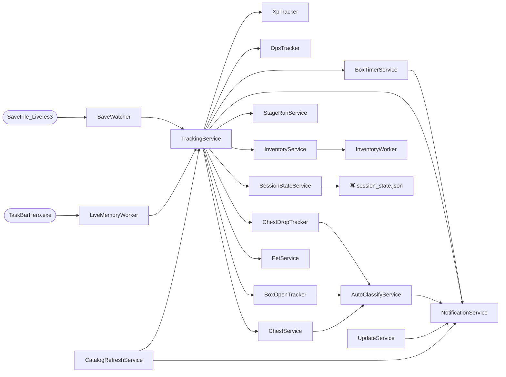

# TBH Companion 业务流程总览

> 本文档是 TBH Companion 的项目级**业务流程单一真理源**。任何针对项目逻辑（save 解析、tracker 速率计算、live memory 读取、inventory/lookup/market、boxTimer、autoClassify、notification、session 持久化等）的代码改动，**必须先查阅本文档对应章节**，理解现有流程后再动手；改动落地后**必须同步更新对应章节**（详见 `AGENTS.md` 的 Conventions 节）。
>
> 本文档关注“业务流程”（数据如何流动、服务如何协作），架构分层与 IPC 边界见 [`ARCHITECTURE.md`](./ARCHITECTURE.md)，save 解密细节见 [`SAVE_FORMAT.md`](./SAVE_FORMAT.md)，agent 行为规范见 [`docs/agent/`](./agent/README.md)。
>
> 所有文件路径以仓库根为基准（`app/src/...`）。

---

## 章节索引

> **正文已按主题拆分到 [`docs/business-flows/`](business-flows/)。** 每个子文件可单独打开（体量小得多），便于按需加载；章节编号保持与原文档一致（§0–§24），因此 `§5.5.2` 这类既有交叉引用仍然有效。
>
> 同时保留两张索引**指向同一个子文件**（例如 §6 与 §7 同属 [`05-inventory-and-lookup.md`](business-flows/05-inventory-and-lookup.md)），是为了让「按章节号找正文」与「按主题看流程」两条路径都成立。

| 章 | 主题 | 正文位置 | 覆盖内容 |
| --- | --- | --- | --- |
| §0 | 项目目标与四层架构 | [架构与数据流](business-flows/00-architecture-and-dataflow.md) | 全局背景、四层架构、三个窗口、数据流总览图 |
| §1 | 启动流程 | [启动与配置](business-flows/01-startup-and-config.md) | 入口、模块副作用、单实例锁、窗口恢复、appState 装配、start/stopTracking |
| §2 | 配置加载与 configPatch | [启动与配置](business-flows/01-startup-and-config.md) | config.json 加载与默认值合并、IPC 配置补丁的校验与持久化 |
| §3 | Save 解密与解析 | [Save 解密与解析](business-flows/02-save-decrypt-and-parse.md) | SaveWatcher 轮询、readAndDecrypt、ES3（桌面）与 es3Web（网页版）、parseSnapshot、字段含义 |
| §4 | Tracker 双路径 | [Tracker 双路径](business-flows/03-tracker.md) | save/live 所有权模型、滚动窗口速率、trackerLimits、跨级 XP 桥接、自愈、blend、gold 突变防护 |
| §5 | LiveMemory | [LiveMemory 实时读取](business-flows/04-live-memory.md) | 进程附加、worker 消息协议、25Hz 轮询、防死循环、offset healing、日志桶读取、沙箱 fallback、诊断页 |
| §6 | Inventory | [Inventory 与 Lookup](business-flows/05-inventory-and-lookup.md) | parseInventory、子模块职责、resolveAndPushInventory、inventoryWorker、priceCache、背包满预测 |
| §7 | Lookup | [Inventory 与 Lookup](business-flows/05-inventory-and-lookup.md) | 数据源、box/item/offering 查询、查询价格服务与轮询、sweep、收藏轮询、获取规律、合成点数 |
| §8 | Market | [Market 与 Steam 价格](business-flows/06-market.md) | 价格请求链路、手续费、买单价、item_nameid、代理、429 限流、交易额统计与导入导出 |
| §9 | Catalog Refresh | [Catalog Refresh 与 Session](business-flows/07-catalog-refresh-and-session.md) | 启动时机、resolveAssetPaths、catalog/locale 提取、写盘与 IPC 推送 |
| §10 | Session 持久化 | [Catalog Refresh 与 Session](business-flows/07-catalog-refresh-and-session.md) | 状态字段、load、15s 自动保存、首次恢复、clearSession、字段表 |
| §11 | BoxTimer | [BoxTimer 与 StageRun](business-flows/08-box-timer-and-stage-run.md) | 数据来源、1Hz tick 与订阅计数、buildState、cooldown 播种、box_timers.json、通知偏好 |
| §12 | StageRun | [BoxTimer 与 StageRun](business-flows/08-box-timer-and-stage-run.md) | 触发时机、recordClear、失败检测规则、独立持久化、恢复校验、getStats |
| §13 | ChestService | [ChestService 与 AutoClassify](business-flows/09-chest-and-autoclassify.md) | onSave 触发、resolveAndPush、容量计算、与 AutoClassify 协作、槽位结构、瘟疫宝箱 |
| §14 | AutoClassify | [ChestService 与 AutoClassify](business-flows/09-chest-and-autoclassify.md) | 串行队列模型、关键回调、processEvent、与槽位对账、tick、漂移校准、队列快照 |
| §15 | Notification | [Notification / Update / Pet](business-flows/10-notification-update-pet.md) | 触发源、路由到 renderer、音效下发、notificationCatalog |
| §16 | Update | [Notification / Update / Pet](business-flows/10-notification-update-pet.md) | 启动、检查/下载/安装、友好错误、GitHub release 检查 |
| §17 | Pet | [Notification / Update / Pet](business-flows/10-notification-update-pet.md) | onSave 触发、解析流程、PetRow 字段、增益与推图计算 |
| §18 | 跨服务数据流总览 | 见下文 §18 | 服务级关联图（本章保留在本文件） |
| §19 | 关键错误处理路径汇总 | 见下文 §19 | 各场景的降级/重试/告警行为总表（保留在本文件） |
| §20 | 关键文件路径速查 | 见下文 §20 | 模块 → 文件路径总表（保留在本文件） |
| §21 | 文档维护约定 | 见下文 §21 | 同步演进的不变量与共享服务命名契约（保留在本文件） |
| §22 | 历史背景 | 见下文 §22 | 项目沿革（保留在本文件） |
| §23 | 统一记录日志（Record Log） | [统一记录日志](business-flows/11-record-log.md) | 读取模型（定长平移列表）、去重、归档、字段语义、调试页速查 |
| §24 | 开箱统计补齐（Box-Open Backfill） | [开箱统计补齐](business-flows/12-box-open-backfill.md) | 背景、数据流、六步匹配、节流、归因、错误处理、边界 |
| §25 | 网页版存档解析器（Web Inspector） | [网页版存档解析器](business-flows/13-web-inspector.md) | 构建期模块替换、`window.tbh` 的 web shim、存档加载链路、图鉴目录本地化、图标静态化、能力降级表、部署与冒烟 |

**按主题拆分的文件清单**（文件顺序即推荐阅读顺序）：

| 文件 | 章节 | 主题 |
| --- | --- | --- |
| [`00-architecture-and-dataflow.md`](business-flows/00-architecture-and-dataflow.md) | §0 | 架构与数据流 |
| [`01-startup-and-config.md`](business-flows/01-startup-and-config.md) | §1–§2 | 启动与配置 |
| [`02-save-decrypt-and-parse.md`](business-flows/02-save-decrypt-and-parse.md) | §3 | Save 解密与解析 |
| [`03-tracker.md`](business-flows/03-tracker.md) | §4 | Tracker 双路径 |
| [`04-live-memory.md`](business-flows/04-live-memory.md) | §5 | LiveMemory 实时读取 |
| [`05-inventory-and-lookup.md`](business-flows/05-inventory-and-lookup.md) | §6–§7 | Inventory 与 Lookup |
| [`06-market.md`](business-flows/06-market.md) | §8 | Market 与 Steam 价格 |
| [`07-catalog-refresh-and-session.md`](business-flows/07-catalog-refresh-and-session.md) | §9–§10 | Catalog Refresh 与 Session 持久化 |
| [`08-box-timer-and-stage-run.md`](business-flows/08-box-timer-and-stage-run.md) | §11–§12 | BoxTimer 与 StageRun |
| [`09-chest-and-autoclassify.md`](business-flows/09-chest-and-autoclassify.md) | §13–§14 | ChestService 与 AutoClassify |
| [`10-notification-update-pet.md`](business-flows/10-notification-update-pet.md) | §15–§17 | Notification / Update / Pet |
| [`11-record-log.md`](business-flows/11-record-log.md) | §23 | 统一记录日志（Record Log） |
| [`12-box-open-backfill.md`](business-flows/12-box-open-backfill.md) | §24 | 开箱统计补齐（Box-Open Backfill） |
| [`13-web-inspector.md`](business-flows/13-web-inspector.md) | §25 | 网页版存档解析器（Web Inspector） |

---

## 18. 跨服务数据流总览

下图聚焦**服务间关联**：方框为共享服务（label 即服务名），箭头为服务间数据流/事件流；动作级细节见第 0 章"数据流总览"及各章节流程图。本图也是交互式可视化页"全流程关联图"的数据基础。



---

## 19. 关键错误处理路径汇总

| 场景                                               | 行为                                                                                                                  |
| -------------------------------------------------- | --------------------------------------------------------------------------------------------------------------------- |
| Save 文件不存在                                    | `SaveReadError` → SaveWatcher `onError` → `lastError` 显示在 stats.status                                             |
| mid-write sharing violation                        | `readBytesShared` 4 次重试 50ms；AES 块大小不符 → `Es3Error` → 不前进 mtime → 下次 poll 重试                          |
| 错误密码                                           | `Es3Error(WRONG_PASSWORD)` → 持续失败需要用户更新 `es3Password` 配置                                                  |
| parseInventory 抛错                                | `log.error`，不影响 save snapshot 推送                                                                                |
| Session restore 文件 corrupt                       | `isPersistedSessionState` 失败 → 忽略，返回默认 ui                                                                    |
| Session restore mtime 不连续                       | discard + deleteFile                                                                                                  |
| Session restore 数值不合理                         | discard + deleteFile（防 live/save baseline 混合污染）                                                                |
| applySnapshot 抛错（schema drift）                 | discard + deleteFile                                                                                                  |
| Live memory worker 崩溃                            | `lastLiveFrame` 超过 5s 未更新 → TrackingService tickTimer 清空 `lastLiveFrame`/`lastLiveStage`，stats 回退到 save 值 |
| Live hero exp 异常（>1e12）                        | `plausibleHeroRuntimeExp` 拒绝                                                                                        |
| Live 单 tick gain 异常（>1e7）                     | `plausibleLiveHeroGain` 拒绝                                                                                          |
| Live level-drop（dirty read）                      | 跳过该 hero 不计数                                                                                                    |
| Live same-level dip                                | 跳过计数但 refreshRolling                                                                                             |
| LiveMemory worker exit (code 非 0)                 | 构造 `"live reader stopped unexpectedly"` status 广播；不自动重启                                                     |
| inventoryWorker fork 失败                          | log.error，`ready=false`，走 sync fallback                                                                            |
| inventoryWorker resolve 超时（5s）                 | reject pending promise，host 走 sync fallback                                                                         |
| inventoryWorker crash                              | `handleExit` reject 所有 pending，`ready=false`，host 后续走 sync fallback                                            |
| Steam 429                                          | `parseRetryAfterMs` 取 Retry-After，与指数退避取较大值；连续 3 次熔断                                                 |
| Steam 网络错误                                     | cache 有该 hash 的 market data → 刷新时间戳使其 fresh；否则 `counters.failed++`                                       |
| nameid 解析失败                                    | 跳过 buyOrder，不影响 sell price 写入                                                                                 |
| LookupPriceService fetch 失败                      | log warn，保留旧 snapshot                                                                                             |
| LookupPriceService 校验失败                        | log warn，保留旧 snapshot                                                                                             |
| LookupPricePolling cycle 中 429                    | `consecutiveRateLimits++`，达 3 中止本轮（`aborted: true`）                                                           |
| CatalogRefresh asset 文件缺失                      | 抛错，`lastError` 记录，broadcast stale 状态，返回 `{ ok: false }`                                                    |
| CatalogRefresh locale 提取失败                     | `extractLocales` 返回 null 时 per-locale 诊断，不阻塞 gamedata 写入                                                   |
| proxy 创建失败                                     | log warn，`cachedDispatcher = {}`（直连）                                                                             |
| priceCache 文件损坏                                | `tryLoadCache` catch，返回空 cache                                                                                    |
| AutoClassify queue item 过期                       | pruneExpired 移除                                                                                                     |
| AutoClassify pending burst 5 分钟无 save reconcile | TTL prune（items 留在 unclassified）                                                                                  |
| AutoClassify ambiguous classification              | 不 reclassify，全部 reset timer                                                                                       |
| BoxTimer persist 失败                              | `writeFileSync` 失败 → 仅 warn，不破坏 in-memory state + broadcast；下次 tick 重试                                    |
| Update 检查网络错误                                | friendlyUpdateError 显示友好提示                                                                                      |
| Update GitHub rate limit                           | 提示用户等待                                                                                                          |
| Update 404                                         | "No release found"                                                                                                    |
| Update 开发模式                                    | phase="disabled"，所有操作 noop                                                                                       |

---

## 20. 关键文件路径速查

| 模块                      | 文件                                                                                                                                                                                   |
| ------------------------- | -------------------------------------------------------------------------------------------------------------------------------------------------------------------------------------- |
| 入口                      | `app/src/main/index.ts`                                                                                                                                                                |
| appState                  | `app/src/main/app/appState.ts`                                                                                                                                                         |
| 单实例                    | `app/src/main/app/singleInstance.ts`                                                                                                                                                   |
| lifecycle                 | `app/src/main/app/lifecycle.ts`                                                                                                                                                        |
| config                    | `app/src/main/config.ts`                                                                                                                                                               |
| configPatch               | `app/src/main/ipc/configPatch.ts`                                                                                                                                                      |
| registerIpc               | `app/src/main/ipc/registerIpc.ts`                                                                                                                                                      |
| broadcast                 | `app/src/main/services/broadcast.ts`                                                                                                                                                   |
| SaveWatcher               | `app/src/main/saveWatcher.ts`                                                                                                                                                          |
| saveFile I/O              | `app/src/main/io/saveFile.ts`                                                                                                                                                          |
| ES3 解密                  | `app/src/core/es3.ts`                                                                                                                                                                  |
| save snapshot 解析        | `app/src/core/save/snapshot.ts`                                                                                                                                                        |
| TrackingService           | `app/src/main/services/TrackingService.ts`                                                                                                                                             |
| stats 构建                | `app/src/main/stats.ts`                                                                                                                                                                |
| blend 纯函数              | `app/src/core/liveMemory/blend.ts`                                                                                                                                                     |
| tracker 核心              | `app/src/core/tracker.ts`                                                                                                                                                              |
| trackerLimits             | `app/src/core/trackerLimits.ts`                                                                                                                                                        |
| levelCurve                | `app/src/core/levelCurve.ts`                                                                                                                                                           |
| detectLevelUps            | `app/src/core/heroes/detectLevelUps.ts`                                                                                                                                                |
| SaveWatcher               | `app/src/main/saveWatcher.ts`                                                                                                                                                          |
| LiveMemoryService         | `app/src/main/services/LiveMemoryService.ts`                                                                                                                                           |
| liveMemoryWorker          | `app/src/main/services/liveMemoryWorker.ts`                                                                                                                                            |
| LiveMemoryReader          | `app/src/main/liveMemory/liveReader.ts`                                                                                                                                                |
| offsetExtractor           | `app/src/main/liveMemory/offsetExtractor.ts`                                                                                                                                           |
| offsetHealing             | `app/src/main/liveMemory/offsetHealing.ts`                                                                                                                                             |
| offsetCache               | `app/src/main/liveMemory/offsetCache.ts`                                                                                                                                               |
| WinProcess + FFI          | `app/src/main/liveMemory/winProcess.ts`                                                                                                                                                |
| runtime 字段读取          | `app/src/core/liveMemory/runtime.ts`                                                                                                                                                   |
| chestSlots 读取           | `app/src/core/liveMemory/chestSlots.ts`                                                                                                                                                |
| il2cppScanner             | `app/src/core/liveMemory/il2cppScanner.ts` — Rev 13 `findBoxDataFields` 结构化派生 boxTypes/boxQuantity                                                                                |
| offsets 类型 + 内置表     | `app/src/core/liveMemory/offsets.ts` — `LiveOffsets` 接口、`offsetsForVersion` / `offsetsForVersionMeta`、`_criticalRvasValidated` / `_fallbackFromVersion` / `_extractorRev` 字段定义 |
| offsetCompleteness        | `app/src/core/liveMemory/offsetCompleteness.ts` — `isOffsetTableComplete` / `mergeOffsets` / `ENRICHMENT_FIELDS`（Rev 13 加入 `boxData.boxTypes` / `boxData.boxQuantity`）             |
| InventoryService          | `app/src/main/services/InventoryService.ts`                                                                                                                                            |
| inventory parse           | `app/src/core/inventory/parse.ts`                                                                                                                                                      |
| inventory composition     | `app/src/core/inventory/composition.ts`                                                                                                                                                |
| inventory buyOrder        | `app/src/core/inventory/buyOrder.ts`                                                                                                                                                   |
| inventory predictFill     | `app/src/core/inventory/predictFillTime.ts`                                                                                                                                            |
| inventoryWorker           | `app/src/main/services/inventoryWorker.ts` / `inventoryWorkerEntry.ts` / `inventoryWorkerProtocol.ts`                                                                                  |
| priceCache                | `app/src/main/services/priceCache.ts`                                                                                                                                                  |
| steamMarketProvider       | `app/src/main/services/steamMarketProvider.ts`                                                                                                                                         |
| steamPriceApi             | `app/src/main/services/steamPriceApi.ts`                                                                                                                                               |
| steamBuyOrderApi          | `app/src/main/services/steamBuyOrderApi.ts`                                                                                                                                            |
| steamItemNameId           | `app/src/main/services/steamItemNameId.ts`                                                                                                                                             |
| proxyResolver             | `app/src/main/services/proxyResolver.ts`                                                                                                                                               |
| retryAfter                | `app/src/main/services/retryAfter.ts`                                                                                                                                                  |
| marketName                | `app/src/core/marketName.ts`                                                                                                                                                           |
| steamMarketFee            | `app/src/core/steamMarketFee.ts` / `steamMarketFeeBundled.ts`                                                                                                                          |
| steamPrice 表             | `app/src/core/steamPrice.ts`                                                                                                                                                           |
| LookupService             | `app/src/main/services/LookupService.ts`                                                                                                                                               |
| LookupPriceService        | `app/src/main/services/LookupPriceService.ts`                                                                                                                                          |
| LookupPricePollingService | `app/src/main/services/LookupPricePollingService.ts`                                                                                                                                   |
| lookup core               | `app/src/core/lookup/*.ts`                                                                                                                                                             |
| lookupPrice core          | `app/src/core/lookupPrice/*.ts`                                                                                                                                                        |
| CatalogRefreshService     | `app/src/main/catalogRefreshService.ts`                                                                                                                                                |
| catalogExtractor          | `app/src/core/unityAssets/catalogExtractor.ts`                                                                                                                                         |
| localeExtractor           | `app/src/core/unityAssets/localeExtractor.ts`                                                                                                                                          |
| SessionStateService       | `app/src/main/services/SessionStateService.ts`                                                                                                                                         |
| sessionState core         | `app/src/core/sessionState.ts`                                                                                                                                                         |
| BoxTimerService           | `app/src/main/services/BoxTimerService.ts`                                                                                                                                             |
| stageBoxTracker           | `app/src/core/stageBoxTracker.ts`                                                                                                                                                      |
| boxTrackerSort            | `app/src/core/boxTrackerSort.ts`                                                                                                                                                       |
| boxTrackerWindow          | `app/src/main/windows/boxTrackerWindow.ts`                                                                                                                                             |
| StageRunService           | `app/src/main/services/StageRunService.ts`                                                                                                                                             |
| stageRunTracker           | `app/src/core/stageRunTracker.ts`                                                                                                                                                      |
| ChestService              | `app/src/main/services/ChestService.ts`                                                                                                                                                |
| boxes resolve             | `app/src/core/boxes/resolve.ts`                                                                                                                                                        |
| boxes capacity            | `app/src/core/boxes/capacity.ts`                                                                                                                                                       |
| AutoClassifyService       | `app/src/main/services/AutoClassifyService.ts`                                                                                                                                         |
| AutoClassify 规约         | `docs/findings/auto-classify-business-logic.md`                                                                                                                                        |
| chestDropTracker          | `app/src/core/chestDropTracker.ts`                                                                                                                                                     |
| boxOpenTracker            | `app/src/core/boxOpenTracker.ts`                                                                                                                                                       |
| boxOpenBackfill           | `app/src/core/boxOpenBackfill.ts`                                                                                                                                                      |
| acquireLog（含色值→品质） | `app/src/core/acquireLog.ts`                                                                                                                                                           |
| recordLogFit              | `app/src/core/recordLogFit.ts`                                                                                                                                                         |
| recordLogTracker          | `app/src/core/recordLogTracker.ts`                                                                                                                                                     |
| RecordLogService          | `app/src/main/services/RecordLogService.ts`                                                                                                                                            |
| dpsTracker                | `app/src/core/liveMemory/dpsTracker.ts`                                                                                                                                                |
| NotificationService       | `app/src/main/services/NotificationService.ts`                                                                                                                                         |
| notificationCatalog       | `app/shared/notificationCatalog.ts`                                                                                                                                                    |
| UpdateService             | `app/src/main/services/UpdateService.ts`                                                                                                                                               |
| PetService                | `app/src/main/services/PetService.ts`                                                                                                                                                  |
| pets core                 | `app/src/core/pets/*.ts`                                                                                                                                                               |
| shared types              | `app/shared/types.ts`                                                                                                                                                                  |
| IPC 通道名                | `app/shared/ipc.ts`                                                                                                                                                                    |
| preload bridge            | `app/src/preload/index.ts`                                                                                                                                                             |
| TbhProvider               | `app/src/renderer/context/TbhProvider.tsx`                                                                                                                                             |

---

## 21. 文档维护约定

本文档与代码同步演进，遵循以下不变量：

1. **代码改动→文档同步**：任何针对项目业务逻辑的代码改动（新增/修改/删除流程、调整数据流、变更服务边界、修改关键不变量），改动落地后**必须同步更新本文档对应章节**。详见 `AGENTS.md` 的 Conventions 节。
2. **章节编号稳定**：0-20 的章节编号已分配，新增章节追加到 21+，不重排已有编号便于外部引用。
3. **路径基准**：所有文件路径以仓库根为基准（`app/src/...`），与 `AGENTS.md` 的 "Where things are" 节一致。
4. **不重复架构细节**：本文档关注"业务流程"（数据如何流动、服务如何协作）；架构分层、IPC 边界、文件结构由 [`ARCHITECTURE.md`](./ARCHITECTURE.md) 维护；save 解密细节由 [`SAVE_FORMAT.md`](./SAVE_FORMAT.md) 维护；agent 行为规范由 [`docs/agent/`](./agent/README.md) 维护。本文档只在必要处给出摘要链接。
5. **跨文档链接**：引用其他文档时使用相对路径（如 `[auto-classify-business-logic](./findings/auto-classify-business-logic.md)`），便于离线阅读。
6. **审计/调研文档独立**：专项审计报告（如 `docs/findings/*.md`）作为本文档的细化补充，不在本文档内重复其细节，仅给出摘要 + 链接。
7. **`docs/agent/generated/`** 是 code-derived 自动生成清单，不手编辑；本文档是 hand-curated 业务流程单一真理源，不与 generated 重复。
8. **mermaid 图随正文同步**：各章节的 ` ```mermaid ` 流程图与正文是同一流程的两种呈现，业务改动落地时必须**同步更新对应章节的图**（含节点、流向、分支），不允许只改文字。
9. **共享服务命名契约**：跨图引用共享服务时，节点 label 必须**以 `docs/agent/scripts/build-flow-viz.mjs` 顶部 `SVC_NAMES` 注册表中的服务名开头**（如 `TrackingService.onSnapshot`），以便可视化工具据此聚合"服务参与的流程"与"跨服务关联"。**修改注册表需在同 PR 内同步所有相关图的 label，并重新生成 `docs/flow-viz/flow-viz-data.js`**（`node docs/agent/scripts/build-flow-viz.mjs`）。

---

## 22. 历史背景（简要）

- 项目最初是 Python 原型 `tbh_xp/`，仅做 ES3 解密 + XP/hour 显示。
- TS core 达到 parity 后 Python 原型已删除（见 [`docs/DECISIONS.md`](./DECISIONS.md) 的 ADR 记录）。
- Live Memory 功能于 v1.00.x 后期加入，引入 utilityProcess worker + FFI 进程附加架构。
- AutoClassify 串行队列模型于 2026-07 重构为 per-category shared timer + 漂移检测 + WeakSet slot 计数（见 `project_memory.md` 的 Auto-classify 条目）。
- CatalogRefresh 于 2026-07 加入，从游戏 Unity bundle 直接提取 catalog + locale，替代手动维护 `data/gamedata.json`。
- LookupPricePollingService 于 2026-07 加入，让用户本地刷新 watched/owned 物品价格，弥补 CI 6 小时快照的滞后。后于 2026-08 收敛为**图鉴页仅轮询星标（watched）物品**（阈值/拥有集合不再参与图鉴轮询），并在交易页新增「刷新历史价格」按钮（`selectHistoryRefreshTargets`）强制拉取星标 ∪ 快照价格达标物品的 pricehistory。2026-08 中旬移除自动周期的 6h 固定冷却（`POLLING_MIN_REFRESH_MS` + `lookup_polling_cache.json` 持久化），让 `intervalMinutes` 设置严格生效（见 7.3 定时调度）。
