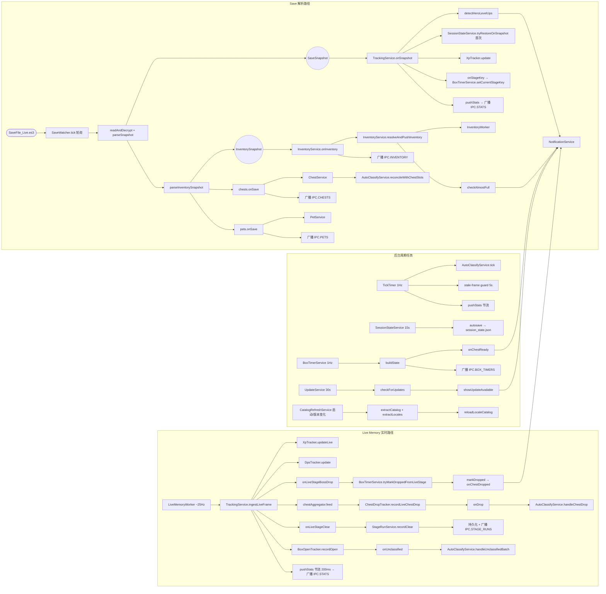

# 架构与数据流

> 本文是 [`docs/BUSINESS-FLOWS.md`](../BUSINESS-FLOWS.md) 的拆分章节之一。**业务流程的单一真理源仍是主索引文件**——任何业务逻辑改动仍需先查阅本文件，落地后同步更新；本文件只是承载正文，便于按需加载。
>
> 全局背景与跨服务数据流。阅读任何流程章之前建议先读本文件。
>
> 所有文件路径以仓库根为基准（`app/src/...`）。

> ← [主索引](../BUSINESS-FLOWS.md) · 上一节：无 · 下一节：[启动与配置](01-startup-and-config.md) · 章节：§0

---

## 0. 项目目标与四层架构

TBH Companion 是 idle game **TBH: Task Bar Hero** 的桌面伴侣应用。它**只读**地观察游戏状态：

- 读取本地加密 save 文件 `SaveFile_Live.es3`（ES3 + AES-128-CBC），展示 XP/hour、gold/hour、per-hero 速率、session 历史、库存估值。
- 可选附加到游戏进程内存（`TaskBarHero.exe`），以 ~25 Hz 读取实时数据：当前关卡、波次、英雄状态、怪物 HP、宝箱掉落、开箱结果、关卡完成。
- 通过 Steam Market 拉取物品价格，估算库存 buyout 价值与开箱 loot 估值。
- **绝不修改 save**、**绝不向游戏注入输入**、**绝不与游戏服务器通讯**。

### 四层架构

| 层           | 路径                | 规则                                                                                             |
| ------------ | ------------------- | ------------------------------------------------------------------------------------------------ |
| **shared**   | `app/shared/`       | `types.ts` + `ipc.ts`（IPC 通道名）+ `notificationCatalog.ts`。无运行时逻辑。                    |
| **core**     | `app/src/core/`     | 纯领域逻辑。**无** `electron`、**无** `node:fs`、**无** `fetch`、**无** React。Vitest 单测覆盖。 |
| **main**     | `app/src/main/`     | 文件 I/O、网络、窗口、IPC。通过 `app/appState.ts` 和 `ipc/` 编排 core。                          |
| **preload**  | `app/src/preload/`  | 仅 `contextBridge`；通道名从 `shared/ipc.ts` 引入。                                              |
| **renderer** | `app/src/renderer/` | React UI 通过 `window.tbh` 访问 IPC。过滤/排序在 `renderer/lib/` 或 `core/` 纯函数。             |

### 三个窗口（共享同一 bundle）

- **主窗口** `#main` — 可调整大小的 tabbed 界面（Live / Inventory / Market / Chests / Pets / Lookup / Loot / Settings / About）。
- **Mini overlay** `/overlay` — 无边框、置顶、可拖动、紧凑；tab bar 的 "Mini" 按钮切换。
- **Box tracker** `/box-tracker` — 无边框置顶的宝箱冷却倒计时专用窗口。

### 数据流总览

#### 流程图

图例：圆柱 = 外部实体，方框 = 处理步骤/动作，括号圆 = 数据对象；彩色节点为共享服务（label 以服务名开头，跨图同名即同一服务）。

