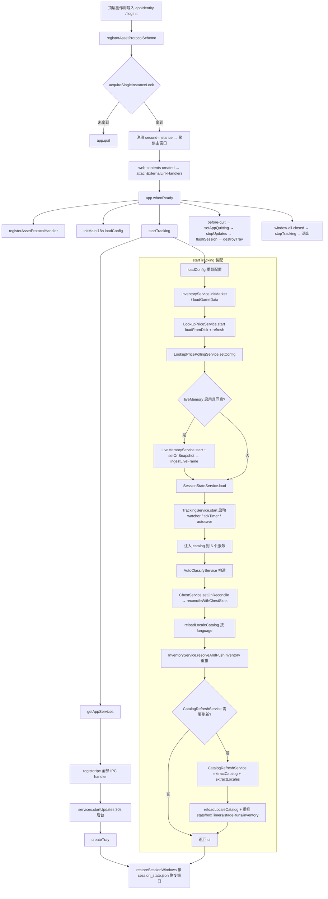

# 启动与配置

> 本文是 [`docs/BUSINESS-FLOWS.md`](../BUSINESS-FLOWS.md) 的拆分章节之一。**业务流程的单一真理源仍是主索引文件**——任何业务逻辑改动仍需先查阅本文件，落地后同步更新；本文件只是承载正文，便于按需加载。
>
> 应用从进程启动到进入可追踪状态的完整链路，以及配置文件与 IPC 配置补丁的处理方式。
>
> 所有文件路径以仓库根为基准（`app/src/...`）。

> ← [主索引](../BUSINESS-FLOWS.md) · 上一竧[架构与数据流](00-architecture-and-dataflow.md) · 下一竧[Save 解密与解析](02-save-decrypt-and-parse.md) · 章节：§1 / §2

---

## 1. 启动流程

入口：`app/src/main/index.ts`。

### 流程图

主流程：模块加载副作用 → 单实例锁 → `whenReady` 主流程 → 窗口恢复；`startTracking` 装配细节见下方 subgraph。

### 1.1 时序

1. **顶层副作用导入**：`./appIdentity`（注册 app 名称）、`./logInit`（日志 transport）。
2. **Asset 协议注册**：`registerAssetProtocolScheme()` 在模块加载时调用。
3. **单实例锁**：`acquireSingleInstanceLock()`（`app/app/singleInstance.ts`）。未拿到锁则 `app.quit()`；拿到锁后注册 `second-instance` 事件 → 聚焦主窗口。
4. **外部链接拦截**：`app.on("web-contents-created")` → `attachExternalLinkHandlers`（`app/app/lifecycle.ts`），把 http/https 链接转给系统浏览器。
5. **`app.whenReady()` 触发主流程**：
   - `registerAssetProtocolHandler()` 注册协议实际 handler。
   - `initMainI18n(loadConfig())` 初始化主进程 i18n。
   - `startTracking()` 装配所有服务并启动 watcher（详见 1.3）。
   - `getAppServices()` 取得对外 API 聚合对象。
   - `registerIpc(services)` 注册全部 IPC handler。
   - `services.startUpdates()` 启动更新检查（30s 延迟后台检查）。
   - `createTray(services)` 创建托盘。
   - `restoreSessionWindows(sessionUi)` 根据 `session_state.json` 的 UI 标记决定打开主窗口还是 mini overlay + box tracker 窗口。
6. **`before-quit`**：`setAppQuitting(true)` → `services.stopUpdates()` → `services.flushSession()` → `destroyTray()`。
7. **`window-all-closed`**：若 `isAppQuitting()`，调 `stopTracking()` 后退出（非 macOS）。

### 1.2 appState 装配（`app/src/main/app/appState.ts`）

模块级单例按顺序构造（构造时即执行）：

| 顺序 | 服务                                   | 关键依赖                                                                                                             |
| ---- | -------------------------------------- | -------------------------------------------------------------------------------------------------------------------- |
| 1    | `SessionStateService`                  | 无                                                                                                                   |
| 2    | `InventoryService`                     | 无                                                                                                                   |
| 3    | `ChestService`                         | 构造时加载 `boxType`/`runeCap`/`runeAutoOpen` 三份 catalog                                                           |
| 4    | `PetService`                           | 构造时加载 `petCatalog`                                                                                              |
| 5    | `BoxTimerService`                      | 构造时加载 `stageBox` catalog + tracker routes，调 `load()` 读 `box_timers.json`，调 `seedWasOnCooldown()`           |
| 6    | `StageRunService`                      | 构造时 `load()` 读 `stage_run_history.json`                                                                          |
| 7    | `LookupService` / `LookupPriceService` | 无                                                                                                                   |
| 8    | `LookupPricePollingService`            | 依赖 `lookupPrices`、`config.lookupPricePolling.watchedHashes`、`config.currency`、共享 `nameIdService`、`broadcast` |
| 9    | `LiveMemoryService`                    | 构造后 `setOnGameVersionChanged` 钩子接 `catalogRefresh.onGameVersionChanged`                                        |
| 10   | `CatalogRefreshService`                | 依赖 `inventory.getGameData()`、`liveMemory`、`resolveUserDataDir()`、`broadcast`、`config.gameInstallDir`           |
| 11   | `NotificationService`                  | `getConfig`、`focusMainWindow`、`t`（i18n）                                                                          |
| 12   | `UpdateService`                        | `getConfig`、`onUpdateAvailable: (v) => notifications.showUpdateAvailable(v)`                                        |

构造后立即装配跨服务回调：

- `boxTimers.setOnChestReady(payload => notifications.showChestReady(payload))`
- `boxTimers.setOnChestDropped(payload => notifications.showChestDrop(payload))`
- `inventory.setOnAlmostFull(payload => notifications.showInventoryAlmostFull(payload), () => threshold)`
- `liveMemory.setOnGameVersionChanged(() => catalogRefresh.onGameVersionChanged())`

### 1.3 TrackingService 构造与 startTracking()

`TrackingService` 构造参数是 8 个回调（按顺序）：

1. `onInventory: (snap) => inventory.onInventory(snap)` — SaveWatcher 的 onInventory 入口
2. `parseInventorySnapshot: (text, mtime) => { const inv = inventory.parseFromSave(text, mtime); chests.onSave(text, mtime, inv.chests); pets.onSave(text, mtime); return inv; }` — 解析 inventory 同时驱动 ChestService 和 PetService
3. `onStageKey: (stageKey) => boxTimers.setCurrentStageKey(stageKey)` — save 解析到新 stageKey 时同步给 BoxTimerService
4. `sessionState` — 用于 restore/autosave/flush
5. `onHeroLevelUp: (events) => notifications.showHeroLevelUp(events)`
6. `onLiveStageBossDrop: (stageKey) => boxTimers.tryMarkDroppedFromLiveStage(stageKey)` — **BoxTimer 倒计时的唯一自动触发来源**（2026-09-10 起 save-reconcile 路径不再触发，见 14.4 Step 5）
7. `onLiveStageClear: (stageKey, clearTimeSec, xpGained, goldGained) => stageRuns.recordClear(...)`
8. `onLiveChestSlots` — 当前已不路由到 AutoClassify（保留接口签名）

`startTracking()` 流程：

1. `config = loadConfig()` 重新加载配置。
2. 初始化 `InventoryService` 市场参数：`initMarket(config.currency)`、`setAutoScanEnabled`、`setLowValueThresholdUsd`、`loadGameData(resolveUserDataDir())`。
3. `lookupPrices.start()` 启动 lookup 价格快照（先 `loadFromDisk()`，再 `refresh()`，然后 30 分钟轮询）。
4. `lookupPricePolling.setConfig(config.lookupPricePolling)` 应用轮询配置。
5. 若 `config.liveMemory.enabled && config.liveMemory.consentAccepted`，调 `liveMemory.start()`，并 `setOnSnapshot(snap => tracking.ingestLiveFrame(snap))` 把 ~25 Hz live 帧注入 TrackingService。
6. `sessionState.load(config)` 读 `session_state.json`，返回 UI 快照（mini overlay / box tracker 是否打开）。pending tracker 数据保留等待首次 save 解析时 restore。
7. `tracking.start(config)` 装配 `XpTracker` / `ChestDropTracker` / `LiveChestDropAggregator` / `BoxOpenTracker` / `DpsTracker`，启动 SaveWatcher 和 1Hz tickTimer，启动 `sessionState.startAutosave`。
8. 注入 catalog：`setGameDataLookup`、`setLookupCatalog`（同时注入 inventory）、`setInventorySnapshot`、`setLookupPriceSnapshot`、`lookupPrices.setOnSnapshotUpdated` 双订阅。
9. `autoClassify = new AutoClassifyService({...})`：依赖 `tracking.getChestDropTracker/getBoxOpenTracker`、`chests`、`boxTimers.getState().catalog`、act/common routes、`tracking.getCurrentStageKey()`、`getInventoryStatus`。
10. `chests.setOnReconcile(slots => autoClassifyRef.reconcileWithChestSlots(slots))` — 每次 save 解析都触发 AutoClassify reconcile。
11. `autoClassify.setEnabled(config.lootAutoClassifyEnabled)`、`tracking.setAutoClassifyService(autoClassify)`。
12. `reloadLocaleCatalog()`：基于 `config.language` 解析语言 → 加载 `LocaleCatalog`（bundled JSON + 游戏提取的 locale_strings 合并）→ 注入到 `tracking / inventory / boxTimers / stageRuns / liveMemory / lookup` 六个服务。
13. `inventory.resolveAndPushInventory()` — 用新 catalog 重推一次库存。
14. 异步触发 catalogRefresh（若 stale）：成功后再次 `reloadLocaleCatalog()` + 重推 stats/boxTimers/stageRuns/inventory。
15. 返回 `ui` 给 `index.ts`，由 `restoreSessionWindows(ui)` 决定窗口打开方式。

### 1.4 stopTracking()

`before-quit` 触发 `services.flushSession()` 后；`window-all-closed` 内调 `stopTracking()`：

- `tracking.flushSession()` 落盘一次。
- `tracking.stop()` 停 watcher / tickTimer / autosave。
- `autoClassify?.setEnabled(false)` + 置 null。
- `boxTimers.stopTick()`、`lookupPrices.stop()`、`lookupPricePolling.stop()`、`liveMemory.stop()`。

## 2. 配置加载与 configPatch

### 流程图

`applyConfigPatch` 依次检测各配置项变化并触发对应服务回调；菱形为决策节点，"否"直接进入下一个判断。

```mermaid
%% TBH flow diagram
flowchart TD
  LoadCfg[loadConfig 搜索 userData / cwd / cwd.. config.json] --> Normalize[sanitize* 清洗字段]
  Normalize --> Persist[saveConfig 合并 + normalize 写回 userData/config.json]
  Patch[applyConfigPatch 收到 partial patch] --> DetectNeeds{needsWatcher / needsTracker / csvToggled}
  DetectNeeds --> Next[normalizeConfigFromRaw 合并 + setConfig + saveConfig]
  Next --> QSavePath{savePath 变化?}
  QSavePath -- 是 --> A1[TrackingService.onSavePathChanged 清 lastSnap + 重置 tracker]
  QSavePath -- 否 --> QCurr{currency 变化?}
  A1 --> QCurr
  QCurr -- 是 --> A2[onCurrencyChanged 清市场历史 + clearLookupLocalFields]
  QCurr -- 否 --> QTrack{needsTracker?}
  A2 --> A3[InventoryService 换币 + resolveAndPushInventory + ensureOwnedPrices]
  A3 --> QTrack
  QTrack -- 是 --> A4[重建 XpTracker 保留 logHistoryCsv hook]
  QTrack -- 否 --> QWatch{needsWatcher?}
  A4 --> QWatch
  QWatch -- 是 --> A5[SaveWatcher.restartWatcher]
  QWatch -- 否 --> QLive{liveMemory 启用状态变化?}
  A5 --> QLive
  QLive -- 是 --> A6[setLiveMemoryEnabled + onLiveMemoryToggled 重置 tracker]
  QLive -- 否 --> QMarket{market 参数变化?}
  A6 --> QMarket
  QMarket -- 是 --> A7[同步 marketAutoScan / threshold 给 InventoryService]
  QMarket -- 否 --> QLang{language 变化?}
  A7 --> QLang
  QLang -- 是 --> A8[onLanguageChanged → reloadLocaleCatalog + push + rebuildTrayMenu]
  QLang -- 否 --> QPoll{lookupPricePolling 变化?}
  A8 --> QPoll
  QPoll -- 是 --> A9[onLookupPricePollingChanged]
  QPoll -- 否 --> QTop{topmost 变化?}
  A9 --> QTop
  QTop -- 是 --> A10[setAlwaysOnTop 应用到三窗口]
  QTop -- 否 --> Final[pushStats + InventoryService.resolveAndPushInventory 重推]
  A10 --> Final
  Final --> Return[返回 next config]
  class LoadCfg,Normalize,Persist,Patch,Next,A1,A2,A3,A4,A5,A6,A7,A8,A9,A10,Final,Return data
  class DetectNeeds,QSavePath,QCurr,QTrack,QWatch,QLive,QMarket,QLang,QPoll,QTop dec
```

### 2.1 config.json 加载（`app/src/main/config.ts`）

- **搜索路径**：`app.getPath("userData")/config.json` → `process.cwd()/config.json` → `process.cwd()/../config.json`。
- **默认值**（`DEFAULTS`）：savePath 默认 `%USERPROFILE%/AppData/LocalLow/TesseractStudio/TaskbarHero/SaveFile_Live.es3`；es3Password 默认 `DEFAULT_PASSWORD = "emuMqG3bLYJ938ZDCfieWJ"`（`app/src/core/es3.ts`）；pollIntervalSeconds=5；rollingWindowMinutes=5；topmost 三窗口默认 true；notificationsEnabled/notifyOnUpdateAvailable 默认 true；marketAutoScanEnabled 默认 true；marketLowValueThresholdUsd=0.05；lootAutoClassifyEnabled 默认 false；language="auto"。
- **normalizeConfig**：用一组 `sanitize*` 函数清洗每个字段。关键清洗：
  - `sanitizeTopmost` 兼容旧 `startTopmost`（单布尔）迁移到 `topmost: { main, overlay, boxTracker }`。
  - `migrateNotificationPrefs`（`app/shared/notificationCatalog.ts`）兼容旧 `chestSoundVariant` → `notificationPrefs`。
  - `sanitizeLookupPricePollingPrefs`：intervalMinutes 限 [5,60]、thresholdUsd ≥0、watchedHashes 去重 ≤100 项。
  - `sanitizeLanguage`：接受 "auto" / "game" / `APP_LANGUAGES` 任意项。
- **saveConfig**：合并 existing + 新 config，再 normalize 后写 `userData/config.json`。

### 2.2 configPatch（`app/src/main/ipc/configPatch.ts`）

`applyConfigPatch(deps, patch: Partial<AppConfig>)` 流程：

1. 检测三类 needs：`needsWatcher`（savePath/pollIntervalSeconds/es3Password 变了）、`needsTracker`（rollingWindowMinutes 变了）、`csvToggled`（logHistoryCsv 变了）。
2. `next = normalizeConfigFromRaw({...prev, ...patch})` → `setConfig(next)` → `saveConfig(next)`。
3. 若 savePath 变了 → `onSavePathChange()`（实为 `tracking.onSavePathChanged()`：清 lastSnap、重置所有 tracker、`sessionState.notifyNewSession()`）。
4. currency 变了 → `market.setCurrency` + `resolveAndPushInventory` + `ensureOwnedPrices(true)`；**且当币种确实变化（大小写不敏感比较 prev ≠ next）时**，先回调 `onCurrencyChanged()`（清空 MarketVolumeService 以旧币计价的交易额历史/采样并立即以新币落盘、广播空数据）与 `clearLookupLocalFields()`（清空图鉴快照的本地 polling 价格字段，回退 CI USD × fx），再执行 inventory 重推。提交相同币种不触发清账（避免误清历史），见 8.7.3 多货币同步。
5. `needsTracker` → 重建 `XpTracker`（保留 logHistoryCsv hook）；否则仅 csvToggled 时切换 hook。
6. `needsWatcher` → `restartWatcher()`。
7. liveMemory 变了 → `setLiveMemoryEnabled(nextActive)`；若 prevActive ≠ nextActive → `onLiveMemoryToggled()`（重置所有 tracker，避免 live/save 基线混合污染）。
8. marketAutoScanEnabled / marketLowValueThresholdUsd 变了 → 同步给 InventoryService。
9. language 变了 → `onLanguageChanged(newLanguage)` → `changeLanguage` + `reloadLocaleCatalog` + `boxTimers.push()` + `stageRuns.push()` + `rebuildTrayMenu`。
10. lookupPricePolling 变了 → `onLookupPricePollingChanged(next.lookupPricePolling)`。
11. `setAlwaysOnTop(next.topmost)` 应用到三个窗口。
12. `pushStats()` + `resolveAndPushInventory()` 强制重推一次。

返回 `{...next}`。
