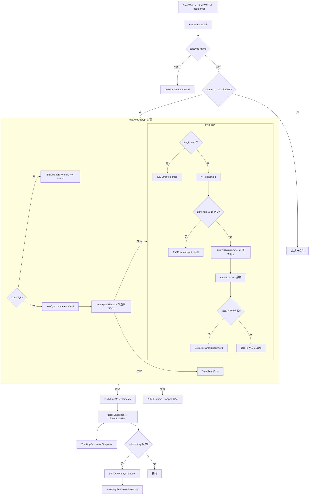

# Save 解密与解析

> 本文是 [`docs/BUSINESS-FLOWS.md`](../BUSINESS-FLOWS.md) 的拆分章节之一。**业务流程的单一真理源仍是主索引文件**——任何业务逻辑改动仍需先查阅本文件，落地后同步更新；本文件只是承载正文，便于按需加载。
>
> 从磁盘上的加密存档到结构化快照：文件轮询、AES/ES3 解密、快照解析与字段语义。
>
> 所有文件路径以仓库根为基准（`app/src/...`）。

> ← [主索引](../BUSINESS-FLOWS.md) · 上一竧[启动与配置](01-startup-and-config.md) · 下一竧[Tracker 双路径](03-tracker.md) · 章节：§3

---

## 3. Save 解密与解析

### 流程图

轮询主流程 + 读取/解密细节（subgraph）；失败时不前进 mtime，下次 poll 重试，是处理 mid-write 的关键。

### 3.1 SaveWatcher 轮询（`app/src/main/saveWatcher.ts`）

**构造参数** `SaveWatcherOptions`：`path`、`password`、`pollMs`、`onSnapshot`、`onError`、`onInventory?`、`parseInventorySnapshot?`。

**`start()`**：立即 `tick()` 一次，然后 `setInterval(tick, pollMs)`。

**`tick()`** 流程：

1. `statSync(path).mtimeMs` 取 mtime；失败（文件不存在）→ `onError("Save file not found: ...")` 返回。
2. mtime 等于 `lastMtimeMs` → 直接返回（未变化）。
3. `readAndDecrypt(path, password)` → `{ text, mtime }`。失败抛 `SaveReadError`。
4. 成功：`lastMtimeMs = mtimeMs`，`parseSnapshot(text, mtime)` → `SaveSnapshot` → `onSnapshot(snap)`。
5. 若 `onInventory` 提供：调用 `parseInventorySnapshot ?? parseInventory` 解析 inventory → `onInventory(inv)`；解析失败仅 `log.error`，不影响主流程。
6. **错误处理**：捕获到 `SaveReadError` 或其它异常时**不更新 `lastMtimeMs`** → 下次 tick 会重试。这是处理 mid-write sharing violation 的关键设计：游戏写文件时部分块未刷盘 → AES 块大小校验失败 → 抛错 → 不前进 mtime → 下次 poll 重试。

首次成功读取时 `log.info("First save read OK (stage ${snap.stageKey})")`。

### 3.2 readAndDecrypt（`app/src/main/io/saveFile.ts`）

`readAndDecrypt(path, password=DEFAULT_PASSWORD) → { text, mtime }`：

1. `existsSync(path)` 检查；不存在 → `SaveReadError("Save file not found")`。
2. `mtime = statSync(path).mtimeMs / 1000`（秒级 epoch）。
3. `readBytesShared(path)`：4 次重试，每次失败 `sleepSync(50ms)`（用 `Atomics.wait` 阻塞）。处理 Windows 文件被占用场景。4 次都失败 → `SaveReadError("Could not read save file: ...")`。
4. `es3.decryptToText(raw, password)` → UTF-8 文本；失败包装成 `SaveReadError`。
5. 返回 `{ text, mtime }`。

### 3.3 ES3 解密（`app/src/core/es3.ts`）

文件布局：`[16-byte IV/salt][AES-CBC ciphertext]`。Key 派生：`PBKDF2-HMAC-SHA1(password, salt=IV, iterations=100, dklen=16)`。Cipher：AES-128-CBC + PKCS7 padding。明文：UTF-8 JSON。

`decrypt(data: Buffer, password=DEFAULT_PASSWORD) → Buffer`：

1. `data.length <= 16` → `Es3Error("File is too small")`。
2. `iv = data[0:16]`，`ciphertext = data[16:]`。
3. `ciphertext.length % 16 !== 0` → `Es3Error("Ciphertext length is not a multiple of AES block size (save may be mid-write)")` — mid-write 检测关键。
4. `key = pbkdf2Sync(password, iv, 100, 16, "sha1")`。
5. `createDecipheriv("aes-128-cbc", key, iv)` + `setAutoPadding(false)`（手动剥 PKCS7）。
6. 检查最后一个字节 `pad`，必须 1..16 且 ≤ padded.length，且末尾 pad 字节全等于 pad → 否则 `Es3Error(WRONG_PASSWORD)`。
7. 返回 `padded.subarray(0, padded.length - pad)`。

### 3.3b ES3 解密的 Web 路径（`app/src/core/es3Web.ts`）

网页版（`pnpm build:web`）在构建期用 `core/es3Web` 替换 `core/es3`（见 `app/vite.web.config.ts` 的 `browserSafeCoreModules` 插件），因为浏览器里没有 `node:crypto`。两者**算法完全一致**（同样的 PBKDF2-HMAC-SHA1/100 迭代/16 字节 key、AES-128-CBC），但有两处必须留意的差异：

| 维度 | `es3.ts`（桌面） | `es3Web.ts`（网页） |
| ---- | ---------------- | ------------------- |
| 同步性 | 同步（`pbkdf2Sync` + `createDecipheriv`） | 异步（WebCrypto 全异步），API 返回 `Promise` |
| 字节输入 | `Buffer` | `Uint8Array` / `ArrayBuffer` |
| PKCS7 padding | `setAutoPadding(false)`，**手动剥除** | **WebCrypto 自动校验并剥除**，不能再剥一次 |
| 密码错误 | 手动比对 pad 字节 → `Es3Error(WRONG_PASSWORD)` | `subtle.decrypt` 抛 `OperationError` → 捕获后转 `Es3Error(WRONG_PASSWORD)` |

两个必须遵守的实现约束：

1. **不要手动剥 padding。** WebCrypto 没有 `setAutoPadding(false)` 这种模式，它总是校验并自动剥除 PKCS7。若在 `es3Web` 里再剥一次，明文的最后一个字节（通常是 JSON 的 `}` = `0x7D` = 125）会被误读成 padding 长度 125，触发 `pad > 16` 检查，从而抛出**假的 `WRONG_PASSWORD`** —— 表现为「密码正确但解不开」。

2. **拷贝字节必须用 `new Uint8Array(view)`。** 不能写 `view.slice().buffer`：`node:fs` 与 Electron IPC 返回的是 Node `Buffer`，它**覆盖了 `slice`**，返回的不是拷贝而是同一块内存的视图，`.buffer` 仍指向原始的多百 KB `ArrayBuffer`（`slice()` 只重置 `byteOffset`）。这会让 WebCrypto 用错误的 salt 派生密钥，同样表现为假的 `WRONG_PASSWORD`。`new Uint8Array(view)` 走 TypedArray 构造器逐元素拷贝，不受 `Buffer` 覆盖影响。

**等价性守卫**：`app/test/web/es3Parity.test.ts` 用真实存档比对两条路径的最终明文字节；`app/test/web/savePipeline.test.ts` 覆盖端到端（解密 → parse → resolve → 本地化）。**任何改动 `es3` 加解密契约的 PR 都必须同时核对 `es3Web` 并保证这两个测试通过。**

### 3.4 parseSnapshot（`app/src/core/save/snapshot.ts`）

`parseSnapshot(decryptedText, saveMtime=0) → SaveSnapshot`：

1. `root = JSON.parse(decryptedText)`。
2. `player = unwrapEs3Entry(root.PlayerSaveData)` — ES3 顶层每个 key 是 `{__type, value}` 包装，`value` 经常是 JSON 字符串需二次 parse。`unwrapEs3Entry` 自动处理：若 value 是 string 且 trim 后以 `{` 或 `[` 开头则 try `JSON.parse`，失败保留原值。
3. `PlayerSaveData` 缺失 → `SaveReadError("PlayerSaveData missing or malformed")`。
4. **heroes**：遍历 `player.heroSaveDatas[]`，提取 `heroKey`（转 string）、`HeroLevel`（truncate）、`HeroExp`、`IsUnLock`；累加 `totalHeroExp`。
5. **gold**：遍历 `player.currenySaveDatas[]`，找 `Key === 100001`（GOLD_KEY）的 `Quantity`。
6. **commonSaveData**：提取 `playTime`、`currentStageKey`（truncate）、`currentStageWave`、`maxCompletedStage`。
7. 返回 `SaveSnapshot`：`{ heroes, totalHeroExp, playTime, saveMtime, stageKey, stageWave, maxStage, gold }`。

**注意**：`SaveSnapshot` 不直接包含 chest slots / items / pets。这些在 `InventoryService.parseFromSave` 与 `PetService.onSave` 中独立解析（基于同一 `decryptedText`）。

### 3.5 SaveSnapshot 字段含义（`app/shared/types.ts`）

| 字段           | 类型             | 含义                                                    |
| -------------- | ---------------- | ------------------------------------------------------- |
| `heroes`       | `HeroSnapshot[]` | 每个英雄的 key/level/exp/unlocked                       |
| `totalHeroExp` | number           | 所有英雄 exp 之和（用于会话级 XP 增量）                 |
| `playTime`     | number           | 游戏内 playTime                                         |
| `saveMtime`    | number           | save 文件 mtime（epoch 秒）— 用作所有速率计算的时间基准 |
| `stageKey`     | number           | 当前关卡 4 位编码（难度×1000+act×100+stage）            |
| `stageWave`    | number           | 当前 wave                                               |
| `maxStage`     | number           | 历史最高已完成关卡                                      |
| `gold`         | number           | 当前金币                                                |
