# Tracker 双路径

> 本文是 [`docs/BUSINESS-FLOWS.md`](../BUSINESS-FLOWS.md) 的拆分章节之一。**业务流程的单一真理源仍是主索引文件**——任何业务逻辑改动仍需先查阅本文件，落地后同步更新；本文件只是承载正文，便于按需加载。
>
> save 路径与 live memory 路径的速率追踪、所有权模型、跨级 XP 桥接与对账。
>
> 所有文件路径以仓库根为基准（`app/src/...`）。

> ← [主索引](../BUSINESS-FLOWS.md) · 上一竧[Save 解密与解析](02-save-decrypt-and-parse.md) · 下一竧[LiveMemory 实时读取](04-live-memory.md) · 章节：§4

---

## 4. Tracker 双路径业务流程

### 流程图

双路径所有权模型：save 路径与 live 路径（~25Hz）各管其指标；`LIVE_TAKEOVER_SEC=5`，live 5s 无帧则 save 接管并 handover 重置基线。

```mermaid
%% TBH flow diagram
flowchart TD
  Tracking[TrackingService 持有 XpTracker / ChestDropTracker / BoxOpenTracker / DpsTracker / SaveWatcher / tickTimer]
  Tracking --> UpdateSnap[XpTracker.update save 路径]
  Tracking --> UpdateLive[XpTracker.updateLive live 路径 ~25Hz]
  subgraph savePath [save 路径 update]
    First{首次初始化?}
    First -- 是 --> Init[写入 prevHero + RateMeter init 返回 0]
    First -- 否 --> Driving{live 5s 内有帧?}
    Driving -- 是 --> SkipSave[跳过 save 处理 由 live 接管]
    Driving -- 否 --> Handover{之前 live owning?}
    Handover -- 是 --> ResetBase[handover 重置基线不计 gain]
    Handover -- 否 --> Delta[heroDeltaGain 跨级桥接 + updateGold 仅计正向 delta]
    ResetBase --> Next1[继续速率计算]
    Delta --> Next1
    Next1 --> Gain1{gain > 0?}
    Gain1 -- 是 --> Acc1[累加 + prune + recomputeRates + push HistoryEntry cap 500]
    Gain1 -- 否 --> End1[结束]
  end
  subgraph livePath [live 路径 updateLive]
    NotInit{已初始化?}
    NotInit -- 否 --> Return2[直接 return 须先有 save]
    NotInit -- 是 --> TakeOver{首次接管?}
    TakeOver -- 是 --> Restore[liveGold / liveXp.restore 基线重置 + reanchor]
    TakeOver -- 否 --> Guards[逐 hero 校验 exp ≤1e12 / level-drop / same-level dip]
    Guards --> Gain2{gain 通过 plausibleLiveHeroGain ≤1e7?}
    Gain2 -- 否 --> RefreshOnly[meter.refreshRolling]
    Gain2 -- 是 --> Sync[applyGain + syncXpFromLiveMeter]
    Sync --> Heal[healInflatedXpTotals 自愈]
    Heal --> Push2[push HistoryEntry]
  end
  class Tracking,Init,ResetBase,Delta,Next1,Acc1,Restore,Guards,Sync,Heal,Push2,RefreshOnly data
  class First,Driving,Handover,Gain1,NotInit,TakeOver,Gain2 dec
```



`TrackingService`（`app/src/main/services/TrackingService.ts`）持有：

- `XpTracker`（XP/金币会话与速率）
- `ChestDropTracker` + `LiveChestDropAggregator`（宝箱掉落计数）
- `BoxOpenTracker`（宝箱开启结果）
- `DpsTracker`（伤害/击杀）
- `SaveWatcher`
- 1Hz `tickTimer` + ~5Hz live broadcast 节流

### 4.1 XpTracker 双路径所有权模型（`app/src/core/tracker.ts`）

`LIVE_TAKEOVER_SEC = 5`：live 路径在 5 秒内有过帧 → "live owning"，save 路径不再处理该指标（XP 和 gold 各自独立判断）。live 帧停 5 秒 → save 路径接管，并执行 "handover"：重置基线到 save 值，不计增益（避免基线混合导致 totals 爆炸）。

#### 4.1.1 update(snap: SaveSnapshot) — save 路径

1. `now = Date.now()/1000`，`mtime = snap.saveMtime || now`，`heroes = snap.heroes`。
2. **首次初始化**：每个 hero 写入 `prevHero`（level+exp），创建 `RateMeter(rollingWindow)` 并 `init(mtime)`；`prevGold = snap.gold`；初始化 `samples`、`goldSamples`、`firstMtime`、`lastChangeMtime` 等；返回 0。
3. **判定 live 是否 driving**：`goldLiveDriving = lastLiveGoldSec !== null && now - lastLiveGoldSec < 5`；`xpLiveDriving` 同理。
4. **Gold save 路径**（`!goldLiveDriving`）：
   - 若 `goldLiveOwning` 为 true（之前是 live 接管）→ handover：`goldLiveOwning = false`，`prevGold = snap.gold`（不计 gain）。
   - 否则 `updateGold(snap.gold, mtime)`：仅计正向 delta（金币会被消耗，所以负 delta 忽略），累加到 `goldGained`，更新 `goldSamples`，重算 `goldRollingRateValue` 与 `goldSessionRateValue`。
5. **XP save 路径**（`!xpLiveDriving`）：
   - 若 `xpLiveOwning` → handover：`xpLiveOwning = false`，`currentTotalXp = snap.totalHeroExp`，每个 hero 重置 `prevHero`（不计 gain）。
   - 否则遍历 heroes，对每个 hero 调用 `heroDeltaGain(prev, level, exp)`（见 4.4），累加 gain；更新 `prevHero`；`meter.add(heroGain, mtime)`。
   - 若 `gain > 0`：累加 `cumulativeGained`，更新 `samples`、`lastGainMtime`、`lastChangeMtime`，`prune(mtime)`，`recomputeRates()`；push HistoryEntry（cap 500）；触发 `onHistory` 回调。
6. 返回 gain。

#### 4.1.2 updateLive(data, wallTimeSec, stage?) — live 路径

`data: { gold, heroes }`，~25 Hz 调用。`!initialized` 时直接 return（必须先有 save 解析）。

- **Gold live**：
  - takingOver = `!goldLiveOwning`；`goldLiveOwning = true`；`lastLiveGoldSec = wallTimeSec`。
  - gain = takingOver ? 0 : `max(0, gold - prevGold)`；`prevGold = gold`。
  - takingOver 时 `liveGold.restore(goldGained, [[wallTime, goldGained]], wallTime, 0, 0)`（基线重置）；否则 `liveGold.applyGain(wallTime, gain)`。
  - 同步 `goldGained = liveGold.sessionTotal`，刷新 `liveGold.refresh(wallTime, rollingWindow)` → 同步 `goldRollingRateValue`、`goldSessionRateValue`、`goldSamples`、`goldFirstMtime`。
- **XP live**：
  - takingOver 时：`seedTotal = isPlausibleCumulativeXp(cumulativeGained, elapsed) ? cumulativeGained : 0`；`liveXp.restore(...)`；`cumulativeGained = seedTotal`；`prevHero.clear()`；每个 hero 写入 `prevHero`；现有 `heroMeters` 调 `meter.reanchor(wallTimeSec)` 重置时间基准（避免 save mtime 与 live wallTime 混用导致 session 速率看起来比 hero 速率高）。
  - 持续路径：对每个 hero：
    - `plausibleHeroRuntimeExp(h.exp)` 校验（≤1e12）。
    - **level-drop guard**：`prev.level > h.level` → 跳过（dirty read，不计数不前进基线）。
    - **same-level dip guard**：`prev.level === h.level && h.exp < prev.exp` → 跳过计数但 `meter.refreshRolling`。
    - `heroDeltaGain(prev, level, exp)` 计算 gain。
    - `plausibleLiveHeroGain(heroGain)` 校验（≤1e7/tick）。
    - 通过则 `gainSum += heroGain`，`meter.add(heroGain, wallTime)`；否则只 `meter.refreshRolling`。
  - `gain = plausibleLiveHeroGain(gainSum) ? gainSum : 0`。
  - `gain > 0` → `liveXp.applyGain`，更新 `lastGainMtime`/`lastChangeMtime`。
  - `currentTotalXp = sum(hero.exp)`，`syncXpFromLiveMeter(wallTime)`：同步 `cumulativeGained`、`rollingRateValue`、`sessionRateValue`、`samples`、`firstMtime`，刷新所有 heroMeters，`healInflatedXpTotals(wallTime)`（自愈）。
  - `gain > 0` → push HistoryEntry。

### 4.2 滚动窗口与速率计算

- **RateMeter**（save 路径，per-hero）：`samples: [mtime, gained][]`。`add` 时 push 样本并 `refreshRolling(mtime)`：弹出窗口外的样本（窗口 = `rollingWindow` 秒），`rolling = (gained - g0) / (mtime - t0) * 3600`。
- **LiveSessionMeter**（live 路径，session 级）：`sessionTotal` + `samples` + `firstAnchor` + `rolling` + `sessionRate`。`refresh` 类似 RateMeter 但用 wallTime。
- **sessionRate**（getter）：用真实会话总时长 `(now - sessionStart)`，而非"首次到末次 XP 增益时长"，避免挂机后 sessionRate 卡在高位不衰减。
- **rollingRate**：滚动窗口内的速率。
- **goldRate** / **goldSessionRate**：gold 的对应版本。

### 4.3 trackerLimits（`app/src/core/trackerLimits.ts`）

- `MAX_PLAUSIBLE_XP_RATE = 5e10`（XP/hour 上限）。
- `MAX_PLAUSIBLE_CUMULATIVE_XP = 1e10`（session XP 总量上限）。
- `isPlausibleXpRate(rate)`：finite、≥0、< MAX_PLAUSIBLE_XP_RATE。
- `isPlausibleCumulativeXp(total, elapsedSec)`：finite、≥0、< MAX_PLAUSIBLE_CUMULATIVE_XP；若 elapsed>0 则隐含速率也必须 < MAX_PLAUSIBLE_XP_RATE。

### 4.4 跨级 XP 桥接（`heroDeltaGain`，`app/src/core/tracker.ts:118`）

```
heroDeltaGain(prev, curLevel, curExp) → number
```

- `prev === undefined` → 0。
- **Level-up reset**：`curExp < prev.exp` → 直接返回 `curExp`（英雄升级时把上一级 XP 银行化并重置 within-level 计数器，新 curExp 就是 reset 后的 gain）。
- **Level curve 路径**（`prev.level > 0 && curLevel > 0`）：调用 `perHeroGain(prev.level, prev.exp, curLevel, curExp)`（`app/src/core/levelCurve.ts`）。
  - 同级：`exp1 - exp0`（cap 状态返回 0，避免 phantom XP）。
  - 升级：`xpThroughLevelUp(lv0, exp0, lv1, exp1)` = `(curve[lv0] - exp0) + Σ curve[intermediate] + exp1`（最终级若超 cap 则不加 exp1）。
  - curve 是 hardcoded level→total XP 表（levels 1-100）。
- **Fallback**（level 未知）：`max(0, curExp - prev.exp)`。

### 4.5 healInflatedXpTotals（自愈）

`syncXpFromLiveMeter` 末尾调用。检查 `cumulativeGained`、`sessionRateValue`、`rollingRateValue`、所有 `heroMeters.gained` 是否通过 `isPlausibleCumulativeXp` / `isPlausibleXpRate`。未通过则用 rollingRate 推算 healedTotal，重置 liveXp 与越界的 heroMeters。

### 4.6 buildStats（`app/src/main/stats.ts`）

`buildStats(tracker, chestDropTracker, boxOpenTracker, dpsTracker, lastSnap, lastError, statusOverride, liveFrame, boxOpenPriceResolver, lootStatus, catalog) → Stats`

**live-preferred / save-fallback blend 策略**：

- `liveXp = liveFrame?.connected === true && tracker.xpLiveActive()` — live 帧已连接且 5 秒内有数据。
- **heroes**：liveHeroes 为 true → 用 `liveFrame.heroes` 构造 `HeroRate[]`（含 `heroLevelEstimate` 计算 `xpToNextLevel` 和 `timeToLevelSec`）；否则用 `lastSnap?.heroes ?? tracker.heroes`，过滤 `unlocked || exp > 0`。
- **heroes live/save 交叉单调性闸门（v1.2.4，2026-09-17）**：live 英雄等级不再被无条件信任。`buildStats` 先由 `lastSnap.heroes`（存档英雄，权威下界）建 `saveHeroLevelByKey: Map<heroKey, level>`，再调用 `liveHeroFrameTrustworthy(liveFrame.heroes, saveHeroLevelByKey)`（`core/tracker.ts`）：对 live 帧中每个 heroKey，若存档已知该英雄等级且 live 等级 **低于** 存档 → 该帧不可信（返回 false）。v1.2.4 偏移表 fallback 到 1.2.2 使 `runtime.ts:1311` 的 `heroRuntime` 解码产生垃圾 → 等级被 `level > 0 && level <= 200 ? level : 1` 地板到 1，若直接采信会把已 L100+ 的英雄"回退"成 L1。闸门命中（`liveHeroesTrusted=false`）→ live 分支整体回退到 `saveHeroes ?? []`，保留真实存档等级；闸门通过则照常采信 live 等级。**关键正确性**：存档中本就 L1 的英雄（如 `501:L1/e0`、`601:L1/e0`）其 `saveLevel===1` 且 live 报 1 不"低于"下界 → 仍判可信，不被误杀（回归测试 `test/main/stats.test.ts` 覆盖：v1.2.4 帧回退到 save 取 L101、匹配/超 save 仍取 live L102）。`goldLiveSuspect` 同样经 Stats 透出（`stats.goldLiveSuspect = tracker.goldLiveSuspect`，`shared/types.ts` `Stats` 接口新增可选字段），供 `SaveStatusBar` 渲染陈旧金币警示。
- **stageKey**：live 优先（`liveFrame.stageKey`），否则 `lastSnap.stageKey ?? 0`。
- **stageWave**：live `stageWave`（**必须 > 0**）→ `dpsTracker.currentWave`（怪物数量波次判断，**无论 live 是否连接**都参与）→ `lastSnap.stageWave`（兜底），并**以 `stageWaveTotal` 封顶**（wave 超过关卡总波次时显示总数，防止漏检 stage clear 导致的跨局累计显示成 "30/16"）。
- **stageWaveTotal 符文减波修正**：live 读到的总波次（`StageInfoData.waveAmount`）在 `TrackingService.ingestLiveFrame` **单点**用存档符文减波数修正为 `max(1, raw − runeWaveReduction)`。`runeWaveReduction` 由 `appState` 存档回调用 `runeWaveCountReduction(chests.getRunePurchases(), loadRuneWaveCatalog())` 计算并 `setRuneWaveReduction` 下推——数据源为 `data/rune_wave.json`（Rune of Brevity 的 `WaveCountReduction` 节点，含 1171/1242/1301，各 −1 波）。修正只作用于 `stageWaveTotal`，不影响 `stageWave`/`stageKey`/`stageAlive`/heroes/DPS；`runeWaveReduction === 0` 时逐字节等同旧行为（不创建副本）。该单点修正使下方 run-end 重置判据（`currentWave >= stageWaveTotal`）与显示（`buildStats`）基于同一有效总波次。若 `raw <= reduction`（钳制到 1），`warnClampedWaveTotal` 打节流 warn——这通常是"游戏运行时 `waveAmount` 已内建减波导致重复扣"的信号。`> 0` 校验防止**已漂移的 StageManager runtimeWave 偏移**（如 v1.01.05 的 +0x138 恒读 0）把 0 当作权威值、屏蔽后续 fallback —— 否则 mini 悬浮窗波次会永久卡在 `0/N`。`dpsTracker.currentWave` 由怪物数量（HP 数组或 StageManager alive 计数）驱动，因此即使 live 波次字段缺失/无效、甚至 live 帧断开，只要 DpsTracker 有怪物数量波次判断就用它，最后才落到 save 的静态值。**stale 波次清洗（2026-09-02）**：实测 v1.01.05 的 runtimeWave +0x138 还可能读到**恒定的非零值**（实测恒 2，怪物清波循环 25+ 波不变）——过 `> 0` 校验后被当作权威，UI 波次永久卡在 "2/31"。修复：`liveReader` 层 `StaleWaveGuard`（`core/liveMemory/staleWaveGuard.ts`）跟踪「同一非零值持续 ≥ 8s 且期间怪物存活数发生过 0↔N 波切换」→ 判定 stale → `stageWave` 报 null，stats 自动回落到怪物计数推断；数值一旦变化立即恢复信任。日志 `stale live wave N — constant across wave transitions; falling back to monster-count wave estimate`（一次性）。
- **status**：`statusOverride` > `lastError` > `secondsSinceGain > 120 ? "No XP gained for Xs..."` > `"Tracking"`。
- **saveStale（2026-09-17）**：TrackingService 连续 ≥3 次（`SAVE_STALE_ERROR_THRESHOLD`）save 读取/解析失败 → `stats.saveStale=true`，成功即复位。含义：`lastSnap` 派生的全部数值（金币余额、关卡、英雄、进度）均为**失败前旧值**——典型场景是游戏更新改了 ES3 密码/布局导致解密持续失败，UI 却继续显示更新前数据（"金币回退"的另一根源）。SaveStatusBar 显示 `saveStatusStale` 警示；另在首个"heroes 与 gold 全空"的解析结果上打一次格式漂移 warn。
- **secondsSinceRead**：`nowSeconds() - lastSnap.saveMtime`（save 内容年龄，非 poll 间隔）。
- 其它字段：rollingRate、sessionRate、goldRate、cumulativeGained、goldGained、elapsed、secondsSinceGain、stageName（用 catalog 本地化）、history（visible 50 条，每条带 stageName）、chestDrops、boxOpens、dps、mapDamage、mapMobsKilled、sessionDamage、sessionMobsKilled、aliveMonsters、hpSum、hpMaxSum。
- **chestDrops 速率计时锚定**：`commonPerHour` / `rarePerHour` / `actPerHour`（及 `*RecentPerHour` 滚动 1h）由 `ChestDropTracker` 计算。会话速率窗口锚定到 `min(开始追踪时刻, 首个掉落的墙钟)`，因此等待首个箱子掉落的时间会计入分母——启动 6 分钟后落下的第 1 个普通箱子显示约 10/hr，而不是旧行为（锚定首个掉落 + 60s 下限截断）产生的 60/hr 虚高；而早于启动的历史/恢复掉落仍锚定其真实掉落时间。`applySnapshot`（restore）会把窗口覆写为**最早恢复的掉落**，使跨空闲时段的恢复历史仍计入速率，避免被削减为 0。窗口下限截断 `MIN_RATE_WINDOW_SEC=60` 保留，仅用于防止刚起步的秒级除以零/荒谬峰值。**恢复锚点持久化（2026-09-11 修复）**：`captureSnapshot` 现将 `sessionDropStart` 一并写入快照，`applySnapshot` 优先采用该持久化锚点（与最早恢复条目取 `min`，旧快照缺失时回退最早恢复条目）。修复前恢复只锚定 `history[0]`，而 `history` 被 `HISTORY_LIMIT=500` 截断、`countsByKey` 不截断——单次运行掉落超过 500 后，重开应用的 perHour 分子覆盖整个会话、分母却从截断后的时间窗算起，导致速率虚高（实测 600 掉落/6h 会话恢复后显示 ~119/hr，真实 ~99/hr）。
- **chestDrops 地图感知分母（2026-09-11）**：普通图与瘟疫图是互斥的地图类型（见 `isPlagueStage`），common/rare/act 只会在普通图掉落，plagueCommon/plagueRare/plagueAct 只会在瘟疫图掉落。若所有宝箱类别共用「总墙钟时间」作分母，混合两种地图的会话会把「刷另一类地图的时间」也算进本类速率的分母，导致速率被稀释（例如 1h 普通图爆 30 箱 + 1h 瘟疫图爆 15 箱：普通 30/(2h)=15/hr 而被低估为真实 30/hr）。修复：`ChestDropTracker` 新增 `noteMapTime(stageKey, at)`，由 `TrackingService.ingestLiveFrame` 每一实时帧喂入；依据当前 `stageKey`（`isPlagueStage` 判定，区分 4 位普通 key 与 6 位瘟疫 key；null/未知关不归属任何桶）把相邻帧墙钟差累积为 `normalMapSec` / `plagueMapSec`（会话级）及 1h 滚动 `rollingNormalSec` / `rollingPlagueSec`（segment 双端队列增量维护，超出 `ROLLING_HOUR_SEC=3600` 的段被剪枝）。`getStats` 中：普通三类速率分母 = `max(MIN_RATE_WINDOW_SEC, normalMapSec)/3600`，瘟疫三类 = `max(…, plagueMapSec)/3600`；`*RecentPerHour` 同理用滚动值。调用侧（`TrackingService.ingestLiveFrame`）以 `snap.stageKey ?? lastLiveStage?.stageKey` 喂入，与掉落分类同源兜底——某帧 `stageKey` 为空时不归 null 桶而是沿用上一已知关卡，避免地图时间静默停滞。当某桶无累积地图时间（未附加实时内存 / 恢复后尚无新帧）时，**回退原总时间口径**（会话用 `hours`、滚动用 `recentHours`），保持纯存档模式行为不变、避免分母为 0 导致速率虚高。`captureSnapshot` 持久化 `normalMapSec`/`plagueMapSec`（滚动值属短期指标不入快照），`applySnapshot` 在恢复后重置采样锚点与滚动队列，避免首帧跨离线空档误计；`reset` 清空全部地图时间。测试：`test/core/chestDropTracker.test.ts` 的 `map-type-aware rate denominator` 块覆盖会话/滚动/回退/剪枝/重置/恢复六种情形。
- **chestDrops 滚动小时速率窗口与突刺保护（2026-09-12）**：`*RecentPerHour`（滚动 1h 速率）的分母 = `min(ROLLING_HOUR_SEC=3600, now − 首个 recent 掉落)`——即**从窗口内第一个掉落开始计时**（`earliestRecentWallTime`），会话刚起步时不被整 1h 分母稀释、也不受等待首个掉落的空闲时间影响（该语义只属于会话速率）。在此基础上新增 `RECENT_MIN_WINDOW_SEC=300` 下限（会话速率的 `MIN_RATE_WINDOW_SEC=60` 不变）：仅有 60s 下限时，一次 4 连 burst 落在首分钟内会读出 4/(60/3600)=240/hr 的荒谬峰值；300s 下限把同一 burst 压到 48/hr，而稳态速率不受影响（连续刷取会话的分母要么是整 1h 窗口、要么是 ≥300s 的真实累计）。地图感知滚动分母（`rollingNormalSec`/`rollingPlagueSec`）同样使用 300s 下限，防止新累积的地图时间内 burst 突刺。测试：`test/core/chestDropTracker.test.ts` 的 `rolling recent-rate window` 块。
- **boxOpens 买断价币种（2026-09-11 修复）**：`TrackingService.buildBoxOpenPriceResolver` 解析掉落物品买断价——主路径用库存求购订单簿（`itemordershistogram`，**用户本币**，深度感知即时出售）；兜底用 CI lookup 快照 `prices[hash]`（**USD** `lowest_price`）。旧实现兜底直接返回 USD 数值未换算，非 USD 用户（如 CNY）会把 $0.03 显示成 ¥0.03（人民币地板价是 ¥0.10，明显偏低）。修复：兜底优先用快照本币字段（`buyOrderLocal` → `pricesLocal`，本地 polling 直抓目标币，无 FX 圆整误差）；否则 `usd × fx[currency]`（快照 `fx` 缺失该币时回落 USD 原值）。`TrackingService.setCurrency` 由 appState 在启动（`config.currency`）与货币切换（`setCurrency` IPC）时注入。

### 4.7 blend.ts 纯函数（`app/src/core/liveMemory/blend.ts`）

```ts
export function pickPreferLive<T>(live: T | null | undefined, save: T): T {
  return live ?? save;
}
export function blendStage(live, save) {
  return {
    stageKey: pickPreferLive(live?.stageKey, save.stageKey),
    stageWave: pickPreferLive(live?.stageWave, save.stageWave),
  };
}
```

`stats.ts` 没有直接调 `blendStage` —— 它把 blend 逻辑内联了，因为 stageWave 有第三级 fallback（dpsTracker.currentWave），无法用纯 `pickPreferLive` 表达。`blend.ts` 是给其他消费者（如 `TrackingService.rebuildStatsAfterSave`）使用的单一真理源。

### 4.8 detectHeroLevelUps（`app/src/core/heroes/detectLevelUps.ts`）

```
detectHeroLevelUps(prev: HeroSnapshot[], next: HeroSnapshot[]) → HeroLevelUpEvent[]
```

`prev.length === 0` → `[]`（首次解析不触发）。否则用 `prevByKey = Map(prev.map(h => [h.key, h.level]))`，遍历 next 找 `hero.level > previousLevel` 的英雄，返回 `{ key, previousLevel, newLevel }[]`。

### 4.9 TrackingService 1Hz tickTimer

- `autoClassify?.tick()`（无论是否 broadcast 都跑，保证 prompt 超时与队列 prune 准确）。
- **stale-frame guard**：若 `lastLiveFrame` 超过 5000ms 未更新 → 清空 `lastLiveFrame` 和 `lastLiveStage`，避免 worker 崩溃后 stage/DPS 卡死。
- **节流**：若距上次 live broadcast < 200ms（`LIVE_BROADCAST_INTERVAL_MS`）→ 跳过 pushStats；否则 `pushStats()`。

### 4.10 gold 突变防护与恢复对账（2026-09-17）

XP 早有 per-tick 上限（`MAX_LIVE_XP_GAIN_PER_TICK`，4.1/4.5）与自愈，gold 此前**没有**——游戏更新使 LiveMemory 偏移失效或迁移余额时，错误读数/跳变会以"当前值"进入会话统计，表现为金币回退或虚高。三层防护 + 一个 stale 上限：

- **live per-tick 上限**：`applyLiveGold` 单 tick（40ms）增益 > `MAX_LIVE_GOLD_GAIN_PER_TICK=1e7` → 增益记 0，但基线照常推进（`prevGold=gold`，持续跳变不会被永久拒绝）；显示值 `currentGold` 仍跟随真实读数。
- **save 路径速率护栏**：`updateGold` 用 `lastGoldParseMtime`（私有、不持久化；init 分支与 live→save handover 分支同样写入）计算两次解析间隔，增益隐含速率 ≥ `MAX_PLAUSIBLE_GOLD_RATE`（=5e10/h，复用 XP 速率上限）→ 不计入会话、基线已推进，下一次正常解析不受影响。
- **恢复对账 `reconcileGoldBaseline(saveGold, saveMtime, persistedLastMtime)`**：`SessionStateService.tryRestoreOnSnapshot` 在 `applySnapshot` 后、首次 `update()` 前调用（见 §10.4 第 5 步）。diff≤0 → noop；diff>0 且按离线 gap 的隐含速率 < 上限 → 计为一次性 bridging 收益（保持旧行为）；≥ 上限（典型：游戏更新迁移余额）→ 仅重锚基线（`prevGold=currentGold=saveGold`），日志 `Session gold baseline re-anchored to save (implausible jump …)`。
- **恢复快照金币校验**：`isPlausibleTrackerSnapshot` 新增 `currentGold`/`prevGold`/`goldGained` 的 `isPlausibleGoldBalance`/`isPlausibleCumulativeGold` 校验（`core/trackerLimits.ts`，上限 `MAX_PLAUSIBLE_CUMULATIVE_GOLD=1e15`），脏快照在恢复前即被丢弃（见 §10.4 第 3 步）。
- **live gold stale 上限**：`readRuntimeGold`（`core/liveMemory/runtime.ts`）所有读取路径失败时仅返回 `GOLD_STALE_MAX_MS=5000` 内的 `pin.lastKnown`（防 UI 闪烁），超龄返回 null——防止游戏更新后 25Hz 轮询把更新前余额当当前值无限回放（"金币回退"现象的直接根源之一）。`GoldPinState` 新增 `lastKnownAt`（成功读取时打点）。
- **ObscuredLong u64 掩码（2026-09-17，v1.2.4 修复）**：ACTk ObscuredLong 的解码公式 `(hidden - crypto) ^ crypto` 在 C# 是 ulong（mod-2^64）运算，但 JS BigInt 无回绕——当 hidden 的最高位为 1（int64 视角为负，v1.2.4 实测的 wallet 加密对即如此）时，未掩码的 BigInt 解码结果为负，`Number()` 后被 `plausibleGold` 拒绝 → `readGoldFromEntry` 恒 null → live 金币永久失效。修复：与 `readObscuredInt`（英雄等级，本就有 `& 0xffffffff`）对齐，`readObscuredLong` 改为 `((hidden - crypto) & U64) ^ crypto) & U64`。此 bug 与版本无关（1.2.2 只是数据巧合未触发），修复对旧版本行为不变。
- **live/save 发散守卫 + 陈旧标记（v1.2.4，2026-09-17）**：`TrackingService.ingestLiveFrame` 在 `lastLiveFrame = snap` 之前，先用 `evaluateGoldDivergence(snap.gold, saveGold, goldDivergeSinceSec, snap.at/1000, GOLD_DIVERGE_SUSTAIN_SEC=8)`（`core/tracker.ts`）比对 live 读数与上一存档余额 `saveGold = lastSnap?.gold`。当 `liveGold < saveGold`（live 读数低于存档"权威下界"，典型为偏移失效导致的回退/倒退）→ `substitute=true`，用 `saveGold` 覆盖 `snap.gold`，并首次触发时记 `goldDivergeSinceSec = snap.at/1000`；该"低于下界"状态**持续 ≥8s**（`nowSec - goldDivergeSinceSec >= sustainSec`）→ `suspect=true` 且 `tracker.goldLiveSuspect=true`，UI 经 `SaveStatusBar` 显示 `goldStatusStale` 警示（见 `shared/locales/*/live.json`）。读数与存档持平或更高（含 null 缺失）→ 复位 `goldDivergeSinceSec=null`、`goldLiveSuspect=false`。注意：`saveGold` 取自**会话内最近一次 save 解析**而非实时读数，因此它代表"游戏已落盘的已知最低余额"；live 永远不应低于它，低于即判为 stale。这是 §4.6 `saveStale` 之外的**第二道金币回退防线**，专门覆盖"save 解析仍成功、但 live 偏移失效读错"的情形（v1.2.4 偏移表 fallback 到 1.2.2 导致 `wallet gold` 读数错位）。
- **save 英雄经验合理性钳制（v1.2.4，2026-09-17）**：实测 v1.2.4 存档英雄 `exp` 高达 1.4e12，超过运行时解码上限 `MAX_HERO_RUNTIME_EXP=1e12` 的口径，会污染 `heroDeltaGain`/`healInflatedXpTotals` 的合理性判据。`tracker.update()` 在写入 `this.heroes` 时统一用 `clampHeroSaveExp(exp)`（`MAX_HERO_SAVE_EXP=1e15`）：非有限或负值归 0，超 1e15 钳到 1e15。init 与 live→save handover 两个分支同样钳制，保证 save 与 live 路径一致。该上限独立于运行时 1e12 上限——save 是累计总经验、量级本就更大，1e15 是为防脏存档（内存损坏/错误偏移写入）反噬统计而设的硬性天花板。
