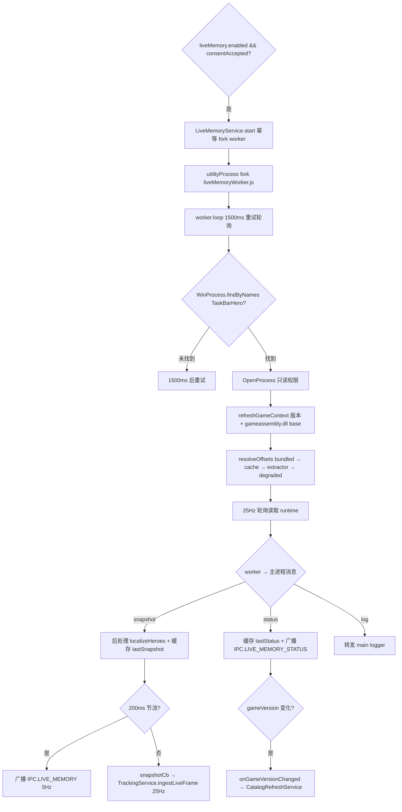
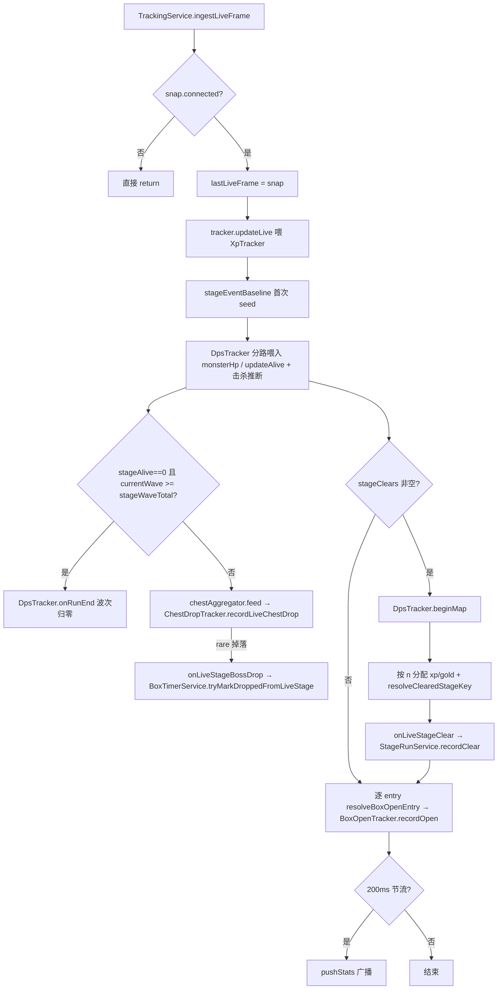

# LiveMemory 实时读取

> 本文是 [`docs/BUSINESS-FLOWS.md`](../BUSINESS-FLOWS.md) 的拆分章节之一。**业务流程的单一真理源仍是主索引文件**——任何业务逻辑改动仍需先查阅本文件，落地后同步更新；本文件只是承载正文，便于按需加载。
>
> 附加游戏进程、读取实时帧、偏移自愈、日志桶（掉落 / 开箱 / 通关 / 获得记录）读取与 worker 生命周期。体量最大的一章。
>
> 所有文件路径以仓库根为基准（`app/src/...`）。

> ← [主索引](../BUSINESS-FLOWS.md) · 上一竧[Tracker 双路径](03-tracker.md) · 下一竧[Inventory 与 Lookup](05-inventory-and-lookup.md) · 章节：§5

---

## 5. LiveMemory 业务流程

### 流程图

启动条件 → fork worker → 附加游戏进程 → 解析 offsets → 25Hz 轮询 → 三类消息回传主进程。



### 5.1 启动条件

`appState.ts`：

```ts
if (config.liveMemory.enabled && config.liveMemory.consentAccepted)
  liveMemory.start();
liveMemory.setOnSnapshot((snap) => tracking.ingestLiveFrame(snap));
```

三个前置条件：

1. `config.liveMemory.enabled` — 用户在 Settings 勾选开启 Live Memory。
2. `config.liveMemory.consentAccepted` — 用户确认"我知道这会读取游戏进程内存"同意弹窗。
3. **进程检测延后到 worker 内部** — `LiveMemoryService.start()` 不主动检测游戏进程；它只 fork worker，由 worker 的 `loop()` 在 `reader.attach()` 内通过 `WinProcess.findByNames(["TaskBarHero.exe", "TaskbarHero.exe"])` 寻找游戏。游戏未启动时 worker 进入 1500ms 重试轮询（`POLL_DETACHED_MS`）。

`LiveMemoryService.start()` 是幂等的（`if (this.child) return`），重复调用不会 fork 多个 worker。

### 5.2 utilityProcess worker 启动与消息协议

#### 5.2.1 fork 流程（`app/src/main/services/LiveMemoryService.ts:69-92`）

```ts
const workerPath = join(__dirname, "liveMemoryWorker.js");
this.child = utilityProcess.fork(workerPath, [], {
  serviceName: "tbh-live-memory",
  stdio: "pipe",
  env: { ...process.env, [LIVE_MEMORY_USER_DATA_ENV]: resolveUserDataDir() },
});
```

- electron-vite 把 `worker.ts` 编译到 `out/main/liveMemoryWorker.js`，与 main bundle 同目录。
- `stdio: "pipe"` — 主进程接管 worker 的 stdout/stderr；stderr 被截到 64KB 滑动窗口（`STDERR_MAX_BYTES`），便于崩溃诊断而不是无限增长。
- `LIVE_MEMORY_USER_DATA_ENV`（"TBH_USER_DATA"）— worker 通过它定位 offset cache 目录。

#### 5.2.2 消息协议

主→worker：纯字符串 `"stop"`。

worker→主：3 种 typed object：

```ts
type WorkerMessage =
  | { type: "snapshot"; snapshot: LiveMemorySnapshot }
  | { type: "status"; status: LiveMemoryStatus }
  | { type: "log"; message: string };
```

主进程接收端：

- **`snapshot`** — 后处理（注入本地化英雄名 `localizeHeroes`）→ 缓存为 `lastSnapshot` → 节流 200ms 广播给 renderer（`IPC.LIVE_MEMORY`）→ **不节流**地调用 `snapshotCb`（即 `tracking.ingestLiveFrame`）。tracker 拿到全 25Hz 数据用于精确采样，UI 只刷 5Hz。
- **`status`** — 缓存为 `lastStatus` → 立即广播给 renderer（`IPC.LIVE_MEMORY_STATUS`）→ 若 `gameVersion` 变化，触发 `onGameVersionChanged` 回调（被 `CatalogRefreshService` 接住）。
- **`log`** — 转发到 main logger。

`worker.ts` 的 `postStatusIfChanged`：序列化 `LiveMemoryStatus` 为 JSON 字符串作为 fingerprint，仅当 fingerprint 与上次不同才发 `status` 消息。把 25Hz 的状态噪声降到事件驱动。

### 5.3 worker 初始化流程

入口 `worker.ts:42-53`（顶层执行）→ `loop()`（`worker.ts:202-250`）。

#### 5.3.1 进程附加（`LiveMemoryReader.attach()`，`app/src/main/liveMemory/liveReader.ts:442-465`）

1. 若已 attached，直接调 `healOffsets()` 并返回。
2. 否则 `detach()` 清理上一次状态。
3. `WinProcess.findByNames(["TaskBarHero.exe", "TaskbarHero.exe"])`：
   - 先用 `CreateToolhelp32Snapshot(TH32CS_SNAPPROCESS)` 列所有进程，按名字匹配。
   - 若匹配为空，fallback `findViaPowerShell`。
   - 多实例（多个匹配）时按"沙箱状态一致"挑选（见 5.10）。
4. `OpenProcess(PROCESS_QUERY_INFORMATION | PROCESS_VM_READ)` — 只读权限，不要求管理员。
5. `refreshGameContext()`：
   - `detectGameVersion(proc)` — 找 `taskbarhero.exe` 模块的 path，读同目录 `Version.txt`，正则 `^\d+\.\d+\.\d+$` 校验。失败时保留之前的 gameVersion。
   - `gameAssembly(proc)` — 在模块列表里找 `gameassembly.dll`，取其 `baseAddress` 和 `size`。
6. 进入 `setScanning(true)`（触发 `onScanningChange` → worker 发 status）→ `resolveOffsets` → `applyResolvedOffsets` → `setScanning(false)`。

#### 5.3.2 ga base 解析

`ga = { base: bigint; size: number }`，来自 `WinProcess.listModules()` 找到的 `gameassembly.dll`。整个 IL2CPP 元数据扫描都限制在 `[ga.base, ga.base+ga.size)` 范围内，避免扫描整个地址空间（30-60s vs 几秒）。

如果 `listModules()` 返回空（沙箱拦截），三级 fallback（见 5.10）。三级都失败时 `ga=null` → `resolveOffsets` 在 `if (ga && version && cacheDir)` 处短路 → reader 处于 `attached=true, supported=false` 的"降级"状态。

#### 5.3.3 offsets 解析优先级与回退链路

`LiveMemoryReader.resolveOffsets()`（`liveReader.ts:566-807`）：

**Step 1 — Bundled 表**（`liveReader.ts:590-599`）：

- `offsetsForVersionMeta(version)` 返回 `{ table, fallback }`。
- 精确命中：`fallback=false`，`source="bundled"`。
- 同 major.minor 邻近版本命中：`fallback=true`，table 上贴 `_fallbackFromVersion: <bestVersion>`，`source="bundled"`。
- 都不命中：`base=null`，准备走纯 extractor 路径。
- **版本表现状（2026-09-17）**：内置 `offsets.ts` 覆盖 1.00.21 / 1.00.23 / 1.00.27 / 1.00.28 / 1.01.01 / 1.01.05 / 1.2.2 / **1.2.4**。**v1.2.4 表（2026-09-17 补录）**：游戏 12:28 更新 v1.2.4 后，缺表期间按同 major.minor 规则 fallback 到 1.2.2 RVA 基线——但 v1.2.4 重编译使**全部 5 个静态 TypeInfo RVA 漂移**（currencyManager 0x5f4b8c8→0x5f4a068、stageCacheManager→0x5f4adf8、stageManager→0x5f75838、logManager→0x5f43a78、monsterSpawnManager→0x5f23148），错误的 currencyManager 使 `readRuntimeGold` 每 tick 失败 → live 金币静默降级为 5s save 轮询（用户感知为"实时数据回退成 save 数据"；结构布局本身未变，`unit.cache`/`heroRuntime` 等沿用 1.2.2 值）。表由 `scripts/capture-live-offsets.ts` 从运行中的 v1.2.4 游戏（critical path，gold probe 通过）捕获补录。**fallback 日志措辞修正（2026-09-17）**：旧日志把 `meta.table.gameVersion`（=1.2.4）当来源显示 "fallback from v1.2.4" 自相矛盾；已改为 `meta.table._fallbackFromVersion ?? meta.table.gameVersion`。跨 major.minor 版本（如 1.3.x）不会 fallback 到旧表，只能走纯 extractor / 磁盘 cache 路径。**v1.2.4 已知差距（英雄运行时经验）**：`heroRuntime.expHidden/expKey`（0x658/0x660，继承自 1.2.2）在 v1.2.4 上读数**冻结不更新**（实测探针三次读数 bit 级一致，且与骑士的存档本级经验逐位相同），0x1000 范围差分扫描未找到任何像实时经验的字段（唯一变化的 qword 是跨英雄共享的指针缓存）。即 v1.2.4 的 live 英雄经验/每英雄速率暂不可用——等级显示不受影响（信任闸门整帧回退 save 真值），满级（101）下速率 0 本就是设计行为；诊断页"英雄（实时经验）"显示的是**原始 live 读数**（设计如此，不做闸门修正），其中占位壳槽位显示 L1/0、经验列可能是过期值。恢复实时英雄经验需要专门的偏移再派生（extractor 无法按形状派生 heroRuntime 字段，需配合游戏内可对照的等级/经验变化做实测捕获）。

**Step 2 — Disk cache**（`liveReader.ts:612-635`）：

- `loadCachedOffsets(cacheDir, version, EXTRACTOR_REVISION)`：
  - 文件不存在/JSON 解析失败/version 不匹配 → 返回 null。
  - envelope 的 `extractorRevision < EXTRACTOR_REVISION` → 返回 null（强制重跑，避免旧 bug 的缓存留存）。
  - 兼容两种磁盘格式：envelope `{ gameVersion, extractorRevision, offsets }` 与 legacy 裸 `LiveOffsets`。
- 当 cache 比 bundled 更完整（或等完整但 cache 是 extractor-validated 的）→ 用 cache，`source="cache"`。保留 `_fallbackFromVersion` 标记。

**Step 3 — Complete short-circuit**（`liveReader.ts:637-657`）：

- `isOffsetTableComplete(base)` 为 true 且无强制重跑信号 → 直接返回 base，跳过 extractor。
- 两个强制重跑信号：`forceExtractForCatalogDump`（`TBH_DUMP_CATALOG_CANDIDATES=1`，仅诊断）和 `forceReextract`（cache pollution 检测到，见 5.9）。

**Step 4 — Extractor 决策**（`liveReader.ts:670-801`）：

- 计算两个布尔：
  - `forceCriticalPath = isFallbackTable && isCriticalStaleOnBaseline(base)` — 同版本 fallback 且 critical RVAs 还在 baseline 状态。
  - `useCriticalBudget = !isSupported || forceCriticalPath` — 决定消耗哪个预算。
- `mayExtract = forceReextract || forceExtractForCatalogDump || (useCriticalBudget ? mayAttemptExtraction : mayAttemptEnrichment)`。
- 预算耗尽 → 不跑 extractor，记录日志，返回 base。
- 允许跑 → 记录一次尝试 → `extractOffsets(proc, ga, version, log, !useCriticalBudget, base)`：
  - `enrichmentOnly=!useCriticalBudget` — critical 模式跑全部锚点；enrichment 模式只跑 LogManager / BoxOpenLog / MonsterSpawnManager / PlayerSaveData。
  - 任意 critical 锚点失败（StageManager / StageCacheManager）→ 返回 null。
  - CurrencyManager 失败不再致命（v1.00.28 重构后无法推导）。
  - **英雄结构字段从 base 继承（2026-09-09）**：extractor 无法按形状派生 `unit.cache` / `heroRuntime.{info,levelHidden,levelKey,expHidden,expKey}` / `heroInfoData.heroKey`，输出表直接取 `base` 的同名字段（bundled/cache 提供），仅在 base 缺失时回退到 v1.00.27+ 硬编码常量。否则 v1.2.2 这类布局迁移版本会被旧常量（0x3b0 等）覆盖导致英雄实时数据整体失效。
- derived 非 null → `mergeOffsets(baseForMerge, derived.offsets)`：
  - 同版本 base：base 非零字段被信任，derived 填空。
  - fallback base（`_fallbackFromVersion` 存在）：**derived-wins** — derived 非零字段覆盖 base。保证 fallback 表的 stale RVAs 能被 extractor 重新推导覆盖。
  - cache-pollution 强制模式下，先手动把 base 的 `getItemWithBoxOpenTypeKey` 和 `boxOpenLog.{itemStringKey, itemGradeType, gradeSO, gradeSOGrade, boxType, level}` 清零再 merge，让 derived 填空。
- 合并结果写 `_extractorRev = EXTRACTOR_REVISION`，`saveCachedOffsets` 原子写入磁盘。
- **Rev 13 新增 / Rev 16 修正（2026-09-17）**：若 `useCriticalBudget=true` 且 derived 的 `stageManager` + `stageCacheManager` RVA 都非零 **且本次运行实际派生出 `currencyManager`（`derived.offsets.typeInfoRva.currencyManager !== 0n`）**，才写 `_criticalRvasValidated = true`。Rev 15 及以前只检查 stage 两个 RVA——v1.2.4 更新后数分钟的 critical 运行中 gold probe 失败（游戏初始化未完成），merge 保留了 stale 的 1.2.2 currencyManager 基线却仍打上 validated 标记，`isCriticalStaleOnBaseline` 从此恒 false，关键路径永不重试，错误 RVA 被永久锁定（live 金币失效的直接根因）。失败 / null 返回 / enrichment-only 模式都不写此字段 → `isCriticalStaleOnBaseline` 仍返回 true，等 Path 1.6 触发重试。
- `source = base ? "merged" : "extracted"`。

**Step 5 — Degraded fallback**（`liveReader.ts:802-806`）：

- 全部失败 → 返回 `{ table: base, source, classIndex: null }`，base 可能仍为 null（完全降级到 save-only）。

### 5.4 防死循环机制

#### 5.4.1 四种"标记字段"

| 字段                     | 位置                                                 | 作用                                                                                                                                                                                                                                                                                                                                                                                                                                                                    |
| ------------------------ | ---------------------------------------------------- | ----------------------------------------------------------------------------------------------------------------------------------------------------------------------------------------------------------------------------------------------------------------------------------------------------------------------------------------------------------------------------------------------------------------------------------------------------------------------- |
| `EXTRACTOR_REVISION`     | `offsetExtractor.ts` 常量 = **16**                   | 提取器策略版本；bump 后所有旧 cache 自动失效。Rev 13 引入 `_criticalRvasValidated`、LogManager name-scan fallback、cache-pollution 检测器扩展、`findBoxDataFields` 结构化派生、StageManager-availability transition（Path 1.6）；Rev 15 引入 `findBoxDataStructurally`；**Rev 16（2026-09-17）**：`_criticalRvasValidated` 增加"本次运行成功派生 currencyManager"前置条件（见 Step 4），bump 使被毒化的 v1.2.4 rev-15 缓存（currencyManager 锁定在 1.2.2 基线）自动失效 |
| `_extractorRev`          | `LiveOffsets._extractorRev?`                         | 单表上的标记：本次表的产出 revision。envelope 里也存一份 `extractorRevision`。**Rev 13 起 `isCriticalStaleOnBaseline` 不再读它**（旧的 `_extractorRev`-based 检查有死锁：extractor 跑过一次即使是失败也会设此标记 → 永远不重试）。仍用于 `enrichmentAlreadyAttempted` 判断（决定 Path 2 是否重置 enrichment 预算）                                                                                                                                                      |
| `_fallbackFromVersion`   | `LiveOffsets._fallbackFromVersion?`                  | provenance 标记：当前表是同 major.minor 邻居 fallback 而来；`mergeOffsets` 保留它跨 cache                                                                                                                                                                                                                                                                                                                                                                               |
| `_criticalRvasValidated` | `LiveOffsets._criticalRvasValidated?`（Rev 13 新增） | **liveness 标记**：extractor 在 critical 模式下成功派生（或确认）了 `stageManager` + `stageCacheManager` RVAs。仅当 `useCriticalBudget=true` 且两个 RVA 都非零时设为 true。`isCriticalStaleOnBaseline` 用此字段替代 `_extractorRev` 判断 baseline 是否可信。失败/未跑过 critical 路径都不设 → reader 会重试，但重试由 `consumeSmTransition`（Path 1.6）触发，不是 30s 定时器，避免无限循环                                                                              |

#### 5.4.2 两个独立预算（`offsetHealing.ts`）

- **critical budget** (`MAX_EXTRACTION_ATTEMPTS=3`) — gating `extractOffsets(enrichmentOnly=false)`。
- **enrichment budget** (`MAX_ENRICHMENT_ATTEMPTS=1`) — gating `extractOffsets(enrichmentOnly=true)`。
- 每个预算按 `(gameVersion, appBuild, extractorRevision)` 三元组键控。任一维度变化（新版本/新构建/新 extractor revision）→ 预算自动重置为 0。

#### 5.4.3 `isCriticalStaleOnBaseline`（`liveReader.ts:163-173`）

判断当前 offset 表是不是"还在 baseline 状态的 fallback 表"（即 extractor 尚未成功派生 fresh critical RVAs）：

1. `_fallbackFromVersion` 必须存在（同 major.minor 邻居 fallback 而来）。
2. `_criticalRvasValidated` 必须为 falsy（Rev 13 用此字段替代旧的 `_extractorRev` 检查）。
3. 当前表的 `stageManager` / `stageCacheManager` RVA 必须与 bundled fallback 表的 RVA 完全相等。

三个条件同时满足 → extractor 还没机会（或上次失败）重新推导 critical RVAs，baseline RVA 仍是 fallback 来的 stale 值。一旦 extractor 在 critical 模式下成功派生（`useCriticalBudget=true` 且两个 RVA 都非零），`_criticalRvasValidated` 写入 cache，此函数返回 false。

**关键修复**：旧的 `_extractorRev`-based 检查有死锁——extractor 跑一次（即使是 StageManager 未实例化导致的失败 / null 返回）也会写 `_extractorRev` → 此函数返回 false 永远不重试 → critical budget 永不重置 → RVAs 永久卡在 stale baseline。`_criticalRvasValidated` 仅在**成功**派生时才设，失败不设 → reader 会重试；但重试由 `consumeSmTransition`（Path 1.6，事件驱动）触发，不是 30s 定时器，避免无限循环。

#### 5.4.4 `enrichmentAlreadyAttempted`（`liveReader.ts:345-347`）

`return this.offsets?._extractorRev != null;` — 当前表上是否有 extractor 跑过的痕迹。

#### 5.4.5 worker maybeHealEnrichment 5 条路径

| 路径                                                | 触发条件                                                                     | 是否重置预算                                                  | 是否受预算 cap | 防死循环依据                                                                                                                                                                                                      |
| --------------------------------------------------- | ---------------------------------------------------------------------------- | ------------------------------------------------------------- | -------------- | ----------------------------------------------------------------------------------------------------------------------------------------------------------------------------------------------------------------- |
| **Path 1** box-open event                           | `consumeBoxOpenEvent()` 返回 true（0→>0 转换）                               | 是（`resetEnrichmentBudget`）                                 | 否             | 一次性 flag，被 consume 后清零，不会重复触发                                                                                                                                                                      |
| **Path 1.5** cache pollution                        | `needsForcedReextract === true`                                              | 是（同时重置 critical + enrichment，见 5.8.3）                | 否（绕过 cap） | `forceExtractorNextHeal` 是 one-shot，extractor 跑完即清零                                                                                                                                                        |
| **Path 1.6** StageManager transition（Rev 13 新增） | `consumeSmTransition()` 返回 true（玩家进入关卡，StageManager 单例从无到有） | **是（仅重置 critical 预算，不动 enrichment）**               | 否             | `smTransitionPending` 是一次性 flag，consume 后清零；玩家进关卡的 transition 是离散事件不会重复触发                                                                                                               |
| **Path 2** enrichment fallback timer                | `!enrichmentComplete` && 30s 到期                                            | **仅当 `!enrichmentAlreadyAttempted` 时重置 enrichment**      | 是             | 一旦 extractor 跑过（`_extractorRev` 存在），不再重置预算；预算耗尽 → `resolveOffsets` 短路 → `healOffsets` 几毫秒返回                                                                                            |
| **Path 3** critical-stale-on-fallback timer         | `isCriticalStaleOnFallback` && 30s 到期                                      | **否（Rev 13 起 critical 预算不在此重置，仅 Path 1.6 重置）** | 是             | Rev 13 前 `healOffsets` 内会无条件 `resetCriticalExtractionBudget()` → 每 30s 跑一次 ~9s extractor 的无限循环；Rev 13 改为 Path 3 只让 extractor 跑完初始 3 次尝试，真正的恢复信号由 Path 1.6（玩家进入关卡）提供 |

**关键死循环场景与防御**：

- **场景 A**：v1.01.02 玩家在主菜单 attach → StageManager 单例未实例化 → extractor 3 次 critical 失败 → 预算耗尽 → 永远 stuck 在 stale baseline。
  - **Rev 13 防御**：critical 预算耗尽后 Path 3 变成廉价 no-op（`resolveOffsets` 短路几毫秒返回），不会无限重试。当玩家进入关卡 → StageManager 单例从无到有 → `read()` 内 `smWasAvailable` 翻转 → 设置 `smTransitionPending` → 下一 tick `maybeHealEnrichment` Path 1.6 调 `consumeSmTransition()` → 重置 critical 预算 → 立即 `healOffsets()` → extractor 在 critical 模式下成功派生 fresh stageManager/stageCacheManager RVAs → `_criticalRvasValidated=true` → `isCriticalStaleOnBaseline` 返回 false → Path 3 停止。这是 Rev 13 的核心修复。
- **场景 B**：v1.01.02 BoxOpenLog 字段名混淆（bfpc/bfpd/bfpe）→ `identifyBoxOpenLogFieldsByValue` value-based scanner 需要识别字段。
  - **已修复**：v1.01.02 的 `itemStringKey` 是 `System.String` 指针（非裸 int32），其低 32 位可能为正值（如 `0x57509000`），旧代码仅在 `v < 0` 时尝试 pointer→String 路径，导致正值指针被误判为 plain i32 → `isPlausibleItemKey` 返回 false → `bestItemKeyOffset` 永远为 0 → 识别失败。修复后条件扩展为 `v == null || v < 0 || (!isPlausibleItemKey(v) && !isPlausibleGrade(v))`，正值非 plausible 的 i32 也尝试 pointer→String→number 路径。
  - **防御**：若 extractor 仍验证失败（如玩家未开过箱、LogManager dict 无 BoxOpen 桶），Path 2 检查 `enrichmentAlreadyAttempted`，若为 true 不重置预算。`mayAttemptEnrichment` 返回 false → `resolveOffsets` 短路 → `healOffsets` 几毫秒返回。用户看不到"scanning"闪烁。
- **场景 C**：cache pollution（baseline `getItemWithBoxOpenTypeKey` 值被错误信任）。
  - **防御**：Path 1.5 一次性 flag → extractor 跑一次 → flag 清零。即使 extractor 没修好，也不会重复触发，直到下一次 60s 失败 streak 重新检测。
- **场景 D**（Rev 13 新增）：游戏小版本更新后，fallback 表的 LogManager TypeInfo RVA 失效（指向错误 class），25Hz 读取持续返回 "LogManager singleton unresolved"。
  - **防御**：cache-pollution 检测器（5.8.3）正则扩展为 `/LogManager singleton unresolved|dict lookup failed|list not walkable/i`，60s 持续失败 → Path 1.5 触发。同时 `read()` 内首次检测到此 status → 设置 `logManagerNameScanPending` → worker 调 `runLogManagerNameScan()`（5.8.4）按类名直接定位 LogManager 单例，绕过 stale RVA。两条 fallback 互补：name-scan 立即恢复日志读取，cache-pollution 异步让 extractor 重新派生 RVA 写入 cache。

### 5.5 worker 25Hz 轮询

`worker.ts:202-250` 的 `loop()`：

```
schedule(POLL_ATTACHED_MS=40ms 或 POLL_DETACHED_MS=1500ms)
↓
loop():
  if (!reader.attached) reader.attach(); postStatusIfChanged()
  else:
    maybeHealUnsupported()      // 10s 周期，仅当 !supported
    maybeHealEnrichment()       // 30s 周期或事件驱动，仅当 supported
    if (attached && supported):
      if (runPendingNameScans()): skip read this tick  // 30-60s name scan 不阻塞 25Hz
      else: snap = reader.read(); post({type:"snapshot", snapshot: snap})
  schedule(next)
```

#### 5.5.1 每 tick 读取的字段（`LiveMemoryReader.read()`，`liveReader.ts:866-1033`）

| 字段                | 函数                                         | 频率                                                                | Pin 状态                                                                                                                                                                                                                                                                                                                                                                                                                                                                                                                                                                                                                                                                                                                                                                                                                                                                                                                                                                                                                                                                                                                                                                                                                                                                                                                                                                                                                                                                                                                                                                                                                                                                                                                                                                                                                                                                                                                                                                                                                                                                                                                                                                                                                                                                                                                                                                                                                                                                                                                                                                                                                                      |
| ------------------- | -------------------------------------------- | ------------------------------------------------------------------- | --------------------------------------------------------------------------------------------------------------------------------------------------------------------------------------------------------------------------------------------------------------------------------------------------------------------------------------------------------------------------------------------------------------------------------------------------------------------------------------------------------------------------------------------------------------------------------------------------------------------------------------------------------------------------------------------------------------------------------------------------------------------------------------------------------------------------------------------------------------------------------------------------------------------------------------------------------------------------------------------------------------------------------------------------------------------------------------------------------------------------------------------------------------------------------------------------------------------------------------------------------------------------------------------------------------------------------------------------------------------------------------------------------------------------------------------------------------------------------------------------------------------------------------------------------------------------------------------------------------------------------------------------------------------------------------------------------------------------------------------------------------------------------------------------------------------------------------------------------------------------------------------------------------------------------------------------------------------------------------------------------------------------------------------------------------------------------------------------------------------------------------------------------------------------------------------------------------------------------------------------------------------------------------------------------------------------------------------------------------------------------------------------------------------------------------------------------------------------------------------------------------------------------------------------------------------------------------------------------------------------------------------- |
| StageManager 单例   | `resolveStageManager` (`runtime.ts:515`)     | 25Hz                                                                | `smPin` — 缓存指针 + 每次重新 `isLiveStageManager` 验证                                                                                                                                                                                                                                                                                                                                                                                                                                                                                                                                                                                                                                                                                                                                                                                                                                                                                                                                                                                                                                                                                                                                                                                                                                                                                                                                                                                                                                                                                                                                                                                                                                                                                                                                                                                                                                                                                                                                                                                                                                                                                                                                                                                                                                                                                                                                                                                                                                                                                                                                                                                       |
| Stage               | `readRuntimeStage` (`runtime.ts:40`)         | 25Hz                                                                | 复用 smPin；读 `StageCacheManager → StageCache → StageInfoData`                                                                                                                                                                                                                                                                                                                                                                                                                                                                                                                                                                                                                                                                                                                                                                                                                                                                                                                                                                                                                                                                                                                                                                                                                                                                                                                                                                                                                                                                                                                                                                                                                                                                                                                                                                                                                                                                                                                                                                                                                                                                                                                                                                                                                                                                                                                                                                                                                                                                                                                                                                               |
| Monster HP          | `readRuntimeMonsterHp` (`runtime.ts:1718`)   | 25Hz                                                                | `monsterPin` — 缓存 MonsterSpawnManager 指针 + cachedHpOffsets                                                                                                                                                                                                                                                                                                                                                                                                                                                                                                                                                                                                                                                                                                                                                                                                                                                                                                                                                                                                                                                                                                                                                                                                                                                                                                                                                                                                                                                                                                                                                                                                                                                                                                                                                                                                                                                                                                                                                                                                                                                                                                                                                                                                                                                                                                                                                                                                                                                                                                                                                                                |
| Heroes              | `readRuntimeHeroes` (`runtime.ts:473`)       | 25Hz                                                                | 复用 smPin；读 `StageManager.HeroList → Unit.cache → HeroRuntime`，回传后经 `liveReader.heroStable` 单调去抖（见 5.5.2）                                                                                                                                                                                                                                                                                                                                                                                                                                                                                                                                                                                                                                                                                                                                                                                                                                                                                                                                                                                                                                                                                                                                                                                                                                                                                                                                                                                                                                                                                                                                                                                                                                                                                                                                                                                                                                                                                                                                                                                                                                                                                                                                                                                                                                                                                                                                                                                                                                                                                                                      |
| Chest drops         | `readRuntimeChestLog` (`runtime.ts:721`)     | 25Hz                                                                | `chestPin` — 缓存 LogManager 指针 + tail 位置 + primed 标志 + 失败重试状态 + 跨 tick settle 状态；entry 读取带 `CHEST_LOG_SAMPLES=3` 单次 tick 内采样重试，**且当某 entry 3 次采样仍解码失败时（BOSS 死亡/stage transition 的 mid-write race），tail 不再像旧版那样直接推进到 `count` 而永久丢弃该掉落；而是把 `retryFrom` 停在失败 index，下个 tick 重读该 entry**（`MAX_CHEST_LOG_RETRIES=3` 连续失败则强制跳过，防永久损坏槽位卡死 tail）。**此外 2026-08-27 起新增「跨 tick settle」：BOSS 掉落 entry 的 `monsterType` 是分段写入的（先写 0=common 再提交 1=rare），同一 tick 内的采样全都在提交前 → 会误把 rare/act 判成 common；因此每次读取的**最新一条被 hold 一 tick**（`pendingIdx/pendingCat`），下一 tick 按绝对 index 重读，以提交后的 `monsterType` 为准（common→rare 收敛），彻底解决「关卡/Lv80 BOSS 宝箱偶发被记成普通宝箱」的漏识别（实现见 `app/src/core/liveMemory/runtime.ts:readRuntimeChestLog`；回归测试见 `app/test/core/liveMemoryRuntime.test.ts:corrects a provisional common → settled rare cross-tick`）。**再补「连续高频 tail 抢读」**：诊断证实 BOSS 掉落的 GetBoxLog 条目也可能是「先写入、随即被日志伸缩/清场立即吞掉」的亚 tick 瞬时条目——单帧 25Hz 扫描会整条错过（日志零痕迹、完全没记录，用户反馈「关卡宝箱完全没有任何新条目」）；且**这种瞬时大概率不留下任何可观测的 count 变化/shrink**，所以「检测到活动才 burst」仍漏（16:30 实例）。因此改为 `liveReader.pollChestTailFast()` + worker `FAST_CHEST_POLL_MS=5` 的**非阻塞 setInterval 高频 tail 监测**（attached+supported 时每 ~5ms 扫一次 GetBox tail，读到的新掉落存入 `pendingChestDrops`，由下一次 `read()` 折叠进 `snap.chestDrops`），把瞬时 rare/act 记录进下一帧；`consumePendingChestDrops` 负责合并 + 清空，`readRuntimeChestLog` 按 index 追尾保证 fast 轮询与主 read 永不重复。**2026-09-04 起 fastpoll 加 count 短路\*\*：为避免平静期每 5ms 都做一次完整 tail 解码（数组/对象分配 + 可能的条目采样），fastpoll 先用 `runtime.ts:peekGetBoxLogCount` 轻量探测——只读取 GetBox 当前 `count`（少量内存读、零分配）；仅当 `count ≠ chestPin.lastCount`（有新掉落或 shrink）或 `pendingIdx != null`（有待跨 tick settle）时，才调用全量 `readRuntimeChestLog` 合并进 `pendingChestDrops`，否则直接 return。5ms 高频语义不变（瞬时条目覆盖不缩水），平静 tick 的 worker CPU 从「每 5ms 完整扫描」降到「每 5ms 一次 count 读」。quiet/未 attached 时定时器不启动，零开销。LogManager liveness 校验为 dict 结构校验（`logByType` 指针非 null + count > 0 且 < 1000 + entries array 非空）——比"dict 指针非 null"严格（防止非 LogManager 对象误通过），比"GetBox bucket 可 walk"宽松（避免战斗中 bucket 暂时不可读时 LogManager 被误判失效） |
| Box opens           | `readRuntimeBoxOpenLog` (`runtime.ts:1006`)  | 25Hz                                                                | `boxOpenPin` — 同 chest pin 结构；entry 读取带 `BOX_OPEN_LOG_SAMPLES=3` 单 tick 内采样重试，**且 2026-09-02 起新增跨 tick retry**：当某 entry 3 次采样仍解码失败（连开多个宝箱时第一个物品 entry 先 bump list size、itemKey 后提交的 mid-write race 会命中），tail 不再推进到 `count` 而永久丢弃；而是把 `retryFrom` 停在失败 index，下 tick 重读（`MAX_BOX_OPEN_LOG_RETRIES=3` 连续失败则强制跳过，防损坏槽位卡死 tail）。shrink 时重置 retry 状态（旧 index 失效）                                                                                                                                                                                                                                                                                                                                                                                                                                                                                                                                                                                                                                                                                                                                                                                                                                                                                                                                                                                                                                                                                                                                                                                                                                                                                                                                                                                                                                                                                                                                                                                                                                                                                                                                                                                                                                                                                                                                                                                                                                                                                                                                                                          |
| Box-open event 探测 | `peekBoxOpenLogCount` (`runtime.ts:973`)     | 25Hz（仅当 enrichment 未完成）                                      | 复用 boxOpenPin 但不动 tail                                                                                                                                                                                                                                                                                                                                                                                                                                                                                                                                                                                                                                                                                                                                                                                                                                                                                                                                                                                                                                                                                                                                                                                                                                                                                                                                                                                                                                                                                                                                                                                                                                                                                                                                                                                                                                                                                                                                                                                                                                                                                                                                                                                                                                                                                                                                                                                                                                                                                                                                                                                                                   |
| Inventory           | `readRuntimeInventory` (`runtime.ts:1229`)   | 0.5Hz（每 50 tick 重读；**仅该帧携带到快照**，其余 49 帧置 `null`） | `cachedInventory` — tick 间复用                                                                                                                                                                                                                                                                                                                                                                                                                                                                                                                                                                                                                                                                                                                                                                                                                                                                                                                                                                                                                                                                                                                                                                                                                                                                                                                                                                                                                                                                                                                                                                                                                                                                                                                                                                                                                                                                                                                                                                                                                                                                                                                                                                                                                                                                                                                                                                                                                                                                                                                                                                                                               |
| Pets                | `readRuntimePets` (`runtime.ts:1360`)        | 0.5Hz（每 50 tick 重读；**仅该帧携带到快照**，其余 49 帧置 `null`） | `cachedPets`                                                                                                                                                                                                                                                                                                                                                                                                                                                                                                                                                                                                                                                                                                                                                                                                                                                                                                                                                                                                                                                                                                                                                                                                                                                                                                                                                                                                                                                                                                                                                                                                                                                                                                                                                                                                                                                                                                                                                                                                                                                                                                                                                                                                                                                                                                                                                                                                                                                                                                                                                                                                                                  |
| Chest slots         | `readRuntimeChestSlots` (`chestSlots.ts:91`) | 25Hz                                                                | 无 pin（廉价）                                                                                                                                                                                                                                                                                                                                                                                                                                                                                                                                                                                                                                                                                                                                                                                                                                                                                                                                                                                                                                                                                                                                                                                                                                                                                                                                                                                                                                                                                                                                                                                                                                                                                                                                                                                                                                                                                                                                                                                                                                                                                                                                                                                                                                                                                                                                                                                                                                                                                                                                                                                                                                |
| Combat gold         | `readRuntimeCombatGold` (`runtime.ts:210`)   | 25Hz                                                                | `combatGoldPin` — 缓存 list/arr/entryIndex                                                                                                                                                                                                                                                                                                                                                                                                                                                                                                                                                                                                                                                                                                                                                                                                                                                                                                                                                                                                                                                                                                                                                                                                                                                                                                                                                                                                                                                                                                                                                                                                                                                                                                                                                                                                                                                                                                                                                                                                                                                                                                                                                                                                                                                                                                                                                                                                                                                                                                                                                                                                    |
| Wallet gold         | `readRuntimeGold` (`runtime.ts:144`)         | 25Hz（仅当 combat gold 返回 null）                                  | `goldPin` — 缓存 entry pointer                                                                                                                                                                                                                                                                                                                                                                                                                                                                                                                                                                                                                                                                                                                                                                                                                                                                                                                                                                                                                                                                                                                                                                                                                                                                                                                                                                                                                                                                                                                                                                                                                                                                                                                                                                                                                                                                                                                                                                                                                                                                                                                                                                                                                                                                                                                                                                                                                                                                                                                                                                                                                |
| Stage clears        | `readRuntimeStageClears` (`runtime.ts:856`)  | 25Hz                                                                | `stageClearPin`；entry 读取带 `STAGE_CLEAR_LOG_SAMPLES=3` 重试（防 stage clear 时的 mid-write race 静默丢条目，保留 `valid=false` 语义处理持续损坏的条目）                                                                                                                                                                                                                                                                                                                                                                                                                                                                                                                                                                                                                                                                                                                                                                                                                                                                                                                                                                                                                                                                                                                                                                                                                                                                                                                                                                                                                                                                                                                                                                                                                                                                                                                                                                                                                                                                                                                                                                                                                                                                                                                                                                                                                                                                                                                                                                                                                                                                                    |

低频字段（inventory/pets）的原因：库存最多 100k 条目、宠物最多 500 条，25Hz 全读会爆 V8 GC。50 tick 缓存（~2s）够用因为这些字段只在 save 事件变化。**2026-09-04 起新增「仅低频帧携带 + 主进程回填」**：worker 只在每 50 tick 的重读帧把 `inventoryItems`/`petData` 放进 snapshot，其余 49 帧置 `null`（=「未变化」，见上表）；`LiveMemoryService.backfillLowFrequencyFields`（`app/src/main/services/LiveMemoryService.ts`）收到 snapshot 后，若字段为 `null` 则用其上次缓存（`lastInventoryItems`/`lastPetData`）回填，再赋给 `lastSnapshot` 并广播。这样对 TrackingService / renderer 完全透明，但 `inventoryItems`/`petData` 的跨进程结构化克隆从「每 40ms 一次（25Hz）」降到「每 ~2s 一次」——消除了高档位库存下每秒数十 MB 的重复 IPC 克隆与随之而来的 V8 GC 压力（内存上涨与 CPU 高的重要来源之一）。

#### 5.5.2 英雄 live 读取稳健化（`app/src/core/liveMemory/heroStable.ts`）

**英雄实时经验「回退」的治理（v1.2.2 实测校准，2026-09-10）：**

v1.2.2 是布局迁移版本（`stage.currentCache` 0x88→0xa8、`unit.cache` 0x3b0→0x3d0）。英雄实时数据「持续回退/数值全错」的**最终根因**（经 `probe-meta` 实机校验，详见 `docs/findings/v1.2.2-hero-live-memory-regression.md`）：

- 运行时实际应用的 `unit.cache=0x3b0`，而正确值是 **0x3d0**（bundled/磁盘缓存都是 0x3d0）。`mergeOffsets` 对 `unit` 结构字段做 `...base` 整体展开，错误 base 的 0x3b0 会原样进入 merged 并被写回缓存，运行时即稳定采用错误偏移。
- 用错误的 0x3b0 解 `Hero[] → heroPtr + unit.cache → HeroRuntime → heroInfoData.heroKey`，整条链全错 → UI 显示回退/错误等级经验。

因此有两层治理：

1. **`applyResolvedOffsets` bundled backfill**（治本）：解析结果与 bundled 表不一致时，`unit.cache` 以 bundled（0x3d0）为准——与既有 `runtime.stage.alive` backfill 同一模式，防止错误缓存/base 覆盖正确值。
2. **读取稳健化**（防抖/防倒退）：
   - **`heroStable` 防读数倒退**（`app/src/core/liveMemory/heroStable.ts`）：`read()` 塞进 snapshot 前经 `stabilizeHeroes`，对每个 `heroKey` 只进不退：
     - level 回退 → 保持上一帧，不推进；level 升级 → 以重置后 exp 为新基线；同 level 的 exp 回退 → 保持且不推进基线；其余前向 → 接受并推进；`null`/空透传（撤场边界由 failDetector 治理），回归测试 `app/test/core/heroStable.test.ts`。
   - **`StageRunFailDetector` 撤场防抖**（见 12.3）：瞬时 `heroes` 离场（smPtr 抖动致 `snap.heroes=null`）不被当作真实撤场，避免误归零波次、误记虚假失败。

   - **v1.2.4 偏移 fallback 地板到 1 的消费者侧兜底（2026-09-17）**：v1.2.4 无内置偏移表，fallback 到 v1.2.2 的 `heroRuntime` RVAs（`runtime.ts` 中 `levelHidden/levelKey` 0x610/0x614 等）与 1.2.4 内存布局错位，ACTk `ObscuredInt` 解码出垃圾 → `readParty` 的 `level > 0 && level <= 200 ? level : 1` 把已 L100+ 英雄地板到 L1（`runtime.ts:1311`）。`heroStable.stabilizeHeroes`（上文"只进不退"）只能挡住"本帧相对上帧倒退"，挡不住"首帧即解码为 1"——因为 1 与上帧（同为垃圾 1）不构成回退、会被接受。`buildStats` 的 `liveHeroFrameTrustworthy` 闸门（见 §4.6）作为**第二道、跨 save 的权威下界**补位：任何 live 等级低于存档已知等级即判该帧不可信、整体回退 save。这层是消费者侧（main/renderer）防御，不依赖 extractor 能否推导 1.2.4 偏移——在缺表期间持久生效。

   > 曾经的方案「`probeHeroListOffset` 运行期探测并改写 `o.runtime.heroList`」被**移除**：实测 `runtime.heroList=0x30` 正确，探测既无必要，且偶发命中错误偏移会反过来污染 heroList。

### 5.6 snapshot 帧从 worker 传回主进程 + bufferPool

```
worker.read() → LiveMemorySnapshot 对象（Inventory/Pets 仅在低频重读帧携带，其余帧为 null）
  ↓ parentPort.postMessage({type:"snapshot", snapshot: snap})
  ↓ structured clone 序列化跨进程（低频字段 ~2s 一次，非 25Hz 一次）
  ↓ LiveMemoryService.on("message") 反序列化为新对象
  ↓ localizeHeroes(snap) — 就地修改（safe，因为是新反序列化的对象）
  ↓ backfillLowFrequencyFields(snap) — null 字段回填 lastInventoryItems/lastPetData
  ↓ lastSnapshot = snap
  ↓ broadcast(IPC.LIVE_MEMORY, snap) — 200ms 节流，发送给 renderer
  ↓ snapshotCb(snap) — 不节流，调用 tracking.ingestLiveFrame
```

`BufferPool`（`winProcess.ts:8`）是 `WinProcess.readBytes` 内的 per-process buffer 池：

- 25Hz tick × 多次 readBytes × 每次 `Buffer.alloc` 会产生百万级零填充分配/秒，淹没 V8 GC。
- `bufPool.acquire(size)` 优先复用之前 `release` 的同尺寸 buffer；用 `allocUnsafe`（不零填充）。
- 失败的 read（`ReadProcessMemory` 返回 false 或 0 字节）→ `release(buf)` 归还。
- 短读（部分字节）→ 也 `release` 并返回 null，避免 subarray 越界。
- 成功返回的 buffer 不归还（caller 可能持有），池主要帮助扫描器（4MiB chunk 反复读同尺寸）而非 25Hz 小读取。

### 5.7 TrackingService.ingestLiveFrame 处理流程

#### 流程图



`TrackingService.ts:688-845`。按调用顺序：

1. `!snap.connected` 直接 return。
2. **gold live/save 发散守卫（v1.2.4，2026-09-17）**：在 `lastLiveFrame = snap` 之前，先用 `evaluateGoldDivergence(snap.gold, saveGold=lastSnap?.gold, goldDivergeSinceSec, snap.at/1000, GOLD_DIVERGE_SUSTAIN_SEC=8)`（`core/tracker.ts`）比对 live 读数与上一存档余额。若 `snap.gold < saveGold` → `substitute=true`，用 `saveGold` 覆盖 `snap.gold`、首次触发记 `goldDivergeSinceSec`，持续 ≥8s 置 `tracker.goldLiveSuspect=true`；持平/更高/null → 复位 `goldDivergeSinceSec=null`、`goldLiveSuspect=false`。详见 §4.10 第二道防线。随后 `lastLiveFrame = snap`。
3. `tracker.updateLive({ gold: snap.gold, heroes: snap.heroes }, snap.at / 1000, stage)` — 喂 XpTracker。
4. **stageEventBaseline 初始化**：若 null，用 `tracker.cumulativeGained` 和 `tracker.currentGold` seed。
5. **DPS / monster tracking**：检测 **stage 切换**（`stageKey` 变化，含首次 live frame）→ `dpsTracker.beginMap()`（该检测移出 `monsterHp` 分支，对所有 live 帧生效）；随后分两路喂 DpsTracker：
   - `snap.monsterHp != null` → `dpsTracker.update(monsterHp, deadMonsterCount, timestamp)`（完整 HP 数据，可算 DPS/伤害/存活/最大生命；**空数组也走 update()**——波间怪物清空时正确把 alive 归 0，wave-clear 由 DpsTracker 的 0→N 转换推进）。
   - 否则 `snap.stageAlive != null` → `dpsTracker.updateAlive(stageAlive, timestamp)` —— 仅在 monsterHp 数据源完全缺失（null，偏移无法解析）时兜底，用 StageManager 的存活怪数（v1.01.05 的 `runtime.stage.alive=0x78`）驱动 wave-clear 检测，让波次仍实时推进；DPS/伤害在该情况下保持 0。
   - **monsterHp 数据源回退读取**（2026-08-28 修正）：`readRuntimeMonsterHp` 在 `runtime.monster.monsterList/summonedList` 均为 0（未派生，v1.00.28/v1.01.01/v1.01.05 的 MonsterSpawnManager RVA 有但列表偏移不可派生）时**回退到 v1.00.21 base 偏移（0x28/0x38/0x30）读取**，仅在 MonsterSpawnManager 实例本身解析失败时才返回 null。8/27 曾改为"偏移为 0 直接返回 null"以修复波次冻结，但一刀切切断了 DPS/存活/最大生命的显示（实测 v1.01.05 上 base 偏移仍有效：monsterList 就在 +0x28，HP 真实波动 0..21，旧程序能正常显示这三项）。**波次保护**：空数组走 update() 时 DpsTracker 自身 wave-clear 检测（`_wasAlive && alive===0` → wavesCleared++）正常推进，无需 updateAlive 兜底；只有 monsterHp 为 null（数据源缺失）才回退 updateAlive。
   - **击杀数推断兜底**（2026-08-28）：v1.01.05 的 `deadMonsterList` 偏移 0x30 不可派生（实测该偏移处 List 恒 0），`deadMonsterCount` 恒 0 → 击杀数恒 0。`DpsTracker.update()` 现用**存活列表消失的怪物数**推断击杀：当 dead 计数不可用（null，或卡在 0 而怪物明显消失）时，把本帧从存活列表消失的怪物数计入击杀。波次切换整波消失即整波被击杀，计数准确。正常版本（dead 计数可用）仍优先用 dead delta。
   - **关卡重开兜底**（`dpsTracker.trackStageEndFromAlive`）：`update`/`updateAlive` 每次都会检测 **alive 连续为 0 超过 2s** 即判定关卡结束（结算画面通常 ~1-2s，而波间隙多为亚秒级；阈值由 0.5s 放宽到 2s 于 2026-08-25，避免每波怪物少时波间隙被误判为关卡结束、UI 波次 0/1 跳动），新一局怪物刷新（alive>0）时重置 `_wavesCleared` 到 0、波次从 1 重新计数。这是 **stage-clear 事件被日志尾部漏检**（`readRuntimeStageClears` 25Hz 采样偶发错过 entry 写入→清空窗口，实测约 40% 漏检率）时的兜底，防止 `_wavesCleared` 跨局累计成 "30/16"。
   - **波次达到关卡总波数时的强制重置**（2026-08-27，wave-total catch）：快速自动刷关（如 v1.01.05 刷 4309）时，结算间隙可能 < 2s（躲过 `STAGE_END_ALIVE_ZERO_SEC` 检测）且 heroes 跨关卡不消失（躲过 `onRunEnd` 的队伍撤离检测）——两个关卡结束重置信号都失效，`_wavesCleared` 跨关卡无限累计，UI 波次卡在 "31/31"（被 stats.ts 按 waveTotal cap）。修复：`TrackingService.ingestLiveFrame` 在 failDetector 之后加判断——当 `snap.stageAlive === 0` 且 `dpsTracker.currentWave >= snap.stageWaveTotal` 时调用 `dpsTracker.onRunEnd()` 重置波次。放在 failDetector 之后，保证最后一波团灭（无 clear）仍先按旧波次判定失败，再重置下一局从 1 开始。与 stage-clear 的 beginMap 不冲突（clear 正常到达时波次已重置，`currentWave < waveTotal`，catch 不触发）。日志 `wave: alive=0 at stage total N — run-end reset`。
   - **波次种子化（2026-09-02）**：live 跟踪**在关卡进行中**建立时（应用重启、重新 attach），DpsTracker 从零开始数波会把 UI 波次显示成错误的 "1/N"（v1.01.05 的 live `stageWave` 偏移 +0x138 恒读 0 无法提供权威修正），直到切换地图（`beginMap`）才重新对齐。修复：用存档静态波次 `lastSnap.stageWave`（`save.common.currentStageWave`）调用 `dpsTracker.seedStageWave(wave)`（置 `_wavesCleared = wave-1`、`_wasAlive=false`）——下一帧怪在场即得 `currentWave = wave`，此后正常推进；更晚的 stage 切换**不**重新种子（计数器已从 run 起点开始跟踪，必须从 1 数起）。**种子有两个触发点**（`waveSeeded` 仅在成功时置位，防止锁死）：(a) `ingestLiveFrame` 首个 live 帧的 `beginMap()` 之后——仅当 `lastSnap` 已就绪；(b) **save watcher 的 `onSnapshot`**——实测启动时序是**首个 live 帧（attach 后 ~40ms）先于首次 save 读取（5s poll）**，首帧时 `lastSnap` 通常仍为 null，种子被推迟到首次 save 读到达（`lastLiveStage != null` 保证 beginMap 已跑过）；后续 5s 轮询因 `waveSeeded` 已 true 而跳过，不会覆盖运行中的波次计数。`waveSeeded` 在 `start()`/`onLiveMemoryToggled()` 时复位。存档无波次（≤0）时跳过种子、保持从 1 计数。日志 `wave: seeded from save stage wave N (mid-run attach on first live frame)` / `(first save read after attach)` / `wave: no save stage wave yet — deferring seed to first save read`。
   - **注意**：stage 内 wave 推进（1→2→3...）**不**触发 `beginMap()` —— 早期实现把 `stageWave` 变化也视为地图切换，导致 `_wavesCleared` 每波重置为 0、`currentWave` 永远卡在 1（"波次识别卡住" bug）。per-map 计数（`mapDamage`/`mapMobsKilled`）在 stage 内跨波累计，符合"当前地图总量"语义。
6. **live chest drops**：检测 `snap.chestLogDebug.count < lastCountBefore` → warn（log 缩小是重复记录的特征）。`chestAggregator.feed(snap.chestDrops ?? [], chestAt)` 返回 collapsed categories，对每个 category 调用 `chestDropTracker.recordLiveChestDrop(category, chestAt)` → 成功且 category="rare" → `onLiveStageBossDrop?.(stageKey)` → `boxTimers.tryMarkDroppedFromLiveStage`。**burst 聚合**（`collapseLiveChestDrops`）保留 burst 中出现的**每个 category（含 lone singleton）**——stage-boss（rare）/act-boss（act）宝箱可能只产生 1 条 GetBoxLog，若与其他类别 burst 混合时被当作噪声抑制，会漏掉真实 boss 掉落（"有时漏识别"）。分类（monsterType 0/1/2）上游已有 `CHEST_LOG_SAMPLES` 竞态防御，误判噪声概率低，代价远小于漏掉真实掉落。
7. `onLiveChestSlots?.(snap.chestSlots)` — 路由到 `ChestService.setLiveSlots` 作为 AutoClassify reconcile 的实时槽位覆盖（仅旧版本有效；v1.2.2 下 `snap.chestSlots` 恒为 null，回落 save 派生值，见 13.5）。**null→null 为 no-op（2026-09-10 修复）**：无 live 数据即无新信息，`setLiveSlots(null)` 在 override 已为 null 时直接 return，不再每帧触发 reconcile —— 避免用滞后的上一次 save 去对账把 live 刚入队的箱子剪掉（见 14.4 Step 1）。
8. **stage clears**：若 `snap.stageClears.length > 0`：
   - `dpsTracker.beginMap()`（关卡完成也重置 per-map 计数）。
   - `fallbackStageKey = snap.stageKey ?? lastSnap?.stageKey ?? 0`。
   - 过滤 `clears = snap.stageClears.filter(c => c.valid)`（plague 的 `act=21-23` 视为有效，见下方 readRuntimeStageClears）。
   - 若 `stageEventBaseline` 非 null：`totalXpGained = xp - baseline.xp`，`totalGoldGained = gold - baseline.gold`；按 n 分配，最后一个用余数；`resolveClearedStageKey(clears[i].act, clears[i].stage, fallbackStageKey)` 恢复难度（stageKey 已前进到下一关，所以用 clear 自己的 act/stage 而非当前 stageKey） → `onLiveStageClear?.(clearedStageKey, clearTimeSec, xpGained, goldGained)`。
   - 更新 `stageEventBaseline = { xp, gold }`。
   - **瘟疫（Contaminated）关卡（2026-09-11）**：瘟疫关使用**6 位 stageKey**（`2012xx`=Nightmare 21、`2013xx`=Hell 22、`2014xx`=Torment 23），与普通 4 位 key 完全不相交，且瘟疫关清除日志的 `act`=21/22/23（非 1-9）。此前 `readRuntimeStageClears` 只用 `act 1-9` 校验 → 瘟疫 clear 全部标 `valid=false` → 被 `filter(c => c.valid)` 丢弃，关卡通关记录里**没有瘟疫通关记录**。修复链路：
     - `readRuntimeStageClears` 的 `isPlausibleClearAct`（`core/liveMemory/runtime.ts`）放行 `act 1-9 或 21-23`，瘟疫 clear 正常标记 `valid=true`。
     - `resolveClearedStageKey`（`core/stages.ts`）识别 `fallbackStageKey` 为瘟疫关时，用日志 `act`（21/22/23，跨区推进时更正所属区）+ 日志 `stage` 重建 6 位 key（`plagueBaseFromAct`→2012/2013/2014 × 100 + stage），解决清除后 stageKey 已前进的 off-by-one；`act` 非瘟疫值时回落当前 live 区的 base。
     - `stageName` 对 6 位瘟疫 key 先按完整 key 查 `catalog.stages`（瘟疫关名如 `201201`→"Nightmare Plaguelands" 以此 key 存储），miss 则回退 `<难度> <act>-<stage>`（act 21/22/23 映射 Nightmare/Hell/Torment）。
9. **box opens**：对每个 `snap.boxOpens` 调用 `resolveBoxOpenEntry(entry)` 解析 boxKey/itemKey/name/grade → `boxOpenTracker.recordOpen(...)`。
   - **BoxOpenLog burst 抢读（2026-09-11）**：`snap.boxOpens` 来自 `readRuntimeBoxOpenLog` 对 `BoxOpenLog` 的 tail 读取。玩家短时间内连开多箱会一次性在末尾追加多条 `BoxOpenLog` 条目（每箱一条，itemKey/boxType/level 视为包裹写入）；每条字段在 mid-write 窗口内才提交完整，单次 tail 扫描会把尚未提交的末尾条目 park 到 `boxOpenPin.retryFrom`，只返回已提交的条目。若不补读，park 条目要等下一 25Hz tick（~40ms）才重读，期间日志若被清理（shrink）即永久丢失——表现为"连开 3 箱只记 1 item"。修复（`liveReader.ts read()`）：当此 tick 检出 box-open 活动（`opens.length>0` 或 `retryFrom` 挂起）时，在同一突发窗口内按 `BOX_BURST_ROUNDS`（4 次）× `BOX_BURST_GAP_MS`（2ms）连续重读 `readRuntimeBoxOpenLog`，把各次增量累积进 `opens`；一旦无新提交条目、且无挂起的 mid-write（`retryFrom` 为空）即停；若有挂起条目则在同一突发窗口内持续重读直至其提交（条目提交仅需几 ms，不会耗尽 `retryConsecutive` 预算误触发 force-skip）。
   - **三路 burst 统一（2026-09-11 实测：开启多个，第一个没被记录）**：chest（掉落）、box（打开物品）、stageClear（通关）三条 tail 读取都在 `liveReader.read()` 有对应 burst 抢读。**进入条件统一包含“mid-write 挂起（`retryFrom` 非空）”**，否则当一次开/掉落多个宝箱、**第一个条目恰好 mid-write 时**，单次扫描会把它 park 进 `retryFrom`，但返回的 drops/opens 为空——旧条件（仅看 `length>0` / settle / shrink）不触发 burst，该条要等下一 25Hz tick（~40ms），期间日志 shrink 即永久丢失。修复：`CHEST_BURST` / `BOX_BURST` 进入条件补 `retryFrom != null`，停牌条件改为“无新提交条目且 `retryFrom` 为空才停”，使第一个 mid-write 条目在同一突发窗口内被持续追击到提交。
10. **节流 broadcast**：若 `Date.now() - lastLiveBroadcastMs >= 200` → `pushStats()`。

### 5.8 offset healing 机制

#### 5.8.1 三个周期

| 周期 | 常量                          | 路径                                                 | 调用条件                                                                        |
| ---- | ----------------------------- | ---------------------------------------------------- | ------------------------------------------------------------------------------- |
| 10s  | `HEAL_UNSUPPORTED_MS`         | `maybeHealUnsupported` (`worker.ts:89-101`)          | `attached && !supported`                                                        |
| 30s  | `HEAL_ENRICHMENT_FALLBACK_MS` | `maybeHealEnrichment` Path 2/3 (`worker.ts:136-200`) | `attached && supported && (!enrichmentComplete \|\| isCriticalStaleOnFallback)` |
| 即时 | event-driven                  | `maybeHealEnrichment` Path 1 / 1.5 / 1.6             | box-open event / cache pollution / StageManager transition                      |

#### 5.8.2 critical path vs enrichment path

`healOffsets()`（`liveReader.ts:555-586`，**Rev 13 起不再在内部重置 critical 预算**）：

1. `refreshGameContext()` — 重新读 Version.txt 和 GA base。
2. `resolveOffsets(proc, appBuild)`：
   - 决定 `useCriticalBudget = !isSupported || forceCriticalPath`。
   - critical 模式：`extractOffsets(enrichmentOnly=false)`，跑全部锚点；任一 critical 失败返回 null。
   - enrichment 模式：`extractOffsets(enrichmentOnly=true)`，只跑 LogManager/BoxOpenLog/MonsterSpawnManager/PlayerSaveData；critical 字段保留 base 值。
3. `applyResolvedOffsets` — 更新 `supported` / `offsetSource` / `offsets`。
4. 日志：从 unsupported 翻到 supported 时记 "offsets now supported"；仍 unsupported 时列 critical missing；仍 stale-on-baseline 时记 "still on stale baseline RVAs"（提示恢复需等 Path 1.6）。

**critical 预算重置点已迁移**：旧版（Rev ≤12）`healOffsets()` 内 `if (isCriticalStaleOnFallback) resetCriticalExtractionBudget()` 会每 30s 重置一次，导致 extractor 在 StageManager 未实例化时无限重跑（每次 ~9s）。Rev 13 起此 reset 仅在 `consumeSmTransition()`（Path 1.6 触发）和 `detectCachePollution()`（Path 1.5 触发）内执行，二者都是事件驱动而非定时驱动。

#### 5.8.3 cache pollution 检测与自愈（`liveReader.ts:1224-1295`）

**检测条件**（任一满足即可，用同一个 60s 计时器 `dictFailSince`；正则 `isDictLookupFail` 在 Rev 13 扩展）：

```typescript
const isDictLookupFail = (s: string) =>
  /LogManager singleton unresolved|dict lookup failed|list not walkable/i.test(
    s,
  );
```

- **boxOpen dict-fail**：`readRuntimeBoxOpenLog.opens == null` 且 `boxOpenResult.status` 匹配 `isDictLookupFail`。表示 `getItemWithBoxOpenTypeKey` / `boxOpenLog.itemStringKey` 是未验证的 baseline 副本。
- **chest drops dict-fail**：`readRuntimeChestDrops.drops == null` 且 `chestResult.status` 匹配 `isDictLookupFail`。表示 `logManager` TypeInfo RVA 本身对当前 build 无效，或 `runtime.log.logByType` 是污染值。
- **LogManager singleton unresolved**（Rev 13 新增）：fallback 表的 `logManager` RVA 指向错误 class → 静态块扫描找不到 LogManager 实例。这是 v1.01.02 fallback from v1.01.01 的典型签名（同 major.minor 邻居版本 LogManager RVA 偶尔会偏移到无关 class）。
- 当 boxOpen 和 chest drops **同时** dict-fail 时，LogManager 本身就是问题所在 —— `_criticalRvasValidated` 因上次 extractor 跑过（即使失败）而不被信任校验，cache-pollution 路径是唯一剩余的触发器。

**触发流程**：

1. 首次检测到任一 dict-fail → 记录 `dictFailSince = Date.now()`，本 tick 不动作。
2. 持续 60s（`BOX_OPEN_FAIL_HEAL_MS`）→ 设置 `forceExtractorNextHeal = true` + **同时 `resetCriticalExtractionBudget()` + `resetEnrichmentBudget()`**（Rev 13 新增 critical 重置，因为污染的 cache 也可能让 critical 路径的尝试次数耗尽）。
3. worker 下一 tick 的 `maybeHealEnrichment` Path 1.5 检测到 `needsForcedReextract` → 立即 `healOffsets()`。
4. `resolveOffsets` 内 `forceReextract` 为 true → 绕过 `isOffsetTableComplete` 短路 + 绕过预算 cap。
5. extractor 跑前手动清零 base 的 `getItemWithBoxOpenTypeKey` 和 `boxOpenLog.*` 字段，让 derived 重新填充。`logManager` TypeInfo RVA **不清零**：fallback 场景下 `mergeOffsets` 的 `derivedWins` 规则会让 extractor 派生的新值覆盖 baseline；若 extractor 派生不出（如 StageManager 未实例化），保留 baseline 不降级。
6. extractor 跑完（成功或失败）→ `forceExtractorNextHeal = false` + `dictFailSince = null`。
7. 成功：merged 表覆盖磁盘 cache，下次启动加载干净 cache。失败：用户看到 status-failure 日志，可手动删 cache 目录（`%APPDATA%\tbh-companion\live-memory-offsets\`）。

#### 5.8.4 LogManager name-scan fallback（Rev 13 新增，`liveReader.ts:1444-1490`）

当 `readRuntimeChestLog` / `readRuntimeStageClears` / `readRuntimeBoxOpenLog` 返回 `status` 含 "LogManager singleton unresolved" 时，说明 fallback 表的 `logManager` TypeInfo RVA 对当前 build 无效（静态块扫描走到了错误 class，找不到 LogManager 实例）。`read()` 在首次检测到此 status 时设置 `logManagerNameScanPending` flag（仅触发一次，避免重复扫描）。

worker 下一 tick 在 `runPendingNameScans()` 中检测到 flag，调用 `runLogManagerNameScan(p, ga, o)`：

```
resolveClassByName(p, ga, "LogManager")  // 类名不被混淆
  ↓ 找到 TypeInfo → 静态块扫描第一个 plausible 实例
  ↓ singletonFromClass(p, typeInfo, ga)  // 读 s_Instance 字段
  ↓ isLiveLogManager(p, inst, o)         // 校验 logByType Dictionary 可读 + GetBox bucket 存在
  ↓ 校验通过 → pin 到 chestPin / stageClearPin / boxOpenPin 三个 pin 的 .ptr
```

**与 cache-pollution 的关系**：name-scan 是**即时**恢复路径（一发现就 pin 实例，绕过 stale RVA），cache-pollution 是**异步**根因修复（60s 后让 extractor 重新派生 RVA 写入 cache）。两者互补：name-scan 让日志读取在 25Hz 内立即恢复，cache-pollution 保证下次启动加载到正确的 cache。name-scan 失败不重试（class 找不到或 singleton 字段无法解析属于真正的"LogManager 类未实例化"场景，等 extractor 通过 Path 1.6 派生新 RVA）。

**关键文件路径**：

- `app/src/main/liveMemory/liveReader.ts` — `runLogManagerNameScan()` 实现
- `app/src/main/liveMemory/winProcess.ts` — `resolveClassByName` / `singletonFromClass`
- `app/src/core/liveMemory/runtime.ts` — `isLiveLogManager` 校验函数（Rev 13 新导出）

#### 5.8.5 BoxData 字段结构化派生（Rev 13 新增，`il2cppScanner.ts:findBoxDataFields`）

旧版依赖 BoxData 类的字段名（`BoxTypes` / `BoxQuantity`）匹配偏移，但游戏偶尔混淆这两个字段名（如 v1.00.28），导致 `player.boxTypes` / `player.boxQuantity` 始终为 0，宝箱实时功能在新版本上失效。

Rev 13 引入 `findBoxDataFields(ctx, obj)`，**不依赖字段名**，纯结构特征派生：

```
BoxData 实例 +0x10..INSTANCE_SCAN_MAX，每 8 字节扫一次
  ↓ 找出所有指向 List<int> 的字段（List 指针 plausible + _items 数组 plausible + _size ∈ [1, MAX_BOX_DATA_LIST_COUNT=256]）
  ↓ 在候选 List<int> 字段中找两个 count 相等的
  ↓ 返回 { boxTypes: <第一个 offset>, boxQuantity: <第二个 offset> }
```

**调用时机**：在 `findPlayerSaveData` 内，当 `BoxData` 字段命名匹配成功（`boxData` offset 已知）且 BoxData 实例可达时调用。派生结果写入 `PlayerAnchor.boxTypes` / `PlayerAnchor.boxQuantity`，再由 extractor 落到 `LiveOffsets.boxData.boxTypes` / `LiveOffsets.boxData.boxQuantity`，最后由 `offsetCompleteness.ENRICHMENT_FIELDS` 标记为 enrichment 字段。

**与 save 数据的交叉校准**：`readRuntimeChestSlots` 读取宝箱槽位时，会与 save 解析的 `InventorySnapshot.chests.slots` 数量交叉验证。当 BoxData 派生偏移错误时，chestSlots 读出的 boxTypes 数组长度 ≠ save 的 chests 数量 → 触发 cache-pollution 检测器的间接路径（dict lookup 失败签名），让 extractor 重新派生。

##### 5.8.5.1 BoxData 结构化捕获（Rev 15 新增，`il2cppScanner.ts:findBoxDataStructurally`）

**背景**：`findPlayerSaveData` 依赖 CommonSaveData 静态字段路径找 player 对象，但 **v1.01.02+ 的 CommonSaveData 已被重构为纯元数据类**（live 验证 v1.01.05：字段表仅 version / lastSavedTime / playTime / currentStageKey 等 16 个字段，无 BoxData / PetSaveData / itemSaveDatas 列表）——save 层以 **ES3 字节流**序列化，BoxData 实例不在可指针遍历的托管对象图里，命名匹配必然失败 → `player.boxData` 恒为 0，live chest slots 退化为 save 快照（5s 延迟）。

**Rev 15 的尝试**（`findBoxDataStructurally`）：当 `findPlayerSaveData` 返回 null 或 `boxData=0` 时，extractor 追加一次纯结构捕获：

```
按类名匹配 CommonSaveData / PlayerSaveData（serialization-stable）
  ↓ 实例解析：静态块 staticSlots 优先；+0xb0=0 时走 header-block 扫描
  ↓ 扫描实例指针字段（0x10..INSTANCE_SCAN_MAX）找 BoxData 签名
  ↓ 签名 = findBoxDataFields：两个 List<int> 等长（count ∈ [1, MAX]）
  ↓ 命中 → { boxData: 实例内字段偏移, boxTypes, boxQuantity } → 填入 LiveOffsets
```

**重要约束（v1.01.05 live 验证后的修正）**：只信任 name-matched holder（CommonSaveData / PlayerSaveData 实例）上的 twin-`List<int>`。**不做整堆扫描**——`readRuntimeChestSlots` 用 `playerPtr`（name-scan 找到的 CommonSaveData 单例）`+ player.boxData` 解引用，因此 `boxData` 必须是该**确切实例**上的字段偏移；整堆扫描会命中无关对象（如 `IEnumerable\`1` 上恰好两个等长 int 列表）产生无意义偏移，固化后反而读到垃圾。整堆候选扫描仍保留为诊断（`dumpSaveListHolders` Pass H，`TBH_DUMP_SAVE_LIST_HOLDERS=1`）。

**v1.01.05 实测结论**：CommonSaveData 单例（header-scan 可达 `0x23e85c33670`）字段表无任何 save 列表 → `findBoxDataStructurally` 返回 null → `player.boxData` 保持 0，chest slots 走 save 快照路径（与 v1.01.02 相同，属**预期降级**而非 bug）。玩家开箱后（lists 非空）box-open 事件会重置 enrichment budget 重跑一次，若游戏未来恢复对象图布局则自动恢复。

**捕获工具**（`app/scripts/capture-live-offsets.ts`，dev 工具）：attach 到运行中的游戏 → 检测版本/GA → 跑完整 critical extractor（含 Rev 15 结构捕获）→ 输出 offsets.ts 风格的 TS 常量，用于把新版本固化为 bundled baseline。用法：`pnpm exec tsx scripts/capture-live-offsets.ts`（tsx 在受限 shell 下需先 `pnpm exec esbuild scripts/capture-live-offsets.ts --bundle --platform=node --format=cjs --outfile=.tmp.cjs --external:koffi && node .tmp.cjs`）。

**关键文件路径**：

- `app/src/core/liveMemory/il2cppScanner.ts` — `findBoxDataFields` / `findBoxDataStructurally` / `PlayerAnchor` 接口 / `findInstanceViaHeaderScan`
- `app/src/core/liveMemory/offsetCompleteness.ts` — `ENRICHMENT_FIELDS` 包含 `boxData.boxTypes` / `boxData.boxQuantity`
- `app/src/core/liveMemory/offsets.ts` — `LiveOffsets.boxData` 类型定义、`V1_01_05` bundled 表
- `app/src/core/liveMemory/chestSlots.ts` — `readRuntimeChestSlots` 使用派生偏移读取
- `app/src/main/liveMemory/offsetExtractor.ts` — `EXTRACTOR_REVISION`（Rev 15 bump）与 `findBoxDataStructurally` 接入
- `app/scripts/capture-live-offsets.ts` — bundled 表捕获工具

#### 5.8.6 StageManager-availability transition（Path 1.6，Rev 13 新增）

**死锁根因**：v1.01.02 fallback from v1.01.01 场景下，玩家在主菜单 attach → StageManager 单例未实例化 → extractor critical 模式必失败 → 3 次后 critical budget 耗尽。旧版（Rev ≤12）每 30s 重置 critical budget 导致无限 ~9s extractor 跑（占满 CPU）；Rev 12 引入预算 cap 后又出现"预算永不重置 → 永远 stuck"。

**Path 1.6 数据流**：

```
玩家在主菜单 → read() 内 resolveStageManager 返回 null → smWasAvailable=false
   ↓
玩家进入关卡 → resolveStageManager 返回非 null 实例 → smWasAvailable=true → smTransitionPending=true
   ↓
worker 下一 tick maybeHealEnrichment()
   ↓ consumeSmTransition() 检测 smTransitionPending
   ↓ true → resetCriticalExtractionBudget()（仅 critical，不动 enrichment）
   ↓ healOffsets() 立即触发
   ↓ resolveOffsets 走 critical path（!isSupported || forceCriticalPath）
   ↓ extractOffsets(enrichmentOnly=false) → StageManager 单例已实例化 → 成功派生 fresh RVAs
   ↓ mergeOffsets(derived-wins) → stale baseline RVAs 被覆盖
   ↓ _criticalRvasValidated=true → isCriticalStaleOnBaseline 返回 false
   ↓ Path 3 不再触发，恢复完成
```

**防死循环依据**：`smTransitionPending` 是一次性 flag，consume 后立即清零（`consumeSmTransition()` 第一行就 reset）；玩家进关卡的 transition 是离散事件不会重复触发（除非玩家反复进出关卡，但每次进入都是合法的恢复机会）。

**为什么不用 30s 定时器**：StageManager 单例是否实例化取决于玩家行为（在主菜单 vs 在关卡），与时间无关。30s 定时器要么过频（玩家一直在主菜单，每 30s 跑一次 9s 浪费 CPU），要么过慢（玩家进入关卡后还要等下次 30s tick 才恢复）。事件驱动的 Path 1.6 在玩家进入关卡的**下一 tick（40ms 内）**就触发恢复，延迟最低。

**关键文件路径**：

- `app/src/main/liveMemory/liveReader.ts:461-468` — `consumeSmTransition()` 实现
- `app/src/main/liveMemory/liveReader.ts:261-274` — `smWasAvailable` / `smTransitionPending` 字段
- `app/src/main/liveMemory/worker.ts:179-189` — Path 1.6 worker 端入口

### 5.9 沙箱（Sandboxie-Plus）下的三条模块枚举 fallback

`WinProcess.listModules()`（`winProcess.ts:479-508`）的三级链：

#### Path 1: ToolHelp（`listModulesViaToolhelp`，`winProcess.ts:510-532`）

- `CreateToolhelp32Snapshot(TH32CS_SNAPMODULE | TH32CS_SNAPMODULE32, pid)`。
- `Module32FirstW` / `Module32NextW` 遍历。
- **Sandboxie-Plus 拦截**：即使 companion 与 game 都在同一个沙箱内，CreateToolhelp32Snapshot 也可能返回空快照。

#### Path 2: PSAPI（`listModulesViaPsapi`，`winProcess.ts:544-577`）

- `EnumProcessModulesEx(handle, null, 0, &needed, LIST_MODULES_ALL)` 询问所需 buffer 大小。
- 分配 buffer → 第二次调用填充 HMODULE 数组。
- 对每个 HMODULE：`GetModuleFileNameExW` 拿路径 + `GetModuleInformation` 拿 base/size。
- **优点**：直接在已 opened 的 handle 上调用，不创建 snapshot，沙箱通常不拦截。
- **缺点**：返回的是 HMODULE 数组（8 字节指针），需要二次调用拿名字和尺寸 —— 比 ToolHelp 慢但可靠。

#### Path 3: PowerShell（`listModulesViaPowerShell`，`winprocess.ts:579-621`）

- `Get-Process -Id <pid>` → `$p.Modules | Select ModuleName, FileName, BaseAddress, ModuleMemorySize | ConvertTo-Json`。
- **最慢**：fork 子进程 + PowerShell 启动开销 ~100-300ms。
- 仅在前两条都返回空时触发，并通过 `winProcessLogger` 记录原因。

**多实例沙箱隔离**（`winProcess.ts:330-390`）：

当 ToolHelp 返回多个 TBH 进程时（host + sandboxed）：

1. `isCurrentProcessInSandbox()` — 自检：`process.env.sandbox` 或 `GetModuleHandleW("sbiedll.dll")`。
2. 对每个候选 TBH 进程：`isProcessInSandbox(pid)` — OpenProcess + EnumProcessModulesEx 找 `sbiedll.dll`。
3. `selectProcessBySandbox(candidates, companionInSandbox)`：优先选 sandbox 状态一致的候选；同状态多个时取最高 PID；全部不一致时退化为最高 PID（永不返回 null）。
4. 单候选 fast path 跳过沙箱探测（省 OpenProcess + EnumProcessModulesEx 开销）。

### 5.10 进程分离 / 重连 / 退出时的清理流程

#### 5.10.1 游戏退出（reader 仍 attached）

- `LiveMemoryReader.read()` 开头检查 `p.isAlive()`（`GetExitCodeProcess` 返回非 `STILL_ACTIVE=259`）。
- 失活 → `this.detach()` → 返回 null。
- worker 下一 tick `loop()` 看到 `!reader.attached` → `reader.attach()` → `WinProcess.findByNames` 找不到游戏 → `attach` 返回 false → worker 切到 `POLL_DETACHED_MS=1500ms` 重试。

#### 5.10.2 worker 崩溃

- `LiveMemoryService.ts:150-165` 的 `child.on("exit")` 触发：
  - stderr 拼接（最多 64KB）写入 log。
  - 构造 `running:false, attached:false, supported:false, note:"live reader stopped unexpectedly"` status 广播给 renderer。
  - 清空 `lastSnapshot`。
  - `this.child = null`。
- **不自动重启** —— `LiveMemoryService` 没有 restart 逻辑。用户需要重新 toggle Live Memory 开关或重启 companion。

#### 5.10.3 用户关闭 Live Memory（`LiveMemoryService.stop()`）

1. `child.removeAllListeners()` — 防止 exit/message 事件触发后续广播。
2. `child.postMessage("stop")` — 通知 worker 进入优雅关闭。
3. `child.kill()`。
4. `this.child = null`、`lastSnapshot = null`。
5. 构造 terminal status（`running:false`）广播给 renderer。

worker 端（`worker.ts:252-269`）：

- 收到 `"stop"` → `clearTimeout(timer)` 停止调度。
- `reader.detach()` 关闭 game handle。
- `process.exit(0)` — 显式退出 utilityProcess 释放 native FFI 资源。

#### 5.10.4 `LiveMemoryReader.detach()`

- `proc.close()` — `CloseHandle` 关闭游戏进程 handle。
- 所有指针/状态字段重置为初始值。
- 所有 pin state 重新构造（`makeGoldPinState()` 等）。
- 缓存字段清零：`cachedInventory/cachedPets/boxTypeCatalogMap/boxOpenCountPrev/boxOpenEventPending`。
- cache-pollution 检测器重置：`dictFailSince=null, forceExtractorNextHeal=false`。
- 名字扫描状态重置：`monsterNameScanAttempted/playerNameScanAttempted/...`。
- `offsets/offsetSource/gameVersion/gameInstallDir` 也清空，重新 attach 时从 bundled/cache 重新解析。

### 5.11 LiveMemoryDiagnostics tab

`app/src/renderer/tabs/LiveMemoryDiagnostics.tsx` 是 dev-only tab。`liveReaderState(status, status?.running)`（`status.ts:17-26`）的 5 态映射：

```
!enabled                          → "off"
!status || !running || !attached  → "connecting"
status.scanning                   → "scanning"
!status.supported                 → "degraded"
else                              → "attached"
```

`LiveMemoryStatus` 关键字段：`running / attached / pid / gameVersion / supported / note / scanning / offsetHealth`。`offsetHealth` 包含 `complete / missing / source / extractionAttempts / fallbackFromVersion`。
