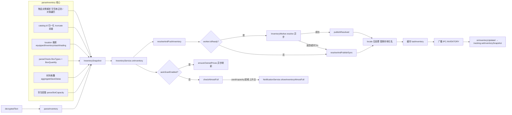
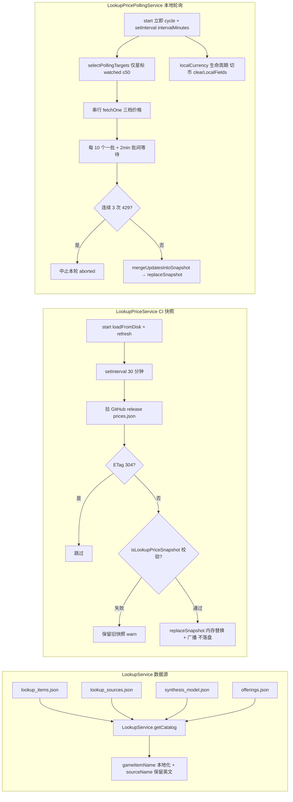

# Inventory 与 Lookup

> 本文是 [`docs/BUSINESS-FLOWS.md`](../BUSINESS-FLOWS.md) 的拆分章节之一。**业务流程的单一真理源仍是主索引文件**——任何业务逻辑改动仍需先查阅本文件，落地后同步更新；本文件只是承载正文，便于按需加载。
>
> 背包解析与估值、宝箱 / 物品 / 供奉查询、查询价格快照与收藏轮询、合成点数体系。
>
> 所有文件路径以仓库根为基准（`app/src/...`）。

> ← [主索引](../BUSINESS-FLOWS.md) · 上一竧[LiveMemory 实时读取](04-live-memory.md) · 下一竧[Market 与 Steam 价格](06-market.md) · 章节：§6 / §7

---

## 6. Inventory 业务流程

### 流程图

解析 → onInventory → resolveAndPushInventory（worker / sync fallback）→ locale 后处理 → 广播。

### 6.1 parseInventory（`app/src/core/inventory/parse.ts`）

`parseInventory(decryptedText, saveMtime = 0, isMaterialItemKey?) → InventorySnapshot`：

1. `JSON.parse(decryptedText)` 得到 root，从 `root.PlayerSaveData` 取出 `value`（字符串形式优先）。
2. **物品实例解析**（两条路径）：
   - `parseItemsFromPlayerString(playerStr)`：当 `PlayerSaveData.value` 是 JSON 字符串时，用正则切出 `equippedItemIds`、`inventorySaveDatas`、`stashSaveDatas`、`tradingStashSaveDatas`、`itemSaveDatas` 数组，再用 `splitTopLevelObjects(arr)` 按花括号深度切分出每个顶层 `{...}` 物品对象，最后在每个对象内独立提取 `ItemKey` / `UniqueId` / `IsChaotic` 字段。**字段顺序无关** —— 游戏 v1.00.28+ 在 `UniqueId` 与 `IsChaotic` 之间插入了 `PrevUniqueId` / `IsBlocked` / `IsServerPendingItem`，曾让旧的"三字段相邻"正则（`ITEM_TRIPLE_RE`）匹配 0 个物品导致背包页空白，已修复。`UniqueId` 保留为字符串（超过 `Number.MAX_SAFE_INTEGER`，数值化会丢精度）。
   - `parseItemsFromPlayerObject(player)`：当 value 已是对象时，直接遍历 `player.itemSaveDatas` 数组（按对象属性访问，本身字段顺序无关）。
3. **catalog id 归一化**：`trackSaveItemKey(rawItemKey, ...)` 调用 `catalogItemKeyFromSave(rawItemKey)`（`app/src/core/gamedata.ts`）：
   - 6 位数以下直接返回。
   - 7 位数以上按 `Math.trunc(itemKey / 1000)` 取前缀，落在 `[110001, 939999]` 区间则用前缀。
   - `isMarketPipelineSaveItemKey`（结尾 `900`）单独标记为 pipeline-only，不计入可分配物品。
4. **location 推断**：`resolveLocation(uniqueId, equipped, inventory, stash, trading)` 返回 `"equipped" | "inventory" | "stash" | "trading" | "unknown"`。
5. **chests 解析**：`parseChests(player)` 从 `player.BoxData.BoxTypes` + `BoxData.BoxQuantity` 配对生成 `ChestHolding[]`。
6. **材料堆叠**：若 `isMaterialItemKey` 注入，则 `parseAggregateEntries(player)` 从 `player.aggregateSaveDatas` 按 `aggregateSubKeyToItemKey` 映射回 catalog id，再通过 `materialStacksFromAggregates` 过滤出材料，得到 `Map<itemKey, stackQty>`。
7. **背包容量**：`parseSlotCapacity(arrText)` 遍历 `inventorySaveDatas` 的扁平对象数组，`IsUnlock=true` 计入 `capacity`，`ItemUniqueId !== 0` 计入 `used`。

返回 `InventorySnapshot`：`{ items, chests, saveMtime, materialStacks?, inventoryCapacity, inventoryUsed, marketPipelineOnlyCatalogKeys? }`。

### 6.2 inventory core 各子模块职责

均位于 `app/src/core/inventory/`：

- **aggregates.ts**：`parseAggregateEntries(player)` 提取 `{ type, subKey, value }` 三元组；`aggregateSubKeyToItemKey(type, subKey)` SubKey → ItemKey 映射；`materialStacksFromAggregates(entries, isMaterialItemKey)` 过滤出材料。
- **composition.ts**：`computeInventoryComposition(rows, feeRates)` 聚合 `InventoryComposition`（计数维度 + 价格维度 + 手续费）；每行的 `value` 字段在此设置。`buyOrderValuedTotal` 累加毛额，`buyOrderNetTotal` 通过 `instantSellNetValue` 逐级扣费精确累加（不再用整体 feeRatio 估算）。
- **location.ts**：`unassignedCount(row)`、`rowMatchesLocation(row, filter)`、`rowMatchesAnyLocation(rows, filter)` 用于 UI 位置过滤。
- **buyOrder.ts**：`instantSellValue(ownedCount, levels)` 把 `ownedCount` 件物品按 `BuyOrderLevel[]` 从高到低价吃单，返回毛额 `{ value, coveredCount }`；`instantSellNetValue(ownedCount, levels, rates)` 同逻辑但每档按 `sellerProceedsFromBuyerPrice(price, rates)` 计算净到手（逐级扣 Steam/厂商交易成本与收款保底）。
- **ownedPriceTargets.ts**：`ownedPriceTargetForItem(item)` 单个 GameItem → `OwnedPriceTarget | null`；`ownedPriceTargets(snapshot, lookup, excludeItemKey?)` 遍历派生目标去重；`flattenOwnedHashes(targets)` 摊平为 `string[]` 供价格缓存裁剪使用。
- **predictFillTime.ts**：`predictFillTime(input)` 根据 `inventoryCapacity / inventoryUsed` + 多个 `ChestFillSource` 预测多久后背包满。每个 chest type 是串行队列，开箱速率 = `3600 / autoOpenSecondsPerChest`。
- **columnPrefs.ts**：UI 表格列可见性配置归一化。

### 6.3 InventoryService.resolveAndPushInventory

文件：`app/src/main/services/InventoryService.ts`。

`onInventory(snap)`（被 appState 通过 TrackingService 回调注入）：

1. 缓存 `lastInventoryRaw = snap`。
2. 调用 `resolveAndPushInventory()`。
3. 若 `autoScanEnabled`，调用 `ensureOwnedPrices()`（异步刷新 Steam 价格）。
4. `checkAlmostFull(snap)`：当 `used / capacity >= threshold` 且为上升沿时，触发 `onAlmostFull` 回调（appState 注册为 `notifications.showInventoryAlmostFull`）。

`resolveAndPushInventory()` 流程：

1. 若 `lastInventoryRaw` 或 `market` 为空，直接返回。
2. `buildOwnedPriceLookupMap()`：从 `currentOwnedPriceTargets()` 派生 hash 列表，从 `market.get(hash)` 拿 `PriceEntry`，构造 `Map<hash, InventoryPriceInfo>`（只装 owned hashes，避免把整张 cache 推给 worker）。
3. `collectExcludedItemKeys()`：把所有 stage box itemKey 收集为 `number[]`。
4. 若 `worker.isReady()`：
   - `worker.resolve(snapshot, priceLookupMap, excludeItemKeys)` 异步返回 `ResolvedInventory`。
   - 成功 → `publishResolved(resolved)`；失败（crash / 5s 超时）→ 走 sync fallback `resolveAndPublishSync`。
5. 否则直接 `resolveAndPublishSync`（启动期/worker 崩溃后）。

`publishResolved(resolved)`：

1. 注入 currency 到 `resolved.currency` 和 `resolved.composition.currency`。
2. **locale 后处理**：遍历 `resolved.rows`，用 `getMergedGameItem(row.itemKey)` 重新解析 row.name（worker 不能在运行时切 catalog，所以英文/占位名在主进程替换成本地化名）。
3. 缓存 `lastInventory = resolved`。
4. `broadcast(IPC.INVENTORY, resolved)` 推送给所有 renderer。
5. `onInventoryUpdated?.(resolved)` 回调（appState 注册为 `tracking.setInventorySnapshot`）。

**关键不变量**：Steam Market 调用与 `lookupPriceSnapshot.prices[hash]` 查询都用英文 hash，不能用本地化名（`marketHashName` 在 `app/src/core/marketName.ts` 中通过 `sourceName` 字段保留英文来源）。

### 6.4 inventoryWorker（utility process）

文件：

- `app/src/main/services/inventoryWorker.ts`：host 端 wrapper（`InventoryWorker` 类）。
- `app/src/main/services/inventoryWorkerEntry.ts`：worker 进程入口（被 `utilityProcess.fork` 加载）。
- `app/src/main/services/inventoryWorkerProtocol.ts`：纯协议处理器（`handleInit` / `handleResolve`），无 Electron 依赖，可单测。

**为什么用 worker**：解析 10 万件 items 的 map/filter/price-lookup 会阻塞 main thread，影响 IPC + 窗口管理。

**生命周期**：

- `init(gameDataLookup, feeRates)`：首次调用 `utilityProcess.fork`；已有 child 时只 postMessage 一条 `init`（不重新 fork），用于 gameData reload 或 fee rates 变更。
- `resolve(snapshot, priceLookup, excludeItemKeys?)`：未 ready → 直接返回 `resolveSync(...)` 的 Promise；否则分配 `id = nextId++`，存入 `pending: Map<id, ...>`，5s 超时自动 reject；postMessage `{type:"resolve", id, snapshot, priceLookupEntries, excludeItemKeys}`。
- `stop()`：发送 `stop`、`child.kill()`、reject 所有 pending、清空状态。

**消息协议**：

- Inbound（host → worker）：`init`、`resolve`、`stop`。
- Outbound（worker → host）：`ready`、`resolve`、`log`。

**fallback 保证**：worker 崩溃/超时/启动期都不会让 UI 失去 inventory 更新——`resolveAndPushInventory` 在 catch 里调 `resolveAndPublishSync`，sync 路径调用 `worker.resolveSync`（直接调 `resolveInventory`，与异步路径同一函数）。

### 6.5 priceCache 更新策略

文件：`app/src/main/services/priceCache.ts` + `steamMarketProvider.ts`。

#### 持久化结构

- `PriceEntry`：`{ lowest, median, volume, rawLowest, rawMedian, fetchedUtc, buyOrder, rawBuyOrder, buyOrderQuantity?, buyOrderLevels?, buyOrderFetched?, buyOrderCheckUtc? }`。
- `PriceCache`：`{ currency, fetchedUtc, prices: Record<hash, PriceEntry> }`。
- 文件路径：`app.getPath("userData")/prices.<CUR>.json`。`priceCacheSeedPath` 在 app bundle 旁边找 seed 文件，作为冷启动 fallback。

#### TTL 与新鲜度

- `FRESH_TTL_MS = 24h`。
- `isFresh(name, now)`：要求 entry 有 sell price 或 buy order；sell 端 `now - fetchedUtc < 24h`；buy 端 `now - buyOrderCheckUtc < 24h`。
- `pendingTargets(targets, force, now)`：force=true 全返；否则只返非 fresh 的。

#### 持久化时机

- 每次 `market.refresh()` 完成后 `persistPriceCache(cache)`。
- 流式持久化：`fetchAllTargets` 中每 `PERSIST_EVERY_PRICED = 5` 个新价格落盘一次（防长任务中断丢失进度）。
- `pruneCache(ownedHashes)`：删除 cache 中不在 owned 集合的 hash，落盘。

#### Steam API 限流处理

- `DEFAULT_DELAY_MS = 3000`（20 req/min）。
- `MAX_DELAY_MS = 60000`；退避乘子 2。
- `MAX_RETRIES_PER_TARGET = 2`。
- `MAX_CONSECUTIVE_RATE_LIMITS = 3`：跨 target 连续 3 次 429 触发 circuit breaker。
- `Retry-After` header 优先于指数退避：`waitMs = Math.max(retryAfterMs, backoffMs)`。
- `cancel()`：设 `cancelled = true`，`sleepUntil` 每 100ms 检查取消标志。
- 网络错误 fallback：若 `response.reason === "network"` 且 cache 中已有该 hash 的 market data，则刷新时间戳让其变 fresh。

### 6.6 背包满检测与 fillPrediction

- **容量数据来源**：`parseInventory` 中的 `parseSlotCapacity(arrText)`。
- **几乎满通知**：`InventoryService.checkAlmostFull(snap)`：`thresholdRatio = getAlmostFullThresholdPercent() / 100`（来自 `config.inventoryAlmostFullThresholdPercent`，默认 90）；`isAbove = used / capacity >= thresholdRatio`；**上升沿触发**：仅在 `wasAboveAlmostFullThreshold === false → true` 时调 `onAlmostFull`。
- **fillPrediction**：`predictFillTime`（见 6.2）由调用方（ChestService / BoxTimerService）组装 `ChestFillSource[]` 后调用。

## 7. Lookup 业务流程

### 流程图

LookupService 加载 bundled 目录；LookupPriceService（CI 快照）与 LookupPricePollingService（本地轮询）双路径，polling 数据 merge 进内存快照。

### 7.1 数据源（`app/src/main/services/LookupService.ts`）

构造时一次性加载四个 bundled JSON（通过 `app/src/core/lookup/catalog.ts` 的 loader）：

- `lookup_items.json` → `LookupItem[]`：每个可获取物品的 stats、来源图、合成路径等。
- `lookup_sources.json` → `LookupSources`：box/stage/drop source graph。
- `synthesis_model.json` → `SynthesisModel`：合成配方、grade 权重、bucket 池。
- `offerings.json` → `OfferingsModel`：硬币献祭掉落表。

`LookupService.getCatalog()` 返回 `LookupItem[]`，并在 `localeCatalog` 非空时通过 `gameItemName(item, localeCatalog)` 本地化 name，同时把原始英文名存到 `item.sourceName`（关键：保证 `marketHashName` 仍派生英文 hash）。

**渲染端共享**（2026-09 起）：renderer 不再在每个标签页挂载时各自 fetch 目录 —— `TbhProvider` 启动即预取一次并随语言切换重新拉取，经 `TbhContext.lookupCatalog` 供所有页面共享（`useLookupCatalog` 只是消费该字段）。目录未就绪（返回 null）时，物品栏表名单元格与掉落页名称单元格渲染骨架条而非灰点占位，首次可见渲染即「图标 + 品质色」，避免目录到达后出现明显的第二次更新。

### 7.2 box / item / offering 查询（`app/src/core/lookup/`）

- **offerings.ts**：`offeringForCoin(model, coinKey)`、`offeringSourcesForItem(model, itemKey)` 按 `poolPct` 降序。
- **synthesis.ts**：`pathsToItem(item, model)` 返回所有合成路径含 `pGrade / pLevel / itemPoolPct / chance`；`simulate(...)` 给定参数下所有可能产物的概率分布。
- **boxDisplay.ts**：UI 展示用纯函数（`boxCategoryLabel`、`boxDropViaLabel`、`summarizeSpawnPcts` 等）。
- **classRestriction.ts**：`classForGearType(gearType)` 武器 gearType → 英雄职业（Knight/Ranger/Sorcerer/Priest/Hunter/Slayer）；`LOOKUP_CLASS_ORDER` 6 个职业的固定展示顺序。
- **唯一效果渲染本地化**：图鉴装备「唯一效果」文本（`LookupItem.stats.unique`）渲染走 `app/src/renderer/lib/itemLabels.ts` 的 `uniqueModLabel(mod, text, t?, params?)`——按 `mod` 后缀查 i18next `common:labels.uniqueMods.<mod>`（由 `flatGameKeysToLabels` 从游戏 locale 的 `UniqueMod_*` 前缀摊平而来）。`scripts/build_tbh_data.py` 的 `gear_unique()` 现在从 `SkillInfoData` 构建技能键集合，把 `UniqueModInfoData.Param1..5 + ParamXExchangeType` 归类为 `params:[{value,exchange,kind}]` 写入 `lookup_items.json`（kind ∈ percent/number/scale100/element/skill/hero/unknown）。渲染端填充：技能名经 `common:labels.skillNames.<SkillKey>`（新增 `SkillName_` 前缀分支）、职业名经 `labels.classes`、`percent/scale100/number` 数值换算后填入模板；**任一占位符不可解析**（元素 `element`、`StatValueUp` 的 `unknown`）或缺少 `params` 时整行回退 `text`（英文后缀）。图鉴卡片 `ItemCard.tsx` / `ItemDetailCard.tsx` 两处接线。

### 7.3 LookupPriceService vs LookupPricePollingService

#### LookupPriceService（CI 快照客户端，`app/src/main/services/LookupPriceService.ts`）

- **数据来源**：GitHub release `https://github.com/zioon/tbh-companion/releases/download/lookup-prices/prices.json`（CI 每 6 小时构建一次；本仓库自建，不依赖上游 lucasfevi 的快照）。
- **职责**：拉取 CI 快照、缓存、广播；**从不调用 Steam**。
- **缓存路径**：`app.getPath("userData")/lookup_prices.json`。
- **启动**：`start()` 先 `loadFromDisk()`，再 `refresh()`，然后 `setInterval(refresh, 30 * 60 * 1000)`（30 分钟轮询）。
- **ETag**：缓存 `etag`，下次请求带 `If-None-Match`，304 时跳过。
- **校验**：`isLookupPriceSnapshot(value)` 检查 `schemaVersion === 1`、`generatedUtc`、`prices`、`fx` 字段。
- **持久化策略**：磁盘上 `lookup_prices.json` 只存 CI 纯净数据；内存中可保留 `pricesLocal/medianLocal/buyOrderLocal/localCurrency`（polling 写入），下次 CI 刷新时通过 `mergeLocalFields` 保留。
- **`replaceSnapshot(snapshot)`**：供 polling service 调用——只在内存替换 + 广播，**不落盘**（保持 CI 快照纯净）。

#### LookupPricePollingService（本地轮询，`app/src/main/services/LookupPricePollingService.ts`）

- **数据来源**：直接调 Steam `priceoverview` + `itemordershistogram`。
- **职责**：本地周期性刷新**用户收藏（星标）物品**的价格，merge 进内存 snapshot。
- **抓取三档价格**：`pricesLocal[hash]`（最低出售价）、`medianLocal[hash]`（最近成交价中位数）、`buyOrderLocal[hash]`（最高收购价）。
- **localCurrency 生命周期与货币切换**：polling 以「cycle 开始时的显示货币」抓取上述三档价格，并把 `localCurrency` 写成快照级字段的该货币。图鉴展示（`resolveLookupPrice`）仅在 `localCurrency` 与当前显示货币一致时才走 local 路径，否则回退 CI 快照 USD × fx。**切换货币时**（`SET_CURRENCY` handler / Settings 补丁）由 `appState` 调用 `LookupPriceService.clearLocalFields()` 清空 `pricesLocal/medianLocal/buyOrderLocal/localCurrency`（保留 CI 的 `prices`/`fx`/`fetchedUtc`）并广播——防止「未经新币覆盖的 hash 残留旧币数值、却随新 `localCurrency` 被当作新币展示」；下一次 polling cycle 会以新货币重新抓取回填。
- **配置**（`LookupPricePollingPrefs`）：`enabled`、`intervalMinutes`（5-60，默认 10）、`thresholdUsd`（默认 1.0）、`watchedHashes`（用户收藏）。
- **目标选择**（`app/src/core/lookupPrice/polling.ts` 的 `selectPollingTargets`）：**图鉴页仅轮询星标（watched）物品**，无条件入选，去重去空、保序；上限 `maxTargets = 50`。`thresholdUsd` 与快照/拥有集合不再参与图鉴轮询目标筛选（交易页「刷新历史价格」另有全量高价值集合，见 8.7 `selectHistoryRefreshTargets`）。
- **cycle 流程**：互斥锁 `cycleRunning`；串行遍历 targets（上限 `maxTargets = 50`），调 `fetchOne(hash, targetCurrency)`；每个 item 后 `sleep(FETCH_DELAY_MS = 3000)`；**每拉完 `MAX_TARGETS_PER_BATCH = 10` 个且还有剩余目标时，等待 `BATCH_GAP_MS = 2min` 再拉下一批**（与市场交易额 `refreshHistory` 的批间等待同理，避免 >10 个目标一次跑完触发 Steam 限流）；任一子调用 429 → `consecutiveRateLimits++`；达 `MAX_CONSECUTIVE_RATE_LIMITS = 3` 中止本轮（`aborted: true`）；priced > 0 时 `mergeUpdatesIntoSnapshot` 调 `lookupPrices.replaceSnapshot` 广播。
- **定时调度（Rev：移除 6h 固定冷却）**：`start()` 立即触发一次 cycle，然后 `setInterval(pollOnce, intervalMinutes)` **严格按配置间隔触发**。`pollOnce` 不再做固定时长（6h）冷却——旧版 `POLLING_MIN_REFRESH_MS = 6h` 冷却曾让自动周期在成功 cycle 后 6 小时内全部跳过，导致「轮询间隔（5–60 分钟）」设置形同虚设（市场/图鉴价格与交易页成交量长时间不更新），故随 `lookup_polling_cache.json` 持久化机制一并移除。**限流保护改由以下机制承担**：`cycleRunning` 互斥锁（上一轮未结束则跳过）、逐项 3s 间隔、每 10 个一批 + 2min 批间等待、429 退避与连续 3 次熔断；重启/开开关仍会立即跑一轮，Steam 端异常由本轮熔断兜底。
- **单 hash 手动刷新**（`pollSingleHash`）：UI 点"立即刷新此物品"按钮时调，不走 selectPollingTargets。

### 7.4 lookupPrice 的 sweep 流程（CI 端）

`app/src/core/lookupPrice/sweep.ts` 的 `sweepListedPrices` 是 CI 构建端的纯函数：

- **优先级**：`refreshOrder(hashes, prior, now, minAgeMs)` = missing hashes first + stale priced hashes oldest-first（`minRefreshAgeMs = 12h` 默认）。
- **限流**：`baseDelayMs = 1500`、`maxDelayMs = 30000`、`maxConsecutiveRateLimits = 6`（CI 比 client 宽松）。
- **熔断**：连续 6 次 429 中止 sweep，保留已抓数据，下次 CI run 从 `prior` 续抓。
- **assembleSnapshot**（`assemble.ts`）：调 `sweepListedPrices` → `fetchFxWithFallback` → `buildSnapshot` 产出最终 `LookupPriceSnapshot`。

### 7.5 snapshot 持久化路径与失效策略

- **CI 端**：`lookup-prices` GitHub Action 跑 `assembleSnapshot`，发布到 release tag `lookup-prices` 的 `prices.json` asset。
- **客户端缓存**：`userData/lookup_prices.json`。
- **失效策略**：ETag 304 → 跳过；`generatedUtc` 相同 → 跳过；校验失败 → 保留旧快照，log warn；30 分钟轮询保证及时性；用户在 Settings 清除 app data 时 → 删 `lookup_prices.json`。
- **本地 polling 数据**：只在内存，不落盘；CI 快照刷新时通过 `mergeLocalFields` 保留 `pricesLocal/medianLocal/buyOrderLocal/localCurrency`。**切换显示货币时**由 `LookupPriceService.clearLocalFields()` 清空这些本地字段并广播（回退 CI USD × fx，见 7.3），下一轮 polling 以新货币重新抓取。

### 7.6 Watched hashes（用户收藏）存储与轮询

- 存储：`config.lookupPricePolling.watchedHashes: string[]`（`config.json` 持久化）。
- `sanitizePollingConfig(cfg)`：去重、去空、trim。
- `setConfig(cfg)`：仅 `enabled` toggle 或 `intervalMinutes` 变化时重启定时器；`thresholdUsd` / `watchedHashes` 变化不重启。
- 轮询：`selectPollingTargets` 只把 `watchedHashes` 作为 targets（图鉴仅更新星标物品），去重去空、保序，无论是否拥有、是否有价格，优先抓取。

### 7.7 宝箱获取规律与内容物期望价值（含瘟疫宝箱）

Lookup 宝箱详情的「获取规律 + 价值」展示，纯 renderer + core，无新 IPC 通道。

- **获取规律五维**（`BoxCardParts.tsx BoxCardHeader`/`BoxCardDropSummary` 与 `BoxDetailCard.tsx`）：
  1. 掉落关卡范围 `dropStageRangeLabel`（`splitDropStageRangeLines` 拆行）；
  2. 击杀类型 `via`：`monster_box` / `boss_box` / `act_boss`（`boxDropViaSummaries` 汇总各 via 的 spawnPct 最小–最大区间）；
  3. 掉落率 `spawnPct%`（每行 `fmtDropPct`）；
  4. 首掉标记 `firstDropOnly` + `firstDropStages`（"仅首次通关"）；
  5. 难度/关卡名经 `stageName`（瘟疫 6 位 key 见 5.7）。
- **瘟疫类别识别**：tbh-data 把瘟疫宝箱（`915xxx`/`925xxx`/`935xxx`）分类标签归为普通 `common`/`stage_boss`/`act_boss`，无法据此识别瘟疫。新增纯函数 `boxPlagueTier(boxItemKey)`（`core/lookup/boxDisplay.ts`）：按 9xxx id 前缀判定 `plagueCommon`/`plagueRare`/`plagueAct`，UI 由此显示瘟疫类别徽标（`translateBoxPlagueTier` + `box.plague*` i18n key）。
- **获取分组规律**：瘟疫宝箱的「每图/共享/按章」对应关系由掉落来源数据推断而非硬编码。纯函数 `boxPlagueRule(boxItemKey, stages)` 依 `via` + 地图数判定 `shared-group`（`monster_box`、多个相邻地图共享一箱，如普通箱每 5 关共用一个）/ `unique-stage`（`boss_box`、每图独有）/ `unique-act`（`act_boss`、每章独有），返回 `{ kind, stageCount }`。`BoxDetailCard` 在标题下以「获取规律」StatGroup 展示（`translateBoxPlagueRule` + `box.rule*` i18n key），非瘟疫宝箱不显示。
- **内容物期望价值**：宝箱本身 `marketTradable=false` 无市场价，价值来自内容物。新增纯函数 `boxExpectedValue(drops, unitPrice)`（`core/lookup/boxDisplay.ts`），`value = Σ(dropPct × unitPrice(itemKey)) / 100`。`unitPrice` 由 renderer 注入 `useLookupPrices().resolve(item).amount`（当前货币买单价）。降级规则：无任何 content 定价（`pricedCount===0`）→ `value=null`，UI 显示「暂无内容物市场价数据」仅列内容物+掉率；有定价时显示期望值 + 「已按市场价覆盖 priced/total 项」。
- 展示位点：`BoxLoot.tsx` 顶部 StatGroup（期望价值）+ 每行内容物右端价格；`BoxCardParts.tsx` header 瘟疫类别徽标。

### 7.8 合成点数（宝箱价值评价体系）

需求：为宝箱**掉落物品**按品质给一个「合成点数」作为价值度量，评分即可合成该品质所付出的"普通点"总成本。纯函数在 `app/src/core/synthesisPoints.ts`，数据展示挂靠在 `BoxOpenTracker.getStats` 的 breakdown 行与箱级合计上（Loot 页）。

- **品质基础点数**（非饰品）：以 COMMON=1、UNCOMMON=9 为锚点，按 `data/synthesis_model.json` 每级合成升到下一级的上浮概率 `P_up(g) = (weights[+1]+weights[+2])/total(g)` 递归：`V[g] = V[g-1] × 9 ÷ P_up(g-1)`（9 = 合成单次消耗材料数 `materialAmount`）。COMMON..IMMORTAL 的 `P_up` 恒为 1（低品质几乎必然升级），故点数恰为 9 的幂（1/9/81/729/6561）；IMMORTAL 起 `P_up` 逐级下降，点数按成功率膨胀：ARCANA≈11.8 万(50.12%)、BEYOND≈317 万(33.44%)、CELESTIAL≈1.23 亿(23.14%)、DIVINE≈66.5 亿(16.68%)、COSMIC≈6.59 万亿(9.09%)。常量 `SYNTHESIS_POINTS`（`synthesisPointsForGrade` 读取），数值与产品确认一致。
- **饰品类倍率**：`gearGroup === "ACCESSORY"`（`isAccessoryItem`）→ `synthesisPointsForItem(grade, isAccessory)` 返回基础点数 ×3（`ACCESSORY_POINT_MULTIPLIER`）。未知/不受支持品质返回 `null`。
- **挂接路径**：`BoxOpenTracker.getStats(priceResolver, isAccessory?)`（2026-09-11 起签名改为仅 `priceResolver` + 可选 `isAccessory`，移除 `sessionSeconds`/`nowSecondsOverride`）。对每个 breakdown 行算 `synthesisPointsUnit = synthesisPointsForItem(grade, isAccessory(itemKey))`、`synthesisPointsTotal = unit × count`；箱级 `totalSynthesisPoints = Σ`。字段见 `shared/types.ts` 的 `BoxOpenBreakdownRow.synthesisPointsUnit/ Total` 与 `BoxOpenStats.totalSynthesisPoints`（均为 `number | null`）。
- **饰品判定来源**：`TrackingService.buildBoxOpenAccessoryResolver()` 用 `this.lookupItems`（lookup_items.json 的 `LookupItem.gearGroup`）判定；目录未加载时返回 `null`，tracker 按一般点数（不 ×3）计分。resolver 经 `buildStats(... boxOpenIsAccessory ...)` 透传。
- **特殊材料按「对应 ACT 章节宝箱 / offer 开出概率」估值（运行时数据驱动，不手写数值）**：不走自身品质。
  - 灵魂石（Soulstone）：对应以难度映射到的 **ACT 宝箱**（规则表 `SOULSTONE_ACT_BOX`：普通→930301、噩梦→930501、地狱→930851、折磨→930901，被污染→935001/103/202），覆盖值 = 该箱的期望合成点 `Σ(dropPct/100×单点)`（与宝箱「期望合成点数」同一公式）。
  - 纪念硬币（offering coin 160001~160010）：覆盖值 = 其 `data/offerings.json` 开出清单 `Σ(poolPct/100×单点)`。
  - 统一由纯函数 `buildMaterialSynthesisPoints(data)` 现算生成 `Record<itemKey,点数>`；`synthesisPointsForItemKey(itemKey, grade, isAccessory, overrideMap?)` 命中覆盖表则用之，否则品质×饰品。**main**（`TrackingService.getMaterialPointsOverride()`，用 lookup_sources+offerings+lookup_items，懒构建缓存）与 **renderer**（`useMaterialSynthesisPoints()`，用 window.tbh.getLookupCatalog/getLookupSources/getOfferings）各自喂数据现算同一张表；`BoxLoot` 与 `BoxOpenTracker.getStats(priceResolver, isAccessory?, pointsOverride?)` 均查该表。数据更新自动跟随。
  - 普通硬币/硬币堆（150001~150007）无 offer 清单也无宝箱关联，不做覆盖（按品质估值）。
- **展示**：`LootBoxSection.tsx` 已分类宝箱表格末尾新增「合成点数」列（`fmtPoints` 用 Intl compact 按当前语言进 万/亿/K/M/B），每箱头显示合成点合计徽标（`boxSection.pointsTotalLabel`）。未分类（unclassified）行不显示该列。宝箱图鉴/详情侧 `BoxLoot.tsx`（宝箱内容物列表，渲染于 `BoxDetailCard`/`BoxPeekCard`）：每条内容物右端显示该物品单件合成点数（`box.synthesisPointsShort`），宝箱「价值」区新增「期望合成点数」（`box.expectedSynthesisPoints`）＝ `Σ(dropPct/100 × 单件点数)`，作宝箱级标记。
- **三单件物品页展示**（物品页/图鉴页/交易页每件物品也显示单件合成点，数值一致）：
  - 统一入口：`synthesisPointsForItemKeyByGear({ itemKey, grade, gearGroup })`（`core/synthesisPoints.ts`），内部复用 `isAccessoryItem({gearGroup})` 判饰品再走 `synthesisPointsForItemKey`，避免各页重复判断。
  - 物品页（Inventory）：表格新增**独立可排序/可切换「合成点」列**（`InventoryColumnId="synthesisPoints"`，默认可见）。排序在 `renderer/lib/inventoryFilters.ts` 的 `filterAndSortRows(..., catalogIndex?)`（`SortKey="synthesisPoints"`，`null→-1`）；显示与排序均由 `rowSynthesisPoints(row, itemIndex)` 计算，`gearGroup` 来自 `useLookupCatalog` 构建的 `Map<id, LookupItem>`（渲染层用 `LookupItem.gearGroup`，core `GameItem` 无此字段）。
  - 图鉴页（Lookup）：`lookup/itemCardParts.tsx` 的 `ItemCardHeader` 第三行（`metaLine`）后追加 `合成点: <fmtCompact>`，用 `effectiveGrade`/`item.id`/`item.gearGroup`。
  - 三处页面（物品卡 `itemCardParts.tsx`、Inventory 表 `InventoryTable.tsx`+`inventoryFilters.ts`、交易卡 `ItemVolumeCard.tsx`）及宝箱详情 `BoxLoot.tsx` 均通过 `useMaterialSynthesisPoints()`（模块级共享缓存，一次拉取）取同一张覆盖表并传入 `overrideMap`，与 tracker/宝箱详情数值一致。
  - `MarketVolumeItem` 新增可选 `itemKey?`/`gearGroup?`（`shared/types.ts` 与 `core/marketVolume.ts`），由 `aggregateItemVolume`/`aggregateLiveItems`/`aggregateLiveActivityItems` 三处聚合与 `MarketVolumeService.buildItemForHash`/`buildPendingItems` 两处回退对象从 `LookupItem` 透传。
  - 标签文案统一 `common:labels.synthesisPoints`（四语种 `common.json`）。
- **宝箱「每次掉落」价值**（2026-09-11，替代原每小时价值）：Loot 页价值速率改为**时间无关的每次掉落价值**，而非每小时——宝箱价值展示不再受挂机时长影响。`BoxOpenTracker.getStats` 的 `perDropValue` 字段：行级 = `buyOrderValue / count`，箱级 = `totalBuyOrderValue / totalItems`（各行按 count 加权的平均），均为 `number | null`。`LootBoxSection.tsx` 箱头徽标（`fmtMoneyPerDrop`，后缀 `/次`）展示箱级每次掉落价值，合成点徽标（`pointsTotalLabel`）同理**只**展示每次均值（`totalSynthesisPoints / totalItems`，无"均值"字样、不显示总值，口径与钱一致）；**表格不再显示每行「每次」列**（与「买断价」列重复，已移除），原「追踪于」开始时间展示亦已移除。原 `hourlyValue` 及 `getStats` 的 `sessionSeconds`/`nowSecondsOverride` 参数已移除。`trackingSinceWallTime` 仍保留在数据模型与快照中（持久化），但不再用于价值计算与 UI 展示。
- **测试**：`test/core/synthesisPoints.test.ts`（锚点/幂次/成功率/饰品倍率/null + `synthesisPointsForItemKeyByGear`）+ `test/core/boxOpenTracker.test.ts` 新增「scores synthesis points by grade, tripling accessories」+ `test/core/marketVolume.test.ts` 聚合 `itemKey/gearGroup` 透传 + `test/renderer/inventoryFilters.test.ts` 合成点排序（含饰品倍率）。
