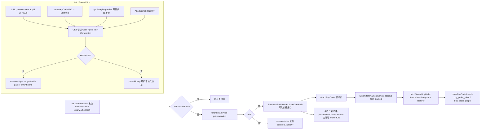

# Market 与 Steam 价格

> 本文是 [`docs/BUSINESS-FLOWS.md`](../BUSINESS-FLOWS.md) 的拆分章节之一。**业务流程的单一真理源仍是主索引文件**——任何业务逻辑改动仍需先查阅本文件，落地后同步更新；本文件只是承载正文，便于按需加载。
>
> Steam Market 卖单 / 买单价格拉取链路、手续费计算、代理与限流处理、市场交易额统计。
>
> 所有文件路径以仓库根为基准（`app/src/...`）。

> ← [主索引](../BUSINESS-FLOWS.md) · 上一竧[Inventory 与 Lookup](05-inventory-and-lookup.md) · 下一竧[Catalog Refresh 与 Session 持久化](07-catalog-refresh-and-session.md) · 章节：§8

---

## 8. Market 业务流程

### 流程图

价格请求链路：marketHashName → priceoverview → 缓存 + 买单价（item_nameid → histogram）。

### 8.1 Steam Market price 请求链路

#### marketHashName 构造（`app/src/core/marketName.ts`）

- `marketHashName(item)`：材料直接用 `sourceName ?? name`；gear 用 `gearMarketHash(name, grade, "A")` = `"<name> (<Grade>) A"`（仅 A 变体，B-E 不探查）；占位符 `ItemName_<id>` → null。
- `isPriceableItem(type, grade, marketTradable)`：material 总是 priceable；gear 仅 Legendary+ priceable。

#### priceoverview 请求（`app/src/main/services/steamPriceApi.ts`）

`fetchSteamPrice(name, currency)`：

- URL：`https://steamcommunity.com/market/priceoverview/?appid=3678970&currency=<code>&market_hash_name=<encoded>`
- `currencyCode(iso)` 把 ISO 代码转 Steam 数字 id（`app/src/core/steamPrice.ts` 的 `STEAM_CURRENCIES` 表，覆盖 41 种货币）。
- headers: `User-Agent: Mozilla/5.0 (TBH Companion)`。
- `AbortSignal.timeout(30_000)` 30s 超时。
- `getProxyDispatcher()` 注入代理。
- 返回 `SteamPriceFetchResult`：`ok: true` → `{ entry: PriceEntry }`；`ok: false` → `{ reason, status, retryAfterMs? }`。
- `parseMoney(text)` 解析 Steam 本地化价格字符串（"$0.04"、"R$ 0,17"、"1.234,56 zl"）。
- 429 → `reason: "http"` + `retryAfterMs: parseRetryAfterMs(res)`。

#### price cache 写入

- `SteamMarketProvider.priceOneHash(name, counters, opts)` 调 `fetchSteamPrice`，成功时 `cache.prices[name] = entry`，再调 `attachBuyOrder`。
- 每 5 个新价格 `persistPriceCache`。
- cycle 结束 `cache.fetchedUtc = new Date().toISOString()` + `persistPriceCache`。

### 8.2 steamMarketFee 计算

文件：`app/src/core/steamMarketFee.ts`（纯函数）+ `app/src/core/steamMarketFeeBundled.ts`（main/core 专用，读 bundled `data/steam_market_fee.json`）。

- `SteamMarketFeeRates = { steamFeePercent, publisherFeePercent, minFeeMajor, minPayoutMajor }`。
- 费率（2026-09 更新）：`steamFeePercent = 0.05`（Steam 5%，最少 0.01）、`publisherFeePercent = 0.1`（厂商 10%，最少 0.01）、`minPayoutMajor = 0.01`（收款保底）。
- **最低手续费按货币（2026-09 新增）**：Steam 2025-12 起单笔最低费为 $0.01 等值，国区实测为 ¥0.07。`MIN_FEE_BY_ISO = { CNY: 0.07 }`，其余币种回退 $0.01。`minFeeForCurrency(iso, fallback)` 取值；`feeRatesForCurrency(rates, iso)` 返回按币种调整 `minFeeMajor`/`minPayoutMajor` 后的费率副本（未收录币种返回原对象）。调用方（renderer Inventory/InventoryTable、main InventoryService worker）用展示币种构造费率，使人民币下最低费为 ¥0.07。
- `sellerFees(price, rates)`：按**买家/售价**直接计算总手续费 = `steam(price) + publisher(price)`，每个费用分量 `max(floor(price * rate * 100)/100, minFeeMajor)`。
- `buyerPriceFromSellerAmount(amount, rates)` = `amount + sellerFees(amount, rates)`（上架时想要到手 `amount` 的标价辅助）。
- `sellerProceedsFromBuyerPrice(buyerPrice, rates)` = `max(buyerPrice - sellerFees(buyerPrice), minPayoutMajor)`——费用按售价直接扣除，收款保底 0.01；**不再使用二分搜索逆向**，因为费用直接基于售价计算。
- `aggregateSellerProceeds(lines, rates)`：多行累加 `{ grossTotal, netTotal, feeTotal }`，`netTotal = Σ sellerProceedsFromBuyerPrice(buyerUnitPrice) * count`，`feeTotal = grossTotal - netTotal`。

### 8.3 steamBuyOrderApi（买单价，`app/src/main/services/steamBuyOrderApi.ts`）

`fetchSteamBuyOrder(itemNameId, marketHashName, currency)`：

- URL：`https://steamcommunity.com/market/itemordershistogram?norender=1&country=US&language=english&currency=<code>&item_nameid=<id>&two_factor=0`
- headers: `User-Agent` + `Referer: https://steamcommunity.com/market/listings/<appId>/<hash>`（Steam 反爬要求 Referer）。
- 30s 超时 + 代理。
- `parseBuyOrderLevels(data)`：优先用 `buy_order_table`，回退到 `buy_order_graph`（cumulative 数组 diff 出每档 quantity）。
- `buyOrderQuantity` = 最高价的 quantity。

### 8.4 steamItemNameId（item_nameid 查询，`app/src/main/services/steamItemNameId.ts`）

`item_nameid` 是 Steam 内部 ID（不是 market_hash_name），histogram 接口必需。Steam 不提供直接 API，只能从 listing HTML 抓。

`SteamItemNameIdService`：

- **两层缓存**：`bundled: Record<hash, nameId>`（CI 预生成）+ `userCache`（`userData/steam_item_nameids.json`，运行时新解析的写入）。
- `getSync(hash)`：先查 userCache，再查 bundled。
- `resolve(hash)`：缓存命中直接返回；否则 fetch listing HTML，正则 `Market_LoadOrderSpread\(\s*(\d+)` 抓 nameId；429 → `{ ok: false, status: 429, retryAfterMs }`；其他失败不写缓存。
- **单例**：`getSteamItemNameIdService()` 全局共享，避免 `SteamMarketProvider` 和 `LookupPricePollingService` 重复抓 nameid。

### 8.5 proxyResolver（代理配置，`app/src/main/services/proxyResolver.ts`）

undici 的 `fetch` 不读 Windows 系统代理（只读 `HTTPS_PROXY`/`HTTP_PROXY` env），中国用户多用 Clash/V2Ray/SS 设系统代理。本模块桥接 registry → undici `ProxyAgent`。

- `resolveProxyUrl()`：优先级 `HTTPS_PROXY/HTTP_PROXY env` > `Windows registry system proxy`；结果缓存。
- `readWindowsSystemProxy()`：`reg query "HKCU\Software\Microsoft\Windows\CurrentVersion\Internet Settings"`，解析 `ProxyEnable` 和 `ProxyServer`。
- `parseWindowsProxyString(raw)`：处理三种格式（单代理、分协议、SOCKS only）。
- `getProxyDispatcher()`：返回 `{ dispatcher: ProxyAgent }` 或 `{}`（无代理时）；缓存 `cachedDispatcher`。
- `refreshProxyCache()`：清缓存 + 关闭旧 ProxyAgent 连接池。Settings 改代理后调用。

### 8.6 retryAfter（429 限流处理，`app/src/main/services/retryAfter.ts`）

`parseRetryAfterMs(res)`：解析 `Retry-After` header

- 整数秒：`seconds * 1000`，cap 5 分钟。
- HTTP-date（RFC 7231）：`dateMs - Date.now()`，cap 5 分钟；负值返回 undefined。
- 缺失/不可解析 → undefined。
- `MAX_RETRY_AFTER_MS = 5 * 60 * 1000`：防 Steam 异常值 stall 整个 refresh。

**消费方**：`steamPriceApi.fetchSteamPrice`、`steamBuyOrderApi.fetchSteamBuyOrder`、`steamItemNameId.resolve`。`SteamMarketProvider.priceOneHash` / `attachBuyOrder` 把 `retryAfterMs` 透传到 `fetchAllTargets`，与指数退避取较大值。

### 8.7 近期市场交易额统计（Market 页）

需求：Market 页展示「近期市场交易额」——总交易额、各类别交易额、按小时走势，支持 1d / 1w / 1m / 全部（all）切换。主数据源为 **Steam `pricehistory` 接口的真实小时成交额**（按需拉取 + 缓存 + 节流）；在历史数据尚未拉取时，回退到**应用内采样快照**（把本地 `priceoverview` 轮询抓到的当前 24h 成交量累积起来展示概览）。

#### 8.7.1 数据来源与采集链路

- **历史走势（主）**：`fetchSteamPriceHistory`（`app/src/main/services/steamPriceApi.ts`）请求 Steam `pricehistory` 接口，解析 `prices` 数组（`[timestamp, price, volume]`），剥离响应的防爬垃圾前缀（从第一个 `{` 开始解析）。第 0 列时间戳可能是数字 epoch 秒，也可能是格式化字符串（如 `"May 27 2026 01: +0"`，UTC），统一由 `parsePriceHistoryTimestamp` 解析为 epoch 秒（UTC），聚合/展示时再按本地时区换算；价格列是纯数字（如 `0.461`）直接透传（避免 `parseMoney` 误判 3 位千分组）。接口返回 `{ ok, status, points, currency }`，失败原因含 `network`/`http`/`unauthorized`/`parse`/`no_listing`，429 携带 `retryAfterMs`。**货币注意**：Steam `pricehistory` 会**忽略 `currency` 参数**，价格列返回的是**区域/会话锁定的货币**（货币由响应里的 `price_prefix`/`price_suffix` 标明，如巴西会话返回 `R$`，并非所请求的目标货币）。为此 `fetchSteamPriceHistory` 用 `priceHistoryCurrency`（`app/src/core/steamPrice.ts`，由 `price_prefix` 反查 ISO；无法唯一判定的歧义前缀如 `¥`=JPY/CNY、`kr `=NOK/DKK、空前缀的 PLN/VND/UAH 返回 null）解析出 `currency` 随结果返回，供调用方判断是否需要换算（统一换算到**基准货币 USD**，见 8.7.3）。**未登录访问 pricehistory 会返回 400 空 `[]`**：HTTP 400 被归类为 `reason="unauthorized"`（登录态/Cookie 失效），`refreshHistory` 据此刻终止整次价格刷新（见 8.7.2）。函数新增可选 `cookie` 参数（Steam 社区登录 Cookie，来自 `config.steamCookie`，完整 Cookie 头字符串），有值时作为 `Cookie` 请求头带上，从而拿到登录后的真实历史成交额；为空时保持现状（不带 Cookie，回退到采样走势）。**Cookie 配置已拆分为两字段**：Settings → Steam Market 用一个 `sessionid` 输入框（`config.steamCookieSessionid`，会话 ID，**明文展示**便于核对/复制）与一个 `steamLoginSecure` 密码框（`config.steamCookieLoginSecure`，登录态令牌，打码隐藏），加载时由 `config.ts` 的 `composeSteamCookie` 合成完整 Cookie 头 `sessionid=<sessionid>; steamLoginSecure=<...>` 存入 `config.steamCookie`（`getCookie` 读取该合成值）。**注意** Steam 的 `pricehistory` 接口依赖 `sessionid` + `steamLoginSecure` 两个 Cookie 字段（缺一不可，否则即使有另一个字段也会返回 400）；另有部分会话 Cookie（如 `Steam_Language`）不要求填写。旧版单字段 `steamCookie`（完整字符串）在 `normalizeConfig` 中经 `parseSteamCookieParts` 迁移解析出 `sessionid` / `steamLoginSecure` 两份填入新字段（新字段非空时优先，旧串仅作迁移源；`id` 键名作为 `sessionid` 别名兼容旧版）。
- **当前快照（回退）**：成交量来自 `priceoverview` 响应的 `volume` 字段（`fetchSteamPrice` → `PriceEntry.volume`，见 8.1）。`LookupPricePollingService.fetchOne` 现在额外返回 `volume`（真实路径取 `localResponse.entry.volume`；`fetchLocal` 注入路径可选提供 `volume`）。
- 每次成功抓取，`pollOnce` / `pollSingleHash` 触发 `onVolumeSample({ hash, volume, median, currency })`；每轮结束（`priced > 0`）触发 `onCycleComplete(targets)`（携带本轮目标集）与 `onCycleEnd()`。
- `appState.ts` 把 `onVolumeSample` 接到 `MarketVolumeService.recordVolume`，把 `onCycleComplete` 接到 `marketVolume.pruneLive(new Set(targets))`（裁剪陈旧 live/liveHistory，见 8.7.2），把 `onCycleEnd` 接到 `marketVolume.sampleNow()`，采样成功后 `broadcast(IPC.MARKET_VOLUME, marketVolume.getStats())`；轮询结束与打开 Market 页（`getMarketVolume`）时顺带触发 `marketVolume.refreshHistory()`（带缓存去抖，不阻塞轮询）。历史数据刷新成功再次 `broadcast`。

#### 8.7.2 MarketVolumeService（`app/src/main/services/MarketVolumeService.ts`）

- **实时映射**：`live: Map<hash, { volume, median }>`，由 `recordVolume` 累积（只保留最近一次）。**陈旧条目清理**：`pruneLive(keepHashes)`（轮询 cycle 成功结束时经 `onCycleComplete` 调用）把 `live` 与 `liveHistory` 裁剪到本轮轮询目标集——用户取消星标后，旧 hash 不再被轮询，若不清理会持续被计入采样总交易额与兜底卡片，导致数值被高估；有裁剪变化时立即落盘，避免重启读回已清理的旧条目。
- **活跃度采样历史（快照卡片「不刷新也随时间范围变化」）**：`recordVolume` 在更新 `live` 的同时，把每个 hash 的采样累积到 `liveHistory: Record<hash, LiveVolumePoint[]>`（`app/src/core/marketVolume.ts` 的 `LiveVolumePoint = { ts, volume, median }`）。**同一轮询周期（< `MIN_SAMPLE_INTERVAL_MS`=60s）内去重**——只更新该点数值而非新增，避免同一时刻重复点；否则追加新点，并裁剪到 `MAX_LIVE_POINTS_PER_HASH=2000`（约 33 小时，每 1 分钟 1 条）。`liveHistory` 随 `sampleNow()` 落盘（`market_volume_history.json` 的 `liveHistory` 字段）、重启读回，因此**无需刷新 pricehistory，仅靠轮询持续采样即可让快照物品的卡片金额与迷你图随时间窗口变化**。
- **采样（回退）**：`sampleNow()` 用 `aggregateVolume`（`app/src/core/marketVolume.ts`）把 `live` 映射结合图鉴目录（`marketHashName` → 类别）聚合成 `MarketVolumeSample`，追加到 `history` 并持久化到 `userData/market_volume_history.json`。有 60s 最小间隔去抖，最多保留 `MAX_SAMPLES=1200` 条。
- **历史拉取**：`refreshHistory(now, opts?)` 带两档去抖——距上次拉取 < `HISTORY_REFRESH_MS`（1 小时）或已在刷新中则跳过（除非 `opts.force`）；`historyFetchedAtMs` 随 `market_volume_history.json` 持久化，重启后仍命中 1 小时缓存，避免每次都重跑。目标物品默认 = `owned ∪ watched`（`deps.getTargetHashes`），可传 `opts.targets` 覆盖（交易页「刷新历史价格」按钮用：星标 ∪ 快照价格达标物品，见 `selectHistoryRefreshTargets`）；按每批 `MAX_HISTORY_TARGETS=10` 个分组串行拉取（Steam 对 pricehistory 限流极严，每批超过约 10 个即触发）：批内请求间隔 `HISTORY_FETCH_DELAY_MS=1500ms`，批间等待 `HISTORY_BATCH_DELAY_MS=2min` 再拉下一批，直到覆盖全部目标；单个物品失败不影响其余。**Cookie 失效提前终止**：一旦某物品返回 400（`reason="unauthorized"`，见 8.7.1）即判定登录态整体失效，`refreshHistory` **立即中止整次刷新**（`outer` 标签跳出循环，不再拉取后续目标避免白白触发限流），并通过 `onHistoryProgress` 上报 `cookieExpired=true`（前端据此提示用户更新 Cookie，见 8.7.4）。**deps 新增 `getCookie`（返回 `config.steamCookie ?? ""`），每次 `fetchOne(hash, currency, cookie)` 把用户 Cookie 透传给 `fetchSteamPriceHistory`**。
- **历史聚合**：`aggregateHistoryToHourly`（`app/src/core/marketVolume.ts`）把各 hash 的 `pricehistory` 原始点按小时桶（`floor(timestamp/3600)`）聚合成 `HourlyHistoryBucket`（`hour`、`total`、`byCategory`），成交额 = Σ(volume × price)——`volume` 是**该时间段的成交量增量**（非累计值，时间点越新粒度越细，最旧为天、最近为小时），直接累加即真实成交额，无需差分。**一次刷新即拿到该物品全部历史**（仅粒度随新旧变化），故**保留全部小时桶、不截断**（全量走势），并额外把**原始 pricehistory 点**（`hash -> PriceHistoryPoint[]`，保留天/小时混合粒度）持久化到 `priceHistory` 字段，供后续按需再聚合；**刷新时逐 hash 合并（`mergePriceHistoryPoints`，按 UTC 天分组、点数多的一方视为更细粒度，保留小时粒度、避免被新的日粒度降级覆盖；不再全量覆盖，非本次目标的 hash 也保留）**；同时统计本次覆盖的物品种数（`itemCount`）与各分类物品种数（`itemCountsByCategory`）。
- **类别**：`volumeCategoryKey` 把物品归到 **5 大分类**——武器（GEAR 且 gearGroup=WEAPON）、防具（GEAR 且 gearGroup=ARMOR）、饰品（GEAR 且 gearGroup=ACCESSORY）、硬币（MATERIAL 且 materialType=OFFERING）、材料（其余 MATERIAL）；`aggregateVolume` / `aggregateHistoryToHourly` 汇总时未匹配到图鉴的 hash 归 `OTHER`。
- **持久化结构（USD 单一计价，version 2）**：`market_volume_history.json` 的 payload 为 `{ version: 2, currency, samples, historyHourly, priceHistory, liveHistory, itemCount, itemCountsByCategory, historyFetchedAtMs, lastRefreshAt }`。**`version: 2` 起全部金额字段统一以基准货币 USD 计**（`MARKET_VOLUME_BASE_CURRENCY`，见 `app/src/core/marketVolume.ts`），`currency` 恒为 `"USD"` —— 刻意沿用同名 `currency` 字段（而非新字段）是为了向下兼容：旧版应用读 v2 备份时会拿 `"USD"` 与当时的显示货币比对并走 fx 换算，结果正确。`saveHistory`/`exportHistory` 都写 `version: 2` + `currency: "USD"`，**与当前显示货币无关**。载入（`loadHistory`）与导入（`importHistory`）都先**解析文件计价货币**（顶层 `currency` 优先；旧格式无该字段时从 `samples[].currency` 推断）再**等比换算到 USD 后使用**：v1 异币文件不再丢弃而是就地换算并迁移落盘为 v2（这是「统一 USD 计价」的核心收益）。仅当币种确实无法确认、或 fx 表缺该币种时才保守丢弃金额数据（`historyFetchedAtMs`/`lastRefreshAt` 一并清空）。详见 8.7.3。
- **统计**：`getStats()` 返回 `{ latest, hourly, itemCount, itemCountsByCategory, currency }`，`hourly` 为历史小时桶（`MarketVolumeHourPoint[]`，含 `byCategory`），`itemCount` / `itemCountsByCategory` 供前端标注覆盖物品数量。**内部金额为基准货币 USD，返回前已按 `displayRate()` 换算到显示货币**（`currency` 字段即显示货币；fx 缺失时回退 USD，见 8.7.3）。**当 `historyHourly` 为空（pricehistory 尚未拉到或拉取失败）但存在采样快照时，`hourly` 回退为 `aggregateSamplesToTrend(this.samples)` 构建的走势点**（按小时桶平均、分类 key 归一化 `OFFERING→COIN`），保证 Market 页「走势图直接给出」；此时 `itemCount` 取最新采样的 `items`，`itemCountsByCategory` 置空（采样快照只含分类金额、不含分类物品种数，图例物品数显示 0）。
- **物品维度**：`getVolumeItems()` 返回 `MarketVolumeItemStats`（`{ items, currency }`，交易页用）。**合并三路数据**：`aggregateItemVolume`（把 `priceHistory` 原始点按物品聚合成 `MarketVolumeItem`：总交易额 = Σ(volume × price)、小时走势 points 按小时桶累加、附展示名与分类，`kind` 缺省）为主；`aggregateLiveActivityItems`（`app/src/core/marketVolume.ts`，把 `liveHistory` 各 hash 的采样点转成 `kind="live"` 卡片：`total` = 最近一次有效采样 volume × median、points 为各采样点）补充 pricehistory 尚未覆盖到的物品；`aggregateLiveItems`（用 `live` 快照，无走势）**兜底** liveHistory 尚未累积的 hash。**同一 hash 以 pricehistory 优先，其次活跃度采样历史**，最终统一按 `total` 降序。卡片带 `kind` 字段区分数据口径：`history`（真实小时增量，可按窗口求和）vs `live`（24h 滚动累计，**不可求和**，取窗口内最新值）。打开交易页（`getMarketVolumeItems`）时同样触发 `refreshHistory()`（与 Market 页一致），让卡片尽量带上逐小时走势。**交易页「刷新历史价格」按钮**（`refreshMarketVolumeItems`）用 `selectHistoryRefreshTargets` 计算目标集 = **星标 ∪ 快照价格 ≥ 阈值**（`app/src/core/lookupPrice/polling.ts`，星标优先、快照达标部分按价格降序），调 `refreshHistory(now, { targets, force: true })` 强制绕过 1 小时缓存全量重拉（**targets 顺序 = renderer 传入的「物品卡排序」**，即主列表按当前时间窗口成交额降序的 hash 顺序——`refresh()` 把 `cardOrder` 传给 `tbh.refreshMarketVolumeItems(cardOrder)`，使逐个更新的顺序严格等于交易页卡片当前排序；未传时回退到 `selectHistoryRefreshTargets` + `sortTargetsByVolume` 全量交易额顺序），刷新成功后同时 `broadcast` `MARKET_VOLUME` 与 `MARKET_VOLUME_ITEMS`。**刷新进度反馈**：`refreshHistory` 在刷新开始时先推送一次带 `pending`（本次待刷新的占位卡片，自动/手动刷新共用，驱动交易页亮环提示）的进度，此后每处理完一个 hash 调用一次 `deps.onHistoryProgress({ running, total, done, current, updatedItem })`（开始携带当前 hash、单个完成 current=null、全部结束 running=false），`appState` 把回调转为 `MarketVolumeRefreshProgress` 经新 push 通道 `MARKET_VOLUME_REFRESH_PROGRESS` 推给 renderer；**顶部走势实时联动**——每个成功返回的物品并入 `priceHistory` 后即调用 `recomputeHistoryTrend()` 重算 `historyHourly`，并通过进度回调的 `trendChanged=true` 触发 `appState` 额外 `broadcast(MARKET_VOLUME)`，使最上方的交易额走势（`hourly`）时间范围随每个成功物品**实时更新**（而非等整批刷新结束），交易页与 Market 页的走势图均生效；**单品实时更新**——单个 hash 拉到数据后即实时写入内存态 `priceHistory`（持久化在全部拉完之后统一做），并通过 `updatedItem`（该 hash 聚合的最新 `MarketVolumeItem`，含走势）随进度一起推送，renderer 收到后在刷新占位列表里就地替换对应占位卡片，实现「当前轮次已经刷新价格的物品实时更新结果」；同时 `refreshMarketVolumeItems` 返回 `MarketVolumeRefreshResult = { stats, pending }`，其中 `pending = buildPendingItems(targets)` 为待刷新目标的**占位卡片**（`MarketVolumeItem`，按目标顺序去重）。**若该 hash 已有交易额数据（合并口径：pricehistory 聚合 + 活跃度采样历史 + live 快照），则复用该数据生成带走势/金额的卡片**（与主列表口径一致，刷新过程中不因尚未拉到最新数据而丢失图表或金额）；否则回退为 `total=0`、`points=[]` 的空白占位（首次刷新 / 尚无任何数据，仅展示名与分类，未命中图鉴回退 hash/OTHER），供刷新期间提前展示。**刷新顺序**：目标集先经 `marketVolume.sortTargetsByVolume(targets)` 按已有交易额（`getVolumeItems` 合并口径：pricehistory 聚合为主、live 快照 volume×median 补充）从高到低排序，再传给 `buildPendingItems` 与 `refreshHistory`——二次及以后刷新「先刷新交易额高的物品」，占位卡片与拉取顺序一致；首次刷新（尚无任何交易额数据）保持目标集原顺序（星标优先、快照达标按价格降序）。

#### 8.7.3 边界与注意

- 只覆盖「被轮询到的高价值 / 收藏物品」子集，是相对市场活跃度指标，非全市场总盘子（代码注释与 UI 空态文案均有说明）。
- 轮询默认关闭（`config.lookupPricePolling.enabled`），未启用时无数据，UI 显示空态。
- **历史价格对齐到基准货币（重要）**：`pricehistory` 忽略 `currency` 参数、返回区域锁定货币（见 8.7.1），故入库前在 `MarketVolumeService.calibrateHistoryToBase` 处理——当 `r.currency` 解析出的货币**不是基准货币 USD** 时，取该物品 `priceoverview` 的中位价（**USD**，`deps.fetchAnchorMedian`，默认走 `fetchSteamPrice(hash, "USD")`）作锚，连同 pricehistory 里最近一个有成交量的价格（源点）经 `calibratePricesWithMedian`（`app/src/core/marketVolume.ts`）求出换算系数，把整条历史价格线等比校正到 **USD** 后再合并入库（`refreshItem` / `refreshHistory` 均接入）；货币解析不出、已是 USD 或锚不可用时**不换算**（保守保留原值）。**锚货币固定为 USD，与显示货币无关**——这让同一份历史在任意显示货币下都可用。采样回退仍用轮询返回的 `median`（先换算为 USD）。
- **USD 基准货币政策（入库 / 出库 / 切币 / 载入 / 导入）**：交易页历史数据（`market_volume_history.json`）的全部金额**统一以基准货币 USD 计价**（`MARKET_VOLUME_BASE_CURRENCY`），展示时才按图鉴 `fx` 换算到显示货币。全部边界按以下规则处理——
  - **入库（采集）**：`recordVolume(hash, volume, median, currency)` 先过「`currency` 必须等于当前显示货币」的**竞态护栏**（防止 cycle 跨切币窗口混入旧币采样），再把显示货币 `median` 除以 `fx[currency]` 换算为 USD 后写入 `live` / `liveHistory`（fx 缺该币时丢弃该次采样并记 debug 日志）；`sampleNow` 聚合出的 `MarketVolumeSample` 金额同样是 USD，`currency` 字段恒为 `"USD"`。
  - **出库（展示）**：`getStats` / `getVolumeItems` / `buildItemForHash` 在返回前用 `displayRate()` 求出的比例换算到显示货币（`rescaleVolumeStats` / `rescaleMarketVolumeItems`，纯函数在 core）。`displayRate()` 取 `fx[显示货币]`；**fx 缺失或该币种不在表中时回退 `{ rate: 1, currency: "USD" }`**——宁可把 USD 数值标成 USD，也不标成其他币种。IPC 契约不变（金额 + `currency`），renderer 的格式化逻辑无需改动。
  - **落盘**：`saveHistory` / `exportHistory` 写 `version: 2` + `currency: "USD"`，**与当前显示货币无关**（因此备份可跨机、跨币种融合导入）。
  - **切换显示货币**：`onCurrencyChanged()` 现在是**无副作用**的语义锚点（只记日志）——金额已与显示货币解耦，`samples` / `priceHistory` / `liveHistory` / 实时 `live` 在任意显示货币下继续有效。两条入口（Market/Settings 页 `SET_CURRENCY` handler `appState.setCurrency`、`applyConfigPatch` 的 currency 分支）**仅在币种确实变化（大小写不敏感）时**调用它并随后 `broadcast(MARKET_VOLUME/MARKET_VOLUME_ITEMS)` 让 UI 用新币重新换算展示；提交相同币种不触发。**切币不再清空历史**（旧行为会 `resetVolumeData()`）。`lookupPrices.clearLocalFields()` 仍照旧（图鉴本地价格字段没有 USD 化）。
  - **载入迁移（`loadHistory`）**：`resolveFileCurrency` 解析文件计价货币（顶层 `currency` 优先；旧格式从 `samples[].currency` 推断，混杂/缺失返回 null），再经 `toBaseCurrency` 归一化到 USD——已是 USD 原样返回；非 USD 且 `fx[该币]` 可得则 `rescaleParsedHistory(parsed, 1 / fx[该币])`；**币种不可知（且确有金额数据）或 fx 缺该币时返回 null，调用方丢弃金额数据并记 warn**（保守兜底）。装载后若 `historyHourly` 为空而 `priceHistory` 非空则重算一次走势；非 v2/USD 文件就地 `saveHistory()` 迁移。**v1 异币文件不再丢弃，而是换算保留**。
  - **导入换算 + 融合（`importHistory(json, sourceCurrency)`）**：`resolveImportCurrency` 决定来源币种——`sourceCurrency === "auto"` 走三级解析（顶层 `currency` → `samples` 推断 → **价格历史自动探测**），否则用用户显式选择的 ISO。非 USD 时由 `conversionRateToBase` 求「来源币 → USD」比例：优先 `1 / fx[来源]`，缺该币时回退 `computeConversionRate`（用现有 USD `priceHistory` 与备份共同 hash / 时间最接近的一对点求价格比）；拿不到比例返回 `{ ok:false, reason:"conversion_unavailable" }` 且**不改动现有数据**。换算后用 `mergeParsedHistory` 与内存态**融合**并重算派生字段，返回增量摘要与 `converted: { from, rate }`。非法 JSON/结构错误返回 `reason:"invalid_backup"`。`MarketVolumeDeps.getFxRates` 由 `appState` 注入 `lookupPrices.getSnapshot()?.fx`。
  - **备份币种自动探测（`detectCurrencyFromPriceHistory`，core 纯函数）**：同一物品在同一时期的价格比就等于汇率。逐 hash 求 `备份价 ÷ USD 参考价`（= 每 1 USD 的备份币单位数），多 hash 取**中位数**抗噪（价格随时间漂移在样本间相互抵消），再在 `fx` 表里找相对误差最小的币种。参考源优先级：**现有 USD 价格历史**（`usdHistory`，历史 vs 历史最准）→ **CI USD 快照当前挂单价**（`usdSnapshot`，来自 `deps.getSnapshotPriceUsd`）。样本数 < `CURRENCY_DETECT_MIN_SAMPLES`（3）或最优相对误差 > `CURRENCY_DETECT_TOLERANCE`（0.15）时判定「无法识别」（`currency: null`）交由用户手动选择；结果带 `samples` / `relativeError` / `runnerUp`（次优候选，用于提示 NOK/SEK 这类量级接近的币种歧义）。
  - **图鉴本地价格（7.3）**：`pricesLocal/medianLocal/buyOrderLocal/localCurrency` 只在内存，切换货币经 `clearLocalFields()` 清空后回退 CI 快照 USD × fx（任意货币下都正确）；下一轮 polling 以新币重新抓取回填。
  - **inventory 市场缓存（6.5）**：`prices.<CUR>.json` 按货币分文件 + 载入时强制覆盖 `currency` 字段，天然隔离，不受切换影响。
- `refreshHistory` 按需拉取 + 1 小时缓存 + 每批封顶（`config.marketHistoryBatchSize`，默认 10，范围 1–100）+ 批间间隔（`config.marketHistoryBatchDelaySec`，默认 120 秒 = 2 分钟，范围 0–600 秒，均可于 Settings → Steam Market → 价格历史查询调整），批内每个物品间隔 1.5s，避免高频请求触发 Steam 限流；429 处理：单物品连续 429 达 3 次即中止整批刷新（保留已完成数据）；每次 429 后按 Steam `retryAfterMs`（缺失时 1500ms）等待再继续下一个物品，等待可被用户手动取消中断；成功响应会复位连续 429 计数。**仅当本次确拉到数据（`agg.points.length > 0`）才覆盖 `historyHourly`/`priceHistory`，失败不清空已有好数据**；`historyFetchedAtMs` 无论成败都更新，命中 1 小时缓存去抖，避免每次轮询/打开页面高频重试加剧限流。批次数量与批间间隔通过 `MarketVolumeDeps.getHistoryBatchSize()` / `getHistoryBatchDelaySec()`（秒，内部换算为 ms）读取，`appState.ts` 从 `config` 注入，改配置后下次刷新即时生效。
- **刷新目标排序优化（用最少刷新覆盖最多交易额）**：交易市场呈长尾分布——少量高交易额物品贡献了绝大部分成交额。因此刷新目标不再按「价格降序 / 全量历史累计」，而是按**最近 24h 时间窗成交额**降序（`core/marketVolume.ts` 的 `orderRefreshTargets` 纯函数 + `MarketVolumeService.recentVolumeByHash`）。排序规则：**星标（watched）无条件最前** → 有窗口交易额者按交易额降序 → 仅价格者（图鉴快照价格，`deps.getSnapshotPriceUsd`）按价格降序 → 无数据者保持原相对顺序。让「先刷新交易额高的物品」——用尽量少的刷新覆盖尽量多的交易额。
  - **统一口径**：`sortTargetsByVolume`（交易页手动「刷新历史价格」默认路径，`refreshMarketVolumeItems` 未传 `cardOrder` 时）与自动路径共用该 24h 排序；交易页手动路径本身由 renderer 传 `cardOrder`（当前窗口成交额降序），两者口径一致。
  - **覆盖率主区（长尾截断，`config.marketHistoryCoverageThreshold`，默认 0.95，0~1）**：自动路径按交易额排序后算「主区」= 覆盖率达到该比例所需的最少目标（含全部星标）。每次自动刷新**必拉主区**（高覆盖头部），实现「用最少刷新覆盖最多交易额」。
  - **每日全量兜底**：主区外的长尾物品不因截断而永久漏刷——`MarketVolumeService` 记录每个 hash 最近一次刷新时刻 `lastRefreshAt`（随 `market_volume_history.json` 持久化，`parseMarketVolumeHistory` 解析），自动路径把「当日尚未刷新过」的长尾目标一并纳入，保证**在一天的时间预算内把目标全集都刷一遍**；当天已刷的尾部则跳过，避免事事都刷长尾浪费预算。`refreshHistory` 自动路径（未显式传 `targets`）经 `planSessionTargets` 规划；手动 `force` 路径尊重调用方给定顺序（全量拉取）。
- **诊断日志（排查 Cookie 失效 / 限流）**：`MarketVolumeService` 用 `createLogger("marketVolume")` 输出以下日志，便于区分「无 Cookie」「Cookie 失效」「限流」等场景——
  - 刷新开始：`refreshHistory start: targets=<n>, cookieConfigured=<0|1>, cookieKeys=[<键名>], currency=<...>`（`cookieConfigured` 反映 `config.steamCookie` 是否非空；`cookieKeys` 列出合成 Cookie 头包含的**键名**（不打印值），便于确认「已配置但 400」时是否缺 Steam 期望的字段，如 `sessionid`）；
  - 每物品成功：`refreshHistory: <hash> ok (<点数> points)`；
  - 货币换算（pricehistory 返回货币与显示货币不一致、已按中位价锚换算时打出）：`calibrate history <hash>: <货币A> -> <货币B> scale=<系数>`；换算锚不可用时 `calibrate history <hash>: median fetch failed: <原因>`；
  - 每物品失败/空：`refreshHistory: <hash> no data (status=<HTTP状态码，0=网络错误>, reason=<network|http|unauthorized|parse|no_listing|no_data|failed>, retryAfter=<ms>)`——**未登录访问 pricehistory 通常返回 400（reason=unauthorized，触发整次刷新终止并提示用户更新 Cookie），但只带 `sessionid` 或只带 `steamLoginSecure` 其中一个字段也会返回 400（同样 reason=unauthorized，Steam 认为未登录），必须两个字段同时具备；限流返回 429（reason=http + retryAfter）**；
  - 单个物品抛错：`refreshHistory: <hash> threw: <message>`；
  - 刷新结束：`refreshHistory end: fetched=<成功数>/<总数>, hourlyBuckets=<小时桶数>`（`fetched=0` 即整体无数据，可据此判断是否 Cookie 失效而非单物品问题）。
    用户反馈「拉取完成仍无数据」时，导出发行版日志（见 `docs/DIAGNOSTIC_LOGGING.md`）找 `refreshHistory` 行即可定位是未配置 Cookie（`cookieConfigured=0`）、Cookie 失效（400/no_data）还是限流（429/retryAfter）。

#### 8.7.4 IPC 与渲染

- IPC：`GET_MARKET_VOLUME`（invoke）、`MARKET_VOLUME`（push）；preload 暴露 `tbh.getMarketVolume()` / `tbh.onMarketVolume()`。**交易页**新增 `GET_MARKET_VOLUME_ITEMS`（invoke）、`MARKET_VOLUME_ITEMS`（push）、`REFRESH_MARKET_VOLUME_ITEMS`（invoke，交易页「刷新历史价格」按钮）、`REFRESH_MARKET_VOLUME_ITEM`（invoke，单物品卡片「手动刷新」，参数 hash）、`CANCEL_MARKET_VOLUME_REFRESH`（send，手动终止整次历史刷新）、`MARKET_VOLUME_REFRESH_PROGRESS`（push，刷新进度）；preload 暴露 `tbh.getMarketVolumeItems()` / `tbh.onMarketVolumeItems()` / `tbh.refreshMarketVolumeItems()`（返回 `MarketVolumeRefreshResult`）/ `tbh.refreshMarketVolumeItem(hash)`（invoke）/ `tbh.cancelHistoryRefresh()`（send）/ `tbh.onMarketVolumeRefreshProgress()`。与 `MARKET_VOLUME` 打包推送：轮询采样成功与 pricehistory 刷新成功时，`appState` 同时 `broadcast` 两个通道。**手动终止**：`cancelHistoryRefresh` → `appState.cancelHistoryRefresh()` → `MarketVolumeService.abortHistoryRefresh()`（置 `historyAbortRequested`）；刷新循环用 `waitOrAbort()`（250ms 步进轮询）替代长 `setTimeout`，在每个物品完成 / 批间等待被唤醒时检查该标志并尽快安全退出，收尾正常广播 `running:false` 清空进度。**单物品手动刷新**：`refreshMarketVolumeItem(hash)` 调 `MarketVolumeService.refreshItem(hash)`——只拉取该 hash 的 pricehistory，成功后实时并入 `priceHistory` + 重算顶部走势 + 落盘，再 `broadcast` `MARKET_VOLUME` 与 `MARKET_VOLUME_ITEMS`（卡片与顶部走势即时更新）；不进入整批刷新的 `running/pending` 进度流（避免误触顶部「刷新中」）；遇 400（Cookie 失效）时通过 `MARKET_VOLUME_REFRESH_PROGRESS`（`running:false, cookieExpired:true`）触发交易页警示横幅。
- 渲染：`MarketVolumeSection`（`app/src/renderer/components/market/MarketVolumeSection.tsx`）挂在 Market 页底部，支持 **1d / 1w / 1m / 全部（all）** 切换（`RangeToggle`），「1m / 全部」显示按日期标注坐标轴，1d / 1w 显示本地化小时；1d/1w/1m 按时间（24h / 168h / 720h）过滤小时桶，「全部」显示自首次抓取至今的全量小时桶走势；主数据为历史小时走势（`VolumeTrendChart` SVG **5 类堆叠折线/面积图**，自底向上按武器→防具→饰品→材料→硬币堆叠，顶部为总交易额轮廓线），含总交易额、各类别列表，并在图例标注各分类覆盖物品数量、头部标注统计物品总数；`useMarketVolume` hook 订阅推送。走势数据优先用 pricehistory 聚合的小时桶；**pricehistory 未拉到数据时回退到采样快照走势（`aggregateSamplesToTrend`），保证走势图直接可见**；仅当既无历史也无采样时才回退到轮询 24h 快照概览。**用户可在 Settings → Steam Market 填写 Steam 社区 Cookie（`config.steamCookie`，`sessionid` 明文、`steamLoginSecure` 密码框，仅存本地），从而使 pricehistory 拉到登录后的真实历史成交额**；不填时走势回退到本地轮询采样。
- **交易页（Trading）**：`app/src/renderer/tabs/Trading.tsx`，顶部复用 `MarketVolumeSection` 展示市场总交易额走势，下方为单物品卡片网格（`app/src/renderer/components/market/ItemVolumeCard.tsx`，`useMarketVolumeItems` hook 订阅推送）。每张卡片含物品名、分类标识色、总交易额与**小时成交额迷你 SVG 走势图**；无逐小时走势的物品显示「24h 快照」标签（仅金额，来自轮询 live 快照）。`kind="live"` 的活跃度采样卡片显示「24h 活跃度 · 轮询采样」标签，其迷你图即采样点构成的走势（随轮询持续累积、重启仍保留），金额随时间窗口切换取窗口内最新采样；`history` 卡片沿用「走势」标签。数据来自 `MarketVolumeService.getVolumeItems()`（合并 pricehistory / 活跃度采样 / live，见 8.7.2）。工具栏含物品计数与**「刷新历史价格」按钮**（`useMarketVolumeItems` 的 `refresh()`，调 `tbh.refreshMarketVolumeItems()`），点击强制拉取星标 ∪ 快照价格达标物品的历史价格，刷新期间按钮呈加载态（旋转图标 + 禁用）。`useMarketVolumeItems` 订阅 `MARKET_VOLUME_REFRESH_PROGRESS` 维护 `progress`（`MarketVolumeRefreshProgress`），刷新期间按钮文案显示「刷新中 done/total」，卡片网格上方显示环形进度条；`refresh()` 返回的 `pending`（待刷新目标占位卡片）在刷新期间**合并进主卡片列表就地展示**（见下），让用户知晓即将刷新哪些物品。**Cookie 过期提示**：当 `MarketVolumeRefreshProgress.cookieExpired=true`（刷新因 400 被终止，见 8.7.2），交易页在物品列表上方以 `HintBanner`（`border-l-danger`）展示 `trading.cookieExpired` 文案，提示「Steam Cookie 已过期、历史价格刷新已停止」，引导用户前往 Settings → Steam Market 更新 `sessionid` / `steamLoginSecure` 后重试。
  - **手动停止与单卡片刷新**：`refreshing` 时工具栏「刷新历史价格」旁显示「停止」按钮（`trading.stopRefresh`，调 `tbh.cancelHistoryRefresh()`），整次刷新在下一个安全退出点尽快结束并清空进度；主列表每张 `ItemVolumeCard` 右上角提供一个迷你刷新图标（`onRefresh` prop；处于本次刷新批次的目标卡片——即 `refreshStatusByHash` 有值——不传 `onRefresh`，避免与整批刷新重复触发），点击调 `useMarketVolumeItems.refreshItem(hash)` → `tbh.refreshMarketVolumeItem(hash)`，该卡本地旋转图标直到完成，结果经广播即时更新该卡与顶部走势。
  - **卡片筛选（等级 / 品质 / 部位 / 种类 / 名称 / 价格 / 成交量 / 成交额）**：`Trading.tsx` 在标题行下方、Cookie 提示上方渲染 `TradingFilters`（`app/src/renderer/components/market/TradingFilters.tsx`），提供名称搜索、品质（grade）、部位（gearType）、种类（materialType）、等级（`RangeSlider`，覆盖全跨度时视为不限），以及**价格 / 成交量 / 成交额三个数值下限**（`NumberField` 输入框，空 = 不限，≥ 阈值）。卡片数据 `MarketVolumeItem`（`shared/types.ts` 与 `core/marketVolume.ts`）除成交额走势外新增 `level` / `gearType` / `materialType` 三个筛选字段，由三个聚合函数（`aggregateItemVolume` / `aggregateLiveItems` / `aggregateLiveActivityItems`）及 main 两处兜底卡片从图鉴 `LookupItem` 填充（未命中图鉴 → null）。筛选纯函数位于 `app/src/renderer/lib/tradingFilters.ts`（`filterVolumeItems` + 各维度选项推导 `gradeOptionsFromVolumeItems` / `gearTypeOptionsFromVolumeItems` / `materialKindOptionsFromVolumeItems`），规则与 Lookup 页一致：多选空数组 = 全部、等级区间仅作用于有等级（装备）的卡片、无等级材料始终通过、名称做大小写不敏感模糊匹配（**同时命中本地化显示名与英文市场名 hash**）。**三个数值维度口径与卡片展示一致**：成交额 = `windowTotalOf(item, windowRange)`、成交量 = `windowVolumeOf(item, windowRange)`、价格 = `windowLatestPriceOf(item, windowRange)`（均取**当前时段**即当前时间窗口内数值，随上方时间窗口/拖动联动，未指定窗口时成交额/成交量回退全量、价格取全量最新点；history 卡片窗口内求和、live 卡片取窗口内最新采样点、价格取窗口内最新一个走势点的 `price`——history 为该小时加权均价、live 为最近采样 median；无走势时设数值下限会被过滤）。**对全部卡片统一生效**：`Trading.tsx` 把主列表与刷新期间的待刷新目标合并成 `displayItems`（按 hash 去重，见 8.7.4 合并）后，先 `filterVolumeItems(displayItems, filter, windowRange)` 再 `sortItemsByWindowTotal` 排序——刷新期间的 `pending` 目标同样参与筛选，筛选条件对每张卡片（含待刷新目标）一致生效。**上方大图表跟随筛选联动**：筛选激活时（`hasActiveTradingFilter`），`Trading.tsx` 用 `aggregateFilteredToHourly(filteredItems)` 基于筛选子集重聚合小时走势（只聚合 `kind !== "live"` 的卡片，与主进程 `hourly` 仅来自 pricehistory 的口径一致），并把 `windowPts` / `itemCountsByCategory`（`itemCountsByCategoryFromItems`）切换为筛选后的数据；窗口位置（range/offset）仍由用户控制，基于全量 `hourly` 长度定位切片。未筛选时保持主进程聚合的原始 `hourly`，行为不变。匹配数量反映在标题计数与筛选栏计数，筛选后无命中时显示 `trading.emptyFiltered` 空态（与 `trading.empty` 无数据空态区分）。
  - **窗口成交额排序**：卡片排序键不是全量总交易额，而是**当前时间范围内的成交额**——`Trading.tsx` 用 `sortItemsByWindowTotal(items, windowRange)`（`app/src/renderer/lib/windowTotal.ts` 导出，内部按 `windowTotalOf` 预计算每个 hash 的窗口成交额后**降序**排列，无窗口/空窗口时回退到全量 `total`）计算主列表与**刷新期间的待刷新占位卡片**的顺序。`windowRange` 与主图表共享同一时间窗口（range 1d/1w/1m/all + 拖动偏移），保证卡片展示金额口径与排序一致。**口径随 `kind` 区分**：`history` 卡片对窗口内各小时 `total` **求和**（真实增量可累加）；`live` 卡片因点是 24h 滚动累计、不可求和，取**窗口内最新一个采样点的 `total`**（`pts[pts.length-1].total`）。**占位卡片同口径排序**：`pending`（`buildPendingItems` 按目标集顺序 = `sortTargetsByVolume` 全量交易额降序）渲染前同样经 `sortItemsByWindowTotal` 按窗口成交额降序展示，且 `updatedItem` 就地替换占位卡片后该排序随 `pending` 引用变化实时重算——保证「刷新历史价格」期间更新中的卡片金额与排列顺序一致（否则占位卡片停留在目标集顺序、与展示金额口径不符，表现为「更新后未按交易额排序」）。
  - **刷新期间目标合并进单一网格、不重复**：`useMarketVolumeItems` 中基础 `stats` 仅由 `MARKET_VOLUME_ITEMS` 广播回全量最新数据（`refresh()` 返回的 `result.stats` 仅用于批次开始兜底）。刷新进行中不再单开占位网格——`Trading.tsx` 将 `pending`（待刷新目标）与主列表合并成 `displayItems`（按 hash 去重：**已存在的目标卡片优先复用 `pending` 中的最新版本**——批量刷新时 main 通过进度通道逐物品推送 `updatedItem`（含拉取到的最近小时走势）就地替换占位卡片，若沿用 `stats.items` 里的旧版本则卡片时间轴在整次（可能很长，受批间 2min 间隔影响）刷新期间不会跟随实时更新，出现「今天」部分为空/为零；单卡片手动刷新因即时广播 `MARKET_VOLUME_ITEMS` 更新 `stats.items` 而正常。因此合并时以 `pendingByHash` 覆盖已存在 hash，未命中再回退 `stats.items`，首次刷新尚无数据的 `total=0` 占位卡片保留），同一物品只出现一次，从根本上避免两处展示造成视觉重复；合并后的卡片统一带 `refreshStatusByHash` 亮环（见下）。刷新结束（`progress.running=false`）`TbhProvider` 清空 `pending` 后 `displayItems` 自然收敛回全量单列表。
  - **刷新亮环状态**：刷新期间每张待刷新卡片由 `Trading.tsx` 的 `refreshStatusByHash`（据 `pending` 顺序与 `progress.done` 计算）标注 `RefreshStatus`——`pending`=灰（待刷新）、`refreshing`=黄（当前批次，`animate-ring-glow` 呼吸动画）、`refreshed`=绿（已刷新）。**该映射不依赖 `refreshing` 时序**：只要 `pending` 有值就构建，避免 `pending` 与 `progress` 状态更新先后导致 `refreshStatusByHash[hash]` 为 `undefined` 而卡片无环；刷新结束（`progress.running=false`）时 `useMarketVolumeItems` 会清空 `pending`，防止主列表卡片残留旧亮环。`ItemVolumeCard` 据 `refreshStatus` 在卡片外包裹发光描边（配色见 `RING_COLOR`，其中灰/黄已提亮以保证深色卡片上可见；动画关键帧 `ring-glow` 定义于 `styles.css`）；非刷新批次的卡片不显示亮环。**亮环可见性**：所有状态都先给静态 box-shadow（3px 描边 + 18px 发光、高不透明），保证即使呼吸动画类未生成，「当前批次」也有兜底亮环；外层容器加 `p-0.5` 为描边留空隙，避免与卡片内容重叠。
  - **刷新目标空兜底**：`refreshMarketVolumeItems`（`appState.ts`）计算目标集 = 星标 ∪ 快照价格 ≥ 阈值（`selectHistoryRefreshTargets`）。**当该目标集为空**（无星标物品、快照价格也无达标物品）时，**兜底为交易页主列表展示的全部物品**（`getVolumeItems().items` 的 hash 列表），保证点「刷新」必有实际目标——进而有进度条、占位卡片与刷新亮环反馈，避免目标为空时 `refreshHistory` 循环直接跳过、仅推送 `running:false` 导致页面毫无反应。

#### 8.7.5 历史数据导出 / 融合导入

交易页历史数据（`userData/market_volume_history.json`）支持 JSON 备份与**融合**恢复，入口为交易页工具栏「导出历史数据」「导入历史数据」按钮。

- **导出**：`window.tbh.exportMarketVolumeHistory()` → IPC `market:export-history` → `appState.exportMarketVolumeHistory` → `dialog.showSaveDialog`（默认文件名 `market_volume_history_<yyyyMMdd>.json`）→ `MarketVolumeService.exportHistory()` 返回完整快照（与落盘 payload 同构，含 `version: 2` / **`currency: "USD"`（基准货币，与显示货币无关）** / `samples` / `historyHourly` / `priceHistory` / `liveHistory` / `itemCount` / `itemCountsByCategory` / `historyFetchedAtMs` / `lastRefreshAt`）→ 写文件。返回 `{ ok, path }` / `{ canceled }` / `{ ok:false, reason }`。
- **导入（两段式 + 融合，不再整体替换）**：
  1. **第一步 分析**：交易页点「导入历史数据」→ `window.tbh.analyzeMarketVolumeBackup()` → IPC `market:analyze-history-backup` → `dialog.showOpenDialog`（JSON）→ 读文件 → `MarketVolumeService.analyzeBackupJson(json)`（`parseMarketVolumeHistory` 校验 + `resolveFileCurrency` + 三级币种解析 + 摘要）→ **成功时把该路径暂存在主进程**（`appState` 模块级 `pendingHistoryBackupPath`，**不下发路径给 renderer、也不接收 renderer 传回的路径**，避免任意文件读取面）→ 返回摘要 `{ ok, fileName, detectedCurrency, detectedBy, detection, baseCurrencyFile, itemCount, priceHashCount, pricePointCount, oldestTs, newestTs }`。
     - **备份币种三级解析**：顶层 `currency`（`declared`，v2 文件恒为 USD）→ `samples[].currency` 推断（`samples`）→ **价格历史自动探测**（`auto`，见 8.7.3 的 `detectCurrencyFromPriceHistory`）。`detectedCurrency` 为 null 时前端提示用户必须手动选币种。
  2. **第二步 确认 + 融合**：renderer 打开 `ImportHistoryDialog`（`app/src/renderer/components/market/ImportHistoryDialog.tsx`）展示摘要与**「备份币种」下拉**（首项 `"auto"`＝自动探测，副标题带出探测结果与判定依据；`baseCurrencyFile === true` 时锁定为 USD），用户确认后 `window.tbh.importMarketVolumeHistory({ sourceCurrency })` → IPC `market:import-history`（handler 校验参数后透传）→ 主进程用暂存路径重新读取 → `MarketVolumeService.importHistory(json, sourceCurrency)`：`resolveImportCurrency` 决定来源币种（`"auto"` 走三级解析，否则用用户选择）→ `conversionRateToBase` 求「来源币 → USD」比例并 `rescaleParsedHistory` 换算 → `mergeParsedHistory` 与内存态**融合**（见下）→ 重算派生字段 → `saveHistory()` 落盘 → 清空暂存 → appState 广播 `MARKET_VOLUME` + `MARKET_VOLUME_ITEMS` → 返回 `{ ok, itemCount, mergedHashes, mergedSamples, mergedLivePoints, converted?: { from, rate } }`。
     - **融合规则（`mergeParsedHistory`，core 纯函数）**：`priceHistory` 逐 hash 用 `mergePriceHistoryPoints`（按 UTC 天保留更细粒度、相等取 incoming）——以「天」为最小融合单元，**天然避免同一小时的重复计数**，不同天取并集实现历史累积；`samples` 按 `timestamp`、`liveHistory` 按 `ts` **去重合并**（同键取 incoming）后升序裁剪到各自上限；`historyHourly` / `itemCount(s)` 为 `priceHistory` 的派生物，**不直接合并**，导入后由 `recomputeHistoryTrend()` 重算（重算不出结果时沿用融合值）。`historyFetchedAtMs` 取二者较大值，`lastRefreshAt` 逐 hash 取较大值（不倒退「每日全量兜底」进度）。**同一份备份连续导入两次结果不变（幂等）**。
     - **已知取舍**：同一 UTC 天内两侧都有数据时，只保留点数更多（更细）的一侧，另一侧独有的小时点会被丢弃。对「同溯源的分支备份」可接受（两侧点集高度重叠）。
- **错误处理**：两段式任一步的对话框取消都静默返回 `canceled`；导出写入失败返回 `reason` 由交易页提示；分析阶段非 JSON / 结构非法返回 `reason:"invalid_backup"`；第二步未先分析（无暂存路径）返回 `reason:"no_pending_backup"`；来源币种无法确认或缺少换算比例返回 `reason:"conversion_unavailable"`，**均不改动现有数据**。交易页对应文案：`trading.importMerged` / `trading.importMergedConverted`（带 `{{from}}`）/ `trading.importNoPending` / `trading.importConversionUnavailable` / `trading.importFailed`。
- **关键文件**：`app/src/main/services/MarketVolumeService.ts`（exportHistory / analyzeBackupJson / importHistory / detectBackupCurrency）、`app/src/core/marketVolume.ts`（parseMarketVolumeHistory / mergeParsedHistory / detectCurrencyFromPriceHistory / rescaleParsedHistory）、`app/src/main/app/appState.ts`（对话框编排 + `pendingHistoryBackupPath` 暂存 + 广播）、`app/src/main/ipc/handlers/market.ts`（IPC 入口 + 参数校验）、`app/src/preload/index.ts`、`app/src/renderer/tabs/Trading.tsx`（按钮 + 两段式流程）、`app/src/renderer/components/market/ImportHistoryDialog.tsx`（摘要 + 币种选择）。
