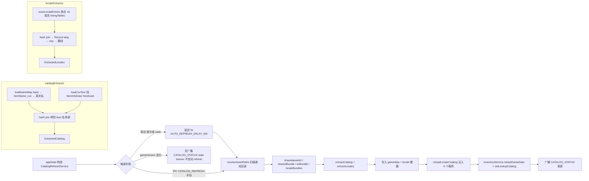
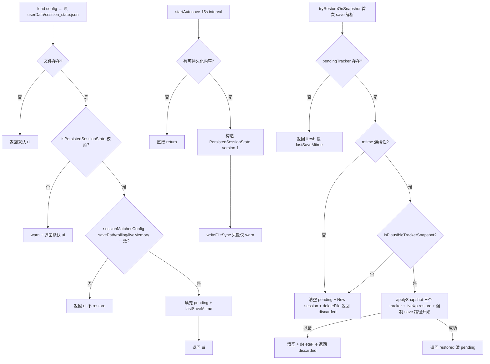

# Catalog Refresh 与 Session 持久化

> 本文是 [`docs/BUSINESS-FLOWS.md`](../BUSINESS-FLOWS.md) 的拆分章节之一。**业务流程的单一真理源仍是主索引文件**——任何业务逻辑改动仍需先查阅本文件，落地后同步更新；本文件只是承载正文，便于按需加载。
>
> 从游戏 Unity bundle 提取 catalog / 本地化数据，以及会话状态的落盘与恢复。
>
> 所有文件路径以仓库根为基准（`app/src/...`）。

> ← [主索引](../BUSINESS-FLOWS.md) · 上一竧[Market 与 Steam 价格](06-market.md) · 下一竧[BoxTimer 与 StageRun](08-box-timer-and-stage-run.md) · 章节：§9 / §10

---

## 9. Catalog Refresh 业务流程

### 流程图

三种触发时机 → 扫描游戏目录 → 从 Unity bundle 提取 catalog/locale → 写入并推送给下游服务。



文件：`app/src/main/catalogRefreshService.ts`。

### 9.1 启动时机

`CatalogRefreshService` 在 `appState.ts` 顶部构造。**自动触发**：启动时若 `localeData` 为空（首次运行）或 `status.stale`，自动 refresh。**`stale` = catalog 版本 ≠ 游戏版本，或已加载 catalog 的 `schemaVersion` ≠ `CATALOG_SCHEMA_VERSION`（如 `IsDeletedInServer` 过滤加入前生成的旧 `userData/gamedata.json`，仍含 Lv85 装备）**——两者都会触发一次 refresh 用新逻辑重写缓存（旧缓存自愈）。自动 refresh 会**延迟 3s**（`AUTO_REFRESH_DELAY_MS`）：`extractCatalog`/`extractLocales` 在主进程同步解析大体积 Unity bundle 会阻塞全部 IPC handler，若与启动首帧重叠会拖住 renderer 的首批 `getLookupCatalog`/`getInventory` 请求，导致物品栏/掉落页先渲染灰点占位、目录到达后再整体刷新一次；延迟后首帧（图标 + 品质色）先完成，refresh 完成后的 re-emit 成为后台小更新。**手动触发**：IPC `CATALOG_REFRESH` → `catalogRefresh.refresh()` → 成功后 `reloadLocaleCatalog()` + `inventory.reloadGameData(...)` + `inventory.setLookupCatalog(...)`。**gameVersion 变化触发**：`liveMemory.setOnGameVersionChanged(() => catalogRefresh.onGameVersionChanged())` — 广播 `CATALOG_STATUS`（stale banner）+ **版本失配自动刷新（2026-09-17）**：`onGameVersionChanged` 现在会在确认失配（`catalogVersion` 与 `gameVersion` 均非 null 且不等）时调用 `maybeAutoRefresh()` 自动执行一次 `refresh()`——此前只出 banner 等用户手点，实测旧 `userData/gamedata.json` 会无限期继续生效（新物品无映射、新宝箱进 unclassified）。护栏：每个目标游戏版本每次应用运行只自动刷一次（`autoRefreshedVersion`），失败不自动重试（banner 保留，手动刷新可用），`autoRefreshInFlight` 防重入；仅版本失配触发，schema-only stale（游戏未运行、gameVersion=null）仍走手动/启动路径。

### 9.2 resolveAssetPaths 扫描游戏目录

`resolveGameInstallDir(configGameInstallDir)`：优先级

1. `config.gameInstallDir`（用户 Settings 设置）。
2. `TBH_GAME_INSTALL_DATA_DIR` env（dev/test override）。
3. `DEFAULT_GAME_INSTALL = "D:\SteamLibrary\steamapps\common\TaskbarHero\TaskBarHero_Data"`。
4. null。

`resolveAssetPaths(installDir)`：

- `sharedassets0` = `<installDir>/sharedassets0.assets`：物品 CSV（ItemInfoData TextAsset）。
- `sharedBundle` = `<installDir>/StreamingAssets/aa/StandaloneWindows64/localization-assets-shared_assets_all.bundle`：SharedTableData（hash → key 映射）。
- `enBundle` = `<installDir>/StreamingAssets/aa/StandaloneWindows64/localization-string-tables-english(unitedstates)(en-us)_assets_all.bundle`：英文字符串表。
- `localeBundles`：动态扫描 `localization-string-tables-*_assets_all*.bundle`，用 `parseLocaleBundleFilename(filename)` 解析 BCP-47 code，normalize 到 app 语言代码。

### 9.3 catalogExtractor 从 Unity bundle 提取的数据

文件：`app/src/core/unityAssets/catalogExtractor.ts`。

`extractCatalog({ sharedassets0, sharedBundle, enBundle }) → ExtractedCatalog`：

#### 步骤 1：构造 nameMap（`loadNameMap`）

1. `parseBundle(sharedBundle)` → `parseSerializedFile` → 找 classID=114 (MonoBehaviour) 对象 → 取 raw bytes → `scanMarkerEntries(raw)` 得到 `[{ keyId, hash, str }]`（shared 表的 hash → key 映射）。
2. 同样处理 `enBundle` → 英文 hash → string 映射。
3. 以 hash 为 linker，匹配 shared 的 key（仅 `ItemName_` 前缀）与 en 的 value，得到 `Map<ItemName_xxx, EnglishName>`。

#### 步骤 2：读 CSV（`loadCsvText`）

1. `sharedassets0` 可能是 raw SerializedFile 或 UnityFS bundle（按 magic bytes `UnityFS` 检测）。
2. `parseSerializedFile(sfData)` → 找 classID=49 (TextAsset) 对象 → `parseTextAssetRaw(raw)` 拿 name + script。
3. 找 name 为 `"ItemInfoData"` 的 TextAsset，返回其 script（CSV 文本）。

#### 步骤 3：解析 CSV

- 去除 BOM，按行 split，header 含 `ItemKey, NameKey, GRADE, ITEMTYPE, Level, IsCanExchangeMarketable, IsDeletedInServer` 等列。
- 每行：`ItemKey` 非数字 skip；`NameKey` 以 `ItemName_` 开头从 nameMap 查找；字面量直接用；空则 `#${itemKey}` 占位。
- **服务器已删除过滤**：`IsDeletedInServer=True` 的行（不可获取物品，如 v1.2.2 全部 Lv85 装备）**跳过**，其 id 记入 `deletedIds`。这些行仍在游戏 CSV 中（官方仅打标记未删除行记录），不过滤会导致图鉴列出游戏内不存在的物品。
- **NameKey-only entries**：nameMap 中存在但 CSV 没有的，追加为 `{ id, name, grade: "", type: "", level: null, marketTradable: false }`；**已出现在 `deletedIds` 的 id 不追加**（其 `ItemName_<id>` key 仍存在于本地化表，否则会以空 type 行被拉回）。
- 返回 `ExtractedCatalog` 带 **`schemaVersion`**（`CATALOG_SCHEMA_VERSION = 2`，`app/src/core/unityAssets/catalogExtractor.ts`）：提取输出形状/过滤语义变化时递增，用于驱动旧缓存自愈（见 9.1 / 9.5）。

#### 占位名回填（9.5 步骤 6）

`extractCatalog` 的 nameMap 来自 enBundle 的 `scanMarkerEntries`（二进制标记扫描），可能漏掉部分 `ItemName_<id>` key —— 典型是多品阶/多等级共享一个基础名称的物品（如物品 id `160103` 的 NameKey 其实是 `ItemName_160003`），这些 key 运行时二进制扫描抓不到。因此 `extractCatalog` 对这类物品返回的 `name` 是 `ItemName_xxx` 占位符。

`CatalogRefreshService.refresh()` 在写入 `userData/gamedata.json` 前调用 `backfillItemNames(items, getLocaleData())`（`app/src/main/catalogRefreshService.ts`），用「bundled 全表转储 `data/_game_locale_dump.json`（由 `scripts/dump_game_locale.py` 经 UnityPy typetree 全表解析生成，捕获每种本地化 key）+ 运行时 overlay」合并的 locale 表，**按占位符 name 内嵌的 key**（而非物品 id）解析真实名称；无法解析的占位符保持原样。游戏升级新增物品时，重跑 `scripts/dump_game_locale.py` 更新转储，下次目录刷新即自动识别。为让 Lookup 页可检索到、且 Inventory/Loot 显示中文名，`LookupService.setGameData()`（`app/src/main/services/LookupService.ts`）把 gamedata 里 `lookup_items.json` 缺失的可玩法物品（GEAR/MATERIAL）并入查找目录，name 经 `gameItemName+localeCatalog` 本地化；每次 `reloadLocaleCatalog()` 重新并入并重注入到 tracking/inventory。并入项按类型推导图标名（材料 `item-<id>`、装备 `<GEARTYPE小写>-<id>`，`GEARTYPE` 由 `catalogExtractor` 写入 gamedata），`data/icons` 存在对应文件才填 `iconPath`，否则渲染回退等级色点。

### 9.4 localeExtractor 提取 16 种语言 labels

文件：`app/src/core/unityAssets/localeExtractor.ts`。

`extractLocales({ sharedBundle, locales: Record<code, Buffer> }) → ExtractedLocales | null`：

- `scanLocaleEntries(bundleBuffer)`：扫描所有 MonoBehaviour（locale bundle 含多个 StringTables：items/stats/grades/gearTypes/UI 等），append-only 聚合所有 entries。
- sharedBundle 提供 `hash → key`，每个 locale bundle 提供 `hash → translated string`。
- 用 hash join 得到 `Record<lang, Record<key, translated>>`。
- 单个 locale 失败返回空 map（不抛错）。

### 9.5 提取结果写入 + IPC 推送

`CatalogRefreshService.refresh()` 完整流程：

1. `resolveGameInstallDir(getGameInstallDir())` → null 抛错。
2. `resolveAssetPaths(installDir)` → 检查三个核心文件存在。
3. `readFileSync` 三个核心 buffer。
4. `extractCatalog({ sharedassets0, sharedBundle, enBundle })` → `{ items, stats, gameVersion, schemaVersion }`。
5. `gameVersion = liveMemory.getStatus()?.gameVersion ?? extracted.gameVersion`（优先用运行中游戏的版本）。
6. **占位名回填**：`backfillItemNames(items, getLocaleData())`（见 9.3）把 `ItemName_<id>` 占位名解析为完整 locale 表的真实名；先 `clearBundledJsonCache()` 确保读到最新 `data/_game_locale_dump.json`。回填数量大于 0 时记一条 info 日志。
7. 写 `userData/gamedata.json` = `{ gameVersion, schemaVersion, items: extracted.items }`（`schemaVersion = CATALOG_SCHEMA_VERSION`，供下次启动判断 stale / 旧缓存自愈）。
8. `gameData.reload(userDataDir)`：GameDataProvider 重新加载。
9. **locale 提取**（best-effort）：
   - 读所有 localeBuffers。
   - `extractLocales({ sharedBundle, locales: localeBuffers })`。
   - 成功 → 写 `userData/locale.json` + 更新 `cachedLocale` + 日志 per-language entry count。
   - 失败 → per-locale 诊断日志。
10. `lastRefreshMs = Date.now()`、`lastError = null`。
11. `broadcastStatus()` → `broadcast(IPC.CATALOG_STATUS, getStatus())`。
12. 返回 `CatalogRefreshResult = { ok: true, gameVersion, itemCount, resolvedNames }`。

**`reloadLocaleCatalog()`**（`appState.ts`）在 refresh 成功后被调用：把 `catalogRefresh.getLocaleData()` 合并到 base LocaleCatalog，然后 fan-out 到所有服务：`tracking.setLocaleCatalog`、`inventory.setLocaleCatalog`、`boxTimers.setLocaleCatalog`、`stageRuns.setLocaleCatalog`、`liveMemory.setLocaleCatalog`、`lookup.setLocaleCatalog`。

**渲染侧消费**：renderer 通过 `tryMergeGameLocale`（`app/src/renderer/i18n.ts`）经 `window.tbh.getLocaleData()` 拿同一份 locale 数据，用 `flatGameKeysToLabels`（`app/src/renderer/lib/gameLocaleLabels.ts`）把 `Grade_/Stat_/BaseStatName_/UniqueMod_/SkillName_` 等前缀摊入 i18next `common:labels.*`。图鉴装备「唯一效果」经 `common:labels.uniqueMods.<mod>` → `itemLabels.uniqueModLabel` 渲染；其中含占位符的模板会结合 `lookup_items.json` 里 `stats.unique.params`（构建时由 `gear_unique()` 从 `UniqueModInfoData.Param*` 归类）填充：技能名走 `common:labels.skillNames.*`、职业名走 `labels.classes`、数值按 `Raw_Divide1000/Raw_Divide100/Divided` 换算，任一占位符不可解析（元素、StatValueUp `unknown`）或模板缺 `params` 时回退 `text`。

## 10. Session 持久化（`app/src/main/services/SessionStateService.ts`）

### 流程图

load 校验恢复 / 15s autosave / 首次 save 解析时的 tryRestoreOnSnapshot（含 mtime 连续性与数值合理性双校验）。



### 10.1 状态字段

- `pendingTracker / pendingChestDropTracker / pendingBoxOpenTracker / pendingLastSaveMtime`：从 `session_state.json` 读出但尚未应用到 tracker 实例的快照。
- `lastSaveMtime`：最近一次 save 的 mtime（秒）。
- `saveTimer`：15s autosave interval。
- `statusOverride`：临时状态文本（"New session" 等），60s 后自动清除。
- `ui: { miniOverlayOpen, boxTrackerOpen }`。

### 10.2 load(config) → SessionUiSnapshot

1. `savePath = expandPath(config.savePath)`。
2. 清空 pending。
3. `path = userData/session_state.json`。
4. 文件不存在 → 返回默认 ui。
5. `raw = JSON.parse(readFileSync)` → `isPersistedSessionState(raw)` 校验（version===1、字段类型正确）。无效 → warn + 返回默认。
6. 读出 `ui` 字段。
7. `sessionMatchesConfig(raw, savePath, config)` 校验：`savePath` 一致、`rollingWindowMinutes` 一致、`liveMemoryEnabled` 一致当前 `isLiveMemoryActive(config)`。不匹配 → info + 返回 ui（不 restore）。
8. pending 字段填充，`lastSaveMtime = raw.lastSaveMtime`。
9. 返回 ui。

### 10.3 startAutosave / 15s 流程

`saveTimer = setInterval(() => persist(ctx.tracker, ctx.chestDropTracker, ctx.boxOpenTracker, ctx.lastSnap, ctx.config), 15000)`

`persist` 流程：

1. `mtime = lastSnap?.saveMtime ?? lastSaveMtime`。
2. 若 `mtime === null && !tracker.isInitialized && pendingTracker === null` → 直接 return（无可持久化内容）。
3. `savePath = expandPath(config.savePath)`。
4. 构造 `PersistedSessionState` payload（含 `version: 1`、`savePath`、`lastSaveMtime`、`rollingWindowMinutes`、`liveMemoryEnabled`、`tracker: tracker.captureSnapshot()`、`chestDropTracker`、`boxOpenTracker`、`ui`）。
5. `mkdirSync(dirname, { recursive: true })` + `writeFileSync(path, JSON.stringify(payload, null, 2))`。
6. 失败仅 warn。

### 10.4 tryRestoreOnSnapshot（首次 save 解析时调用）

`tryRestoreOnSnapshot(tracker, chestDropTracker, boxOpenTracker, snap) → "restored" | "fresh" | "discarded"`：

1. `!pendingTracker || pendingLastSaveMtime === null` → `lastSaveMtime = snap.saveMtime`，返回 `"fresh"`。
2. **mtime 连续性校验**：`snapshotContinuesSession(pendingLastSaveMtime, snap)` = `snap.saveMtime >= pendingLastSaveMtime`。失败 → 清空 pending、`lastSaveMtime = snap.saveMtime`、`setStatusOverride("New session")`、`deleteFile()`、返回 `"discarded"`（save 被回滚或替换）。
3. **数值合理性校验**：`isPlausibleTrackerSnapshot(pendingTracker)`（`app/src/core/sessionState.ts:35`）— 校验 cumulativeGained、sessionRateValue、rollingRateValue、所有 heroMeters.gained 与 rolling 都通过 plausibility 检查；**金币字段校验（2026-09-17）**：`currentGold`/`prevGold`（非 null 时）须过 `isPlausibleGoldBalance`（有限、≥0、<1e15）、`goldGained` 须过 `isPlausibleCumulativeGold`（含按 elapsed 的隐含速率上限 `MAX_PLAUSIBLE_GOLD_RATE=5e10/h`）——此前只查 XP，脏 live 读数或游戏更新余额迁移会随快照恢复。失败 → 同上清理 + 返回 `"discarded"`（防止 live/save baseline 混合污染的快照被恢复）。
4. **应用 snapshot**：try 块中调用 `tracker.applySnapshot(pendingTracker)` + `chestDropTracker.applySnapshot(pendingChestDropTracker)` + `boxOpenTracker.applySnapshot(pendingBoxOpenTracker)`。任一抛错（schema drift / 腐败）→ warn + `deleteFile()` + 返回 `"discarded"`。
5. **金币基线对账（2026-09-17）**：`applySnapshot` 后、`finally` 清空前，调用 `tracker.reconcileGoldBaseline(snap.gold, snap.saveMtime, pendingLastSaveMtime)`（见 §4.10）——离线期间游戏更新迁移余额时不再把差值算成会话收益；离线期合理增益仍按旧语义计入一次。
6. finally 块清空 pending + 更新 `lastSaveMtime = snap.saveMtime`。
7. 成功返回 `"restored"`。

`applySnapshot` 内部还会调用 `liveXp.restore` / `liveGold.restore` / `healInflatedXpTotals`，并强制 `xpLiveOwning = goldLiveOwning = false`（恢复的 session 从 save 路径开始）。

### 10.5 clearSession

`clearSession(tracker, chestDropTracker, boxOpenTracker, config)`：

- 清空所有 pending。
- `tracker.reset()`、`chestDropTracker.reset()`、`boxOpenTracker.resetAll()`。
- `persist(tracker, chestDropTracker, boxOpenTracker, null, config)` — 立即落盘一份空 session（覆盖旧文件）。

### 10.6 PersistedSessionState 字段

```
{
  version: 1,
  savePath: string,
  lastSaveMtime: number,
  rollingWindowMinutes: number,
  liveMemoryEnabled?: boolean,
  tracker: TrackerSnapshot,    // 含 sessionStart/cumulativeGained/heroMeters/samples/...
  chestDropTracker?: ChestDropTrackerSnapshot,
  boxOpenTracker?: BoxOpenTrackerSnapshot,
  ui: { miniOverlayOpen: boolean, boxTrackerOpen: boolean }
}
```
