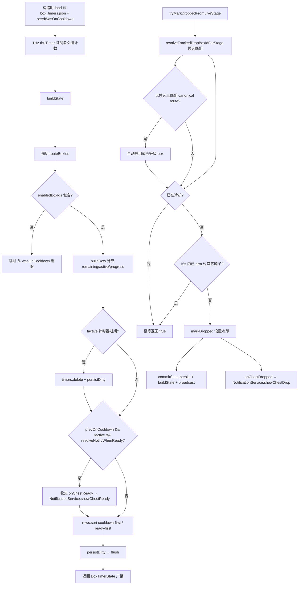
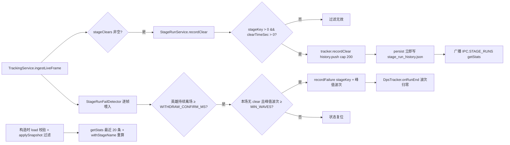

# BoxTimer 与 StageRun

> 本文是 [`docs/BUSINESS-FLOWS.md`](../BUSINESS-FLOWS.md) 的拆分章节之一。**业务流程的单一真理源仍是主索引文件**——任何业务逻辑改动仍需先查阅本文件，落地后同步更新；本文件只是承载正文，便于按需加载。
>
> 宝箱冷却倒计时窗口与通知、关卡通关 / 失败的记录与统计。
>
> 所有文件路径以仓库根为基准（`app/src/...`）。

> ← [主索引](../BUSINESS-FLOWS.md) · 上一竧[Catalog Refresh 与 Session 持久化](07-catalog-refresh-and-session.md) · 下一竧[ChestService 与 AutoClassify](09-chest-and-autoclassify.md) · 章节：§11 / §12

---

## 11. BoxTimer 业务流程（`app/src/main/services/BoxTimerService.ts`）

### 流程图

1Hz tick 的 buildState 检测冷却→就绪转换并发通知；阶段 BOSS 掉落经 `tryMarkDroppedFromLiveStage` 进入冷却（含自动启用逻辑）。

### 11.1 数据来源

- `catalogFile = loadStageBoxCatalogFile()`：读 `data/stage_boxes.json`，含 `defaultCooldownSeconds`。**gameVersion 告警（2026-09-17）**：`GameDataProvider.loadStageBoxes`（`app/src/main/gameDataProvider.ts`）现在会读取文件里的 `gameVersion` 字段（此前写入了但无人读），与已加载 gamedata 的版本不一致时打 warn——旧表在新游戏版本下会静默失配（新关卡箱不计时、不进 tracker），至少要可诊断。
- `routes = loadStageBoxTrackerRoutes()`：从 catalog 过滤 `grade === "RARE" && obtainable && tracker.canonical === true` 的条目，构造 `StageBoxTrackerRoute[]`。注意该过滤用的是**物品稀有度** `grade`，因此除标准 `920xxx` 关卡 Boss 箱外，还包含 `925xxx` 污染箱（Contaminated Stage Box，Nightmare/Hell/Torment 各 20 条，等级与标准箱重复：40/65/90）——目录共 71 条路线、仅 11 个不同等级。
- `routeById = trackerRoutesById(routes)`、`boxById = new Map(...)`、`routeBoxIds`（按 level 升序）。
- `buildCatalog()` 的每个 `BoxTimerCatalogEntry` 额外带 `category`（由箱名经 `categoryFromBoxItemName` 推导）：标准关卡 Boss 箱 → `"rare"`，污染箱 → `"plagueRare"`。渲染层据此区分：**等级 chip 仍按 level 合并**（71→11）；**「逐等级设置」按 (category, level) 聚合**，标准箱与污染箱各占一行，以便分别设置冷却/通知（两者自动开启用时不同）。污染多变体组不显示「刷怪位置」下拉（各变体关卡不同），改为列出掉落区间。

### 11.2 1Hz tickTimer 与 subscribers 引用计数

`startTick()`：`subscribers++`；若 `tickTimer` 已存在直接返回；否则 `setInterval(() => push(), 1000)`。

`stopTick()`：`subscribers = max(0, subscribers-1)`；若 `subscribers > 0 || !tickTimer` 返回；否则 `clearInterval`。

订阅者来自 `boxTrackerWindow`：窗口创建时 `boxTimers.startTick()`，关闭时 `stopTick()` + `setBoxTrackerOpen(false)` + `tracking.flushSession()`。无订阅者时停止 tick 节省 CPU。

### 11.3 关键方法

- **`setCurrentStageKey(key)`**：值变化时更新 `currentStageKey` 并 `push()`。
- **`markDropped(boxId)`**：`timers.set(boxId, Date.now())`；触发 `onChestDropped?.({ boxId, name, level })` → NotificationService.showChestDrop；`commitState()`（persist + buildState + broadcast）。
- **`tryMarkDroppedFromLiveStage(stageKey) → boolean`**：
  1. `boxId = resolveTrackedDropBoxIdForStage(stageKey, enabledBoxIds, routes, idealStageKeyByBoxId)`：
     - 过滤 `enabledBoxIds.has(boxId) && route.dropStageKeys.includes(stageKey)` 的候选。
     - 0 候选 → 走自动启用逻辑（见下）。
     - 1 候选 → 直接返回。
     - 多候选 → 优先匹配 farmStageKey；无匹配则用全部候选；按 level 降序选最高级。
  2. **自动启用**（2026-08-27 新增）：当无可启用候选时，若 `stageKey` 仍匹配某 canonical RARE tracker route，则自动把该 route 中等级最高的 box 加入 `enabledBoxIds`（清 `catalogCache`），再继续计时。原因：默认启用的四个中局等级（Lv15/20/30/40，覆盖关卡上限只到 2304）不覆盖后期关卡（如 Lv80 宝箱 id=920801），导致用户刷后期关卡时**任何**本次 BOSS 掉落都不会触发 BoxTimer 倒计时/通知（日志表现为反复 `matched route(s) [...] but none enabled; skipping`，`Stage boss drop detected` 出现 0 次）。自动启用是显式且廉价的：该等级确实在被刷，启动其冷却符合预期。日志记 `auto-enabled LvN box (id=...) — was disabled`。
  3. `boxId == null` → 返回 false（stage 无任何可掉 route）。
  4. `isBoxOnCooldown(boxId)` → log info + 返回 true（已冷却中，幂等跳过）。
  5. **同一次掉落去重**（2026-09-10 新增）：若 `lastStageDropBoxId !== 0 && lastStageDropBoxId !== boxId && now - lastStageDropArmAtMs < LIVE_STAGE_DROP_DEDUPE_MS(=15000)`，则 log info + 返回 true（不再 arm 第二个箱子）。
     - 背景：本入口曾有**两条上游**——live 路径（TrackingService 的 GetBox 日志）与 save-reconcile 路径（AutoClassifyService 的槽位增量补偿），二者各自用自己的 stage 快照反查 boxId。当两条快照跨越等级边界（如 Torment 2-8=Lv80 / 2-9=Lv90 相邻）时，同一次掉落会解析出**两个不同箱子**，同时启动两个倒计时。
     - 2026-09-10 起 save-reconcile 路径**不再调用**本方法（见 14.4 Step 5），倒计时由 live 路径独占触发，根因已消除。此护栏保留为兜底：若 live 路径自身把一次掉落的 GetBox burst 拆成两次 flush、且其间 stage 恰好跨级，仍只能 arm 一个箱子。
     - 判定依据：stage BOSS 宝箱来自关卡通关，通关间隔以分钟计；15s 窗口内的「跨箱子 arm」不可能是两次真实掉落。同一箱子的重复上报仍由第 4 步的 `isBoxOnCooldown` 兜底。
     - 只有本入口会更新 `lastStageDropArmAtMs/lastStageDropBoxId`；手动 `markDropped`（UI/IPC）不参与去重，避免抑制后续真实掉落。
  6. 否则 `markDropped(boxId)` + 记录 `lastStageDropArmAtMs/lastStageDropBoxId` + 返回 true。
- **`setBoxTrackerNotify(boxId, enabled)`**：enabled=true → 从 `notifyWhenReadyByBoxId` 删除（恢复默认 true）；enabled=false → set false；清 catalogCache + commitState。
- **`setCooldownSeconds / setFarmStageKey / setEnabledBoxIds / setSortOrder / clearCooldownOverride / clearFarmStageOverride`**：类似 markDropped 的"修改内部状态 → 清 catalogCache → commitState"模式。`setCooldownSeconds` 限制 [60, 86400]；`setFarmStageKey` 必须在 route.dropStageKeys 内。

### 11.4 buildState() — 1Hz tick 核心

1. `now = Date.now()`。
2. 遍历 `routeBoxIds`：
   - `!enabledBoxIds.has(boxId)` → 从 `wasOnCooldown` 删除 + continue。
   - `prevOnCooldown = wasOnCooldown.get(boxId) ?? false`。
   - `row = buildRow(boxId, now)`：计算 `remainingSeconds`、`active`、`progress`。
   - 若 `!active`（计时器刚过期）：从 `timers.delete(boxId)` + 标记 `persistDirty = true`（延迟到 buildState 末尾统一持久化）。
   - **通知检测**：`prevOnCooldown && !row.active && resolveNotifyWhenReady(boxId)` → push 到 `readyNotifications`。
   - `wasOnCooldown.set(boxId, row.active)`。
3. 触发 `onChestReady?.(payload)` for each readyNotification → NotificationService.showChestReady。
4. `rows.sort(compareBoxTimerRows(a, b, sortOrder))` — `cooldown-first`：冷却中优先（按 remainingSeconds 升序），就绪按 level/boxId；`ready-first`：相反。
5. 计算 `readyCount` / `cooldownCount`。
6. 若 `persistDirty` → flush 一次 persist。
7. 返回 `BoxTimerState`。

### 11.5 seedWasOnCooldown（load 时调用）

构造后立即调用：对每个 `enabledBoxIds`，根据 `timers.get(boxId)` 与 cooldown 计算 remaining，>0 则 `wasOnCooldown.set(boxId, true)`，否则 `false`。**防止首次 buildState tick 触发假 onChestReady**（通知只在 `prev=true → active=false` 转换时触发，`false → false` 不触发）。

### 11.6 box_timers.json 持久化

**load()**：构造时调用。文件不存在 → 用 `defaultEnabledIds()` 填充 `enabledBoxIds`（DEFAULT_ENABLED_BOX_IDS = `[920151, 920201, 920301, 920401]`，过滤掉 catalog 中不存在的；fallback 取 routeBoxIds 前 4 个）。文件存在 → 解析 `PersistedFile`：

- `timers`：过滤有效 boxId + droppedAtMs。
- `cooldownSecondsByBoxId`：过滤 Number.isFinite + >0 + routeById 中存在的。
- `idealStageKeyByBoxId`：过滤 route.dropStageKeys 包含 stageKey，且不等于 route.idealStageKey。
- `notifyWhenReadyByBoxId`：boolean 化。
- `sortOrder`：normalizeBoxTrackerSortOrder。
- `enabledBoxIds`：过滤 routeById 中存在的；空则用 defaultEnabledIds。

**persist()**：序列化为 `{ timers, enabledBoxIds, cooldownSecondsByBoxId, idealStageKeyByBoxId, notifyWhenReadyByBoxId, sortOrder }`。`notifyWhenReadyByBoxId` 只持久化 `false` 项（默认 true 不写盘）。失败仅 warn，不破坏 in-memory state。

### 11.7 notificationPrefs vs per-box notify 的区别

- **notificationPrefs**（config.json）：全局通知偏好，按 kind（chestDrop / chestReady / heroLevelUp / inventoryAlmostFull）配置 `enabled + sound`。`NotificationService.playKindSound` 检查 `notificationPrefs[kind].enabled` 决定是否播音。
- **per-box notifyWhenReady**（box_timers.json）：单宝箱级别的"就绪通知开关"。`BoxTimerService.resolveNotifyWhenReady(boxId)` 决定是否调用 `onChestReady`。两者是"双层开关"：per-box 关闭则完全不触发回调；per-box 开启但 notificationPrefs.chestReady.enabled=false 则回调到达 NotificationService 但不播音。

## 12. StageRun 业务流程（`app/src/main/services/StageRunService.ts` + `app/src/core/stageRunTracker.ts`）

### 流程图

仅 live 路径触发：clear 事件直接记录；失败由 StageRunFailDetector 用"英雄在场下降沿"推断。

### 12.1 触发时机

`StageRunService.recordClear(stageKey, clearTimeSec, xpGained, goldGained)` 由 TrackingService 在 `ingestLiveFrame` 内检测到 `snap.stageClears.length > 0` 时通过 `onLiveStageClear` 回调调用。`StageRunService.recordFailure(stageKey, failedWave)` 由同一调用链内对"失败 run"的推断触发（见 12.3 检测规则）。两者**仅在 live memory 路径触发**，save 路径不触发（save 无 stageClears / alive 数据）。

### 12.2 recordClear 流程

1. `tracker.recordClear(stageKey, clearTimeSec, xpGained, goldGained)`：
   - `stageKey <= 0 || clearTimeSec <= 0` → return（过滤无效）。
   - `history.push({ wallTime, stageKey, clearTimeSec, xpGained: max(0, xpGained), goldGained: max(0, goldGained) })`。
   - 超 `HISTORY_LIMIT = 200` → `splice(0, length - 200)`（保留最近 200 条）。
2. `persist()`：`writeFileSync(stage_run_history.json, JSON.stringify(tracker.captureSnapshot(), null, 2))` — 每次 clear 都立即落盘。
3. `push()`：`broadcast(IPC.STAGE_RUNS, getStats())`。

### 12.3 失败记录（recordFailure）检测规则

游戏没有失败日志类，因此失败**无法直接读取**，只能由 live memory 推断，检测逻辑收敛在 `app/src/core/stageRunFailDetector.ts`（`StageRunFailDetector`），由 `TrackingService.ingestLiveFrame` 每帧喂入：

- **run 边界信号（英雄在场）**：失败判定以**部署队伍**（`StageManager.HeroList`，即 `snap.heroes` 是否非空）为 run 边界。英雄在一整场战斗中都留在场上，只在 run 结束时撤下——要么通关离开、要么失败撤走。因此"英雄从在场(`heroes.length>0`)变为不在场"的**下降沿**就是一次 run 结束。对比用场上怪数(`alive`)：英雄信号在**波间隙不会触发**（波隙时英雄始终在场上），所以**不需要"空场持多久"的时间阈值**，快速自动重开也能捕捉。
- **撤场防抖（2026-09-09）**：`readParty` 会在英雄 live 经验回退 / offsets 抖动 / 场景切换时让 `heroes` 短暂为空（`null` 或空数组）。若把每个这样的下降沿都当作真实撤场，会 (a) 中途清零 `DpsTracker` 波次、(b) 记录一条**虚假失败**关卡。因此下降沿**去抖**：英雄必须持续不在场 ≥ `WITHDRAW_CONFIRM_MS`（400ms，`snap.at` 时钟）才确认撤场；窗口内恢复在场（`heroes` 复现非空）则取消待确认判定。真实撤场是持续离场（列表恒为空），不会因窗口漏检。
- **判定失败**：当英雄**确认撤离**（run 结束）且本场**无 clear 事件**（`runHadClear === false`）且 run 峰值波次 **≥ `MIN_WAVES(2)`**（过滤"进图即退"）时，调用一次 `onLiveStageFail(stageKey, failedWave)`。`update` 现返回 `{ fail, runEnded }`（`StageRunFailJudgement`）：`fail` 仅在失败时非空、`runEnded` 在确认撤场（胜或败）时恒 true。**失败判定与撤场处理都排在该确认 tick 上、先 fail 后 `runEnded`**：`fail` 先读**峰值波次（`runMaxWaves`）**——团灭时「怪物清空 → 波次达到关卡总波数的强制重置（R4）」会在撤离前几个 tick 把 `DpsTracker` 波次清零，读瞬时值会因 `< MIN_WAVES` 静默丢弃真实关底失败（2026-09-02 修复）；随后用 `runEnded` 调 `DpsTracker.onRunEnd()` 把波次归零，使失败/通关后快速自动重开时 UI 波次回落到第 1 波。判后状态复位，下一场独立判定。从未部署过英雄（菜单/大厅）不触发。

  > 旧签名返回单一 `StageRunFailResult | null` 不再成立：`onRunEnd` 必须在**任意**确认撤场（含成功通关）时触发，而不仅是失败，故拆为 `{ fail, runEnded }`。

- **成功通关不误判**：有 clear 事件的 run 会置 `runHadClear=true`，确认撤场时不会判失败；且通关后结算同样会让英雄撤下，但因已记成功记录（首次 clear 因基线差分取 0 增益也照常记录）不会重复失败。额外防御：TrackingService 在任何有效 clear 的 tick 先 `failDetector.reset()`，且去抖窗口内若读到 clear 同样置 `runHadClear=true`，杜绝 clear/撤离时序抖动带来的误判。阈值 `MIN_WAVES` 与 `WITHDRAW_CONFIRM_MS` 为启发式可调常量，仍存在极有限误判风险（如无需 clear 就撤离的换图/退出场景）。

### 12.4 独立持久化

`stage_run_history.json` 与 `session_state.json` **完全独立**：session 重置不影响 stage run history。原因：stage run history 是"历史记录"而非"session 统计"，不应被 reset session stats 或 live-memory-toggle 重置清空。

### 12.5 load + restore 校验

- **load()**（构造时）：文件不存在 return；存在则 `JSON.parse` → `tracker.applySnapshot(raw)`。失败仅 warn。
- **applySnapshot**：`raw.history` 必须是 array，否则清空。每条用 `isValidHistoryEntry` 校验，过滤后 slice 到 HISTORY_LIMIT。校验按 `outcome` 判别式：`outcome === "fail"` 的条目只需 `wallTime`/`stageKey`/`failedWave >= 1`（清除时字段为 0 不被检查）；其余（clear 或旧版无 `outcome` 的遗留条目）仍需 `clearTimeSec > 0` 及有限 `xpGained`/`goldGained`。因此旧版 `stage_run_history.json` 可原样加载。

### 12.6 getStats()

返回 `StageRunStats`：`{ history: 最近 20 条倒序, readerRequired: true }`。每条调用 `withStageName(entry, localeCatalog)` 重新计算 stageName（不信任持久化的 stageName，支持语言切换）。失败条目在渲染层显示"失败"徽标、失败波次，XP/金币列置为 `—`。
