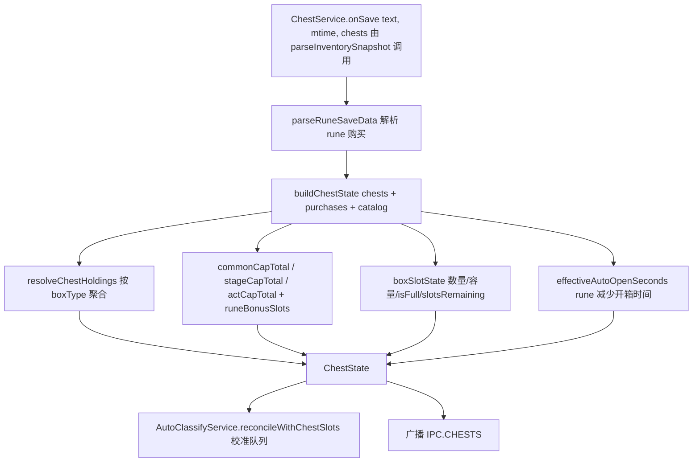
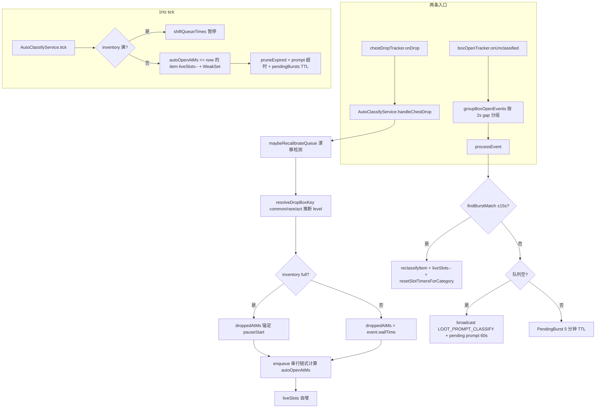
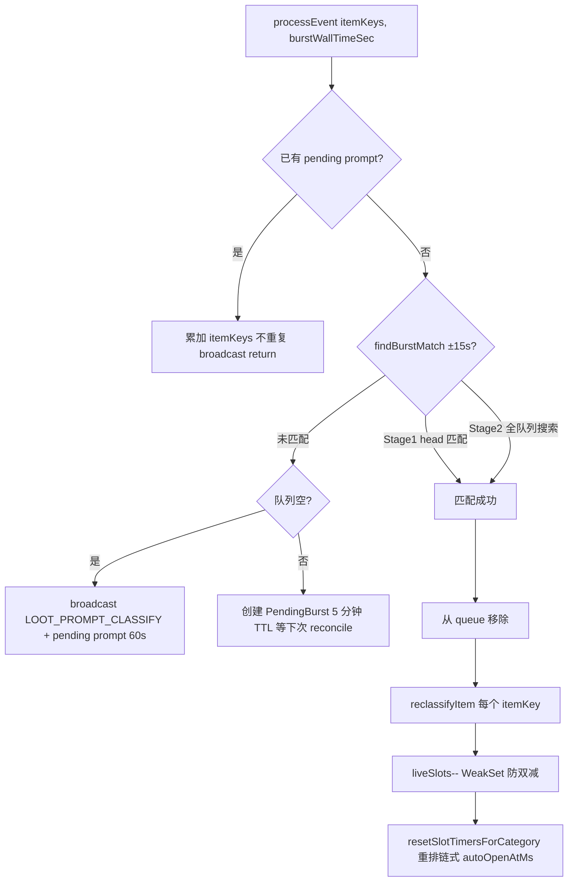
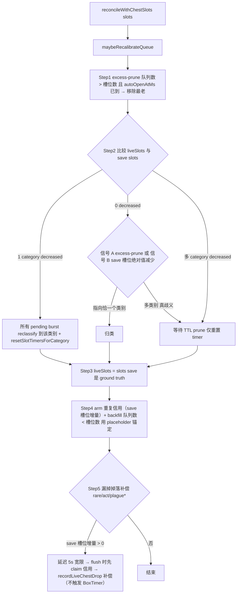

# ChestService 与 AutoClassify

> 本文是 [`docs/BUSINESS-FLOWS.md`](../BUSINESS-FLOWS.md) 的拆分章节之一。**业务流程的单一真理源仍是主索引文件**——任何业务逻辑改动仍需先查阅本文件，落地后同步更新；本文件只是承载正文，便于按需加载。
>
> 宝箱槽位解析、容量与保管结构，以及开箱后自动分类的串行队列模型与漂移校准。
>
> 所有文件路径以仓库根为基准（`app/src/...`）。

> ← [主索引](../BUSINESS-FLOWS.md) · 上一竧[BoxTimer 与 StageRun](08-box-timer-and-stage-run.md) · 下一竧[Notification / Update / Pet](10-notification-update-pet.md) · 章节：§13 / §14

---

## 13. ChestService 业务流程（`app/src/main/services/ChestService.ts`）

### 流程图

onSave 解析 → buildChestState 聚合/容量/开箱时间 → reconcile 校准 AutoClassify → 广播。

### 13.1 onSave 触发

`chests.onSave(text, mtime, chests: ChestHolding[])` 由 `TrackingService` 的 `parseInventorySnapshot` 回调调用。`chests: ChestHolding[]` 来自 `inventory.parseFromSave(text, mtime).chests`。

### 13.2 resolveAndPush 流程

1. `purchases = parseRuneSaveData(text)` — 解析玩家购买的 rune 列表。
2. `lastChests = buildChestState(chests, purchases, mtime, boxTypes, runeCap, runeAutoOpen)`（`app/src/core/boxes/resolve.ts`）：
   - `rows = resolveChestHoldings(chests, boxTypeCatalog)`：按 boxType 聚合数量，attach label/category，按 category 排序。
   - `commonCapTotal = commonBoxCapacity(purchases, runeCapCatalog)` = `baseCapacity + runeCapacityBonus`。
   - `stageCapTotal`、`actCapTotal` 同理（注意 stageBoss 对应 "rare" 分类）。v1.02.00 起另有 `plagueCommon/plagueRare/plagueAct` 三组独立容量（污染宝箱独立保管）。
   - `common = boxSlotState(quantityForCategory(rows, "common"), commonCapTotal)` — 计算数量、容量、isFull、slotsRemaining。
   - `stageBoss`、`actBoss` 同理；`plagueCommon/plagueRare/plagueAct` 同理（类别来自污染宝箱前缀分类）。
   - `capacity`：每类的 `{ base, runeBonus, purchasedCapRuneNodes, runeLabel }` 明细（含 plague 三组）。
   - `autoOpen`：`effectiveAutoOpenSeconds(purchases, runeAutoOpenCatalog.common/stageBoss/actBoss/plague*)` — rune 减少自动开启时间。
   - 返回 `ChestState`：`{ rows, common, stageBoss, actBoss, plagueCommon, plagueRare, plagueAct, capacity, autoOpen, totalHeld, saveMtime, runeBonusSlots }`。
3. `reconcile()`：触发 `onReconcile?.({ common, rare: stageBoss.quantity, act: actBoss.quantity, plagueCommon, plagueRare, plagueAct })` — AutoClassifyService 用此校准队列。
4. `broadcast(IPC.CHESTS, lastChests)`。

### 13.3 容量计算（`app/src/core/boxes/capacity.ts`）

- `boxCapacity(purchases, def) = def.baseCapacity + runeCapacityBonus(purchases, def)`。
- `boxSlotState(heldQty, capacity)`：clamp quantity ≥0、capacity ≥1，`isFull = quantity >= capacity`，`slotsRemaining = max(0, capacity - quantity)`。

### 13.4 与 AutoClassifyService 的协作

- **`setOnReconcile(cb)`**：appState 装配时注入 `(slots) => autoClassify.reconcileWithChestSlots(slots)`。
- **`getAutoOpenSeconds()`**：AutoClassifyService.handleChestDrop 时调用，返回 `{ common, stageBoss, actBoss, plagueCommon, plagueRare, plagueAct }` 或 null（首次 save 解析前）。null 时 AutoClassify 用 FALLBACK_AUTO_OPEN = `{ common: 300, stageBoss: 600, actBoss: 60, plagueCommon: 600, plagueRare: 1200, plagueAct: 120 }`。

### 13.5 v1.2.2 宝箱槽位：save 侧 BoxBucketGetBoxList 路径

v1.2.2 把 `PlayerSaveData.BoxData`（两列 int，静态可达）整体移除，但**未开箱子仍以 STAGEBOX 普通物品形式存在于 `itemSaveDatas`**。其中 `BoxBucketGetBoxList`（未开）/`BoxBucketUseBoxList`（已开）记录部分箱子的 `UniqueId`，但**并不覆盖全部**——详见下方第 3 步的判定规则。

**解析**（`app/src/core/inventory/parse.ts → parseChests`）：

1. `player.BoxData` 存在 → 走旧路径（BoxTypes × BoxQuantity）。
2. 否则从 `playerStr` 按原始文本遍历 `itemSaveDatas` 物品对象（`UniqueId` 超 `Number.MAX_SAFE_INTEGER`，**必须字符串比较**，禁止 JSON.parse 后转 number），`type` 携带 gamedata 物品 id。
3. **持有的判定（2026-09-13 修复）**：凡 `classifyBoxItemKey(itemKey)` 返回已知 STAGEBOX 分类（`Normal Monster Box*`→common、`Stage Boss Box*`→rare、`Act Boss Box*`→act，`categoryFromBoxItemName` 在 `core/liveMemory/chestSlots.ts`）且该 item 的 `UniqueId` **不在 `BoxBucketUseBoxList`（已开桶）** 即计入持有。
   - **关键**：不要求一定出现在 `BoxBucketGetBoxList`（未开桶）。v1.2.2 实测普通/关卡箱（910901/920901）的 `UniqueId` 在未开桶，而**章节 Boss 箱（930901）的 `UniqueId` 既不在未开桶也不在已开桶、仅以 STAGEBOX 物品存在于 `itemSaveDatas`**。旧实现用「未开桶」过滤 → 章节 Boss 箱被误判为已开而整体丢弃 → act 持有=0 → reconcile 把刚 +1 的实时计数覆盖回 0（"掉落章节宝箱后队列被误归零"）。
   - 未知 id 的箱子（`classifyBoxItemKey` 返回 null）仍以出现在未开桶作为识别依据，计入 unclassified 行（`Type <itemId>`），不静默丢弃，便于发现 gamedata 过期。
4. 分类由调用方注入 `classifyBoxItemKey`（`InventoryService.parseFromSave` 按 gamedata `type === "STAGEBOX"` + 物品名前缀）；分类结果写入 `ChestHolding.category/label`。
5. `resolveChestHoldings`（`core/boxes/resolve.ts`）优先采用 holding 自带的 `category/label`，缺省回退 boxTypeCatalog（旧版本行为不变）。

历史教训：曾尝试内存侧「逐箱 BoxData 清堆枚举」兜底（方案 B，已移除）——其前提是"save 无法提供逐类数量"，实为误判；且 v1.2.2 堆中箱子对象无稳定类名（`BoxData` 不在 GA 类索引），枚举不可靠。**v1.2.2 宝箱槽位以 save 为唯一数据源**，live 快照 `chestSlots` 在 v1.2.2 下为 null，`ChestService.setLiveSlots(null)` 回落 save 派生值。

**注意（2026-09-10 修复）**：`live` 帧（~25Hz）在 v1.2.2 下每帧都回调 `setLiveSlots(null)`。旧实现中 `unchanged` 判定要求 `slots != null`，故 `null→null` 永远被判为"变化"，导致**每帧都拿上一次 save（滞后）触发一次 reconcile**。这会在同一帧内（`TrackingService.ingestLiveFrame` 先记录 live 掉落、后调 `onLiveChestSlots`）把刚入队、save 尚未记录的箱子当作 excess 剪掉，等 save 追平后再以"对账时刻"为锚 backfill —— 宝箱开箱倒计时锚点被推后、**系统性偏慢**，且后续 save 重读无法回正。现 `setLiveSlots(null)`（override 已为 null 时）直接 return，v1.2.2 的对账改由 save 解析（`onSave → reconcile`）驱动。

另注：方案 B 曾长期静默失效的直接原因是 utilityProcess 消息未解包——`process.parentPort.on("message")` 回调收到的是事件对象 `{data: payload}`，真实载荷在 `.data` 上（`worker.ts` 已修复，"stop" 指令曾同样因此失效）。

#### 13.5.1 v1.2.4 act 幽灵条目与会话作用域过滤（2026-09-18）

**现象**：游戏升到 v1.2.4 后，Chests 页 act 槽位卡显示 4 个章节 Boss 箱、BoxTimer 队列出现 4 个永不倒计时的幽灵条目，而游戏内宝箱面板显示 0。

**根因**（用真实存档 + 每日备份时间序列实证）：

1. v1.2.2 起 act（930901）箱子**从不进入** `BoxBucketGetBoxList`/`BoxBucketUseBoxList`（v1.2.4 未变），仅以 STAGEBOX 物品存在于 `itemSaveDatas`——真实在持与已开的区分只能靠"条目消失"（开箱时游戏直接删除条目，且不写入 UseBoxList）。
2. 2026-09-17 06:26–12:30 之间（v1.2.4 升级加载点 12:28 前后），存档出现 4 条连续 UID 的 act 条目（与同窗口的 rare 箱 UID 交错 ⇒ 老版本会话内掉落）。
3. v1.2.4 加载存档时恢复了 common/rare（走 GetBoxList）但**没有恢复这些 act 条目**——游戏内从此显示 0，而这 4 条在 itemSaveDatas 中**永久残留**（后续同会话掉落的 10 个 act 箱正常掉落/开箱/消失，佐证开箱删除机制本身正常）。
4. 旧规则「已知 STAGEBOX 且不在 Use 桶即持有」把这 4 条幽灵全部计入 → act=4 多算；AutoClassify reconcile 又以此校准队列 → BoxTimer 出现永不开启的条目。
5. UID 全文检索确认：幽灵条目在全存档中仅 itemSaveDatas 一处引用；但真实在持 act 箱亦然——**桶与存档内部结构均无法区分幽灵与在持**。

**修复**：会话作用域过滤（`app/src/core/boxes/sessionScope.ts`，纯函数 + 单测）：

- 不变量（v1.2.4 实证）：**凡游戏会话开始时就已存在于存档的 act 条目，游戏内必然不可见**。因此 act 持有数 = 本游戏会话内首次出现的 act 条目。
- 会话边界判定（`deriveSession`）：游戏版本变化（升级重启）＞ 存档 mtime 回退（换档/回档）＞ 距上次存档超 30 分钟（游戏关闭）。
- 首次启用过滤时的存量 act 条目按 `LEGACY_SESSION_ID` 记录并**保守排除**（来源不可知）。
- 仅作用于 `act` 类别；无 `uniqueId` 的条目（旧 BoxData 路径）直接放行；`common/rare` 走 GetBoxList 恢复、不受影响；**`plagueAct` 行为未实证，暂不过滤（观察项）**。
- 状态持久化在 `userData/chest_session_scope.json`（load-once / persist-on-change；仅会话切换或 uid 表变化时写盘），companion 重启不丢会话上下文。
- `parseChests` 现在为每条 holding 传播原始 `uniqueId`（字符串，非数值化）；`ChestState.orphanExclusions.act` 向 UI 报告本轮排除数（Chests 页 act 卡下方提示）。

**已知权衡**：若某游戏版本恢复了「act 箱跨重启保留」，本过滤会在每次游戏重启后短暂少计 act（直到下一次 act 掉落重新入账）。这是「无法从存档区分幽灵」前提下的保守取舍。

#### 13.5.2 会话边界改用「游戏会话锚点」（2026-09-19，修 v1.24.1 漏判）

**问题**：v1.24.1 用「存档 mtime 间隔 > 30 分钟」判定游戏重启，实测漏判——游戏**启动后数秒即写档**，可观测间隔只剩停机时长。2026-09-19 现场：01:47:53 最后一次存档 → 02:09:22 游戏重启（Player.log 轮转、steam_autocloud.vdf/backend.dat 同步改写）→ 02:13 首档，间隔约 25 分钟 < 阈值 ⇒ 边界未判定，重启前掉落的 10 个 act 条目继续带着旧会话标签计入（游戏侧已丢失 ⇒ 显示 0）⇒ act 卡再次多算 10。

**修复**：新增**游戏会话锚点**（`ChestService.gameAnchorMtimeSec()`）——游戏只在**启动时**改写的兄弟文件，按优先级取 mtime：

1. `Player-prev.log`（Unity 每次启动把 Player.log 轮转为它，mtime = 本次会话启动时刻；结构性保证）
2. `backend.dat`（兜底，实测同样在启动时改写）

`ChestService.setSavePath()` 由 appState 在启动、配置变更（setConfig）与 `onSavePathChange` 三处注入存档路径；锚点变化 ⇒ 边界 `anchor`（`deriveSession`），与版本变化/存档回退/30 分钟间隔（降级为兜底）并列。

**升级兼容**：v1.24.1 及更早写出的状态文件没有 `lastGameAnchor` 字段，无法证明其跟踪的是当前游戏会话 ⇒ 首次解析强制一次 `anchor-unknown` 边界（保守排除存量 act 条目）。实测：当前存档 14 条 act（4 幽灵 + 10 重启前）在该边界后全部排除，act 显示 0，与游戏一致。

**不变量再确认**（2026-09-19 实证）：游戏重启后 act 条目**不恢复**——重启前掉落的 10 条至今仍留在 itemSaveDatas 却不在游戏内显示；common/rare 走 GetBoxList 正常恢复。因此「会话开始前既存的 act 条目 = 游戏侧不可见」成立。

### 13.6 v1.02.00 Plague（瘟疫）宝箱：独立保管槽位

游戏 v1.02.00（瘟疫之地/Plaguelands）新增**污染宝箱**（Contaminated Box，CONTENTTYPE=PLAGUE），与普通宝箱**分开保管**（wiki 确认「通常エリアの宝箱とは別に保管」，容量/自动开箱由专用符文节点控制）：

| 物品                              | 前缀                       | 类别           | 容量符文链                                          | 自动开箱                                                                                    |
| --------------------------------- | -------------------------- | -------------- | --------------------------------------------------- | ------------------------------------------------------------------------------------------- |
| `915xxx` Contaminated Normal Box  | `Contaminated Normal Box`  | `plagueCommon` | `MaxAmountPlagueNormalChest` (1162, 11621-11624)    | `UnlockAutoOpenPlagueNormalChest` 600s + `ReduceAutoOpenPlagueNormalChestTime` 4s/级        |
| `925xxx` Contaminated Stage Box   | `Contaminated Stage Box`   | `plagueRare`   | `MaxAmountPlagueStageBossChest` (1164, 11641-11644) | `UnlockAutoOpenPlagueStageBossChest` 1200s + `ReduceAutoOpenPlagueStageBossChestTime` 8s/级 |
| `935xxx` Contaminated ActBoss Box | `Contaminated ActBoss Box` | `plagueAct`    | `MaxAmountPlagueActBossChest` (1166, 11661-11664)   | `UnlockAutoOpenPlagueActBossChest` 120s + `ReduceAutoOpenPlagueActBossChestTime` 1s/级      |

**companion 适配（2026-09-10）**：

- **分类**：`categoryFromBoxItemName`（`core/liveMemory/chestSlots.ts`）新增三个前缀匹配 `Contaminated Normal/Stage/ActBoss Box` → `plagueCommon/plagueRare/plagueAct`；`BoxCategory` 类型（`shared/types.ts`）相应扩展。
- **容量/自动开箱**：`data/rune_box_cap.json` / `rune_auto_open.json` 新增 `plagueCommon/plagueRare/plagueAct` 三组（boxType 3/4/5）；`resolve.ts buildChestState` 与 `capacity.ts` 新增对应容量函数；`ChestState` 接口新增三个槽位。
- **box_types.json**：新增 3/4/5 三个 boxType（绿色），供 live 路径 `readRuntimeChestSlots` 与 `boxCategoryFromType`（`boxOpenLog.ts`）映射。
- **AutoClassify**：`reconcileWithChestSlots` / `getQueueSnapshot` 的类别遍历扩展为 6 类；`autoOpenForBoxKey` 支持 plague 类别；FALLBACK_AUTO_OPEN 增加 plague 值。
- **UI（2026-09-11 更新）**：Chests 页新增三张 Plague 槽位卡（`CapacityBar` 新增 green variant）；Loot 页类别标签同步；`LootQueueSlots` 槽位卡渲染 6 行（瘟疫行绿色进度条）；**手动分类弹窗 `ClassifyPromptDialog` 与未分类物品重分类下拉 `LootBoxSection.reclassifyCategoryOptions` 均提供 6 个类别选项**（瘟疫类别 resolve 后走 `category.plague*` boxKey）。**掉落计时圈（LootRing）瘟疫独立三档**：`LootRingSeconds` 扩展为 6 键，`ringKeyForCategory` 将 plague\* 映射到独立档位；默认圈时长 plagueCommon=5min / plagueRare=7min / plagueAct=1h（主进程 `config.ts` 默认值与 sanitize 同步扩展，老 config 缺键自动回落默认）。
- **行为边界**：污染宝箱 save 侧解析与普通宝箱一致（BoxBucketGetBoxList + itemSaveDatas 前缀分类）。
- **掉落追踪（2026-09-11 更新）**：`ChestDropTracker` 已支持 6 类（common/rare/act/plagueCommon/plagueRare/plagueAct）。live 掉落依据**当前地图判定瘟疫**——瘟疫箱子只在瘟疫之地掉落，`isPlagueStage(stageKey)` 聚合瘟疫箱（915/925/935）的 `tracker.dropStageKeys`/`idealStageKey` 成 Set，`resolveLiveDropCategory` 在瘟疫地图把 base category 升级为 `plague*`（详见 14.4 Step 5）。AutoClassify 的 reconcile 补偿类别已扩至 6 类；Live/Loot 掉落面板均渲染 6 类。

## 14. AutoClassify 业务流程（`app/src/main/services/AutoClassifyService.ts`）

### 流程图

两条入口（live 掉落 / 开箱结果）进入 per-category 串行队列；1Hz tick 推进队列与超时处理。

详细规约见 [`docs/findings/auto-classify-business-logic.md`](./findings/auto-classify-business-logic.md)，本节是摘要。

### 14.1 核心模型：串行队列（per-category shared timer）

每个 category（common/rare/act）有独立的 shared timer。新掉落进入队列时：

- 队列为空 → `autoOpenAtMs = droppedAtMs + autoOpenSec*1000`。
- 队列非空 → `autoOpenAtMs = prevTail.autoOpenAtMs + autoOpenSec*1000`（必须等前面所有同类 chest 开完）。

队列按 `autoOpenAtMs` 升序排序，全局 head = 下一个预计自动开启的 chest。

### 14.2 关键回调

- **`handleChestDrop(event)`**：`chestDropTracker.onDrop` 触发。
  1. `maybeRecalibrateQueue()` — 检测 autoOpenSeconds 漂移。
  2. `stageKey = getCurrentStageKey() ?? 0`。
  3. `autoOpen = chestService.getAutoOpenSeconds() ?? FALLBACK_AUTO_OPEN`。
  4. `boxKey = resolveDropBoxKey(event, stageKey)`：common → commonRoutes 推断 level；rare → BoxTimer catalog 推断 level；act → actBossRoutes 推断 level。**stageKey 未知（≤0）或匹配不到任何 route 时返回 category-only boxKey（`common`/`rare`/`act`，无 `:level` 后缀）**，绝不回退到最低等级 —— 避免在关卡信息缺失瞬间把后期掉落错误归类成 `common:1`/`act:1`（2026-08-28 修复）。
  5. **重复抑制（`outstandingReconcileCredits` 信用消费），必须在任何 queue/slot 变更之前（2026-09-23 修复）**：`cat = categoryFromBoxKey(boxKey)`；若 `liveSlots` 存在且 `cat` 有效，则在 `outstandingReconcileCredits` 中查一条 `category === cat && expiresAtMs > Date.now()` 的信用：
     - **命中** → `splice` 掉该信用后**直接 `return`**：该箱子已被先前的 save 对账计入（Step 3 已把它折进 `liveSlots`，Step 4 已 backfill 进队列），既不入队也不自增。
     - **未命中** → 继续走第 6、7 步。
     - **为何必须前置**：旧实现把该判断放在 `enqueue()` **之后**，于是命中信用时只跳过了 `liveSlots[cat]++`，却仍然无条件 `enqueue()` 追加了一条重复队列项。`liveSlots` 因此始终正确（掩盖了 bug），但**队列永久比 save 深一个**：`excess-prune` 只能剪 `autoOpenAtMs` 已到的条目，而新追加的重复项计时器在**未来**，永远剪不掉 → 不收敛。这正是用户报的「普通宝箱数量还是有问题」（偏多、常态可见）。**回归守卫见 `test/main/autoClassifyService.commonOverreportRepro.test.ts`——必须同时断言 `liveSlots` 与队列长度**（只断言 `liveSlots` 会让此 bug 漏网）。
  6. **inventory full 处理**：`droppedAtMs = inventoryFullSinceMs != null ? getEffectiveNow() : event.wallTime*1000`（pause 期间掉落的 chest 锚定到 pauseStart，让倒计时显示完整 autoOpenSec）。
  7. `queue = enqueue(queue, {...})` — 串行链式计算 autoOpenAtMs。
  8. `liveSlots[cat]++`（实时槽位跟踪）。
  9. 日志：命中信用时打 `drop boxKey=... already counted by save (credit consumed); skipping enqueue queueLen=...`；正常入队时打 `queued drop boxKey=... stageKey=... queueLen=...`。
- **`handleUnclassifiedBatch(entries)`**：`boxOpenTracker.onUnclassified` 触发（microtask 批处理）。
  1. `events = groupBoxOpenEvents(entries.map(e => ({itemKey, wallTime})))` — 按 2s gap 把 entries 分组成"开箱事件"。
  2. 对每个 event 调用 `processEvent(itemKeys, evt.startMs)`。

### 14.3 processEvent(itemKeys, burstWallTimeSec)

#### 流程图

1. 若已有 pending prompt → 累加 itemKeys（不重复 broadcast），return。
2. `burstMs = burstWallTimeSec * 1000`。
3. `match = findBurstMatch(burstMs)`：
   - Stage 1：head-first match — 全局 head 的 `autoOpenAtMs` 在 ±15s（`BURST_MATCH_GRACE_MS`）内 → match。
   - Stage 2：全队列搜索最近的 ±15s 内 item。
4. **匹配成功**：
   - 从 queue 移除该 item。
   - 对每个 itemKey 调用 `boxOpenTracker.reclassifyItem(UNCLASSIFIED_BOX_KEY, itemKey, item.boxKey)`。
   - 实时槽位：`liveSlots[cat]--`（除非已在 WeakSet 中，避免 double-decrement）。
   - WeakSet.add(item)。
   - **校准同 category 剩余 items**：`resetSlotTimersForCategory(cat, burstMs + autoOpenSec*1000)` — 重排链式 autoOpenAtMs，避免累积误差。
5. **未匹配 + 队列空**：broadcast `LOOT_PROMPT_CLASSIFY`，创建 pending prompt（60s 超时）。
6. **未匹配 + 队列非空**：创建 PendingBurst（5 分钟 TTL），等下次 `reconcileWithChestSlots` 通过 save 槽位 delta 分类。

### 14.4 reconcileWithChestSlots(slots) — 每次 save 解析触发

#### 流程图

1. `maybeRecalibrateQueue()`。
2. **Step 1: excess-prune**：对每个 category，queue 数 > slot 数 → 从 **`autoOpenAtMs` 已到（<= `getEffectiveNow()`）** 的条目里移除最老的 `excess` 个（本应已开）。
   - **只剪"已到自动开启时刻"的箱子（2026-09-10 修复）**：`autoOpenAtMs` 仍在倒计时中的箱子**必定还在保管**，不可能已自动开启。此时 queue 数超过 save 槽位数只说明 **save 还没记录刚落下的 live 掉落**，而非有箱子被开。旧实现按 `autoOpenAtMs` 升序无条件剪掉最早的 `excess` 个——被剪的恰恰是**队首（真正的 head）**，于是「新增宝箱」时 head 被移除、其后的箱子被提升为新 head，**"下个开启"倒计时反而变大**（违反了串行队列"新箱入队尾、head 不动"的不变量）。手动提前开启由 `processEvent` 的未分类 burst 路径处理，不依赖本步。
   - **配套修复（同日）**：`ChestService.setLiveSlots(null)`（v1.2.2 live 槽位不可用时每帧回调）旧实现因 `unchanged` 判定要求 `slots != null` 而每帧（~25Hz）以**滞后的上一次 save** 触发本步，会把 fresh live 掉落立即剪掉；现 null→null 为 no-op，对账改由 save 解析驱动（见 5.7、13.5）。
3. **Step 2: classifyPendingBursts(slots, prevSlots, prunedByCategory)**：比较 `liveSlots`（pre-save 实时）与 save 的 slots：
   - **类别遍历为 6 类（2026-09-11 扩展）**：`common/rare/act` + `plagueCommon/plagueRare/plagueAct` 全部参与 decreased 检测、第二信号（excess-prune/save 绝对值减少）与 ambiguous 分支的 timer 重置——污染宝箱开箱产生的 pending burst 与普通宝箱走同一套分类规则。
   - 1 category decreased（无论 pending burst 数量）→ 把**所有** pending burst 的 items 都 reclassify 到该 category + `resetSlotTimersForCategory`（anchor = 最晚 burstMs + per-cat autoOpenSec）。**多 burst 不构成歧义**——开箱 reader 会把一次手动"开全部"按 live 帧/批次拆成多个 burst（每个帧 flush 一个），但既然只有单一类别槽位减少，这些 burst 必然全部属于该类别（2026-09-01 修复：原实现要求 pendingBursts 恰好为 1）。
   - 0 category decreased → 用两个**无竞态的第二信号**（save 派生）兜底，二者指向**恰一个**类别才归类（多类别点亮=真歧义→等待 TTL prune）：
     - **信号 A（excess-prune 计数）**：Step 1 中 `prunedByCategory[cat] > 0` 即"队列数 > 槽位数 **且存在已到自动开启时刻的条目**"，证明有宝箱被打开但未被 burst 消耗；
     - **信号 B（save 槽位绝对值减少）**：`prevSlots[cat] > slots[cat]`（上次 save vs 本次 save）。
       两者覆盖"堆积宝箱手动全开、autoOpenAtMs 早已过、1Hz tick 抢先把 liveSlots 减掉导致 delta 为 0"的场景（2026-09-02 修复：原来 delta=0 时无脑等待，burst 5 分钟 TTL prune 后物品滞留未分类）。
   - 多 category decreased（真正歧义）→ 不 reclassify，所有 category 用 earliestBurstMs + per-cat autoOpenSec 重置 timer。
4. **Step 3: liveSlots = {...slots}** — save 是 ground truth，覆盖实时调整。
4. **Step 4: backfill + 重复信用 arm**：
   - **backfill**：queue 数 < slot 数（live reader 漏掉或刚启动）→ 用 placeholder item 锚定到当前 `getEffectiveNow()`，每个获得完整 autoOpenSec 倒计时。
   - **重复信用 arm（`outstandingReconcileCredits`，2026-09-10 引入 / 2026-09-23 修正消费点）**：对每个 `prev = lastReconcileSlots != null && slots[cat] > prev[cat]` 的类别，压入 `slots[cat] - prev[cat]` 条信用（`expiresAtMs = Date.now() + RECOVERY_GRACE_MS(=5s)`）。含义：save 新计入的这批箱子，其 live GetBox burst **可能仍在路上**（reader 滞后于 5s save watcher，或同一颗箱子被重复上报）；当它真的到来时，`handleChestDrop` 必须**消费信用并完全跳过入队/自增**（详见 §14.2 第 5 步），因为 Step 3 已把增量折进 `liveSlots`、Step 4 已 backfill 进队列。
   - **该 arm 与 backfill 判定相互独立**：即使队列已与 save 数相等（无 backfill），也必须 arm —— 否则一颗 trailing burst 会把 `liveSlots` 顶到 `save + 1`。
   - **仅在 `prev != null` 时 arm**：首次对账（app 启动、队列为空）不得把启动前既存的宝箱当作新掉落。
   - **信用的两条释放路径**：① `handleChestDrop` 命中即消费（正常路径）；② `pruneExpiredReconcileCredits` 在 `RECOVERY_GRACE_MS` 后丢弃（live 从未上报 → 不能永久压制后续合法掉落）。`setEnabled(false)` 清空全部信用。
6. **Step 5: 漏掉掉落补偿（rare/act/plague\*，延迟宽限）**：backfill 期间，当 `prev = lastReconcileSlots != null` 且某 boss 类别（rare/act/plagueCommon/plagueRare/plagueAct）的 save 槽位 `increase = slots[cat] - prev[cat] > 0`，则该增量代表 live reader 从未 surfacing 的真实掉落（实时 `readRuntimeChestLog`/fastpoll/burst 均可能漏掉）。把 `count = min(increase, deficit)` 存为待定恢复、延迟 `RECOVERY_GRACE_MS=5s` 后由 `flushDueDropRecoveries` 先 claim 信用再对差额补偿（`recordLiveChestDrop` 补偿，不触发 BoxTimer）：
   - **打开反推获得（auto-open 兜底，2026-09-11）**：Step5 依赖"存档未开槽位净增"，对"掉落即被自动打开"（save 净变 0）失效。补一条不依赖槽位的来源——**打开事件**。`classifyAllPendingBursts` 把"被打开但未匹配到活获得记录"的 `pendingBursts` 归入某类别后，用守恒补记：若该类别最近 `OPEN_BACKFILL_WINDOW_SEC`(=120s) 内的获得记录数（`ChestDropTracker.dropCountWithin`）不足本次打开数，差额即被 live miss 且 save 补不到的"获得"，以 `"reconcile"` 来源补记（不污染 live 学分）。去重由近窗计数承担，避免把窗口内正常获得重复补记。
   - **去重护栏（live credit 模型，2026-09-10）**：`ChestDropTracker` 按来源区分 live/reconcile，每次 `recordLiveChestDrop(cat, wallTime, "live")` 压入一个**带时间戳的信用**（`liveCreditsByCategory[cat]`）。对账补偿用 `coveredLive = chestDropTracker.claimLiveDropCredits(cat, count)` —— 用 save 的槽位增量去**消耗**这些信用：被消耗的部分是 live 已记录过的掉落，不重复补偿。
     - **为何不能用"每周期 delta/mark"**：save 槽位增量相对 live 检测存在**滞后**（存档写入时机晚于内存中的掉落事件），一个真实的 live 掉落可能要跨若干次 save 对账才能在槽位增量里体现。"每周期标记"会在增量出现前被中间的对账清零 → 仍会重复补偿（即上一版修复失效的原因）。（注：2026-09-10 起 `setLiveSlots(null)` 不再每帧触发 reconcile，对账改由 save 解析驱动，但跨 save 周期的滞后依然存在，故时间上界信用仍必要。）
     - **延迟补偿宽限（2 倍会话速率修复，2026-09-12）**：live credit 模型只覆盖「live 先记、对账后到」的顺序，**反向顺序仍会双计**——对账可能在 live GetBox burst 尚未 flush/记录时就观察到槽位增量（旧版本：`onLiveChestSlots` 5Hz 实时槽位对账与 burst 缓冲发生在同一 live 帧，burst 需 ~0.5–1s 静默后才 flush；v1.2.2：掉落即存档的 save 解析可落在同样的 burst-flush 延迟窗内）。此刻信用尚未压入 → 旧代码立即补偿记一条，随后 live burst flush 再记一条，而其后压入的信用永远等不到增量来消耗 → **同一颗宝箱双计，会话速率读数 ≈ 真实的 2 倍**。修复：Step 5 不再同步补偿，而是把 `count = min(increase, deficit)` 作为**待定恢复（pendingDropRecoveries）**延迟 `RECOVERY_GRACE_MS=5s`，由 1Hz tick / 下次对账在宽限期满时 `flushDueDropRecoveries` 统一**先 claim 信用再决定补偿**：宽限内 live burst 记录了该掉落 → 其信用覆盖增量 → 不补偿；live 真漏检 → 无信用 → 照旧补偿（仅晚 5s，属历史回填、非时间敏感）。补偿仍以 `suppressingHandleChestDrop` 抑制 `onDrop → handleChestDrop` 重复入队，且不触发 BoxTimer。**会话纪元护栏**：待定恢复携带 stash 时的 `ChestDropTracker.getSessionEpoch()`（`reset`/`applySnapshot` 递增），flush 时纪元不一致即丢弃，防止用户在宽限期内重置会话后把旧掉落补进新会话。`setEnabled(false)` 同步清空待定恢复。
     - **信用为何能命中**：真实重复场景是——① live 检测到 rare 掉落（历史+1、信用+1）并经 `handleChestDrop` 入队（queue=1），此时存档尚未写入；② 一次对账读到仍为旧值 0 的 save，Step1 看到 `queue(1) > slots(0)` → **把排队的 rare 提前 excess-prune 掉**（queue=0）；③ 存档写入 rare=1 → 对账 `increase=1, deficit=1` → 旧代码补记一条、用**对账时刻**盖戳（比真实掉落晚数秒，即用户看到的「单次掉落出现两条、间隔 <1 分钟」）。信用跨这些对账存活，在 ③ 覆盖增量 → 不再补记。
     - 信用有时间上限 `LIVE_CREDIT_TTL_SEC = 180s`（`claimLiveDropCredits` 先丢弃过期信用），避免陈旧信用永久压制真正的漏检补偿。
   - 对 `toRecover` 个调 `chestDropTracker.recordLiveChestDrop(cat, nowSec(), "reconcile")` 写入掉落历史 → 修复「掉落统计缺 +1」（`"reconcile"` 不压信用）。用 `suppressingHandleChestDrop` 标志让 `recordLiveChestDrop` 的 `onDrop → handleChestDrop` 入队被抑制，避免与 backfill 本身重复入队。
   - **不再触发 BoxTimer 倒计时**（2026-09-10 变更）：对账只补记掉落历史，不再调用已移除的 `onLiveStageBossDrop`。原因：live 路径（GetBox 日志）与 reconcile 路径（save 槽位增量）各自用自己的 stage 快照反查 boxId，当两条快照跨越等级边界（如 Torment 2-8=Lv80 / 2-9=Lv90 相邻）时，同一次掉落会解析出两个箱子并启动两个倒计时。改为由 **live GetBox 路径独占**倒计时触发（另加 `BoxTimerService` 内的 15s 同次掉落去重护栏兜底），单次掉落只会 arm 一个箱子。
   - **门控**：`prev != null` 排除 app 首次对账（前代既有宝箱不算掉落）；`min(missedLive, deficit)` 确保不超过 save 实际增量（掉落+开启同窗口抵消的案例因 save 数据固有歧义而不记录，比 live 漏检少见得多）。补偿类别为 rare/act/plague*（2026-09-11 扩展）：`plague*`的 save 槽位增量同 rare/act 一样代表真实掉落（live GetBox 路径与 save 路径 stage 快照各自独立，尾部仍旧 same），且`plague\*` 也有 live credit 去重；不记录 common（common live 检测可靠且掉落频繁）。
   - **live 瘟疫地图判定（2026-09-11 新增）**：GetBox 日志只含 `monsterType`（0/1/2 → common/rare/act），无法直接区分瘟疫/普通箱子。但**瘟疫箱子只在瘟疫地图掉落**（`data/stage_boxes.json`：瘟疫箱 id 前缀 915/925/935 的 `tracker.dropStageKeys`/`idealStageKey` 全部落在 act 21+ 的瘟疫之地，普通箱最高到 act 20）。`ChestDropTracker.isPlagueStage(stageKey)` 惰性聚合瘟疫箱掉落关卡成 Set，`resolveLiveDropCategory(stageKey, base)` 据此把 live 掉落的 base category 升级为 `plague*`（TrackingService 调用）。live 升出的 `plague*` 掉落同样压 `plague*` credit，供 Step 5 对账去重。
   - 新日志：`reconcile: deferred N {cat} drop recovery(s) from save slot increase (prev→slots, deficit D) by 5000ms grace`（stash 时）；宽限期满 flush 时：`reconcile: recorded N missed {cat} drop(s) (deferred save slot increase, grace 5000ms, covered-live C)`；信用生效时：`reconcile: {cat} discount C already-live drop(s) (deferred recovery) to avoid duplicate history`。

### 14.5 tick()（1Hz，由 TrackingService.tickTimer 调用）

1. `updateInventoryPauseState()`：
   - `isFull = inv.used >= inv.capacity`。
   - full → not-full 转换：记录 `inventoryFullSinceMs`，不操作 queue。
   - not-full → full 转换：`shiftQueueTimes(pausedMs)` 把所有 non-slot-decremented item 的 `autoOpenAtMs` 和 `expiresAtMs` 向前推 pausedMs。
   - **暂停只看背包（inventory），与 stash 无关**（2026-09-23 用户确认）：`getInventoryStatus` 只返回 `inventoryUsed` / `inventoryCapacity`，游戏也仅在背包满时停下自动开箱计时器。`stashSaveDatas` 的占用**不参与**任何暂停/恢复判定，因此 `InventorySnapshot` 不暴露 stash 容量不构成缺陷。
2. **inventory full 时**：跳过 slot decrement 和 prune（timer 暂停）。仅处理 pending prompt timeout（wall-clock）和 pendingBursts TTL prune。
3. **正常路径**：
   - 遍历 queue prefix，对每个 `autoOpenAtMs <= now` 且未在 WeakSet 中的 item：`liveSlots[cat]--` + WeakSet.add。
   - `queue = pruneExpired(queue, now)` — 移除 `expiresAtMs <= now`。
   - pending prompt 60s 超时 → 置 null。
   - `pruneExpiredPendingBursts(now)` — 5 分钟 TTL。

### 14.6 maybeRecalibrateQueue（漂移检测）

- `current = chestService.getAutoOpenSeconds()`；null → return。
- 与 `lastAutoOpenSeconds` 比较每类：abs delta < 1s 或相对 < 1% → 视为 below threshold。
- 全部 below threshold → return。
- 否则 `recomputeQueueAutoOpenAtMs(current)`：按 droppedAtMs 升序，per-category 链式重算 autoOpenAtMs；重置 WeakSet。

### 14.7 getQueueSnapshot()

返回 `AutoClassifyStatePayload`：`{ enabled, totalQueued, byCategory: [{category, count, nextAutoOpenInMs, lastAutoOpenInMs}], items, liveSlots, paused: inventoryFullSinceMs != null, pendingBurstsCount }`。renderer 在 auto-classify enabled 时 1Hz 调用。
