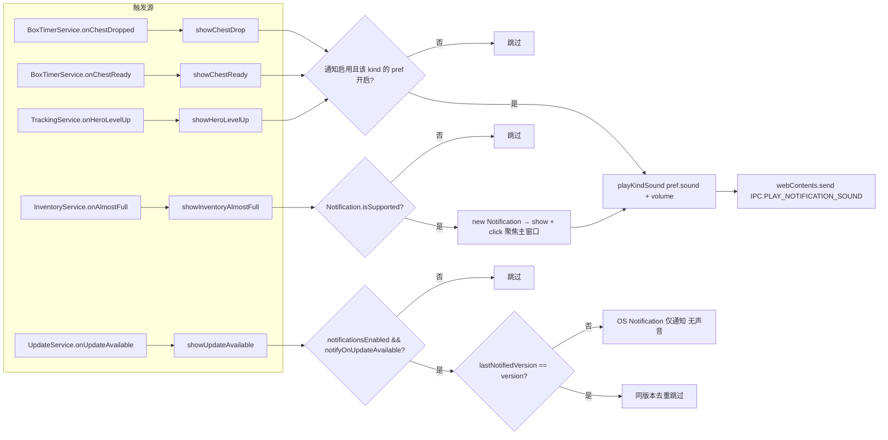
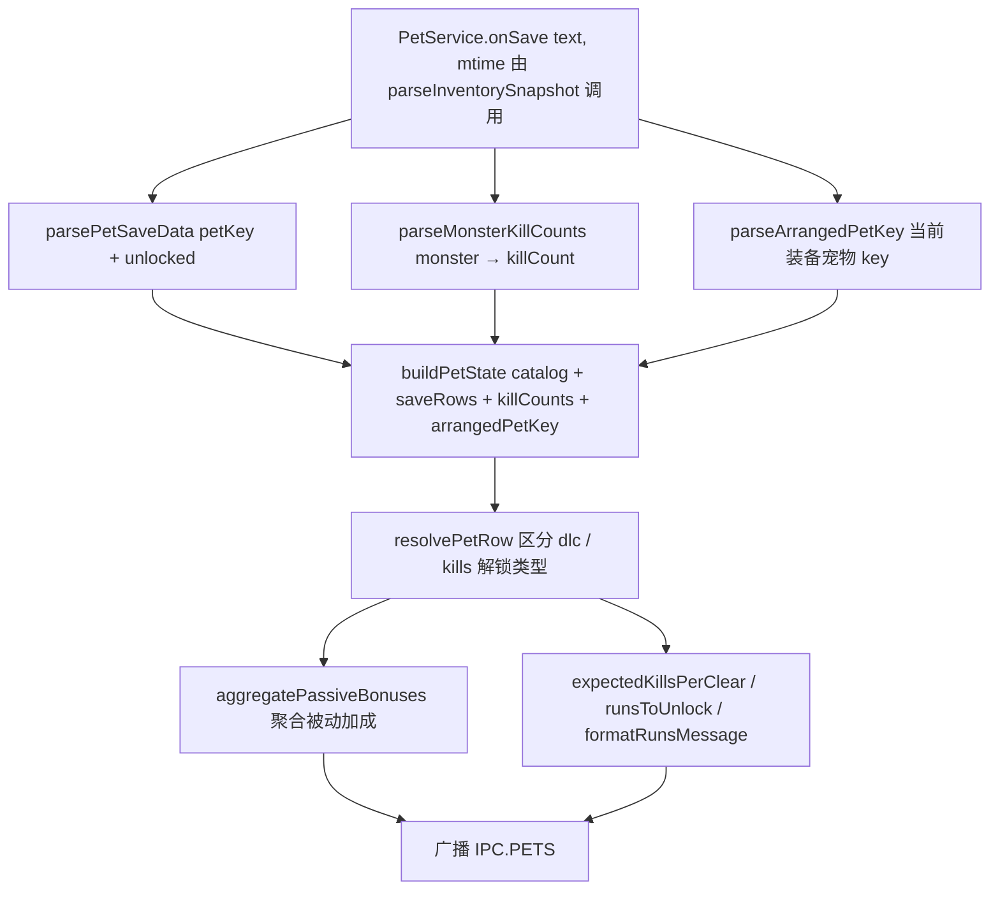

# Notification / Update / Pet

> 本文是 [`docs/BUSINESS-FLOWS.md`](../BUSINESS-FLOWS.md) 的拆分章节之一。**业务流程的单一真理源仍是主索引文件**——任何业务逻辑改动仍需先查阅本文件，落地后同步更新；本文件只是承载正文，便于按需加载。
>
> 面向用户的三个轻量服务：通知路由与音效、应用更新检查、宠物解析与增益计算。
>
> 所有文件路径以仓库根为基准（`app/src/...`）。

> ← [主索引](../BUSINESS-FLOWS.md) · 上一竧[ChestService 与 AutoClassify](09-chest-and-autoclassify.md) · 下一竧[统一记录日志（Record Log）](11-record-log.md) · 章节：§15 / §16 / §17

---

## 15. Notification 业务流程（`app/src/main/services/NotificationService.ts`）

### 流程图

五类触发源按 kind 路由：声音类 / 系统通知类 / 仅系统通知类。

### 15.1 触发源

| 触发源                      | 方法                               | 触发条件                                   |
| --------------------------- | ---------------------------------- | ------------------------------------------ |
| `boxTimers.onChestDropped`  | `showChestDrop(payload)`           | live 检测 rare 掉落或 UI 手动 mark         |
| `boxTimers.onChestReady`    | `showChestReady(payload)`          | buildState 检测 `prev=true → active=false` |
| `tracking.onHeroLevelUp`    | `showHeroLevelUp(events)`          | save 解析时 detectHeroLevelUps 检测到升级  |
| `inventory.onAlmostFull`    | `showInventoryAlmostFull(payload)` | 库存 used/capacity 超过阈值                |
| `updates.onUpdateAvailable` | `showUpdateAvailable(version)`     | GitHub release 检测到新版本                |

### 15.2 路由到 renderer

- **chestDrop / chestReady / heroLevelUp**：仅播放声音。`playKindSound(kind)` → 检查 `notificationsEnabled && notificationPrefs[kind].enabled` → `playSound(pref.sound, volumePercent)` → `sendNotificationSound({ soundId, volumePercent })`。
- **inventoryAlmostFull**：OS Notification + 声音。先 `Notification.isSupported()` 检查，构造 `new Notification({ title, body })`，`notification.on("click", focusMainWindow)`，`notification.show()`；再 `playSound(pref.sound, volume)`。
- **updateAvailable**：仅 OS Notification（无声音）。`notificationsEnabled && notifyOnUpdateAvailable` 检查；`lastNotifiedVersion === version` 去重（同版本只通知一次）。

### 15.3 sendNotificationSound

`sendNotificationSound(payload)`（`app/src/main/services/broadcast.ts`）：从所有 live windows 中找第一个非辅助 renderer（非 #overlay / #box-tracker），通常是主窗口；若无主窗口则用第一个 live window。`webContents.send(IPC.PLAY_NOTIFICATION_SOUND, payload)`。

### 15.4 notificationCatalog（`app/shared/notificationCatalog.ts`）

- 16 种声音：`soft-chime / double-tap / wood-tick / whisper-ping / bright-pop / clear-bell / soft-ding / quick-rise / game-blip / arcade-tone / crystal-chime / happy-ping / magic-spark / level-triumph / treasure-fanfare / gentle-alert`。
- 4 种 kind：`chestDrop / chestReady / heroLevelUp / inventoryAlmostFull`。
- `DEFAULT_NOTIFICATION_PREFS`：chestDrop=treasure-fanfare、chestReady=soft-chime、heroLevelUp=level-triumph、inventoryAlmostFull=happy-ping（全部 enabled=true）。
- `migrateNotificationPrefs`：兼容旧 `chestSoundVariant` 字段迁移到 `notificationPrefs.chestReady`。

## 16. Update 业务流程（`app/src/main/services/UpdateService.ts`）

### 流程图

状态机：checking → available → downloading → ready → error；quitAndInstall 需 phase=ready。

```mermaid
%% TBH flow diagram
flowchart LR
  Start[UpdateService.start 幂等] --> Packaged{app.isPackaged?}
  Packaged -- 否 --> Disabled[phase=disabled]
  Packaged -- 是 --> Setup[autoDownload=false autoInstallOnAppQuit=false]
  Setup --> Events[注册 6 个 autoUpdater 事件]
  Events --> Timer[setTimeout 30s 后台检查]
  Timer --> Check[checkForUpdates]
  Check --> InFlight{in-flight 或 downloading 或 ready?}
  InFlight -- 是 --> RetStatus[返回当前 status]
  InFlight -- 否 --> UpCheck[autoUpdater.checkForUpdates]
  UpCheck -- checking-for-update --> PhaseCheck[phase=checking]
  UpCheck -- update-available --> PhaseAvail[phase=available + onUpdateAvailable 版本]
  UpCheck -- update-not-available --> PhaseNA[phase=not-available]
  UpCheck -- error --> Friendly[friendlyUpdateError 映射网络/GitHub/404 错误]
  Friendly --> PhaseErr[phase=error]
  PhaseAvail --> Download[downloadUpdate 需 phase=available]
  Download -- download-progress --> PhaseDown[phase=downloading + percent]
  PhaseDown -- update-downloaded --> PhaseReady[phase=ready]
  PhaseReady --> Quit[quitAndInstall 需 phase=ready → setAppQuitting + quitAndInstall]
  class Start,Setup,Events,Timer,Check,UpCheck,PhaseCheck,PhaseAvail,PhaseNA,PhaseErr,PhaseDown,PhaseReady,Quit,Friendly,RetStatus data
  class Packaged,InFlight dec
```

### 16.1 启动

`start()`：幂等。`!app.isPackaged` → 设 phase="disabled" + log + return。

packaged 模式：

- `autoUpdater.autoDownload = false`、`autoUpdater.autoInstallOnAppQuit = false`。
- 注册 6 个事件：`checking-for-update` → phase="checking"；`update-available` → phase="available" + `onUpdateAvailable?.(info.version)`；`update-not-available` → phase="not-available"；`download-progress` → phase="downloading" + percent；`update-downloaded` → phase="ready"；`error` → phase="error" + friendlyUpdateError。
- `backgroundTimer = setTimeout(() => checkForUpdates(), 30000)` — 30s 后台检查。

### 16.2 checkForUpdates / downloadUpdate / quitAndInstall

- `checkForUpdates()`：检查 in-flight / phase=="downloading" / phase=="ready" → 直接返回当前 status；否则 `checkInFlight=true` + `autoUpdater.checkForUpdates()`。catch → friendlyUpdateError + phase="error"。
- `downloadUpdate()`：必须 phase=="available"；`downloadInFlight=true` + `autoUpdater.downloadUpdate()`。
- `quitAndInstall()`：必须 phase=="ready"；`setAppQuitting(true)` + `autoUpdater.quitAndInstall()`。

### 16.3 friendlyUpdateError

把网络错误（net::/enotfound/econnrefused 等）映射为"Could not reach GitHub..."；403/429 → "GitHub rate limit"；404 → "No release found"；其它原样返回。

### 16.4 GitHub release 检查

`electron-updater` 默认从 GitHub releases 拉取 `latest.yml`。配置在 `package.json` 的 `build.publish`（GitHub repo）。本项目无自定义 provider，依赖 electron-updater 默认行为。

## 17. Pet 业务流程（`app/src/main/services/PetService.ts` + `app/src/core/pets/*`）

### 流程图

由 save 解析的 `parseInventorySnapshot` 回调触发，解析三路输入后构建 PetState 并广播。

### 17.1 onSave 触发

`pets.onSave(text, mtime)` 由 TrackingService 的 `parseInventorySnapshot` 回调调用（与 chests.onSave 同时）。

### 17.2 解析流程

1. `saveRows = parsePetSaveData(text)` — 从 save 文本解析 `petSaveDatas` 列表，提取 `petKey + unlocked`。
2. `killCounts = parseMonsterKillCounts(text)` — 从 `monsterKillSaveDatas` 解析 monster key → kill count 映射。
3. `arrangedPetKey = parseArrangedPetKey(text)` — 当前装备的宠物 key。
4. `lastPets = buildPetState(catalog, saveRows, killCounts, arrangedPetKey, mtime)`：
   - 对每个 catalog entry：`monsterKey = entry.unlockMonsterKey ?? 0`；`killCount = monsterKey > 0 ? (killCounts.get(monsterKey) ?? 0) : 0`；`resolvePetRow(entry, saveByKey.get(petKey), killCount, killTarget, arrangedPetKey, dlcLabel)`。
   - 返回 `PetState: { pets: PetRow[], saveMtime, arrangedPetKey, unlockKillCount, dlcLabel }`。
5. `broadcast(IPC.PETS, lastPets)`。

### 17.3 PetRow 字段

- `dlc` 类：`{ petKey, name, unlocked, equipped, unlockKind: "dlc", bonuses, dlcLabel }`。
- `kills` 类：`{ petKey, name, unlocked, equipped, unlockKind: "kills", killCount, killTarget, killsRemaining, progressPct, bonuses, appearsOnStages, bestStages }`。
  - `bestStages`：每个 `bestFarmStage` 计算 `expectedKillsPerClear(monstersPerClear, spawnPercent)`、`runsToUnlock(remaining, expected)`、`formatRunsMessage(runs)`，未解锁时显示 runsMessage。

### 17.4 pet bonuses / farm 计算（`app/src/core/pets/bonuses.ts` / `farm.ts`）

- `aggregatePassiveBonuses`：聚合所有已解锁宠物的被动加成。
- `expectedKillsPerClear(monstersPerClear, spawnPercent)` = `monstersPerClear * spawnPercent / 100`。
- `runsToUnlock(remaining, expected)` = `ceil(remaining / expected)`。
- `formatRunsMessage(runs, false)`：格式化为 "X runs" 文本。
