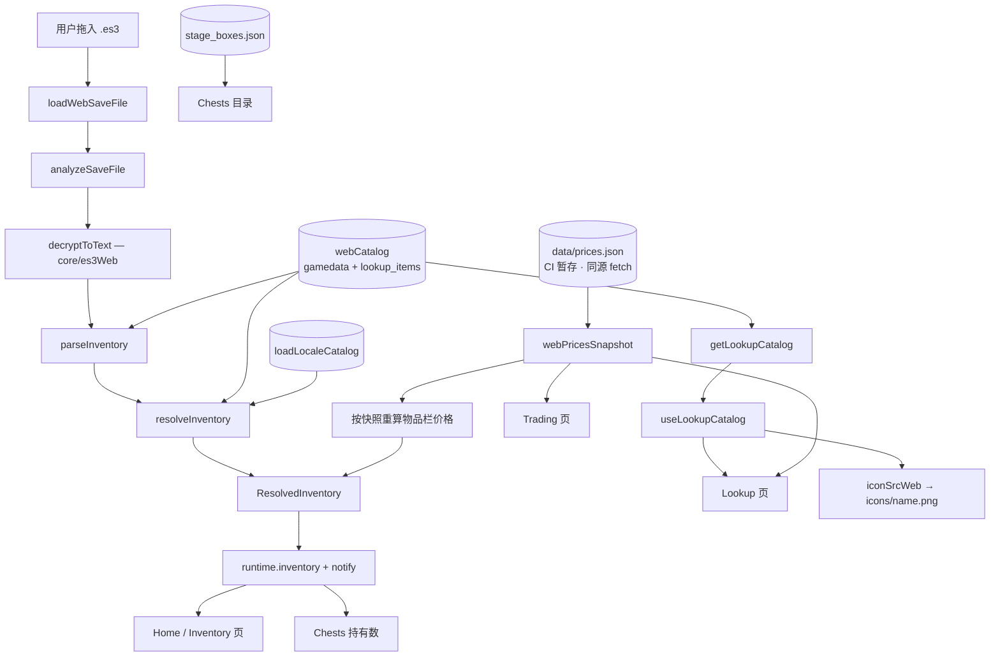

# §25 网页版应用（Web App）

> 本章描述 `app/src/web/` 这一套「浏览器版」代码路径。它与桌面版**复用同一份 `core/`**，差异全部集中在构建期替换与 `window.tbh` 的实现上。
>
> **站点根就是真应用。** 自 `0647230`（serve the real web app at the site root）起，`website/` 根目录直接托管 `pnpm build:web` 的产物——不再有手写的营销落地页，也不再有 `/inspector/` 子路径下的独立应用；打开站点即进入五页工具。旧的 `/inspector/` 地址只保留一个跳转桩（`website/inspector/index.html`）。
>
> 部署方式与域名关联见 [`docs/DEPLOY-WEB.md`](../DEPLOY-WEB.md)。

## 25.1 定位与能力边界

网页版是桌面版在浏览器里的**只读镜像**：能做的用同一份 `core/` 真做，做不到的（需要系统权限的能力）以导流卡片指向桌面版。

应用固定五个页面，顺序与桌面标签一致（`app/src/web/webTabs.ts` 的 `WEB_TAB_IDS`）：

| 页面             | 对应桌面标签 | 数据来源                                              | 需要存档？                         |
| ---------------- | ------------ | ----------------------------------------------------- | ---------------------------------- |
| Home 首页        | `live`       | 存档 + 实时读取                                       | **是**（无存档时显示存档路径指引） |
| Inventory 物品栏 | `inventory`  | 存档                                                  | **是**                             |
| Chests 宝箱      | `chests`     | 宝箱目录（`stage_boxes.json`）+ 存档（持有数 / 槽位） | 目录不需要，持有数需要             |
| Lookup 图鉴      | `lookup`     | `gamedata.json` + `lookup_items.json` + 价格快照      | 否                                 |
| Trading 交易     | `trading`    | 价格快照 + 目录                                       | 否                                 |

| 能力                               | 桌面版         | 网页版      | 原因                                                               |
| ---------------------------------- | -------------- | ----------- | ------------------------------------------------------------------ |
| 读取存档、解密、解析背包/宝箱      | ✅             | ✅          | 纯计算，WebCrypto 可替代 `node:crypto`                             |
| 图鉴 / 宝箱目录 / 交易列表         | ✅             | ✅          | 全部为构建期内联的静态数据，见 §25.4                               |
| Steam 挂单价                       | ✅（实时轮询） | ⚠️ 只读快照 | 浏览器无 CORS 直连 Steam；改用 CI 预生成的 `prices.json`，见 §25.6 |
| 语言切换                           | ✅             | ✅          | 复用同一份 locale，见 §25.10                                       |
| 实时追踪（XP/gold 速率）           | ✅             | ❌          | 需要 `fs.watch` 持续监听存档                                       |
| LiveMemory 内存读取                | ✅             | ❌          | 需要 `koffi` FFI 附加游戏进程                                      |
| 悬浮窗 / 置顶小窗                  | ✅             | ❌          | 浏览器无法创建系统级悬浮窗                                         |
| 自动更新                           | ✅             | ❌          | 无安装包                                                           |
| 合成 EV 覆盖（soulstone / 纪念币） | ✅             | 部分        | 缺 `lookup_sources.json` / `offerings.json`，回落为品质基准值      |

**不变量一：存档内容不离开本机。** 解密与解析全部在浏览器内完成，不上传、无遥测。

**不变量二：不导入存档也要有内容。** Lookup / Chests / Trading 只依赖构建期内联的数据与 CI 快照，与存档无关。改动这五页时**不要**给目录类页面加「请先载入存档」的前置拦截；无存档只应影响 Home / Inventory（显示空状态 + 存档路径指引）与 Chests 的「持有数」区块。

## 25.2 数据流



- 桌面主进程侧的 `SaveWatcher → es3.decrypt → parseInventory → resolveInventory → broadcast` 链条，在网页版被压成 `analyzeSaveFile` 一个函数，去掉了监听、IPC 与 worker。
- 价格从「桌面版实时轮询 Steam」改为「同源读取 CI 快照」（§25.6）。
- **物品栏价格**：`analyzeSaveFile` 接受可选的 `price` 上下文（由 `webPriceContext(snapshot, currency)` 构造）传给 `resolveInventory`。快照是**异步**到达的，因此载入存档时若还没拿到就先按无价解析，`republishLoadedInventory()` 在快照就绪后用已解析的 `InventorySnapshot` **重算并重发**（不重新解密）。CI 快照**只有最低挂单价**（无中位数、无收购单），所以物品栏的「到手价 / 立即卖出 / 立即总价」在网页版恒为未加载态——这是浏览器拿不到的数据，不是缺陷；` Eternal *` 这类快照里为 `null` 的条目会如实显示「无挂单」。
- **显示货币**：页头有 `CurrencySwitcher`，选项 = Steam 钱包货币 ∩ 快照 `fx` 表（快照没加载前只提供 USD，避免选了却静默回落）。`resolveInventory` 拿到的价格已经过 `fx` 换算并把 `inv.currency` 写成显示货币，所以物品栏的费率（Steam 最低费用随货币变化）与金额格式都跟着走；Trading 的 KPI 与表格、Lookup 的 `usePriceStatus()?.currency` 也读同一处。快照没有该货币汇率时回落 USD，绝不会出现「¥ 金额配 $ 前缀」。
- **无存档分支**：`Drop` 之前的所有节点都不依赖存档——`Cat` / `Boxes` / `Prices` 三条线在页面挂载时即已就绪，因此 Lookup / Chests / Trading 无需存档即可渲染真实内容。

## 25.3 站点结构与五页壳

站点根（`website/`）托管 `dist-web/` 的产物：`index.html` + `assets/` + `icons/` + `favicon.png`，全部由 `pnpm build:web` 生成、由 `pages.yml` 暂存，`.gitignore` 已忽略，**不提交**。

页面外壳是 `app/src/web/WebApp.tsx`：

- 顶部导航由 `WEB_TAB_IDS`（`home` / `inventory` / `chests` / `lookup` / `trading`）驱动，标签文案取自 `web` i18n 命名空间的 `nav.*`；
- 右侧 `CurrencySwitcher`（显示货币，经快照 `fx` 换算）+ `LanguageSwitcher`（§25.10）；
- **视觉契约**（与桌面版共用 token，见 [`docs/STYLING.md`](../STYLING.md)）：吸顶页头（渐变品牌标 + `WEB` 徽章 + 居中导航）、`.atmosphere-glow`（顶部径向装饰光，`aria-hidden`，压在**不透明**页头之下所以只落在页头以下，永不覆盖数据面）、页脚（小号品牌行 + 免责声明 + 超大 ghost 字标）。内容宽度上限 `max-w-[1240px] px-5`（= 1200 内容宽），五页共用同一measure。
- 每个页面是 `app/src/web/tabs/` 下的一个面板组件：
  - `HomePanel` —— eyebrow（`home.eyebrow`）+ 左对齐 hero + 存档错误卡、`SavePicker` / 已载入摘要、`SaveLocationHelp`；**无存档时**额外渲染三步操作指引（编号芯片）与三条快捷入口（带箭头图标）；底部 `DesktopOnlyPanel`（桌面能力导流，3 列）。
  - `InventoryPanel` —— 无 `runtime.inventory` 时显示空状态（标题 / 正文 / 选择存档按钮 / 回首页）；有存档时渲染摘要卡 + 复用 renderer 的 `<Inventory />`。
  - `ChestsPanel` —— 从 `stage_boxes.json` 构建目录并分组（`chestCategoryFromKey`），目录**始终**渲染；仅当 `runtime.inventory?.chests` 非空时额外渲染「持有宝箱」区块。该区块**必须经过 `resolveChestHoldings` 聚合**（与桌面同一函数）：原始 holdings 是「每个宝箱实例一条、`quantity: 1`」，直接渲染会变成一堆 ×1；聚合后按类别分组展示，未知类别不带标题排在末尾（与桌面一致）。
  - `TradingPanel` —— 由 `marketHashName(item) != null` 筛出可交易行，用 `resolveLookupPrice(item, snapshot, currency)` 取价；渲染 KPI（可交易 / 已定价 / 覆盖率）、快照时间与 `MissingPricesBanner`。表格列为 **Item / Type / Grade / Lowest listing**（`Type` 用 `typeLabel(item.type)`，把原先过疏的三列撑满 1200 measure）。
- **Lookup 页复用 renderer 的 `Lookup.tsx`**：网页版直接挂载 `<Lookup watchedOnlyDefault={false} showPollingStatus={false} />`。这两个 props 是**可选、增量**的（默认为 `true`，桌面行为不变）——`watchedOnlyDefault` 让网页版默认展示全部物品而非只看关注，`showPollingStatus` 关掉只有桌面轮询才有的状态行。

**空状态契约**：Home 与 Inventory 必须给出指向 `%USERPROFILE%\AppData\LocalLow\TesseractStudio\TaskBarHero\` 的指引与「复制路径」按钮，而不是空白块或报错。

## 25.4 构建期模块替换

由 `app/vite.web.config.ts` 的 `tbh-browser-safe-core` 插件完成（`enforce: "pre"`，`resolveId` 钩子）。三处替换：

| 原模块                 | 替换为                  | 解决的问题                                             |
| ---------------------- | ----------------------- | ------------------------------------------------------ |
| `core/bundledData`     | `core/bundledDataWeb`   | 磁盘 `fs.readFileSync` → 内存目录                      |
| `core/es3`             | `core/es3Web`           | `node:crypto` → WebCrypto（PBKDF2 + AES-CBC 契约等价） |
| `renderer/lib/iconSrc` | `src/web/iconSrcWeb.ts` | `tbh-asset://` 自定义协议 → 同源静态 PNG               |

内存目录由 `src/web/dataSource.ts` 用 `?raw` 导入并注入（`setBundledDataTextSource`）。**只随包发 9 个文件**：`gamedata` / `stage_boxes` / `box_types` / `steam_market_fee` / `lookup_items` + 四语言 `locale_strings`。被省略的（`lookup_sources` 10 MB、`_game_locale_dump` 3 MB 等）在 `OMITTED` 集合里登记，命中时静默返回 `null`；**未登记的缺失名会打印警告**，避免目录缺项变成渲染中期的 `Bundled data file not found` 堆栈。

> **这些 JSON 是在构建期内联进 bundle 的**，因此站点**没有** `website/data/gamedata.json` / `stage_boxes.json` 这类目录副本，也**不需要任何拷贝或同步脚本**：更新 `data/` 后提交推送，`pages.yml`（`paths` 含 `data/**`）会重建站点，站点数据自动跟随。站点唯一的**运行时**数据是 `website/data/prices.json`。
>
> **改动 `core/es3` 的加解密契约时必须同时核对 `core/es3Web`**：`app/test/web/es3Parity.test.ts` 是等价性守卫。

## 25.5 `window.tbh` 的 web shim（`src/web/webTbhApi.ts`）

渲染层是按完整桌面 `TbhApi` 写的，因此 shim 必须同构实现全部方法。返回值全部按真实 shared 接口标注类型 —— 契约漂移会让 `pnpm typecheck` 失败，而不是在 UI 里冒出 `undefined`。

- **完整实现**：`getInventory` / `onInventory` / `getConfig` / `saveConfig` / `getLookupCatalog`。
- **惰性空值**（不 reject，使仅「瞥一眼」该能力的页面仍能挂载）：`getLookupSources`、`getLookupSynthesisModel`、`getOfferings`、`getCatalogStatus`、`refreshCatalog` 等。
- **价格相关**：`getLookupPrices` / `onLookupPrices` 接到 §25.6 的快照 store，不再返回空值。
- **配置持久化**：`localStorage` 存 UI 偏好；`resolvedLanguage` 是运行时派生值，永不落盘。

**`useSyncExternalStore` 快照身份**：`runtime` 是就地变更的稳定对象，直接返回它会让每次更新在 `Object.is` 下看起来都是 no-op、UI 永不刷新。因此每次变更先发布一份新的浅拷贝（`runtimeSnapshot`）再通知订阅者。`app/src/web/lib/useWebRuntime.ts` 通过 `useSyncExternalStore(onWebRuntimeChange, webRuntime, webRuntime)` 读取该快照。

## 25.6 价格快照（`src/web/pricesSnapshot.ts`）

浏览器不能直连 Steam（无 CORS），也不该从访客 IP 轮询上千个 hash。改为读取**同源**的一份预构建 `LookupPriceSnapshot`：`website/data/prices.json`，由 `pages.yml` 从滚动 release `lookup-prices` 暂存（见 `DEPLOY-WEB.md` §2.4）。该文件与 shared 接口契约一致（由 `core/lookupPrice/snapshot.ts#buildSnapshot` 生成），因此 `marketHashName()` 推导的键能直接命中。

`pricesSnapshot.ts` 是一个模块级单例 store（与桌面的 `useLookupPrices` 同构），供数百个 Lookup 卡与 Trading 表共用一次 fetch：

- 状态机 `WebPricesStatus = "idle" | "loading" | "ready" | "missing"`；
- `ensureWebPricesLoaded()` 幂等（并发共享同一个 in-flight 请求，到达终态后短路）；`refreshWebPrices()` 用 `cache: "reload"` 绕过 HTTP 缓存；
- URL 由 `import.meta.env.BASE_URL` + `data/prices.json` 拼出，根目录或子路径部署都成立；
- `getWebPricesStatus()` 返回原始值、`getWebPriceSnapshot()` 返回稳定引用，均对 `useSyncExternalStore` 友好；
- **所有失败都降级为 `"missing"`（`snapshot = null`）而非抛错或清空目录**：404、网络错误、或形状不符的载荷（含 `isSnapshot()` 结构校验，拒绝数组）都只让视图「无价格 + 顶部告警条」，`MissingPricesBanner` 会链接到 `lookup-prices.yml` 的工作流页面。

`app/src/web/lib/useWebPrices.ts` 是它的 `useSyncExternalStore` 封装，返回 `{ status, snapshot }`。

**快照同时是物品栏的价格来源**：`analyzeSave.ts#webPriceContext` 把 `prices`（market_hash_name → 最低挂单价，USD）连同 `fx` 表映射成 `resolveInventory` 的 `PriceLookup`，并按所选显示货币换算。快照不含中位数与收购单，因此网页版物品栏的到手价 / 立即卖出 / 立即总价恒为未加载；`webTbhApi.ts#republishLoadedInventory` 订阅该 store，快照就绪 / 语言切换 / 货币切换时用已解析的快照重算行（见 §25.2）。

## 25.7 图鉴目录本地化（易踩的坑）

`webLookupCatalog()` 镜像了桌面 `LookupService.getCatalog()`：

1. 取 `loadLookupItems()`（已在 bundle 内）；
2. 按当前 `config.resolvedLanguage` 用 `gameItemName` 换显示名；
3. 名称被换掉时把英文原名保留到 `sourceName` —— `marketHashName()` 需要它推导英文 Steam hash（Steam hash 恒为英文，用本地化名会打不中快照）；
4. 按语言缓存（启动拉一次，切语言再拉一次）。

**该函数曾经返回 `[]`**，后果不是「少个名字」而是连锁的：`useLookupCatalog()` 拿到空数组 → `itemIndex` 为空 → 背包行 `catalogItem` 永远 `undefined` → 名称回落到英文 gamedata 原名、**所有行完全不渲染图标框**。`catalogReady` 为 `true`（目录非 `null`），所以骨架屏也不会出现，表现为「表格正常但没有任何图标」。

排查此类问题的信号：`InventoryTable` 里 `catalogItem` 与 `catalogReady` 是两条独立分支 —— 若名字是英文原名且全无图标，先怀疑 `getLookupCatalog` 返回空。

## 25.8 图标静态化

`renderer/lib/iconSrc.ts` 返回 `tbh-asset://icon/<name>`，该 scheme 由主进程 `protocol.handle` 注册，浏览器无法解析 → 所有物品图标 broken image。

`src/web/iconSrcWeb.ts` 改为：

```ts
const base = import.meta.env.BASE_URL || "/";
return `${base}icons/${encodeURIComponent(iconPath)}.png`;
```

`import.meta.env.BASE_URL` 跟随 Vite `base`，因此构建产物放在根目录或任意子路径都能正确取到图标。图标由 `scripts/copy-web-icons.mjs` 在 vite 构建后复制到 `dist-web/icons/`（364 个 PNG，约 0.1 MB；最大的 1.3 KB，`amulet-*` 为 16×16、`item-*` 为 64×64）。

> **该步骤是 `build:web` 的一部分**（`vite build && node scripts/copy-web-icons.mjs`），漏跑会让 `dist-web/icons/` 为空、全部图标 404。`smoke-web.cjs` 断言 `naturalWidth > 0` 作为回归守卫。

## 25.9 存档加载链路

`app/src/web/tabs/HomePanel.tsx` 经 `SavePicker` 提供文件输入与 drop zone，调用 `loadWebSaveFile(file)`（在 `webTbhApi.ts`）：

1. `installWebDataSource()` —— 幂等，注入内存目录；
2. `file.arrayBuffer()`；
3. `analyzeSaveFile(buffer, resolvedLanguage, file.lastModified)` —— 等同主进程的 `decrypt → parseInventory → resolveInventory`；
4. 写 `runtime`，逐个通知 `inventoryListeners`（驱动 `TbhProvider` 的 `onInventory`）；
5. `finally` 里清 `loading` 并 `notifyRuntime()`。

失败时 `classifySaveFileError(err)` 给出面向用户的文案（密码错误 / 非存档文件），存入 `runtime.error`。

## 25.10 多语言

网页版复用同一份 locale（`app/shared/locales/`，四语言 `en` / `zh-CN` / `ja` / `ko`）。网页版专属文案放在新增的 `web` i18n 命名空间（`shared/locales/*/web.json`），由 `shared/locales/*/index.ts` 注册。

`LanguageSwitcher`（`src/web/components/LanguageSwitcher.tsx`）是一个 `<select>`，选项来自 `LANGUAGE_DISPLAY_NAMES`（仅上述四语言）。切换时先 `window.tbh.saveConfig({ language })` 落盘，再 `changeRendererLanguage(next)` 刷新 renderer 的 i18n 实例；`resolveWebLanguage` 会同步重算 `config.resolvedLanguage`，使目录本地化跟随。

## 25.11 错误处理

| 场景                             | 行为                                                                            |
| -------------------------------- | ------------------------------------------------------------------------------- |
| 密码错误 / 非存档文件            | `classifySaveFileError` → `runtime.error`，UI 显示可读文案；不解密、不推送      |
| 目录文件缺失但已登记在 `OMITTED` | 静默返回 `null`，对应功能降级（如合成 EV 覆盖）                                 |
| 目录文件缺失且**未**登记         | `console.warn("[web] bundled data not shipped: <name>")`                        |
| `prices.json` 404 / 载荷非法     | 快照降级为 `"missing"`，Trading / Lookup 仍渲染目录并显示 `MissingPricesBanner` |
| 图标 404                         | `` 置 `visibility: hidden`，不影响布局                             |
| 某能力不支持                     | shim 返回惰性空值，页面正常挂载并渲染桌面版导流卡片                             |

## 25.12 关键文件速查

| 模块                    | 路径                                                                                                             |
| ----------------------- | ---------------------------------------------------------------------------------------------------------------- |
| 构建配置（含三处 swap） | `app/vite.web.config.ts`                                                                                         |
| 图标复制脚本            | `app/scripts/copy-web-icons.mjs`                                                                                 |
| web 入口 / 五页壳       | `app/src/web/main.tsx`、`app/src/web/WebApp.tsx`、`app/src/web/webTabs.ts`                                       |
| 页面面板                | `app/src/web/tabs/{HomePanel,InventoryPanel,ChestsPanel,TradingPanel}.tsx`                                       |
| 共享 UI 片段            | `app/src/web/components/{SavePicker,SaveLocationHelp,DesktopOnlyPanel,LanguageSwitcher,MissingPricesBanner}.tsx` |
| `window.tbh` shim       | `app/src/web/webTbhApi.ts`                                                                                       |
| 存档加载                | `app/src/web/webTbhApi.ts`（`loadWebSaveFile`）、`app/src/web/analyzeSave.ts`                                    |
| 价格快照 store          | `app/src/web/pricesSnapshot.ts`、`app/src/web/lib/useWebPrices.ts`                                               |
| runtime 订阅            | `app/src/web/lib/useWebRuntime.ts`                                                                               |
| 内存数据目录            | `app/src/web/dataSource.ts`                                                                                      |
| Web 图标 URL            | `app/src/web/iconSrcWeb.ts`                                                                                      |
| 错误分类                | `app/src/web/errors.ts`                                                                                          |
| 外链常量                | `app/src/web/links.ts`                                                                                           |
| web i18n 命名空间       | `app/shared/locales/*/web.json`                                                                                  |
| 等价性守卫              | `app/test/web/es3Parity.test.ts`、`app/test/web/webPricesSnapshot.test.ts`                                       |
| 无存档渲染守卫          | `app/test/renderer-component/web-no-save.test.tsx`                                                               |
| 端到端冒烟              | `app/scripts/smoke-app/smoke-web.cjs`（`pnpm smoke:web`）                                                        |
| 部署说明                | `docs/DEPLOY-WEB.md`                                                                                             |
