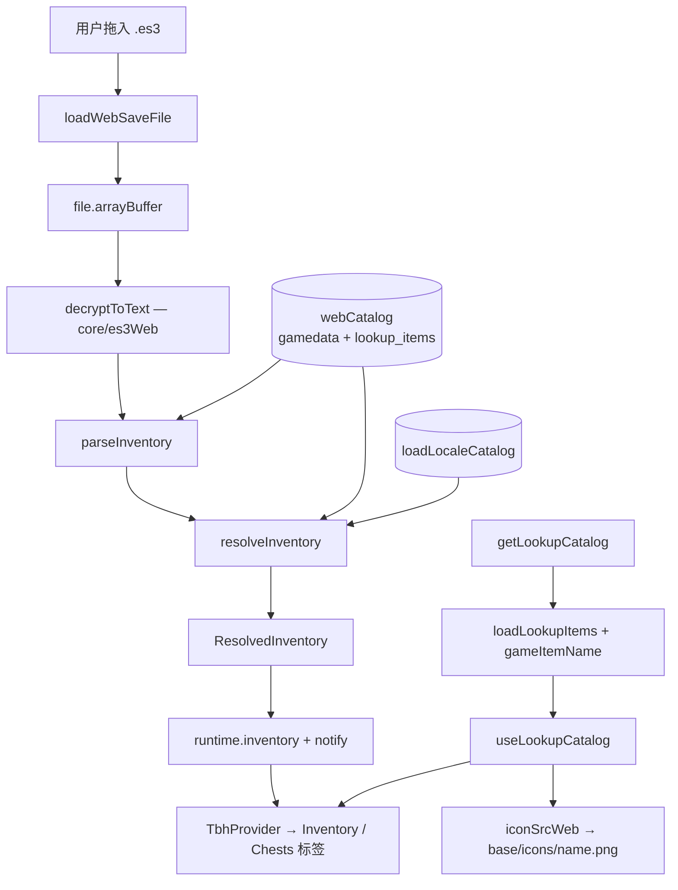

# §25 网页版存档解析器（Web Inspector）

> 本章描述 `app/src/web/` 这一套「浏览器版」代码路径。它与桌面版**复用同一份 `core/`**，差异全部集中在构建期替换与 `window.tbh` 的实现上。
>
> 部署方式与域名关联见 [`docs/DEPLOY-WEB.md`](../DEPLOY-WEB.md)。

## 25.1 定位与能力边界

网页版只做一件事：**把用户拖进来的 `.es3` 存档在浏览器本地解密，展示背包与宝箱**。其余能力一律以导流卡片指向桌面版。

| 能力 | 桌面版 | 网页版 | 原因 |
| --- | --- | --- | --- |
| 读取存档、解密、解析背包/宝箱 | ✅ | ✅ | 纯计算，WebCrypto 可替代 `node:crypto` |
| Steam 市场查价 | ✅ | ❌ | 浏览器无 CORS 直连 Steam 接口；且从访客 IP 轮询上千个 hash 属滥用 |
| 实时追踪（XP/gold 速率） | ✅ | ❌ | 需要 `fs.watch` 持续监听存档 |
| LiveMemory 内存读取 | ✅ | ❌ | 需要 `koffi` FFI 附加游戏进程 |
| 悬浮窗 / 置顶小窗 | ✅ | ❌ | 浏览器无法创建系统级悬浮窗 |
| 自动更新 | ✅ | ❌ | 无安装包 |
| 合成 EV 覆盖（soulstone / 纪念币） | ✅ | 部分 | 缺 `lookup_sources.json` / `offerings.json`，回落为品质基准值 |

**核心不变量：存档内容不离开本机。** 解密与解析全部在浏览器内完成，不上传、无遥测。

## 25.2 数据流



与桌面版的对应关系：主进程侧的 `SaveWatcher → es3.decrypt → parseInventory → resolveInventory → broadcast` 链条，在网页版被压成 `loadWebSaveFile` 一个函数，去掉了监听、IPC 与 worker。

## 25.3 构建期模块替换

由 `app/vite.web.config.ts` 的 `tbh-browser-safe-core` 插件完成（`enforce: "pre"`，`resolveId` 钩子）。三处替换：

| 原模块 | 替换为 | 解决的问题 |
| --- | --- | --- |
| `core/bundledData` | `core/bundledDataWeb` | 磁盘 `fs.readFileSync` → 内存目录 |
| `core/es3` | `core/es3Web` | `node:crypto` → WebCrypto（PBKDF2 + AES-CBC 契约等价） |
| `renderer/lib/iconSrc` | `src/web/iconSrcWeb.ts` | `tbh-asset://` 自定义协议 → 同源静态 PNG |

内存目录由 `src/web/dataSource.ts` 用 `?raw` 导入并注入（`setBundledDataTextSource`）。**只随包发 9 个文件**：`gamedata` / `stage_boxes` / `box_types` / `steam_market_fee` / `lookup_items` + 四语言 `locale_strings`。被省略的（`lookup_sources` 10 MB、`_game_locale_dump` 3 MB 等）在 `OMITTED` 集合里登记，命中时静默返回 `null`；**未登记的缺失名会打印警告**，避免目录缺项变成渲染中期的 `Bundled data file not found` 堆栈。

> **改动 `core/es3` 的加解密契约时必须同时核对 `core/es3Web`**：`app/test/web/es3Parity.test.ts` 是等价性守卫。

## 25.4 `window.tbh` 的 web shim（`src/web/webTbhApi.ts`）

渲染层是按完整桌面 `TbhApi` 写的，因此 shim 必须同构实现全部方法。返回值全部按真实 shared 接口标注类型 —— 契约漂移会让 `pnpm typecheck` 失败，而不是在 UI 里冒出 `undefined`。

- **完整实现**：`getInventory` / `onInventory` / `getConfig` / `saveConfig` / `getLookupCatalog`。
- **惰性空值**（不 reject，使仅「瞥一眼」该能力的标签页仍能挂载）：`getLookupSources`、`getLookupSynthesisModel`、`getOfferings`、`getCatalogStatus`、`refreshCatalog`、价格相关全部方法。
- **配置持久化**：`localStorage` 存 UI 偏好；`resolvedLanguage` 是运行时派生值，永不落盘。

**`useSyncExternalStore` 快照身份**：`runtime` 是就地变更的稳定对象，直接返回它会让每次更新在 `Object.is` 下看起来都是 no-op、UI 永不刷新。因此每次变更先发布一份新的浅拷贝（`runtimeSnapshot`）再通知订阅者。

## 25.5 图鉴目录本地化（易踩的坑）

`webLookupCatalog()` 镜像了桌面 `LookupService.getCatalog()`：

1. 取 `loadLookupItems()`（已在 bundle 内）；
2. 按当前 `config.resolvedLanguage` 用 `gameItemName` 换显示名；
3. 名称被换掉时把英文原名保留到 `sourceName` —— `marketHashName()` 需要它推导英文 Steam hash（Steam hash 恒为英文，用本地化名会打不中快照）；
4. 按语言缓存（启动拉一次，切语言再拉一次）。

**该函数曾经返回 `[]`**，后果不是「少个名字」而是连锁的：`useLookupCatalog()` 拿到空数组 → `itemIndex` 为空 → 背包行 `catalogItem` 永远 `undefined` → 名称回落到英文 gamedata 原名、**所有行完全不渲染图标框**。`catalogReady` 为 `true`（目录非 `null`），所以骨架屏也不会出现，表现为「表格正常但没有任何图标」。

排查此类问题的信号：`InventoryTable` 里 `catalogItem` 与 `catalogReady` 是两条独立分支 —— 若名字是英文原名且全无图标，先怀疑 `getLookupCatalog` 返回空。

## 25.6 图标静态化

`renderer/lib/iconSrc.ts` 返回 `tbh-asset://icon/<name>`，该 scheme 由主进程 `protocol.handle` 注册，浏览器无法解析 → 所有物品图标 broken image。

`src/web/iconSrcWeb.ts` 改为：

```ts
const base = import.meta.env.BASE_URL || "/";
return `${base}icons/${encodeURIComponent(iconPath)}.png`;
```

`import.meta.env.BASE_URL` 跟随 Vite `base`，因此构建产物放在根目录或任意子路径（`/inspector/`）都能正确取到图标。图标由 `scripts/copy-web-icons.mjs` 在 vite 构建后复制到 `dist-web/icons/`（364 个 PNG，约 0.1 MB；最大的 1.3 KB，`amulet-*` 为 16×16、`item-*` 为 64×64）。

> **该步骤是 `build:web` 的一部分**（`vite build && node scripts/copy-web-icons.mjs`），漏跑会让 `dist-web/icons/` 为空、全部图标 404。`smoke-web.cjs` 断言 `naturalWidth > 0` 作为回归守卫。

## 25.7 存档加载链路

`WebApp.tsx` 提供文件输入与 drop zone，调用 `loadWebSaveFile(file)`：

1. `installWebDataSource()` —— 幂等，注入内存目录；
2. `file.arrayBuffer()`；
3. `analyzeSaveFile(buffer, resolvedLanguage, file.lastModified)` —— 等同主进程的 `decrypt → parseInventory → resolveInventory`；
4. 写 `runtime`，逐个通知 `inventoryListeners`（驱动 `TbhProvider` 的 `onInventory`）；
5. `finally` 里清 `loading` 并 `notifyRuntime()`。

失败时 `classifySaveFileError(err)` 给出面向用户的文案（密码错误 / 非存档文件），存入 `runtime.error`。

## 25.8 错误处理

| 场景 | 行为 |
| --- | --- |
| 密码错误 / 非存档文件 | `classifySaveFileError` → `runtime.error`，UI 显示可读文案；不解密、不推送 |
| 目录文件缺失但已登记在 `OMITTED` | 静默返回 `null`，对应功能降级（如合成 EV 覆盖） |
| 目录文件缺失且**未**登记 | `console.warn("[web] bundled data not shipped: <name>")` |
| 图标 404 | `` 置 `visibility: hidden`，不影响布局 |
| 某能力不支持 | shim 返回惰性空值，标签页正常挂载并渲染桌面版导流卡片 |

## 25.9 关键文件速查

| 模块 | 路径 |
| --- | --- |
| 构建配置（含三处 swap） | `app/vite.web.config.ts` |
| 图标复制脚本 | `app/scripts/copy-web-icons.mjs` |
| web 入口 / 壳 | `app/src/web/main.tsx`、`app/src/web/WebApp.tsx` |
| `window.tbh` shim | `app/src/web/webTbhApi.ts` |
| 存档加载 | `app/src/web/webTbhApi.ts`（`loadWebSaveFile`）、`app/src/web/analyzeSave.ts` |
| 内存数据目录 | `app/src/web/dataSource.ts` |
| Web 图标 URL | `app/src/web/iconSrcWeb.ts` |
| 错误分类 | `app/src/web/errors.ts` |
| 等价性守卫 | `app/test/web/es3Parity.test.ts` |
| 端到端冒烟 | `app/scripts/smoke-app/smoke-web.cjs`（`pnpm smoke:web`） |
| 部署说明 | `docs/DEPLOY-WEB.md` |
