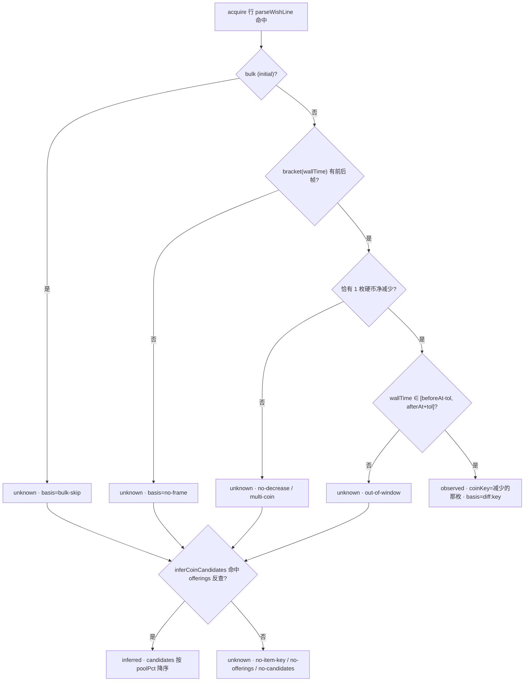

# 祈愿记录（Wish Record）

> 本文是 [`docs/BUSINESS-FLOWS.md`](../BUSINESS-FLOWS.md) 的拆分章节之一。**业务流程的单一真理源仍是主索引文件**——任何业务逻辑改动仍需先查阅本文件，落地后同步更新；本文件只是承载正文，便于按需加载。
>
> 复刻「祈愿」的产出统计链路：复用游戏「获得记录」文本行管道，按事件（offering）与件数（item）双口径计数、按品质与单品聚合，并提供会话重置与长期归档。
>
> 所有文件路径以仓库根为基准（`app/src/...`）。

> ← [主索引](../BUSINESS-FLOWS.md) · 上一章[网页版存档解析器（Web Inspector）](13-web-inspector.md) · 章节：§26 · 相关：[统一记录日志 §23.6](11-record-log.md)

---

## 26. 祈愿记录（Wish Record）业务流程

**动机（2026-09-22 新增）**：为「祈愿」提供产出统计——每次祈愿的产出文案与宝箱/掉落同源（都来自游戏「获得记录」定长平移列表，都带 `<color=#RRGGBB>` 品质色），因此祈愿记录**不新开数据源、不新增 IPC、不新增内存读取**，而是复用 acquire 文本行管道做旁路识别与聚合。

### 26.1 数据流

```
游戏进程 LogManager@0x20（「获得记录」定长平移列表）
  → worker 独立 acquire 通道（~10ms）→ post({type:"acquire", entries, initial})
      → LiveMemoryService → TrackingService.ingestAcquireBatch(entries, initial, ...)
          ├─（既有）recordLog.feed("acquire", now, {...})  → RecordLogTracker → record_log.json
          └─（新增）parseWishLine(a.message)  ← core/wishLine.ts（多语言前缀 + 结构兜底 + 排除表）
                └─ 命中 → attributeWishCoin(name, ts, bulk)  ← 硬币归因（Wish v2）
                │         ├─ wishDiffWindow.bracket(ts)（相邻两帧 materialStacks）
                │         ├─ attributeCoinByDiff(...) → observed / unknown
                │         └─ inferCoinCandidates(...) → inferred / unknown（候选兜底）
                └─ wishTracker.feed(item, now, { raw, gameTime, bulk: initial }, attribution)
                            → WishTracker（core，双计数 offering/item + 品质分布 + 单品聚合 + 滚动速率 + 硬币分组）
                            → WishRecordService.schedulePersist() 防抖 ~2s
                            → 写 userData/wish_record.json（长期累计归档，不随会话重置清空）

（帧差喂入，独立于 acquire）save 轮询解析 materialStacks
  → TrackingService.onInventory 包装 → feedWishDiffFrame(snap)
      → wishDiffWindow.push({ at: snap.saveMtime, stacks: 10 枚硬币 })
  → buildStats(..., wishTracker) 输出 Stats.wish
  → onStats(IPC.STATS) → useStats() → 祈愿 tab（app/src/renderer/tabs/Wish.tsx）
```

> **帧差喂入与 acquire 双通道时序**：save 轮询（默认 5s）在 `onInventory` 回调里把 10 枚硬币的 `materialStacks` push 进 `WishCoinDiffWindow`（保留最近 2 帧，`at` 用 `saveMtime`）；acquire 通道（~10ms）在识别到祈愿行时用 `bracket(wallTime)` 取前后帧做唯一性 + 时间窗判定。容差**动态**取 `1.5 × config.pollIntervalSeconds`（默认 7.5s，W4）。两通道异步，因此归因是"观察到的净减少"而非"确定消耗"（诚实设计，见 §26.8）。


> 注：祈愿行**只在已通过 `ringSeq` 去重**的行上喂入（与 `recordLog` 完全同步），因此 initial 批重灌不会重复计数。`initial=true` 的批量回灌以 `bulk: true` 喂入——计入累计/会话/历史，但**不进滚动 1 小时窗口**。非祈愿行零副作用。详见 [`11-record-log.md §23.6`](11-record-log.md)。

### 26.2 口径与字段语义（PRD §5，不得擅改）

| 字段                            | 口径                                                                                                      |
| ------------------------------- | --------------------------------------------------------------------------------------------------------- |
| `offeringCount`（祈愿次数）     | **一条祈愿结果行 = 1 次**（按事件，不按物品数）                                                           |
| `itemCount`（产出物品数）       | 该行解析件数之和，**缺省 1**                                                                              |
| `itemsPerOffering`              | `itemCount / offeringCount`；分母 0 → 0（不 NaN）                                                         |
| 品质（`grade`）                 | 由 `<color=#RRGGBB>` 经 `core/acquireLog.ts` 的 `COLOR_TO_GRADE` 映射；**无法映射 → `UNKNOWN`，绝不猜测** |
| `share`（占比）                 | 分母**恒为 `itemCount`**（产出物品总数，含 UNKNOWN），非 offeringCount                                    |
| 单品聚合键（`breakdown`）       | 去标签纯物品名；排序 `count` 降序、同值 `name` 升序（P0 无 itemKey）                                      |
| `*PerHour`（会话速率）          | `count / (now - 窗口锚点)` × 3600；锚点 = `min(trackingStartedAt, firstWishWallTime)`                     |
| `*RecentPerHour`（滚动 1 小时） | 只统计 `ROLLING_HOUR_SEC=3600` 窗口内的**非 bulk** 条目；分母下限 `RECENT_MIN_WINDOW_SEC=300`             |
| `history`                       | 倒序（最新在前），上限 `HISTORY_VISIBLE=50`（内存上限 `HISTORY_LIMIT=500`）                               |

**双计数记忆点**：这是与 [`ChestDropTracker`](11-record-log.md)（每次掉落 +1）**最大结构差异**——祈愿一次可能产出多件同名物品（如 `获得了 5 个 X`），故需同时维护「次数」与「件数」两个维度。

### 26.3 品质桶

**11 个桶**（由低到高，UNKNOWN 置末尾）：`COMMON / UNCOMMON / RARE / LEGENDARY / IMMORTAL / ARCANA / CELESTIAL / BEYOND / DIVINE / COSMIC / UNKNOWN`（Wish v2 P0-9，2026-09-23 由 8 桶扩为 11 桶）。映射源为 `core/acquireLog.ts` 的 `COLOR_TO_GRADE`（`#D7D7D7`→COMMON、`#7CE937`→UNCOMMON、`#519FFF`→RARE、`#EBBB00`→LEGENDARY、`#E8695A`→IMMORTAL、`#FB86FF`→ARCANA、`#00F6FF`→CELESTIAL）。**无颜色 / 非物品色 → UNKNOWN**，绝不猜测。分布图与占比条为**手绘 SVG**（`WishGradeBar.tsx`），不引入任何图表库（P0 零新增依赖）。

`WishGrade` 联合类型（`app/shared/types.ts`）与 `GRADE_ORDER`（`core/wishTracker.ts` / `lib/useWish.ts` 两处同步）与 `gradeColor`（`lib/gradeColor.ts`）**三处均为 11 桶**。

### 26.4 关键文件

| 职责                       | 路径                                                                                                                                           |
| -------------------------- | ---------------------------------------------------------------------------------------------------------------------------------------------- |
| 祈愿行识别（纯逻辑）       | `app/src/core/wishLine.ts`（`isWishLine` / `parseWishLine` / `WishLineItem`）                                                                  |
| 祈愿聚合器（纯逻辑）       | `app/src/core/wishTracker.ts`（`WishTracker`：`feed/getStats/reset/captureSnapshot/applySnapshot`；`setLookupDeps`）                            |
| 硬币归因（纯逻辑）         | `app/src/core/wish/constants.ts` / `coinDiff.ts` / `coinCandidates.ts` / `coinGroups.ts` / `coinDiffWindow.ts` / **`coinOverrides.ts`（手工绑定叠加）**；`app/src/core/lookup/nameIndex.ts` |
| 事件接入与转发             | `app/src/main/services/TrackingService.ts`（`ingestAcquireBatch` 内旁路识别 + 归因；`buildWishLookupDeps`/`attributeWishCoin`/`feedWishDiffFrame`；`getWishTracker()`；`resetWishRecord()`） |
| stats 输出                 | `app/src/main/stats.ts`（`buildStats` 增参 `wishTracker`，输出 `Stats.wish`；空态常量 `EMPTY_WISH`）                                           |
| 会话快照（随会话）         | `app/src/main/services/SessionStateService.ts`（`persistSnapshot`/`applySnapshot` 增 `wishTracker` 字段，`wishTracker?: WishTrackerSnapshot`） |
| 长期归档（P1-1，不随会话） | `app/src/main/services/WishRecordService.ts`（load-once / 防抖 ~2s persist / stop flush）                                                      |
| 文件注册/清除              | `app/src/main/services/appData.ts`（`WISH_RECORD_FILE`＝`wish_record.json`；入 paths 清单、`wish-record` 清除目标与 `all-except-config`）      |
| 清除目标接线               | `app/src/main/app/appState.ts`（`clearAppData` → `tracking.resetWishRecord()`）                                                                |
| 共享类型                   | `app/shared/types.ts`（`WishGrade`/`WishGradeRow`/`WishBreakdownRow`/`WishHistoryEntry`/`WishStats`/`WishTrackerSnapshot`；硬币归因 `WishCoinAttribution`/`WishCoinCandidate`/`WishRecentResult`/`WishCoinGroup`/`WishCoinGroupItem`/`WishUnattributedGroup`/`WishHeldCoin`；**手工绑定 `WishCoinOverride`/`WishCoinOverrides`**；`WISH_COIN_KEYS`；`Stats.wish`） |
| 手工绑定持久化             | `app/src/main/config.ts`（`DEFAULTS.wishCoinOverrides` + `sanitizeWishCoinOverrides`（**exported**，逐条丢弃非法项且恒返回数组）+ `normalizeConfig`）；`AppConfig.wishCoinOverrides` |
| 手工绑定 IPC               | `app/shared/ipc.ts`（`GET_WISH_COIN_OVERRIDES`/`SET_WISH_COIN_OVERRIDES`/`WISH_COIN_OVERRIDES`）+ `app/src/main/ipc/handlers/lookup.ts` + `app/src/main/app/appState.ts`（`getWishCoinOverrides`/`setWishCoinOverrides`）+ preload 三方法 |
| UI                         | `app/src/renderer/tabs/Wish.tsx` + `components/wish/*`（`WishStatCards`/`WishHeldCoins`/`WishRecentResults`/`WishCoinGroups`/`WishCoinBadge`/`WishHistory`）+ `lib/useWish.ts` / `lib/wishCoin.ts`（tab id = `wish`，`appTabs.ts` / `App.tsx`） |
| i18n                       | `app/shared/locales/{zh-CN,en,ja,ko}/wish.json`（命名空间 `wish`；`tabs.json` 增 `wish` 标签）                                                 |


### 26.5 会话语义（关键，与掉落的差异）

- **`WishTracker.reset()` = 会话重置**：`*Session` 归零、**累计不变**、`sessionWishStart` 重置为现在。这是与 `ChestDropTracker.reset()`（**整表清空**累计 + 历史）**根本不同**的语义——祈愿的累计口径是长期展示值，重置会话只应把「本会话增量」清零。
- **接线点**：`TrackingService` 在所有既有 `chestDropTracker.reset()` 的四处（`reset` / `clearSession` / `onSavePathChanged` / `onLiveMemoryToggled`）同步调用 `wishTracker.reset()`。四次调用后，祈愿**累计不变、`*Session` 归零**。
- **`wish_record.json`（P1-1 长期归档）不随会话重置清空**（PRD §2.5 / §5.2）。设置页清除 `wish-record` / `all-except-config` 时删除该文件并 `tracking.resetWishRecord()` 丢弃内存归档标记（不清当前会话的 stats 展示值——清归档 ≠ 清会话）。
- **reset 复用既有 IPC**：renderer 的「重置会话」按钮走既有 `window.tbh.reset()`（`IPC.RESET`），不新增 IPC 通道。

### 26.6 错误处理

- **非祈愿行零误报**：识别采用「多语言前缀白名单 + 严格结构兜底 + 排除表」，宁可漏不可错。测试 `app/test/core/wishLine.test.ts` 以真实文案对 + 反例断言零误报。
- **件数解析**：`parseAcquireMessage` 的 `COUNT_RE` 要求数字在行尾；祈愿行常以 `。` 收尾，故 `wishLine.ts` 内先剥尾部标点再提取件数（`extractCount`），缺省 1。
- **品质不可映射** → `UNKNOWN`（绝不猜测）；分布/占比的 UNKNOWN 桶与其他桶一视同仁计入分母。
- **持久化失败**：`WishRecordService.load()` 读文件失败/损坏 → 记 warn，从空态继续；`persist()` 写盘失败（只读/满盘）→ 记 warn，不回滚内存，下次防抖调度再试。
- **损坏快照容错**：`WishTracker.applySnapshot` 对无效字段（负数/NaN/缺字段）做防御性清洗，不抛错；`itemCount` 以持久化值为准（不重新从 `countsByName` 求和，避免展示口径跳变）。
- **删除文件后内存态**：`clearAppData(wish-record)` 删除文件后 `tracking.resetWishRecord()` 停止后续落盘。

### 26.7 边界与注意

- **不新增 IPC、不改 preload**：祈愿数据只走既有 `IPC.STATS` / `IPC.RESET`。`app/shared/ipc.ts`、`registerIpc.ts`、preload、`test/ipc/channels.test.ts` **均不改动**。
- **`core/` 纯净**：`core/wishLine.ts` / `core/wishTracker.ts` / `core/wish/*` / `core/lookup/nameIndex.ts` 不依赖 electron / `node:fs` / `fetch` / React；数据文件（`lookup_items.json` / `offerings.json`）由 main 注入（`setLookupDeps`），core 自身不 import 数据。
- **零新增 npm 依赖**：品质分布图为手绘 SVG。
- **与 recordLog 的一致性**：两者消费同一条 acquire 管道、共享 `ringSeq` 去重；祈愿只是**旁路**（不改动 recordLog 的喂入与归档语义）。
- **速率窗口锚点持久化**：`WishTrackerSnapshot.sessionWishStart` 使 restore 后 perHour 窗口起点正确（counts 不截断、history 截断）。
- **硬币面板在 renderer 侧派生（W1 定稿）**：`WishStats` **不含** `heldCoins` —— 背包持有硬币由 `lib/wishCoin.ts` 用 `useInventory().rows` ∩ 硬币闭集 ∩ `useLookupCatalog()` 现场 join 得到。`buildStats` 不读 inventory（分层不变量 I9）。
- **帧差窗随会话重置清空（W7）**：`TrackingService` 在 4 处 `wishTracker.reset()`（`reset` / `clearSession` / `onSavePathChanged` / `onLiveMemoryToggled`）同步 `wishDiffWindow.reset()`，旧帧不得跨会话参与归因。

### 26.8 硬币归因（Wish v2，2026-09-23）

**动机**：祈愿需要把产出结果归因到「哪一枚献祭硬币」发起。由于祈愿消耗硬币与产出结果之间存在时间差且数据源异步，设计采用**三层降级**的诚实归因：能实证就实证，不能就给候选，再不能就标未知——**绝不伪造 `coinKey`**（不变量 I7）。

**三层归因**：

| 置信度     | 来源                             | 判据（`core/wish/coinDiff.ts` / `coinCandidates.ts`）                                                                       |
| ---------- | -------------------------------- | -------------------------------------------------------------------------------------------------------------------------- |
| `observed` | 帧级差分（`attributeCoinByDiff`）| 相邻两帧 `materialStacks` 中**恰有 1 枚**硬币净减少，且事件 `wallTime ∈ [beforeAt - tol, afterAt + tol]`（`tol = 1.5 × pollIntervalSeconds`，W4） |
| `inferred` | 候选兜底（`inferCoinCandidates`）| 物品名 → `nameIndex` → itemKey → `offeringSourcesForItem(offerings, itemKey)` 反查命中（多对多，输出候选 + `poolPct` 降序） |
| `unknown`  | 兜底                             | 上述皆不满足（无帧 / 未减少 / 多枚同时减少 / 超窗 / 无候选 / 目录未就绪）→ `coinKey: null, candidates: []`                |

**降级守则（关键，不得违反）**：

- **唯一性**：净减少硬币数 ≠ 1 → 一律 `unknown`（`basis="no-decrease"` / `"multi-coin"`），**不"就近猜"**。
- **bulk 护栏（I4）**：`initial=true` 回灌行的 `wallTime` 非事件时刻 → 差分层直接 `bulk-skip`，不伪造差分。
- **候选是"可能"不是"是"**：`inferred` 只给候选集合（多对多），UI 以**虚线**描边 + 候选 tooltip 呈现，与 `observed` 的**实线**严格区分（P1-1）。
- **候选过滤本轮不做**：候选的 held 标记 / 精度过滤属 P1-2（本轮仅标注，不过滤）；`LootRing` 时间环属 P1-3（本轮不做）。



**UI 呈现（P1-1 / P1-4）**：

- `WishCoinBadge`：`observed`=实线 + 硬币名；`manual`=硬币名 + 「手工」小标；`inferred`=虚线 + 「候选」+ tooltip 列候选池概率；`unknown`=灰占位。
- `WishRecentResults`：最近 20 条结果（`recentResults`，核心由 history 前 20 条派生），每行带硬币徽章。
- `WishCoinGroups`：`observed` 硬币分组（每枚一张小节）+ 未归因/候选分区（严格分区），未归因行提供手工「指定硬币」下拉。
- `WishHistory`：新增「硬币」列（P1-4）。
- `WishHeldCoins`：背包持有硬币（renderer 侧 join，W1）。
- **品质分布 / 单品产出排行面板已移除**（2026-09-23，用户要求）：品质与单品维度的信息由「按硬币分组」内的条目列表（品质色点 + 件数）承载，保留会与硬币维度重复。`WishGradeBreakdown.tsx` / `WishItemRanking.tsx` 已删除。

### 26.10 手工硬币分类（Manual coin override，2026-09-23）

**动机**：自动归因（帧差分 `observed` + 掉落表候选 `inferred`）无法覆盖的物品会永久留在 `unattributed` 分区。用户需要「学习一次、永久生效」的能力。

**优先级**：`manual` > `observed` > `inferred` > `unknown`（`CoinAttributionConfidence` 由 3 档扩为 4 档）。

**数据流（renderer 侧幂等再派生 —— 关键设计）**：

```
config.json (wishCoinOverrides) ──┐
                                  │  SET_WISH_COIN_OVERRIDES（乐观更新 → 落盘 → 广播）
                                  ▼
       useWish() ── getWishCoinOverrides() 初始拉取 + onWishCoinOverrides 订阅
                                  │
                                  ▼
   core/wish/coinOverrides.ts  applyCoinOverrides(coinGroups, unattributed, overrides, coinMeta)
                               applyOverridesToHistory / applyOverridesToRecent
                                  │
                                  ▼
          coinGroups / unattributed / recentResults / history（全部改写后交付 UI）
```

**为什么不改 main 侧的 `feed()` 归因**：归因在 `feed()` 时算出并**随快照冻结**（`WishTrackerSnapshot.history[].coin`），而用户的手工绑定是**事后**建立的，且必须能对**已经记录的历史**立即生效。若在 main 侧重算，需重放整条 history，成本高且会与归档口径纠缠。因此在 renderer 侧做**幂等再派生**：`overrides` 为空时**零开销**（直接透传原引用），非空时才克隆改写。

**计数口径**（`applyCoinOverrides`）：绑定的物品从 `unattributed` 移入目标 `coinKey` 分组（不存在则新建）；`itemCount += 绑定条目件数`、`offeringCount += 绑定条目数`（以条目数为下界，保证「次数 ≤ 件数」的既有不变量）。输出按 `coinKey` 升序、`items` 按 count 降序 / name 升序（与 `coinGroupsFromHistory` 一致）。

**持久化**：`AppConfig.wishCoinOverrides`（`WishCoinOverride[]`，按 `itemName` 唯一）。`sanitizeWishCoinOverrides` 遇非法输入**逐条丢弃**（非数组 → `[]`；空名 / 非数字 / 不在 `WISH_COIN_KEYS` 闭集内 → 跳过；重复 `itemName` 后写覆盖先写）——**绝不抛错**，与既有 `sanitizeXxx` 惯例一致。

**IPC**：`GET_WISH_COIN_OVERRIDES` / `SET_WISH_COIN_OVERRIDES`（invoke）+ `WISH_COIN_OVERRIDES`（push）。`setWishCoinOverrides` 经 `sanitizeWishCoinOverrides` 归一 → 写 config → `saveConfig` → `broadcast`，**并返回落盘后的数组**。web 版为惰性桩（`getWishCoinOverrides` 返回 `[]`、`set` 回显、`on` 空订阅）——网页版没有祈愿追踪。

> ⚠️ **返回值契约（务必保持）**：`setWishCoinOverrides` **必须返回 `WishCoinOverrides` 数组**。`TbhApi` 声明为 `Promise<WishCoinOverrides>`，renderer 的 `setCoinOverride` 会把返回值写回本地状态。若返回 `void`，`useState` 会被设成 `undefined`，下一次渲染 `overridesSig(undefined)` 即抛 `Cannot read properties of undefined (reading 'map')`，整个祈愿页被 `ErrorBoundary` 兜住（2026-09-23 线上实证）。当前为**三重防护**：① 主进程返回值归一；② `useWish` 的 `applyOverrides` 用 `Array.isArray` 归一所有入口（初始拉取 / push 广播 / set 回传）；③ `overridesSig` 与 `WishCoinGroups.overrideByName` 对非数组入参短路。回归测试：`app/test/main/wishCoinOverridesConfig.test.ts` + `app/test/renderer-component/WishCoinOverrideFlow.test.tsx`。

> ⚠️ **`setCoinOverride` 不要在 `setState` 的 updater 里算载荷**：React 不保证 updater 同步执行，若把 `next` 写在 updater 内、却在 updater 外发 IPC，会把**旧值**（通常是初始 `[]`）发出去，表现为「点了指定但没保存」。当前实现在 updater 之外按 `coinOverrides` 现算 `next`，再 `setCoinOverrides(next)` + IPC。

**UI 交互**：未归因区每行一个 `Select`（候选池 = 全部 10 枚献祭硬币，`t("manual.autoOption")` = 自动档）+「指定」按钮（先选后确认，避免误触落盘）；已绑定行额外显示「改回自动」按钮与「已手工指定为 …」说明。

**i18n**：`wish.manual.*`（4 语言）+ `wish.confidence.manual`。`manual` 徽章与 `observed` 同用品质色（同为唯一确定的 `coinKey`），但额外打上「手工」标记。

