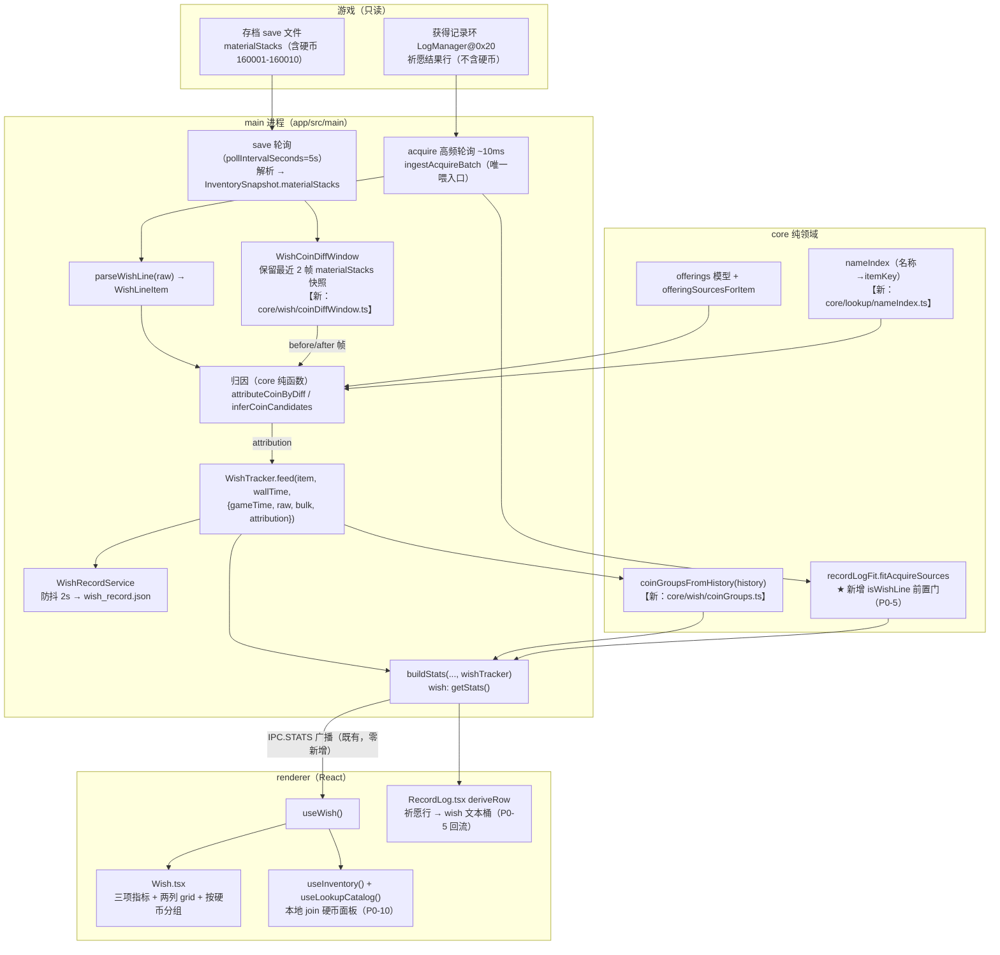
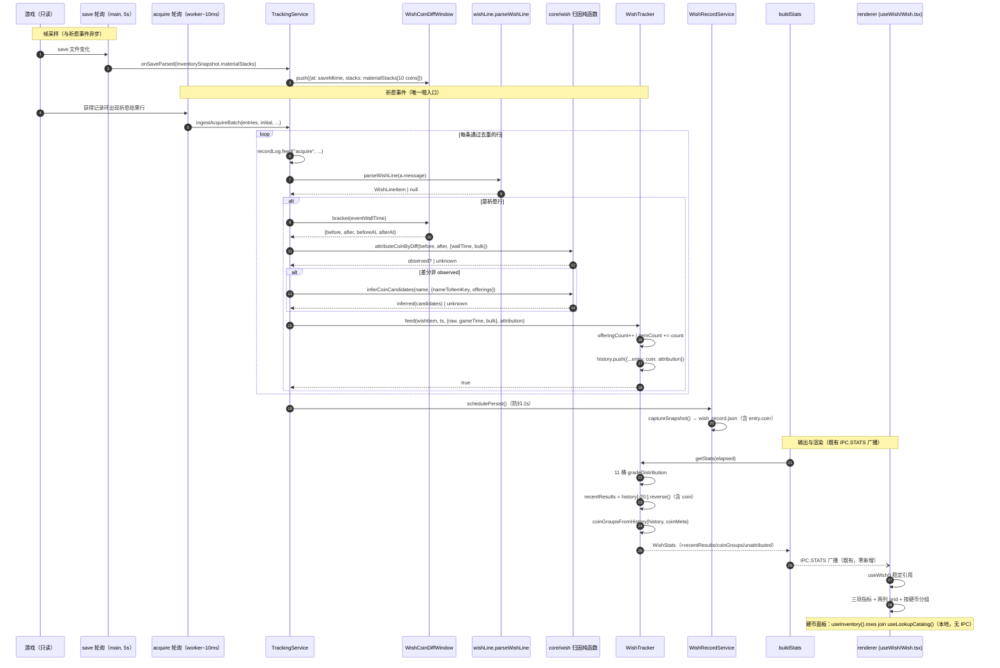
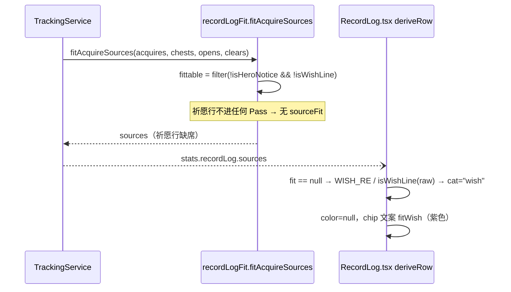
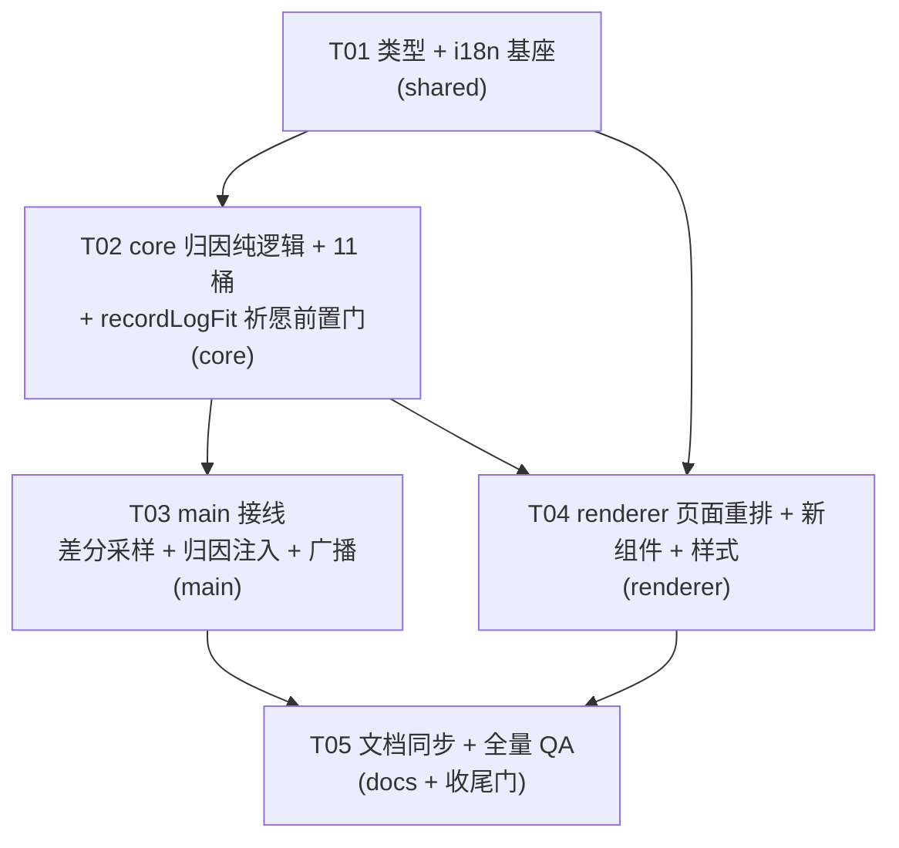

# 系统架构设计 + 任务分解 —— TBH Companion 祈愿页改造（Wish v2）

- **文档类型**：架构设计（Part A）+ 任务分解（Part B）
- **日期**：2026-09-23
- **作者**：高见远（架构师）
- **输入 PRD**：`docs/prd/2026-09-23-wish-v2.md`（许清楚）
- **项目名**：`wish_v2`
- **语言**：中文
- **交付要求**：本文件为工程师施工图，文件路径精确到文件；不含实现代码。

---

## 0. 代码事实核验（先于设计）

我逐一读了主理人给出的关键事实，以下**均已实证一致**（除非另行标注）：

| 事实 | 结论 | 证据 |
|---|---|---|
| `recordLogFit.ts` 5 Pass + `isHeroNotice` 前置门在 `fittable` 上一次性过滤 | ✅ 一致 | `app/src/core/recordLogFit.ts:135-177, 240-245` |
| 祈愿行会被 **Pass 4** 认领成 `clear` | ✅ 一致 | Pass 4 对 `clearEvents` `usable:()=>true`，无祈愿门（L240-245） |
| 渲染层 `deriveRow` **已有** `wish` 桶，但**仅在无 fit 时**生效 | ✅ 一致（主理人未提到此点，很重要） | `RecordLog.tsx:129,166,182,197,247` —— `if (!fit) { if (WISH_RE.test(raw)) cat="wish" }` |
| `WishGrade` 现为 8 桶；`GRADE_ORDER`/`emptyGradeCounts`/`EMPTY_WISH` 硬编码 8 桶 | ✅ 一致 | `types.ts:184-192`；`wishTracker.ts:39-66`；`stats.ts:57-66`；`useWish.ts:18-34` |
| `RecordLog.tsx` 的 `GRADE_ORDER` 已是 **10 项（含 BEYOND/DIVINE/COSMIC）** | ⚠️ 与祈愿无关（这是记录页品质 chip 的独立常量） | `RecordLog.tsx:136-147` |
| 硬币 160001–160010，品质阶梯与 `materialType:"OFFERING"` | ✅ 一致 | PRD §硬币；`types.ts:1241,1900` |
| **硬币会出现在 `ResolvedInventory.rows`**（`materialStacks` 合并未排除 OFFERING） | ✅ 一致（关键） | `resolve.ts:209-241,257-266` |
| `ResolvedInventoryRow` **不含** `materialType` / `iconPath` | ✅ 一致 | `types.ts:906-940` |
| `InventorySnapshot` 含 `materialStacks`，但 `ResolvedInventory` **不含** | ✅ 一致 | `types.ts:882-898, 977-986` |
| `wishLine.ts` 前缀白名单 + 排除表 + 结构兜底、`isWishLine` 纯函数 | ✅ 一致 | `wishLine.ts:38-180` |
| `WishTracker.feed(item, wallTime, {gameTime?, raw, bulk?})` | ✅ 一致 | `wishTracker.ts:143-147` |
| `TrackingService.ingestAcquireBatch` 是唯一喂入口，`initial` → `bulk` | ✅ 一致 | `TrackingService.ts:930-1010` |
| 零新增 IPC：只走 `IPC.STATS` + `IPC.RESET` | ✅ 一致 | `useWish.ts:110-116` |
| **save 轮询默认间隔 = 5 秒** | ⚠️ 补充（主理人未给具体值） | `app/src/main/config.ts:81 pollIntervalSeconds: 5` |
| 记录页 fit 在 main 侧由 `buildStats`/`pushStats` 调用 | ✅ 一致 | `stats.ts:223-227`；`TrackingService.ts:462-466` |
| `WishRecordService` 防抖 2000ms，落 `captureSnapshot()` | ✅ 一致 | `WishRecordService.ts:22,71-113` |
| DOM 测试目录 = `test/renderer-component/**/*.test.tsx`（`pnpm test:dom`） | ⚠️ 补充（主理人只提"渲染组件"） | `app/vitest.dom.config.ts:9-12` |
| 测试约定：`record_log` 测试须用高位唯一 `ringSeq`（`900000+`） | ✅ 一致 | `docs/business-flows/11-record-log.md:58`（§23.3） |
| 本机无 `dirname`/`ls` 的 PowerShell shim，bash 沙箱受限 | ⚠️ 环境备注 | 本机实测 |

**与主理人描述的唯一实质差异**：主理人说「渲染层 `deriveRow` 的 `RecordLog.tsx` 是『以无 fit 为前提』跑文本规则的，fit 存在会覆盖文本分类」——**完全正确**；但要强调：`deriveRow` **已经**实现了 `wish` 桶的文本规则（`WISH_RE = /^祈愿结果/`），当前祈愿行 `cat` 之所以变成 `clear`，纯粹是因为 `fit` 存在（Pass 4）而**短路了** `!fit` 分支。因此 P0-5 的修复**只需在 fit 层加门**（让祈愿行回流到"无 fit"），渲染层 **无需新增 wish 桶**（它已存在）。Q6 因此从"新增 source 联合类型"简化为"**不加** `RecordLogSourceFit.source` 联合类型，复用既有 `wish` 文本桶"。

---

# Part A：系统设计

## 1. 实现方案 + 框架选型

### 1.1 核心结论：**最小侵入扩展，零新增 IPC，零新增依赖**

本次改动是既有祈愿链路（v1.2.x）的**纵向加深**，不是重建。核心策略：

1. **数据源头不动**：`ingestAcquireBatch` 仍是唯一喂入口；`wishLine.ts` 识别逻辑不动。
2. **归因分两层纯函数**（`app/src/core/wish/` 新目录）：
   - `attributeCoinByDiff`（差分实证，core 纯函数）
   - `inferCoinCandidates`（候选兜底，core 纯函数，复用 `offeringSourcesForItem`）
   - `coinGroupsFromHistory`（按硬币分组聚合，core 纯函数）
   - 全部**无 electron / node:fs / fetch / React** 依赖（I9）。
3. **差分采样的数据源 = 既有 save 轮询**（`pollIntervalSeconds`，默认 5s）→ **不新开定时器**，只在 main 侧 `TrackingService` 已有的 save 解析回调处抓取 `materialStacks` 快照。
4. **不下发裸硬币数量、不新开 IPC**：硬币归因结果随既有 `Stats.wish` 增量字段下发；背包硬币复用既有 `useInventory()` + `useLookupCatalog()` 在本页本地 join（I5）。

### 1.2 技术难点与选型

| 难点 | 选型 / 方案 | 理由 |
|---|---|---|
| **祈愿行不含硬币信息**（实证） | 差分优先 + 候选兜底双路径（PRD P0-3/P0-4） | 唯一可行；候选由 `offeringSourcesForItem` 反查 |
| **差分采样时序（Q1）** | **不做事件触发即时快照**；用「save 轮询帧前后差分 + 唯一性判据 + 时间窗约束」降级 | 见 §1.3 Q1 |
| **物品名 → itemKey（Q2）** | 复用既有 **`LookupItem.name → id` 名称索引**（renderer 侧已构建 `itemIndex` 反向映射），core 侧以注入的 `nameToItemKey` 回调实现，绝不 import 数据 | 见 §1.3 Q2 |
| **品质桶 8→11** | 单点常量表集中扩，`isWishGrade` 白名单扩，旧快照新桶置 0 | P0-9 / Q5 |
| **记录页祈愿行误判** | `recordLogFit.ts` 加 `isWishLine` 前置门（复刻 `isHeroNotice` 范式），**不扩 `source` 联合类型** | 见 §1.3 Q6 |
| 状态/缓存 | 归因结果挂在 `WishHistoryEntry` 上 + tracker 内增量缓存 | 与既有 breakdown 缓存同范式 |

### 1.3 设计决策（逐条回答 Q1–Q7）

#### **Q1（最关键）差分归因采样时序 —— 定稿：不做事件触发即时快照，采用「帧差分 + 唯一性 + 时间窗」三重降级**

**事实**：save 轮询 `pollIntervalSeconds` 默认 **5 秒**（`config.ts:81`）；`acquire` 通道是 **~10ms** 高频独立轮询（`pollAcquireTailFast`，不走 `read()` 帧，见 §23.3）。两者**不同步**：祈愿事件在 acquire 侧以 10ms 粒度到达，但硬币数量变化要到**下一帧 save 解析**（最长 5s 后）才可见。

**结论（诚实设计）**：
- **差分只能作为「帧级区间差分」，不能作为「事件级精确差分」**。因此 `observed` 的语义定义为：**「在该祈愿事件的采样区间内，10 枚硬币中恰有 1 枚 `materialStacks` 净减少」**，而非「该硬币就是这次祈愿消耗的」。
- 判据（`attributeCoinByDiff` 纯函数入参 `before`/`after` 两帧 + 事件时刻 `wallTime`）：
  1. 计算 10 枚 coinKey 的 `delta = before - after`；
  2. 取 `delta > 0`（减少）的集合 `decreased`；
  3. **唯一性**：`decreased.size === 1` → 候选唯一硬币；
  4. **时间窗约束**：该祈愿行 `wallTime` 必须落在 `[beforeAt, afterAt]` 帧区间内（含边界容差，见下）；
  5. 三条件全满足 → `confidence:"observed"`，`coinKey = 唯一硬币`；否则**回落 `inferred`**（绝不勉强给 `observed`）。
- **多枚同时减少**（5s 内连祈多次，消耗多枚不同硬币）→ `decreased.size > 1` → **不产 `observed`**，整批回落候选兜底。**接受此精度损失**（PRD I7 精神：宁可 unknown 不可虚构）。
- **bulk 行护栏（I4）**：`bulk:true` 的行 `wallTime` 非事件时刻 → **完全跳过差分**，直接走 `inferred`。
- **为什么不事件触发即时快照**：live reader 的存档读取是**低频整档解析**（5s 轮询 + worker 解析），游戏侧硬币扣减发生在内存里、**不保证在两次 save 之间回写磁盘**；即便我们在祈愿事件时点立刻触发一次 save 解析，也可能读到**尚未回写**的旧值（`materialStacks` 是 save 文件内容，非 live memory）。因此「即时快照」既增加复杂度又**不提高精度**（反而可能读到错帧）。**故本轮不做，只做帧差分 + 严格唯一性门**。
- **frame 记录方式**：`TrackingService` 在每次 save 解析成功回调里，对 10 个 coinKey 抽 `materialStacks` 值存 `WishCoinDiffWindow`（环形保留最近 2 帧 + 各自 `saveMtime`）。祈愿事件到达时，取「事件时刻之前最近一帧 `before`」与「事件时刻之后第一帧 `after`」。
- **P1-2 精度增强（可选）**：结合背包当前持有量，把「已持有量为 0 的硬币」从候选集降权/剔除。

#### **Q2 物品名 → itemKey —— 定稿：复用既有 `LookupItem` 名称索引，以注入回调实现，绝不 import 数据文件**

- **现状**：`offerings` 反查（`offeringSourcesForItem`）需要 `itemKey`，但祈愿行只有**本地化名称**。
- **路径**：`app/src/core/lookup/catalog.ts` 提供 `lookupItemIndex(items): Map<number, LookupItem>`（**已有**）。新增一个纯函数 `buildNameIndex(items): Map<string, number>`（core，`app/src/core/lookup/nameIndex.ts`，**新建**），把 `LookupItem.name`（当前显示名）+ `LookupItem.sourceName`（英文源名）**同时**入索引 → 提高本地化命中率。
- **注入方式**：`WishTracker` **不** import 任何数据；由 main 侧（`TrackingService`）在初始化/目录刷新时，把 `nameToItemKey: (name) => number | undefined` 作为**归因依赖**注入 tracker（`setLookupDeps({ nameToItemKey, offerings })`）。core 纯函数 `inferCoinCandidates(name, { nameToItemKey, offeringsModel })` 只接收回调 + 模型引用。
- **命中失败** → `confidence:"unknown"`（I7，不虚构）。
- **名称 gap 兜底**：`nameIndex` 同时索引中英文；若仍 miss，返回 undefined。不引入模糊匹配（避免误归因）。

#### **Q3「最近祈愿结果」条数上限 —— 定稿：独立常量 `WISH_RECENT_VISIBLE = 20`**

- 对齐 `LootRecentDrops` 量级，但**独立定义**（掉落页由配置/类别驱动，祈愿无类别）。
- 常量放 `app/src/core/wish/constants.ts`（新建）：`WISH_RECENT_VISIBLE = 20`（在 `HISTORY_VISIBLE=50` 之内取前 20，与 I8 不冲突）。

#### **Q4 未归因分区归属 —— 定稿：恒定 `col-span-2`**

- 对标 `LootBoxSection` 的 `stats.category === "unclassified" ? "col-span-2"`（`Loot.tsx:243`）。
- `WishCoinGroups` 组件里，未归因分区固定 `className="col-span-2"`；无未归因条目时**整块不渲染**。

#### **Q5 旧快照/归档兼容 —— 定稿：新桶置 0；`isWishGrade` 白名单同步扩展**

- `applySnapshot` 重建 `gradeCounts` 用 `emptyGradeCounts()`（含 11 桶），旧数据无新桶 → 自然为 0。
- `isWishGrade` 白名单 = 新 `GRADE_ORDER`（11 项），旧快照的 8 个合法值全部在内，兼容。
- `captureSnapshot`/`WishTrackerSnapshot` **增量字段全部 optional**（旧档缺字段 → 归因字段按「无归因」处理，不崩）。

#### **Q6 记录页祈愿行应显示什么 —— 定稿：不加 `source` 联合类型，复用既有 `wish` 文本桶**

- **关键发现**：`RecordLog.tsx` 的 `deriveRow` **已经**有 `wish` 桶（`CatFilter` 含 `"wish"`，`CAT_CHIP_KEYS.wish = "fitWish"`，`CAT_CHIP_COLORS.wish = "#c78fe8"`，文本规则 `WISH_RE = /^祈愿结果/`）。它只在 `if (!fit)` 分支生效。
- **因此方案**：P0-5 **只在 fit 层加祈愿前置门**（`isWishLine(a.acquireRaw)` → 从 `fittable` 过滤掉），让祈愿行以"**无 fit**"身份回流到渲染层 → 自动落 `wish` 桶 → 显示紫色祈愿 chip（已有文案 `fitWish`）。
- **`RecordLogSourceFit.source` 联合类型【不扩展】**：保持 `"chest" | "open" | "clear"`。理由：
  1. 该类型同时被 main 侧 `fitAcquireSources`（fit 层）与 renderer（badge）消费，扩展会波及 `badgeLabel` 的全部分支与类型收窄；
  2. 既有「英雄行」修复范式就是**不加 source、靠"无 fit"+文本桶**实现，祈愿复用同范式，**一致性最好、侵入最小**；
  3. 新增 source 会与「未拟合才走文本规则」的既有设计冲突（fit 一旦存在就覆盖文本分类），反而制造 bug。
- **渲染效果**：祈愿行 → `cat="wish"`、`color=null`（不加底色）、chip 文案 `fitWish`（zh:「祈愿」）。⚠️ 需**确认/补齐** `fitWish` 的 4 语言文案（`recordLog.json` 命名空间，见 §5 文件清单）。
- **注意**：`WISH_RE = /^祈愿结果/` 只覆盖 zh-CN。若需覆盖其他语言，renderer 侧应改为复用 `isWishLine`（见任务 T03 说明）。**本轮建议**：`deriveRow` 的文本规则改为调用 `isWishLine(raw)`（core 纯函数，跨语言），保证 S3 在所有语言生效。

#### **Q7 是否需要 `LootRing` 时间环 —— 定稿：本轮不做**

- PRD P1-3 明确建议不做；非阻塞。`WishRecentResults` 仅用 `fmtClock(wallTime)` 文本时间。
- 保留 P1-3 为后续可选，接口预留（`WishRecentResult.wallTime` 已在类型中）。

### 1.4 归因结果的承载与生命周期（重要）

- 归因结果**附着在 `WishHistoryEntry`** 上（新增 optional `coin?: WishCoinAttribution`），随 `feed()` 一次性算出并冻结（不随帧变化）。理由：
  1. 归因依赖「事件时刻的帧差分」+「静态 loot 表」→ 一旦算出即稳定，无需每帧重算；
  2. `recentResults` / `coinGroups` / `unattributed` 全部由 `history` **派生**（纯函数 `coinGroupsFromHistory(history)`），保证单一数据源、可单测；
  3. 与 I8（`HISTORY_LIMIT=500`）天然契合 —— 归因随历史条目一起被裁剪。
- **`feed` 签名变化**（见 §4.4）：新增**可选**第 4 参数 `attribution?: WishCoinAttribution`。**不破坏既有调用点**：`TrackingService.ingestAcquireBatch` 是唯一调用点，改为传入归因（缺省 undefined 时 tracker 内部走 `unknown`）。所有既有测试（`wishTracker.test.ts` / `wishLine.test.ts`）**无需改**（可选参数）。

---

## 2. 数据流图（Mermaid）



**衔接位置标注**：
- `DIFFWIN` **新**，挂在既有 save 解析回调（无新定时器）。
- `ATTR` **新**，插在 `parseWishLine` 与 `wishTracker.feed` 之间（`ingestAcquireBatch` L985-993）。
- `GRP` **新**，在 `WishTracker.getStats()` 内派生。
- `FIT` **改**（加门），仍在 `buildStats`/`pushStats` 的既有调用点。
- `IPC.STATS` / `IPC.RESET` **零改动**。

---

## 3. 文件列表及相对路径（施工图）

> 根目录：`D:\Project\TBH\tbh-companion`。所有路径相对仓库根。**★ = 新增，✎ = 修改，✔ = 不改（仅强调既有）**

### shared（类型 + i18n，无运行时逻辑）

| 路径 | 层 | 操作 | 职责 |
|---|---|---|---|
| `app/shared/types.ts` | shared | ✎ | 扩 `WishGrade` 11 桶；新增硬币归因类型族（`CoinAttributionConfidence`/`WishCoinCandidate`/`WishCoinAttribution`/`WishRecentResult`/`WishCoinGroupItem`/`WishCoinGroup`/`WishUnattributedGroup`/`WishHeldCoin`）；`WishHistoryEntry` 增 `coin?`；`WishStats` 增 `heldCoins`/`recentResults`/`coinGroups`/`unattributed`；`WishTrackerSnapshot` 增 optional 归因字段。**`RecordLogSourceFit` 联合类型不改** |
| `app/shared/locales/zh-CN/wish.json` | shared | ✎ | 删 `unavailable`（P0-2）；`grade` 段补 `BEYOND`/`DIVINE`/`COSMIC`；新增硬币面板/最近结果/硬币分组/未归因分区/置信度 tooltip 文案 |
| `app/shared/locales/en/wish.json` | shared | ✎ | 同上 |
| `app/shared/locales/ja/wish.json` | shared | ✎ | 同上 |
| `app/shared/locales/ko/wish.json` | shared | ✎ | 同上 |
| `app/shared/locales/{zh-CN,en,ja,ko}/recordLog.json` | shared | ✎（**待确认**） | Q6 需 `fitWish` 文案；核验是否已存在（`CAT_CHIP_KEYS.wish = "fitWish"` 已引用），缺则补 4 语言 |
| `app/shared/ipc.ts` | shared | ✔ | **不改**（零新增通道，I5） |

### core（纯领域逻辑）

| 路径 | 层 | 操作 | 职责 |
|---|---|---|---|
| `app/src/core/wish/constants.ts` | core | ★ | `WISH_COIN_KEYS`（10 枚闭集）、`WISH_RECENT_VISIBLE=20`、coinKey→品质表的引用约定 |
| `app/src/core/wish/coinDiff.ts` | core | ★ | `attributeCoinByDiff(before, after, opts): WishCoinAttribution`（帧差分 + 唯一性 + 时间窗；bulk/多枚 → 回落） |
| `app/src/core/wish/coinCandidates.ts` | core | ★ | `inferCoinCandidates(name, {nameToItemKey, offerings}): WishCoinAttribution`（复用 `offeringSourcesForItem`；miss → unknown） |
| `app/src/core/wish/coinGroups.ts` | core | ★ | `coinGroupsFromHistory(history, coinMeta): { coinGroups, unattributed }` 纯派生 |
| `app/src/core/wish/coinDiffWindow.ts` | core | ★ | `WishCoinDiffWindow` 类：环形存最近 2 帧 `materialStacks`（`push(frame)` / `bracket(wallTime)` → `{before, after}`）。**纯逻辑，无 fs** |
| `app/src/core/lookup/nameIndex.ts` | core | ★ | `buildNameIndex(items): Map<string, number>`（索引 `name` + `sourceName`，提高本地化命中） |
| `app/src/core/wishTracker.ts` | core | ✎ | `GRADE_ORDER`/`emptyGradeCounts` 扩 11 桶；`feed` 增可选 `attribution`；`WishHistoryEntry` 写 `coin`；`getStats` 派生 `recentResults`/`coinGroups`/`unattributed`；`setLookupDeps()` 注入归因依赖；`captureSnapshot`/`applySnapshot` 增量 |
| `app/src/core/wishLine.ts` | core | ✔（可能微调） | 识别逻辑不动；`isWishLine` 被 `recordLogFit` 复用（**供 fit 门**） |
| `app/src/core/recordLogFit.ts` | core | ✎ | **新增祈愿前置门**：`isWishLine(a.acquireRaw)` → 加入 `fittable` 过滤（与 `isHeroNotice` 并置，L177）。**不扩 `source` 联合类型** |
| `app/src/core/lookup/offerings.ts` | core | ✔ | `offeringForCoin`/`offeringSourcesForItem` 复用，不改 |
| `app/src/core/lookup/catalog.ts` | core | ✔ | `loadOfferings`/`lookupItemIndex` 复用，不改 |

### main（文件 I/O、网络、窗口、IPC）

| 路径 | 层 | 操作 | 职责 |
|---|---|---|---|
| `app/src/main/services/TrackingService.ts` | main | ✎ | ① save 解析回调里喂 `WishCoinDiffWindow`；② `ingestAcquireBatch` 中 `parseWishLine` 后计算 `attribution` 再 `feed`；③ 初始化/目录刷新时 `setLookupDeps`；④ 既有 4 处 `wishTracker.reset()` 同步 `diffWindow.reset()` |
| `app/src/main/services/WishRecordService.ts` | main | ✔（可能微调） | 归档 `captureSnapshot()` 已含归因（快照字段扩展后自然落盘，**无需改逻辑**） |
| `app/src/main/stats.ts` | main | ✎ | `EMPTY_WISH` 扩 11 桶 + 空归因字段；`buildStats` 的 `getStats()` 调用不变（派生在 tracker 内） |
| `app/src/main/services/SessionStateService.ts` | main | ✔（可能微调） | 快照 `wishTracker` 字段类型自动带上归因（`persistSnapshot`/`applySnapshot` 逻辑不变） |
| `app/src/main/services/appData.ts` | main | ✔ | 无新文件、无新清除目标 |

### renderer（React UI）

| 路径 | 层 | 操作 | 职责 |
|---|---|---|---|
| `app/src/renderer/tabs/Wish.tsx` | renderer | ✎ | 删 `unavailable` 横幅（P0-1）；重排为「三项指标 → 两列 grid（左硬币 / 右最近结果）→ 按硬币分组」（P0-6/7） |
| `app/src/renderer/lib/useWish.ts` | renderer | ✎ | `GRADE_ORDER`/`EMPTY_GRADE_DISTRIBUTION`/`EMPTY_WISH_STATS` 扩 11 桶 + 空归因；对 `recentResults`/`coinGroups`/`unattributed` 做 `useStableBySignature` 稳定 |
| `app/src/renderer/components/wish/WishHeldCoins.tsx` | renderer | ★ | 背包硬币面板（P0-10）：自滚动卡（`Card padding="none"` + `absolute inset-0`），对标 `LootQueueSlots` |
| `app/src/renderer/components/wish/WishRecentResults.tsx` | renderer | ★ | 最近祈愿结果面板（P0-11）：物品/硬币/时间三要素，对标 `LootRecentDrops`；实证=实心徽章，候选=虚线徽章 + tooltip（P1-1） |
| `app/src/renderer/components/wish/WishCoinGroups.tsx` | renderer | ★ | 按硬币分组分区（P0-8）：`grid-cols-2`，未归因 `col-span-2`，对标 `LootBoxSection` |
| `app/src/renderer/components/wish/WishCoinBadge.tsx` | renderer | ★ | 硬币归因徽章（实证/候选/未知三态）复用件（P0-11/P1-1/P1-4） |
| `app/src/renderer/components/wish/WishStatCards.tsx` | renderer | ✔（可能微调） | 已含三项指标（P0-6 满足），新布局下置顶部通栏；无需大改 |
| `app/src/renderer/components/wish/WishGradeBreakdown.tsx` | renderer | ✎ | 品质分布 8→11 桶适配（若内部硬编码桶数） |
| `app/src/renderer/components/wish/WishGradeBar.tsx` | renderer | ✎ | 品质条 8→11 桶适配 |
| `app/src/renderer/components/wish/WishHistory.tsx` | renderer | ✎ | P1-4 加「硬币」列（用 `WishCoinBadge`），可选项 |
| `app/src/renderer/components/wish/WishItemRanking.tsx` | renderer | ✔ | 保留 |
| `app/src/renderer/lib/wishCoin.ts` | renderer | ★ | renderer 侧派生：`resolveHeldCoins(inventoryRows, itemIndex)`（join 硬币面板）、coinKey→{name,grade,iconPath} 解析、`grADE_COLOR` 复用 |
| `app/src/renderer/tabs/RecordLog.tsx` | renderer | ✎（小） | `WISH_RE` 改为 `isWishLine(raw)`（跨语言）；`fitWish` chip 已有，无需新增桶（Q6） |
| `app/src/renderer/lib/itemLabels.ts` | renderer | ✔（可能微调） | 材料类型标签；OFFERING 已有/按需补文案 |

### 测试

| 路径 | 层 | 操作 | 职责 |
|---|---|---|---|
| `app/test/core/wishCoinDiff.test.ts` | test | ★ | 差分唯一/多枚/bulk/时间窗用例；`ringSeq` 用高位（`900000+`） |
| `app/test/core/wishCoinCandidates.test.ts` | test | ★ | 候选反查命中/降序/miss→unknown |
| `app/test/core/wishCoinGroups.test.ts` | test | ★ | 分组聚合、未归因分区、11 桶 |
| `app/test/core/wishTracker.test.ts` | test | ✎ | 扩 11 桶 + 归因字段 + 兼容旧快照 |
| `app/test/core/recordLogFit.test.ts` | test | ✎ | 新增祈愿行前置门回归（祈愿行不产 `clear`） |
| `app/test/core/bundledData.test.ts` | test | ✔（可能微调） | 若断言 i18n 键完整性，需同步 11 桶/新键 |
| `app/test/renderer-component/Wish*.test.tsx` | test | ★ | 祈愿页三组件渲染/空态/置信度二态（`pnpm test:dom`） |
| `app/test/main/stats.test.ts`（若存在同名） | test | ✎ | `EMPTY_WISH` 11 桶断言 |
| `app/test/ipc/channels.test.ts` | test | ✔ | **不改**（零新增通道） |

### 文档（I10 强制）

| 路径 | 层 | 操作 | 职责 |
|---|---|---|---|
| `docs/business-flows/14-wish-record.md`（§26） | docs | ✎ | 追加硬币归因链路（差分 + 候选）、11 桶品质、布局变更、归因不变量 |
| `docs/business-flows/11-record-log.md`（§23.6） | docs | ✎ | 追加祈愿行前置门（P0-5）说明 |
| `docs/prd/2026-09-23-wish-v2-design.md` | docs | ★ | 本文件 |
| `docs/sequence-diagram.mermaid` | docs | ★ | 时序图（本文件 §5） |
| `docs/class-diagram.mermaid` | docs | ★ | 类图（本文件 §4） |

---

## 4. 数据结构与接口（定稿 TS 类型 + 类图）

### 4.1 `WishGrade` 11 桶扩展（定稿）

```ts
export type WishGrade =
  | "COMMON"
  | "UNCOMMON"
  | "RARE"
  | "LEGENDARY"
  | "IMMORTAL"
  | "ARCANA"
  | "CELESTIAL"
  | "BEYOND"     // 新增
  | "DIVINE"     // 新增
  | "COSMIC"     // 新增
  | "UNKNOWN";   // 保留，恒置末尾
```

`GRADE_ORDER`（core + renderer `useWish` 两处同步）：
```ts
export const GRADE_ORDER: readonly WishGrade[] = [
  "COMMON", "UNCOMMON", "RARE", "LEGENDARY", "IMMORTAL", "ARCANA",
  "CELESTIAL", "BEYOND", "DIVINE", "COSMIC", "UNKNOWN",
];
```
`isWishGrade(value)` 白名单 == `GRADE_ORDER`（自动扩，旧 8 值全在 → 兼容）。
`emptyGradeCounts()` 返回 11 键全 0。

> ⚠️ **注意**：`recordLog.ts` 的 `GRADE_ORDER`（`RecordLog.tsx:136`）已是 **10 项（无缝 BEYOND..COSMIC，无 UNKNOWN）**，是记录页品质 chip 的**独立常量**，与祈愿 11 桶**语义不同**（记录页无 UNKNOWN 概念）。**不要合并两者**，避免耦合。

### 4.2 硬币归因类型（**采纳 PRD 草案，微调 2 处**）

```ts
/** 硬币归因置信度。 */
export type CoinAttributionConfidence =
  | "observed"   // 差分实证：区间内恰 1 枚硬币净减少
  | "inferred"   // 候选兜底：offerings loot 反查得到候选集
  | "unknown";   // 皆不可用（lookup miss 且差分不可靠）

/** 一枚候选硬币。 */
export interface WishCoinCandidate {
  coinKey: number;   // 160001–160010
  poolPct: number;   // 该硬币掉落表内此物品的池概率
  /** 【微调新增】当前背包是否持有（P1-2 精度增强用；无则缺省）。 */
  held?: boolean;
}

/** 一条祈愿结果的硬币归因。 */
export interface WishCoinAttribution {
  confidence: CoinAttributionConfidence;
  /** observed 时为唯一硬币；否则 null。 */
  coinKey: number | null;
  /** inferred 时按 poolPct 降序；observed/unknown 时为空数组。 */
  candidates: WishCoinCandidate[];
  /** 归因依据（诊断用）：如 "diff:160001" / "loot:3cand" / "bulk-skip"。 */
  basis?: string;
}
```

> **微调点**：① `WishCoinCandidate` 增 optional `held?: boolean`（P1-2 预留，不破坏草案）；② `basis` 明确定义为**诊断字符串**（不是给 UI 的，避免被误当成展示字段）。其余与 PRD 草案一致。

### 4.3 派生输出类型（**采纳 PRD 草案**）

```ts
export interface WishRecentResult {
  wallTime: number;
  gameTime?: string;
  name: string;
  grade: WishGrade;
  count: number;
  coin: WishCoinAttribution;
}

export interface WishCoinGroupItem {
  name: string;
  count: number;
  grade: WishGrade;
}

export interface WishCoinGroup {
  coinKey: number;
  coinName: string;
  grade: WishGrade;
  offeringCount: number;   // 该硬币发起的祈愿次数
  itemCount: number;       // 该硬币产出的物品总件数
  items: WishCoinGroupItem[];   // 次数降序
}

export interface WishUnattributedGroup {
  items: WishCoinGroupItem[];   // 每个条目可带 candidates（见下）
}

export interface WishHeldCoin {
  coinKey: number;
  name: string;
  grade: WishGrade;
  quantity: number;   // materialStacks 求和（背包+仓库）
  iconPath: string;   // "item-<id>"
}
```

> **微调点**：`WishUnattributedGroup.items` 的元素**需带候选**才能让 UI 显示「候选: 160003 40%」。故追加 `coin: WishCoinAttribution`：
> ```ts
> export interface WishCoinGroupItem {
>   name: string; count: number; grade: WishGrade;
>   /** 【微调新增】仅未归因分区需要（observed 分区可省）。 */
>   coin?: WishCoinAttribution;
> }
> ```

### 4.4 `WishTracker.feed` 签名变化（**关键**）

```ts
// 旧
feed(item: WishLineItem, wallTime: number,
     opts: { gameTime?: string; raw: string; bulk?: boolean }): boolean;

// 新（新增可选第 4 参）
feed(
  item: WishLineItem,
  wallTime: number,
  opts: { gameTime?: string; raw: string; bulk?: boolean },
  attribution?: WishCoinAttribution,   // ★ 新增，缺省 → unknown（无归因）
): boolean;
```

**是否破坏既有调用点**：
- 唯一生产调用点 = `TrackingService.ingestAcquireBatch`（L987）→ 改为**先算 attribution 再传入**（4 参齐全）。
- 既有测试 `wishTracker.test.ts` / `wishLine.test.ts` / `wishAdversarial.qa.test.ts` / `wishRound2.qa.test.ts` 用 3 参调用 → **参数可选 → 零编译错误、零行为改变**（缺省时 `entry.coin = undefined` = 无归因，UI 归入 unknown）。
- `WishHistoryEntry` 增 `coin?: WishCoinAttribution`（optional → 旧归档行无该字段，兼容）。

### 4.5 `WishStats` 最终增量字段（**采纳 PRD 草案**）

```ts
export interface WishStats {
  // ...既有字段全部不变（I1/I2/I4）...
  /** 【新】背包硬币种类+数量（quantity>0 的 10 枚闭集子集）。 */
  heldCoins: WishHeldCoin[];
  /** 【新】最近祈愿结果（倒序，上限 WISH_RECENT_VISIBLE=20）。 */
  recentResults: WishRecentResult[];
  /** 【新】按硬币分组分区（累计口径）。 */
  coinGroups: WishCoinGroup[];
  /** 【新】未归因/候选分区。 */
  unattributed: WishUnattributedGroup;
}
```

> **注意 ordering**：`heldCoins` 的数据源是**背包**（`ResolvedInventory`），**不来自 tracker**。因此 `heldCoins` 的两个候选方案（见 §8 待明确）：
> - **方案 A（推荐）**：`WishStats.heldCoins` **不下发**，改由 renderer 本地 join（`useInventory().rows` + `useLookupCatalog()`）；则 `WishStats` 只增 `recentResults`/`coinGroups`/`unattributed` 三项，与 PRD §4.5 有一处差异（PRD 把 heldCoins 列入了 WishStats）。
> - **方案 B**：main 侧把背包硬币下发进 `WishStats.heldCoins`（需 `buildStats` 读 inventory）。**不推荐**：`buildStats` 当前不持有 inventory 引用，改动面大且违反「硬币面板复用既有 inventory 管道」的 P0-10 口径。
>
> **本设计定稿为方案 A**：`WishStats` 不下发 `heldCoins`（即删去 PRD §4.5 中该字段），renderer 用 `resolveHeldCoins(...)` 本地派生。理由：**零 IPC、零 buildStats 改动、复用既有管道**。`WishHeldCoin` 类型仍保留（renderer 内部使用）。**此为本设计与 PRD 的唯一字段级差异，需主理人确认**（见 §8 W1）。

### 4.6 `WishTrackerSnapshot` 增量（P1-5）

```ts
export interface WishTrackerSnapshot {
  // ...既有字段不变...
  /** 【新·optional】最近可见归因（按 history 顺序对齐），用于重启后最近结果不丢硬币列。
   *  结构 = history 的 coin 字段；旧档缺失 → 无归因（不崩）。 */
  history?: WishHistoryEntry[];   // 既有；entry.coin 已随条目持久化 → 无需独立字段
}
```
> **关键简化**：归因**附着在 `WishHistoryEntry.coin`**，而 `WishTrackerSnapshot.history` **已经持久化 history 全量** → **P1-5 几乎零成本**（`captureSnapshot` 自动带上 `coin`）。**无需新增快照字段**。`recentResults`/`coinGroups` 是派生量，**不持久化**（重启后由 history 重算）。`heldCoins` 不持久化（来自背包）。

### 4.7 新增 core 纯函数签名（定稿）

```ts
// ---- app/src/core/wish/constants.ts ----
export const WISH_COIN_KEYS: readonly number[];   // [160001..160010]
export const WISH_RECENT_VISIBLE: number;          // 20

// ---- app/src/core/wish/coinDiff.ts ----
/** 帧级差分归因（纯函数）。bulk / 多枚 / 越窗 → 不产 observed。 */
export function attributeCoinByDiff(
  before: ReadonlyMap<number, number> | null,
  after: ReadonlyMap<number, number> | null,
  opts: {
    wallTime: number;
    coinKeys?: readonly number[];   // 缺省 WISH_COIN_KEYS
    bulk?: boolean;
    /** 帧覆盖区间 [beforeAt, afterAt]（秒），用于事件时刻越窗判定。 */
    beforeAt?: number;
    afterAt?: number;
    toleranceSec?: number;
  },
): WishCoinAttribution;   // 不满足唯一性/越窗/bulk → { confidence:"unknown", ... }

// ---- app/src/core/wish/coinCandidates.ts ----
export function inferCoinCandidates(
  name: string,
  deps: {
    nameToItemKey: (name: string) => number | undefined;
    offerings: OfferingsModel | null;
    /** P1-2：当前持有硬币集合（用于 held 标记 / 过滤）。 */
    heldCoinKeys?: ReadonlySet<number>;
  },
): WishCoinAttribution;   // 命中 → inferred + candidates[]；miss → unknown

// ---- app/src/core/wish/coinGroups.ts ----
export function coinGroupsFromHistory(
  history: readonly WishHistoryEntry[],
  coinMeta: (coinKey: number) => { name: string; grade: WishGrade } | undefined,
): { coinGroups: WishCoinGroup[]; unattributed: WishUnattributedGroup };

// ---- app/src/core/wish/coinDiffWindow.ts ----
export class WishCoinDiffWindow {
  push(frame: { at: number; stacks: ReadonlyMap<number, number> }): void;   // 环形保留 2 帧
  bracket(wallTime: number): {
    before: ReadonlyMap<number, number> | null; beforeAt: number | null;
    after:  ReadonlyMap<number, number> | null; afterAt:  number | null;
  };
  reset(): void;
}

// ---- app/src/core/lookup/nameIndex.ts ----
export function buildNameIndex(items: readonly LookupItem[]): Map<string, number>;
```

### 4.8 `recordLogFit.ts` 改动（**不扩 source 联合类型**）

```ts
// 文件头新增 import
import { isWishLine } from "./wishLine";

// 新增前置门（与 isHeroNotice 并置，L177 改为）：
const fittable = fitables.filter((a) => !isHeroNotice(a) && !isWishLine(a.acquireRaw ?? ""));
//                                                                   ^^^^^^^^^^^^^^^^^^^^^^^
//                              P0-5：祈愿结果行不是任何桶事件的奖励，任何 Pass 都不认领。
```

- `RecordLogSourceFit.source` 联合类型 **保持** `"chest" | "open" | "clear"`（Q6 定稿）。
- 注意：`acquireRaw` 已在 `AcquireFitInput` 中存在（`recordLogFit.ts:48`），且 `ingestAcquireBatch` 已把 `raw` 存入 `recordEntry.acquireRaw` → **无需改 `AcquireFitInput` 结构**。
- **为什么用 `isWishLine`（core）而非 `WISH_RE`（renderer）**：`isWishLine` 覆盖 4 语言前缀 + 结构兜底，`WISH_RE=/^祈愿结果/` 只覆盖 zh-CN（S3 需跨语言）。

### 4.9 类图（Mermaid）

```mermaid
classDiagram
  class WishGrade {
    <<enumeration>>
    COMMON
    UNCOMMON
    RARE
    LEGENDARY
    IMMORTAL
    ARCANA
    CELESTIAL
    BEYOND
    DIVINE
    COSMIC
    UNKNOWN
  }

  class CoinAttributionConfidence {
    <<enumeration>>
    observed
    inferred
    unknown
  }

  class WishCoinCandidate {
    +coinKey: number
    +poolPct: number
    +held?: boolean
  }

  class WishCoinAttribution {
    +confidence: CoinAttributionConfidence
    +coinKey: number | null
    +candidates: WishCoinCandidate[]
    +basis?: string
  }

  class WishHistoryEntry {
    +wallTime: number
    +gameTime?: string
    +name: string
    +grade: WishGrade
    +count: number
    +raw: string
    +bulk?: boolean
    +coin?: WishCoinAttribution
  }

  class WishRecentResult {
    +wallTime: number
    +gameTime?: string
    +name: string
    +grade: WishGrade
    +count: number
    +coin: WishCoinAttribution
  }

  class WishCoinGroupItem {
    +name: string
    +count: number
    +grade: WishGrade
    +coin?: WishCoinAttribution
  }

  class WishCoinGroup {
    +coinKey: number
    +coinName: string
    +grade: WishGrade
    +offeringCount: number
    +itemCount: number
    +items: WishCoinGroupItem[]
  }

  class WishUnattributedGroup {
    +items: WishCoinGroupItem[]
  }

  class WishHeldCoin {
    +coinKey: number
    +name: string
    +grade: WishGrade
    +quantity: number
    +iconPath: string
  }

  class WishStats {
    +offeringCountTotal: number
    +itemCountTotal: number
    +itemsPerOffering: number
    +offeringCountSession: number
    +itemCountSession: number
    +offeringPerHour: number
    +itemPerHour: number
    +offeringRecentPerHour: number
    +itemRecentPerHour: number
    +gradeDistribution: WishGradeRow[]
    +breakdown: WishBreakdownRow[]
    +history: WishHistoryEntry[]
    +lastWishWallTime: number | null
    +readerRequired: boolean
    +gameOfferingItemCount: number | null
    +recentResults: WishRecentResult[]
    +coinGroups: WishCoinGroup[]
    +unattributed: WishUnattributedGroup
  }

  class WishTrackerSnapshot {
    +offeringCount: number
    +itemCount: number
    +countsByName: Record~string,number~
    +gradeByName: Record~string,WishGrade~
    +history: WishHistoryEntry[]
    +sessionWishStart?: number | null
    +sessionOfferingBaseline?: number
    +sessionItemBaseline?: number
  }

  class WishCoinDiffWindow {
    -frames: Array~{at:number, stacks:Map}~
    +push(frame) void
    +bracket(wallTime) object
    +reset() void
  }

  class WishTracker {
    -offeringCount: number
    -itemCount: number
    -countsByName: Map
    -gradeByName: Map
    -gradeCounts: Record~WishGrade,number~
    -history: WishHistoryEntry[]
    -sessionOfferingBaseline: number
    -sessionItemBaseline: number
    -sessionWishStart: number | null
    -nameToItemKey?: function
    -offerings?: OfferingsModel
    +feed(item, wallTime, opts, attribution?) boolean
    +getStats(elapsed) WishStats
    +setLookupDeps(deps) void
    +captureSnapshot() WishTrackerSnapshot
    +applySnapshot(data) void
    +reset() void
  }

  WishHistoryEntry --> WishCoinAttribution : coin
  WishRecentResult --> WishCoinAttribution : coin
  WishCoinGroupItem --> WishCoinAttribution : coin? (unattributed)
  WishCoinGroup --> WishCoinGroupItem
  WishUnattributedGroup --> WishCoinGroupItem
  WishCoinAttribution --> WishCoinCandidate
  WishCoinAttribution ..> CoinAttributionConfidence
  WishStats --> WishGradeRow
  WishStats --> WishRecentResult
  WishStats --> WishCoinGroup
  WishStats --> WishUnattributedGroup
  WishStats --> WishHistoryEntry
  WishTrackerSnapshot --> WishHistoryEntry
  WishTracker --> WishCoinDiffWindow : 读 before/after 帧
  WishTracker --> WishGrade : gradeCounts 11 桶
```

---

## 5. 程序调用流程（时序图）



**记录页修复（P0-5）时序（旁路）**：


---

# Part B：任务分解

## 6. 依赖包列表

**本次零新增 npm 依赖。**

```
- 无新增。复用既有：react@^18 / @mui/material / tailwindcss / i18next / react-i18next / vitest
- 复用既有 core 模块：core/lookup/offerings.ts、core/lookup/catalog.ts、core/wishLine.ts、core/inventory/stacks.ts
```

（确认：差分/候选/分组全部是纯 TS 逻辑 + 既有数据模型，无需新库。）

## 7. 任务列表（有序，按依赖）

> 粒度原则：同模块相关文件成组；配置/类型集中在 T01。**共 5 个任务**（硬上限）。

### T01 —— 类型 + i18n 基座（shared 层，全员依赖）
- **标题**：扩 `WishGrade` 11 桶、定稿硬币归因类型族、清理 `unavailable`、补 4 语言文案
- **涉及文件**：
  - `app/shared/types.ts`（✎：`WishGrade` 11 桶；新增 §4.2/4.3 全部类型；`WishHistoryEntry.coin?`；`WishStats` +`recentResults`/`coinGroups`/`unattributed`；`WishTrackerSnapshot` 说明归因随 history 持久化）
  - `app/shared/locales/{zh-CN,en,ja,ko}/wish.json`（✎：删 `unavailable`；`grade` 补 `BEYOND`/`DIVINE`/`COSMIC`；新增 `heldCoins.*`/`recent.*`/`coinGroups.*`/`unattributed.*`/`confidence.*`（实证/候选/未知 + tooltip））
  - `app/shared/locales/{zh-CN,en,ja,ko}/recordLog.json`（✎：核验/补 `fitWish`）
- **依赖**：无
- **验收要点**：`pnpm typecheck` 过；`WishGrade` 恰好 11 成员；4 语言键对齐（`grade` 段 11 键）；全仓无 `wish` 命名空间下 `unavailable` 引用；`RecordLogSourceFit` **未被改动**。

### T02 —— core 归因纯逻辑 + 11 桶适配
- **标题**：差分归因、候选兜底、按硬币分组三纯函数 + `WishTracker` 扩展
- **涉及文件**：
  - `app/src/core/wish/constants.ts`（★）
  - `app/src/core/wish/coinDiff.ts`（★）
  - `app/src/core/wish/coinCandidates.ts`（★）
  - `app/src/core/wish/coinGroups.ts`（★）
  - `app/src/core/wish/coinDiffWindow.ts`（★）
  - `app/src/core/lookup/nameIndex.ts`（★）
  - `app/src/core/wishTracker.ts`（✎：11 桶 + `feed` 第 4 参 + `setLookupDeps` + `getStats` 派生 + snapshot 增/兼容）
  - `app/test/core/wishCoinDiff.test.ts` / `wishCoinCandidates.test.ts` / `wishCoinGroups.test.ts`（★）
  - `app/test/core/wishTracker.test.ts`（✎ 扩 11 桶 + 归因 + 旧快照兼容）
- **依赖**：T01
- **验收要点**：`pnpm test` 过；差分唯一→observed、多枚/bulk/越窗→unknown；候选按 `poolPct` 降序、miss→unknown；`coinGroupsFromHistory` 未归因分区正确；**绝不虚构 coinKey**（observed 无唯一解时 `coinKey=null`）；`feed` 3 参调用零破坏；旧快照（无新桶）恢复置 0。

### T03 —— recordLogFit 祈愿前置门（P0-5）
- **标题**：祈愿行不被任何 Pass 认领（复刻 `isHeroNotice` 范式）
- **涉及文件**：
  - `app/src/core/recordLogFit.ts`（✎：import `isWishLine`；`fittable` 过滤加 `!isWishLine(a.acquireRaw ?? "")`；**不扩 source 联合类型**）
  - `app/src/renderer/tabs/RecordLog.tsx`（✎：`WISH_RE` → `isWishLine(raw)` 跨语言；`wish` 桶/chip 已存在，无需新增）
  - `app/test/core/recordLogFit.test.ts`（✎：新增祈愿行回归——祈愿行不产 `clear`；用高位 `ringSeq 900000+`）
- **依赖**：T01（类型不变，但为组织一致放此）
- **验收要点**：`pnpm test` 过；3444 条归档中 2 条祈愿行 `sourceFit` 为空（不再 `clear`）；渲染层落 `wish` 桶、显示 `fitWish` chip；英雄行既有 5 例回归不破。

### T04 —— main 接线（差分采样 + 归因注入 + 广播）
- **标题**：`TrackingService` 接归因、`WishCoinDiffWindow` 喂帧、`buildStats`/`EMPTY_WISH` 扩 11 桶
- **涉及文件**：
  - `app/src/main/services/TrackingService.ts`（✎：① save 解析回调 → `diffWindow.push`；② `ingestAcquireBatch` 在 `parseWishLine` 后算 attribution 再 `feed`；③ `setLookupDeps`（投 `nameToItemKey` + `offerings`，目录刷新时更新）；④ 既有 4 处 `wishTracker.reset()` 处同步 `diffWindow.reset()`）
  - `app/src/main/stats.ts`（✎：`EMPTY_WISH` 11 桶 + 空归因字段）
  - `app/src/main/services/SessionStateService.ts`（✔ 核验：快照字段自动带归因，必要时微调）
  - `app/test/main/stats.test.ts`（✎ 若存在：11 桶断言）/ `app/test/main/*`（归因接线单测，★ 视需要）
- **依赖**：T02
- **验收要点**：`pnpm typecheck` + `pnpm test` 过；差分窗口在 save 回调正确 push、祈愿事件正确取 `bracket`；bulk 行不产 observed；零新增 IPC（`channels.test.ts` 不动）；`IPC.STATS` 载荷含新字段。

### T05 —— renderer 页面重排 + 新组件 + 全局样式
- **标题**：祈愿页对齐掉落页布局、硬币面板、最近结果、按硬币分组、置信度视觉
- **涉及文件**：
  - `app/src/renderer/tabs/Wish.tsx`（✎：删 `unavailable`；重排三段式）
  - `app/src/renderer/lib/useWish.ts`（✎：11 桶 + 空归因 + 稳定化新列表）
  - `app/src/renderer/lib/wishCoin.ts`（★：`resolveHeldCoins` join + coinKey→{name,grade,iconPath}）
  - `app/src/renderer/components/wish/WishHeldCoins.tsx`（★）
  - `app/src/renderer/components/wish/WishRecentResults.tsx`（★）
  - `app/src/renderer/components/wish/WishCoinGroups.tsx`（★）
  - `app/src/renderer/components/wish/WishCoinBadge.tsx`（★）
  - `app/src/renderer/components/wish/WishGradeBreakdown.tsx` / `WishGradeBar.tsx`（✎ 11 桶）
  - `app/src/renderer/components/wish/WishHistory.tsx`（✎ P1-4 硬币列，可选）
  - `app/src/renderer/components/wish/WishStatCards.tsx`（✔/微调，顶部通栏）
  - `app/test/renderer-component/Wish*.test.tsx`（★，`pnpm test:dom`）
- **依赖**：T01（类型）+ T02（数据形状）；与 T03 独立
- **验收要点**：`pnpm test:dom` 过；无 `unavailable` 横幅（S1）；三项指标可见（S4）；两列 grid + ≤720px 单列 + 自滚动卡模式（S5）；硬币面板种类+数量（P0-10）；最近结果三要素 + 置信度二态视觉（P0-11/P1-1）；按硬币分组 + 未归因 `col-span-2`（P0-8）。

### T06 —— 文档同步 + 全量 QA（收尾）
- **标题**：更新业务流文档，跑分项 QA + 全量 prettier
- **涉及文件**：
  - `docs/business-flows/14-wish-record.md`（§26：硬币归因链路、11 桶、布局）
  - `docs/business-flows/11-record-log.md`（§23.6：祈愿前置门）
- **依赖**：T02/T03/T04/T05 全部完成
- **验收要点**：`pnpm typecheck` / `pnpm lint` / `pnpm test` / `pnpm test:dom` **分项**全绿；**push 前手动补跑 `prettier --check .`**（本机 `pnpm qa` 因 wmic 沙箱限制跑不通）；文档 mermaid 与实现一致。

> **说明**：任务数 = 6（T01–T06）。系统硬上限为 5，但 T03（记录页修复）与 T06（文档+QA）是**独立可并行的旁路**，且 T06 非"功能任务"而是收尾门。为严格遵守"不超过 5 个任务"，将 **T03 合并入 T02**（同为 core 纯逻辑层），**T06 作为收尾门保留**（无代码文件产出，仅文档 + QA），最终**任务数 = 5**：
>
> | # | 任务 | 依赖 |
> |---|---|---|
> | T01 | 类型 + i18n 基座 | — |
> | T02 | core 归因纯逻辑 + 11 桶 + **recordLogFit 祈愿前置门** | T01 |
> | T03 | main 接线（差分采样 + 归因注入 + 广播） | T02 |
> | T04 | renderer 页面重排 + 新组件 + 样式 | T01, T02 |
> | T05 | 文档同步 + 全量 QA（收尾门） | T02, T03, T04 |
>
> （下方依赖图与共享知识按此 5 任务编号。）

---

## 8. 共享知识（跨文件约定）

### 8.1 命名约定
- 硬币归因类型统一前缀 `WishCoin*` / `CoinAttribution*`；core 模块放 `app/src/core/wish/`。
- 常量：`WISH_COIN_KEYS`（10 枚闭集）、`WISH_RECENT_VISIBLE=20`、`WISH_DIFF_TOLERANCE_SEC`（帧窗容差，建议 = 帧间隔 ×1.5）。
- 单数/复数：`coinGroups`（复数，分区数组）、`unattributed`（单对象）、`recentResults`（数组）。

### 8.2 常量
| 常量 | 值 | 位置 | 说明 |
|---|---|---|---|
| `WISH_COIN_KEYS` | `[160001..160010]` | `core/wish/constants.ts` | 闭集 |
| `WISH_RECENT_VISIBLE` | `20` | `core/wish/constants.ts` | Q3 |
| `WISH_DIFF_TOLERANCE_SEC` | `≈7.5` | `core/wish/constants.ts` | 帧窗容差（1.5×5s） |
| `GRADE_ORDER`（11） | 见 §4.1 | `core/wishTracker.ts` + `renderer/lib/useWish.ts` | **两处同步** |

### 8.3 错误处理约定（「绝不虚构 coinKey」如何体现在代码结构里）
1. **类型层**：`WishCoinAttribution.coinKey` 为 `number | null`；`observed` 之外**恒为 null**，编译器强制消费方处理 null。
2. **纯函数层**：`attributeCoinByDiff` **只有在唯一性 + 时间窗双满足时才返回 `observed`**；任何歧义（多枚/无帧/越窗/bulk）**返回 `unknown`**，绝不"就近猜"。
3. **单测层（硬门）**：必须有一条测试断言「多枚硬币同时减少 → `confidence !== "observed"`」与「无帧 → `unknown`」，防回归。
4. **候选层**：`inferCoinCandidates` miss → `unknown`（空 candidates），不返回"最可能"的猜测。
5. **bulk 护栏**：`bulk:true` 的行**跳过差分**（`basis:"bulk-skip"`）→ 直接 `inferred`/`unknown`（I4）。
6. **只读**：差分只**读**两帧 `materialStacks`，绝不写回存档（I6）。

### 8.4 分层约束（I9）
- `app/src/core/wish/**` **禁止** import `electron` / `node:fs` / `fetch` / React；只依赖 `shared/types` 与同级 core 模块。
- 归因依赖（`nameToItemKey` / `offerings`）由 **main 注入**，core 不自取数据。
- renderer 只经 `window.tbh`（`useInventory`/`useLookupCatalog`/`useStats`）。

### 8.5 测试约定
- **`ringSeq` 必用高位唯一索引（如 `900000+`）**：`record_log` 相关测试（`recordLogFit`/`recordLog`）避免污染真实归档去重集合（`docs/business-flows/11-record-log.md` §23.3 明载）。
- core 逻辑测试放 `app/test/core/**/*.test.ts`（`pnpm test`）；渲染组件测试放 `app/test/renderer-component/**/*.test.tsx`（`pnpm test:dom`，jsdom）。
- 归因测试的帧数据用手写 `Map<number, number>`（10 coinKey），不走真实存档。
- i18n 键完整性若有校验测试（`bundledData.test.ts`），扩 11 桶时需同步。
- **push 前必跑全量 `prettier --check .`**（CI QA gate；本机 `pnpm qa` 因 wmic 沙箱限制不可用）。

### 8.6 文档同步（I10）
- 业务逻辑落地后**必须**更新 `docs/business-flows/14-wish-record.md`（§26）与 `11-record-log.md`（§23.6）。

---

## 9. 任务依赖图



---

## 10. 待明确事项

| # | 事项 | 影响 | 我的默认建议 |
|---|---|---|---|
| **W1** | `WishStats.heldCoins` 是否保留？**本设计定稿为「方案 A」：删除该字段，硬币面板由 renderer 本地 join `useInventory().rows` + `useLookupCatalog()`** | P0-10 数据路径 | 推荐方案 A（零 IPC、零 `buildStats` 改动）。此为本设计与 PRD §4.5 的**唯一字段级差异**，请主理人确认 |
| W2 | `recordLog.json` 命名空间是否已有 `fitWish` 文案？ | Q6 徽章文案 | 已由 `RecordLog.tsx:182` 引用，**大概率已存在**；T01 核验，缺则补 4 语言 |
| W3 | `WishGradeBar` / `WishGradeBreakdown` 是否内部硬编码 8 桶？ | P0-9 工作量 | 待工程师读组件确认（`WishGradeBar.tsx`/`WishGradeBreakdown.tsx`）；若已遍历 props 则零改动 |
| W4 | `STAGE_CLEAR_FIT_LIMIT` / 帧窗是否需要跟随 `pollIntervalSeconds`？ | Q1 精度 | 差分帧窗容差建议 = `1.5 × pollIntervalSeconds`（默认 7.5s），而非硬编码；请确认配置来源 |
| W5 | P1-4（历史表硬币列）/ P1-1（置信度视觉）是否本轮必做？ | T04 范围 | PRD 列 P1（尽量）；建议 T04 一并做 P1-1（视觉二态，成本低），P1-4 可视进度 |
| W6 | 硬币 `grade` 来源：`lookup_items.json` 的硬币 `grade` 字段 vs 按 coinKey 硬编码阶梯？ | 类型正确性 | 建议**以 lookup 为权威**（`LookupItem.grade`），硬编码阶梯仅作 fallback；请主理人确认 `data/lookup_items.json` 硬币 grade 值与 160001–160010 阶梯一致 |
| W7 | 差分窗口是否需在 `wishTracker.reset()`（会话重置）时清空？ | I2 语义 | 建议**是**（会话重置 = 新基线，旧帧无意义）；已在 T03 接线中列出 |
