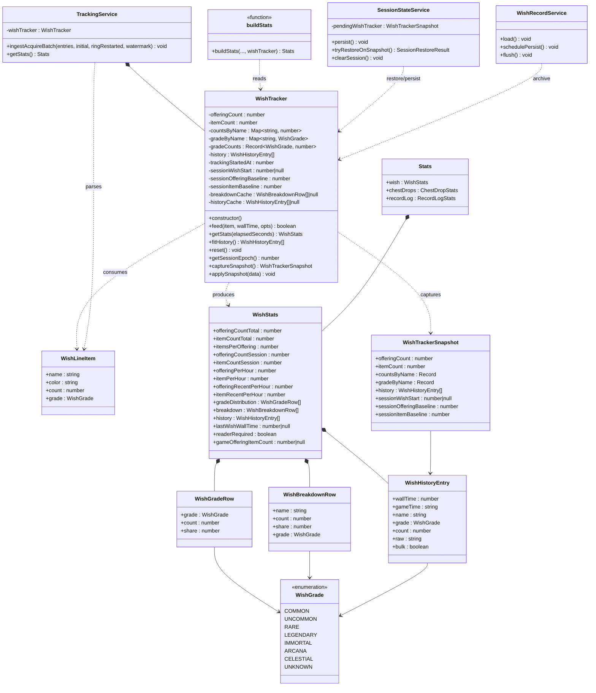
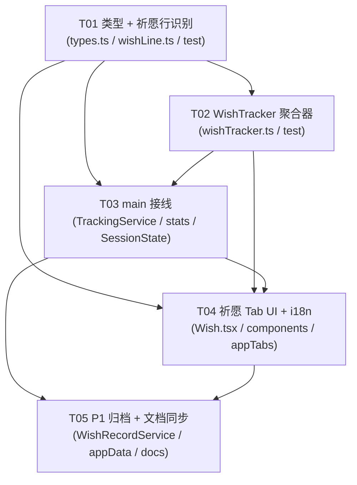

# 祈愿记录功能 —— 系统架构设计 + 任务分解

- **文档类型**：架构设计（含任务分解，供工程师执行）
- **Language**：中文
- **Project Name**：`wish_record`
- **目标仓库**：TBH Companion（`tbh-companion`）
- **上游 PRD**：[`2026-09-22-wish-record-prd.md`](./2026-09-22-wish-record-prd.md)（产品经理 许清楚）
- **撰写人**：架构师 高见远（Bob）
- **日期**：2026-09-22
- **统计口径来源**：**严格采用 PRD §5**，本文不修改口径定义。

---

## 目录

- [Part A：系统设计](#part-a系统设计)
  - [1. 实现方案总述](#1-实现方案总述)
  - [2. 文件列表及相对路径](#2-文件列表及相对路径)
  - [3. 数据结构与接口](#3-数据结构与接口)
  - [4. 程序调用流程](#4-程序调用流程)
  - [5. 祈愿行识别规则](#5-祈愿行识别规则)
  - [6. 待明确事项](#6-待明确事项)
- [Part B：任务分解](#part-b任务分解)
  - [7. 依赖包](#7-依赖包)
  - [8. 任务列表](#8-任务列表)
  - [9. 共享知识（跨文件约定）](#9-共享知识跨文件约定)
  - [10. 测试策略](#10-测试策略)
  - [11. 业务流程文档同步清单](#11-业务流程文档同步清单)
  - [12. 任务依赖图](#12-任务依赖图)

---

## Part A：系统设计

### 1. 实现方案总述

#### 1.1 核心结论：P0 数据源选择

**P0 采用「事实 B」—— 现成的 acquire 文本行管道，零新增内存读取。**

| 维度 | 事实 B（acquire 文本行）✅ P0 采用 | 事实 A（`OfferingResult` 桶）❌ 不做 |
|------|-----------------------------------|--------------------------------------|
| 数据来源 | `readRuntimeAcquireLogs` → `fastAcquirePollTimer` → `pollAcquireTailFast` → `TrackingService.ingestAcquireBatch` | `LogManager.logByType[ELogType.OfferingResult]` 新增桶读取 |
| 现状 | **已线上端到端验证通过**（2026-09-20），管道稳定 | 需推导新偏移量 `offeringResultTypeKey` + 结构体字段偏移 |
| 拿到什么 | 名称 / 品质色 `<color=#RRGGBB>` / 数量 / 游戏内时间 | `itemStringKey` / `itemGradeType`（结构化 itemKey） |
| 拿不到 | **结构化 itemKey**（只有名称文本） | 名称需另行查表 |
| 版本兼容风险 | 无（文本解析容忍性高） | 高（每次游戏更新可能改变桶 key / 结构体偏移） |
| 成本 | 低（仅新增聚合 + UI） | 高（offset 推导 + 完整性校验 + 4 版本基线维护） |
| PRD 约束符合度 | ✅ 符合「不新增任何内存读取路径」 | ❌ 违反 P0 约束 |

**决策依据**：
1. PRD §7 明确约束「P0 完全复用现有管道，仅新增聚合与展示」「不得新增任何内存读取路径」。
2. 事实 B 管道（记录日志链路 `docs/business-flows/11-record-log.md` §23）已于 2026-09-20 线上验证，是项目内**最稳定**的 live 数据源之一。
3. 祈愿行的文本模板 `LogMessage_OfferingResult` = `祈愿结果：获得 {0}` / `Offering result: Obtained {0}` 已被现有归档证据证实（`docs/findings/record-log-audit-2026-09-15.md:588`，592 行 acquire 中含 2 条祈愿行）。
4. 事实 A 的价值（稳定 itemKey）仅对「更精确的单品聚合」与「游戏计数器对账」有意义——这属于 PRD 的 **P1-3（与游戏自带计数器交叉校验）** 范畴，不作为 P0 阻塞项。

#### 1.2 与「掉落」模式的对应关系表

祈愿功能是掉落的**同构移植**，但有两个关键结构差异（见 1.3）。

| 掉落（Loot / ChestDropTracker） | 祈愿（Wish / WishTracker） | 说明 |
|--------------------------------|---------------------------|------|
| `app/src/core/chestDropTracker.ts` | `app/src/core/wishTracker.ts`（**新增**） | core 层纯逻辑聚合器 |
| 数据入口：`ingestLiveFrame` 的 GetBox 桶 | 数据入口：`ingestAcquireBatch` 的祈愿行 | 复用既有喂入口 |
| 计数维度：1 个（箱子个数） | 计数维度：**2 个**（祈愿次数 / 产出物品数） | **最大结构差异** |
| `ChestDropCategory`（6 类） | `WishGrade`（7 品质 + 未知，共 8 桶） | 品质分布维度 |
| `breakdown` 按 itemKey 聚合 | `breakdown` 按**物品名**聚合（P0 无 itemKey） | 见 PRD §5.5 |
| `sessionDropStart` 会话基线 | `sessionWishStart` 会话基线 | 语义一致 |
| `MIN_RATE_WINDOW_SEC`(60s) / `RECENT_MIN_WINDOW_SEC`(300s) | 同常量复用 | 口径一致 |
| `HISTORY_LIMIT`(500) / `HISTORY_VISIBLE`(50) | 同常量复用 | 见共享知识 §9 |
| 持久化：`session_state.json` 的 `pendingChestDropTracker` | 持久化：`session_state.json` 的 `pendingWishTracker` | 会话级 |
| 长期归档：无独立文件 | 长期归档：`wish_record.json`（P1-1） | 对标 `record_log.json` |
| `stats.ts buildStats` → `Stats.chestDrops` | `stats.ts buildStats` → `Stats.wish` | 增参输出 |
| UI：`renderer/tabs/Loot.tsx` + `components/loot/*` | UI：`renderer/tabs/Wish.tsx` + `components/wish/*` | 新增 tab |

#### 1.3 两个关键结构差异的应对

**差异 1：双计数维度。** 掉落只有「箱子个数」。祈愿需要同时维护：
- `offeringCount`（祈愿次数）：识别到一条祈愿结果行 = 1 次。
- `itemCount`（产出物品数）：该行解析出的数量（`count`，缺省 1）。

`WishTracker` 内部对每次 `feed` 同时累加两个计数器，并各自维护 session 基线（两个独立的 `*Session` 差值）。

**差异 2：P0 无 itemKey。** 掉落 `breakdown` 以 `itemKey`（string）为聚合键，祈愿 P0 只有物品名，故以**物品名**为聚合键（PRD §5.5 默认；待明确事项 §6.1 详述）。

#### 1.4 分层落点（四层架构）

| 层 | 改动 |
|----|------|
| `app/shared/` | 新增类型（`WishGrade` / `WishStats` / `WishHistoryEntry` / `WishBreakdownRow` / `WishTrackerSnapshot` / `WishGradeRow`）；`Stats.wish` 字段；`PersistedSessionState.wishTracker`。**无运行时逻辑**。 |
| `app/src/core/` | 新增 `wishTracker.ts`（纯逻辑聚合器）+ `wishLine.ts`（祈愿行识别纯函数，多语言模板）。**禁 electron / node:fs / fetch / React**。 |
| `app/src/main/` | `TrackingService.ts` 在 `ingestAcquireBatch` 内识别并喂入 tracker；`stats.ts buildStats` 输出；`SessionStateService.ts` 持久化；`appData.ts` 注册 P1 归档文件。 |
| `app/src/preload/` | 无新增 IPC 通道（复用 `Stats` 流），**无需改动**。 |
| `app/src/renderer/` | 新增 `tabs/Wish.tsx` + `components/wish/*`；`components/appTabs.ts` 注册 `wish` tab；`App.tsx` 挂载；i18n 四语言 `wish.json`。 |

**重要：P0 不新增 IPC 通道。** 祈愿统计随既有 `IPC.STATS` 流推送（与 `chestDrops` / `recordLog` 同路径），因此 `app/shared/ipc.ts`、`registerIpc.ts`、preload **无需改动**，`test/ipc/channels.test.ts` 不受影响。仅 P1-4（跳转 RecordLog 预置筛选）若需要新通道再评估（本设计用 renderer 内部状态即可，无需新通道，见任务 T12）。

---

### 2. 文件列表及相对路径

> 路径以仓库根 `main-3e880533/` 为基准。**新增** = 新建文件；**修改** = 在既有文件内改动（标注具体函数/位置）。

#### 2.1 新增文件

| # | 相对路径 | 职责（一句话） |
|---|---------|--------------|
| N1 | `app/src/core/wishLine.ts` | **祈愿行识别纯函数**：多语言模板匹配 + 从 acquire 行提取祈愿条目（`isWishLine` / `parseWishLine`）。 |
| N2 | `app/src/core/wishTracker.ts` | **祈愿领域聚合器**（对标 `ChestDropTracker`）：双计数、品质分布、单品 breakdown、历史、会话基线、快照。 |
| N3 | `app/src/renderer/tabs/Wish.tsx` | 祈愿 tab 页面：统计卡区 + 品质分布 + 单品榜 + 历史列表；承载「重置会话」。 |
| N4 | `app/src/renderer/components/wish/WishStatCards.tsx` | 统计卡区组件（祈愿次数 / 产出物品数 / 最近祈愿，三卡）。 |
| N5 | `app/src/renderer/components/wish/WishGradeBreakdown.tsx` | 品质分布组件（P0 文本+条形；P1 升级自绘 SVG）。 |
| N6 | `app/src/renderer/components/wish/WishItemRanking.tsx` | 单品产出排行组件。 |
| N7 | `app/src/renderer/components/wish/WishHistory.tsx` | 祈愿历史列表组件（倒序）。 |
| N8 | `app/src/renderer/components/wish/WishGradeBar.tsx` | 品质分布**自绘 SVG** 横向条形图（P1-5，纯 SVG 无图表库）。 |
| N9 | `app/src/renderer/lib/useWish.ts` | renderer 侧 hook：从 `useStats()` 取 `stats.wish`，提供重置会话回调与格式化辅助。 |
| N10 | `app/shared/locales/zh-CN/wish.json` | zh-CN 祈愿 tab 文案。 |
| N11 | `app/shared/locales/en/wish.json` | en 祈愿 tab 文案。 |
| N12 | `app/shared/locales/ja/wish.json` | ja 祈愿 tab 文案。 |
| N13 | `app/shared/locales/ko/wish.json` | ko 祈愿 tab 文案。 |
| N14 | `app/test/core/wishTracker.test.ts` | `WishTracker` 单测（含 PRD §5.6 五条不变量）。 |
| N15 | `app/test/core/wishLine.test.ts` | 祈愿行识别单测（4 语言模板 + 反例）。 |
| N16 | `app/test/main/trackingService.wish.test.ts` | `ingestAcquireBatch` → wishTracker 集成测（含 initial 去重、ringRestarted）。 |

#### 2.2 修改文件（标注具体函数/位置）

| # | 相对路径 | 具体改动位置 & 内容 |
|---|---------|---------------------|
| M1 | `app/shared/types.ts` | ① 在 `ChestDropCategory` 附近（`types.ts:59-175` 区）新增 `WishGrade` / `WishGradeRow` / `WishBreakdownRow` / `WishHistoryEntry` / `WishStats` / `WishTrackerSnapshot` 类型；② `interface Stats`（`types.ts:594` 起）新增 `wish: WishStats` 字段（与 `chestDrops: ChestDropStats`（`:627`）平级）；③ `PersistedSessionState`（`:711`）新增 `wishTracker?: WishTrackerSnapshot`。 |
| M2 | `app/src/core/wishTracker.ts` | 见 N2（类实现）。 |
| M3 | `app/src/main/services/TrackingService.ts` | ① 新增私有字段 `private wishTracker!: WishTracker;`（与 `chestDropTracker`（`:126`）并列）；② `start()`（`:316`）内实例化 `this.wishTracker = new WishTracker();`；③ **`ingestAcquireBatch()`（`:879-952`）** 在 `this.recordLog.feed("acquire", ...)`（`:914`）之后追加：`if (isWishLine(parsed/*或 raw*/)) this.wishTracker.feed(parsed, ts, {...})`（**唯一喂入口**，`initial` 批处理见 §5.4/§9）；④ `start()` 的 `sessionState.startAutosave`（`:388`）回调对象加入 `wishTracker: this.wishTracker`；⑤ `getStats()`（`:445`）把 `this.wishTracker` 传给 `buildStats`；⑥ `applySnapshot` / `reset` 相关路径（`:476/:508/:1253/:1278` 等 `chestDropTracker.reset()` 处）同步 `wishTracker.reset()`；⑦ restore 路径同步 applySnapshot（与 `tryRestoreOnSnapshot` 协作，见 M5）。 |
| M4 | `app/src/main/stats.ts` | ① 顶部 `import type { WishTracker } from "../core/wishTracker";`（对标 `stats.ts:11` 的 `ChestDropTracker` import）；② `buildStats()` 形参（`:59-73`）新增 `wishTracker: WishTracker \| null = null`（放在 `recordLogTracker`（`:73`）附近，带默认值避免破坏既有调用）；③ 返回对象（`:193` 起，`chestDrops: chestDropTracker.getStats(...)`（`:239`）旁）新增 `wish: wishTracker ? wishTracker.getStats(tracker.elapsed) : EMPTY_WISH`。 |
| M5 | `app/src/main/services/SessionStateService.ts` | ① 新增 `private pendingWishTracker: WishTrackerSnapshot \| null = null;`（对标 `:35`）；② `load()`（`:45`）读取 `raw.wishTracker ?? null`；③ `startAutosave()`（`:86`）`getContext` 返回类型加入 `wishTracker: WishTracker`；④ `persist()`（`:188`）payload 加入 `wishTracker: wishTracker.captureSnapshot()`；⑤ `tryRestoreOnSnapshot()`（`:108`）在 `!snapshotContinuesSession` / 不合理的分支清空 `pendingWishTracker`，在 apply 分支调用 `wishTracker.applySnapshot(this.pendingWishTracker)`；⑥ `clearSession()`（`:223`）/`onTrackerReset()`（`:281`）/`invalidatePending()`（`:242`）/`onFileDeleted()`（`:300`）同步处理 `pendingWishTracker` 与 `wishTracker.reset()`。 |
| M6 | `app/src/renderer/components/appTabs.ts` | `TabId` 联合类型（`:8-19`）新增 `\| "wish"`；`TAB_IDS` 数组（`:21-32`）在 `"loot"` 之后插入 `"wish"`（与 Loot/RecordLog 平级，PRD §4.1）。 |
| M7 | `app/src/renderer/App.tsx` | `const Wish = lazy(...)`（对标 `:12` 的 Loot lazy）；渲染分支 `{tab === "wish" && <Wish />}`（对标 `:47`）。 |
| M8 | `app/src/main/services/appData.ts` | P1-1：新增 `export const WISH_RECORD_FILE = "wish_record.json";`；`getAppDataPaths()`（`:37`）`entries` 新增 `{ id: "wish-record", ... }`；`filesForClearTarget()`（`:101`）新增 `case "wish-record"` 并加入 `all-except-config` 清单（`:118-126`）。 |
| M9 | `app/shared/types.ts`（`AppDataClearTarget`） | 新增 `"wish-record"` 到清除目标联合类型（`appData.ts:101` 的 switch 依赖它，否则 TS 报错）。 |
| M10 | `app/shared/locales/zh-CN/tabs.json` | 新增 `"wish": "祈愿"`。 |
| M11 | `app/shared/locales/en/tabs.json` | 新增 `"wish": "Wish"`。 |
| M12 | `app/shared/locales/ja/tabs.json` | 新增 `"wish": "祈願"`。 |
| M13 | `app/shared/locales/ko/tabs.json` | 新增 `"wish": "기원"`。 |
| M14 | `app/src/main/services/WishRecordService.ts` | **P1-1 新增**：对标 `RecordLogService.ts` 的 load-once / 防抖 persist（~2s），承载 `wish_record.json` 的长期累计归档（不随会话重置清空）。 |
| M15 | `docs/business-flows/11-record-log.md` | 同步「祈愿行」在 acquire 管道内的识别与转发（见 §11）。 |
| M16 | `docs/business-flows/14-wish-record.md` | **P1 新增子文件**：祈愿业务流程正文（见 §11）。 |
| M17 | `docs/BUSINESS-FLOWS.md` | 主索引章节索引表登记新子文件（章节号递增 `§26`，**不重排已有编号**）。 |

> **注**：M2 是 N2 的实现体（列两处为便于对照），实际为同一文件。

---

### 3. 数据结构与接口

#### 3.1 类型定义（`app/shared/types.ts` 新增）

```ts
// --- 祈愿记录（Wish Record） ---

/**
 * 祈愿产出的品质桶。由物品名的富文本颜色标签经 core/acquireLog.ts 的
 * COLOR_TO_GRADE 映射得到；无法映射（无颜色 / 非物品色）归入 "UNKNOWN"。
 * 注意：与 CHEST 提示色 / 通关色 / 英雄紫色无关 —— 那些必然落在 UNKNOWN。
 */
export type WishGrade =
  | "COMMON"
  | "UNCOMMON"
  | "RARE"
  | "LEGENDARY"
  | "IMMORTAL"
  | "ARCANA"
  | "CELESTIAL"
  | "UNKNOWN";

/** 品质分布的一行（件数 + 占比，分母为产出物品总数）。 */
export interface WishGradeRow {
  grade: WishGrade;
  /** 该品质下所有物品的件数之和（含未知）。 */
  count: number;
  /** count / 产出物品总数；总数为 0 时为 0。 */
  share: number;
}

/** 单品产出排行的一行（P0 按物品名聚合；见 PRD §5.5）。 */
export interface WishBreakdownRow {
  /** 去富文本标签后的纯物品名（P0 聚合键）。 */
  name: string;
  /** 该物品的件数之和。 */
  count: number;
  /** count / 产出物品总数；总数为 0 时为 0。 */
  share: number;
  /** 该物品最常见品质（用于着色）；名下有多种品质时取最高频，并列取首个。 */
  grade: WishGrade;
}

/** 一条祈愿产出历史记录（一次祈愿事件 = 一行，可能包含多件同名物品）。 */
export interface WishHistoryEntry {
  /** companion 收到该行的墙钟时刻（epoch 秒）。 */
  wallTime: number;
  /** 游戏内时间串 [HH:MM]（原始，仅供参考，不参与排序）。 */
  gameTime?: string;
  /** 去标签纯物品名。 */
  name: string;
  /** 该行的品质（由颜色标签映射，无法映射为 UNKNOWN）。 */
  grade: WishGrade;
  /** 该行的件数（>=1）。 */
  count: number;
  /** 原始富文本行（保留供渲染品质色）。 */
  raw: string;
  /** 是否为 initial 批量回灌行（会话存量重投，wallTime 非事件时刻）。 */
  bulk?: boolean;
}

/** 祈愿统计输出（Stats.wish）。口径严格遵循 PRD §5。 */
export interface WishStats {
  // —— 累计（cumulative）——
  offeringCountTotal: number;
  itemCountTotal: number;
  /** itemCountTotal / offeringCountTotal；次数为 0 时返回 0（不 NaN）。 */
  itemsPerOffering: number;

  // —— 会话增量（session）——
  offeringCountSession: number;
  itemCountSession: number;

  // —— 速率（per-hour，PRD §5.3）——
  offeringPerHour: number;
  itemPerHour: number;
  /** 滚动 1 小时速率（P1-2）；分母下限 RECENT_MIN_WINDOW_SEC(300s)。 */
  offeringRecentPerHour: number;
  itemRecentPerHour: number;

  // —— 分布 / 排行（累计口径）——
  gradeDistribution: WishGradeRow[];
  breakdown: WishBreakdownRow[];

  // —— 历史（倒序，最新在前，上限 HISTORY_VISIBLE=50）——
  history: WishHistoryEntry[];

  /** 最近一次祈愿墙钟时刻（epoch 秒）；无则 null。 */
  lastWishWallTime: number | null;

  // —— 诊断 / 边界 ——
  /**
   * 真 = 需 live reader 才有数据。祈愿数据源是 acquire 管道，与掉落同理，
   * reader 关闭时为 true，renderer 显示不可用提示。
   */
  readerRequired: boolean;
  /** P1-3：游戏侧 Satistics_TotalOfferingCount，未接入时为 null。 */
  gameOfferingItemCount: number | null;
}

/** 序列化到 session_state.json / wish_record.json 的快照。 */
export interface WishTrackerSnapshot {
  /** 累计：祈愿次数。 */
  offeringCount: number;
  /** 累计：产出物品数。 */
  itemCount: number;
  /** 名称 → 件数。 */
  countsByName: Record<string, number>;
  /** 名称 → 品质（首见 / 最高频，见实现约定）。 */
  gradeByName: Record<string, WishGrade>;
  /** 历史（可能被 HISTORY_LIMIT 截断）。 */
  history: WishHistoryEntry[];
  /**
   * perHour 速率窗口锚点 = min(trackingStartedAt, firstWishWallTime)。
   * 持久化以使 restore 后窗口起点正确（counts 不截断，history 截断）。
   */
  sessionWishStart?: number | null;
  /**
   * 会话基线（累计口径 - 会话口径 = 基线）。重置会话时把当前累计写入
   * 基线，使 *Session 归零而累计不变。
   */
  sessionOfferingBaseline?: number;
  sessionItemBaseline?: number;
}
```

`Stats` 增量（`app/shared/types.ts:594` 起）：

```ts
export interface Stats {
  // ...existing...
  chestDrops: ChestDropStats;      // types.ts:627
  wish: WishStats;                 // ← 新增
  recordLog: RecordLogStats;       // types.ts:657
  // ...
}
```

`PersistedSessionState` 增量（`app/shared/types.ts:711`）：

```ts
export interface PersistedSessionState {
  // ...existing...
  chestDropTracker?: ChestDropTrackerSnapshot; // :719
  wishTracker?: WishTrackerSnapshot;           // ← 新增（可选，兼容旧档）
  // ...
}
```

#### 3.2 `core/wishLine.ts` 公开接口

```ts
import type { AcquireItem } from "./acquireLog";

/**
 * 一条 acquire 行是否为「祈愿结果」行。
 *
 * 判定基于 LogMessage_OfferingResult 模板的**语言无关结构**：模板恒为
 * 「<祈愿结果前缀>：<获得动词> <物品>」/「Offering result: Obtained {0}」。
 * 由于 4 语言前缀不同，采用「前缀白名单 + 结构正则」双层判定：
 *   1. 前缀白名单命中（zh 祈愿结果 / en Offering result / ja 祈願結果 /
 *      ko 기원 결과）→ 直接判 true；
 *   2. 前缀未命中但行内含「获得动词 + 富文本物品」且不含其他已知结果前缀
 *      （制作/合成/炼金…）→ 保守判 false（不猜测，避免误归）。
 */
export function isWishLine(rawMessage: string): boolean;

/**
 * 从祈愿行解析出产出物品（复用 parseAcquireMessage，并附加祈愿语义）。
 * 返回 null = 不是祈愿行 或 无法解析出名称。
 */
export interface WishLineItem {
  name: string;
  color?: string;
  count: number;
  grade: WishGrade; // 由 gradeFromAcquireColor(color) ?? "UNKNOWN"
}
export function parseWishLine(rawMessage: string): WishLineItem | null;
```

#### 3.3 `core/wishTracker.ts` 完整公开方法签名

```ts
import type {
  WishBreakdownRow,
  WishGradeRow,
  WishHistoryEntry,
  WishStats,
  WishTrackerSnapshot,
} from "../../shared/types";
import type { WishLineItem } from "./wishLine";

export class WishTracker {
  constructor();

  /**
   * 摄入一条祈愿产出。
   * @param item   parseWishLine 的结果（名称 / 颜色 / 件数 / 品质）。
   * @param wallTime companion 收到该行的墙钟秒（非游戏内时间）。
   * @param opts   { gameTime?: string; raw: string; bulk?: boolean }
   * @returns true = 已计入。
   */
  feed(item: WishLineItem, wallTime: number, opts: { gameTime?: string; raw: string; bulk?: boolean }): boolean;

  /** 输出统计（口径见 PRD §5）。5Hz 调用，内部有缓存。 */
  getStats(elapsedSeconds: number): WishStats;

  /** 全量历史（供 P1-3 对账 / P2-2 导出）。 */
  fitHistory(): WishHistoryEntry[];

  /** 会话重置：*Session 归零、累计不变、sessionWishStart 重置为现在。 */
  reset(): void;

  /** 会话纪元（与 ChestDropTracker 同语义，防跨重置的延迟补记）。 */
  getSessionEpoch(): number;

  captureSnapshot(): WishTrackerSnapshot;
  applySnapshot(data: WishTrackerSnapshot | null | undefined): void;
}
```

#### 3.4 Mermaid classDiagram



---

### 4. 程序调用流程

```mermaid
%% TBH wish-record sequence diagram
sequenceDiagram
  autonumber
  participant GAME as 游戏进程 LogManager
  participant WORKER as worker.ts (fastAcquirePollTimer ~10ms)
  participant READER as liveReader.pollAcquireTailFast
  participant TS as TrackingService.ingestAcquireBatch
  participant RT as RecordLogTracker
  participant WT as WishTracker (core)
  participant RS as RecordLogService / WishRecordService
  participant ST as buildStats
  participant UI as renderer tabs/Wish.tsx

  Note over GAME,READER: 1. 既定管道（P0 不新增内存读取）
  GAME->>READER: 获得记录定长列表（含「祈愿结果：获得 X」行）
  READER->>WORKER: {type:"acquire", entries, initial}
  WORKER->>TS: post → ingestAcquireBatch(entries, initial, ringRestarted, watermark)

  Note over TS: 2. 既有记录日志逻辑（不改）
  TS->>TS: ordered = sort(entries, seq asc)
  TS->>RT: 逐条 feed("acquire", ts, {ringSeq, acquireRaw, acquireName, ...})
  TS->>RS: setAcquireWatermark(watermark); schedulePersist()

  Note over TS,WT: 3. ★ 新增：祈愿识别 + 喂入（唯一喂入口）
  loop 每条 ordered entry
    TS->>TS: raw = stripRichText(a.message)
    alt isWishLine(a.message) === true
      TS->>WT: feed(parseWishLine(a.message), ts, {gameTime: a.time, raw, bulk: initial})
      WT-->>TS: true（计数 +1 次 / +count 件）
    else 非祈愿行
      TS->>TS: 忽略（不影响掉落/记录日志）
    end
  end
  TS->>RS: (P1-1) wishRecordService.schedulePersist()  // 长期归档防抖 ~2s

  Note over ST,UI: 4. 推送（复用既有 IPC.STATS，无新通道）
  TS->>ST: pushStats() → getStats() → buildStats(..., this.wishTracker, ...)
  ST->>WT: getStats(tracker.elapsed)  // 缓存：无新增时复用
  WT-->>ST: WishStats
  ST-->>UI: broadcast(IPC.STATS, {..., wish: WishStats})
  UI->>UI: useStats().wish → WishStatCards / GradeBreakdown / Ranking / History

  Note over TS,WT: 5. 会话重置 / 恢复 / 应用重启
  UI->>TS: resetSession()（既有）；或 appState restore
  TS->>WT: reset()  // *Session 归零、累计不变、sessionWishStart = now、epoch++
  TS->>WT: applySnapshot(session_state.wishTracker)  // 恢复时
```

**数据流（流程图版，便于对照 business-flows 文档）：**

```mermaid
%% TBH wish-record data flow
flowchart TD
  Ring[LogManager 获得记录定长列表] --> Reader[readRuntimeAcquireLogs]
  Reader --> Fast[pollAcquireTailFast ~10ms]
  Fast --> Ingest[TrackingService.ingestAcquireBatch]
  Ingest --> RecordLog[RecordLogTracker → record_log.json]
  Ingest --> Judge{isWishLine?}
  Judge -- 否 --> Drop[忽略]
  Judge -- 是 --> Parse[parseWishLine: 名称/品质色/数量 → grade]
  Parse --> Tracker[WishTracker.feed]
  Tracker --> Counts[双计数: offeringCount +1 / itemCount +count]
  Tracker --> Grades[品质分布 gradeCounts]
  Tracker --> Bdown[单品 breakdown by name]
  Tracker --> Hist[历史列表 倒序 上限 500/50]
  Tracker --> Session[sessionOfferingBaseline / sessionItemBaseline]
  Tracker --> Snap[session_state.json (会话级)]
  Tracker --> Arch[wish_record.json (P1-1 长期, 不随重置清空)]
  Tracker --> Build[buildStats → Stats.wish]
  Build --> IPC[broadcast IPC.STATS]
  IPC --> Tab[renderer tabs/Wish.tsx]
  class Ring ext
  class Reader,Fast,Ingest,RecordLog,Parse,Tracker,Counts,Grades,Bdown,Hist,Session,Snap,Arch,Build,IPC,Tab data
  class Judge dec
```

---

### 5. 祈愿行识别规则

#### 5.1 为何不能只依赖 zh-CN `/^祈愿结果/`

现有 `renderer/tabs/RecordLog.tsx:129` 的 `WISH_RE = /^祈愿结果/` 只服务于**渲染层的筛选 chip**，且只在 zh 客户端准确。但 `ingestAcquireBatch` 是**数据入口**，一旦按 zh 前缀判错，非中文客户端会完全丢失祈愿数据。因此必须在 core 层用**多语言模板**判定。

#### 5.2 游戏模板事实

游戏文案 key `LogMessage_OfferingResult`：
- zh-CN：`祈愿结果：获得 {0}`
- en：`Offering result: Obtained {0}`
- ja：`祈願結果：{0}を獲得`（模板近似，实际以后续 dump 校准，见 §6.6）
- ko：`기원 결과：{0} 획득`（模板近似，同上）

> **风险点**：ja/ko 的模板在 PRD 与 findings 中**未被实证**。因此判定采用**「前缀白名单 + 结构兜底」双层**，并**保守不猜**：前缀白名单实测命中即判真；未命中一律判假（宁可漏，不可错——错归会污染品质分布与单品榜）。

#### 5.3 判定算法（`isWishLine`）

```
输入：rawMessage（含富文本标签的原文）

1) 归一化前缀：
   cleaned = trim(rawMessage)，取 "：" 或 ":" 之前（或 "。" 之前）的前缀段。
2) 前缀白名单（大小写不敏感）命中任一 → return true：
   - "祈愿结果"   (zh-CN / zh-Hant 兼容「祈願結果」)
   - "祈願結果"   (ja 使用汉字写法)
   - "Offering result"
   - "기원 결과"
   - "Рesult of the offering"?? —— 不加入（未实证，保守）
3) 结构兜底：若不希望漏掉新语言，可加「获得动词 + 富文本物品」的严格双条件：
   行内同时含 (a) 富文本物品 <color=#RRGGBB>…</color>
           (b) 一个"获得"动词（获得 / 獲得 / Obtained / 획득）
           (c) **不含**任何其他结果前缀（制作结果 / 合成结果 / 炼金结果 /
               Crafting result / Synthesis result / …，见下方排除表）
   → return true（仅当前缀白名单未命中且三条件全满足）；
   否则 return false。
   注：结构兜底默认**开启但严格**；若线上出现误归（例如某事件行恰好含
   "获得" + 富文本），优先收紧到「步骤 2 白名单」并记录待办。

排除表（任何命中即 return false）：
   制作结果 / 合成结果 / 炼金结果 / 装饰结果 / 雕刻结果 / 铭文结果 /
   铭刻结果 / 提取结果 / Crafting result / Synthesis result /
   Alchemy result / Extraction result / Inscription result / …
```

**关键约定**：
- **一次祈愿是否产出多条结果行（PRD §6.2）**：本设计**按「每条祈愿行 = 1 次祈愿」计**（PRD §5.1 权威口径）。若后续实测发现「一次祈愿 = 多条结果行」（例如游戏为每件物品出一行），则需在 `WishTracker` 增加 burst 合并（对标 `LiveChestDropAggregator`）。**P0 不做合并**，但在 `feed` 的参数中保留 `wallTime` 以便未来基于时间窗合并；并在 §6.2 标注为待观测项。
- 如果祈愿行同时被 `parseAcquireMessage` 解析为 `kind: "item"`（有富文本颜色），直接用；若解析为 `kind: "other"`（无颜色）仍计为祈愿产出但 grade = `UNKNOWN`（PRD §5.4 允许）。

#### 5.4 `initial` 批与去重

- `ingestAcquireBatch` 已有两类去重：`hasRingSeq(seq)`（re-attach 存量）与 `ringRestarted`（新游戏会话旁路）。**祈愿行直接复用同一套去重结果**：只有真正被 `recordLog.feed` 接受的条目（即通过了去重门的条目）才喂给 `wishTracker`。这样祈愿统计与记录日志**去重语义完全一致**，不会重复计数。
- `initial=true` 的批（会话存量回灌）**仍然计入祈愿统计**（与记录日志一致，PRD §5.2 累计口径「自记录开始以来」），但：
  - 这些行的 `wallTime` **不是事件时刻**（是同一次 ingest 时刻），因此对 **`*RecentPerHour`（滚动 1h）会造成失真**。
  - **处理**：与 `RecordLogTracker` 的 `bulk` 标记一致，`WishHistoryEntry.bulk=true`；`WishTracker.getStats` 计算 `*RecentPerHour` 时**跳过 bulk 行**（只用非 bulk 行做滚动窗口），而累计 / 会话 / 历史展示仍包含 bulk 行。这样重启后不会因一次回灌把滚动速率顶爆。

#### 5.5 非物品产出的处理（PRD §6.3）

- 若祈愿行解析出 `kind: "gold" | "xp"`（金币/经验）：**P0 不计入 `itemCount`、不进品质分布、不进单品榜**（PRD §5.1「内解析出的物品件数之和」）。
- 但**仍计为 1 次祈愿**（`offeringCount += 1`）——因为「祈愿次数按结果事件计数」。
- 该行**仍写入历史列表**（用户能看到祈愿发生过），grade = `UNKNOWN`，`count` 字段置 0 以区别于物品行（UI 显示「—」）。**待明确事项 §6.4 记录此取舍。**

---

### 6. 待明确事项

| # | 事项 | 我的默认选择 | 需谁澄清 |
|---|------|-------------|---------|
| 6.1 | 单品 breakdown 聚合键：名称 vs 名称+品质色（PRD §6.1） | **按名称**（PRD §5.5 默认）。`WishBreakdownRow.grade` 取该名下最高频品质用于着色；若实测出现同名异色严重，再拆分为「名称+品质」两键。 | 产品（默认即可推进） |
| 6.2 | 一次祈愿是否产出多条结果行（PRD §6.2） | **P0 按「每条结果行 = 1 次」**。保留 `feed(wallTime)` 参数以便将来加 burst 合并；上线后观察归档，若发现「一次祈愿多行」则加 `WishBurstAggregator`（对标 `LiveChestDropAggregator`，`burstGapSec≈0.5`）。 | 需实测归档确认 |
| 6.3 | 是否值得把「事实 A」（`OfferingResult` 桶）列为 P1 增强 | **列为 P1 可选，不排入本次任务**。价值：稳定 itemKey → 更精确单品聚合 + 与 `Satistics_TotalOfferingCount` 对账（P1-3）。成本/风险：需在 4 版本基线各推导 `offeringResultTypeKey`（参照 `getBoxTypeKey:3/stageClearTypeKey:1`）+ `OfferingResultLog` 结构体 `itemStringKey`/`itemGradeType` 偏移；每次游戏更新需重导。**建议**：先上线 P0，用 P0 数据积累样本，再决定是否投入 A。 | 架构师结论：**P1 不阻塞**；若用户强需求 P1-3 精确对账，单独立项 |
| 6.4 | 金币/经验产出是否计入物品数（PRD §6.3） | **P0 不计入 `itemCount`，但仍计祈愿次数并进历史**（见 §5.5）。 | 产品（默认即可推进） |
| 6.5 | P1-1 归档文件名与路径 | **`userData/wish_record.json`**（对标 `record_log.json`），不复用 `record_log.json`（避免 recordLog 语义被祈愿统计污染）。 | 架构师已定 |
| 6.6 | ja / ko 的 `LogMessage_OfferingResult` 精确模板 | 结构与白名单已给出近似值；**上线前用一次非中文客户端 dump 校准**。默认白名单 + 严格结构兜底已能容错；若某语言完全失配，仅为该语言漏统计，不影响其他语言。 | 需实测 dump（可延后） |
| 6.7 | `Satistics_TotalOfferingCount` 是否已被现有内存读取覆盖（PRD §6.5） | **不覆盖**（P0 无此读取）。`WishStats.gameOfferingItemCount` 默认 `null`，UI 校验条（P1-3）在 `null` 时隐藏。 | 若 P1-3 要做则需新调研 |
| 6.8 | 祈愿 tab 图标 | Tab 文案在 `tabs.json`；图标沿用项目现有 tab 图标机制（`AppTabBar.tsx`），若需新图标则用项目图标集内的「祈愿类」符号。 | 实现时确认 |

---

## Part B：任务分解

### 7. 依赖包

**不需要新增任何 npm 依赖。**

- 聚合逻辑纯 TypeScript，无外部库。
- 品质分布可视化（P1-5）用项目现有**自绘 SVG**（项目未引入 recharts / chart.js，PRD §7 强制）。
- 复用既有 `COLOR_TO_GRADE`（`core/acquireLog.ts`）、`parseAcquireMessage`、`useStats`、设计系统 primitives（`PanelSection` / `Button` / `TabPage` / `HintBanner` / `Switch`）。

---

### 8. 任务列表

> **粒度规则**：≤ 5 个任务；每任务 ≥ 3 个相关文件；按功能模块分组；T01 为基础设施/类型底座；T02–T05 仅依赖 T01（最大化并行）。
> **验收标准**：每任务含「改哪些文件 + 做什么 + 验收标准」。

---

#### T01 — 类型定义 + 祈愿行识别（core 纯逻辑底座）

- **依赖**：无（**根任务**）
- **优先级**：P0
- **源文件**：
  - **修改** `app/shared/types.ts`（新增 `WishGrade` / `WishGradeRow` / `WishBreakdownRow` / `WishHistoryEntry` / `WishStats` / `WishTrackerSnapshot`；`Stats.wish`；`PersistedSessionState.wishTracker`）
  - **新增** `app/src/core/wishLine.ts`（`isWishLine` / `parseWishLine` / `WishLineItem`）
  - **新增** `app/test/core/wishLine.test.ts`
- **做什么**：
  1. 在 `types.ts` 中补齐 §3.1 全部类型（含中文注释，字段语义与 PRD §5 对齐）。
  2. 实现 `isWishLine`（§5.3 双层判定：多语言前缀白名单 + 严格结构兜底 + 排除表），`parseWishLine` 复用 `parseAcquireMessage` 与 `gradeFromAcquireColor`（`core/acquireLog.ts`），无颜色 → `UNKNOWN`。
  3. 单测覆盖：zh / en / ja / ko 四种祈愿行命中；`制作结果` / `合成结果` / `通关了关卡` / 英雄行（`被击败`）/ 普通 `获得了<color>X</color>` 行**全部不命中**；空串 / 富文本边界。
- **验收标准**：
  - `pnpm test` 中 `wishLine.test.ts` 全绿；4 语言正例 + 6 类反例。
  - `pnpm typecheck` 通过（新类型无 TS 错误）。
  - `isWishLine` 对非祈愿行**零误判**（宁可漏不可错）。

---

#### T02 — 祈愿聚合器（WishTracker 核心逻辑）

- **依赖**：T01
- **优先级**：P0
- **源文件**：
  - **新增** `app/src/core/wishTracker.ts`（`WishTracker` 类，方法签名见 §3.3）
  - **新增** `app/test/core/wishTracker.test.ts`
- **做什么**：
  1. 实现 `feed`：双计数（`offeringCount += 1`、`itemCount += count`）、`countsByName`、`gradeByName`（首见/最高频）、`gradeCounts`（8 桶含 UNKNOWN）、`history`（`HISTORY_LIMIT=500` 裁剪）、`sessionWishStart ??= min(trackingStartedAt, wallTime)`、mutation 时置 `breakdownCache/historyCache = null`。
  2. 实现 `getStats(elapsedSeconds)`：口径严格按 PRD §5——
     - `itemsPerOffering = offeringCount>0 ? itemCount/offeringCount : 0`；
     - `*Session = 累计 - baseline`；
     - `perHour` 分母 `max(MIN_RATE_WINDOW_SEC=60, now - sessionWishStart)/3600`；
     - `*RecentPerHour` 用滚动 1h 窗、下限 `RECENT_MIN_WINDOW_SEC=300`、**跳过 bulk 行**；
     - `gradeDistribution`（分母 itemCount，`share`）、`breakdown`（按 name，`count` 降序 + name 升序，`share`）、`history`（`slice(-HISTORY_VISIBLE=50).reverse()`）；
     - 质量守恒：`Σ grade.count === itemCountTotal` 且 `Σ breakdown.count === itemCountTotal`。
  3. 实现 `reset()`（`*Session` 归零 via baseline = 累计、`sessionWishStart = now`、`epoch++`）、`getSessionEpoch()`、`captureSnapshot()` / `applySnapshot()`（restore 语义：baseline 置空使恢复的计数全计入会话，锚点取 `sessionWishStart` 或最老 history）。
- **验收标准**：
  - `wishTracker.test.ts` 覆盖 **PRD §5.6 五条不变量**（见 §10）全绿。
  - 5Hz 调 `getStats` 无重复分配（缓存生效，基准测试或断言缓存身份）。
  - `pnpm test` `pnpm typecheck` 通过。

---

#### T03 — main 层接线（识别 + 统计 + 持久化）

- **依赖**：T01、T02
- **优先级**：P0
- **源文件**：
  - **修改** `app/src/main/services/TrackingService.ts`（`ingestAcquireBatch`（`:879`）内喂入；字段/`start()`/`getStats()`/`reset` 路径接线）
  - **修改** `app/src/main/stats.ts`（`buildStats` 增参输出 `Stats.wish`）
  - **修改** `app/src/main/services/SessionStateService.ts`（`pendingWishTracker` / `persist` / `tryRestoreOnSnapshot` / `clearSession`）
  - **新增** `app/test/main/trackingService.wish.test.ts`
- **做什么**：
  1. `TrackingService`：新增 `wishTracker` 字段与 `new WishTracker()`；在 `ingestAcquireBatch` 逐条循环里、`recordLog.feed(...)` 之后，对**通过去重门的条目**调 `isWishLine` → `feed(parseWishLine(...), ts, {gameTime: a.time, raw, bulk: initial})`（唯一喂入口）；在 `startAutosave` 回调与 `getStats()` 传入 `wishTracker`；在既有 `chestDropTracker.reset()` 处（`:476/:508/:1253/:1278`）同步 `wishTracker.reset()`；restore 路径同步。
  2. `stats.ts`：`buildStats` 增参 `wishTracker: WishTracker | null = null`，返回 `wish: wishTracker ? wishTracker.getStats(tracker.elapsed) : EMPTY_WISH`（新增 `EMPTY_WISH` 常量，对标 `EMPTY_RECORD_LOG`）。
  3. `SessionStateService`：persist/restore/clear 全链路接入 `wishTracker`（§2.2 M5）。
- **验收标准**：
  - 集成测：feed 一批含 2 条祈愿行 + 若干非祈愿行 → `stats.wish.offeringCountTotal===2`，非祈愿行零影响。
  - `initial` 批：`hasRingSeq` 命中的行**不重复计数**；`ringRestarted` 批正常计数。
  - 重启恢复：`persist` 后新 `SessionStateService.load` → `tryRestoreOnSnapshot` → 累计恢复、会话继续。
  - `pnpm test` `pnpm qa`（typecheck + lint）通过。

---

#### T04 — 祈愿 Tab UI + i18n + 导航注册

- **依赖**：T01（类型）、T02/T03（数据形状）
- **优先级**：P0
- **源文件**：
  - **新增** `app/src/renderer/tabs/Wish.tsx`
  - **新增** `app/src/renderer/components/wish/WishStatCards.tsx`、`WishGradeBreakdown.tsx`、`WishItemRanking.tsx`、`WishHistory.tsx`、`WishGradeBar.tsx`
  - **新增** `app/src/renderer/lib/useWish.ts`
  - **修改** `app/src/renderer/components/appTabs.ts`（`TabId` + `TAB_IDS` 加 `"wish"`）
  - **修改** `app/src/renderer/App.tsx`（lazy import + 挂载分支）
  - **新增** `app/shared/locales/{zh-CN,en,ja,ko}/wish.json` + **修改** `.../tabs.json`（4 语言）
- **做什么**：
  1. `useWish()`：从 `useStats()` 取 `stats.wish`；提供 `resetSession()` 回调（复用既有重置会话 IPC，与 Loot/Live 一致）；格式化（per-hour、占比、相对时间）。
  2. `WishStatCards`：三卡（祈愿次数 / 产出物品数 / 最近祈愿），字段完全按 PRD §4.3 表（累计 / 会话▲ / 会话 per-hour / 近 1h per-hour / 平均件每次）。
  3. `WishGradeBreakdown`：8 行（CELESTIAL→…→COMMON→未知），用品质色体系着色；`WishGradeBar` 用**自绘 SVG**画横向条（P1-5），无图表库。
  4. `WishItemRanking`（按 count 降序，含占比）、`WishHistory`（倒序，时间/名称带品质色/品质标签/数量，上限 50）。
  5. 注册 tab（`appTabs.ts`）、挂载（`App.tsx`）、i18n 四语言（`tabs.json` + 新增 `wish.json`，命名空间 `wish`）。
- **验收标准**：
  - `pnpm test:dom`（如有组件测）通过；`pnpm typecheck` `pnpm lint` 通过。
  - tab 出现在 Loot 之后、可切换；无数据显示 `HintBanner` 空态（对标 Loot 的 `noBoxesYet`）。
  - i18n：4 语言 `wish.json` + `tabs.json` 键齐全（`pnpm qa` 的 bundle 守卫不报缺键）。
  - 品质分布 `Σ 件数` 显示为「合计 N 件」且与产出物品数一致。

---

#### T05 — P1 增强 + 长期归档 + 文档同步（收尾）

- **依赖**：T03、T04
- **优先级**：P1（其中业务文档同步为 **必做**）
- **源文件**：
  - **新增** `app/src/main/services/WishRecordService.ts`（`wish_record.json` 长期归档，load-once / 防抖 persist）
  - **修改** `app/src/main/services/appData.ts`（`WISH_RECORD_FILE` + `getAppDataPaths` + `filesForClearTarget` + `all-except-config`）
  - **修改** `app/shared/types.ts`（`AppDataClearTarget` 加 `"wish-record"`）
  - **修改** `app/src/main/services/TrackingService.ts`（P1-2 滚动率已在 T02 提供；此处接线归档 `schedulePersist`）
  - **修改** `docs/business-flows/11-record-log.md`（祈愿行识别转发）
  - **新增** `docs/business-flows/14-wish-record.md`（祈愿业务流程正文）
  - **修改** `docs/BUSINESS-FLOWS.md`（主索引登记 `§26`）
- **做什么**：
  1. `WishRecordService`（P1-1）：对标 `RecordLogService.ts`，load-once + 防抖 ~2s，持久化累计 + 历史到 `wish_record.json`，**不随会话重置清空**；`TrackingService.stop()` 强制 flush。
  2. `appData.ts` 注册独立归档文件与其清除策略（`wish-record` 目标 + 纳入 `all-except-config`）。
  3. P1-3（可选）：`WishStats.gameOfferingItemCount` 保持 `null`，校验条在 `null` 时隐藏（不阻塞）。
  4. **业务文档同步**（强制）：更新 `docs/business-flows/11-record-log.md`（新增「祈愿行识别转发」小节）；新增 `docs/business-flows/14-wish-record.md`（数据流图 + 错误处理 + 关键文件速查，对标 `11-record-log.md` 结构）；在 `docs/BUSINESS-FLOWS.md` 主索引章节索引表登记 `§26`（**不重排已有编号**）。
- **验收标准**：
  - 清除「wish-record」后 `wish_record.json` 被删除且内存清空；`all-except-config` 包含它。
  - 会话重置后 `wish_record.json` 的累计**不变**（P1 要求）。
  - `docs/BUSINESS-FLOWS.md` 索引含 `§26`；`docs/business-flows/14-wish-record.md` 存在且含数据流图 + 关键文件速查表。
  - `pnpm qa` 全绿（typecheck + lint + format + test + build + bundle 守卫）。

---

### 9. 共享知识（跨文件约定）

**命名约定**
- 类型前缀 `Wish`（`WishStats` / `WishHistoryEntry` / `WishBreakdownRow` / `WishGradeRow` / `WishTrackerSnapshot` / `WishGrade` / `WishLineItem`）。
- core 类 `WishTracker`（文件 `core/wishTracker.ts`）；纯函数 `isWishLine` / `parseWishLine`（文件 `core/wishLine.ts`）。
- 主服务 `WishRecordService`（P1-1，文件 `main/services/WishRecordService.ts`）。
- IPC/stats 字段统一小写驼峰 `wish`（`Stats.wish`）。
- 快照字段 `persistSnapshot`/`applySnapshot` 语义与 `ChestDropTracker` 保持一致。

**字段语义（口径锚点，不得擅改）**
- `offeringCount`：一条祈愿结果行 = 1 次（**按事件，不按物品数**，PRD §5.1）。
- `itemCount`：该行解析件数之和，缺省 1（PRD §5.1）。
- `itemsPerOffering = itemCount / offeringCount`（分母 0 → 0，PRD §5.1）。
- 品质由 `<color=#RRGGBB>` 经 `COLOR_TO_GRADE`（`core/acquireLog.ts:77-85`）映射；**无法映射 → `UNKNOWN`，绝不猜测**（PRD §5.4）。
- `share` 分母恒为 `itemCount`（非 offeringCount，PRD §5.4/§5.5）。
- breakdown 聚合键 = 物品名；排序 `count` 降序、同值 `name` 升序（PRD §5.5）。

**口径常量（在 `core/wishTracker.ts` 内定义，与掉落同名同值）**
- `MIN_RATE_WINDOW_SEC = 60`（会话 per-hour 分母下限，PRD §5.3.2）。
- `RECENT_MIN_WINDOW_SEC = 300`（滚动 1h 分母下限，PRD §5.3 末段）。
- `ROLLING_HOUR_SEC = 3600`。
- `HISTORY_LIMIT = 500`（内存裁剪）、`HISTORY_VISIBLE = 50`（可见窗口）。
- 会话锚点 `sessionWishStart = min(trackingStartedAt, firstWishWallTime)`（PRD §5.3.1）。

**会话重置语义**
- `reset()`：`*Session` 归零（隐含基线 = 当前累计）、`累计` 不变、`sessionWishStart = now`、`sessionEpoch++`。
- 仅清 session；`wish_record.json`（P1 长期归档）不动（PRD §2.5 / §5.2）。
- `applySnapshot`（restore）：恢复累计与 history，锚点取快照的 `sessionWishStart`（缺失则取最老 history），基线置空使恢复数据计入会话（与 `ChestDropTracker.applySnapshot` 同语义）。

**bulk 语义**
- `initial=true` 批的行标 `bulk: true`：**计入累计 / 会话 / 历史**，但**不参与 `*RecentPerHour` 滚动窗口**（避免回灌顶爆滚动率）。

**分层铁律**
- `core/` 禁 electron / `node:fs` / `fetch` / React（`WishTracker`、`wishLine` 严格遵守）。
- 只在 `core/` 解析、只在 `main/` 读字节；P0 不新增任何内存读取。

**文档 / i18n**
- 所有文档中文；i18n `wish` 命名空间（`app/shared/locales/{zh-CN,en,ja,ko}/wish.json`），tab 标签在 `tabs.json`。

---

### 10. 测试策略

#### 10.1 `wishLine.test.ts`（T01）
- 正例：zh `祈愿结果：获得 神秘手套`、en `Offering result: Obtained Mysterious Gloves`、ja/ko 近似模板（带富文本）→ `isWishLine === true`，`parseWishLine` 抽出 name/color/count/grade。
- 反例（**零误判护栏**）：`制作结果：…`、`合成结果：…`、`通关了关卡 3-9。(73秒)`、`牧师被击败了。(木乃伊)`、`获得了<color=#D7D7D7>永恒之弓</color>。`、空串 → `false`。

#### 10.2 `wishTracker.test.ts`（T02）—— **必须覆盖 PRD §5.6 五条不变量**
1. **`itemCountTotal === Σ breakdown.count`**。
2. **`itemCountTotal === Σ gradeDistribution.count`（含 UNKNOWN）**。
3. **`itemCountSession ≤ itemCountTotal` 且 `offeringCountSession ≤ offeringCountTotal`**。
4. **连续 K 次祈愿（每次一行）后 `offeringCount` 增量 === K**（且 `itemCount` 增量 === Σcount）。
5. **`reset()` 后所有 `*Session` 归零、所有累计不变**。
- 另需：
  - `itemsPerOffering` 分母 0 返回 0（不 NaN）。
  - 滚动率分母下限：单次祈愿后 `*RecentPerHour` 不出现尖峰（≥ 分母 300s 的钳制生效）。
  - `bulk` 行不进滚动窗口（构造 bulk + 非 bulk 混合，断言 recent 只数非 bulk）。
  - 排序稳定：同 count 按 name 升序。
  - `captureSnapshot` → `applySnapshot` 往返：累计 / history 一致；restore 后会话计数包含恢复值。
  - `UNKNOWN` 品质（无颜色行）落入 UNKNOWN 且计入件数（不猜测）。

#### 10.3 `trackingService.wish.test.ts`（T03）
- 一批含 2 条祈愿行 + 3 条非祈愿行 → `stats.wish` 只计 2 次。
- `initial` 批去重：`hasRingSeq` 命中的祈愿行**不重复计入**；`ringRestarted` 批正常计入。
- 非祈愿行对掉落 / 记录日志**零影响**（回归护栏）。
- `SessionStateService` persist→restore：累计恢复、会话继续、`clearSession` 后 `*Session` 归零且累计不变（若 T05 已落地，还断言 `wish_record.json` 累计不变）。

#### 10.4 组件 / DOM（T04，`pnpm test:dom`）
- `WishGradeBreakdown` 渲染 8 行且合计等于 `itemCountTotal`。
- 空态（无数据）显示 `HintBanner`。
- 4 语言 `wish.json` 键齐全（可由 bundle 守卫覆盖）。

---

### 11. 业务流程文档同步清单（强制，同 PR 内完成）

| 目标文档 | 改动 |
|---------|------|
| `docs/business-flows/11-record-log.md`（§23） | 新增小节「祈愿行识别转发」：说明 `ingestAcquireBatch` 在 feed recordLog 之后，对**通过去重门**的条目跑 `isWishLine` → `wishTracker.feed`；强调**同源同去重**、`bulk` 不进滚动率；在「关键文件」表加 `core/wishLine.ts`、`core/wishTracker.ts`。 |
| `docs/business-flows/14-wish-record.md`（§26，**新增**） | 新子文件，对标 `11-record-log.md` 与 `09-chest-and-autoclassify.md` 结构：动机、数据流图（Mermaid）、双计数口径、祈愿行识别规则、会话/累计语义、去重与 bulk、错误处理路径（解析失败 / 无颜色 → UNKNOWN / 非祈愿行忽略）、关键文件路径速查表。 |
| `docs/BUSINESS-FLOWS.md`（主索引） | 章节索引表新增行：`| §26 | 祈愿记录（Wish Record） | [祈愿记录](business-flows/14-wish-record.md) | 双计数、品质分布、单品榜、会话/累计、去重与 bulk、归档 |`；「按主题拆分的文件清单」表新增 `14-wish-record.md`。**章节号递增（§26），不重排已有编号**（现有最大为 §25）。 |
| （可选）`docs/ARCHITECTURE.md` | 若其中列了 `Stats` 字段或 tab 清单，补 `wish`。 |

---

### 12. 任务依赖图



**执行顺序建议**：T01 →（T02 与 T04 的静态骨架可并行）→ T03 → T04 → T05。
T04 只依赖 T01 的类型与 T02/T03 的**数据形状**（接口已在 §3 冻结），故前端可在 T03 后端接线期间先行开发，用 mock `stats.wish` 联调，最后一步接入真实数据。

---

## 附：口径自检清单（供 QA）

- [ ] `itemCountTotal === Σ breakdown.count === Σ gradeDistribution.count`
- [ ] `itemsPerOffering` 在 0 次时不 NaN
- [ ] `*Session ≤ 累计`；`reset()` 后 `*Session === 0` 且累计不变
- [ ] 4 语言祈愿行均被识别；制作/合成/通关/英雄行**零误判**
- [ ] `initial` 回灌不重复计数、不顶爆 `*RecentPerHour`
- [ ] 无颜色的祈愿产出归 `UNKNOWN`（不猜测品质）
- [ ] 重置会话不清 `wish_record.json` 累计（P1）
- [ ] `docs/business-flows/14-wish-record.md` 存在 + 主索引 `§26` 已登记
